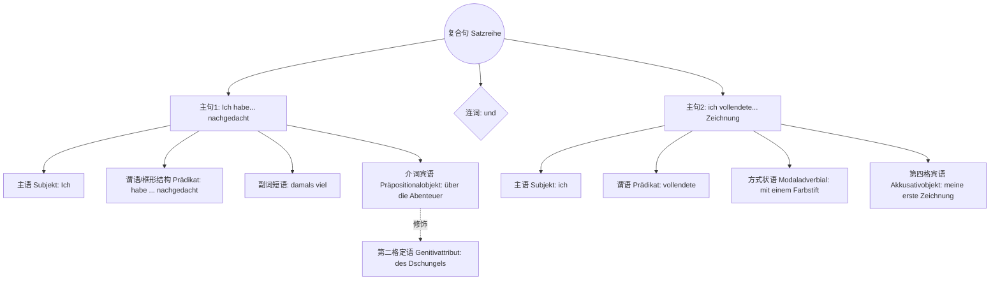

# 20260415

**【一】 句子翻译与句型判定**

**德语原句：**

Ich habe damals viel über die Abenteuer des Dschungels nachgedacht, und ich vollendete mit einem Farbstift meine erste Zeichnung.

**中文翻译：**

我当时对丛林历险想了很多，并用彩色铅笔完成了我的第一幅画。

**句式判定：**

这是一个由连词“und”（和/并）连接的**并列复合句**（Satzreihe）。前后分别是两个地位平等的独立主句（Hauptsatz）。

---

**【二】 全局句法分析（语法框架图解）**

为了让你直观地看到这个长句是如何拼接起来的，我们先用一张逻辑树状图来拆解它的骨架（你可以把它想象成一棵树的主干和分支）：

代码段

通过上面的图表我们可以看出，德国人说话非常有逻辑感，积木是一块块拼上去的。接下来我们深入到每一个单词的微观层面。

---

**【三】 逐词深度解析与变格变位推导**

**前半句：Ich habe damals viel über die Abenteuer des Dschungels nachgedacht**

- **Ich**：人称代词（Personalpronomen），第一人称单数，**第一格/主格（Nominativ）**。它是动作的发起者。
- **habe**：助动词（Hilfsverb）。原型是 _haben_。这里是现在时第一人称单数变位。它不表原意“有”，而是配合句末的二分词构成**现在完成时（Perfekt）**。
- **damals**：时间副词（Temporaladverb），表示“当时、那时”。
- **viel**：数量副词/不定代词（Adverb/Indefinitpronomen），表示“很多”。
- **über**：介词（Präposition）。这是一个非常关键的介词，它和句末的动词构成固定搭配 _nachdenken über + 第四格（Akkusativ）_，表示“思考/回想某事”。
- **die**：定冠词（Bestimmter Artikel）。因为 _über_ 在这里支配第四格，且 _Abenteuer_ 是复数，所以定冠词用复数第四格形式 _die_。
- **Abenteuer**：名词（Substantiv）。原型 _das Abenteuer_（中性名词，意为“冒险”）。这里是复数形式（单复数同形），在句中作第四格宾语。
- **des**：定冠词（Bestimmter Artikel）。这里是阳性单数、**第二格/属格（Genitiv）**。
- **Dschungels**：名词（Substantiv）。原型 _der Dschungel_（阳性名词，意为“丛林”）。单数第二格词尾需要加 _-s_。
    - _💡 语法类比（第二格的奥秘）：_ 你可以把“第二格”想象成一枚“主权印章”。“des Dschungels”（丛林的）就像是给前面的“Abenteuer”（冒险）盖了个章，标明这些冒险是属于丛林的。这和中文里的“……的”功能完全一致。
- **nachgedacht**：动词的第二分词（Partizip II）。原型是可分动词 _nachdenken_（思考）。
    - _💡 语法类比（框形结构）：_ 德语特有的“框形结构”（Satzklammer）。把句首的助动词 **habe** 和句末的二分词 **nachgedacht** 想象成一个大大的“画框”或者一个“拥抱”。它们分别站在句子的第二位和最后一位，把中间的时间（damals）、数量（viel）、宾语（über...）稳稳地“框”在中间。这种结构让德语句子极其严密，听到最后一个词你才能知道对方到底干了什么！

**连接词**

- **und**：连词（Konjunktion）。连接两个平行的主句，它在德语语序中“占位为 0”（不影响后面的词序，主语依然可以放在紧挨着它的位置）。

**后半句：ich vollendete mit einem Farbstift meine erste Zeichnung.**

- **ich**：人称代词，第一格作主语。
- **vollendete**：动词（Verb）。原型 _vollenden_（完成）。这里是**过去时（Präteritum）**第一人称单数。（注意前缀 _voll-_ 是不可分的）。前半句用完成时表口语化的回忆，后半句用过去时带有文学描述的色彩。
- **mit**：介词（Präposition）。**永远支配第三格（Dativ）**。表示“用、带着”。
- **einem**：不定冠词（Unbestimmter Artikel）。由于 _mit_ 支配第三格，且 _Farbstift_ 是阳性名词，所以变为阳性第三格形式 _einem_。
    - _💡 语法类比（霸道的 mit）：_ “mit”就像一个拥有绝对权力的“霸道总裁”或“强力磁铁”。只要它一出场，不管后面的名词原本有多高傲，都必须乖乖换上“第三格”的制服（比如 _ein_ 必须穿上带有 _m_ 尾巴的 _einem_）。
- **Farbstift**：名词（Substantiv）。原型 _der Farbstift_（阳性，彩色铅笔）。由 _die Farbe_（颜色）+ _der Stift_（笔）复合而成。这里是单数第三格。
- **meine**：物主代词（Possessivartikel）。意为“我的”。因为后面的词是阴性第四格，所以加上词尾 _-e_。
- **erste**：形容词作序数词（Adjektiv/Ordinalzahl）。原型 _erst-_。在物主代词 _meine_ 后面，形容词发生**混合变化（弱变化）**，阴性第四格词尾加 _-e_。
- **Zeichnung**：名词（Substantiv）。原型 _die Zeichnung_（阴性，画作/素描）。在句中直接作为 _vollendete_ 的第四格宾语。

---

**【四】 随堂自我测试 (Wissenstest)**

为了确保你已经完全掌握了上述的知识点，请尝试完成以下两个小挑战。

**挑战 1：固定搭配应用**

如果在写作文时，你想表达“我经常思考**这个决定**”（die Entscheidung, 阴性名词），请模仿前半句的结构（使用 _nachdenken über_ 的现在完成时），你会怎么写？

提示词：Ich (主语) / haben (助动词) / oft (经常) / über ... / nachdenken.

**挑战 2：霸道介词大变身**

后半句说“用一支彩笔 (mit einem Farbstift)”。如果你现在要表达“用**一台相机**”完成画作，该怎么变化？

已知：相机 = _die Kamera_（阴性名词）。请写出“mit + 一台相机（不定冠词）”的正确变形。

_(你可以先在脑海中思考答案，或者将你的解答回复给我，我很乐意为你批改！)_
