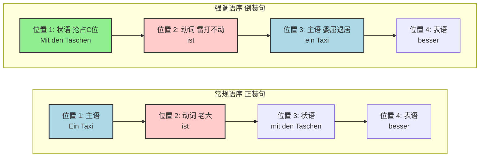

Guten Tag！你好呀，未来的德国居民！欢迎来到“德语大师”的语法解剖室。

你提出的这个问题非常有价值，它恰恰踩中了许多中国学生在冲击 B 1/B 2 阶段时的一个“认知门槛”。我们习惯了中文和英文里雷打不动的“主语 + 动词”顺序，所以一遇到德语的“乾坤大挪移”，大脑就会短暂宕机。

不要慌，今天大师就带你用最接地气的方式，彻底打通这个语法任督二脉！

我们先干脆利落地回答你的几个问题：

1. **这是倒装句吗？** 是的，这是一句非常标准的**倒装句（Inversion）**。
2. **主语是不是很难分辨？** 对初学者来说确实容易眼花，但只要掌握了“抓贼先抓王”的技巧，它其实无处遁形。这句话的主语是 **ein Taxi**。
3. **这是“系动词+形容词”结构吗？** 完全正确！这就相当于英语里的主系表结构（be + adj.），德语里是 **sein + Adjektiv**。

下面，我们来一层层剥开它的外衣，看看德语的句子骨架到底是怎么长的。

---

### 🔍 第一步：认清主语

在中文和英文里，坐在句子最开头（第一把交椅）的，99%都是老大（主语）。
**但在德语里，坐在第一位的不一定是老大，有可能是个“抢座的”！**
ID: 1774612233511

你看这句话：`Mit den Taschen ist ein Taxi besser!`
如果你按中文思维去翻译：“带着这些包，是一个出租车，更好！” 听起来怪怪的对吧？

**德语大师的“抓主语”秘籍：**

1. **看格（Kasus）：** 主语**必须**且**永远**是**第一格（Nominativ）**！
2. **排雷：** ==介词短语**绝对不可能**做主语==！在德语中，介词就像手铐，被介词带上的词（比如这里的 `Mit den Taschen`，mit 要求跟第三格 Dativ），就已经失去了竞争主语的资格。它只是一个条件状语（带着这些包的情况下）。
3. **找动词的心上人：** 动词是 `ist`（sein 的第三人称单数），谁能和它般配？只有单数的第一格名词。毫无疑问，**ein Taxi**（一辆出租车）就是真正的主语。

所以，这句话的直译是：**（在）带着这些包（的情况下），一辆出租车（是）更好的！**

---

### 🧱 第二步：图解掌握“倒装句”的核心法则（V 2 原则）

为了在 6 个月内达到 B 2 水平，你必须将德语句子的一个铁律刻在 DNA 里：**动词第二位原则（V 2-Regel）**。
ID: 1774612233517

在德语陈述句这列火车里，座位安排有着森严的等级制度：

* **2 号 VIP 专座：** 永远属于**变位动词**（这里是 `ist`）。天打雷劈它都不能挪窝。
* **1 号舞台 C 位：** 这是一个“共享单车”座位，谁都可以坐！如果你想强调主语，主语就坐这；如果你想强调时间、地点或者条件，状语也可以一屁股坐上来。
* **3 号备用座：** 如果 1 号位被状语（比如 `Mit den Taschen`）抢走了，**主语受了委屈，必须紧紧贴在动词的屁股后面**，也就是坐在第 3 位。这就形成了**倒装**！

应你的要求，大师为你生成了一张直观的结构图，一看就懂：

*（粉色代表绝对不可移动的动词，蓝色代表主语，绿色代表被强调的状语）*

德国人为什么要这么说话呢？**为了强调！**
如果你说 `Ein Taxi ist mit den Taschen besser.` 听起来像一杯白开水。
但你说 `Mit den Taschen ist ein Taxi besser!` 就仿佛在向同伴抱怨：“哥们，**拎着这么多包啊**，咱们还是打车吧！” 情感色彩瞬间拉满，这就是地道德语（B 2 水平）的体现。

---

### 💼 第三步：B 2 冲刺与移民场景实战练习

在德国的移民生活中（比如租房、看病、找工作），如果你能熟练使用这种“把条件/时间/地点放在句首”的倒装句，德国人会觉得你的德语非常自然、高级。
ID: 1774612233522

我们来看看这属于你的“系动词+形容词”结构在实际生活中的应用：

**场景 1：租房（强调条件）**

* 正装：Die Wohnung ist **ohne Balkon** zu teuer.  (这房子没阳台太贵了。)
* **地道倒装：Ohne Balkon** ist die Wohnung zu teuer.  (**连个阳台都没有**，这房子太贵了！)

**场景 2：看医生（强调身体状况）**

* 正装：Ich bin **mit diesen Schmerzen** sehr müde. (我带着这些疼痛非常累。)
* **地道倒装：Mit diesen Schmerzen** bin ich sehr müde. (**疼成这样**，我真的好累。)

**场景 3：职场面试（强调时间）**

* 正装：Ich bin **ab nächstem Monat** verfügbar. (我下个月起可以入职。)
* **地道倒装：Ab nächstem Monat** bin ich verfügbar. (**从下个月起**，我就可以入职。)

---

### 🗺️ 给你的“半年 B 2 通关”小建议

你目前已经开始敏锐地察觉到德语句法和中英文的不同，这是一个极好的现象。在接下来的 6 个月里：
ID: 1774612233527

1. **前 2 个月（稳固 B 1）：** 大量练习这种“把非主语成分扔到句首”的倒装句，打破中文思维的肌肉记忆。
2. **中间 2 个月（迈向 B 2）：** 开始把句首的状语（如 `Mit den Taschen`）替换成一整个从句（如 `Weil wir so viele Taschen haben, ist ein Taxi besser.` 因为我们包太多，打车更好）。你会发现，规则是一模一样的！从句占据了第一位，主句必须紧跟动词！
3. **最后 2 个月（冲刺应试）：** 熟练运用被动语态和虚拟式，结合复杂句型进行口语输出和写作。

**来，大师现在给你布置一个小任务，检验一下学习成果：**
假设你在外管局（Ausländerbehörde）办事，你想表达：“**在这个时间（Um diese Uhrzeit），外管局已经关门了（geschlossen）。**”
*(提示：外管局 = die Ausländerbehörde, 是 = ist)*

请试着把“在这个时间”放在句首，用今天学到的**倒装句结构**和**主系表（be+adj）结构**造一个句子。告诉我你的答案，我们一起来看看！