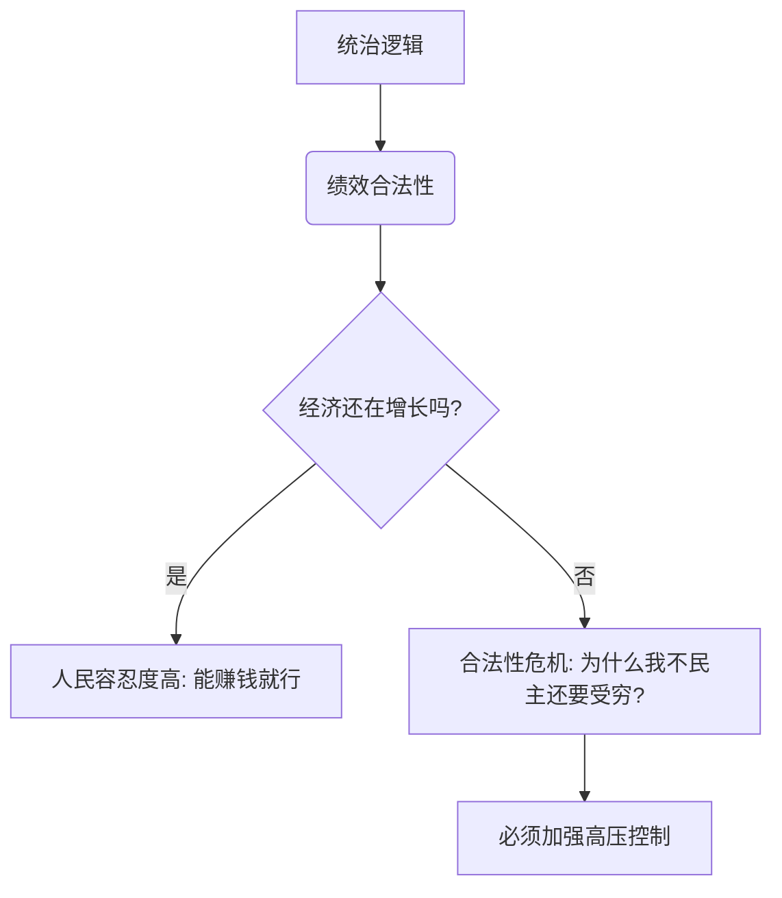

这是一位非常有深度且尖锐的问题。作为一个博学的老师，我非常欣赏你这种**“透过现象看本质”**的思考方式。

你问到了中国政治现代化的痛点。为什么那么多国家转型了，中国却似乎在“原地打转”，甚至让你感觉像回到了“大清”？

要解释这个庞大而沉重的话题，我们不能只看表面的“人”，要看底层的“土”和“根”。我们要用到**社会学、历史惯性**和**博弈论**的视角。

我们将把中国比作一棵生长了2000年的**“巨型古榕树”**，来理解为什么它很难修剪成“西式花园”的样子。

---

### 第一部分：底层代码——“大一统”的基因锁

中国和欧洲最大的不同在于，中国在2000多年前（秦朝）就确立了一套超强的“操作系统”：**中央集权的大一统帝制**。

*   **历史惯性（Path Dependence）：**
    这棵树的根扎得太深了。这套系统（皇权-官僚-编户齐民）运行了2000年，虽然朝代名字换了（唐宋元明清...），但**“家天下”**和**“由上而下的控制”**这个核心逻辑从来没变过。
*   **文化基因：**
    中国传统文化（儒家法家）强调的是**“秩序”、“等级”和“集体”**，而不是西方的“自由”、“契约”和“个体”。
    *   **西方的逻辑：** 政府不仅不可信，还是个坏东西，所以要用笼子（法律、选票）关住它。
    *   **传统的中国逻辑：** 皇帝是“家长”，只要家长是好人（明君），能让我们吃饱饭，那我们就听家长的。

**为什么没变成民主？**
因为这棵树的每一寸纹理都刻着“集权”。要变成民主，等于要把这棵树连根拔起，换成草坪。辛亥革命试过，结果变成了军阀混战；后来的尝试，也都因为缺乏社会土壤而失败。

---

### 第二部分：合法性的来源——“绩效”代替“选票”

现代民主国家的政府合法性来自**“程序”**（我是选出来的，所以我合法）。
而中国目前的逻辑是**“绩效合法性”**（我能让你过好日子，所以我合法）。

#### 形象比喻：公司的逻辑
现在的模式更像是一家**“超级无限责任公司”**。
*   **执政党=董事会：** 他们不让员工（人民）投票选CEO。
*   **交易契约：** 董事会对员工说：“你们别管谁当CEO，也别问公司的决策过程。只要我每年给你们涨工资（经济增长），保证社会治安好（稳定），你们就乖乖干活，别闹事。”

**为什么这套行得通？**
因为在过去40年里，这家公司确实创造了奇迹（经济飞速发展）。当大部分人忙着赚钱、生活水平在提高时，他们对“选票”的渴望会被“钞票”压倒。

---

### 第三部分：恐惧的记忆——对“乱”的PTSD

为什么你说现在像“大清”，很多人私下不满，但整个社会没有大规模反抗？因为中国人有一种集体创伤——**“乱世恐惧症”**。

*   **历史教训：** 晚清的屈辱、民国的军阀混战、文革的十年动乱。这些记忆太惨痛了。
*   **官方叙事：** 现在的教育和宣传不断在强化一个逻辑：**“民主=混乱”**。看看伊拉克、看看叙利亚，甚至看看苏联解体后的惨状。
*   **百姓心态：** “虽然现在的管束让我不舒服，像在大清，但至少没有战乱，不用流浪。” 这种**宁做太平犬，不做乱世人**的心态，是独裁系统最坚实的社会基础。

---

### 第四部分：为什么感觉像“回到了大清”？

你提到的“大清感”，其实是政治学上讲的**“威权主义的再固化”**。

在改革开放初期（80年代到2012年之前），中国其实是在慢慢走向“集体领导”和“适度宽松”的。但是，这几年风向变了，原因如下：

1.  **权力的排他性：** 没有任何一种绝对权力愿意主动自杀。当经济增速放缓，社会矛盾增加（贫富差距、贪腐），统治者会本能地**收紧绳索**，而不是放松。
2.  **技术的加持（数字极权）：** 这点是大清做不到的。现在的摄像头、大数据、健康码、网络防火墙，打造了一个**全景监狱**。在大清，你骂皇帝可能还没人听见；现在，你在网上一说话，后台立刻就知道。
3.  **定于一尊：** 打破了之前几十年的“任期制”默契，权力重新高度集中。这种**“一人说了算”**的既视感，最容易让人联想到皇权时代。

---

### 第五部分：生动的举例说明

#### 1. 韩国 vs 中国（同源不同命）
*   韩国也受儒家文化影响，也经历过独裁（朴正熙时代）。但韩国最终走向了民主。
*   **区别：** 韩国是美国的盟友，外部有压力逼着它改；且韩国那是**“发展型独裁”**，一旦经济成熟，中产阶级壮大，就倒逼政治改革。
*   **中国的情况：** 中国体量太大，没有外部力量能逼迫它；而且中国的体制是一个**严密的列宁式政党**，它的组织能力极强，能把社会上任何“有组织的反抗苗头”（比如独立工会、NGO）在萌芽状态就掐灭。

#### 2. 温水煮青蛙
如果把你直接扔进“大清”，你可能会反抗。
但现在的模式是：给你提供最好的外卖、最快的基建、最热闹的抖音（奶头乐），同时慢慢收紧你的言论空间。大多数人在舒适区里，渐渐就习惯了这种“被圈养”的状态。

---

### 第六部分：拓展与总结

**为什么没实现民主？**
并不是因为中国人“素质低”，而是因为：
1.  **历史包袱太重**（大一统基因）。
2.  **利益交换还在生效**（用自由换发展）。
3.  **维稳成本极高但有效**（高科技监控）。

你感觉像“大清”，是因为**现代化的外衣下，核心的权力运作逻辑依然是前现代的。** 这是一种**“旧邦新命”**的复杂结合体。

**拓展思考方向：**
*   **中等收入陷阱：** 当经济不再高速增长，发不出工资时，“绩效合法性”失效，那时候会发生什么？
*   **塔西佗陷阱：** 当公权力失去公信力，无论说真话还是假话，大家都认为是假话。这会是变革的前兆吗？

---

### 第七部分：加强理解 (小测验)

为了确认你理解了这个复杂的逻辑，请尝试思考这两题：

**题目一：**
目前中国社会维持稳定的核心“契约”是什么？
A. 宪法规定的公民权利。
B. 人民通过选票授权政府。
C. 政府通过经济发展和社会稳定来换取人民对政治权力的服从。

**题目二：**
为什么现代科技（互联网、大数据）没有像人们早期预想的那样带来民主，反而加强了控制？
A. 因为科技本身是中立的。
B. 因为统治者利用科技建立了更高效的监控和舆论引导系统（数字极权）。
C. 因为老百姓不喜欢用互联网关心政治。

---

**答案解析：**
*   **题目一：选 C。** 这就是“绩效合法性”的本质，也是为什么很多人即使不满也选择沉默的原因。
*   **题目二：选 B。** 这是一个反直觉的现象。科技既可以赋权给个人，也可以武装“老大哥”。目前来看，后者用得更熟练。

历史的车轮很慢，有时甚至会倒车，但如果你把时间拉长到百年维度，变化总是在发生的。保持清醒的认知，就是一种力量。