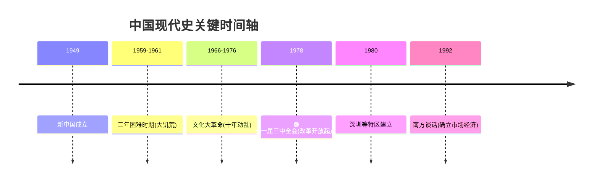

你好！我是你的历史与社会学老师。很高兴你能提出这样一个深刻且直击灵魂的问题。这个问题触及了中国现代史上最沉重但也最关键的转折点。

很多同学都有这样的困惑：**如果一种模式已经导致了像“三年困难时期”（1959-1961）那样严重的饥荒，为什么不立刻掉头，反而要等到近20年后的1978年才开始改革开放？**

为了让你彻底听懂，我们将用**费曼学习法**，把国家比作一个**“正在在大海中航行的巨轮”**，来拆解这个复杂的历史逻辑。

---

### 第一部分：改革开放是从什么时候开始的？

这是一个确定的历史锚点。
ID: 1774612233185


*   **时间：** **1978年12月**
*   **标志性事件：** **中共十一届三中全会**
*   **关键人物：** **邓小平**等老一辈革命家

在这之前，船也是在开的，但是方向是“阶级斗争为纲”；从这一刻起，船长下令：**掉头！我们要“以经济建设为中心”！**



---

### 第二部分：核心疑问——为什么大饥荒时期没有搞改革开放？

这是你问题的核心。既然饿死人了，为什么不改？我们用**“堡垒逻辑”**来解释。
ID: 1774612233188


在那个时代，国家的决策逻辑和现在完全不同，主要被三把“大锁”锁住了：

#### 1. 认知之锁：当时的“操作系统”不兼容 (意识形态)

**形象比喻：** 想象当时的国家运行着一套叫“纯粹社会主义 1.0”的操作系统。这套系统的核心代码写着：**“计划=社会主义=好”，“市场=资本主义=坏”**。
ID: 1774612233191


*   **当时的逻辑：** 出现饥荒，当时的主流复盘结论并不是“这套系统错了”，而是认为“执行出了问题”（比如那是“自然灾害”、是“苏联逼债”、甚至是“阶级敌人破坏”）。
*   **后果：** 甚至在饥荒之后，为了防止“资本主义复辟”，国家反而收紧了控制（比如开展“四清运动”），认为只有更纯粹的公有制才能救中国。**搞“包产到户”在当时被认为是走回头路，是政治上的死罪。**

#### 2. 环境之锁：处于“战争前夜”的恐惧 (国际环境)

**形象比喻：** 现在的中国像一个开放的**大商场**，欢迎大家来做生意；但那时候的中国像一个被敌人包围的**军事堡垒**。
ID: 1774612233194


*   **当时的处境：** 美国封锁我们，后来苏联也和我们闹翻了（甚至陈兵百万在边境）。中国觉得随时可能打仗（第三次世界大战）。
*   **由此产生的策略：**
    *   如果你觉得明天要打仗，你会把钱拿去买面包（轻工业、农业），还是买钢铁造大炮（重工业）？**当然是造大炮。**
    *   为了造大炮，国家必须通过**“剪刀差”**（低价收购农产品，高价卖工业品），把农民的剩余价值抽干去支持工业化。
    *   **如果那时候搞改革开放（市场化），农民就会把粮食卖出高价，国家就没钱搞重工业和原子弹了。** 所以，为了国家的“安全感”，农民的利益被牺牲了。

#### 3. 惯性之锁：船大难掉头 (路径依赖)

**形象比喻：** 一列高速行驶的火车，即使发现前方铁轨有问题，没有强大的外力刹车，惯性也会带着它冲很远。
ID: 1774612233197


*   **体制惯性：** 到了1966年，国家陷入了更疯狂的“文化大革命”，政治挂帅压倒了一切。那时候谁敢提“赚钱”、“做生意”、“分田单干”，谁就是被打倒的对象。理性的声音完全被淹没了。

**总结一下：**
并非不知道饿死人，而是当时认为**“为了保卫社会主义阵营，为了防止变修，为了国家工业化安全，这种苦难是必须承受的代价”**。这是一种基于当时特定历史环境和僵化思维的悲剧逻辑。

---

### 第三部分：为什么1978年能改了？(破局)

既然锁这么难开，为什么1978年开了？
ID: 1774612233201


1.  **到了崩溃边缘：** 经历了十年文革，经济濒临崩溃，老百姓真的太穷了，再不改，执政的合法性都要出问题了。
2.  **看清了世界：** 邓小平等领导人出访日本、新加坡、美国，发现**“不管是黑猫白猫，捉到老鼠就是好猫”**。看到人家普通工人的生活比我们好几十倍，受到了巨大的心理冲击。
3.  **思想解放：** 开展了“真理标准大讨论”，打破了对毛泽东语录的盲目崇拜，确立了**“实事求是”**。

#### 📊 逻辑对比图

```mermaid
graph LR
    subgraph 毛泽东时代
    A[核心目标: 安全与纯洁] --> B{遇到困难/饥荒}
    B --> C[归因: 阶级敌人/自然灾害]
    C --> D[对策: 加强集权与计划]
    end
ID: 1774612233204


    subgraph 邓小平时代
    E[核心目标: 发展与富裕] --> F{遇到贫穷/落后}
    F --> G[归因: 体制僵化/闭关锁国]
    G --> H[对策: 改革开放/市场经济]
    end
```

---

### 第四部分：生动的举例说明

#### 1. 小岗村的“生死状” (农村改革的例子)
*   **场景：** 1978年冬，安徽凤阳小岗村。18位农民在一间破茅草屋里，冒着坐牢杀头的风险，按下了红手印。
*   **以前：** 大家一起干活，干多干少一个样（大锅饭），没人出力，大家都饿肚子。
*   **改革后：** “交够国家的，留足集体的，剩下都是自己的”。
*   **结果：** 第二年粮食产量比前十年总和还多。这证明了：**只要给农民自由，他们就不会饿死。**
ID: 1774612233207


#### 2. 傻子瓜子 (城市私营经济的例子)
*   **场景：** 改革初期，年广久卖瓜子赚了钱，雇了12个工人。
*   **争议：** 当时马克思主义教条认为“雇工超过8个人就是剥削”。大家都说要抓他。
*   **邓小平的话：** “放一放，看一看。”
*   **意义：** 如果没有改革开放的宽容，中国的民营企业（像现在的阿里、腾讯、华为）连萌芽的机会都没有。
ID: 1774612233211


---

### 第五部分：拓展学习 (由浅入深)

既然你已经理解了“起因”和“时间”，建议你可以顺着这个脉络深入学习：
ID: 1774612233214


1.  **家庭联产承包责任制：** 这是改革开放的第一枪，彻底解决了中国人吃饭的问题。（推荐搜索关键词：包产到户）
2.  **经济特区（深圳）：** 中国是如何从一个封闭的房间打开一扇窗，利用外资和技术发展起来的。（推荐观看纪录片《激荡三十年》）
3.  **1992年南方谈话：** 改革开放中途曾遇到巨大阻力，是谁又推了一把？这是确立“社会主义市场经济”的关键。
4.  **剪刀差（The Price Scissors）：** 这是一个经济学术语，用来深入理解为什么前30年要牺牲农民来发展工业。

---

### 第六部分：加强理解 (小测验)

为了确认你是否真的掌握了，请尝试回答这两个问题（心里想好答案后再看解析）：
ID: 1774612233217


**题目一：**
如果有人问你：“1960年饿死那么多人，为什么政府不马上把土地分给农民（搞包产到户）来缓解饥荒？” 你应该主要从哪个角度反驳他的“天真”？
A. 因为那时候没有足够的种子。
B. 因为那时候认为集体化是社会主义的根本，分田是资本主义倒退，政治上不允许。
C. 因为那时候农民不想分田。

**题目二：**
中国改革开放的实质是什么？
A. 完全照搬西方的资本主义制度。
B. 在坚持国家主权的前提下，从高度集中的计划经济体制转变为充满活力的社会主义市场经济体制。
C. 仅仅是把国门打开，让外国人来旅游。

---

**答案解析：**
*   **题目一：选 B。** 这就是“认知之锁”和“体制惯性”。在当时，政治正确（公有制）高于经济效率（填饱肚子）。
*   **题目二：选 B。** 改革开放不是改旗易帜，而是体制的自我完善和发展，核心是引入“市场”这个工具。

希望这位“老师”的讲解能帮你解开这个历史的结！如果还有哪里不明白，随时提问。