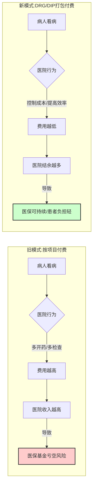
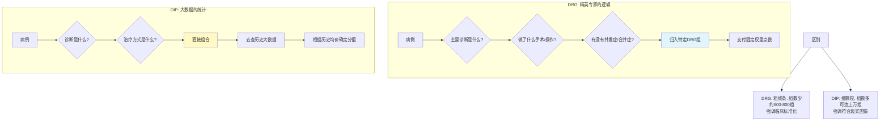

---
aliases:
  - DRG
  - DIP
  - 疾病诊断相关分组
  - 按病种分值付费
---
你好！很高兴能为你讲解这个医疗行业最热门，也最“硬核”的话题。
为了让你听得懂、记得住，我们把复杂的医疗术语抛在一边，先带你去**“下馆子”**。

---

### 第一部分：为什么要有 DRG/DIP？（从“点菜”说起）

以前，我们去医院看病，医保支付的方式叫做**“按项目付费”**（Fee-For-Service）。

> **🍟 形象比喻：单点模式（A la carte）**
> *   你去餐厅，点一盘土豆丝20块，点一碗米饭5块，还要收餐位费。
> *   **餐厅的逻辑：** 既然多卖多得，那我肯定推荐你吃鲍鱼龙虾，还要你多加两个菜，哪怕你吃不完。
> *   **结果：** 医院为了多赚钱，可能会“大处方”、“大检查”，医保基金（大家的救命钱）很快就不够用了。

现在，国家为了控制成本，推出了 **DRG** 和 **DIP**。这两种都属于**“按病种/打包付费”**。

> **🍱 形象比喻：自助餐或套餐模式（Set Menu）**
> *   医保局对医院说：“治疗阑尾炎，我只给你打包价 5000 块。不管你给病人用了多少药，做了多少检查，我就给这么多。”
> *   **医院的逻辑：** 既然收入是固定的，那我必须**省着花**。能用国产药就不用进口药，能不做的检查就不做。如果成本控制在 4000 块，医院就赚 1000；如果花超了变成 6000，医院就要自己亏 1000。
> *   **结果：** 倒逼医院提升效率，降低成本。

为了直观理解这个转变，请看下图：

---

### 第二部分：DRG 和 DIP 到底是什么？有何区别？

虽然它们都是“打包付费”，但打包的**逻辑**完全不同。

#### 1. DRG (Diagnosis Related Groups) —— 疾病诊断相关分组

DRG 是源自美国的“舶来品”，它是**基于临床规律**的分组。

*   **核心逻辑：** **“同病同治同价”**。它把临床表现相似、资源消耗相近的病例归为一类。
*   **怎么分？**
    1.  先看你得的什么病（诊断）；
    2.  再看你怎么治的（手术还是吃药）；
    3.  最后看你有没有并发症、年龄多大（严重程度）。
*   **比喻：** 就像**汽车分级**。不管你是哪个厂家生产的，只要是“紧凑型轿车”，市场指导价就在这个范围；如果是“豪华SUV”，价格就在那个范围。这是由**车的属性**决定的。

#### 2. DIP (Big Data Diagnosis-Intervention Packet) —— 按病种分值付费

DIP 是**中国原创**的，它是**基于大数据**的分组。

*   **核心逻辑：** **“现实中怎么治，我就怎么付”**。它不完全看医学理论，而是看过去几年几百万个病例的真实数据。
*   **怎么分？**
    1.  疾病诊断 + 治疗方式 = 一个组。
    2.  利用大数据计算这个组在过去平均花了多少钱（多少分）。
*   **比喻：** 就像**大众点评的人均消费**。系统不分析这道菜的烹饪原理，而是统计过去一年，1万个人来吃“阑尾炎切除”这个套餐，平均花了多少钱。如果大家都花5000，那标准就是5000。

#### 3. 核心区别图解

---

### 第三部分：对我们有什么影响？

这不仅仅是医院财务科的事，它影响每一个人。

#### 👨‍⚕️ 对医生/医院的影响：
1.  **技术为王：** 以前靠卖药赚钱，现在靠**  “技术好、好得快、花钱少”**赚钱。
2.  **病案首页：** 医生必须把病历写得非常标准，写错一个代码，医保可能就不给钱了。
3.  **推诿重患风险：** 医院可能会不想收治病情特别复杂、注定要亏钱的病人（虽然国家有“特例单议”机制来防止这点）。

#### 🤒 对患者的影响：
1.  **少做检查：** 没必要的检查，医生主动就不给你开了。
2.  **住院天数变短：** 医院希望你尽快康复出院，好周转床位。
3.  **费用降低：** 总体看病负担会减轻。
4.  **担心：** 患者可能会担心医生为了省钱，该用的好药不用（这需要监管介入）。

#### 🏛️ 对医保/国家的影响：
1.  **每一分钱花在刀刃上：** 医保基金穿底的风险变小了。
2.  **数字化治理：** 倒逼整个医疗行业的数据标准化。

---

### 第四部分：总结与展望

**一句话总结：**
**DRG是“按照书本看病”，追求标准；DIP是“照着数据看病”，追求实际。**
它们都是为了把以前的“糊涂账”变成“明白账”，让医院从**“做大规模”**转向**“做强内涵”**。

目前，中国大部分城市已经在推行 DRG 或 DIP，这是医疗改革的必经之路。

---

### 📚 拓展学习：从浅入深

如果你对这个话题感兴趣，可以按照以下路径进一步学习：

#### 🟢 第一阶段：基础概念（小白级）
*   **ICD-10 与 ICD-9-CM3：** 这是DRG/DIP的“语言”。了解疾病诊断编码和手术操作编码是怎么回事。
*   **病案首页：** 了解出院小结和病案首页包含哪些信息，为什么它是医保结算的凭证。

#### 🟡 第二阶段：运营管理（进阶级）
*   **RW（相对权重）与 CMI（病例组合指数）：**
    *   *RW*：这个病这就好比这个病的“难度系数”。
    *   *CMI*：代表一个医院治疗疑难杂症的整体能力。CMI越高，医院越牛。
*   **临床路径（Clinical Pathway）：** 医院为了适应DRG，必须制定标准化的治疗流程图。

#### 🔴 第三阶段：宏观与技术（专家级）
*   **费率与点值法：** 了解医保局是如何确定每个点数由于多少钱的（通常是区域总预算/总分值）。
*   **医保监管与反欺诈：** 学习医院可能出现的“高套编码”（把轻病写成重病骗保）以及医保局的对策。
*   **价值医疗（Value-based Healthcare）：** 思考支付方式改革的终极目标——以患者的健康结果为导向，而不仅仅是控制成本。

