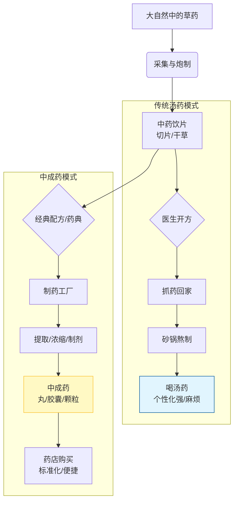

---
aliases:
  - Proprietary Chinese Medicines
  - PCM
---

你好！今天我们来聊聊大家日常生活中非常熟悉，但可能不完全了解的朋友——**中成药**。

如果把传统的中医看病抓药比作**“去菜市场买菜回家自己炖汤”**，那么中成药就是**“超市里的自热火锅”或者“美味罐头”**。它既保留了中药的灵魂，又披上了现代工业的便捷外衣。

---

### 1. 什么是中成药？
**中成药（Proprietary Chinese Medicines）**，顾名思义，就是以**中草药**为原料，经过加工制作，变成了**现成**可用药物。

它有三个核心特点：
1.  **有配方**：不是随便乱炖，而是依据经典的医生处方或药典配方。
2.  **有工艺**：经过特定的工业生产流程（提炼、浓缩、制形）。
3.  **有剂型**：不再是你要回家熬的一包草，而是变成了药丸、胶囊、口服液、贴膏等。

#### ⚡️ 生动比喻：
*   **中药饮片（草药）**：像**面粉和馅料**。医生给你配好，你回家得自己包饺子、自己煮（熬药），火候掌握不好还影响口感和疗效。
*   **中成药**：像**速冻饺子**。工厂已经按标准比例包好了，甚至煮熟了，你买回家热一下或者直接吃就行，方便快捷，标准统一。

---

### 2. 从多角度拆解中成药
为了让你更透彻地理解，我们从**形态、命名、优缺点**三个角度来看。

#### **① 形态万千（剂型）**
古人说“丸散膏丹，神仙难辨”，现在的中成药形式更多了：
*   **丸（Wán）**：药材磨粉加粘合剂做成的圆球。特点是**吸收慢，药效持久**。比如*六味地黄丸*。
*   **散（Sǎn）**：粉末状。特点是**吸收快**。比如*蒙脱石散*（虽然它是西药，但形态类似）。
*   **颗粒（Kēlì）**：像速溶咖啡一样，冲水即化。比如*感冒灵颗粒*。
*   **口服液/注射液**：现代工艺提纯，浓度高，起效快。比如*生脉饮*。

#### **② 名字里的秘密**
中成药的名字通常藏着它的成分或功效，就像“剧透”一样：
*   **按成分**：*板蓝根颗粒*（主要成分是板蓝根）。
*   **按功效**：*速效救心丸*（告诉你它快，还能救心）。
*   **按数量+主药**：*六味地黄丸*（由六种药组成，地黄是老大）。

#### **③ 优缺点大PK**
*   **优点**：
    *   **便携**：不用背着药罐子跑。
    *   **口感好**：很多中成药加了糖衣，比苦涩的汤药好喝。
    *   **质量稳**：工业化生产，每颗药的含量基本一致。
*   **缺点**：
    *   **灵活性差**：中医讲究“一人一方”，汤药可以根据你今天的状态加减两味药，中成药是固定的，没法微调。
    *   **不对证无效**：很多人以为中成药副作用小就随便吃，但如果“寒包火”的感冒吃了治“风寒”的药，反而会加重。

---
### 中成药产品的核心特点 辨别

- 标准化制剂：固定处方、固定工艺、批次一致性；质量受《中国药典》和生产GMP要求约束。
- 多成分、多靶点：常由多味中药组成，强调“君臣佐使”的协同作用，药理机制往往是多通路综合效应。
- 剂型丰富：丸、散、片、颗粒、胶囊、口服液/合剂、软胶囊、喷剂、膏药、栓剂、滴眼剂等，少数为注射剂（过敏风险较高，需谨慎）。
- 标签与监管：包装上有通用名/商品名、批准文号“国药准字Z…”，OTC标识（红：甲类；绿：乙类）或处方药Rx，生产批号与有效期。
- 质量控制与检测：常用指纹图谱、Q-marker（质量标志物）、HPLC/GC-MS、微生物限度、农残/重金属/黄曲霉毒素等。

与中药饮片/汤剂的区别

- 中药饮片/汤剂：医生辨证后个体化开方，现场煎煮，灵活度高但稳定性和便利性较差。
- 中成药：处方固定、工业化生产，便携稳定，适合常见病自我药疗或慢病辅助；但个体化程度较低，需按说明书使用。

常见例子

- 感冒/暑湿：藿香正气胶囊（或水）、连花清瘟胶囊、板蓝根颗粒
- 消化类：健胃消食片、归脾丸
- 心脑血管：复方丹参滴丸
### 3. 图解：中药的变身之旅
我们用 Mermaid 图表来看看，一株草药是如何变成中成药的，以及它和传统汤药的区别。

---

### 4. 总结
中成药是**传统中医理论与现代制药技术的结晶**。它让中医不再局限于苦涩的药汤，变得触手可及。但请记住，**中成药也是药**，它依然遵循中医“辨证论治”的原则。就像这把钥匙必须插对锁孔，药才能治病。

---

### 5. 拓展学习：由浅入深
如果你对中成药感兴趣，可以按照这个路径继续探索：

1.  **入门知识（生活实用）**：
    *   **OTC 标志**：观察药盒上的 OTC（非处方药）标志，分清红底（甲类，需药师指导）和绿底（乙类，更安全）。
    *   **家庭常备中成药**：了解板蓝根、藿香正气水、连花清瘟、云南白药等常见药的真正适应症（比如藿香正气水其实主要治“湿”，不是所有中暑都能喝）。

2.  **进阶知识（原理探索）**：
    *   **君臣佐使**：这是中药组方的核心逻辑。在一个中成药里，谁是“君药”（主攻），谁是“臣药”（辅助），非常有意思。
    *   **药引子**：有些中成药吃的时候需要“药引”，比如用黄酒送服，或者淡盐水送服，为什么？

3.  **高阶知识（深度研究）**：
    *   **中药现代化**：了解中药注射剂的争议与发展，以及现代科技（如指纹图谱技术）如何控制中成药的质量。
    *   **中西药复方**：有些中成药里其实添加了西药成分（如珍菊降压片里有西药降压成分），了解这一点对避免重复用药非常重要。

希望这个生动的讲解能帮你彻底搞懂中成药！还有什么想了解的吗？