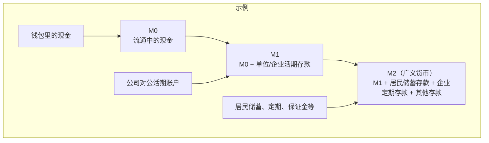

#### 一、货币供应量

- 全球最高: 中国货币供应量M2达335万亿人民币，换算为47万亿美元
- 国际比较: 是美国M2的两倍多（美国仅22万亿美元），但中国GDP仅为美国的三分之二
- 反常现象: 中国印钞量巨大却未发生通胀，反而出现通缩现象

#### 二、M2的含义
一句话解释：
M2就是“广义货币”，可以理解为经济里既能马上花、也能很快变成可花的钱的总量。它比现金和活期存款范围更大，包含了居民和企业的定期、储蓄等“准货币”。

它和M0、M1的关系（中国常用口径，通俗版）：
- M0：流通中的现金（你钱包里的钞票、商店收银抽屉里的现金）。
- M1：M0 + 企业/单位在银行的活期存款（公司账户里随时可支付的存款）。这是“马上能花的钱”。
- M2：M1 + 居民储蓄存款 + 企业定期存款 + 其他各类存款（如保证金等）。这些虽然不是时刻都在用，但很容易变成可用资金，所以叫“准货币”。

打个比方：
- M0像你手里的零钱。
- M1像公司账上的活期钱，随时支付工资、货款。
- M2则是把活期钱再加上大家存在银行里、说取就能取的储蓄和定期。它像一个大水库，水随时可以放出来支持消费和投资。

为什么要看M2？
- 反映货币供应的“总体充裕度”。M2增长快，说明钱在经济里更充足，融资更容易；增长慢，说明偏紧。
- 用来研判通胀和经济活力：一般来说，若M2长期高增速且信贷也旺盛，通胀或资产价格上涨的压力可能更大；低增速则可能意味着经济降温或货币偏紧。
- 央行通过利率、存款准备金率等工具影响M2的增速，以实现稳增长、稳物价的目标。

常见误解和提醒：
- M2增长不等同于一定会通胀，还要看钱有没有真正进入消费和投资（结合信贷投放、社会融资规模、名义GDP等一起看）。
- 不同国家对M2的统计口径略有差异（比如美国的M2还包含零售货币市场基金、小额定期存款等）。这里介绍的是中国常用理解。

小例子帮助理解：
- 你钱包里的100元：属于M0。
- 某公司对公活期账户里的10万元：属于M1（也在M2里）。
- 你存在银行的一年期定期、普通储蓄：属于M2（但不在M1里）。

下面用一张简单的结构图来理解M0、M1、M2的层级与包含关系：

怎么看一国的M2数据？
- 关注同比增速（比如M2同比增长多少），这是最常用指标。
- 与信贷增量、社会融资规模和名义GDP增速一起对照，判断“钱的增长”和“经济的增长”是否匹配。
- 结合利率、房地产和股市表现，评估资金是否更多流向消费/生产还是资产市场。

#### 三、M2的印刷/产生

##### 1. 印钱的主体：中央银行与商业银行

- ![[e9f4c427ce3c0f80df4b45df96397ea0_MD5.jpg]]
- 双主体机制:
    - 中央银行（中国：人民银行；美国：美联储）
    - 商业银行（工农中建交等各类银行）
- 常见误区: 多数人误以为只有央行印钞，实际商业银行才是主要创造者

##### 2. 商业银行印钱：发放贷款
03:49
- 核心机制: 通过贷款业务创造存款货币
- 典型案例: 购房者申请100万贷款时，银行只需在账户数字增加100万即可完成货币创造

##### 3. 贷款印钱：凭空创造货币
04:10
- ![[a7e83437c461df98ec44a68bb6dc0011_MD5.jpg]]
- 数字游戏本质: 不需要实际资金储备，仅通过账户数字变更完成
- 流转过程: 贷款→存款→支付→再存款的循环创造货币乘数效应

##### 4. 商业银行的生意：凭空创造贷款收利息
05:03
- ![[7c706fcfe8f50e97b13208d54678218d_MD5.jpg]]
- 盈利本质: 通过无成本创造货币收取利息
- 行业特性: 高利润导致政府严格管制，禁止私人开办银行

##### 5. 贷款与社会经济：繁荣与衰退
05:30
- 繁荣信号: 贷款活跃反映企业和居民对未来的信心
- 典型表现:
    - 企业扩大投资生产
    - 居民增加消费（如十年前的购房购车热潮）
    - 就业增长，收入提高

##### 6. 货币供应量M2与社会经济

- ![[fd5f8844949d7e7ea7d911b0f4d38da9_MD5.jpg]]
- 正向关系:
    - M2快速增长→经济繁荣+通胀
    - M2增长停滞→经济萎缩+通缩
- 中国悖论:M2全球第一却持续通缩，需引入货币流通速度解释

##### 7. 货币流通速度的定义与影响
07:38
- ![[a71ebfe925200b1caf1d397e8382618f_MD5.jpg]]
- 基本概念: 单位时间内货币周转次数（如200万经手多人形成多次交易）
- 当前问题:
    - 居民因对未来担忧而储蓄（如张三紧握200万不消费）
    - 导致货币"沉淀"，流通速度骤降
- 经济影响: 即使M2总量大，流通速度慢仍会导致通缩和经济低迷

#### 四、货币恒等式/货币分布



09:12



- ![[21ae450629c940ba5790e894d4b52e31_MD5.jpg]]
- 基本形式：MV=PYMV=PYMV=PY，其中：
    - M：货币供应量M2
    - V：货币流通速度（一年内存款周转次数）
    - P：商品价格水平
    - Y：商品数量
- 经济含义：货币量×流通次数=名义GDP（P×Y表示社会总产出价值量）

##### 1. 中国货币流通速度下降



11:05



- ![[b384689eaafe338e315fb1c00cfc26cb_MD5.jpg]]
- 现象特征：
    - M2持续增长但V急剧下降
    - 物价P走低且产出Y增长乏力
    - 表现为通货紧缩和GDP增速下降
- 数据矛盾：官方GDP增速（如5%）与货币流通速度下降的现实存在可信度争议

##### 2. 社会阶层结构



12:05



- ![[a1b124eef237dd1ea46a7986c46077d8_MD5.jpg]]
- 结构特征：中国存在超级扭曲的金字塔型社会结构（vs欧美橄榄型结构）
- 货币影响：不同阶层的存款属性和流通速度差异显著影响货币政策传导

###### 1）权贵层



12:50



- ![[cc06a628c312aa619e1f1f62fe3da44f_MD5.jpg]]
- 人口规模：约30-300万人
- 存款规模：持有10万亿级M2
- 财富来源：主要依靠权力寻租
- 流通特征：
    - 资金高度不活跃（因来源隐蔽）
    - 货币流通速度极低（与经济周期无关）

###### 2）富贵层



13:49



- ![[b8db56ca48beb9bd05eda33eed6e2028_MD5.jpg]]
- 人口规模：500-1000万人
- 存款规模：持有10-30万亿M2
- 组成群体：
    - 活跃部分：民营企业家/高管（流通速度随经济周期波动）
    - 不活跃部分：国企高管/权力白手套（流通速度持续低迷）

###### 3）岁月静好层



15:15



- ![[c8e13939ef69f64eb444c18843acac1c_MD5.jpg]]
- 人口规模：1-1.5亿人
- 存款规模：40-80万亿（最大存款群体）
- 组成群体：体制内职工+民企中层
- 流通特征：
    - 消费倾向最强（占社会消费主力）
    - 保障充足（医疗/教育/养老全保障）
    - 货币流通速度最高

###### 4）体制外牛马层



16:42



- ![[80e030d49a05bd9ee4fdd41eed9d89d5_MD5.jpg]]
- 人口规模：约12.5亿人
- 存款规模：20-40万亿（人均持有量最低）
- 流通特征：
    - 理论上消费倾向最强（存款即生活费用）
    - 实际因保障缺失（医疗/教育/养老）被迫储蓄
    - 经济下行时存款完全冻结

##### 3. 中国货币谜题
19:59
- ![[e803163157ea43d28f300b4277a91481_MD5.jpg]]
- 现象表现：中国M2/GDP比值达200%（美国仅70%）
- 传统解释：居民高储蓄倾向（仅解释第四阶层行为）
- 深层原因：
    - 第四阶层被迫储蓄（保障不足）
    - 权贵/富贵层巨额存款冻结（约40万亿不流通）
- 制度根源：不公平分配导致的扭曲社会结构

##### 4. 固定资产投资饥渴症
22:01
- 表现特征：地方政府热衷大型基建项目
- 驱动因素：
    - 政绩需求（可视化的建设成果）
    - 寻租空间（项目造价虚报可达2-3倍）
- 货币后果：
    - 新增M2约50%转化为权贵存款冻结
    - 实际支撑GDP增长效率低下

#### 五、知识小结

|              |                                             |                                   |       |
| ------------ | ------------------------------------------- | --------------------------------- | ----- |
| 知识点          | 核心内容                                        | 考试重点/易混淆点                         | 难度系数  |
| M2定义与构成      | M2=现金+活期存款+定期存款，代表社会购买力总量                   | M0（仅现金）、M1（现金+活期存款）与M2的区别         | ⭐⭐    |
| 货币创造机制       | 商业银行通过贷款“凭空”创造货币（如房贷100万直接增加账户数字）           | 央行不直接主导印钞，而是通过商业银行贷款实现            | ⭐⭐⭐   |
| 货币流通速度（V）    | 货币周转次数决定经济活跃度（V下降导致通缩）                      | V下降原因：居民/企业储蓄倾向高、权贵阶层资金沉淀         | ⭐⭐⭐⭐  |
| 货币恒等式（MV=PY） | M2×流通速度=物价×产出（名义GDP）                        | 中国特殊性：M2/GDP超200%（美国70%），反映资金效率低下 | ⭐⭐⭐⭐  |
| 社会阶层与货币活性    | 权贵层（100万亿不流通）、富贵层（部分冻结）、体制内（消费主力）、牛马层（被迫储蓄） | 关键矛盾：存款集中在低流通阶层（前两层占40%+）         | ⭐⭐⭐⭐⭐ |
| 固定资产投资饥渴症    | 地方政府通过基建项目创造M2，但资金大量沉淀在权力阶层账户               | 扭曲机制：项目虚报造价→资金套利→货币流通受阻           | ⭐⭐⭐⭐  |
| 通缩根源         | M2增长被V下降抵消（权贵资金冻结+居民预防性储蓄）                  | 对比欧美：橄榄型社会+高保障→资金高效流通             | ⭐⭐⭐⭐⭐ |

## 2025：中国为什么会在未来十多年持续通缩：
#### 一、中国陷入的两个巨大陷阱
00:32

##### 1. 制度陷阱
00:38

###### 1）高度中央集权的决策系统
00:58
- ![[767457efbccb303f0a173fa4efd3dadf_MD5.jpg]]
- 决策特征: 经过30多年改革开放后重新进入高度**中央集权**模式，表现为决策权高度集中
- 表面优势: 举国体制下决策效率快、执行能力强，能集中力量办大事
- 实质缺陷: 时间越长错误越明显，后果越严重
- 决策错误
    01:17
    - ![[e45bf278e5195918262314cb699c4442_MD5.jpg]]
    - 根本原因: 不允许不同意见存在，缺乏纠错机制
    - 理想假设: 除非决策者是全知全能的天才（现实中不存在）
    - 现实情况: 当决策者文化水平有限却特别自信时，会亲自指挥所有领域
    - 例题：错误决策案例
        02:46
        - ![[62b2975076ecf48c4fa522b5f91ad2ec_MD5.jpg]]
        - 案例背景: 2020-2022年疫情防控政策
        - 决策失误:
            - 无视国际数据坚持清零政策
            - 拒绝进口有效疫苗强制使用低效灭活疫苗
            - 突然放开导致药品短缺和老年人死亡
        - 经济后果:
            - 三年封控造成餐饮、旅游等行业大规模倒闭
            - 约1亿人陷入贫困（占人口7%）
            - 2023年起停止公布死亡数据
            - ![[184888cc25d189859eecb6cc0fa293e9_MD5.jpg]]
    - 房地产崩溃案例
        05:07
        - 背景数据:
            - 2021年起每年减少1000万劳动人口
            - 人均住房面积达39㎡（超德法水平）
        - 政策失误:
            - 强行掐断房企资金链（信贷指令）
            - 提高利率和首付抑制需求
        - 后果:
            - 房价下跌导致30%购房者资不抵债
            - 地方政府土地出让金锐减60%
            - 基建投资能力下降约45%
            - ![[18dc325a902e1106dacc6c3f379c8c6c_MD5.jpg]]
    - 反垄断打击资本无序扩张案例
        06:41
        - 政策矛盾双标:
            - 未触及中石油、国家电网等国企垄断
            - 重点打击阿里、滴滴等民企
        - 典型案例:
            - 马云因公开批评监管被"敲打"
            - 滴滴因赴美上市被迫退市
        - 经济影响:
            - 民营资本外流年均超$600亿
            - 投资信心指数下降至历史最低点30%
            - ![[9f0d0bb07ef3186bd64190fd12fe6f68_MD5.jpg]]
        - 地理缺陷:
            - 选址白洋淀（华北平原最低洼处）
            - 年均水患概率达83%
        - 决策过程:
            - 耗资4000亿元建设空城
            - 2023年洪水后被迫调整规划
        - 典型特征:
            - 专家意见被压制（水文专家集体沉默）
            - 错误持续至灾难发生才纠正

##### 2. 人口陷阱
11:35
- ![[f9f8ac3b234e1ef1e941f72cc29d4935_MD5.jpg]]
- 核心表现：中国劳动人口自2021年开始每年减少1000万，将持续至2033年，2040年后将出现更剧烈下降
- 经济影响：这种人口结构变化将锁定未来20年中国经济的基本轨迹，导致经济自然萎缩

###### 1）劳动人口下降带来通缩
12:50
- ![[35482f39270897b0377f7725a12c913b_MD5.jpg]]
- 需求端影响：
    - 消费萎缩：劳动人口是主要需求者，其减少将直接导致对房产、汽车、服装、酒类等各类商品需求下降
    - 就业连锁反应：需求减少导致企业裁员和降薪，形成"需求下降→收入减少→消费萎缩"的恶性循环
- 社会分层影响：
    - 第四阶层：普通劳动者将面临生活水平持续下降，储蓄意愿增强
    - 第三阶层：体制内人员生活水平可能提高（物价下降而收入不变），但2018年后购房者将面临困境
    - 第二阶层：民营企业家投资意愿降低，部分人面临阶层降级

###### 2）流动性陷阱
16:08
- ![[25b1f1eef51829a2345a2619390ed23a_MD5.jpg]]
- 定义：凯恩斯提出的概念，指经济衰退时居民和企业窖藏货币，不愿消费和投资的现象
- 中国现状：
    - 储蓄规模：335万亿M2中160万亿为居民储蓄，且大部分变得保守
    - 表现特征：即使利率降至零，资金仍不流动，货币供应扩张无法刺激经济
- 日本经验：
    - 应对措施：零利率+大规模基建投资，但仅维持经济不衰退
    - 转折点：2019年开始每年引入50万工作移民，填补劳动人口缺口，经济才真正复苏
- 正确的做法
    20:49
    - ![[de38e621ca5a10f2b64316f88de69101_MD5.jpg]]
    - 货币政策：
        - 利率降至零，减轻各方债务负担
        - 扩大货币供应量
    - 财政政策：
        - 政府大举扩张债务投资基建（如城市地下管廊）
    - 结构性改革：
        - 鼓励生育并提供补贴
        - 大规模引入年轻移民（最见效措施）
        - 放开国企垄断，藏富于民
        - 改善国际关系，融入世界贸易体系
- 中国的决策系统在人口陷阱中的做法
    21:39
    - 现行政策问题：
        - 拒绝"大水漫灌"，货币政策保守
        - 压制不同意见（如高善文建议被封杀）
        - 偏好科技攻关而非民生改善
    - 系统缺陷：
        - 决策滞后性：经济政策错误不易立即显现
        - 纠错机制缺失：往往将问题归因于执行力度而非方向错误
    - 长期风险：
        - 人口陷阱与制度陷阱叠加强化
        - 可能导致持续10年以上的大通缩（2022-2033）

#### 二、知识小结

|                 |                                           |                              |             |
| --------------- | ----------------------------------------- | ---------------------------- | ----------- |
| 知识点             | 核心内容                                      | 关键论据/数据支撑                    | 关联影响        |
| 中国社会阶层结构与货币流通速度 | 两极化的畸形社会阶层导致货币流通速度过低，需依赖更多M2支撑经济增长        | 货币恒等式分析；对比发达国家货币流通效率         | 长期通缩风险      |
| 制度陷阱            | 高度中央集权决策系统导致错误决策概率激增，缺乏纠错机制               | 新冠清零政策反复、房地产调控失误、雄安新城选址问题    | 经济政策连续性受损   |
| 人口陷阱            | 劳动人口每年减少1000万（2021-2033年），需求萎缩引发通缩        | 日本1995年后人口衰退案例；中国劳动人口下降趋势图   | 内需持续疲软      |
| 流动性陷阱           | 居民窖藏存款（150-160万亿）、企业投资意愿低迷                | 凯恩斯理论；日本零利率+基建刺激仍失效          | 货币政策传导失灵    |
| 政策应对建议          | 零利率+财政扩张/引进移民/放开国有垄断/改善国际关系               | 日本移民政策成效；国有垄断行业列表（中石油、国家电网等） | 未被采纳的潜在解决方案 |
| 阶层分化影响          | 第四阶层（底层）消费紧缩；第三阶层（体制内）相对稳定；第二阶层（民营资本）信心崩塌 | 烂尾楼案例；公务员收入抗通缩特性             | 社会消费结构失衡    |
| 历史对照            | 日本30年通缩经验与中国现状对比                          | 日本政府债务达GDP200%；2019年移民政策扭转经济 | 政策路径依赖性     |
| 个体应对策略          | 资产配置避险（未展开）                               | 李嘉诚等资本外逃案例                   | 下集预告重点      |

# 考点
以下内容为AI生成
---题干1：根据视频内容，货币供应量M2主要来源于哪里？
A. 政府直接印钞
B. 银行存款利息
C. 社会贷款增加
D. 外汇储备兑换
- 答案：
	- C, 解析：视频中提到“要是贷款多了，那当然这个社会货币供应量M2，它也就多了呀，就存款就多了嘛”，说明M2主要来源于社会贷款增加。A选项“政府直接印钞”未提及；B选项“银行存款利息”是存款的收益，非M2来源；D选项“外汇储备兑换”未提及。
---题干2：当货币供应量M2增长缓慢时，社会可能出现什么现象？
A. 通货膨胀加剧
B. 企业扩大投资
C. 居民消费意愿增强
D. 通货紧缩
- 答案：
	- D
	- 解析：视频中明确指出“如果货币供应量M2增长缓慢了呢，社会会出现通货紧缩”，因此D选项正确。A选项“通货膨胀加剧”与M2增长缓慢相反；B选项“企业扩大投资”和C选项“居民消费意愿增强”均是经济活跃的表现，与M2增长缓慢导致的通货紧缩矛盾。
--题干3(多选)：视频中提到中国M2相对于GDP较高的原因可能包括哪些？(多选)
A. 中国居民储蓄倾向高
B. 中国货币流通速度低
C. 中国政府大量印钞
D. 中国企业投资意愿弱
E. 中国外汇储备过多
- 答案
	- ：AB
	- 解析：视频中提到“这是因为中国居民他爱储蓄，储蓄倾向高，所以才造成货币流通速度低”，说明A选项“中国居民储蓄倾向高”和B选项“中国货币流通速度低”是M2相对于GDP较高的原因。C选项“中国政府大量印钞”未提及，且M2高不完全由印钞导致；D选项“中国企业投资意愿弱”是通货紧缩的表现，非M2高的原因；E选项“中国外汇储备过多”未提及。

