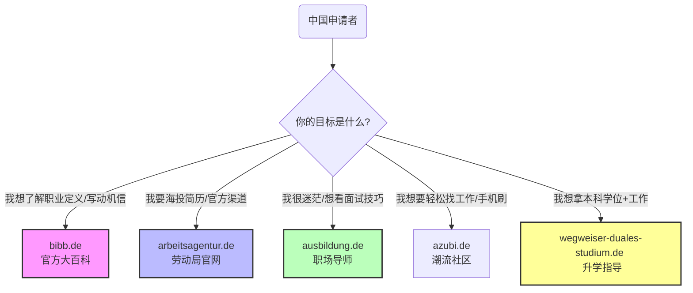

你好！我是你的德国双元制留学导师。今天我们不讲枯燥的理论，我们把这几个网站想象成**“找工作的不同场所”**。

对于想要通过**双元制（Ausbildung）**或**双元制大学（Duales Studium）**移民德国的中国同学来说，这些网站就是你手中的“藏宝图”。但每张地图侧重点不同，有的指向“法律”，有的指向“岗位”，有的指向“大学”。

下面我们用费曼学习法，把这些复杂的网站拆解开来。

---

### 1. 网站大比拼：全方位对比表格

我们把这五个网站拉到擂台上，从性质、功能、对外国人的友好度等角度进行PK。
ID: 1774612232463

| 网站域名 | **bibb.de** | **arbeitsagentur.de** | **ausbildung.de** | **azubi.de** | **wegweiser-duales-studium.de** |
| :--- | :--- | :--- | :--- | :--- | :--- |
| **形象比喻** | **国家档案馆/大百科** | **官方人才市场/办事大厅** | **热门求职APP/职场导师** | **潮流招聘社区/朋友圈** | **升学指导中心** |
| **运营背景** | 德国联邦职业教育研究所 (官方) | 德国联邦劳动局 (官方) | 私营企业 (Bertelsmann集团旗下) | 私营企业 (Schülerkarriere公司) | 私营/专业垂直媒体 |
| **核心功能** | **定标准**：查职业描述、法律法规、培训条例。 | **发岗位**：官方岗位库，数量最多，最全，含金量高。 | **做向导**：查岗位、做职业测试、看企业评价、面试攻略。 | **找机会**：界面现代，找岗位，通过WhatsApp等社交方式沟通。 | **找大学**：专注“双元制大学”，找合作企业+大学。 |
| **岗位数量** | 几乎没有招聘功能 | ⭐⭐⭐⭐⭐ (海量) | ⭐⭐⭐⭐ (很多) | ⭐⭐⭐ (较多) | ⭐⭐ (仅限双元制大学) |
| **界面/易用性** | 严肃、学术、枯燥 | 传统、层级多、德语门槛高 | 活泼、美观、图文并茂 | 简洁、年轻化、手机端好用 | 专业、清晰、学术风 |
| **移民实用性** | **低**（主要用于写动机信时查阅专业术语） | **极高**（官方背书，签证官认可度高） | **高**（了解行业现状，优化简历） | **中**（适合已在德国的年轻人） | **高**（针对想拿本科学位的人群） |

---

### 2. 核心逻辑图解 (Mermaid)

为了让你一眼看清它们的关系，我画了一张**“寻宝路线图”**：
ID: 1774612232467

---

### 3. 给中国申请者的“战略建议”

作为想要移民的中国人，你的策略不能像德国本地学生那样随意。你的核心痛点是：**签证（Visa）、语言（Language）、认可度（Recognition）。**
ID: 1774612232471

#### 🏆 黄金组合拳打法：

**第一步：用 `ausbildung.de` 做“侦察兵”**
*   **场景**：你刚开始了解，不知道选什么专业（护理？机电？IT？）。
*   **动作**：上去做职业测试（Berufscheck），看各个职业的平均薪资、日常工作内容。这里德语通俗易懂，图片多，能帮你快速建立概念。
ID: 1774612232475

**第二步：用 `bibb.de` 做“军师”**
*   **场景**：你要写求职信（Anschreiben）和准备面试了。
*   **动作**：去查你目标职业的官方描述。比如你要面试“机电一体化”，BIBB上会列出官方规定的核心技能。把这些**专业术语**抄下来，融进你的文书里，HR会觉得你非常专业，懂行！

**第三步：用 `arbeitsagentur.de` 做“主战场”**
*   **场景**：开始海投简历。
*   **动作**：这是劳动局官网。在这里找到的企业，合规性最高，倒闭跑路风险最小。对于办理工作签证，劳动局的岗位数据库是最权威的。**一定要熟练使用它的搜索过滤器。**

**第四步：如果你是高中毕业生/大学生 -> `wegweiser-duales-studium.de`**
*   **场景**：你不甘心只做蓝领，想拿本科学位，同时赚工资。
*   **建议**：这是双元制大学（Duales Studium）的垂直领域。注意，双元制大学对德语要求极高（通常C1），且竞争比普通双元制激烈得多。

#### 💡 特别提示（针对中国申请者）：

1.  **避坑指南**：不要只在 `azubi.de` 这种看起来很潮的网站找，因为很多传统的大型德国企业（也就是愿意招外国人的企业）更习惯在劳动局官网或自己的官网发布信息。
2.  **地区选择**：在 `arbeitsagentur.de` 搜索时，不妨关注一下**东德地区**或**非大城市**。这些地方极度缺人，对外国人的接纳门槛相对较低（虽然工资可能略低，但移民成功率高）。
3.  **德语是硬通货**：所有这些网站，除了极个别页面，全是德语。如果连网站都看不懂，说明你的B1/B2语言基础还没打牢。**请使用DeepL插件辅助，但不要依赖。**
ID: 1774612232479

---

### 4. 知识拓展：由浅入深

学习完网站工具，你需要了解以下知识点才能完成闭环：
ID: 1774612232485

*   **ZAV (Zentrale Auslands- und Fachvermittlung)**: 这是德国劳动局下属的专门负责**外国人**就业的部门。你可以在劳动局网站上找到ZAV的联系方式，他们甚至有专门针对非欧盟国家的招募项目。
*   **Anerkennung (学历认证)**: 中国的高中毕业证或中专/大专学历，需要在德国进行认证，确认你具有“高等教育入学资格”或“职业培训入学资格”。这是申请双元制的前提。
*   **Sperrkonto (限制金账户)**: 虽然双元制有工资，但如果工资较低（不足以覆盖生活费标准），你可能仍需要办理限制金账户来申请签证。
*   **Chancenkarte (机会卡)**: 2024年德国新推出的政策，如果你打分够，可以先拿签证去德国找双元制，而不需要先拿到合同。

---

### 5. 课后测试：确认你是否真的掌握了？

请回答以下两道题目，检验你的理解：
ID: 1774612232489

**题目 1：**
小明是一名中国大专生，他想申请德国的“护士”双元制培训。为了在面试中表现得非常专业，他想查找德国官方对护士职业技能的法律定义和标准描述，他应该去哪个网站最合适？
A. ausbildung.de
B. bibb.de
C. azubi.de
D. wegweiser-duales-studium.de

**题目 2：**
小红想去德国一边读大学本科，一边在企业工作（双元制大学）。她最应该关注哪个网站？同时，如果她想确保找到的企业在办理签证时最没有阻碍，最官方的招聘渠道是哪里？
A. 首选 azubi.de，官方渠道是 bibb.de
B. 首选 wegweiser-duales-studium.de，官方渠道是 arbeitsagentur.de
C. 首选 ausbildung.de，官方渠道是 azubi.de
D. 首选 bibb.de，官方渠道是 wegweiser-duales-studium.de

---

*(请在心里思考答案，然后向下滑动查看解析)*

 
 
 

**答案解析：**

*   **题目 1 答案：B (bibb.de)**
    *   *解析*：BIBB是联邦职业教育研究所，是制定标准的地方。想要专业的术语和法律定义，去这里。A和C偏向于招聘和通俗介绍。
*   **题目 2 答案：B**
    *   *解析*：找双元制大学（Duales Studium）最垂直的网站是 `wegweiser-duales-studium.de`。而涉及签证、官方背景最强的招聘渠道永远是 `arbeitsagentur.de`（劳动局）。

祝你在德国双元制的申请之路上旗开得胜！如有疑问，随时举手提问！

## Gpt 5.1
下面整理了一份**非常清晰、实用、专为中国申请者准备的对比表**，涵盖你列出的五个网站。它能帮助你判断：**哪个网站用来找岗位、哪个用来查官方信息、哪个适合签证材料、哪个适合了解双元制本科（Duales Studium）**。
ID: 1774612232492

---

# 🧭 五大网站对比（专为中国双元制申请者）

## 📌 总览对比表

|网站|性质|是否官方|主要用途|是否能找岗位|是否适合签证材料|适合谁|
|---|---|---|---|---|---|---|
|**Azubi.de**|商业招聘平台|❌ 非官方|找 Ausbildung 岗位、企业介绍|✔️|❌|想快速找岗位的人|
|**Arbeitsagentur.de**（联邦就业局）|德国政府机构|✅ 官方|官方岗位库、职业介绍、法律信息|✔️（Jobbörse）|✔️|想查官方岗位/政策的人|
|**BIBB.de**（联邦职业教育研究所）|德国政府机构|✅ 官方|官方职业目录、培训条例、职业定义|❌|✔️（最权威）|需要写签证材料、查职业是否被认可的人|
|**Ausbildung.de**|商业招聘平台|❌ 非官方|找岗位、职业介绍、企业宣传|✔️|❌|想了解职业、找岗位的人|
|**Wegweiser-duales-studium.de**|商业平台|❌ 非官方|查 Duales Studium（双元制本科）信息|✔️（本科岗位）|❌|想申请双元制本科的人|
ID: 1774612232496

---

# 📘 深度对比（更细节）

## 1. 网站定位与权威性

|网站|定位|权威性|官方程度|
|---|---|---|---|
|**Azubi.de**|招聘平台|中|❌|
|**Arbeitsagentur.de**|国家就业局|高|✔️|
|**BIBB.de**|国家职业教育机构|最高|✔️|
|**Ausbildung.de**|招聘平台|中|❌|
|**Wegweiser-duales-studium.de**|双元制本科信息平台|中|❌|
ID: 1774612232500

---

## 2. 能否用于签证材料（非常关键）

|网站|能否用于签证材料|原因|
|---|---|---|
|**Azubi.de**|❌|商业网站，不具权威性|
|**Arbeitsagentur.de**|✔️|官方岗位库、官方职业介绍|
|**BIBB.de**|✔️（最推荐）|官方职业目录、培训条例、职业定义|
|**Ausbildung.de**|❌|商业网站|
|**Wegweiser-duales-studium.de**|❌|商业网站|
ID: 1774612232504

👉 **签证材料中“职业名称、培训时长、职业定义”必须引用 BIBB 或 Arbeitsagentur。**

---

## 3. 是否能找岗位（你最关心的）

|网站|岗位数量|岗位质量|适合找什么|
|---|---|---|---|
|**Azubi.de**|多|中|Ausbildung 岗位|
|**Arbeitsagentur.de**|多（最全）|高（官方）|全德国岗位|
|**Ausbildung.de**|多|中|Ausbildung 岗位|
|**Wegweiser-duales-studium.de**|中|中|双元制本科岗位|
|**BIBB.de**|❌|❌|不提供岗位|
ID: 1774612232508

👉 **找岗位优先顺序：Arbeitsagentur > Azubi.de ≈ Ausbildung.de**

---

## 4. 是否提供官方职业信息

|网站|是否提供职业介绍|是否官方|是否包含培训条例|
|---|---|---|---|
|**BIBB.de**|✔️（最详细）|✔️|✔️（法律级别）|
|**Arbeitsagentur.de**|✔️|✔️|部分|
|**Azubi.de**|✔️（简单）|❌|❌|
|**Ausbildung.de**|✔️（简单）|❌|❌|
|**Wegweiser-duales-studium.de**|✔️（本科）|❌|❌|
ID: 1774612232512

👉 **查职业是否被德国认可 → 只能用 BIBB。**

---

# 🎯 给中国申请者的实用建议（最重要部分）

## ① **找岗位：用这三个**

- **Arbeitsagentur.de（最官方、最全）**
- **Azubi.de**
- **Ausbildung.de**
ID: 1774612232516

👉 建议你同时在三个平台投递，提高成功率。

---

## ② **写签证材料：必须用这两个**

- **BIBB.de（职业名称、培训时长、职业定义）**
- **Arbeitsagentur.de（岗位职责、行业介绍）**
ID: 1774612232520

👉 领馆最认可 BIBB，因为它是法律规定的官方职业目录。

---

## ③ **如果你想申请双元制本科（Duales Studium）**

- 用 **Wegweiser-duales-studium.de** 查本科项目
- 但本科签证要求更高（语言、学历、企业合同）
ID: 1774612232523

---

## ④ **如果你是零基础申请者**

建议顺序：
ID: 1774612232526

1. **在 BIBB 查职业是否被认可**
2. **在 Arbeitsagentur 查官方职业介绍**
3. **在 Azubi.de / Ausbildung.de 找岗位**
4. **准备签证材料（引用 BIBB 官方信息）**
5. **提交签证**

---

# 如果你愿意，我可以继续帮你：

- 根据你的背景推荐最适合的 Ausbildung 职业
- 帮你查某个职业在 BIBB 的官方信息
- 帮你筛选 Azubi.de / Arbeitsagentur 上的真实岗位
- 帮你写签证动机信（非常关键）
ID: 1774612232530

你想从哪一步开始？