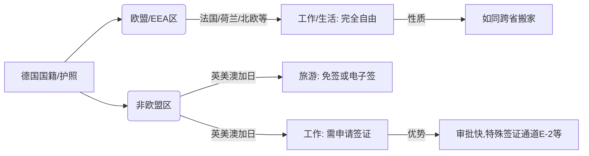

太棒了！同学，你问到了最关键的一步。这就像打游戏，你刚才问的是“我有入场券（永居）能去哪”，现在你问的是“我通关拿到**顶级皮肤（德国国籍）**之后有多强”。

这也是很多在德华人最终面临的**终极选择**。

一旦你拿到了**德国护照（入籍）**，你的身份发生了质变。因为德国是欧盟的核心成员国，这本护照的含金量极高。

让我们分两个圈层来看：**“欧盟内部”**和**“全世界”**。

---

### 第一圈层：在欧盟（EU）+ 欧洲经济区（EEA）+ 瑞士

**关键词：畅通无阻，如履平地**

如果你入了德国籍，你在欧洲几乎所有的发达国家（27个欧盟国 + 挪威、冰岛、列支敦士登 + 瑞士），你的待遇等同于**“当地公民”**。

1.  **想去哪工作就去哪：**
    *   你想去法国巴黎做时尚，去荷兰阿姆斯特丹写代码，去爱尔兰都柏林做金融？**完全不需要申请工作签证。**
    *   你只需要带上你的德国护照，搬过去，找个房子，去当地市政厅登记一下（就像你在国内从南京搬到上海落户一样简单），就可以直接开始工作。

2.  **福利共享：**
    *   你去这些国家，享受和当地人一样的社保、医疗和教育权利。没有任何“你是外国人”的限制。

3.  **学费优势：**
    *   如果你想去其他欧盟国家上大学，你按照“欧盟学生”标准收费，通常比“非欧盟学生”（国际生）便宜超级多，甚至免费。

> **举例：**
> 你是德国国籍的汽车工程师，看到**意大利**法拉利总部招人。你投简历，面试通过。第二天你就可以买张机票飞去意大利上班，不需要经过任何移民局审批。

---

### 第二圈层：在英、美、澳、加、日（非欧盟发达国家）

**关键词：VIP通道，但这依然是“出国”**

虽然德国护照很强，但这些国家不是欧盟成员，所以不能直接去工作，但待遇比拿中国护照要好很多。

1.  **旅游/商务（免签）：**
    *   **英国、日本、韩国、新西兰等：** 拿德国护照直接免签入境。说走就走。
    *   **美国、加拿大、澳洲：** 只需要在网上填个简单的电子旅行许可（如美国的ESTA），几分钟获批，等于免签。
    *   *对比：* 以前拿中国护照去这些地方都要准备一堆材料申请签证，还要担心被拒签。

2.  **工作/定居（依然需要签证）：**
    *   **没有自动工作权：** 你拿德国护照去美国打工，依然要申请美国的H1B工作签证。去英国，也要申请英国的工作签证。
    *   **隐形优势（Buffer加成）：**
        *   **打工度假签证（Working Holiday）：** 德国年轻人去澳洲、加拿大、新西兰申请打工度假签证（WHV）的名额非常多，且年龄限制较宽，比中国护照容易太多。
        *   **特殊通道：** 比如去瑞士（非欧盟但签了协议），德国人去工作非常简单。去美国，德国公民可以申请E-2条约投资者签证（如果想创业），而中国公民目前没有这个资格。
        *   **信任度：** 移民局默认德国公民不会非法滞留，所以审批速度极快。

---

### ⚠️ 核心警告：硬币的反面（一定要看！）

这一切听起来很美好，但对于中国人来说，有一个**巨大的代价**。

**中国不承认双重国籍。**

*   **获得德国籍 = 自动丧失中国籍。**
*   **回国变“老外”：** 你以后回中国探望父母，需要去中国大使馆**申请签证**。
*   **资产处理：** 你在国内的身份证会被注销，以后在国内买房、开银行卡、用微信支付（绑定外卡）、坐高铁，都要用德国护照，手续会比以前麻烦。

---

### 🎓 费曼学习法：身份的“升级之路”

想象你是一个**游戏玩家**：

1.  **双元制期间（签证）：** 你是**“试玩账号”**。只能在这个特定的服务器（德国企业）玩，不能乱跑。
2.  **拿到永居（绿卡）：** 你充值成了**“会员账号”**。你可以在德国服务器随意玩，去隔壁服务器（欧盟其他国家）可以参观（旅游），但不能在那边打怪升级（工作）。
3.  **拿到国籍（护照）：** 你成为了**“GM（管理员）账号”**。
    *   **在欧盟区：** 你拥有了全服漫游权。今天在德国服打怪，明天去法国服摆摊，后天去西班牙服养老，系统完全不拦你。
    *   **在世界区（美日澳）：** 虽然你不能直接当管理员，但你是“贵宾玩家”，进门不用排队（免签），申请转服（工签）时GM也会高看你一眼。
    *   **代价：** 你原来的“中国服务器”账号（中国国籍）会被注销，以后回中国服玩，得按外宾流程走。

---

### 🌐 拓展学习：德国入籍新法（2024年6月生效）

这是最新的重大利好消息，也是你需要了解的知识点：

1.  **时间缩短：** 以前要住满8年才能入籍。**现在只要5年！** 如果你双元制成绩优异、德语达到C1水平，甚至**最快3年**就可以申请入籍。
    *   *这意味着：* 3年双元制毕业，如果表现极其出色，可能刚毕业就能申请入籍了。
2.  **双重国籍（德国方）：** 德国现在**允许**双重国籍了。
    *   *注意：* 这是一个单向利好。德国允许你保留原国籍，**但是**因为中国法律不允许，所以实际上你还是只能二选一。除非你的原国籍国也承认双重国籍。

---

### 📝 课后测验：生死攸关的理解

这关乎你的国籍选择，请务必认真回答：

**题目一：**
小赵在德国入籍成为了德国公民。某天他看到法国巴黎有一家米其林餐厅招大厨，待遇很好。
**问：** 小赵需要去法国驻德国大使馆申请工作签证吗？他去法国工作有限制吗？

**题目二：**
小钱也入籍了德国。但他父母还在中国湖南老家。过年了，小钱想回老家住两个月陪父母。
**问：** 小钱可以直接买机票拿着他的德国护照回中国吗？他在中国期间，原本的中国身份证还能用来买高铁票吗？

---

*(想好答案后再看下方解析)*

**✅ 答案解析：**

*   **题目一解析：**
    *   **不需要签证，无限制。** 德国是欧盟成员，公民享有“欧盟人员自由流动权”。小赵去法国工作就跟去柏林工作一样，直接去就行，享有完全平等的劳动权利。

*   **题目二解析：**
    *   **不可以直飞，不能用身份证。**
    *   1. 小钱现在是法律意义上的“德国人”。回中国必须提前向中国使领馆**申请中国签证**（如Q1/Q2探亲签证）。
    *   2. 他的中国户籍和身份证在法律上应当注销（或失效）。买高铁票必须使用**德国护照**，走人工通道或护照识别通道。他不再享有中国公民的权利。

# 双元制需要多久才能获得国籍
**如果你从“德国申根签证”开始，最终想拿到德国国籍，那么时间不是按“申根签”算的，而是按你之后在德国的**合法长期居留年限**计算的。申根签证本身**不能**通往国籍。**

---

# 🇩🇪 从申根签到德国国籍：完整时间线（最清晰版本）

## 🛂 **1. 申根签证（短期签）处理时间：15–45 天**

- 标准处理时间：**15 天** [SchengenVisaInfo.com](https://www.schengenvisainfo.com/application-process/processing-time/)
- 最长可能延长至：**45 天**（材料复杂或需进一步审查） [SchengenVisaInfo.com](https://www.schengenvisainfo.com/application-process/processing-time/)

⚠️ **申根签证不能转国籍，也不能在德国境内转长期居留。**  
它只是短期停留（旅游/商务），**不能用于移民**。

---

# 🏠 **2. 想获得德国国籍，你必须先获得长期居留（如：工作签、蓝卡、Ausbildung 签证等）**

常见路径包括：

- 双元制职业培训签证（Ausbildung）
- 工作签证（Skilled Worker）
- 欧盟蓝卡（Blue Card）
- 留学签证 → 工作签证

这些签证才是“移民路径”，申根签不是。

---

# 🇩🇪 **3. 德国国籍所需居住年限（关键）**

德国国籍法规定：

- **正常入籍：8 年合法居住**
- **融入课程完成：7 年**
- **表现优异（语言 B2、社会贡献等）：6 年**

👉 也就是说：  
**最快 6 年，最常见 7–8 年。**

---

# 📌 **总结：申根签 → 国籍需要多久？**

|阶段|所需时间|说明|
|---|---|---|
|申根签证处理|15–45 天 [SchengenVisaInfo.com](https://www.schengenvisainfo.com/application-process/processing-time/)|仅短期停留，不计入移民|
|获得长期居留|取决于你的签证类型|Ausbildung/工作/蓝卡等|
|入籍所需居住|6–8 年|关键时间段|
|总时间|**6–8 年以上**|申根签不计入|

---

# 🎯 **如果你是中国人，想通过双元制（Ausbildung）移民德国：**

这是你最现实的路径：

1. 在中国申请 **Ausbildung 签证**
2. 到德国开始培训（2–3 年）
3. 培训结束后转 **工作签证**
4. 工作满一定年限后申请 **永久居留（Niederlassungserlaubnis）**
5. 居住满 6–8 年后申请 **德国国籍**

我可以帮你进一步：

- 规划最快的移民路径
- 评估你适合哪种签证
- 告诉你 Ausbildung 哪些职业最容易获签
- 帮你写动机信、简历、找培训单位

你想从哪一步开始？