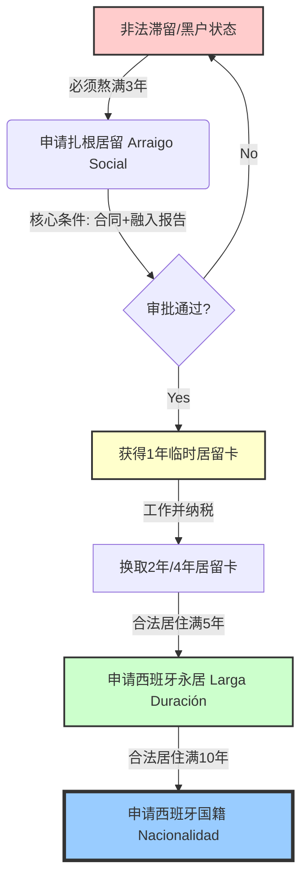

比如在西班牙居住满讲到三年就可以自动获取该国永居或国籍

[從黑戶到合法居留！手把手教你辦西班牙扎根居留，零门槛移民发达国家](https://www.youtube.com/watch?v=0WMtnIgq0pY)

你好！我是你的博学老师。今天我们来拆解一个在移民圈流传甚广，但极易让人**掉进坑里**的说法：“西班牙居住满三年自动拿永居或国籍”。

这句话听起来很美，像是一张免费的午餐券，但实际上，它更像是一个**需要通关打怪的高难度副本**。

首先，我要给你一个结论：**这句话是错的。**

所谓的“满三年”，指的不是拿永居（PR），更不是拿国籍（护照），而是**“扎根居留”（Arraigo Social）**。这是一个让你从“黑户”（非法滞留）变成“合法居民”的特殊通道，但这仅仅是长征的第一步。

---

### 🏛️ 核心概念：什么是“扎根居留”（Arraigo Social）？

想象一下，西班牙的合法身份是一座**大城堡**。
*   **正门**：是给拿工作签证、投资移民、非盈利移民的人走的。
*   **扎根居留**：是给那些通过“翻墙”或者“签证过期滞留”进入城堡花园的人，在花园里躲了3年没被赶走，西班牙政府觉得“哎呀，既然你都混熟了，那就给你发张临时门票吧”。

**它不是永居，更不是国籍！** 它通常只是一张有效期的**一年临时居留卡**（带工作许可）。

#### 📊 可行性与流程图解 (Mermaid)

让我们通过一张图，看清这条路的真实时间线：

**解析：**
1.  **黑户期（3年）：** 这是最难熬的。
2.  **洗白期（第4年）：** 拿到扎根居留，开始合法纳税。
3.  **永居期（第4年+5年）：** 你需要从拿到合法卡开始算，再住满5年，才能拿永居。
4.  **国籍期（第4年+10年）：** 也就是一般要合法住满10年（除非你和西班牙人结婚等特殊情况）。

---

### 🧐 深度分析：这条路的可行性如何？

如果给这条路打个分，**难度系数是 8/10，风险系数是 9/10。** 为什么？

#### 1. 这里的“坑”在哪里？（风险分析）

*   **无法回国**：在“黑”着的这三年里，你不能离开西班牙。一旦离境，就回不来了，前功尽弃。
*   **生存焦虑**：没有合法身份，无法签署正规租房合同，无法开银行账户（越来越难），生病了除了急诊可能无法享受公立医疗。
*   **被遣返风险**：虽然西班牙相对宽容，但如果在街上被警察查身份，理论上是有被开驱逐令的风险的。

#### 2. 最难的BOSS：全职工作合同

你以为熬满3年就自动给了？**错！**
申请扎根居留的核心条件是：**必须有一份为期至少一年的全职工作预合同。**

*   **悖论**：你想拿身份必须有合同，但老板雇佣没身份的人是违法的（面临巨额罚款）。
*   **现实**：你必须找到一个愿意为你担保，甚至愿意先去移民局备案，并且工资达标的雇主。这导致很多人不得不花钱“买”合同（这是违法的，且有被骗风险）。

#### 3. 融入报告（Informe de Inserción Social）

你需要证明你已经融入了当地社会。通常需要去市政府面试，有时还需要证明你学了一点西班牙语。

---

### 🌰 举例说明：小王的“洗白”之路

**场景**：小王，30岁，听说“三年拿身份”，持旅游签到了马德里，决定黑下来。

1.  **第一年（隐形人阶段）**：签证过期。小王不敢去大医院，只敢在华人餐馆打黑工，领现金，工资很低。他必须确保持续有“住家证明”（Empadronamiento），这是唯一的居住证据。
2.  **第二年（煎熬阶段）**：家里有急事，但小王不敢回国。心理压力巨大。
3.  **第三年（冲刺阶段）**：时间满了。小王开始找老板给他出合同。
    *   *困难*：老板A不愿意，怕罚款。老板B愿意，但要求小王自己付社保费，还要给一笔“茶水费”。
4.  **第四年（上岸）**：小王侥幸通过审批，拿到了那张**1年期的居留卡**。
    *   *现状*：此时他才刚刚站在起跑线上。想要永居？请再合法工作纳税5年。想要国籍？请再等10年。

---

### 🗣️ 费曼学习法：如何一句话理解？

想象你去一家会员制的高级健身房（西班牙合法身份）。
*   **正规移民**是直接办卡进去。
*   **“满三年”政策**是：你偷偷从后窗爬进去，在厕所里躲了3年没被保安抓住。3年后，你拿着你在厕所待了3年的证据，并且找到了一个健身教练（雇主）愿意担保你，经理才勉强给你发一张**体验卡**。拿到体验卡后，你才能开始积累积分去换**终身会员卡（永居）**。

**所以，并不是“待满3年=自动送永居”，而是“待满3年=获得申请入场券的资格”。**

---

### 📚 拓展知识：其他的“扎根”方式

除了**社会扎根（Arraigo Social）**，还有一种新出来的，可能更适合年轻人的方式：

1.  **培训扎根（Arraigo para la Formación）**：
    *   **居住要求**：只需非法居住满**2年**。
    *   **核心条件**：承诺去读一个官方认可的职业培训课程（不用先找工作合同）。
    *   **优势**：门槛比找工作低，可以先拿身份读书，读完书再找工作换居留。

2.  **工作扎根（Arraigo Laboral）**：
    *   居住满2年，且能证明被非法雇佣过6个月（通常需要举报雇主，属于“杀敌一千自损八百”，不推荐）。

3.  **非盈利移民 / 数字游民签证**：
    *   如果你有积蓄或有远程工作，完全可以在国内申请好这些正规签证再出来，**千万不要盲目选择“黑下来”这条路**。

---

### 📝 课后测验：你真的理解了吗？

请回答以下两个问题，来确认你是否掌握了今天的知识：

**题目 1：**
小李在西班牙非法滞留了3年整，此时他可以直接向西班牙政府申请换发西班牙护照（国籍）吗？
A. 可以，满3年自动拿。
B. 不可以，只能申请临时的扎根居留卡。
C. 可以，但需要考试。

**题目 2：**
申请“社会扎根”（Arraigo Social）最关键、也是最难的硬件条件是什么？
A. 学会跳弗拉明戈舞。
B. 一份全职的工作预合同。
C. 只要住家证明（Empadronamiento）就够了。

***

*(请在心里想好答案，再看下方的正确答案)*

.
.
.

**✅ 正确答案：**
1.  **B** (3年只是获得了申请合法居留的资格，离国籍还差得远)
2.  **B** (没有工作合同，光住满3年也是没用的)

希望这位同学能通过这次讲解，看清“三年拿身份”背后的真实成本和风险！如果有更多问题，欢迎随时提问。