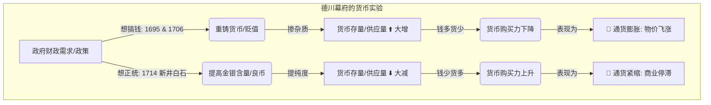

# 日本经济发展和转型繁荣与停泻

*截至1988年，日本经济的规模扩大至1955年的9倍。同样在这33年中，美国经济规模仅增至1955年的2.67倍。此后，日本进入了一个几乎零增长的时期，这通常被称为 “失去的20年”。*[[繁荣与停滞：日本经济发展和转型（有关于日本经济发展以及政策出台更翔实的一手资料。全景式剖析二战后日本经济的兴衰史） (伊藤隆敏  星岳雄) (Z-Library).pdf#page=15&selection=18,19,21,9|📖]]
ID: 1774612232143

*第一，20世纪五六十年代日本经济快速发展的模式对发展中国家而言仍有积极的借鉴意义，包括中国在内的其他亚洲经济体在此后的几十年中也重复了这一模式。*[[繁荣与停滞：日本经济发展和转型（有关于日本经济发展以及政策出台更翔实的一手资料。全景式剖析二战后日本经济的兴衰史） (伊藤隆敏  星岳雄) (Z-Library).pdf#page=16&selection=6,12,8,23|📖]]

*货币政策成功地抑制了通货膨胀*[[繁荣与停滞：日本经济发展和转型（有关于日本经济发展以及政策出台更翔实的一手资料。全景式剖析二战后日本经济的兴衰史） (伊藤隆敏  星岳雄) (Z-Library).pdf#page=16&selection=15,11,15,25|📖]]

*第二，日本在20世纪七八十年代成功地放松了对金融市场的监管，取消了对国际资本账户的管制。这个国家从一个金融封闭的经济体转变为一个完全自由化的经济体*[[繁荣与停滞：日本经济发展和转型（有关于日本经济发展以及政策出台更翔实的一手资料。全景式剖析二战后日本经济的兴衰史） (伊藤隆敏  星岳雄) (Z-Library).pdf#page=16&selection=19,0,21,15|📖]]

*第三，日本在20世纪90年代晚期经历了一场大规模的银行业危机。*[[繁荣与停滞：日本经济发展和转型（有关于日本经济发展以及政策出台更翔实的一手资料。全景式剖析二战后日本经济的兴衰史） (伊藤隆敏  星岳雄) (Z-Library).pdf#page=16&selection=26,0,27,2|📖]]

*发放了太多高杠杆的贷款。当泡沫破灭时，许多贷款无法偿还。*[[繁荣与停滞：日本经济发展和转型（有关于日本经济发展以及政策出台更翔实的一手资料。全景式剖析二战后日本经济的兴衰史） (伊藤隆敏  星岳雄) (Z-Library).pdf#page=17&selection=0,0,0,28|📖]]

*为所有其他国家提供了一个重要教训*[[繁荣与停滞：日本经济发展和转型（有关于日本经济发展以及政策出台更翔实的一手资料。全景式剖析二战后日本经济的兴衰史） (伊藤隆敏  星岳雄) (Z-Library).pdf#page=17&selection=3,3,3,19|📖]]

*第四，日本是现代世界上第一个陷入持续通货紧缩的国家。*[[繁荣与停滞：日本经济发展和转型（有关于日本经济发展以及政策出台更翔实的一手资料。全景式剖析二战后日本经济的兴衰史） (伊藤隆敏  星岳雄) (Z-Library).pdf#page=17&selection=6,0,6,26|📖]]

*从当时来看极度扩张的货币政策，日本经济也需要十多年的时间才能摆脱通货紧缩。*[[繁荣与停滞：日本经济发展和转型（有关于日本经济发展以及政策出台更翔实的一手资料。全景式剖析二战后日本经济的兴衰史） (伊藤隆敏  星岳雄) (Z-Library).pdf#page=17&selection=8,9,9,16|📖]]

*第五，日本是一个快速老龄化的经济体。*[[繁荣与停滞：日本经济发展和转型（有关于日本经济发展以及政策出台更翔实的一手资料。全景式剖析二战后日本经济的兴衰史） (伊藤隆敏  星岳雄) (Z-Library).pdf#page=17&selection=13,0,13,18|📖]]

# *第2章日本经济史*[[繁荣与停滞：日本经济发展和转型（有关于日本经济发展以及政策出台更翔实的一手资料。全景式剖析二战后日本经济的兴衰史） (伊藤隆敏  星岳雄) (Z-Library).pdf#page=20&selection=0,0,2,5|📖]]

### *2.1 引言*[[繁荣与停滞：日本经济发展和转型（有关于日本经济发展以及政策出台更翔实的一手资料。全景式剖析二战后日本经济的兴衰史） (伊藤隆敏  星岳雄) (Z-Library).pdf#page=20&selection=4,0,7,1|📖]]
*在接下来的300年里，地方军阀之间的争斗接连不断。 [1]最终，1603年德川幕府（将军）成功建立了一个强大的中央政府， 统治了今天日本大部分的领土，开启了德川家族的统治，这一统治延续了260多年。**德川幕府时代的特点是闭关锁国。***[[繁荣与停滞：日本经济发展和转型（有关于日本经济发展以及政策出台更翔实的一手资料。全景式剖析二战后日本经济的兴衰史） (伊藤隆敏  星岳雄) (Z-Library).pdf#page=20&selection=10,7,14,23|📖]]
ID: 1774612232147

*1868年是日本现代史上的一个重要标志。那一年，明治天皇正式宣布取代德川幕府，成为日本的统治者。*[[繁荣与停滞：日本经济发展和转型（有关于日本经济发展以及政策出台更翔实的一手资料。全景式剖析二战后日本经济的兴衰史） (伊藤隆敏  星岳雄) (Z-Library).pdf#page=20&selection=17,0,18,18|📖]]

*在接下来的20多年间，日本迅速从一个传统的封建国家转变为一个现代的西方式国家。*[[繁荣与停滞：日本经济发展和转型（有关于日本经济发展以及政策出台更翔实的一手资料。全景式剖析二战后日本经济的兴衰史） (伊藤隆敏  星岳雄) (Z-Library).pdf#page=20&selection=18,18,19,26|📖]]

*确立了中央统一的普通义务教育制度，修建了铁路，建立了邮政系统，成立了中央银行；1885年成立了文官政府，1889年通过了宪法，1890年举行了第一次议会选举。*[[繁荣与停滞：日本经济发展和转型（有关于日本经济发展以及政策出台更翔实的一手资料。全景式剖析二战后日本经济的兴衰史） (伊藤隆敏  星岳雄) (Z-Library).pdf#page=20&selection=21,17,23,34|📖]]

*1920—1939年，日本经济的增长速度远远超过英美等其他许多工业化国家。*[[繁荣与停滞：日本经济发展和转型（有关于日本经济发展以及政策出台更翔实的一手资料。全景式剖析二战后日本经济的兴衰史） (伊藤隆敏  星岳雄) (Z-Library).pdf#page=21&selection=2,0,3,5|📖]]

### *2.2 德川（江户）时代：1603—1868*[[繁荣与停滞：日本经济发展和转型（有关于日本经济发展以及政策出台更翔实的一手资料。全景式剖析二战后日本经济的兴衰史） (伊藤隆敏  星岳雄) (Z-Library).pdf#page=22&selection=0,0,12,1|📖]]

*一位理想的武士应该受过很好的教育，具有忠诚正直、行为规范等儒家美德，并能忍受物资匮乏。因此，武士尽管享有统治阶级的特权，但并不会积累物质财富。*[[繁荣与停滞：日本经济发展和转型（有关于日本经济发展以及政策出台更翔实的一手资料。全景式剖析二战后日本经济的兴衰史） (伊藤隆敏  星岳雄) (Z-Library).pdf#page=23&selection=19,0,21,13|📖]]
ID: 1774612232151

*工匠和商人在德川时代积累了大量资本，经常投资于子女的教育。商人的资本将成为明治时代实现现代经济增长和工业化的关键。*[[繁荣与停滞：日本经济发展和转型（有关于日本经济发展以及政策出台更翔实的一手资料。全景式剖析二战后日本经济的兴衰史） (伊藤隆敏  星岳雄) (Z-Library).pdf#page=23&selection=21,18,23,15|📖]]

### *2.3 德川时代日本的货*[[繁荣与停滞：日本经济发展和转型（有关于日本经济发展以及政策出台更翔实的一手资料。全景式剖析二战后日本经济的兴衰史） (伊藤隆敏  星岳雄) (Z-Library).pdf#page=24&selection=0,0,10,1|📖]]

*德川幕府引入了由金、银和铜制成的铸币。*[[繁荣与停滞：日本经济发展和转型（有关于日本经济发展以及政策出台更翔实的一手资料。全景式剖析二战后日本经济的兴衰史） (伊藤隆敏  星岳雄) (Z-Library).pdf#page=24&selection=12,0,12,19|📖]]
ID: 1774612232155

*金币和银币贬值主要体现在两个时期，1695年曾有一次贬值，在1706年到1711年间则有一系列贬值。这些都是从重新铸币中获利的典型案例，由此产生了铸币税。这显然增加了流通中货币的数量，**但没有增加所需的金银数量**。*[[繁荣与停滞：日本经济发展和转型（有关于日本经济发展以及政策出台更翔实的一手资料。全景式剖析二战后日本经济的兴衰史） (伊藤隆敏  星岳雄) (Z-Library).pdf#page=24&selection=28,14,31,24|📖]]

*货币存量的增加导致了通货膨胀。*[[繁荣与停滞：日本经济发展和转型（有关于日本经济发展以及政策出台更翔实的一手资料。全景式剖析二战后日本经济的兴衰史） (伊藤隆敏  星岳雄) (Z-Library).pdf#page=24&selection=33,15,33,31|📖]]

*1713年，一位名叫新井白石（Hakuseki Arai）的儒家学者建议政府提高铸币中的金银含量，以应对通货膨胀。1714年和1715年，政府采纳了这一建议，导致了严重的通货紧缩。*[[繁荣与停滞：日本经济发展和转型（有关于日本经济发展以及政策出台更翔实的一手资料。全景式剖析二战后日本经济的兴衰史） (伊藤隆敏  星岳雄) (Z-Library).pdf#page=25&selection=0,0,2,19|📖]]

*1736年，政府改变了这一政策，增加了货币供应量。价格随之稳定下来，并在接下来80年中的大部分时间里保持稳定。*[[繁荣与停滞：日本经济发展和转型（有关于日本经济发展以及政策出台更翔实的一手资料。全景式剖析二战后日本经济的兴衰史） (伊藤隆敏  星岳雄) (Z-Library).pdf#page=25&selection=4,10,6,2|📖]]

*19世纪，由于自然灾害、德川家族的奢侈浪费和军事支出的增加，日本政府的财政赤字急剧膨胀。为了减少赤字，德川幕府再次诉诸贬值。1818年至1829年间产生了大量的铸币税收入*[[繁荣与停滞：日本经济发展和转型（有关于日本经济发展以及政策出台更翔实的一手资料。全景式剖析二战后日本经济的兴衰史） (伊藤隆敏  星岳雄) (Z-Library).pdf#page=25&selection=7,0,9,27|📖]]

Q: 货币存量和通货膨胀通货紧缩之间的关系是怎样的？
我们把**经济体系**想象成一个**大食堂**，把**货币**想象成**汤**，把**商品**（米、布匹）想象成**馒头**。

**结论**：**货币多了 →\rightarrow→ 钱不值钱了 →\rightarrow→ 物价上涨**。这就是**通货膨胀**。
**结论**：**货币少了 →\rightarrow→ 钱太值钱（大家都存着不花） →\rightarrow→ 物价下跌 →\rightarrow→ 经济像被冻住一样**。这就是**通货紧缩**。

### *2.4 外国压力与德川幕府的倒台*[[繁荣与停滞：日本经济发展和转型（有关于日本经济发展以及政策出台更翔实的一手资料。全景式剖析二战后日本经济的兴衰史） (伊藤隆敏  星岳雄) (Z-Library).pdf#page=26&selection=0,0,11,1|📖]]

*1853年，美国派遣海军准将马修·佩里（Matthew Perry）迫使日本开放自由贸易港口。这支舰队由黑色战舰组成，从那时起，“黑船”一词就被比作对日本内部秩序的外部威胁。*[[繁荣与停滞：日本经济发展和转型（有关于日本经济发展以及政策出台更翔实的一手资料。全景式剖析二战后日本经济的兴衰史） (伊藤隆敏  星岳雄) (Z-Library).pdf#page=26&selection=13,0,15,21|📖]]
ID: 1774612232158

*1858年，德川幕府与包括大英帝国、俄国、法国和荷兰在内的其他国家签订了一系列条约。*[[繁荣与停滞：日本经济发展和转型（有关于日本经济发展以及政策出台更翔实的一手资料。全景式剖析二战后日本经济的兴衰史） (伊藤隆敏  星岳雄) (Z-Library).pdf#page=26&selection=18,0,19,10|📖]]

*锁国政策的终结。*[[繁荣与停滞：日本经济发展和转型（有关于日本经济发展以及政策出台更翔实的一手资料。全景式剖析二战后日本经济的兴衰史） (伊藤隆敏  星岳雄) (Z-Library).pdf#page=26&selection=20,23,21,2|📖]]

*在1859年至1868年间日本出现了黄金外流，金币和银币的铸造仍使日本流通货币的总量增加了 250%。在此期间，物价上涨了500%。*[[繁荣与停滞：日本经济发展和转型（有关于日本经济发展以及政策出台更翔实的一手资料。全景式剖析二战后日本经济的兴衰史） (伊藤隆敏  星岳雄) (Z-Library).pdf#page=26&selection=29,2,31,20|📖]]

*1863年，长州藩攻击了途经其领土的美国、法国和荷兰的船只。三国迅速实施报复，长州藩遭受了严重损失。接着，英国加入了战斗，四国海军攻击了长州藩，使之认识到攘夷运动是徒劳的。*[[繁荣与停滞：日本经济发展和转型（有关于日本经济发展以及政策出台更翔实的一手资料。全景式剖析二战后日本经济的兴衰史） (伊藤隆敏  星岳雄) (Z-Library).pdf#page=27&selection=2,14,5,8|📖]]

*1868年，16岁的明治天皇继承了前一年突然驾崩的孝明天皇的皇位*[[繁荣与停滞：日本经济发展和转型（有关于日本经济发展以及政策出台更翔实的一手资料。全景式剖析二战后日本经济的兴衰史） (伊藤隆敏  星岳雄) (Z-Library).pdf#page=27&selection=9,17,10,16|📖]]

*成为新日本的实际统治者。德川幕府投降，其260多年的统治走到了尽头。*[[繁荣与停滞：日本经济发展和转型（有关于日本经济发展以及政策出台更翔实的一手资料。全景式剖析二战后日本经济的兴衰史） (伊藤隆敏  星岳雄) (Z-Library).pdf#page=27&selection=10,26,11,30|📖]]

### *2.5 明治维新*[[繁荣与停滞：日本经济发展和转型（有关于日本经济发展以及政策出台更翔实的一手资料。全景式剖析二战后日本经济的兴衰史） (伊藤隆敏  星岳雄) (Z-Library).pdf#page=28&selection=0,0,5,1|📖]]
*推动明治维新的主要是那些试图使日本免受外国威胁的人，它由佩里战舰的到来引发。*[[繁荣与停滞：日本经济发展和转型（有关于日本经济发展以及政策出台更翔实的一手资料。全景式剖析二战后日本经济的兴衰史） (伊藤隆敏  星岳雄) (Z-Library).pdf#page=28&selection=10,9,11,17|📖]]
ID: 1774612232161

*明治政府试图建立一个强大的中央政权*[[繁荣与停滞：日本经济发展和转型（有关于日本经济发展以及政策出台更翔实的一手资料。全景式剖析二战后日本经济的兴衰史） (伊藤隆敏  星岳雄) (Z-Library).pdf#page=29&selection=16,0,16,17|📖]]

*于1877年被平定。1889年通过的宪法仿照英国议会，建立了两院制国民议会，包括贵族院和众议院。*[[繁荣与停滞：日本经济发展和转型（有关于日本经济发展以及政策出台更翔实的一手资料。全景式剖析二战后日本经济的兴衰史） (伊藤隆敏  星岳雄) (Z-Library).pdf#page=29&selection=18,19,19,28|📖]]

*1925年所有成年男性都获得了选举权。*[[繁荣与停滞：日本经济发展和转型（有关于日本经济发展以及政策出台更翔实的一手资料。全景式剖析二战后日本经济的兴衰史） (伊藤隆敏  星岳雄) (Z-Library).pdf#page=29&selection=23,9,23,28|📖]]

*明治政府的任务是在结束德川幕府的孤立主义政策之后赶上西方世界。*[[繁荣与停滞：日本经济发展和转型（有关于日本经济发展以及政策出台更翔实的一手资料。全景式剖析二战后日本经济的兴衰史） (伊藤隆敏  星岳雄) (Z-Library).pdf#page=29&selection=24,0,25,3|📖]]

*1874年日本的人均GDP按1990年价格计算为1 013美元，*[[繁荣与停滞：日本经济发展和转型（有关于日本经济发展以及政策出台更翔实的一手资料。全景式剖析二战后日本经济的兴衰史） (伊藤隆敏  星岳雄) (Z-Library).pdf#page=29&selection=31,8,31,41|📖]]

*这远远超过了每天1美元的贫困线。*[[繁荣与停滞：日本经济发展和转型（有关于日本经济发展以及政策出台更翔实的一手资料。全景式剖析二战后日本经济的兴衰史） (伊藤隆敏  星岳雄) (Z-Library).pdf#page=30&selection=0,0,0,16|📖]]

*明治时代是明治天皇统治的时期（1868—1912年），大正时代是 1912—1926年，昭和时代是1926—1989年，平成时代是1989—2019 年。*[[繁荣与停滞：日本经济发展和转型（有关于日本经济发展以及政策出台更翔实的一手资料。全景式剖析二战后日本经济的兴衰史） (伊藤隆敏  星岳雄) (Z-Library).pdf#page=30&selection=5,0,7,2|📖]]

*2019年4月30日，明仁天皇成为现代历史上第一位在世时退位的天皇。2019年5月1日，德仁天皇即位，德仁时代开始。*[[繁荣与停滞：日本经济发展和转型（有关于日本经济发展以及政策出台更翔实的一手资料。全景式剖析二战后日本经济的兴衰史） (伊藤隆敏  星岳雄) (Z-Library).pdf#page=30&selection=8,22,10,13|📖]]

### *2.6日本明治时期的经济发展与增长*[[繁荣与停滞：日本经济发展和转型（有关于日本经济发展以及政策出台更翔实的一手资料。全景式剖析二战后日本经济的兴衰史） (伊藤隆敏  星岳雄) (Z-Library).pdf#page=31&selection=0,0,14,1|📖]]
#### *2.6.1 经济发展*[[繁荣与停滞：日本经济发展和转型（有关于日本经济发展以及政策出台更翔实的一手资料。全景式剖析二战后日本经济的兴衰史） (伊藤隆敏  星岳雄) (Z-Library).pdf#page=31&selection=16,0,16,10|📖]]

*罗斯托（1960，第39页）定义了起飞的三个条件*[[繁荣与停滞：日本经济发展和转型（有关于日本经济发展以及政策出台更翔实的一手资料。全景式剖析二战后日本经济的兴衰史） (伊藤隆敏  星岳雄) (Z-Library).pdf#page=31&selection=36,0,36,24|📖]]
ID: 1774612232165

*（1）生产性投资占GNP的比重从5%以下提高至10%以上*[[繁荣与停滞：日本经济发展和转型（有关于日本经济发展以及政策出台更翔实的一手资料。全景式剖析二战后日本经济的兴衰史） (伊藤隆敏  星岳雄) (Z-Library).pdf#page=31&selection=36,25,37,21|📖]]

*（2）至少有一个高速增长的强大制造业部门；*[[繁荣与停滞：日本经济发展和转型（有关于日本经济发展以及政策出台更翔实的一手资料。全景式剖析二战后日本经济的兴衰史） (伊藤隆敏  星岳雄) (Z-Library).pdf#page=31&selection=37,22,38,8|📖]]

*3）现有的政治、社会和制度框架可以充分利用经济外部性推动现代部门扩张。罗斯托把日本经济的起飞时间确定为 1878—1900年。*[[繁荣与停滞：日本经济发展和转型（有关于日本经济发展以及政策出台更翔实的一手资料。全景式剖析二战后日本经济的兴衰史） (伊藤隆敏  星岳雄) (Z-Library).pdf#page=31&selection=38,9,40,11|📖]]

![[繁荣与停滞：日本经济发展和转型（有关于日本经济发展以及政策出台更翔实的一手资料。全景式剖析二战后日本经济的兴衰史） (伊藤隆敏  星岳雄) (Z-Library).pdf#page=33&rect=67,289,537,734|📖]]
![[繁荣与停滞：日本经济发展和转型（有关于日本经济发展以及政策出台更翔实的一手资料。全景式剖析二战后日本经济的兴衰史） (伊藤隆敏  星岳雄) (Z-Library).pdf#page=33&rect=68,76,553,199|📖]]![[繁荣与停滞：日本经济发展和转型（有关于日本经济发展以及政策出台更翔实的一手资料。全景式剖析二战后日本经济的兴衰史） (伊藤隆敏  星岳雄) (Z-Library).pdf#page=34&rect=59,481,550,699|📖]]
#### *2.6.2 德川时代的遗产*[[繁荣与停滞：日本经济发展和转型（有关于日本经济发展以及政策出台更翔实的一手资料。全景式剖析二战后日本经济的兴衰史） (伊藤隆敏  星岳雄) (Z-Library).pdf#page=34&selection=11,0,11,13|📖]]*教育水平较高*[[繁荣与停滞：日本经济发展和转型（有关于日本经济发展以及政策出台更翔实的一手资料。全景式剖析二战后日本经济的兴衰史） (伊藤隆敏  星岳雄) (Z-Library).pdf#page=34&selection=13,0,13,6|📖]]

*868年43%的男性和10%的女性在家庭之外接受过一些教育，他认为当时日本的教育水平比20世纪60年代的许多发展中国家还要高。*[[繁荣与停滞：日本经济发展和转型（有关于日本经济发展以及政策出台更翔实的一手资料。全景式剖析二战后日本经济的兴衰史） (伊藤隆敏  星岳雄) (Z-Library).pdf#page=34&selection=15,24,17,17|📖]]
ID: 1774612232169

*资本积累。*[[繁荣与停滞：日本经济发展和转型（有关于日本经济发展以及政策出台更翔实的一手资料。全景式剖析二战后日本经济的兴衰史） (伊藤隆敏  星岳雄) (Z-Library).pdf#page=34&selection=20,0,21,1|📖]]

*一部分被私人投资于修建铁路、电力公司和纺织企业。*[[繁荣与停滞：日本经济发展和转型（有关于日本经济发展以及政策出台更翔实的一手资料。全景式剖析二战后日本经济的兴衰史） (伊藤隆敏  星岳雄) (Z-Library).pdf#page=34&selection=22,18,23,12|📖]]

*在1897年成立的74家棉纺企业中，有61家是由商人出*[[繁荣与停滞：日本经济发展和转型（有关于日本经济发展以及政策出台更翔实的一手资料。全景式剖析二战后日本经济的兴衰史） (伊藤隆敏  星岳雄) (Z-Library).pdf#page=34&selection=24,8,24,35|📖]]

*资的。在这些企业中，有23家是由商人、地主或原来的武士联合出资的，其余的则完全由商人出资。*[[繁荣与停滞：日本经济发展和转型（有关于日本经济发展以及政策出台更翔实的一手资料。全景式剖析二战后日本经济的兴衰史） (伊藤隆敏  星岳雄) (Z-Library).pdf#page=35&selection=0,0,1,14|📖]]

*较高的农业技术水平*[[繁荣与停滞：日本经济发展和转型（有关于日本经济发展以及政策出台更翔实的一手资料。全景式剖析二战后日本经济的兴衰史） (伊藤隆敏  星岳雄) (Z-Library).pdf#page=35&selection=3,0,3,9|📖]]

*在大阪稻米交易所出售的稻米中，25%是由佃农直接供给的，这表明即使他们分别向封建领主和地主缴纳了37%和24%的稻米收成（平均而言），仍然留有足够的稻米。*[[繁荣与停滞：日本经济发展和转型（有关于日本经济发展以及政策出台更翔实的一手资料。全景式剖析二战后日本经济的兴衰史） (伊藤隆敏  星岳雄) (Z-Library).pdf#page=35&selection=5,22,8,2|📖]]

*明治初期，日本的水稻产量就能达到每段（1段约为991平方米）1.6石（1石约为127.6千克），这比20世纪60年代大多数亚洲国家的作物产量还要高*[[繁荣与停滞：日本经济发展和转型（有关于日本经济发展以及政策出台更翔实的一手资料。全景式剖析二战后日本经济的兴衰史） (伊藤隆敏  星岳雄) (Z-Library).pdf#page=35&selection=10,25,13,1|📖]]

*基础设施。*[[繁荣与停滞：日本经济发展和转型（有关于日本经济发展以及政策出台更翔实的一手资料。全景式剖析二战后日本经济的兴衰史） (伊藤隆敏  星岳雄) (Z-Library).pdf#page=35&selection=17,0,18,1|📖]]

*德川时代采取的参勤交代制度，主干道网络得以发展起来。在这一时期，灌溉系统也得到了改善。*[[繁荣与停滞：日本经济发展和转型（有关于日本经济发展以及政策出台更翔实的一手资料。全景式剖析二战后日本经济的兴衰史） (伊藤隆敏  星岳雄) (Z-Library).pdf#page=35&selection=18,3,19,22|📖]]

#### *2.6.3 明治政府在转型时期的政策*[[繁荣与停滞：日本经济发展和转型（有关于日本经济发展以及政策出台更翔实的一手资料。全景式剖析二战后日本经济的兴衰史） (伊藤隆敏  星岳雄) (Z-Library).pdf#page=35&selection=22,0,22,18|📖]]
*废除士农工商社会等级制度。*[[繁荣与停滞：日本经济发展和转型（有关于日本经济发展以及政策出台更翔实的一手资料。全景式剖析二战后日本经济的兴衰史） (伊藤隆敏  星岳雄) (Z-Library).pdf#page=35&selection=24,0,25,1|📖]]
ID: 1774612232172

*这一改革增加了劳动力的流动性。*[[繁荣与停滞：日本经济发展和转型（有关于日本经济发展以及政策出台更翔实的一手资料。全景式剖析二战后日本经济的兴衰史） (伊藤隆敏  星岳雄) (Z-Library).pdf#page=35&selection=26,7,26,22|📖]]

- *推行义务教育。*[[繁荣与停滞：日本经济发展和转型（有关于日本经济发展以及政策出台更翔实的一手资料。全景式剖析二战后日本经济的兴衰史） (伊藤隆敏  星岳雄) (Z-Library).pdf#page=36&selection=3,0,4,1|📖]]

 *于1879年实施*[[繁荣与停滞：日本经济发展和转型（有关于日本经济发展以及政策出台更翔实的一手资料。全景式剖析二战后日本经济的兴衰史） (伊藤隆敏  星岳雄) (Z-Library).pdf#page=36&selection=4,5,4,13|📖]]

*这一改革创建了一支纪律严明且有文化素养的劳动力队伍，这对经济增长而言至关重要。*[[繁荣与停滞：日本经济发展和转型（有关于日本经济发展以及政策出台更翔实的一手资料。全景式剖析二战后日本经济的兴衰史） (伊藤隆敏  星岳雄) (Z-Library).pdf#page=36&selection=5,10,6,19|📖]]

![[繁荣与停滞：日本经济发展和转型（有关于日本经济发展以及政策出台更翔实的一手资料。全景式剖析二战后日本经济的兴衰史） (伊藤隆敏  星岳雄) (Z-Library).pdf#page=36&rect=81,360,525,589|📖]]
- *1873年的土地税改革。*[[繁荣与停滞：日本经济发展和转型（有关于日本经济发展以及政策出台更翔实的一手资料。全景式剖析二战后日本经济的兴衰史） (伊藤隆敏  星岳雄) (Z-Library).pdf#page=36&selection=13,0,14,1|📖]]
*1873年以前，税收是以农作物的形式缴纳的，主要是大米。这加大了政府收入的波动性，因为政府收入会随着大米价格的变化而变化*[[繁荣与停滞：日本经济发展和转型（有关于日本经济发展以及政策出台更翔实的一手资料。全景式剖析二战后日本经济的兴衰史） (伊藤隆敏  星岳雄) (Z-Library).pdf#page=36&selection=14,1,16,10|📖]]

*1873年的土地税改革按照评估的土地货币价值的3%统一征收，所有的土地所有者必须每年缴税*[[繁荣与停滞：日本经济发展和转型（有关于日本经济发展以及政策出台更翔实的一手资料。全景式剖析二战后日本经济的兴衰史） (伊藤隆敏  星岳雄) (Z-Library).pdf#page=36&selection=16,11,17,23|📖]]

*在土地价值既定的情况下，他们将完全享有增产带来的收益。*[[繁荣与停滞：日本经济发展和转型（有关于日本经济发展以及政策出台更翔实的一手资料。全景式剖析二战后日本经济的兴衰史） (伊藤隆敏  星岳雄) (Z-Library).pdf#page=36&selection=19,22,20,19|📖]]

*基础设施。*[[繁荣与停滞：日本经济发展和转型（有关于日本经济发展以及政策出台更翔实的一手资料。全景式剖析二战后日本经济的兴衰史） (伊藤隆敏  星岳雄) (Z-Library).pdf#page=36&selection=22,0,23,1|📖]]
*1870年东京和横滨之间建立的电报系统和1871年建立的邮政系统。其他的基础设施投资是由私人部门发起*[[繁荣与停滞：日本经济发展和转型（有关于日本经济发展以及政策出台更翔实的一手资料。全景式剖析二战后日本经济的兴衰史） (伊藤隆敏  星岳雄) (Z-Library).pdf#page=36&selection=23,20,25,12|📖]]

*至1900年，日本已经修建了6 200公里的铁路。*[[繁荣与停滞：日本经济发展和转型（有关于日本经济发展以及政策出台更翔实的一手资料。全景式剖析二战后日本经济的兴衰史） (伊藤隆敏  星岳雄) (Z-Library).pdf#page=37&selection=0,14,1,2|📖]]

*通过产业政策引进和传播外国技术。*[[繁荣与停滞：日本经济发展和转型（有关于日本经济发展以及政策出台更翔实的一手资料。全景式剖析二战后日本经济的兴衰史） (伊藤隆敏  星岳雄) (Z-Library).pdf#page=37&selection=3,0,3,16|📖]]

*外国技术只有被私人部门的企业家根据当时日本的现实状况改造后，才能成功地提升日本经济的生产率。*[[繁荣与停滞：日本经济发展和转型（有关于日本经济发展以及政策出台更翔实的一手资料。全景式剖析二战后日本经济的兴衰史） (伊藤隆敏  星岳雄) (Z-Library).pdf#page=37&selection=10,9,11,27|📖]]

#### *2.6.4日本明治时期的工业发展*[[繁荣与停滞：日本经济发展和转型（有关于日本经济发展以及政策出台更翔实的一手资料。全景式剖析二战后日本经济的兴衰史） (伊藤隆敏  星岳雄) (Z-Library).pdf#page=37&selection=17,0,17,16|📖]]
*绢纺工业。*[[繁荣与停滞：日本经济发展和转型（有关于日本经济发展以及政策出台更翔实的一手资料。全景式剖析二战后日本经济的兴衰史） (伊藤隆敏  星岳雄) (Z-Library).pdf#page=37&selection=22,0,23,1|📖]]
ID: 1774612232175

*棉纺工业。*[[繁荣与停滞：日本经济发展和转型（有关于日本经济发展以及政策出台更翔实的一手资料。全景式剖析二战后日本经济的兴衰史） (伊藤隆敏  星岳雄) (Z-Library).pdf#page=38&selection=5,0,6,1|📖]]

*1872年，第一家私人工厂在东京建立。*[[繁荣与停滞：日本经济发展和转型（有关于日本经济发展以及政策出台更翔实的一手资料。全景式剖析二战后日本经济的兴衰史） (伊藤隆敏  星岳雄) (Z-Library).pdf#page=38&selection=7,19,8,6|📖]]

*纺制品占日本出口总额的25%～40%。*[[繁荣与停滞：日本经济发展和转型（有关于日本经济发展以及政策出台更翔实的一手资料。全景式剖析二战后日本经济的兴衰史） (伊藤隆敏  星岳雄) (Z-Library).pdf#page=38&selection=9,9,9,28|📖]]

*至1886年，政府几乎不再扶持棉纺产业。*[[繁荣与停滞：日本经济发展和转型（有关于日本经济发展以及政策出台更翔实的一手资料。全景式剖析二战后日本经济的兴衰史） (伊藤隆敏  星岳雄) (Z-Library).pdf#page=38&selection=13,3,13,23|📖]]

*财政赤字使它很难继续为该行业提供补贴。*[[繁荣与停滞：日本经济发展和转型（有关于日本经济发展以及政策出台更翔实的一手资料。全景式剖析二战后日本经济的兴衰史） (伊藤隆敏  星岳雄) (Z-Library).pdf#page=38&selection=14,14,15,5|📖]]

*示范工厂的技术很快就过时了，因为它们规模太小，比如，只有2 000个纺锭，无法实现规模经济。*[[繁荣与停滞：日本经济发展和转型（有关于日本经济发展以及政策出台更翔实的一手资料。全景式剖析二战后日本经济的兴衰史） (伊藤隆敏  星岳雄) (Z-Library).pdf#page=38&selection=15,5,16,22|📖]]

*日本第一家真正成功的棉纺厂属于一家私人企业。大阪纺织公司于1883年开始经营*[[繁荣与停滞：日本经济发展和转型（有关于日本经济发展以及政策出台更翔实的一手资料。全景式剖析二战后日本经济的兴衰史） (伊藤隆敏  星岳雄) (Z-Library).pdf#page=38&selection=22,0,23,10|📖]]

*的经营规模就是一家政府经营的示范工厂的5倍，也就是说有1万个纺锭。它使用蒸汽动力而不是水力*[[繁荣与停滞：日本经济发展和转型（有关于日本经济发展以及政策出台更翔实的一手资料。全景式剖析二战后日本经济的兴衰史） (伊藤隆敏  星岳雄) (Z-Library).pdf#page=38&selection=24,16,26,1|📖]]

*由于工人过剩，很容易说服他们延长工作时间，甚至夜班也是如此。这家公司先于西方的棉纺厂采用夜班制。*[[繁荣与停滞：日本经济发展和转型（有关于日本经济发展以及政策出台更翔实的一手资料。全景式剖析二战后日本经济的兴衰史） (伊藤隆敏  星岳雄) (Z-Library).pdf#page=39&selection=5,0,6,20|📖]]

*许多附近农村的妇女搬到棉纺厂生活和工作。1892年，大约75%的棉纺厂工人是女性。*[[繁荣与停滞：日本经济发展和转型（有关于日本经济发展以及政策出台更翔实的一手资料。全景式剖析二战后日本经济的兴衰史） (伊藤隆敏  星岳雄) (Z-Library).pdf#page=39&selection=8,11,9,23|📖]]

- 对比其他国家
*贵族阶层占股38%，大阪地区的个人股东（主要是商人）占股31%，东京地区的个人股东占股29%，其他人占股2%。*[[繁荣与停滞：日本经济发展和转型（有关于日本经济发展以及政策出台更翔实的一手资料。全景式剖析二战后日本经济的兴衰史） (伊藤隆敏  星岳雄) (Z-Library).pdf#page=39&selection=13,14,15,4|📖]]

*本确实增长迅速。在现代经济增长的前 50 年 （ 1886—1936 年），日本的实际人均GDP平均每年增长1.8%。相比之下，英国（1780 —1830 年 ） 为 0.4% ， 法国为 1.0% （ 1830—1880 年 ） ， 美国 （ 1840—*[[繁荣与停滞：日本经济发展和转型（有关于日本经济发展以及政策出台更翔实的一手资料。全景式剖析二战后日本经济的兴衰史） (伊藤隆敏  星岳雄) (Z-Library).pdf#page=39&selection=26,1,28,60|📖]]

*1890年）和德国（1850—1900年）分别是1.5%和1.4%*[[繁荣与停滞：日本经济发展和转型（有关于日本经济发展以及政策出台更翔实的一手资料。全景式剖析二战后日本经济的兴衰史） (伊藤隆敏  星岳雄) (Z-Library).pdf#page=40&selection=0,0,0,33|📖]]

#### - *2.7日本明治时期的货币、物价和汇率*[[繁荣与停滞：日本经济发展和转型（有关于日本经济发展以及政策出台更翔实的一手资料。全景式剖析二战后日本经济的兴衰史） (伊藤隆敏  星岳雄) (Z-Library).pdf#page=41&selection=0,0,15,1|📖]]
- *明治政府于1871年宣布了一项新的货币法案，规定1日元等于1.5 克黄金*[[繁荣与停滞：日本经济发展和转型（有关于日本经济发展以及政策出台更翔实的一手资料。全景式剖析二战后日本经济的兴衰史） (伊藤隆敏  星岳雄) (Z-Library).pdf#page=41&selection=17,0,18,3|📖]]
- *1878年，随着白银成为本位货币，日本转变为拥有两种本位的货币制度*[[繁荣与停滞：日本经济发展和转型（有关于日本经济发展以及政策出台更翔实的一手资料。全景式剖析二战后日本经济的兴衰史） (伊藤隆敏  星岳雄) (Z-Library).pdf#page=41&selection=32,0,33,3|📖]]
- 1877年, 为筹集西南战争所需的资金，政府毫无节制地发行货币。*[[繁荣与停滞：日本经济发展和转型（有关于日本经济发展以及政策出台更翔实的一手资料。全景式剖析二战后日本经济的兴衰史） (伊藤隆敏  星岳雄) (Z-Library).pdf#page=41&selection=35,1,36,2|📖]]
	- *流通中的国家银行纸币的数量从1876年的170万日元增至1879年的3 440万日元。随后的一段时期出现了严重的通货膨胀*[[繁荣与停滞：日本经济发展和转型（有关于日本经济发展以及政策出台更翔实的一手资料。全景式剖析二战后日本经济的兴衰史） (伊藤隆敏  星岳雄) (Z-Library).pdf#page=41&selection=37,3,38,27|📖]]
	- *经验使政府确信，必须有一家中央银行垄断货币发行。于是，日本银行于1882年10月10日成立。*[[繁荣与停滞：日本经济发展和转型（有关于日本经济发展以及政策出台更翔实的一手资料。全景式剖析二战后日本经济的兴衰史） (伊藤隆敏  星岳雄) (Z-Library).pdf#page=41&selection=39,9,40,25|📖]]
- *1883*[[繁荣与停滞：日本经济发展和转型（有关于日本经济发展以及政策出台更翔实的一手资料。全景式剖析二战后日本经济的兴衰史） (伊藤隆敏  星岳雄) (Z-Library).pdf#page=42&selection=0,0,0,4|📖]]
	- *国家银行也被剥夺了发行纸币的权力*[[繁荣与停滞：日本经济发展和转型（有关于日本经济发展以及政策出台更翔实的一手资料。全景式剖析二战后日本经济的兴衰史） (伊藤隆敏  星岳雄) (Z-Library).pdf#page=42&selection=1,7,1,23|📖]]
- *1885 年，日本银行发行了第一张1日元的纸币*[[繁荣与停滞：日本经济发展和转型（有关于日本经济发展以及政策出台更翔实的一手资料。全景式剖析二战后日本经济的兴衰史） (伊藤隆敏  星岳雄) (Z-Library).pdf#page=42&selection=2,28,3,18|📖]]
	- *白银相对于黄金的价值大幅下跌，这使得与白银挂钩的日元贬值。*[[繁荣与停滞：日本经济发展和转型（有关于日本经济发展以及政策出台更翔实的一手资料。全景式剖析二战后日本经济的兴衰史） (伊藤隆敏  星岳雄) (Z-Library).pdf#page=42&selection=5,5,6,4|📖]]
	- 弊 》 *日元贬值意味着以日元计价的外国进口商品的价格上涨。进口商品的价格上涨波及其他商品*[[繁荣与停滞：日本经济发展和转型（有关于日本经济发展以及政策出台更翔实的一手资料。全景式剖析二战后日本经济的兴衰史） (伊藤隆敏  星岳雄) (Z-Library).pdf#page=42&selection=6,4,7,14|📖]]
	- 利》*货币贬值促进了发达经济体对日本制成品的需求， 这有助于日本的工业化。*[[繁荣与停滞：日本经济发展和转型（有关于日本经济发展以及政策出台更翔实的一手资料。全景式剖析二战后日本经济的兴衰史） (伊藤隆敏  星岳雄) (Z-Library).pdf#page=42&selection=8,8,9,11|📖]]
- *1897年，日本采用了金本位制，设定1日元等价于0.75克黄金*[[繁荣与停滞：日本经济发展和转型（有关于日本经济发展以及政策出台更翔实的一手资料。全景式剖析二战后日本经济的兴衰史） (伊藤隆敏  星岳雄) (Z-Library).pdf#page=42&selection=10,0,10,31|📖]]
ID: 1774612232179

#### - *2.8 帝国主义与日本*[[繁荣与停滞：日本经济发展和转型（有关于日本经济发展以及政策出台更翔实的一手资料。全景式剖析二战后日本经济的兴衰史） (伊藤隆敏  星岳雄) (Z-Library).pdf#page=43&selection=0,0,6,1|📖]]
- *日本对外开放时，帝国主义正在全世界盛行。英国、法国、荷兰和德国等西方列强竞相扩张它们在非洲和亚洲的殖民地。*[[繁荣与停滞：日本经济发展和转型（有关于日本经济发展以及政策出台更翔实的一手资料。全景式剖析二战后日本经济的兴衰史） (伊藤隆敏  星岳雄) (Z-Library).pdf#page=43&selection=8,1,9,26|📖]]
	- *为了避免被西方殖民，日本领导人决定推行“富国强兵”政策。*[[繁荣与停滞：日本经济发展和转型（有关于日本经济发展以及政策出台更翔实的一手资料。全景式剖析二战后日本经济的兴衰史） (伊藤隆敏  星岳雄) (Z-Library).pdf#page=43&selection=10,15,11,13|📖]]
- *中日甲午战争中，日本展示了其新兴的军事力量，获得了3.11 亿日元的赔款，这在1895年相当于2.25亿美元。*[[繁荣与停滞：日本经济发展和转型（有关于日本经济发展以及政策出台更翔实的一手资料。全景式剖析二战后日本经济的兴衰史） (伊藤隆敏  星岳雄) (Z-Library).pdf#page=43&selection=12,1,13,25|📖]]
- *中日甲午战争是日本走向帝国主义的开端。*[[繁荣与停滞：日本经济发展和转型（有关于日本经济发展以及政策出台更翔实的一手资料。全景式剖析二战后日本经济的兴衰史） (伊藤隆敏  星岳雄) (Z-Library).pdf#page=43&selection=16,0,16,19|📖]]
	- *1904年至1905年的日俄战争，使日本占领了朝鲜半岛、库页岛南部、中国东北的南部和铁路。*[[繁荣与停滞：日本经济发展和转型（有关于日本经济发展以及政策出台更翔实的一手资料。全景式剖析二战后日本经济的兴衰史） (伊藤隆敏  星岳雄) (Z-Library).pdf#page=43&selection=17,14,18,25|📖]]
	- *欧洲国家停止了对亚洲市场的出口，日本取而代之，增加了出口。日本的出口总额从1914年的8亿日元增至1920 年的30亿日元，外汇储备从1亿日元跃升至11亿日元（Nakamura， 1980，第100—101页）。*[[繁荣与停滞：日本经济发展和转型（有关于日本经济发展以及政策出台更翔实的一手资料。全景式剖析二战后日本经济的兴衰史） (伊藤隆敏  星岳雄) (Z-Library).pdf#page=43&selection=24,12,27,16|📖]]
- *1923年9月1日发生在东京的关东大地震进一步重创日本经济。*[[繁荣与停滞：日本经济发展和转型（有关于日本经济发展以及政策出台更翔实的一手资料。全景式剖析二战后日本经济的兴衰史） (伊藤隆敏  星岳雄) (Z-Library).pdf#page=44&selection=0,14,1,11|📖]]
	- *建筑物和生产设施被毁造成的经济损失占GDP的29%～35%*[[繁荣与停滞：日本经济发展和转型（有关于日本经济发展以及政策出台更翔实的一手资料。全景式剖析二战后日本经济的兴衰史） (伊藤隆敏  星岳雄) (Z-Library).pdf#page=44&selection=1,15,2,14|📖]]
	- *这标志着1927年金融危机的爆发。截至当年4月，又有32家银行倒闭，至当年夏天，总共有126家银行倒闭。*[[繁荣与停滞：日本经济发展和转型（有关于日本经济发展以及政策出台更翔实的一手资料。全景式剖析二战后日本经济的兴衰史） (伊藤隆敏  星岳雄) (Z-Library).pdf#page=44&selection=14,13,15,33|📖]]
		- *防止银行体系崩溃，1927年的《银行法》将银行资本金的最低要求提高到100万日元，政府鼓励银行之间的合并。*[[繁荣与停滞：日本经济发展和转型（有关于日本经济发展以及政策出台更翔实的一手资料。全景式剖析二战后日本经济的兴衰史） (伊藤隆敏  星岳雄) (Z-Library).pdf#page=44&selection=16,2,17,25|📖]]
- *金本位制**是一种固定汇率制度，在这种制度下，每个国家单位货币兑换黄金的数量是固定的***[[繁荣与停滞：日本经济发展和转型（有关于日本经济发展以及政策出台更翔实的一手资料。全景式剖析二战后日本经济的兴衰史） (伊藤隆敏  星岳雄) (Z-Library).pdf#page=44&selection=25,0,26,12|📖]] ^3aszog
	- *一战期间，它们都放弃了金本位。一战之后，许多国家认为它们必须回归金本位。*[[繁荣与停滞：日本经济发展和转型（有关于日本经济发展以及政策出台更翔实的一手资料。全景式剖析二战后日本经济的兴衰史） (伊藤隆敏  星岳雄) (Z-Library).pdf#page=45&selection=0,8,1,14|📖]]
	- *1929年，金本位成为日本最重要的政治问题。*[[繁荣与停滞：日本经济发展和转型（有关于日本经济发展以及政策出台更翔实的一手资料。全景式剖析二战后日本经济的兴衰史） (伊藤隆敏  星岳雄) (Z-Library).pdf#page=45&selection=9,0,9,22|📖]]
	- *1929年，日元的平均汇率是0.46美元兑1日元，而原来的面值是0.4985美元兑1日元。*[[繁荣与停滞：日本经济发展和转型（有关于日本经济发展以及政策出台更翔实的一手资料。全景式剖析二战后日本经济的兴衰史） (伊藤隆敏  星岳雄) (Z-Library).pdf#page=45&selection=12,7,13,17|📖]]
	- *日元升值将对日本企业施以更大的重组压力，这最终将使经济更具竞争力。*[[繁荣与停滞：日本经济发展和转型（有关于日本经济发展以及政策出台更翔实的一手资料。全景式剖析二战后日本经济的兴衰史） (伊藤隆敏  星岳雄) (Z-Library).pdf#page=45&selection=17,16,18,19|📖]]
	- 滨口政府于1930年1月11日恢复了金本位*[[繁荣与停滞：日本经济发展和转型（有关于日本经济发展以及政策出台更翔实的一手资料。全景式剖析二战后日本经济的兴衰史） (伊藤隆敏  星岳雄) (Z-Library).pdf#page=45&selection=20,2,20,24|📖]]
		- *这一时点运气很差，因为始于美国的大萧条正蔓延至世界其他地区。世界大萧条以及由于按照原来面值**回归金本位导致的日元升值，使日本经济陷入严重的衰退。***[[繁荣与停滞：日本经济发展和转型（有关于日本经济发展以及政策出台更翔实的一手资料。全景式剖析二战后日本经济的兴衰史） (伊藤隆敏  星岳雄) (Z-Library).pdf#page=45&selection=20,33,23,10|📖]]
		- *于1931年12月再次放弃金本位。*[[繁荣与停滞：日本经济发展和转型（有关于日本经济发展以及政策出台更翔实的一手资料。全景式剖析二战后日本经济的兴衰史） (伊藤隆敏  星岳雄) (Z-Library).pdf#page=45&selection=25,2,25,19|📖]]
			- ***放弃金本位之后，经济复苏相当迅速。***[[繁荣与停滞：日本经济发展和转型（有关于日本经济发展以及政策出台更翔实的一手资料。全景式剖析二战后日本经济的兴衰史） (伊藤隆敏  星岳雄) (Z-Library).pdf#page=45&selection=26,0,26,17|📖]]
			- *高桥是清试图控制军费开支，但为时已晚。在1936年2月 26日一次失败的军事政变中，高桥是清被暗杀。*[[繁荣与停滞：日本经济发展和转型（有关于日本经济发展以及政策出台更翔实的一手资料。全景式剖析二战后日本经济的兴衰史） (伊藤隆敏  星岳雄) (Z-Library).pdf#page=46&selection=2,6,3,22|📖]]
		- *日本的军事侵略在一定程度上是由全球经济状况推动的*[[繁荣与停滞：日本经济发展和转型（有关于日本经济发展以及政策出台更翔实的一手资料。全景式剖析二战后日本经济的兴衰史） (伊藤隆敏  星岳雄) (Z-Library).pdf#page=46&selection=4,0,4,24|📖]]
			- *20世纪 30年代，随着全球经济萧条进一步恶化*[[繁荣与停滞：日本经济发展和转型（有关于日本经济发展以及政策出台更翔实的一手资料。全景式剖析二战后日本经济的兴衰史） (伊藤隆敏  星岳雄) (Z-Library).pdf#page=46&selection=4,25,5,18|📖]]
				- *随着西方列强提高关税以保护本国市场，日本更加依赖亚洲国家和地区作为出口目的地和进口来源地。这种政策只会加速日本的军事扩张。*[[繁荣与停滞：日本经济发展和转型（有关于日本经济发展以及政策出台更翔实的一手资料。全景式剖析二战后日本经济的兴衰史） (伊藤隆敏  星岳雄) (Z-Library).pdf#page=46&selection=6,11,8,12|📖]]
				- *1937年，日本又发动了一场全面的侵华战争。*[[繁荣与停滞：日本经济发展和转型（有关于日本经济发展以及政策出台更翔实的一手资料。全景式剖析二战后日本经济的兴衰史） (伊藤隆敏  星岳雄) (Z-Library).pdf#page=46&selection=11,18,12,8|📖]]
				- *1939年，欧洲战争爆发，日本与德国、意大利签订了《三国同盟条约》*[[繁荣与停滞：日本经济发展和转型（有关于日本经济发展以及政策出台更翔实的一手资料。全景式剖析二战后日本经济的兴衰史） (伊藤隆敏  星岳雄) (Z-Library).pdf#page=46&selection=12,8,13,9|📖]]
			- *美国反对日本入侵中国或侵略亚洲其他地区。*[[繁荣与停滞：日本经济发展和转型（有关于日本经济发展以及政策出台更翔实的一手资料。全景式剖析二战后日本经济的兴衰史） (伊藤隆敏  星岳雄) (Z-Library).pdf#page=46&selection=14,0,14,20|📖]]
				- *美国担心日本将成为亚洲的主导国家，于是对日本实施经济制裁和石油禁运。*[[繁荣与停滞：日本经济发展和转型（有关于日本经济发展以及政策出台更翔实的一手资料。全景式剖析二战后日本经济的兴衰史） (伊藤隆敏  星岳雄) (Z-Library).pdf#page=46&selection=15,12,16,16|📖]]
ID: 1774612232182

#### - *2.9 战时经济*[[繁荣与停滞：日本经济发展和转型（有关于日本经济发展以及政策出台更翔实的一手资料。全景式剖析二战后日本经济的兴衰史） (伊藤隆敏  星岳雄) (Z-Library).pdf#page=47&selection=0,0,5,1|📖]]
- *日本经济在战争期间发生的许多变化*[[繁荣与停滞：日本经济发展和转型（有关于日本经济发展以及政策出台更翔实的一手资料。全景式剖析二战后日本经济的兴衰史） (伊藤隆敏  星岳雄) (Z-Library).pdf#page=47&selection=21,6,21,22|📖]]
	- *制造业从轻工业迅速转向重工业。*[[繁荣与停滞：日本经济发展和转型（有关于日本经济发展以及政策出台更翔实的一手资料。全景式剖析二战后日本经济的兴衰史） (伊藤隆敏  星岳雄) (Z-Library).pdf#page=47&selection=22,17,23,2|📖]]
	- *济发展过程中，我们总是能够发现一个国家产业结构的重大变化。*[[繁荣与停滞：日本经济发展和转型（有关于日本经济发展以及政策出台更翔实的一手资料。全景式剖析二战后日本经济的兴衰史） (伊藤隆敏  星岳雄) (Z-Library).pdf#page=47&selection=23,15,24,14|📖]]
	- *战后日本金融体系的特征之一就是银行和企业之间的密切关系*[[繁荣与停滞：日本经济发展和转型（有关于日本经济发展以及政策出台更翔实的一手资料。全景式剖析二战后日本经济的兴衰史） (伊藤隆敏  星岳雄) (Z-Library).pdf#page=47&selection=26,18,27,16|📖]]
	- *战时政策创建了精心设计的分包系统，允许大型制造商将零部件生产分包给规模更小的企业。这种模式后来发展成为纵向的经连会制度（keiretsu）*[[繁荣与停滞：日本经济发展和转型（有关于日本经济发展以及政策出台更翔实的一手资料。全景式剖析二战后日本经济的兴衰史） (伊藤隆敏  星岳雄) (Z-Library).pdf#page=48&selection=3,3,5,14|📖]]
ID: 1774612232187

- *以企业为基础的工会也源自战时经济。*[[繁荣与停滞：日本经济发展和转型（有关于日本经济发展以及政策出台更翔实的一手资料。全景式剖析二战后日本经济的兴衰史） (伊藤隆敏  星岳雄) (Z-Library).pdf#page=48&selection=16,5,16,22|📖]]
- *当战后工会禁令被废除后，许多这类俱乐部成为工会的基础。*[[繁荣与停滞：日本经济发展和转型（有关于日本经济发展以及政策出台更翔实的一手资料。全景式剖析二战后日本经济的兴衰史） (伊藤隆敏  星岳雄) (Z-Library).pdf#page=48&selection=18,22,19,20|📖]]
- *全民医疗保健制度同样可以追溯至战争时期*[[繁荣与停滞：日本经济发展和转型（有关于日本经济发展以及政策出台更翔实的一手资料。全景式剖析二战后日本经济的兴衰史） (伊藤隆敏  星岳雄) (Z-Library).pdf#page=48&selection=20,0,20,19|📖]]
- *在战争期间还实行了**粮食管制制度**，向稻米生产者而非地主提供补贴，以鼓励农业生产，并控制稻米的分配。这一制度一直持续到1995年*[[繁荣与停滞：日本经济发展和转型（有关于日本经济发展以及政策出台更翔实的一手资料。全景式剖析二战后日本经济的兴衰史） (伊藤隆敏  星岳雄) (Z-Library).pdf#page=48&selection=20,23,22,27|📖]]

#### - *2.10 产业结构转型*[[繁荣与停滞：日本经济发展和转型（有关于日本经济发展以及政策出台更翔实的一手资料。全景式剖析二战后日本经济的兴衰史） (伊藤隆敏  星岳雄) (Z-Library).pdf#page=49&selection=0,0,6,1|📖]]
- *经济发展过程中，一个经济体的产业结构通常会经历重大转变*[[繁荣与停滞：日本经济发展和转型（有关于日本经济发展以及政策出台更翔实的一手资料。全景式剖析二战后日本经济的兴衰史） (伊藤隆敏  星岳雄) (Z-Library).pdf#page=49&selection=8,1,9,1|📖]]
	- *生产和就业从农业转向制造业*[[繁荣与停滞：日本经济发展和转型（有关于日本经济发展以及政策出台更翔实的一手资料。全景式剖析二战后日本经济的兴衰史） (伊藤隆敏  星岳雄) (Z-Library).pdf#page=49&selection=9,2,9,15|📖]],*然后从制造业转向服务业*[[繁荣与停滞：日本经济发展和转型（有关于日本经济发展以及政策出台更翔实的一手资料。全景式剖析二战后日本经济的兴衰史） (伊藤隆敏  星岳雄) (Z-Library).pdf#page=49&selection=9,16,9,27|📖]]
![[繁荣与停滞：日本经济发展和转型（有关于日本经济发展以及政策出台更翔实的一手资料。全景式剖析二战后日本经济的兴衰史） (伊藤隆敏  星岳雄) (Z-Library).pdf#page=49&rect=81,100,537,391|📖]]
ID: 1774612232190

- *从1880年至1930年，经通胀调整后的农业产出增加了120%，而工人人数略有下降；可耕地面积增加了25%；机械和牲畜的投入增加了一倍*[[繁荣与停滞：日本经济发展和转型（有关于日本经济发展以及政策出台更翔实的一手资料。全景式剖析二战后日本经济的兴衰史） (伊藤隆敏  星岳雄) (Z-Library).pdf#page=50&selection=3,0,5,1|📖]]
	- *第一，农业生产的增长满足了日本国内对粮食的需求，这样就不必将资金用于进口农产品。*[[繁荣与停滞：日本经济发展和转型（有关于日本经济发展以及政策出台更翔实的一手资料。全景式剖析二战后日本经济的兴衰史） (伊藤隆敏  星岳雄) (Z-Library).pdf#page=50&selection=9,0,11,4|📖]]
	- *第二，茶叶和蚕茧等传统农产品在经济发展的早期阶段支持了出口的增长。*[[繁荣与停滞：日本经济发展和转型（有关于日本经济发展以及政策出台更翔实的一手资料。全景式剖析二战后日本经济的兴衰史） (伊藤隆敏  星岳雄) (Z-Library).pdf#page=50&selection=13,0,14,3|📖]]
	- *三，一些研究人员认为，来自农业的储蓄被投资于工业部门，这种观点支持政府对农产品课以重税*[[繁荣与停滞：日本经济发展和转型（有关于日本经济发展以及政策出台更翔实的一手资料。全景式剖析二战后日本经济的兴衰史） (伊藤隆敏  星岳雄) (Z-Library).pdf#page=50&selection=16,0,17,13|📖]]
	- *第四，劳动力从农业流向工业部门，因为技术进步将农村人口从农业劳作中解放出来，同时还不会影响粮食的供应。*[[繁荣与停滞：日本经济发展和转型（有关于日本经济发展以及政策出台更翔实的一手资料。全景式剖析二战后日本经济的兴衰史） (伊藤隆敏  星岳雄) (Z-Library).pdf#page=50&selection=20,0,22,10|📖]]

#### - *2.11 国际贸易*[[繁荣与停滞：日本经济发展和转型（有关于日本经济发展以及政策出台更翔实的一手资料。全景式剖析二战后日本经济的兴衰史） (伊藤隆敏  星岳雄) (Z-Library).pdf#page=51&selection=0,0,5,1|📖]]
- *德川时代，茶叶和丝绸是两种主要的出口产品*[[繁荣与停滞：日本经济发展和转型（有关于日本经济发展以及政策出台更翔实的一手资料。全景式剖析二战后日本经济的兴衰史） (伊藤隆敏  星岳雄) (Z-Library).pdf#page=51&selection=8,4,8,24|📖]]
	- *明治以后的现代发展过程中，日本的国际贸易格局发生了重大变化*[[繁荣与停滞：日本经济发展和转型（有关于日本经济发展以及政策出台更翔实的一手资料。全景式剖析二战后日本经济的兴衰史） (伊藤隆敏  星岳雄) (Z-Library).pdf#page=51&selection=7,1,8,2|📖]]
	- *二战之前，纺织品和其他轻工业产品占日本出口总额的2/3～ 3/4。*[[繁荣与停滞：日本经济发展和转型（有关于日本经济发展以及政策出台更翔实的一手资料。全景式剖析二战后日本经济的兴衰史） (伊藤隆敏  星岳雄) (Z-Library).pdf#page=51&selection=11,2,12,4|📖]]
ID: 1774612232194

![[繁荣与停滞：日本经济发展和转型（有关于日本经济发展以及政策出台更翔实的一手资料。全景式剖析二战后日本经济的兴衰史） (伊藤隆敏  星岳雄) (Z-Library).pdf#page=51&rect=59,147,544,400|📖]]
![[繁荣与停滞：日本经济发展和转型（有关于日本经济发展以及政策出台更翔实的一手资料。全景式剖析二战后日本经济的兴衰史） (伊藤隆敏  星岳雄) (Z-Library).pdf#page=52&rect=73,480,534,728|📖]]

- *口激增之后，日本国内生产和出口也随之增加。最终，国内生产超过了国内消费，这意味着日本从一个净进口国变成了净出口国。*[[繁荣与停滞：日本经济发展和转型（有关于日本经济发展以及政策出台更翔实的一手资料。全景式剖析二战后日本经济的兴衰史） (伊藤隆敏  星岳雄) (Z-Library).pdf#page=52&selection=4,25,6,20|📖]]
#### - *2.12日本作为经济发展的范例*[[繁荣与停滞：日本经济发展和转型（有关于日本经济发展以及政策出台更翔实的一手资料。全景式剖析二战后日本经济的兴衰史） (伊藤隆敏  星岳雄) (Z-Library).pdf#page=56&selection=0,0,11,1|📖]]
# - *第3章经济增长*[[繁荣与停滞：日本经济发展和转型（有关于日本经济发展以及政策出台更翔实的一手资料。全景式剖析二战后日本经济的兴衰史） (伊藤隆敏  星岳雄) (Z-Library).pdf#page=62&selection=0,0,2,4|📖]]
- *20世纪80年代末，日本经济曾有暂时的加速，但此后从1993年开始， 日本进入了一个增长几乎完全停滞的时期，并持续了20多年。这一 “失去的20年”*[[繁荣与停滞：日本经济发展和转型（有关于日本经济发展以及政策出台更翔实的一手资料。全景式剖析二战后日本经济的兴衰史） (伊藤隆敏  星岳雄) (Z-Library).pdf#page=62&selection=15,0,17,8|📖]]
ID: 1774612232197

- *由于战争的原因，生产能力急剧下降，然后是战后经济增长加速并保持快速增长，直到1973—1974年的石油危机*[[繁荣与停滞：日本经济发展和转型（有关于日本经济发展以及政策出台更翔实的一手资料。全景式剖析二战后日本经济的兴衰史） (伊藤隆敏  星岳雄) (Z-Library).pdf#page=62&selection=21,7,22,30|📖]]
- *由于资产价格泡沫破裂，1993年出现了增长率的另一次骤减。*[[繁荣与停滞：日本经济发展和转型（有关于日本经济发展以及政策出台更翔实的一手资料。全景式剖析二战后日本经济的兴衰史） (伊藤隆敏  星岳雄) (Z-Library).pdf#page=64&selection=0,5,1,2|📖]]
![[繁荣与停滞：日本经济发展和转型（有关于日本经济发展以及政策出台更翔实的一手资料。全景式剖析二战后日本经济的兴衰史） (伊藤隆敏  星岳雄) (Z-Library).pdf#page=64&rect=84,378,543,647|📖]]

- *于日本的经济增长增加了对原材料和中间产品的进口，而日本的出口又取决于国外需求的增长，日本的经济增长率过高就意味着该国在固定汇率制度下外汇储备状况会恶化*[[繁荣与停滞：日本经济发展和转型（有关于日本经济发展以及政策出台更翔实的一手资料。全景式剖析二战后日本经济的兴衰史） (伊藤隆敏  星岳雄) (Z-Library).pdf#page=65&selection=11,4,13,19|📖]]
- *二战摧毁了日本25%的国家财富和资产，25% 的建筑物，以及82%的船只。随着退伍军人回到家乡，日本的人口很快大增。*[[繁荣与停滞：日本经济发展和转型（有关于日本经济发展以及政策出台更翔实的一手资料。全景式剖析二战后日本经济的兴衰史） (伊藤隆敏  星岳雄) (Z-Library).pdf#page=66&selection=3,11,5,3|📖]]
- *于生产能力薄弱，日本民众艰难维生。本章描述了日本如何摆脱战后废墟，走向经济强劲增长的起点*[[繁荣与停滞：日本经济发展和转型（有关于日本经济发展以及政策出台更翔实的一手资料。全景式剖析二战后日本经济的兴衰史） (伊藤隆敏  星岳雄) (Z-Library).pdf#page=66&selection=6,12,7,26|📖]]
#### - *3.2 战后恢复：1945—1950年*[[繁荣与停滞：日本经济发展和转型（有关于日本经济发展以及政策出台更翔实的一手资料。全景式剖析二战后日本经济的兴衰史） (伊藤隆敏  星岳雄) (Z-Library).pdf#page=67&selection=0,0,8,1|📖]]

##### 3.2.1 由占领军实施的经济改革*[[繁荣与停滞：日本经济发展和转型（有关于日本经济发展以及政策出台更翔实的一手资料。全景式剖析二战后日本经济的兴衰史） (伊藤隆敏  星岳雄) (Z-Library).pdf#page=67&selection=0,0,10,17|📖]]
- *麦克阿瑟（Douglas MacArthur）将军以盟军占领军司令的身份抵达日本之后不久，就推出了几项旨在使日本政治和经济民主化的措施。*[[繁荣与停滞：日本经济发展和转型（有关于日本经济发展以及政策出台更翔实的一手资料。全景式剖析二战后日本经济的兴衰史） (伊藤隆敏  星岳雄) (Z-Library).pdf#page=67&selection=12,5,14,6|📖]]
	- *领期间实施的三项重大经济改革，即反垄断措施、土地改革和借助于民主化实行的劳工改革。*[[繁荣与停滞：日本经济发展和转型（有关于日本经济发展以及政策出台更翔实的一手资料。全景式剖析二战后日本经济的兴衰史） (伊藤隆敏  星岳雄) (Z-Library).pdf#page=67&selection=18,25,20,6|📖]]
ID: 1774612232200

#### - *3.2.2 反垄断措施*[[繁荣与停滞：日本经济发展和转型（有关于日本经济发展以及政策出台更翔实的一手资料。全景式剖析二战后日本经济的兴衰史） (伊藤隆敏  星岳雄) (Z-Library).pdf#page=67&selection=23,0,23,11|📖]]

- *日本的财阀是由家族控股公司控制的跨越不同产业的大型企业集团。*[[繁荣与停滞：日本经济发展和转型（有关于日本经济发展以及政策出台更翔实的一手资料。全景式剖析二战后日本经济的兴衰史） (伊藤隆敏  星岳雄) (Z-Library).pdf#page=67&selection=25,3,26,5|📖]]
	- *占领军要求拍卖这些控股公司拥有的股份*[[繁荣与停滞：日本经济发展和转型（有关于日本经济发展以及政策出台更翔实的一手资料。全景式剖析二战后日本经济的兴衰史） (伊藤隆敏  星岳雄) (Z-Library).pdf#page=67&selection=27,0,27,18|📖]]
	- *在1946年和1947年就解散了*[[繁荣与停滞：日本经济发展和转型（有关于日本经济发展以及政策出台更翔实的一手资料。全景式剖析二战后日本经济的兴衰史） (伊藤隆敏  星岳雄) (Z-Library).pdf#page=67&selection=28,0,28,16|📖]]
- *在1947年，占领军采取了一项所谓“限制经济势力过度集中”的措施，旨在拆分垄断性企业。*[[繁荣与停滞：日本经济发展和转型（有关于日本经济发展以及政策出台更翔实的一手资料。全景式剖析二战后日本经济的兴衰史） (伊藤隆敏  星岳雄) (Z-Library).pdf#page=67&selection=31,3,32,16|📖]]
	- *即由财阀主导的日本大企业一直支持军国主义政府，因此要对日本的侵略负责。*[[繁荣与停滞：日本经济发展和转型（有关于日本经济发展以及政策出台更翔实的一手资料。全景式剖析二战后日本经济的兴衰史） (伊藤隆敏  星岳雄) (Z-Library).pdf#page=68&selection=0,19,1,24|📖]]
ID: 1774612232204

#### - *3.2.3 土地改革*[[繁荣与停滞：日本经济发展和转型（有关于日本经济发展以及政策出台更翔实的一手资料。全景式剖析二战后日本经济的兴衰史） (伊藤隆敏  星岳雄) (Z-Library).pdf#page=68&selection=6,0,6,10|📖]]- *1946年和1947年*[[繁荣与停滞：日本经济发展和转型（有关于日本经济发展以及政策出台更翔实的一手资料。全景式剖析二战后日本经济的兴衰史） (伊藤隆敏  星岳雄) (Z-Library).pdf#page=68&selection=8,0,8,11|📖]]
- *土地被没收，几乎没有补偿，这些土地以低廉的价格转售给佃农。*[[繁荣与停滞：日本经济发展和转型（有关于日本经济发展以及政策出台更翔实的一手资料。全景式剖析二战后日本经济的兴衰史） (伊藤隆敏  星岳雄) (Z-Library).pdf#page=68&selection=8,37,9,25|📖]]
- * 地改革创造了跻身中产阶级的农民*[[繁荣与停滞：日本经济发展和转型（有关于日本经济发展以及政策出台更翔实的一手资料。全景式剖析二战后日本经济的兴衰史） (伊藤隆敏  星岳雄) (Z-Library).pdf#page=68&selection=12,39,13,15|📖]]
	- *，改革之后几年里日本粮食供应稳定。出现了大量拥有土地的农民*[[繁荣与停滞：日本经济发展和转型（有关于日本经济发展以及政策出台更翔实的一手资料。全景式剖析二战后日本经济的兴衰史） (伊藤隆敏  星岳雄) (Z-Library).pdf#page=68&selection=14,10,15,9|📖]]
	- *农业逐渐成为一个接受巨额补贴的产业。*[[繁荣与停滞：日本经济发展和转型（有关于日本经济发展以及政策出台更翔实的一手资料。全景式剖析二战后日本经济的兴衰史） (伊藤隆敏  星岳雄) (Z-Library).pdf#page=68&selection=19,11,19,29|📖]]
	- *战前对农业部门课以重税，这为制造业部门的投资提供了资金，从而促进了日本的经济发展。*[[繁荣与停滞：日本经济发展和转型（有关于日本经济发展以及政策出台更翔实的一手资料。全景式剖析二战后日本经济的兴衰史） (伊藤隆敏  星岳雄) (Z-Library).pdf#page=68&selection=22,13,23,24|📖]]
ID: 1774612232207

#### - *3.2.4 劳工改革*[[繁荣与停滞：日本经济发展和转型（有关于日本经济发展以及政策出台更翔实的一手资料。全景式剖析二战后日本经济的兴衰史） (伊藤隆敏  星岳雄) (Z-Library).pdf#page=68&selection=26,0,26,10|📖]]
- *劳动基准法》分别确立了工作环境和劳动补偿的标准。*[[繁荣与停滞：日本经济发展和转型（有关于日本经济发展以及政策出台更翔实的一手资料。全景式剖析二战后日本经济的兴衰史） (伊藤隆敏  星岳雄) (Z-Library).pdf#page=68&selection=30,1,30,25|📖]]
	- *工会迅速在日本经济的各个部门建立起来。*[[繁荣与停滞：日本经济发展和转型（有关于日本经济发展以及政策出台更翔实的一手资料。全景式剖析二战后日本经济的兴衰史） (伊藤隆敏  星岳雄) (Z-Library).pdf#page=69&selection=0,2,0,21|📖]]
		- *工会工人的占比从 1945年的3.2%提高到1946年的41.5%，然后在1948年上升至53.0%。*[[繁荣与停滞：日本经济发展和转型（有关于日本经济发展以及政策出台更翔实的一手资料。全景式剖析二战后日本经济的兴衰史） (伊藤隆敏  星岳雄) (Z-Library).pdf#page=69&selection=0,21,1,42|📖]]
		- *1948年共有913次罢工， 涉及260多万工人。*[[繁荣与停滞：日本经济发展和转型（有关于日本经济发展以及政策出台更翔实的一手资料。全景式剖析二战后日本经济的兴衰史） (伊藤隆敏  星岳雄) (Z-Library).pdf#page=69&selection=5,20,6,10|📖]]
ID: 1774612232212

#### - *3.2.5 教育体系*[[繁荣与停滞：日本经济发展和转型（有关于日本经济发展以及政策出台更翔实的一手资料。全景式剖析二战后日本经济的兴衰史） (伊藤隆敏  星岳雄) (Z-Library).pdf#page=69&selection=16,0,16,10|📖]]
- *平均而言，日本每年上课的天数为240天，而美国是180天。*[[繁荣与停滞：日本经济发展和转型（有关于日本经济发展以及政策出台更翔实的一手资料。全景式剖析二战后日本经济的兴衰史） (伊藤隆敏  星岳雄) (Z-Library).pdf#page=70&selection=15,17,16,16|📖]]
ID: 1774612232216

#### - *3.2.6 政治制度*[[繁荣与停滞：日本经济发展和转型（有关于日本经济发展以及政策出台更翔实的一手资料。全景式剖析二战后日本经济的兴衰史） (伊藤隆敏  星岳雄) (Z-Library).pdf#page=70&selection=18,0,18,10|📖]]
- *1947年生效的战后宪法，政体转为君主立宪制。日本的政治体制与英国的大体相似。*[[繁荣与停滞：日本经济发展和转型（有关于日本经济发展以及政策出台更翔实的一手资料。全景式剖析二战后日本经济的兴衰史） (伊藤隆敏  星岳雄) (Z-Library).pdf#page=70&selection=20,2,21,11|📖]]
- *自1955年成立以来，除了四年以外，自民党一直是执政党*[[繁荣与停滞：日本经济发展和转型（有关于日本经济发展以及政策出台更翔实的一手资料。全景式剖析二战后日本经济的兴衰史） (伊藤隆敏  星岳雄) (Z-Library).pdf#page=70&selection=26,8,27,3|📖]]
- *1994年，自民党下台，由一些小党联合执政，2009年至2012年，由日本民主党执政。*[[繁荣与停滞：日本经济发展和转型（有关于日本经济发展以及政策出台更翔实的一手资料。全景式剖析二战后日本经济的兴衰史） (伊藤隆敏  星岳雄) (Z-Library).pdf#page=71&selection=0,0,1,7|📖]]
- *1993年的选举改革使众议院从130个多代表选区转变为300个单一代表选区和200个比例代表选区相结合的制度。这些改革旨在鼓励日本建立像美国那样的两党制。*[[繁荣与停滞：日本经济发展和转型（有关于日本经济发展以及政策出台更翔实的一手资料。全景式剖析二战后日本经济的兴衰史） (伊藤隆敏  星岳雄) (Z-Library).pdf#page=71&selection=11,11,13,21|📖]]
ID: 1774612232219

#### - *3.2.7 冷战初期*[[繁荣与停滞：日本经济发展和转型（有关于日本经济发展以及政策出台更翔实的一手资料。全景式剖析二战后日本经济的兴衰史） (伊藤隆敏  星岳雄) (Z-Library).pdf#page=72&selection=4,0,4,10|📖]]
- *日本现行宪法是由美国占领军于1946年2月起草的。*[[繁荣与停滞：日本经济发展和转型（有关于日本经济发展以及政策出台更翔实的一手资料。全景式剖析二战后日本经济的兴衰史） (伊藤隆敏  星岳雄) (Z-Library).pdf#page=72&selection=6,0,6,25|📖]]
- *新宪法于1947年5月3日生效。宪法的主要目的是建立一个真正的民主国家。*[[繁荣与停滞：日本经济发展和转型（有关于日本经济发展以及政策出台更翔实的一手资料。全景式剖析二战后日本经济的兴衰史） (伊藤隆敏  星岳雄) (Z-Library).pdf#page=72&selection=8,0,9,3|📖]]
	- *所有成年人，不论男女，都有权投票选举国会议员*[[繁荣与停滞：日本经济发展和转型（有关于日本经济发展以及政策出台更翔实的一手资料。全景式剖析二战后日本经济的兴衰史） (伊藤隆敏  星岳雄) (Z-Library).pdf#page=72&selection=10,4,10,26|📖]]
	- 军队：
		- *日本放弃一切军事力量，明确包括空军、海军和陆军，作为解决国际冲突的手段。*[[繁荣与停滞：日本经济发展和转型（有关于日本经济发展以及政策出台更翔实的一手资料。全景式剖析二战后日本经济的兴衰史） (伊藤隆敏  星岳雄) (Z-Library).pdf#page=72&selection=16,8,17,14|📖]]
		- *美国的政策转为鼓励日本在冷战期间拥有一些军队，使它可以抵御共产主义阵营的威胁。自卫队成立于 1954年。*[[繁荣与停滞：日本经济发展和转型（有关于日本经济发展以及政策出台更翔实的一手资料。全景式剖析二战后日本经济的兴衰史） (伊藤隆敏  星岳雄) (Z-Library).pdf#page=72&selection=18,15,20,6|📖]]
		- *日本不得拥有任何进攻能力， 国防预算不得超过GDP的1%*[[繁荣与停滞：日本经济发展和转型（有关于日本经济发展以及政策出台更翔实的一手资料。全景式剖析二战后日本经济的兴衰史） (伊藤隆敏  星岳雄) (Z-Library).pdf#page=72&selection=25,18,26,13|📖]]
			- *在2003年至2008年伊拉克重建时期，自卫队被派往非战区提供人道主义援助和安全保障。*[[繁荣与停滞：日本经济发展和转型（有关于日本经济发展以及政策出台更翔实的一手资料。全景式剖析二战后日本经济的兴衰史） (伊藤隆敏  星岳雄) (Z-Library).pdf#page=73&selection=3,22,5,2|📖]]
			- *2001年9月11日美国遭受袭击后形成的反恐联盟， 自卫队海军被派往印度洋，为联盟舰队提供燃料和保护。*[[繁荣与停滞：日本经济发展和转型（有关于日本经济发展以及政策出台更翔实的一手资料。全景式剖析二战后日本经济的兴衰史） (伊藤隆敏  星岳雄) (Z-Library).pdf#page=73&selection=5,9,6,25|📖]]
ID: 1774612232222

### - *3.3 战后的主要宏观经济问题*[[繁荣与停滞：日本经济发展和转型（有关于日本经济发展以及政策出台更翔实的一手资料。全景式剖析二战后日本经济的兴衰史） (伊藤隆敏  星岳雄) (Z-Library).pdf#page=74&selection=0,0,12,1|📖]]
#### - *3.3.1 战后初期的计划经济*[[繁荣与停滞：日本经济发展和转型（有关于日本经济发展以及政策出台更翔实的一手资料。全景式剖析二战后日本经济的兴衰史） (伊藤隆敏  星岳雄) (Z-Library).pdf#page=74&selection=14,0,14,15|📖]]
- *战后的前两年，日本面临两个主要宏观经济问题：低生产能力和高通货膨胀。*[[繁荣与停滞：日本经济发展和转型（有关于日本经济发展以及政策出台更翔实的一手资料。全景式剖析二战后日本经济的兴衰史） (伊藤隆敏  星岳雄) (Z-Library).pdf#page=74&selection=16,1,17,7|📖]]
	- *为了解决生产能力问题。它直接规划煤炭和钢铁产业的增长。*[[繁荣与停滞：日本经济发展和转型（有关于日本经济发展以及政策出台更翔实的一手资料。全景式剖析二战后日本经济的兴衰史） (伊藤隆敏  星岳雄) (Z-Library).pdf#page=74&selection=22,6,23,3|📖]]
		- *对大米等生活必需品实行定量配给。*[[繁荣与停滞：日本经济发展和转型（有关于日本经济发展以及政策出台更翔实的一手资料。全景式剖析二战后日本经济的兴衰史） (伊藤隆敏  星岳雄) (Z-Library).pdf#page=74&selection=25,16,26,4|📖]]
		- *果低产量是由于生产能力不足而非总需求不足，这类政策就会导致通货膨胀，这一时期的日本就是如此。*[[繁荣与停滞：日本经济发展和转型（有关于日本经济发展以及政策出台更翔实的一手资料。全景式剖析二战后日本经济的兴衰史） (伊藤隆敏  星岳雄) (Z-Library).pdf#page=74&selection=34,4,36,3|📖]]
	- *为了遏制通胀的势头，日本政府于1946年2月采取了严厉措施，冻结了金融资产，并将其转化为银行存款*[[繁荣与停滞：日本经济发展和转型（有关于日本经济发展以及政策出台更翔实的一手资料。全景式剖析二战后日本经济的兴衰史） (伊藤隆敏  星岳雄) (Z-Library).pdf#page=75&selection=1,26,3,12|📖]]
		- *这项措施确实缩小了收入差距，但未能成功遏制通胀。*[[繁荣与停滞：日本经济发展和转型（有关于日本经济发展以及政策出台更翔实的一手资料。全景式剖析二战后日本经济的兴衰史） (伊藤隆敏  星岳雄) (Z-Library).pdf#page=75&selection=7,9,8,3|📖]]
ID: 1774612232226

#### - *3.3.2 道奇计划*[[繁荣与停滞：日本经济发展和转型（有关于日本经济发展以及政策出台更翔实的一手资料。全景式剖析二战后日本经济的兴衰史） (伊藤隆敏  星岳雄) (Z-Library).pdf#page=75&selection=10,0,10,10|📖]]
- *1949年推出一系列名为 “道奇计划”的紧急措施之后，三位数的通胀才得到控制。*[[繁荣与停滞：日本经济发展和转型（有关于日本经济发展以及政策出台更翔实的一手资料。全景式剖析二战后日本经济的兴衰史） (伊藤隆敏  星岳雄) (Z-Library).pdf#page=75&selection=14,19,15,26|📖]]
- *遏制了基础货币的增长，限制了政府预算规模，并将汇率固定在1美元兑换360日元。*[[繁荣与停滞：日本经济发展和转型（有关于日本经济发展以及政策出台更翔实的一手资料。全景式剖析二战后日本经济的兴衰史） (伊藤隆敏  星岳雄) (Z-Library).pdf#page=75&selection=18,11,19,20|📖]]
![[繁荣与停滞：日本经济发展和转型（有关于日本经济发展以及政策出台更翔实的一手资料。全景式剖析二战后日本经济的兴衰史） (伊藤隆敏  星岳雄) (Z-Library).pdf#page=76&rect=74,342,548,727|📖]]
- *国银行家约瑟夫·道奇（Joseph Dodge）于1948年被派遣到日本工作，战后德国通胀的终结应归功于他。*[[繁荣与停滞：日本经济发展和转型（有关于日本经济发展以及政策出台更翔实的一手资料。全景式剖析二战后日本经济的兴衰史） (伊藤隆敏  星岳雄) (Z-Library).pdf#page=76&selection=2,1,3,19|📖]]
	- *主要目的是通过紧缩财政预算来遏制通胀，因为这样政府就无须通过印钞为其支出提供资金。*[[繁荣与停滞：日本经济发展和转型（有关于日本经济发展以及政策出台更翔实的一手资料。全景式剖析二战后日本经济的兴衰史） (伊藤隆敏  星岳雄) (Z-Library).pdf#page=76&selection=4,19,5,28|📖]]
		- *发行债券*[[繁荣与停滞：日本经济发展和转型（有关于日本经济发展以及政策出台更翔实的一手资料。全景式剖析二战后日本经济的兴衰史） (伊藤隆敏  星岳雄) (Z-Library).pdf#page=76&selection=8,20,8,24|📖]]
		- *由于财政预算收紧，经济陷入了严重的通缩螺旋。*[[繁荣与停滞：日本经济发展和转型（有关于日本经济发展以及政策出台更翔实的一手资料。全景式剖析二战后日本经济的兴衰史） (伊藤隆敏  星岳雄) (Z-Library).pdf#page=76&selection=11,4,11,26|📖]]
			- *价格下跌使完全取消价格控制成为可能，同时还不会造成严重的经济混乱。*[[繁荣与停滞：日本经济发展和转型（有关于日本经济发展以及政策出台更翔实的一手资料。全景式剖析二战后日本经济的兴衰史） (伊藤隆敏  星岳雄) (Z-Library).pdf#page=76&selection=11,26,12,29|📖]]
ID: 1774612232229

#### - *3.3.3 金融复兴*[[繁荣与停滞：日本经济发展和转型（有关于日本经济发展以及政策出台更翔实的一手资料。全景式剖析二战后日本经济的兴衰史） (伊藤隆敏  星岳雄) (Z-Library).pdf#page=77&selection=8,0,8,10|📖]]

- *战后初期，日本企业的资产负债表充斥着与战争相关的对政府的债权。*[[繁荣与停滞：日本经济发展和转型（有关于日本经济发展以及政策出台更翔实的一手资料。全景式剖析二战后日本经济的兴衰史） (伊藤隆敏  星岳雄) (Z-Library).pdf#page=77&selection=13,0,14,3|📖]]
- *持有与战争相关的政府债权的企业已经**资不抵债**，即资产的价值低于负债的价值。这些公司无法偿还银行的贷款，这使得银行也资不抵债。*[[繁荣与停滞：日本经济发展和转型（有关于日本经济发展以及政策出台更翔实的一手资料。全景式剖析二战后日本经济的兴衰史） (伊藤隆敏  星岳雄) (Z-Library).pdf#page=77&selection=16,14,18,15|📖]]
- *每家企业或金融机构的资产负债表被分成旧账户和新账户两部分。新账户只包括对企业持续经营至关重要的资产。所有其他资产和负债都归入旧账户。*[[繁荣与停滞：日本经济发展和转型（有关于日本经济发展以及政策出台更翔实的一手资料。全景式剖析二战后日本经济的兴衰史） (伊藤隆敏  星岳雄) (Z-Library).pdf#page=77&selection=25,15,27,21|📖]]
	- *对旧账户中的资产进行评估，减记负债，以使资产足以偿还负债。*[[繁荣与停滞：日本经济发展和转型（有关于日本经济发展以及政策出台更翔实的一手资料。全景式剖析二战后日本经济的兴衰史） (伊藤隆敏  星岳雄) (Z-Library).pdf#page=78&selection=0,16,1,15|📖]]
	- *最后，这些企业和金融机构被迫通过发行新股的方式扩大资本金。*[[繁荣与停滞：日本经济发展和转型（有关于日本经济发展以及政策出台更翔实的一手资料。全景式剖析二战后日本经济的兴衰史） (伊藤隆敏  星岳雄) (Z-Library).pdf#page=78&selection=3,26,4,25|📖]]
ID: 1774612232232

#### - *3.3.4 经济快速增长的基础*[[繁荣与停滞：日本经济发展和转型（有关于日本经济发展以及政策出台更翔实的一手资料。全景式剖析二战后日本经济的兴衰史） (伊藤隆敏  星岳雄) (Z-Library).pdf#page=78&selection=11,0,11,15|📖]]
- *战争导致的损毁极大地削弱了它的生产能力*[[繁荣与停滞：日本经济发展和转型（有关于日本经济发展以及政策出台更翔实的一手资料。全景式剖析二战后日本经济的兴衰史） (伊藤隆敏  星岳雄) (Z-Library).pdf#page=78&selection=13,18,14,9|📖]]
- *占领军采取的经济政策最初侧重于日本的民主化，而不是经济恢复。在恢复生产的同时抑制通胀是非常困难的。*[[繁荣与停滞：日本经济发展和转型（有关于日本经济发展以及政策出台更翔实的一手资料。全景式剖析二战后日本经济的兴衰史） (伊藤隆敏  星岳雄) (Z-Library).pdf#page=78&selection=15,5,16,24|📖]]
- *日本还必须解决政府拒绝偿还战争债务造成的资不抵债问题，这波及经济的方方面面。到20世纪50年代初，日本经济恢复了增长，部分原因是**朝鲜战争导致对日本制成品的需求快速增加。***[[繁荣与停滞：日本经济发展和转型（有关于日本经济发展以及政策出台更翔实的一手资料。全景式剖析二战后日本经济的兴衰史） (伊藤隆敏  星岳雄) (Z-Library).pdf#page=78&selection=16,24,19,16|📖]]
ID: 1774612232235

