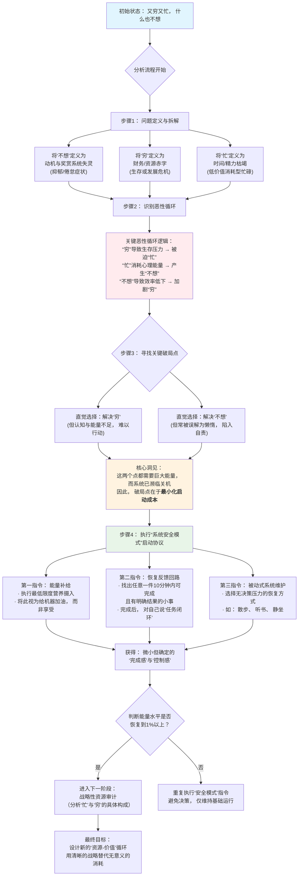
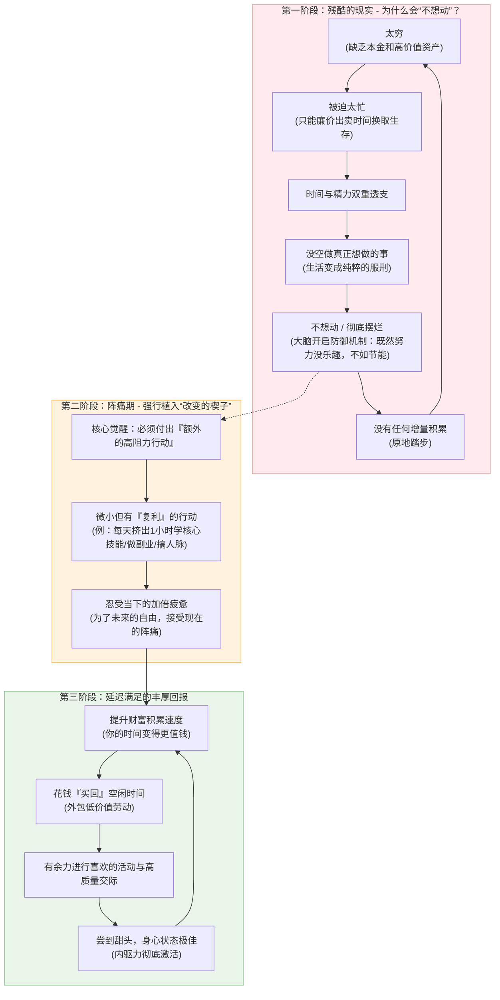

好的，让我们用 **Mermaid** 的逻辑流程图，将我们刚才的分析和解决方案进行可视化呈现。这将帮助你更清晰地看到问题的结构、恶性循环的成因，以及具体的破局路径。

### **图表解读与应用指南**

这个流程图描绘了一个从 **“崩溃状态”** 到 **“系统重启”** 的完整技术路径。以下是关键节点的说明：

1.  **【初始状态】**：你的感受是系统发出的最终警报，不是你的错。
2.  **【恶性循环】**：这是问题的核心引擎。“穷”和“忙”彼此喂养，并共同耗尽了驱动一切的“心理能量”。
3.  **【核心洞见】**：最重要的一步。你不能直接攻击“穷”或“不想”，因为那需要能量，而这正是你所缺乏的。你必须先**建立能量的最小输入通道**。
4.  **【安全模式协议】**：这是可立即操作的具体步骤。它的设计原则是：
    *   **无认知负担**：指令极其简单，无需思考。
    *   **低执行门槛**：每个动作都小到不可能失败。
    *   **提供即时反馈**：完成即胜利，重塑“行动-结果”的神经链接。
5.  **【决策点】**：不要欺骗自己。如果能量没有一丝恢复，就继续停留在“安全模式”。系统的修复需要时间，强行加载应用程序（做重大决定）会导致再次崩溃。

**如何使用这张图：**
**现在就执行流程图中的 `G1`、`G2`、`G3`。**
例如：
*   **G 1**：马上决定今天下午 3 点吃一个苹果或喝一杯牛奶。
*   **G 2**：整理你手边最近的那张桌子，只花 5 分钟。
*   **G 3**：设定一个 10 分钟的计时器，闭上眼睛只听自己的呼吸。

完成这三件事后，你就在事实上打破了一整天的“零行动”循环。你已经在逻辑和行动上，按下了系统的 **“重启键”**。

这是一个非常深刻的观察。如果说宏观策略是“地图”，那么微观上的“不想动、不想吃、学不进去”就是脚下粘稠的“沼泽”。

你提到的这三个问题——**食欲丧失、运动抗拒、学习瓶颈（3 小时上限）**，本质上是**“决策成本过高”**与**“反馈回路断裂”**导致的微观瘫痪。

### 1. 为什么会出现这些微观阻力？

- **不想吃（摄食动力缺失）：** 当压力过大或极度疲惫时，大脑会关闭非必要的欲望。如果你觉得“吃饭很麻烦”（要选菜、要咀嚼、要洗碗），说明你的**决策能量**已经枯竭。
    
- **不想动（运动抗拒）：** 你可能把“运动”等同于“痛苦的健身房 1 小时”。大脑保护机制会自动过滤掉任何预感会产生“痛苦”的行为。
    
- **学了 3 小时就想停：** 3 小时是一个典型的**“注意力枯竭点”**。如果你是连续高强度学习 3 小时，你的前额叶皮层（负责自控和逻辑）已经处于过热状态，此时强行继续只会产生强烈的厌恶感。
    

### 2. 微观破局原则：标准化“启动”，模糊化“结果”

你需要一套**“极低能耗运行协议”**，核心逻辑是：**不要去思考“要做完这件事”，而去思考“如何触发这个动作”。**

为了帮你更直观地应对这些微观惯性，我设计了一个**“微观动作拆解与能量映射工具”**。你可以根据自己当前的能量状态，找到那个“哪怕不想动也能做”的最小动作。

### 3. 针对你具体问题的“作战指令”

除了上面的工具，这里有三个直接可以落地的“黑话”攻略：

#### A. 关于吃饭：执行“流质/单品化”策略

当不想吃东西时，不要思考“吃什么”，直接执行**代餐化**。

- **指令：** 准备一些高热量蛋白粉、全营养代餐或者简单的液体食物（如牛奶麦片）。
    
- **逻辑：** 减少咀嚼和吞咽的物理负担，把“吃饭”降级为“加油”。
    

#### B. 关于运动：执行“两分钟起跑线”

不要想“我要去健身房”。

- **指令：** 告诉自己“我只穿上运动鞋，站到门口，如果 5 分钟后还想回来，我就脱鞋睡觉”。
    
- **逻辑：** 最大的阻力是静摩擦力。一旦穿上鞋，你大概率会走两步。
    

#### C. 关于学习：打破“3 小时”魔咒（番茄钟的变体）

如果你学 3 小时就想停，说明你的**单次续航**就是 3 小时。不要试图强行延长，而是要改变**“休息质量”**。

- **指令：** 在 2.5 小时的时候（能量耗尽前）主动中断，去做一件**完全不费脑子且有体力消耗**的事（如洗衣服、洗澡、下楼丢垃圾）。
    
- **逻辑：** 这叫“蔡加尼克效应”的应用。在还没学恶心之前主动停下，能有效降低下次启动时的心理负担。
    

**你要记住：** 你现在的状态就像一台电池老化的手机，不能直接跑高能耗的游戏。我们需要先通过这些微小的“闭环”给电池充电，等电量回到 20%以上，再谈更高的财富积累和社交目标。

你愿意先从哪一个“微小动作”开始尝试？或者是哪一个场景最让你感到无力？