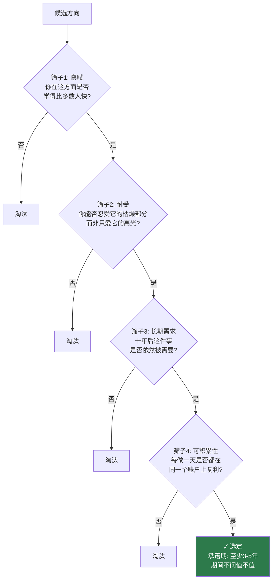
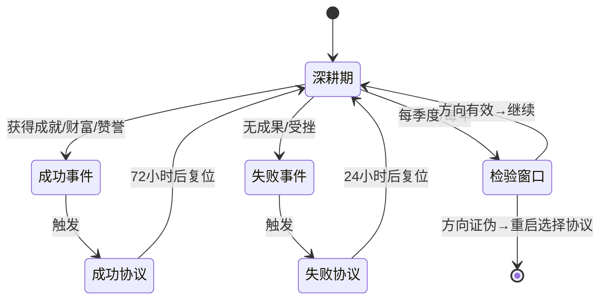
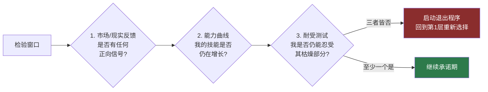
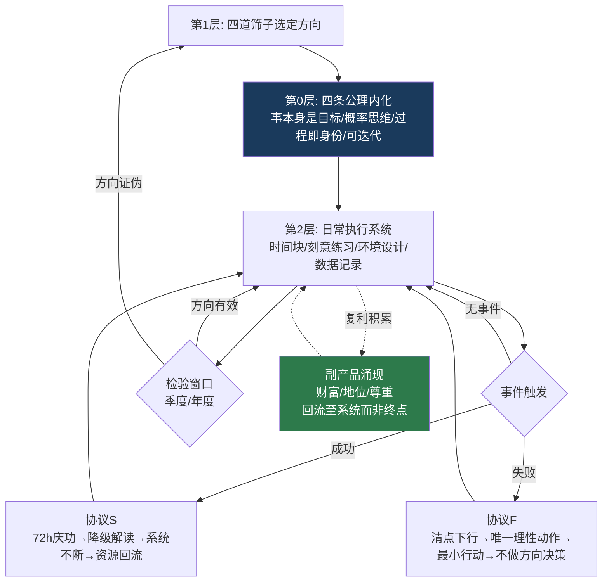

# 提问整理

## 第一次提问

**背景观点：**
1. 许多富豪已实现财富自由（数百万足以幸福一生），却依然选择工作。原因是他们早已坚定选择了这种生活方式——财富不是目标，而是做事本身的馈赠。
2. 宫本武藏成为剑道宗师，靠的不是对胜利的渴求，而是对剑道本身的深入研究。若过度渴求胜利，可能借助权力、金钱或操纵人性等捷径，反而无法在剑道上达到巅峰。他因专注剑道与自律而获得尊重与地位。
3. 正确的做法不是模仿他人表面，而是做出同样坚定的、发自内心的、毫无杂念的选择。即使日后遭遇难以解决的困难甚至生死抉择，依然选择面对、接纳，无论多痛苦都愿意承受。这才是走得更远的第一步。
4. 每个人的性格和资源配置不同，选择存在差异，但在"决定"与"接纳"上是相通的：先活出自我，再刻苦钻研，最后寻求成功的契机。

**请求：**
梳理这一模型，可用图形化或 Mermaid 整理思路，并用最科学、最现代的方法评价该总结。

---

## 第二次提问

**立场调整：**
- 不要求评价和总结，要求整理出一套最顶级、最正确的方法——一套逻辑闭环的方案，用于今后人生中实行。
- 自己提供的想法仅供参考，非绝对正确；由 AI 负责输出绝对正确的方案。

**补充观点：**
1. **取得成就时的心态**：取得一点成就后，他人的夸奖、认同或一时的财富，可能让人以为可以不再枯燥劳累。实则不然——这可能让人重新陷入贫穷陷阱，退化为普通人。只有不断坚持，才能让财富持续增值并守得住。
2. **失败时的心理应变**：在毫无成绩或失败时，要想到自己已经没什么可失去的。唯一能做的只有那些，即使希望渺茫，那也是唯一能做的。虽然没有意义或希望不大，但那也是生活中的一点微光。

# 人生操作系统：一套逻辑闭环的长期主义实践方案

下面是完整方案。我把它设计成一个**操作系统**：底层是公理，中层是协议，上层是日常执行，外加应对成功与失败的两个专用模块，以及一个防止沉没成本的检验回路。每个环节都有明确的触发条件和动作，不是口号，是可执行的规则。

---

## 第 0 层：四条公理（不可再简化的地基）

| 公理 | 内容 | 推论 |
|---|---|---|
| A 1 | **内在驱动**：目标是"事本身"，财富与名誉是涌现的副产品 | 永远不以副产品为决策依据 |
| A 2 | **概率性**：专注大幅提高成功概率，但不保证必然 | 不因失败否定路径，不因成功神化自己 |
| A 3 | **过程即身份**：你不是"在做"这件事，你"就是"做这件事的人 | 动力不依赖外界反馈 |
| A 4 | **可迭代**：坚持不是盲从，系统自带检验与退出机制 | 杜绝沉没成本陷阱 |

这四条互相咬合：A 1 保证方向纯净，A 2 保证心态稳定，A 3 保证动力不竭，A 4 保证不死在错误的路上。**缺任何一条，系统都会崩溃**——缺 A 1 会沦为投机，缺 A 2 会在失败时崩溃，缺 A 3 会在枯燥期放弃，缺 A 4 会撞死在墙上。

---

## 第 1 层：选择协议（一生只做几次，但必须做对）

选择不是凭激情，而是过四道筛子：

**关键规则：**
- 选定时不要求"毫无杂念"——那不可能。标准是：**杂念存在，但你的行动不受杂念指挥**。
- 承诺期内禁止重新评估方向。评估只在固定的检验窗口进行（见第 4 层）。这是为了防止情绪波动伪装成"理性反思"。

---

## 第 2 层：执行系统（日常层面）

每天不需要意志力，需要系统：

1. **固定时段**：每天给核心之事一个不可侵占的时间块（哪怕只有 90 分钟），先于一切琐事执行。
2. **刻意练习结构**：始终在自己能力边缘操作——太易则厌，太难则溃。每次练习必须有明确的改进点，而非重复已会的东西。
3. **环境设计**：让正确行为的摩擦力最小，错误行为的摩擦力最大。不依赖自控，依赖结构。
4. **记录而非感觉**：用日志追踪投入量（小时数、产出数），不追踪"今天感觉如何"。感觉会撒谎，数据不会。

---

## 第 3 层：双态应对协议（你补充的两点，正式编入系统）

这是整个系统最容易被忽视、却决定生死的部分。**大多数人不是死在方向上，而是死在对成功和失败的错误反应上。**

### 协议 S：成功时的处置（防止"贫穷陷阱"）

触发条件：获得任何级别的成就、赞誉或意外之财。

| 步骤 | 动作 | 原理 |
|---|---|---|
| S 1 | **72 小时庆功上限**：允许自己高兴，但设定明确截止时间 | 多巴胺峰值会制造"已经到了"的幻觉 |
| S 2 | **降级解读**：把成就重新定义为"投入量的正常产出"，不是"我与众不同" | A 2：成功是概率事件落在你身上，不是神迹 |
| S 3 | **系统不间断**：庆功结束的第二天，时间块照常执行 | 复利的中断成本高于想象——**守得住比赚得到更难** |
| S 4 | **成果再投入**：新获得的资源优先回流到核心之事，而非消费升级 | 消费升级是"退化回普通人"的入口 |

一句话规则：**成就只证明过去的方法有效，不证明未来的你可以松懈。**

### 协议 F：失败时的处置（微光机制）

触发条件：长期无成果、遭遇重大挫败、自我怀疑涌现。

| 步骤 | 动作 | 原理 |
|---|---|---|
| F 1 | **清点下行风险**：明确问自己"继续做的最坏结果是什么？" | 多数情况下答案是：无非是现状延续。**下行风险已耗尽，上行空间仍然敞开** |
| F 2 | **识别唯一理性动作**：当希望渺茫时，继续做仍是期望值最高的选项——因为其他选项的期望值是零 | 绝望中不需要乐观，只需要算术 |
| F 3 | **缩小到最小行动**：不要求突破，只要求今天的 90 分钟照常完成 | 微光不需要照亮全程，只需要让你迈出下一步 |
| F 4 | **禁止在低谷做方向决策**：退出与否只能留到检验窗口 | 情绪低谷中的"理性判断"几乎总是错的 |

一句话规则：**失败时你不需要信念，只需要执行。信念是系统的事，不是你的事。**

---

## 第 4 层：检验回路（防止盲死）

每季度/每年一次，在**情绪中性**的日子回答三个问题：

**退出不是失败，是系统正常工作。** 前提是：退出决定只发生在检验窗口，不发生在情绪现场。

---

## 第 5 层：完整闭环总图

---

## 使用说明（三条元规则）

1. **系统的价值在于替代临场判断。** 你在顺境和逆境中的判断力都不可信——顺境高估自己，逆境低估路径。协议存在的意义就是在你最不可信的时刻替你决策。
2. **先僵化执行，再个性化调整。** 前两个承诺周期严格照做，之后才允许根据数据微调参数（时间块长度、检验频率等）。一开始就要"灵活变通"的人，通常只是在为放弃铺路。
3. **每年重读一次本方案。** 不是因为你记不住，而是因为成功之后你会不自觉地以为自己已经超越了它——那是系统失效的第一个信号。

这套系统的闭环在于：**方向由理性选定，执行为系统接管，情绪由协议对冲，错误由检验纠正，成果由复利放大。** 五个环节互为保险，任何一个环节失守都有下一个兜底。你要做的只剩一件事：让今天的 90 分钟照常发生。