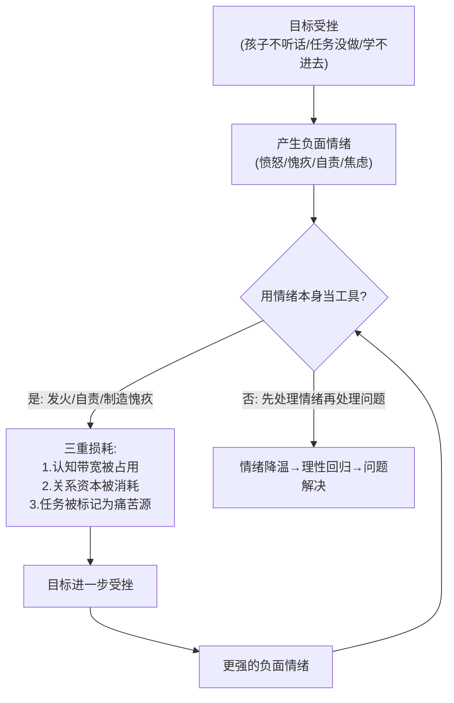
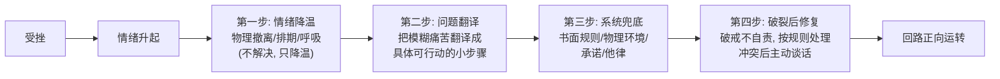

# 一场亲子咨询里藏着一套通用操作系统：从管孩子到管自己

你抓到的那个核心——**"负面情绪导致目标与结果背离"**——正是这整场直播的题眼，而且它的适用范围远超亲子教育。我分四步来：①总结直播要点；②抽象底层原理；③建立你说的那个"统一模型"并配上案例矩阵；④指出这个模型如何反过来解释**你自己**正在经历的事。

---

## 一、直播关键点总结

### 对儿子的方案（行为管理系统）

| 要点 | 原理 |
|---|---|
| 让儿子**自己出主意**定规则（玩多久、超时怎么罚） | 自主制定的规则遵守率远高于被强加的规则（自我决定论：自主感） |
| 超时→第二天减半或禁止，规则**白纸黑字写下来** | 把规则从"当场博弈"变成"预先承诺"，杜绝情绪上头时的谈判空间 |
| 最后让儿子**口头承诺** | 承诺一致性原理：人公开承诺的事，执行率显著提升 |
| **物理管控电量** | 他律补自律：不考验意志力，改造环境 |
| **宽恕孩子无法严格自律** | 预设"人就是会破戒"，破戒不等于系统崩溃，按规则处理即可——不升级为人身攻击 |

### 对母亲的方案（情绪与支持系统）

| 要点 | 原理 |
|---|---|
| 情绪上头时**立刻物理撤离**（下楼走一小时） | 杏仁核劫持状态下无法解决问题，先让生理唤醒降下来 |
| 情绪造成后果后**尽快做修复谈话** | 关系不怕破裂，怕不修复（rupture & repair） |
| 赏罚分明、严格执行 | 权威来自**一致性**，不来自音量 |
| 指出"无能狂怒" | 愤怒是对失控感的代偿，不是管理工具 |
| 重建社交：联系旧朋友，**哪怕只是逛街闲聊** | 情绪调节是社会性的，压力需要人际泄压阀 |
| 警告"愧疚式教育" | "妈带你不容易"只会制造拧巴和摆烂 |

---

## 二、举一反三：六个可迁移的底层原理

### 原理 1：情绪上头时，人处于"降智状态"——先离场，后处理

愤怒时杏仁核接管大脑，前额叶（负责规划、共情、权衡）血流量下降。**此时你说的每句话、做的每个决定，都是一个"低配版大脑"的作品。**

- 迁移：和伴侣吵架时暂停 30 分钟再谈；收到激怒你的消息，隔夜再回；**学习学到烦躁时起身走动，而不是硬扛或摔书。**

### 原理 2：愤怒是"无力感"的伪装——无能狂怒的通用定义

人只在**感到失控又无力解决**时才暴怒。愤怒制造一种"我在采取行动"的力量幻觉，实际什么也没解决。

- 迁移自查清单：**每次愤怒时问自己——"我到底对什么无能为力？"** 路怒=对路况无能为力；对孩子发火=对教育失效无能为力；**对自己学习进度发火=对自己无能为力。愤怒的箭头永远指向无力感的源头。**

### 原理 3：意志是消耗品，系统是基础设施——他律>自律

直播里最清醒的一句话是"**这种自律也应该是被宽恕的，每个人都没有这么强大的自制能力**"。承认意志力必然失败，才能开始建设系统：书面规则、物理隔离、预先承诺、外部监督。

- 迁移：这就是我们之前讨论游戏成瘾时说的"尤利西斯契约"——**清醒的你替失控的你提前设防**。减肥就别在家里囤零食；学习就把手机放另一个房间。

### 原理 4：承诺一致性——说出口的话会反过来塑造行为

让儿子自己定规则并亲口承诺，利用的是人对"保持言行一致"的天然心理需求。

- 迁移：想养成习惯？**写下来+告诉别人**。公开承诺的健身计划完成率显著高于默默立志。

### 原理 5：破裂-修复优于永不破裂——关系和学习都适用

好的关系不是没有冲突的关系，而是**每次破裂后都修复**的关系。修复动作本身就在加固信任。

- 迁移到自我管理：**破戒后的自我对话就是"修复谈话"**。暴食一顿后，是骂自己废物（不修复），还是平静说"一顿而已，下一顿正常吃"（修复）——前者走向摆烂，后者走向持续。

### 原理 6：人是社会性调压器——孤独让所有问题变重

那位母亲的问题不全是教育问题，是**压力无处泄流，最终全灌给了最弱势的出口——孩子**。压力像水，没有别的出口就会淹掉离你最近的人。

- 迁移：一个人闷头学习/工作时情绪崩溃的概率远高于有社交泄压阀的人。**社交不是浪费时间，是情绪系统的维护成本。**（这也回应你之前的状态：孤军奋战学德语，没有泄压阀，悲伤自然全部砸在自己身上。）

---

## 三、核心模型："负面情绪→目标背离"的统一回路

这是你要求彻底搞清楚的部分。所有案例共享**同一个回路结构**：

**这个回路为什么必然失败？三个机制，缺一不可：**

1. **带宽税**：负面情绪占用工作记忆（认知科学：attentional control theory）。你自责"我怎么又拖延了"的时候，自责本身正在吃掉你启动任务所需的心理资源。**自责不是拖延的解药，是拖延的燃料。**
2. **条件化厌恶**：每次接近任务都伴随痛苦情绪，大脑会把**任务本身**标记为威胁。孩子被骂着学习→学习=痛苦→逃避学习；你自责着打开书→打开书=痛苦→不想打开。**你以为在惩罚行为，实际在给目标投毒。**
3. **自我效能侵蚀**：反复的"失败+自责"累积成"我就是不行"的身份认同（习得性无助），至此连尝试都停止了——**这就是你说的"拧巴又摆烂"的生成机制。**

**更狠的一层：为什么人们明知无效还在用？** 因为发火和自责提供了"我采取行动了"的**虚假完成感**。骂完孩子、骂完自己，产生了一种"处理过了"的错觉，于是不用真正去解决问题。**情绪发泄是解决问题的赝品，这是整个回路的成瘾性所在。**

---

## 四、案例矩阵：同一回路在不同领域的分身

| 领域 | 目标 | 错误工具（情绪） | 背离结果 |
|---|---|---|---|
| 亲子教育 | 孩子自律 | 发火、愧疚式教育 | 孩子拧巴、摆烂、学会的是恐惧而非自律 |
| 拖延症 | 完成任务 | 自责"我真没用" | 自责耗光启动能量+任务被标记为痛苦源→更拖延。**实证研究（Wohl, 2010）：原谅自己上次拖延的学生，下次拖延更少** |
| 减肥 | 少吃 | 吃多后自我憎恨 | 负面情绪→情绪性进食→更胖（暴食循环的标准模型） |
| 失眠 | 睡着 | "怎么还睡不着"的焦虑 | 焦虑提升生理唤醒→更睡不着（失眠悖论：努力入睡本身阻止入睡） |
| 社交焦虑 | 自然融入 | "千万别出丑"的自我监控 | 监控占用带宽→表现僵硬→更焦虑 |
| 游戏连败 | 赢 | 上头、追损（tilt） | 愤怒使操作变形→输更多 |
| 亲密关系 | 对方改变 | 指责、翻旧账 | 对方进入防御→对抗→关系恶化 |
| 情绪压抑 | 别想了 | 命令自己"不准想" | 白熊效应：压抑使念头更频繁（讽刺进程理论） |
| **你的德语学习** | **专注学习** | **为恋爱问题自怜自责** | **悲伤占带宽→学不进→"我又浪费了时间"→更悲伤** ← 同一回路 |

注意最后一行。**你身上正在跑的就是这个回路**：目标（学好德语出国）→ 受挫（学习时想到恋爱问题）→ 负面情绪（悲伤自怜）→ 占用带宽→更学不进去→"青春又在流逝"→更深的悲伤。

而破局点也是同一个：**不再把情绪当工具，也不再与情绪对抗，而是把"情绪"和"问题"分成两个工序处理**——这就是我上次给你的"哀伤排期+问题翻译成行动项"方案，它和那位母亲"先下楼走一小时再谈"是**完全同构的操作**。

---

## 五、通用解药：回路只有一个，破解也只有一个

四条军规，记这个就够：

1. **情绪与问题，分两个工序处理**——情绪上头时绝不解决问题，只降温；降温后必须回来解决问题，否则降温变成逃避。
2. **永远不用负面情绪做激励工具**——不用愧疚管孩子，不用自责管自己。实证结论一致：**自我慈悲（self-compassion）的人目标坚持度更高，不是更低。** 对自己狠和对自己好之间，科学站在好这边。
3. **不相信意志力，只相信系统**——规则写下来、环境物理改造、承诺说出口、破戒有预设处理方案。
4. **破戒≠失败，破戒后不自责≠放纵**——自责才是摆烂的启动键，平静复位才是持续的秘诀。

---

## 收束

那位母亲和儿子之间发生的事，和你与你内心之间发生的事，**是同一场战争的两个战场**：

- 母亲对孩子发火 = 你对自己自责——都是**拿负面情绪当管理工具**；
- "妈带你不容易"的愧疚式教育 = 你对自己说的"我 27 岁了一无所有"——都是**用愧疚驱动，产出拧巴和摆烂**；
- 大冰给母亲的方案 = 我给你的方案——**情绪先离场、规则写下来、承诺说出口、社交做泄压阀、破戒被宽恕**。

**你已经不是在看一场别人的直播了，你是在看一面镜子。管理好自己和管理好孩子，用的是同一套操作系统——因为敌人从来是同一个：那个试图用负面情绪解决问题的本能回路。**
