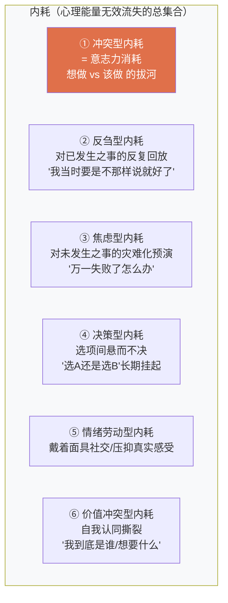
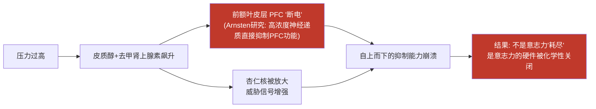
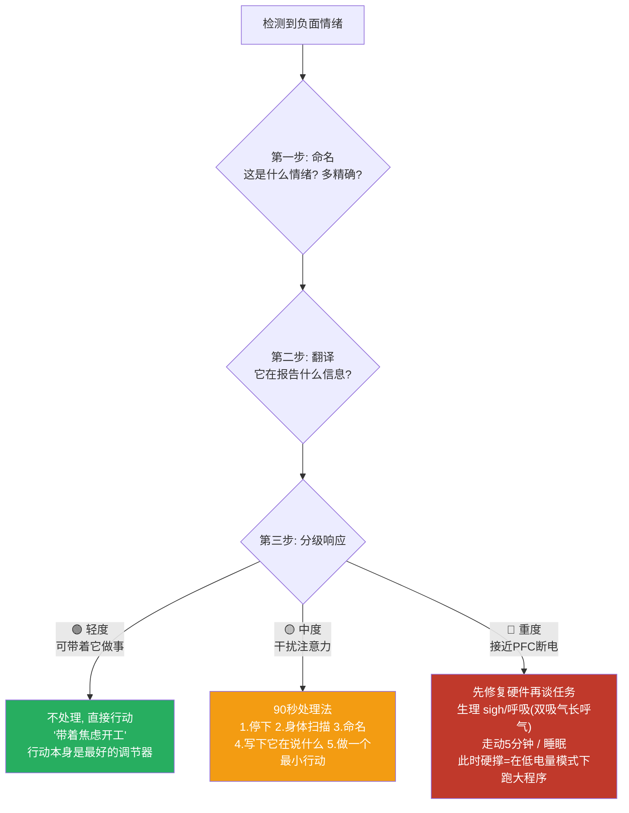
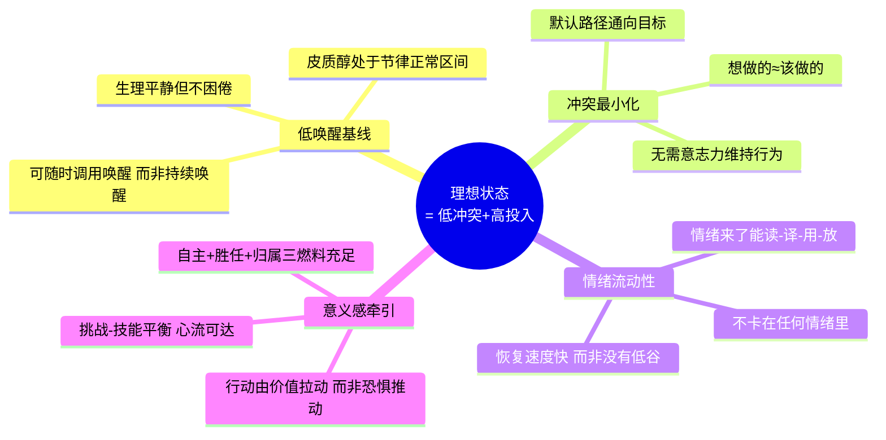

# 意志力的本质：由浅入深的解剖

在进入讲解之前，我先声明一个方法论立场：**"意志力"这个词本身是一个有问题的概念**。它像"燃素"之于燃烧——人们观察到现象（有时候能忍住，有时候忍不住），就发明了一个名词去解释它，但这个名词背后到底是什么，科学界争论了二十多年且至今未有定论。所以我会带你一层层剥开，直到抵达目前科学能够给出的最接近真相的回答。

---

## 第一层：日常理解（表象层）

普通人眼中的意志力：**"忍住不做想做的事"或"逼自己做不想做的事"的那种力量**。

- 忍住不刷手机 → 消耗意志力
- 逼自己早起 → 消耗意志力
- 坚持健身 → 消耗意志力

这个理解没有错，但它只是**现象描述**，不是机制解释。就像说"汽车跑是因为有动力"——对，但没用。

---

## 第二层：经典科学模型——"意志力是一块肌肉"

Baumeister（1998-2010 年代）提出著名的 **自我损耗理论（Ego Depletion）**：

> 自我控制依赖一种有限的心理资源，用一点少一点，像肌肉会疲劳，像血糖会被消耗。

**著名实验**：让被试者忍住不吃巧克力曲奇、只吃萝卜，之后解难题的坚持时间显著下降。

这个理论流传极广，但它有一个重大转折：

**2016 年，Hagger 等人组织了 23 个实验室的大规模重复实验（Registered Replication Report），结果：效应几乎为零。** 后续元分析进一步表明，即使存在损耗效应，也远比原理论宣称的小，且高度依赖情境和测量方式。

**这是必须知道的事实：你以为的常识（意志力会耗尽）在科学上已经基本被推翻了。**

---

## 第三层：修正后的主流模型——意志力不是"燃料"，是"决策"

既然不是资源耗尽，那是什么？当前最有解释力的两个模型：

### 模型 A：过程模型（Process Model，Inzlicht & Schmeichel）

> 所谓"意志力耗尽"，其实是**动机与注意力的转移**。

机制：当你长时间进行自我控制后，你的大脑会经历三个转变：
1. **注意力**从"该做的事"漂向"想做的事"；
2. **动机**从"必须做"转向"想要做"；
3. **情绪**变得更敏感，诱惑的信号被放大。

也就是说：**不是你的"意志力油箱"空了，而是你的大脑主动切换了优先级。** 它在说："够了，这笔账不划算，我要换台。"

这解释了为什么：
- 疲惫不堪时看个搞笑视频又能"复活"两小时——油箱明明空了？不，是动机被重新点燃了。
- 为热爱的事业连续工作 12 小时不觉得耗竭，写一份讨厌的报告两小时就"累瘫"——**消耗的不是资源，是心理账本的赤字感**。

### 模型 B：机会成本模型（Kurzban 的计算模型）

> 大脑持续在做一笔账：**继续控制的机会成本 vs 收益**。

你每次"忍住"，大脑都在计算："把认知资源继续压在这件事上，放弃了其他所有可能的机会，值得吗？"当账本显示亏损，你就感到"不想坚持了"——这个**主观疲劳感本身就是大脑发出的撤资信号**，而不是能量真的枯竭。

### 两模型的共同结论（最接近真相的表述）：

> **意志力 = 在动机冲突中，让长期目标短暂胜过即时冲动的执行过程。所谓"耗尽"，是大脑的成本收益系统判定"继续压制不划算"后，主动撤回资源的主观体验。**

它不是一种"东西"，而是一种**过程**和一种**感觉**。

---

## 第四层：神经层面——意志力到底是什么在运作

剥到最底层，"意志力"对应的是这些真实的神经事件：

```
前额叶皮层 (PFC) —— 目标维持 + 自上而下抑制
        ↕ 持续博弈
边缘系统 (伏隔核/杏仁核) —— 即时奖赏信号 + 情绪驱动
        ↕ 仲裁者
前扣带回皮层 (ACC) —— 冲突监测器（探测到两个系统在打架）
```

**关键洞察：ACC 监测到的"冲突强度"，就是你主观感受到的"费力感"。**

所以"消耗意志力"的本质是：**PFC 需要持续向边缘系统施加抑制信号，这是一场有代谢成本（葡萄糖、注意力带宽）的神经拔河**。累的不是某个神秘资源，而是：

1. **抑制本身的神经代谢成本**（真实但很小，血糖理论已被证伪为直接原因）；
2. **冲突监测带来的主观不适**（ACC 信号让你感到烦躁）；
3. **注意力带宽被占用**（一边工作一边压抑冲动，等于双任务运行）。

---

## 第五层：最本质的定义

把所有研究压缩成一句话：

> **意志力不是容量，而是冲突。**
> **"有意志力"= 冲突发生得少，或冲突解决得快。**
> **"没意志力"= 冲突频繁、剧烈、悬而未决。**

由此得出一个反直觉但极其重要的推论：

> **那些看起来"意志力极强"的人，恰恰是使用意志力最少的人。** 他们通过习惯、环境、身份认同，让冲突根本不发生。铁人三项选手早上 5 点训练不需要意志力——那是他的默认路径。真正消耗巨大的，是那个每天在床上跟闹钟搏斗一小时的人。

---

## 如何判断自己正在消耗意志力？——信号检测清单

既然意志力消耗=冲突的持续存在，那么信号就是**冲突的可观测症状**。按出现顺序排列：

### 🟡 早期信号（冲突开始）
1. **出现"讨价还价"的内心对话**："再玩 10 分钟就学习""今天状态不好明天再说"——这是热系统在和冷系统谈判，冲突已激活；
2. **频繁看时间/看手机**：注意力开始逃离当前任务，是动机转移的前兆；
3. **对诱惑的感知增强**：平时没注意到的零食、消息提示音突然变得显眼。

### 🟠 中期信号（冲突加剧）
4. **任务变得"面目可憎"**：同一份资料，一小时前还行，现在看就烦——不是材料变了，是 ACC 冲突信号污染了情绪；
5. **出现补偿性冲动**：突然想吃东西、想收拾房间、想查一个"紧急"问题——大脑在寻找撤退的体面出口；
6. **微小决策变得困难**："中午吃什么"都能纠结五分钟——认知带宽已被冲突占满。

### 🔴 晚期信号（系统即将投降）
7. **自我对话从"谈判"变成"找理由"**：开始为放弃构建正当理由；
8. **情绪敏感度飙升**：小事易怒、易委屈——情绪调节资源也被卷入了冲突；
9. **躯体感受**：太阳穴紧绷、叹气频繁、坐姿塌陷——冲突的生理外显。

**核心判别法（一句话版）**：
> 问自己："此刻我内心是不是有两个声音在争论？" 
> 有 → 正在消耗。争论越激烈、持续越久 → 消耗越大。
> 没有争论、只是单纯在做 → 哪怕很辛苦，也不在消耗意志力。

---

## 内耗 = 意志力消耗吗？——关键的概念辨析

**答案：不是。内耗是一个更大的集合，意志力消耗只是其中一个子集。**

这是很多人混淆的地方，必须拆开：



### 六种类型的对比解剖

| 类型 | 本质机制 | 与意志力的关系 |
|---|---|---|
| ① 冲突型 | PFC vs 边缘系统的拔河 | **这就是意志力消耗本身** |
| ② 反刍型 | 默认模式网络（DMN）过度激活，记忆反刍循环 | 不消耗意志力，但**占用带宽**，让意志力可用量下降 |
| ③ 焦虑型 | 杏仁核威胁预警持续鸣响 | 同上，且持续唤醒应激激素，间接削弱 PFC |
| ④ 决策型 | 决策冲突未闭合，Zeigarnik 效应让大脑后台挂起任务 | 是冲突的"冻结版"——不拔河，但绳子一直绷着 |
| ⑤ 情绪劳动 | 表层扮演（surface acting）需要持续抑制真实情绪 | **和意志力消耗高度同构**（都是抑制过程） |
| ⑥ 价值冲突 | 自我概念内部矛盾，最高层的冲突 | 是①的深层版本，消耗最持久最隐蔽 |

### 精确结论：

> **意志力消耗 ≈ 内耗的一种（冲突型+情绪劳动型）。**
> **但内耗的大头（反刍、焦虑、悬置决策）不是意志力问题，而是"未闭合的循环"问题——大脑把进程挂在后台空转，CPU 占用 100%却没有任何输出。**

用一个比喻收尾：

- **意志力消耗** = 两台发动机朝相反方向同时全力运转（烧油、发热、原地不动）；
- **其他内耗** = 发动机空转怠速一整天（不朝任何方向，但油照样烧完）。

两者都让你"什么都没做却很累"，但处方完全不同：

- 治**冲突型内耗**：减少冲突（环境设计、执行意图、习惯——也就是前两轮的方案）；
- 治**反刍/焦虑型内耗**：**闭合循环**——写下来、设"担忧专用时段"、认知解离（把"我很焦虑"换成"我注意到我正在产生焦虑的想法"）、具体化行动；
- 治**悬置决策型内耗**：给决策设死线，或接受"70 分决策优于完美决策"；
- 治**价值冲突型内耗**：这只能靠严肃的自我澄清——它甚至是唯一一种"值得保留的内耗"，因为它在逼迫你回答真问题。

---

## 最终的整合

**三个层次的真相，从浅到深：**

1. **表象**：意志力是"忍住"的力量，会用光。❌（已被证伪）
2. **机制**：意志力是动机冲突中的压制过程，"耗尽"是大脑判定不划算后的撤资信号。✓
3. **本质**：**不存在意志力这种"东西"，只存在"冲突"这种状态。管理的对象从来不是意志力，而是冲突本身——高手消除冲突的源头，凡人消耗在冲突的泥潭。**

而关于内耗：**意志力消耗是内耗，但内耗不全是意志力消耗。** 内耗的本质是**心理能量的无效损耗**，它有一个统一的治疗原则：

> **一切内耗，要么行动闭合它，要么认知放下它，最怕的是悬在中间反复咀嚼它。**

行动闭合不了的（如已发生的遗憾），就用认知解离放下；认知放不下的（如人生方向问题），就用行动去探明。既不肯行动又不肯放下的——那就是内耗的定义本身。


# 压力、焦虑与意志力：情绪动力系统的完整解剖

这个问题问到了整个情绪-动机系统的枢纽。我按逻辑顺序拆开四个问题：**①压力焦虑和意志力是什么关系？②"适度压力有益"到底对不对？③负面情绪是敌人还是导航？④理想的情绪状态长什么样、怎么到达？**

---

## 一、压力/焦虑与意志力的真实关系：不是敌人，是"电力系统"与"用电大户"

### 1.1 先厘清三个概念的本质

| 概念 | 本质 | 大脑对应 |
|---|---|---|
| **压力（Stress）** | 对"需求>资源"的评估反应，是**唤醒水平** | HPA 轴、皮质醇、交感神经系统 |
| **焦虑（Anxiety）** | 对**未来不确定性威胁**的预期警报 | 杏仁核、前岛叶 |
| **意志力** | 动机冲突中的压制过程（上一轮的结论） | PFC 对边缘系统的抑制 |

注意：**前两个是"能量/信号"系统，第三个是"控制"系统。它们不在同一层。**

### 1.2 它们的关系：耶克斯-多德森定律（Yerkes-Dodson Law）

这是 1908 年发现、至今仍是该领域基石的定律：

```
效率
 ↑
 │        ╭───╮
 │      ╱  最佳  ╲
 │     ╱  唤醒区  ╲
 │    ╱            ╲
 │   ╱              ╲
 │  ╱                ╲
 │ ╱                  ╲
 └────────────────────→ 压力/唤醒水平
   太低      适度      太高
  (无聊)   (高效)    (崩溃)
```

- **压力太低**：无聊、动机不足、拖延——没有唤醒就没有行动；
- **压力适度**：皮质醇和去甲肾上腺素恰到好处，注意力聚焦、效率峰值；
- **压力过高**：**这是关键转折**——

### 1.3 高压如何摧毁意志力：机制链条

当压力超过最佳区，发生的是一次**神经政变**：



**Amy Arnsten（耶鲁）的研究是这里最硬的知识**：急性高压会**直接化学性削弱 PFC 功能**——注意，这不是"消耗"，是**断电**。

由此得出精确结论：

> **① 适度压力不消耗意志力，反而提升它**（唤醒给 PFC 供能）；
> **② 高压不"消耗"意志力，而是直接关闭意志力的硬件**；
> **③ 真正消耗意志力的，是"对抗焦虑"这个动作本身**——这是下一个问题的答案。

---

## 二、"逼自己对抗焦虑"是不是意志力消耗？——是的，而且是最贵的一种

这里必须区分两件事：

| 状态 | 性质 | 意志力消耗 |
|---|---|---|
| **感到焦虑，带着焦虑继续做事** | 信号存在，但未发生对抗 | **几乎不消耗** |
| **感到焦虑，拼命压制/否认焦虑** | 发生了第二层冲突 | **大量消耗** |

这对应情绪调节研究（James Gross 的过程模型）中最核心的发现：

### 2.1 压抑（Suppression）vs 重评（Reappraisal）

- **压抑**："别焦虑！冷静下来！我不能慌！"——这是对情绪施加压制，**神经机制上和意志力消耗完全同构**（都是 PFC 抑制边缘系统）。研究证据：
  - 压抑**不能降低**情绪的生理唤醒（心率、皮质醇照样升）；
  - 反而**增加**双方的交感激活；
  - 占用大量认知带宽，记忆力和表现双降。
- **重评**："心跳加速是身体在给我供能，准备迎接挑战"——改变对情绪的**解释**而非压制情绪本身。几乎不消耗资源，且效果持久。

### 2.2 一个著名的实验证据：压力的"信念效应"

**Alia Crum（斯坦福）的研究**：让两组人看不同的视频——一组看"压力有害"，一组看"压力反应是身体在调动资源帮你"。之后经历压力任务时：

- "压力有害"组：皮质醇紊乱、血管**收缩**（典型威胁反应）；
- "压力有益"组：同样的皮质醇水平，但血管**扩张**、表现更好（典型挑战反应）。

**同一个压力，不同的解释，产生完全不同的生理和表现结果。**

### 2.3 由此得出核心公式

> **焦虑本身不消耗你，"我不该焦虑"这个念头才消耗你。**
> 
> 内耗 = 情绪（第一层） + 对情绪的对抗（第二层）。
> 第一层是免费的信号，第二层才是烧钱的战争。

这就是为什么很多人"被焦虑耗死"的真相：**杀死他们的不是焦虑，是与焦虑的战争。**

---

## 三、负面情绪是导航，不是故障——这是理解情绪的范式跃迁

### 3.1 情绪的真正功能：身体的仪表盘

演化心理学和情绪建构论（Lisa Feldman Barrett）给出的统一框架：

> **情绪不是 bug，是特征。每种情绪都是一条被压缩的高密度信息。**

| 情绪 | 它在报告什么 | 正确响应 | 错误响应 |
|---|---|---|---|
| **焦虑** | "未来存在不确定性威胁，需要准备" | 把模糊焦虑翻译成具体问题→列对策 | 压制它，或沉浸灾难化想象 |
| **压力** | "当前需求逼近我的资源边界" | 检查：需求能否砍？资源能否补？ | 硬扛到 PFC 断电 |
| **愤怒** | "有边界被侵犯/有不公" | 识别被侵犯的是什么，划界 | 发泄（强化回路）或压抑（积累） |
| **沮丧/低落** | "当前策略无效，需要撤退重估" | 允许暂停，复盘策略 | 强迫自己"积极起来" |
| **无聊** | "此事无意义感/无挑战" | 检查动机来源：自主？胜任？ | 用意志力硬顶（不可持续） |
| **嫉妒** | "我有一个未被承认的渴望" | 把嫉妒翻译成目标："原来我想要那个" | 羞耻+否认 |
| **拖延的冲动** | "任务定义不清/启动摩擦过高/价值不明" | 拆任务、降摩擦、问价值 | 自我辱骂"我就是懒" |

### 3.2 导航比喻的精确含义

GPS 播报"前方拥堵"时，你不会对 GPS 发火，也不会把 GPS 关掉——你会**读取信息并调整路线**。

情绪同理：
- **读它**（觉察：我现在是什么情绪？）
- **译它**（解码：它在报告什么信息？）
- **用它**（行动：针对信息调整策略）
- **放它**（信息已读取，信号使命完成，自然消退）

**情绪的问题从来不是情绪本身，而是：读不懂（情绪粒度低）、译错（归因错误）、不用（只感受不行动）、不放（反刍）。**

### 3.3 一个重要的研究支撑：情绪粒度（Emotional Granularity）

Barrett 的研究发现：能用**精确词汇**命名情绪的人（区分"焦虑/不安/担忧/忐忑"vs 只会说"难受"）：
- 情绪调节能力显著更强；
- 压力下生理反应更健康；
- 心理韧性更高。

**仅仅给情绪精确命名这个动作（affect labeling），就能降低杏仁核激活、提升 PFC 控制**（Lieberman 的 fMRI 研究证实）。这就是为什么写日记、倾诉有用——不是"发泄"，是**翻译**。

---

## 四、学习与工作中的情绪管理操作系统

### 4.1 三级处理协议（按情绪强度分流）



### 4.2 几个反直觉但证据扎实的操作

**① "带着情绪行动"优于"等情绪好了再行动"**
- 源自行为激活疗法：情绪跟随行动的频率，远高于行动跟随情绪。
- 焦虑不会在想通后消失，只会在**行动产生的反馈**中消退。

**② 把威胁重评写成书面语**
- 学习前心跳加速时，写一句："这是我的身体在供能，它认为这件事重要。"——Crum 的实验显示这个认知重评能改变血管反应。

**③ 给焦虑设"专属时段"（Worry Time）**
- 认知行为疗法（CBT）技术：每天固定 15 分钟"专门焦虑"，其他时间焦虑来袭时告诉自己"记下来，留给 XX 点"。研究显示能显著减少全天反刍——因为你给了警报一个**被听见的承诺**，它就不用一直响。

**④ 区分"该听的焦虑"和"该放手的焦虑"**
- 可控的 → 焦虑转化为行动清单；
- 不可控的 → 练习接纳（"我注意到我在担心一件我无法控制的事"）。
- 这是斯多葛控制二分法的现代临床版。

---

## 五、理想的积极情绪状态到底是什么？——不是"打鸡血"

这是最常被误解的部分。理想的情绪状态**不是**：
- ❌ 永远开心兴奋（那是躁狂，且不可能）；
- ❌ 毫无负面情绪（那叫情感麻木）；
- ❌ 靠意志力维持的"正能量"（那是最贵的内耗）。

### 5.1 理想状态的科学画像：四个特征



### 5.2 用一句话精确描述

> **理想的情绪状态 = 一辆仪表盘清晰、发动机安静、方向盘灵敏的车。**
> - 仪表盘清晰：情绪信号能被准确读取（情绪粒度）；
> - 发动机安静：基线低唤醒、低内耗、无空转；
> - 方向盘灵敏：需要时可迅速调动唤醒进入冲刺（压力响应敏捷），通过后能快速回落（恢复力强）。

注意最后一点——**恢复力（resilience）比稳定性更重要**。研究早已发现：心理最健康的人不是从不崩溃的人，而是**崩溃后回弹最快**的人。追求"从不焦虑"是错误目标，追求"焦虑→读取→响应→回落"的完整循环速度，才是正确目标。

### 5.3 学习工作场景的具体标准

**自查清单（满足越多，状态越接近理想）：**
- ✅ 开始学习时不需要内心谈判（低冲突，习惯/环境已接管）；
- ✅ 中途被打断后能较快回到任务（注意力弹性）；
- ✅ 出现焦虑时能在 30 秒内说出"我在焦虑什么"（情绪粒度）；
- ✅ 每天有至少一段忘记时间流逝的投入（心流体验）；
- ✅ 一天结束时累，但是"完成者的疲惫"，不是"战斗者的虚脱"；
- ✅ 遇到挫折，第一反应是"策略问题"而不是"我这个人有问题"（归因风格）。

---

## 总结：把所有关系浓缩成一张公式

```
你的总心理能量
   ├── 被消耗的部分
   │     ├── 意志力消耗 = 行为冲突（想做vs该做）
   │     ├── 情绪对抗消耗 = 与情绪的战争（我不该焦虑）
   │     └── 反刍空转消耗 = 未闭合的循环
   └── 被供能的部分
         ├── 适度压力（唤醒在最佳区）
         ├── 意义感（价值牵引）
         └── 行动反馈（小成就的多巴胺）
```

**三条终极原则：**

1. **对压力**：不求无压，求"唤醒在最佳区"——太低压要加压（承诺装置/截止日期），超压要泄压（睡眠/运动/砍需求），因为它烧的是你的硬件。

2. **对焦虑**：不求消灭，求"读取后放行"——焦虑是信使，杀了信使，信还在，还会再派。

3. **对情绪整体**：目标是**灵敏的响应系统**，不是**恒定的积极状态**——正负情绪都是数据，卡住任何一种都是故障，让数据流过并驱动行动，才是健康的定义。