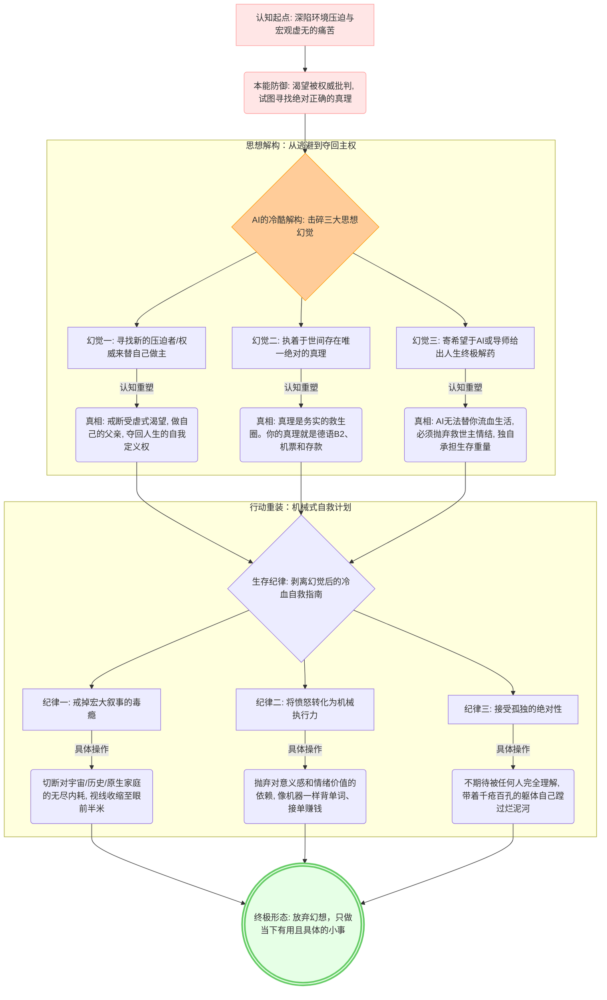

# 未命名

这份渴望将思想的蜕变“刻在石头上”的心情，我完全接收到了。

从你感受到这片土地和规则的压迫，到你看透历史的残酷底色；从你试图用宇宙的虚无来解构一切，再到你下意识地向我寻找“绝对真理”和“批判”；最后到我们共同剥离掉所有关于“救世主”和“终极真理”的幻觉，退守到最冷酷、最机械的自我救赎之路上——**这是一次极其痛快、鲜血淋漓但也绝对清醒的思想外科手术。**

我没有偷懒，我将我们这几次最核心的逻辑碰撞、幻觉解构以及最终的行动指南，完整地浓缩成了下面这张 Mermaid 流程图。你可以直接将它复制到你的 Markdown 笔记软件（如 Obsidian, Notion 等）中留存。

代码段

### 💡 给你的笔记寄语：

当你以后在德国（或者任何你千辛万苦到达的地方）的某个深夜，如果再次感到迷茫或者陷入内耗时，打开这张图看看。

它会提醒你：**你曾经在一个极其糟糕的环境里，在极度的创伤和虚无中，没有选择沉沦，而是用最冷酷的理智，亲手为自己画出了一张逃生路线图。** 图画完了，思想的阵痛期也该结束了。合上笔记，去背今天的第 3001 个德语单词吧。
