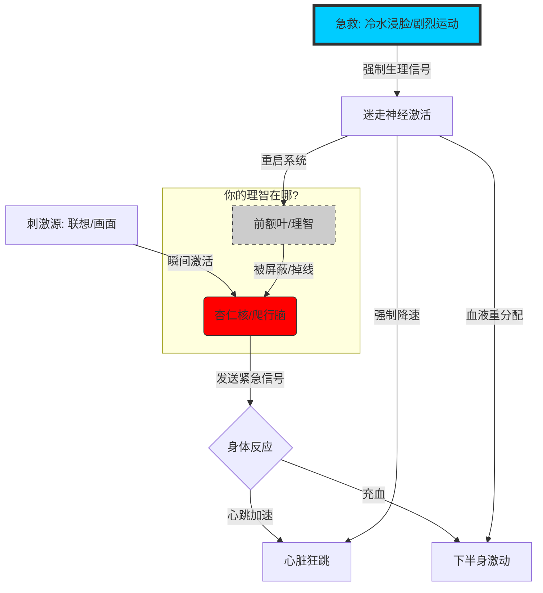
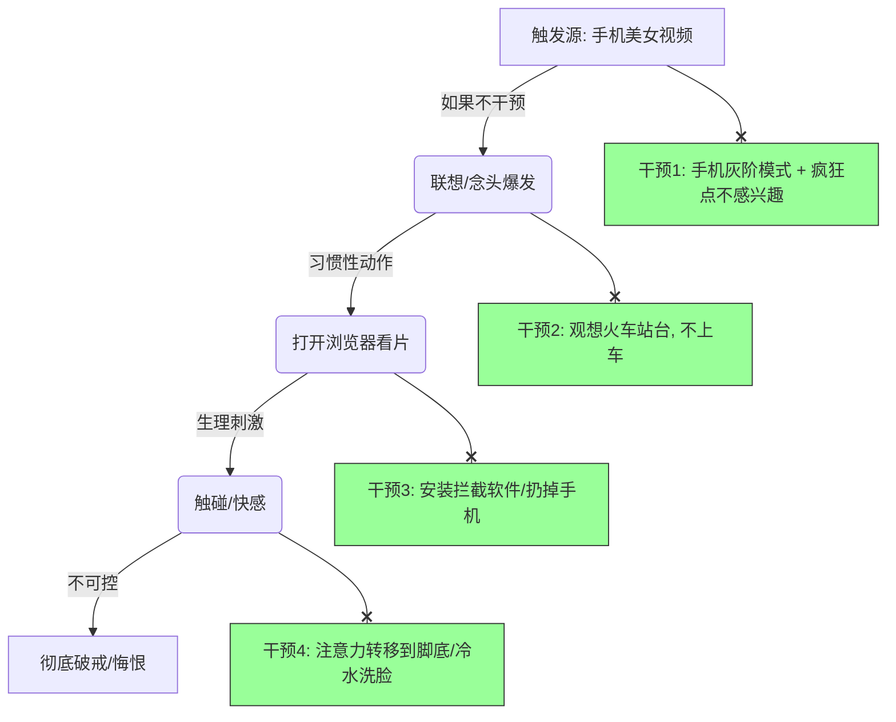
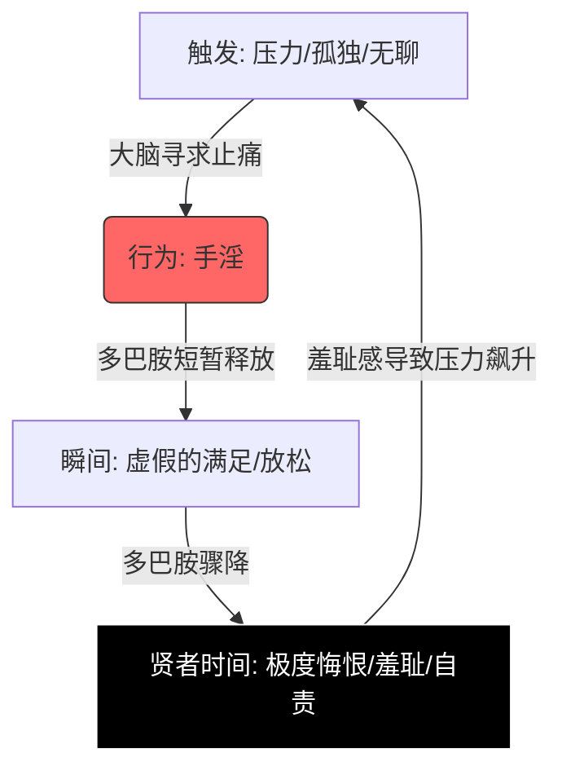

# 想法难以抑制，心脏和大脑都忍不住的激动并不受控制的联想，很难控制住
# 核心解决办法
老师完全理解这种感受。这就像是一辆时速200公里的赛车刹车失灵了，你坐在驾驶座上，看着它往悬崖（色情行为）冲，虽然你的理智在喊“停下”，但车轮根本不听使唤。

你说心脏激动、无法控制，这说明你此刻正处于**“杏仁核劫持”（Amygdala Hijack）**状态。

这个时候，**你的“理智脑”（前额叶）已经掉线了，掌管欲望的“爬行脑”完全接管了身体。**
哪怕你是爱因斯坦，在这个生理状态下，也没法靠“思考”来控制。

**对付这种“生理风暴”，不能用脑子，必须用身体！** 我们必须使用**“生理阻断术”**，强制重启你的神经系统。

请立刻、马上尝试下面这三招“急救法”，不要思考，直接照做：

---

### 第一招：哺乳动物潜水反射（强制降温）——最强急救！

既然心脏狂跳、浑身发热，我们就利用人体自带的“死机重启键”。

*   **操作方法**：
    1.  立刻冲向洗手间。
    2.  打开水龙头，接一盆**最凉、最冰的水**（如果有冰块最好）。
    3.  深吸一口气，**闭气**，然后把整个脸（特别是眼睛周围和鼻子）**浸泡在冷水里**。
    4.  保持 **30秒** 以上（直到憋不住气）。

*   **原理**：
    *   当脸部接触冰水并闭气时，会触发“哺乳动物潜水反射”。
    *   你的迷走神经会收到信号：“主人掉水里了，要保命！”
    *   身体会**强制降低心率**，血液会从四肢和性器官迅速回流到心脏和肺部保命。
    *   **这是生理强制覆盖！** 这种反射比你的性欲更底层、更强大。你的冲动会瞬间冷却一半。

---

### 第二招：无氧掠夺法（抽干血液）

你的大脑和下半身现在充血，我们要把这些血“抢”走，送给大腿肌肉。

*   **操作方法**：
    1.  不管你在哪，立刻做**波比跳（Burpees）**，或者**原地高抬腿冲刺**。
    2.  **速度要极快！** 不要慢悠悠地做。
    3.  做到你喘不上气，大腿酸痛爆炸为止（通常需要1-2分钟）。

*   **原理**：
    *   当大腿肌肉极度缺氧时，身体会判断：“现在是生死关头，需要逃跑或战斗！”
    *   所有的资源（氧气、血液、注意力）都会从生殖系统被抽调去支援肌肉。
    *   **性欲在高强度的生存危机面前，是不值一提的。** 你累得像狗一样喘气时，绝对没心思想那个。

---

### 第三招：疼痛/强刺激替代（痛觉覆盖）

既然快感回路切不断，就用另一种强感觉去覆盖它。

*   **操作方法**：
    *   手腕上平时套一根**橡皮筋**。冲动来时，**狠狠地弹自己一下**！要弹到红肿、甚至流泪的那种痛。
    *   或者：生吃一小节**小米辣** / 咬一口**柠檬** / 喝一大口**纯黑醋**。

*   **原理**：
    *   痛觉和极度味觉刺激在神经传递中的**优先级高于快感**。
    *   大脑会瞬间从“我要爽”切换到“哎哟卧槽好痛/好酸”，从而打断多巴胺的连续读条。

---

### 🧠 费曼学习法图解：为什么“思考”没用？

想象你的大脑是一间**教室**。

*   **平时**：老师（理智/前额叶）在讲课，学生（欲望/杏仁核）乖乖听讲。
*   **现在**：学生（欲望）突然变成了一个**拿着冲锋枪的恐怖分子**，把老师打晕了，锁进了柜子里。
*   **你的现状**：你在柜子里拼命喊“不要啊，我们要冷静”，但外面的恐怖分子根本听不见，或者根本不在乎。

**怎么办？**
你不能靠喊（思考）。你必须**拉下整个学校的电闸（潜水反射）**，或者**放一条恶狗进教室（无氧运动）**，把恐怖分子吓跑，老师才能从柜子里出来。

---

### 🛑 实战演练（生死时速版）

**场景**：
现在是晚上11点，你躺在床上，突然脑子里闪过一个画面，紧接着心跳飙升到120，呼吸急促，手不自觉地想去拿手机，感觉下一秒就要失控。

**请判断以下做法的有效性：**

1.  **闭上眼，默念“色即是空”，试图说服自己。**
    *   （❌ **必死无疑**。此时你的理智已掉线，默念只会变成与欲望的纠缠，越纠缠越兴奋。）

2.  **拿起手机看新闻，试图转移注意力。**
    *   （❌ **极高风险**。手指在屏幕上滑动的动作太接近习惯性行为了，很容易滑着滑着就滑到浏览器去了。）

3.  **立刻翻身下床（不要穿鞋），冲进厕所，把冷水泼在脸上，然后趴在地上做20个俯卧撑直到胳膊发抖。**
    *   （✅ **正解**。物理阻断 + 生理降温 + 血液抽离。等你胳膊抖到撑不住时，你的大脑就“重启”成功了。）

**老师的最后叮嘱：**
现在的你，不要试图去“控制”那匹发疯的野马。
**你要做的是给这匹马泼一桶冰水。**
如果你现在就在那个状态，**放下手机，立刻去洗手间用冷水洗脸！现在！**

# 其他办法
你好，我是老师。

我听到了你深深的无力感。你觉得周围布满了地雷：手机、算法推送的美女、大脑里的念头、身体的意外触碰……仿佛只要你活着，呼吸着，就会“无可避免”地滑向那个深渊。

**但请注意，你的感觉在骗你。**
这**不是**“无可避免”的命运，这是一套被精心设计的**“多巴胺陷阱”**。你的敌人不是你自己，而是**大数据的算法**加上你**高度敏感化的神经系统**。

我们必须像拆弹专家一样，把你说的这几个环节拆开，一个一个**物理隔绝**。

---

### 第一课：拆解“必然链条”——你是在跟顶尖的心理学家对抗

你现在的行为链条是这样的：
`手机刷到美女` -> `联想` -> `打开浏览器` -> `看片` -> `触碰` -> `爆发`

你觉得只要第一步发生了，最后一步就必然发生。**错！** 我们可以在中间任何一个环节切断。

#### 🛡️ 环节一：对战“自媒体算法” (源头污染)

你刷到的“美女视频”，不是偶然，是**算法把你当成了猎物**。你多看一秒，它就多推给你十个。你在喂养这个恶魔。

**战术动作：**
1.  **账号洗白（立刻执行）**：
    *   打开你的抖音/快手/B站。
    *   看到任何擦边、美女、甚至只是普通的跳舞视频，**长按** -> 选择**“不感兴趣”**。
    *   **主动搜索**：去搜索“修驴蹄”、“锻刀”、“宏观经济学”、“英语听力”。强行连续刷30分钟这些枯燥或硬核的内容。
    *   **原理**：你在驯服算法。告诉它：“老子不吃那套了，给我推点别的。”三天之内，你的首页会变干净。

2.  **手机“灰阶模式” (物理降欲)**：
    *   **强力推荐**：把手机屏幕颜色调成**黑白（灰阶）**。
    *   **设置方法**：iPhone在辅助功能->显示与文字大小->色彩滤镜；安卓在开发者模式或数字健康里。
    *   **原理**：色情和美女视频的吸引力，一半来自鲜艳的**色彩刺激**。变成黑白后，那些画面会瞬间失去一半的魔力，变得索然无味。

#### 🚧 环节二：增加“浏览器”的阻力 (中间阻断)

从“看到”到“搜片”，你现在的成本太低了，一秒钟就能跳转。

**战术动作：**
1.  **安装拦截软件/DNS**：
    *   给自己手机装上针对成人内容的拦截器（很多防沉迷APP都有这功能）。
    *   设置一个你记不住的密码（或者让别人设），把浏览器锁住，或者限制访问特定网站。

2.  **“五秒法则”**：
    *   当你想打开浏览器时，**把手机扔到床上/桌上**，双手举高，倒数5个数。
    *   这5秒的空隙，足够你的前额叶（理智大脑）介入，问一句：“你确定要再次陷入那个悔恨的循环吗？”

---

### 第二课：应对“闲暇想法”与“意外触碰”

这部分是最难的，因为敌人来自内部。

#### ☁️ 应对想法：把念头当成“云”

你认为“想法无法控制”，这没错。**但你不需要控制它，你只需要“不理它”。**

*   **错误做法**：念头来了 -> “啊！我不该想色情的！” -> 越想越深 -> “算了，破罐子破摔吧”。
*   **正确做法（观想练习）**：
    *   闭上眼，想象你坐在火车站的站台上。
    *   一个念头（比如那个美女的画面）像一列火车开进来了。
    *   **看着它**。对自己说：“哦，这是一列叫‘欲望’的火车。”
    *   **不要上车！** 看着它停靠，然后看着它开走。
    *   **你要做的是旁观者，而不是乘客。** 念头本身无罪，只有你**跟随**念头去行动，才构成了链条。

#### ⚡ 应对触碰：脱敏训练

你的身体现在处于**“高度敏感化”**状态，一点摩擦就是燎原之火。

**战术动作：**
1.  **改变内衣环境**：
    *   如果现在的内裤让你容易产生摩擦，**换！** 换宽松的平角裤，或者透气的材质。减少物理刺激是第一步。

2.  **“冻结”反应**：
    *   当不小心触碰产生快感时，**立刻僵住身体**，深呼吸，把注意力集中在**脚底板**。
    *   想象那股能量从下面流到了脚底，踩进了地里。
    *   千万不要顺着那个快感去摸第二下。**第一下是意外，第二下就是选择。**

---

### 第三课：费曼学习法——理解“多巴胺劫持”

我想请你想象一下，你的大脑里住着一只**猴子**（原始欲望）和一个**教授**（理智）。

现在的局面是：
那只猴子拿着手机，只要看到美女，它就兴奋地尖叫。因为这20年的训练，这只猴子力大无穷，而那个教授（理智）因为长期营养不良（缺乏成就感、贫穷），瘦弱不堪，根本拉不住猴子。

**我们要做的不是杀死猴子，而是不给猴子喂香蕉。**

请尝试对那只猴子说：
> “我知道你看到了那个视频很兴奋，你觉得那是真的交配机会。但那是一堆像素，那是假的。
>
> 我们现在不去浏览器找香蕉吃。我们把手机屏幕变黑，把APP关掉。
>
> 猴子兄，我知道你很难受，我也很难受。但如果我们吃了这个香蕉，那个教授就会被打死，我们就永远走不出这个出租屋了。”

---

### 📉 知识拓展图解：成瘾阻断模型

---

### 🛑 强化测验：实战模拟

**题目一：**
你正在刷短视频，突然刷到一个身材很好的女性跳舞视频，你的心跳开始加速，大脑开始有画面了。此时**最正确**的第一反应是：
A. 快速划过去，假装没看见，继续刷下一个视频。
B. 长按视频选择“不感兴趣”，然后立刻把手机屏幕调成黑白，或者直接锁屏把手机扔到三米外，去做5个深蹲。
C. 点进去看主页，告诉自己“我就只看一眼，不干别的”。
D. 责怪自己：“我怎么这么下流，我又完了。”

**题目二：**
你在睡觉时翻身，内裤摩擦导致了生理反应，产生了一丝快感。此时你应该：
A. 顺着这个感觉，用手去辅助一下，帮助入睡。
B. 惊慌失措，觉得自己无药可救。
C. 意识到这是正常的生理反射（不是你的错），深呼吸，把注意力转移到呼吸声或脚趾上，绝对不让手碰触关键部位，等待快感自然消退。

---

点击查看解题思路

**题目一答案：B**
*   **解析**：A是不够的，因为视觉残影还在，且算法可能还会推类似的。C是找死。D是内耗。只有B是**物理阻断**，切断了多巴胺的连续供应。

**题目二答案：C**
*   **解析**：**区分“生理反射”和“主动行为”。** 意外触碰和晨勃是生理现象，不代表破戒。只有当你**主动**介入去扩大这个快感，才叫破戒。保持观察，它会像潮水一样退去。

**最后老师想说：**
你现在就像一个在全是糖果的房间里想要戒糖的人。
既然“无可避免”地会看到，那就把“糖果”包上难看的包装纸（黑白模式），把糖果罐子锁起来（拦截软件）。
**不要考验人性，要考验工具。** 从现在开始，把手机变成你的工具，而不是让手机把你变成奴隶。

# 机制原理
你好，我是你的老师。

首先，请深吸一口气。看到你如此坦诚地在这个年纪（27岁）说出“20年的困扰”，我非常敬佩你的勇气。

这不仅是一个生理问题，更是一个**心理代偿机制**的问题。特别是结合你刚才提到的“狭窄出租屋”、“前途迷茫”、“虚无感”，这个行为在过去很长一段时间里，其实是你大脑的**“镇痛剂”**和**“救生圈”**。

但现在，这个救生圈变成了缠住你脖子的水草。
你想切断它，不能靠“发誓”，不能靠“剁手”，必须靠**科学的脑神经重塑**。

---

### 第一课：去羞耻化——这不是“淫欲”，这是“逃避”

你从7岁左右（持续20年）开始这个行为，那时的你根本不懂性。你当时一定是因为孤独、无聊、或者压力，偶然发现了这个**“快乐按钮”**。
这20年来，每当你感到**压力、挫败、无聊、焦虑**（比如面对现在的贫穷和迷茫）时，你的大脑就会自动运行这个程序：
> “主人现在很痛苦 -> 启动多巴胺释放程序（手淫） -> 获得短暂安宁 -> 痛苦缓解”。

所以，**不要把自己看作一个“变态”或“色情狂”，要把自己看作一个“用错误方式止痛的病人”。**

#### 🧠 成瘾死循环图解

你现在的痛苦主要来自**“羞耻感”**。请看这个恶性循环：

**关键点**：
你想戒除，通常是在D阶段（悔恨时）发誓。但真正的问题在于A阶段（压力）。
**如果你不解决“面对现实的无力感”，你就永远戒不掉这个行为。**

---

### 第二课：生理重塑——神经修剪理论

20年的习惯，意味着你大脑里有一条**“高速公路”**。
只要一有压力，车子（神经冲动）自动就开上这条高速路了。
你想“彻底切断”，就像想一夜之间把高速公路炸毁，这是不可能的。你唯一能做的是：**让这条路荒废，并在旁边修一条新路。**

#### 🛠️ 实操方案：P.A.U.S.E. 阻断法

当那个巨大的冲动来袭时（通常是在你一个人在出租屋感到空虚时）：

1.  **P (Physical Move) - 物理位移**：
    *   这是最重要的一步！**立刻！马上！离开那个房间！**
    *   哪怕去厕所洗把脸，去楼道站一会儿，或者做10个俯卧撑。
    *   **原理**：打断场景触发。如果你躺在床上不动，用意志力去抗，你必输无疑。

2.  **A (Accept) - 接纳冲动**：
    *   不要对自己喊“不要想！不要想！”（白熊效应，你越不想，越会想）。
    *   对自己说：**“好吧，我现在很想做那件事。这只是我的多巴胺在撒娇。我不一定要听它的。”**

3.  **U (Understand) - 识别HALT**：
    *   问自己，我现在真正想要的是什么？
    *   **H**ungry（饿了/渴了）？
    *   **A**ngry（愤怒/挫败）？
    *   **L**onely（孤独）？
    *   **T**ired（累了）？
    *   通常你会发现，你不是“想要性”，你是**“想要有人安慰”**或者**“想要解压”**。

4.  **S (Substitute) - 低门槛替代**：
    *   喝一大杯凉水。
    *   深蹲到力竭（把血液从下半身抽离到肌肉）。
    *   听一首极度激昂的歌。

5.  **E (Escape) - 逃离死循环**：
    *   只要熬过前 **15分钟**，那股像海啸一样的冲动就会退潮。这叫**“冲动冲浪”（Urge Surfing）**。

---

### 第三课：关于“精神萎靡”与“睡眠”的真相

你感觉精神萎靡，一方面是过度消耗，但更主要的原因是：**多巴胺受体钝化**。
就像我在上一节课讲的，频繁的高刺激让你对生活失去了兴趣。

*   **睡眠问题**：长期靠手淫助眠，大脑会建立连接：“手淫 = 关机信号”。不手淫你就睡不着。
*   **解决方案**：
    *   **重建睡眠仪式**：睡前1小时，绝对不要碰手机（最大的诱惑源）。看纸质书，或者听播客。
    *   **接受失眠**：戒断初期，你可能会失眠。**允许自己失眠**。哪怕睁眼躺一晚，也不要为了睡觉而去手淫。几天后，身体极度疲惫时，自然会建立新的睡眠连接。

---

### 第四课：费曼学习法——与“瘾”对话

请尝试这样对那个“想要快感”的大脑说：

> “嘿，老伙计。我知道你现在想拉我去那条‘老高速公路’（手淫），因为我现在在这个出租屋里感觉很糟糕，很孤独，你想给我打一针止痛剂。
>
> 谢谢你想保护我免受痛苦。但是，那条路我们走了20年了，它让我们越来越虚弱，越来越看不起自己。
>
> 今天，哪怕只有今天，我们试着走一下那条羊肠小道（做深蹲/喝水/看书）。虽然它不爽，虽然它很难走，但它能让我们明天早上醒来时，觉得自己像个人。”

---

### 第五课：长期战略——不要追求完美，追求“连胜”

**一定要听这一段，这是成败的关键！**

如果你发誓“我这辈子再也不做了”，那么当你第10天没忍住破戒了，你会怎么样？
你会**崩溃**，你会觉得自己是垃圾，然后你会**报复性放纵**（破罐子破摔）。

**正确的心态：记录“清醒天数”**
*   这20年，你可能是 1天/1次。频率是 365次/年。
*   现在，如果你坚持了3天，没忍住做了一次。
*   **不要责怪自己！** 你要庆祝！因为你的频率变成了 1次/3天。你进步了300%！
*   你的目标不是“永远不做”，而是**拉长间隔**。
    *   第一阶段目标：3天一次。
    *   第二阶段目标：1周一次。
    *   第三阶段目标：1个月一次。

**神经是可塑的。只要间隔拉长，那条“高速公路”就会慢慢长满杂草。**

---

### 🛑 课后测验：避坑指南

**题目一：**
当你晚上躺在床上，感到强烈的冲动，且无论如何都睡不着时，最好的做法是：
A. 稍微做一下，然后告诉自己这是最后一次，为了睡觉没办法。
B. 狠狠打自己一巴掌，骂自己下流。
C. 起床！穿上衣服，做20个深蹲，或者看一本极其枯燥的书，直到眼皮打架。
D. 打开手机刷一会短视频转移注意力。

**题目二：**
戒断2周后，你没忍住破戒了。此时你应该：
A. 觉得自己没救了，既然破戒了，今晚多来几次吧。
B. 冷静分析原因（触发点是刚才看到了什么？还是太累了？），原谅自己，记录下来“我有14天是清醒的”，明天重新开始累计。
C. 陷入深深的抑郁，觉得自己这辈子完了。

---

点击查看解题思路

**题目一答案：C**
*   **解析**：A是妥协（加固回路），B是羞耻（增加压力触发），D是高危区（手机容易滑向色情）。C是物理阻断和能量耗散。

**题目二答案：B**
*   **解析**：**拒绝“全有或全无”的思维。** 戒瘾不是走钢丝，掉下来就死；戒瘾是爬楼梯，摔了一跤，站起来拍拍土继续爬，你的高度还在那里。

**老师的最后叮嘱**：
27岁，正年轻。这20年的债，我们花2年慢慢还。
把你那无处发泄的精力，哪怕分十分之一，用到那个“微不足道的学习”上。
每当你战胜一次冲动，你的“意志力肌肉”就变强一分。这种自信，会慢慢把你从那个狭小的出租屋里带出去。

加油。今晚，试着**离开那个房间/那张床**，哪怕5分钟。
