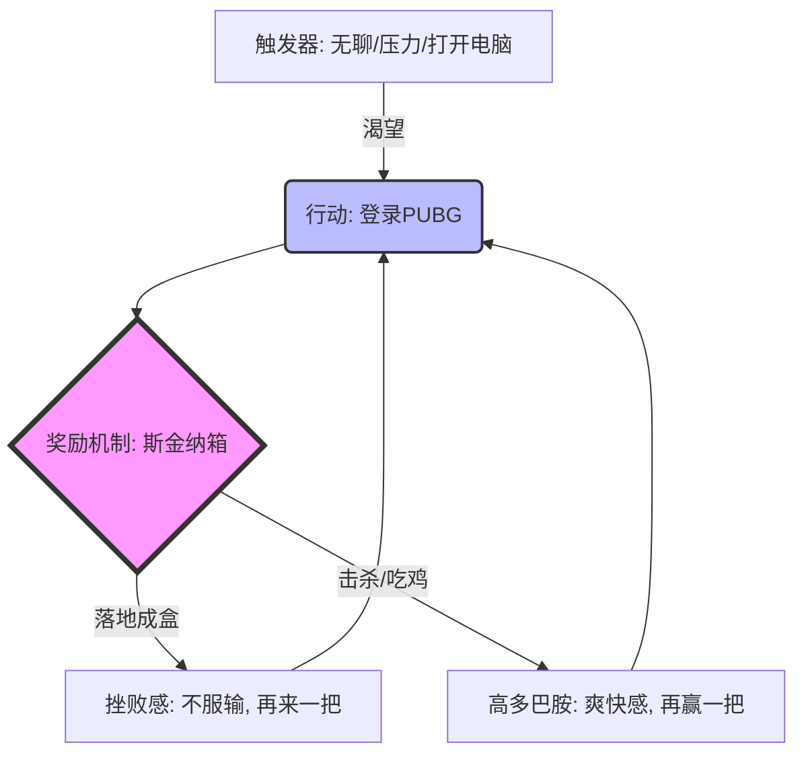
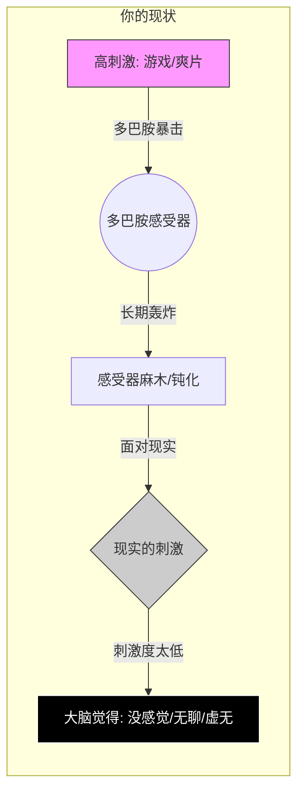
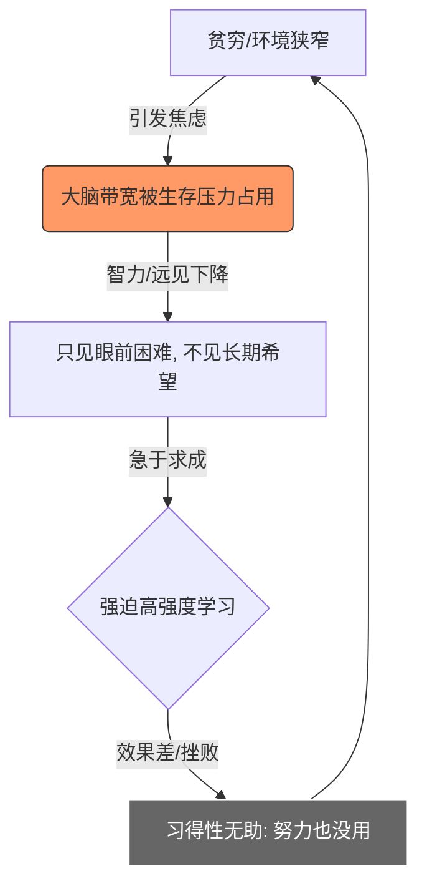

你好！我是你的老师。看到你此刻的焦虑和决心，我非常理解。这并不是你意志力薄弱，而是你正在与全世界最顶尖的心理学家、数据科学家和游戏设计师进行一场不对等的博弈。

你提到的《绝地求生》（PUBG）这类大逃杀游戏，是**现代工业设计的“多巴胺收割机”**。要想彻底戒掉并甚至“怨恨”它，我们不能仅靠“忍”，而要**看透它丑陋的本质**，把它的诱惑逻辑拆解得支离破碎。

咱们开始这场“思维手术”。

---

### 第一课：揭开面具——为什么你会成瘾？（多巴胺与斯金纳箱）

把游戏想象成一个**“数字斯金纳箱”**。
ID: 1774612231636

*   **斯金纳箱实验**：心理学家斯金纳把老鼠关在箱子里，按下按钮就会掉落食物。
    *   如果每次按都掉食物，老鼠吃饱就不按了。
    *   **如果随机掉落（有时有，有时没有，有时多，有时少）**，老鼠就会**疯狂地按按钮**，直到累死。

**PUBG 就是这个箱子，你就是那只小白鼠。**

1.  **随机性（Variable Rewards）**：落地有没有枪？圈刷在哪？草丛有没有人？全是随机的。这种“不确定性”直接刺激大脑分泌多巴胺。
2.  **幸存者偏差**：你觉得自己是特种兵，其实在算法眼里，你只是一个提供“日活数据”的节点。
3.  **沉没成本**：你玩得越久，不仅没得到真实的回报，反而因为投入了太多时间而不舍得离开。

#### 🧠 游戏成瘾机制图解

ID: 1774612231641

**老师的狠话**：
> 游戏设计师在屏幕背后看着你通宵达旦，他们不会感激你的努力，他们只会看着后台数据大笑：“看，这只小白鼠又在给我们贡献在线时长了，明年的奖金有着落了。”**你在燃烧生命，他们在用你的生命换跑车。**

---

### 第二课：制造厌恶——如何从“爱”转“恨”？

要让你怨恨游戏，我们需要进行**“认知重构”**。不再把它看作娱乐，而看作**寄生虫**。
ID: 1774612231647

#### 1. 视觉化剥削（The Parasite Metaphor）
想象一下，如果现实中有一个人，他每天：
*   抢走你的睡眠。
*   让你皮肤变差、黑眼圈加重。
*   让你无法学习、工作，失去赚钱的能力。
*   除此之外，他还让你情绪失控，为了虚拟的输赢骂脏话、摔鼠标。
ID: 1774612231652

如果这是一个人，你会报警抓他，甚至想揍他。**PUBG 就是这个人。**

#### 2. 戒断反应的真相
当你关掉游戏感到空虚、难受时，**不要认为是你离不开游戏**。
**真相是**：这是大脑被高强度刺激轰炸后，正常的“宿醉”反应。游戏是大脑的**电子毒品**，你在戒毒。
ID: 1774612231657

---

### 第三课：实战操作——物理隔绝与环境重塑

光想没用，必须动刀子。我们要通过增加**摩擦力**来阻断行为。
ID: 1774612231662

#### 🛠️ 举例说明：如何制造“不可能玩”的场景

| 策略层级 | 具体操作（越狠越好） | 原理 |
| :--- | :--- | :--- |
| **青铜级** | 卸载游戏。 | 增加下载的时间成本（摩擦力）。 |
| **黄金级** | **毁号**。把账号里的装备全融了，或者把账号送给一个你不认识的人，改密码绑死手机号。 | 断绝“沉没成本”，切断后路。 |
| **王者级** | **物理封印**。把显卡拔下来邮寄给父母或最严厉的朋友保管一个月；或者把电脑换成只能办公的轻薄本（核显，根本带不动PUBG）。 | **环境设计**，让“玩游戏”这个选项在物理上消失。 |
ID: 1774612231668

---

### 第四课：填补真空——费曼学习法引导输出

**核心逻辑**：当你拔掉了心中的“杂草”（游戏），如果不种上“鲜花”，杂草很快会再生。你需要高强度的替代品。
ID: 1774612231672

**老师建议的替代品**：
1.  **高强度运动**（如拳击、HIIT）：用内啡肽替代多巴胺，发泄精力。
2.  **阅读/学习硬核技能**：既然你能在游戏里研究枪械弹道，为什么不能在现实里研究股票K线或编程代码？后者能让你真金白银地赚钱。

#### 🔄 费曼学习法引导（请你现在大声对号入座）

为了确认你真的理解了，请你想象面前坐着那个**“昨晚通宵打游戏的自己”**，你要指着他的鼻子骂醒他。请尝试在心里或纸上完成以下填空：
ID: 1774612231677

> “听着，你以为你在玩游戏，其实你是被________（填入：斯金纳箱/算法）玩弄了。那个‘大吉大利，今晚吃鸡’的字样，本质上就是________（填入：一块虚拟的糖/数据代码），它除了浪费你的________（填入：生命/时间），什么都没给你留下。游戏设计师把你当成了________（填入：小白鼠/韭菜）。现在，立刻把显卡________（填入：拔掉/卖了），去夺回你的人生！”

---

### 拓展学习：由浅入深

为了巩固你的决心，建议你了解以下知识，彻底粉碎游戏的神话：
ID: 1774612231682

1.  **《欲罢不能：刷屏时代如何摆脱行为上瘾》**（书籍）：深度揭秘科技公司如何设计产品让你上瘾。
2.  **多巴胺排毒（Dopamine Detox）**：一种心理学疗法，教你如何恢复大脑对低刺激事物（如看书、发呆）的感知力。
3.  **心流（Flow） vs. 强迫循环**：区分什么是真正的快乐（心流），什么是被动的强迫（成瘾）。

---

### 🛑 课后测验：确认理解

为了确保你不是“听懂了但做不到”，请回答以下两道题目：
ID: 1774612231687

**题目一：**
当你此时此刻又产生强烈的冲动想下载游戏时，根据“斯金纳箱”理论，你应该意识到这是因为：
A. 我真的很想念我的队友。
B. 我的大脑渴望那个“随机奖励”的多巴胺刺激，我是被算法操纵的小白鼠。
C. 游戏是我的精神避风港。
D. 我只玩一把就好。

**题目二：**
根据“增加摩擦力”原则，以下哪种做法最能帮你在今晚彻底戒掉游戏？
A. 在电脑旁边贴个便利贴写“不要玩”。
B. 仅卸载游戏，心想反正网速快随时能下。
C. 把游戏账号注销/送人，并将电脑电源线锁在车里或交给信任的人保管。
D. 发誓明天一定不玩。

---

**（请在心里给出答案，再看下方的解题思路）**

点击查看解题思路

**题目一答案：B**
*   **解析**：必须把冲动归结为生理机制（小白鼠反应），而不是情感需求，才能产生“厌恶感”。选D是典型的上瘾者自我欺骗。

**题目二答案：C**
*   **解析**：意志力是靠不住的，意志力是消耗品。只有**物理上的隔离**（C选项）才是切断成瘾回路的最强手段。A、B、D都还保留了“立刻能玩”的可能性。

**结语**：
同学，现实世界这场游戏，虽然画质不如PUBG，没有倍镜和急救包，但**它是唯一一个你也只有一条命，且在这个服务器里赢得的每一分尊重和财富，都是真实的**。
去把你的显卡拔了，现在。

# 降低多巴胺
你好！我是你的老师。
ID: 1774612231691

我要先给你一个大大的拥抱。请听我说，**你现在的感觉是非常、非常正常的**。

你所描述的“虚无缥缈”、“人生了无乐趣”、“像活在重复的牢笼里”，在心理学和神经科学上有一个精准的解释：**戒断反应（Withdrawal Symptoms）伴随的多巴胺受体下调**。

这就好比你刚刚坐完连续坐了10个小时的疯狂过山车，下来后我让你去散步。你会觉得散步“太慢了、太无聊了、毫无意义”。
**不是散步没有意义，而是你的感官被过山车弄坏了。**

让我们用科学和哲学的双重手术刀，剖开这层“虚无”的迷雾。

---

### 第一课：生理真相——为什么现实世界变得“褪色”了？

游戏、爽文、短视频、好莱坞大片，它们属于**“超常刺激”（Supernormal Stimuli）**。
*   **游戏**：3分钟一个反馈，10分钟一把高潮。
*   **现实**：读一本书可能要3天才能体会到一点点心得；工作可能要努力一个月才能拿到工资。
ID: 1774612231695

#### 🧠 多巴胺阈值图解

请看下面这张图，这是你大脑现在的状态：
ID: 1774612231699

**关键点**：
现在的你，不是“看透了人生的无意义”，而是你**丧失了感知微小快乐的能力**。这叫**“快感缺失”（Anhedonia）**。你的快乐阈值被游戏拉得太高了，导致现实生活中的那些“低刺激”——吃饭的香味、路边的风景、解决一道难题的成就感——根本够不到你的兴奋点。

**这不是现实的错，是你的“接收器”坏了。好消息是，它是可逆的。**

---

### 第二课：哲学重构——重复不是牢笼，是阶梯

你觉得“日复一日的学习工作吃饭睡觉”毫无意义，像把一天重复了一辈子。
这让我想起了希腊神话中的**西西弗斯**（推石头上山的人）。
ID: 1774612231703

但是，我想告诉你两个概念，帮你打破这种虚无主义：

#### 1. 消费 vs. 创造（Consumption vs. Creation）
*   **玩游戏/看剧**是**消费**。你是被动的，你在吞噬别人设计好的精彩。这种快乐是虚幻的，一关机就没了，所以你会空虚。
*   **学习/工作/技能**是**创造**。这过程确实枯燥，是在打地基。但当你真正学会一项技能，或者完成一个项目时，那种快乐叫**“深层满足感”**。
ID: 1774612231707

**举例**：
*   吃快餐（打游戏）：吃的时候很爽，吃完满嘴油腻，身体虚胖。
*   自己种菜做饭（现实生活）：翻土、施肥、等待很枯燥（重复），但吃到自己种的菜那一刻，内心是充实的。

#### 2. “重复”的真相
如果你把每天看作是重复，那就是坐牢。但如果你把每天看作是**“迭代”**，那就是升级。
*   **游戏里的升级**：数据变了，你没变。
*   **现实里的重复**：你每天背10个单词，一年后你能读懂英文原著。这种“重复”让你在这个物理世界里变得更强了。
ID: 1774612231713

---

### 第三课：治疗方案——如何熬过“戒毒期”？

你现在正处于最痛苦的时期，叫**“多巴胺低谷期”**（The Dopamine Dip）。你需要做的不是强迫自己立刻爱上学习，而是**疗愈你的大脑**。
ID: 1774612231717

#### 🛠️ 实操建议：感官复健计划

1.  **忍受枯燥（Embrace Boredom）**：
    *   当感到无聊时，**不要**去拿手机，也不要强迫自己学习。就坐在那里，看着天花板，或者去散步。
    *   **原理**：让大脑极度饥渴。当大脑饿得受不了时，它会发现“看书”或者“打扫卫生”竟然也挺有意思的。
ID: 1774612231721

2.  **用“实体交互”替代“数字交互”**：
    *   不要马上进入高强度的脑力劳动。去做一些**手部工作**。
    *   **举例**：拼一个复杂的乐高、做一顿复杂的饭、去公园跑步直到力竭、手写日记。
    *   **为什么？** 这种反馈是真实的、触手可及的，能帮你重新建立与物理世界的连接。

3.  **设定“微小胜利”**：
    *   不要想“我要工作一辈子”，太绝望了。
    *   只想：**“我今天把这杯水喝完”、“我今天把这页书看完”**。
    *   每一次微小的完成，都在一点点修复你的多巴胺回路。

---

### 第四课：费曼学习法引导输出

我也曾经历过这种感觉，觉得现实世界是灰色的。但请相信我，当你熬过大概 **7 到 21 天**，色彩会回来的。
ID: 1774612231725

为了帮你坚定信念，请你尝试向那个“感到虚无的自己”解释现状：

> “嘿，听着。你觉得生活没意思，不是因为生活真的没意思，而是因为你的大脑刚刚经历了一场________（填入：多巴胺/游戏）的轰炸，现在处于________（填入：宿醉/感官麻木）状态。
>
> 现在的无聊和痛苦，其实是我的大脑在________（填入：修复/重启）它的接收器。这不是生命的尽头，这是________（填入：戒断反应）。只要我坚持做一些低刺激的事情（如运动、阅读），过一段时间，我重新找回对________（填入：真实世界）的感动。”

---

### 拓展：寻找意义的锚点

既然你觉得一切无意义，不如看看那些在“虚无”中找到力量的书：
ID: 1774612231729

1.  **《西西弗神话》（加缪）**：这书就是写给你的。它告诉你，即便推石头上山是荒谬的，但“推石头”的过程本身足以充实人心。**“必须想象西西弗斯是幸福的。”**
2.  **《活出意义来》（弗兰克尔）**：作者在纳粹集中营里（比我们要绝望得多）发现了：**人只要找到了意义，就能承受任何痛苦**。

---

### 🛑 课后测验：确认认知

**题目一：**
你现在觉得“看书学习像坐牢，打游戏像天堂”，是因为：
A. 书本的内容写得太烂了。
B. 现实世界本质上就是毫无希望的垃圾场。
C. 游戏是超常刺激，导致我大脑对普通刺激（现实）不敏感了，我在经历生理上的“戒断期”。
D. 我天生就不适合学习，只适合打游戏。
ID: 1774612231733

**题目二：**
面对这种“虚无感”，最正确的做法是：
A. 既然现实没意义，那就继续打游戏吧，快乐一天是一天。
B. 强迫自己每天学习12小时，用痛苦麻痹自己。
C. 接受“无聊”，主动减少高刺激源，做一些做饭、运动等实体活动，等待大脑受体自然恢复。
D. 去寻找更刺激的游戏来填补空虚。

---

点击查看解题思路

**题目一答案：C**
*   **解析**：一定要把问题**生理化**，而不是**哲学化**或**情绪化**。这是脑科学问题。既然是生理问题，时间就会治愈它。

**题目二答案：C**
*   **解析**：A是复吸，D是加重病情，B会让你崩溃从而导致报复性玩游戏。只有C是温和的、科学的“康复疗程”。

**老师的寄语**：
同学，你现在就像一个失去了味觉的人在吃白米饭，觉得味同嚼蜡。但请坚持吃下去，不要去吃加了致死量糖精的毒药。
过一阵子，你会突然发现，**原来白米饭也是甜的**。那个时候，你就真正自由了。

# 无效努力的绝望感
> [!question]
> 也有一些时候既不想打游戏，也不想学习赚钱工作，因为中国人一辈子前二十年，都在拼命努力学习到最后却只能压榨，钱也没赚到，感觉二十年的努力全部白费了，身体被贫穷限制，只能呆在狭小的出租屋里面靠着那微不足道的意思是希望，强迫自己每天学习，再次依靠学习来逆天改命，但是未来又是遥不可期的
ID: 1774612231739

你好，我是你的老师。

看着你敲下的这段文字，我感受到一种**深沉的窒息感**。隔着屏幕，我仿佛能看到那个在狭小出租屋里，对着书本发呆，既想逃避现实（打游戏），又被现实的鞭子抽打着不得不向前（学习），最后陷入**彻底僵直**的你。

你说的每一句话，**都是对的**。
这二十年的教育体系，确实常常把人变成“考试机器”，而非“生存强者”。
贫穷确实会限制人的想象力，那个狭窄的出租屋，就像一个物理上的牢笼，锁住了你的视野。

你现在处于一种**“习得性无助”叠加“存在主义危机”**的状态。
既不想堕落（不玩游戏），又无力上进（不想学习）。

别急，咱们把灯光调暗，不再谈什么“宏大叙事”，咱们只谈**“如何在废墟上喘口气”**。

---

### 第一课：重新定义“20年的浪费”——竹子定律

你觉得前20年白费了，因为你没有看到变现（钱）。但在生物学和认知科学上，**没有一种努力是完全白费的，它们只是暂时“休眠”了。**
ID: 1774612231744

#### 🎋 竹子的生长逻辑
有一种毛竹，前4年只长3厘米。因为这4年它在地下疯狂扎根，根系延伸数百米。到了第5年，它会以每天30厘米的速度疯长。
ID: 1774612231748

*   **你的前20年**：是在“扎根”。你学会了识字、逻辑思考、忍耐枯燥、寻找信息。这些是基础的**“根系”**。
*   **现在的困境**：你以为第21年就该长成大树（赚钱），结果发现还在泥土里。这巨大的落差让你绝望。

**老师的狠话**：
> 不要否定你的过去。如果你连前20年的自己都否定了，你现在的“地基”就彻底崩塌了。**你没赚到钱，是因为“社会游戏规则”变了，而不是你的“能力”是废品。** 你现在的学习，不是从零开始，而是给那套旧系统**装一个新的“变现插件”**。

---

### 第二课：破解“贫穷带宽”——为什么你会觉得遥不可期？

你觉得未来“遥不可期”，不仅是因为客观难，更是因为**贫穷夺走了你的智商**。
ID: 1774612231751

心理学有一个概念叫**“稀缺心态”（Scarcity Mindset）**。
当一个人缺钱（或者缺时间）时，他的大脑会被“怎么活过今天”填满。这会直接导致**智商下降 13-14 个点**，相当于通宵没睡。

*   **你的现状**：身处狭小出租屋 -> 焦虑房租/未来 -> 大脑带宽被占用 -> 无法深度思考 -> 学习效率低 -> 更加焦虑。
*   **这是一个死循环**。

#### 🧠 稀缺循环图解

ID: 1774612231756

**破局之道**：
你现在需要的不是“咬牙切齿地学习”，而是**给大脑“降噪”**。
*   **承认局限**：告诉自己，“我现在感觉绝望，是因为贫穷限制了我的大脑带宽，而不是因为我真的是个废物。”
*   **停止强迫**：当你“既不想玩也不想学”时，那是大脑在**强制关机保护你**。这时候强迫学习，效率为零，且增加厌恶感。

---

### 第三课：把“逆天改命”降级为“苟住发育”

“逆天改命”这个词太重了，重到能把人压死。
一旦你背负着“我要靠这次学习翻身”的压力，每一道错题都会变成“我这辈子完了”的审判。
ID: 1774612231759

我们换个策略：**苟住（Survival Strategy）**。

1.  **接受“平庸”的过渡期**：
    承认那20年的红利已经吃不到了。现在我们是在**荒野求生**。只要今天没饿死，只要今天比昨天多背了一个单词/多看了一行代码，就是**战术胜利**。

2.  **微小的环境改造（低成本）**：
    你无法立刻搬出出租屋，但你可以：
    *   花10块钱买个暖色灯泡（改变光线）。
    *   把书桌整理得一尘不染。
    *   **原理**：环境的微小秩序感，能对抗内心的混乱感。

3.  **把“希望”具象化**：
    不要想“美好的未来”，那太虚。
    只想：**“学会这个技能，我下个月能不能多赚500块？”**
    积小胜为大胜。先赚到那微不足道的500块，你的大脑就会收到信号：“哎？操作有效！”多巴胺才会正向分泌。

---

### 第四课：如果你现在什么都不想做（僵直期）

当你陷入那个“既不玩也不学”的真空时，请执行**“主动废柴计划”**：
ID: 1774612231763

1.  **允许自己躺平，但不要看手机**。
    *   躺在床上，闭眼，或者发呆。
    *   告诉自己：**“我现在是一块正在充电的电池。我有权利休息。”**
    *   消除**“负罪感”**。带着负罪感的休息是消耗，无负罪感的休息才是充电。

2.  **去晒太阳/走路**。
    *   走出那个出租屋。哪怕只是在楼下走一圈。
    *   狭窄的空间会压缩人的心理能量。广阔的空间（哪怕是街道）能物理上拉伸你的情绪。

---

### 第五课：费曼学习法——自我和解的对话

请深呼吸，想象那个“20年前背着书包上学的小男孩”就站在你面前。他也很委屈，他也觉得努力了这么久怎么还是这样。
ID: 1774612231767

请你抱抱他，对他说（请尝试填空）：

> “兄弟，辛苦了。我知道你觉得这20年的努力像是被骗了，但这不怪你，也不怪我。这是时代的浪潮。
>
> 我们现在虽然在出租屋里，感觉很________（填入：压抑/绝望），但请记住，之前的努力并没有消失，它们化作了我的________（填入：识字能力/逻辑/韧性）。
>
> 咱们今天不谈逆天改命，太累了。咱们今天就只做一件事：________（填入：好好睡一觉/看5页书/走一圈）。
>
> 我允许你现在休息，因为只有修好了身心，我们才能有力气去推开那扇门。”

---

### 🛑 课后测验：心态校准

为了确认你是否稍微从“死胡同”里走出来了一点，请回答：
ID: 1774612231771

**题目一：**
当你坐在出租屋里感到“未来遥不可期”，连书都看不进去时，最糟糕的做法是：
A. 合上书，出去走走，或者睡一觉。
B. 狠狠地抽自己耳光，骂自己不争气，强迫自己必须坐着看书，否则就是垃圾。
C. 承认这是“稀缺心态”在作祟，告诉自己这只是大脑带宽暂时不够了。
D. 整理一下桌面，给自己倒杯水。

**题目二：**
关于那“前20年的努力”，以下哪种看法最能帮你走下去？
A. 彻底的浪费，垃圾时间，毫无意义。
B. 虽然没有换来财富，但它给了我基础的认知能力，这是我如今翻盘的唯一筹码，虽然少，但不是没有。
C. 只要我再坚持一天，明天就能突然暴富。
D. 都是父母和社会的错，我要恨所有人。

---

点击查看解题思路

**题目一答案：B**
*   **解析**：自我攻击（B）会产生皮质醇（压力激素），进一步破坏海马体（记忆中心），让你更学不进去。**自我攻击是穷人最昂贵的消费。**

**题目二答案：B**
*   **解析**：A是虚无主义（导致自杀），C是妄想（导致幻灭），D是怨恨（导致失控）。只有B是**现实主义的乐观**。你手里有牌，虽然牌面不大，但只要没下牌桌，就有机会。

**最后**：
在这个狭小的出租屋里，**你就是自己的君王**。不要让社会的评价体系还没进来，就把你在心里杀死了。
累了就歇着，不是为了放弃，是为了攒一口气，再往前拱一步。哪怕只有一厘米。