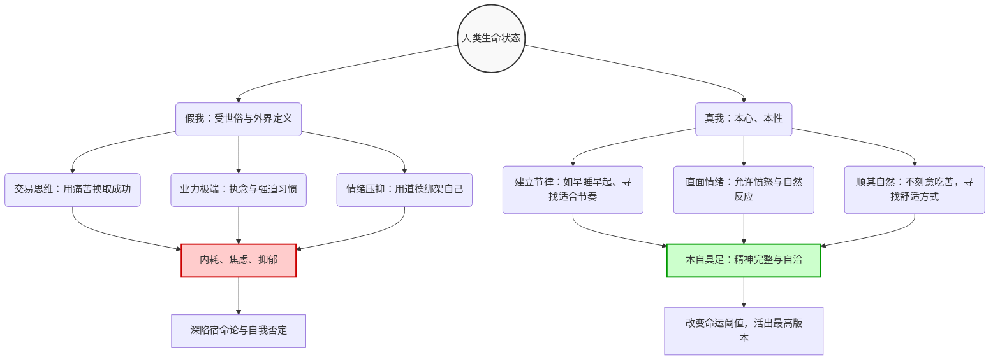

# 反内卷、反焦虑的生命视角

### 核心逻辑导图：生命状态的演化路径

通过以下 Mermaid 流程图，可以直观地看出我们是如何在“真我”与“假我”的不同选择下，走向“本自具足”或是“精神内耗”的。

代码段

### 核心概念对比解析表

访谈中大量运用了对比的手法来打破世俗的固有认知。以下表格总结了文中的核心对立概念：

|**核心维度**|**世俗普遍认知 (假我的体现)**|**敬达道士的观点 (真我的觉醒)**|**带来的结果差异**|
|---|---|---|---|
|**命运观**|宿命论：“万般皆是命，半点不由人”，遇到挫折就认命。|阈值论：命运是一个**区间（阈值）**，人可以发挥主观能动性活出这个区间的最高版本。|宿命论带来恐慌与消极；阈值论带来改命的动力与希望。|
|**业力 (Karma)**|封建迷信中的神秘力量或前世惩罚。|个人的**“惯性思维”与“极端习惯”**。算法推流就是在加深人的业力。|顺从惯性会越陷越深；觉察并管理惯性则能改变命运。|
|**努力与成功**|吃得苦中苦方为人上人；需要靠“榨干自己”来换取资源（交易思维）。|好的东西一定会以**让你舒服的方式**出现；一步做对（建立好节律），步步都对。|极度努力带来内耗和无休止的痛苦；顺应天性带来长期的滋养与回血。|
|**情绪处理**|修行者不该生气；面对挫折强行“看开”和自我欺骗（阿 Q 精神）。|**客观允许并直面情绪发生**。情绪是自然的，通过情绪看到事物背后的提醒（如打翻茶是提醒早睡）。|压抑情绪导致心理郁结；直面情绪则能“通病而养神”，迅速抽离。|
|**自我接纳**|根据外界标签（长相、财富、地位）来评判自己，认为平庸有罪。|淡化“我”的概念，明白生命本身从无到有就是完整的（**本自具足**），不受外界评价干扰。|追求世俗标准永远无法满足；回归本源则能获得长期稳定的幸福。|

### 深度知识内容拆解

#### 1. 关于“改命”与命运的真相

- **命运并非固定点，而是动态区间：** 命运是一道必须作答的“命题”。即使两个人生辰八字相同（命运的基底一致），但他们在财富、成就上的表现是一个浮动区间（例如 10 万到 60 万）。改命，就是在这个给定的区间内，通过主观能动性达到最高值。
- **宿命论的危害：** 传统的命定论让人盲目听从，导致生活消极。真正的“顺其自然”不是躺平任锤，而是不被头脑中的执念和特定滤镜所束缚。

#### 2. “业力”的现代解释

- **业力即习惯：** 业力不是玄学，而是人日复一日形成的“行为和思维惯性”。当这种惯性走向极端（哪怕是追求极端的健康，如只吃素），就会对人产生破坏性。
- **信息茧房与业力：** 现代社会的算法本质上是在“摸清并加深你的业力”。它通过不断推送刺激情绪的信息，将你的情绪推向极高点，从而控制你的行为。

#### 3. 打破“榨干自己”的交易思维

- **努力的悖论：** 很多人陷入了一种误区，认为必须“吃尽苦头”才能心安理得地获得成功，或者把爱好（如健身练腹肌）变成另一种榨干自己的方式。如果心中一直有“人上人”的执念，就永远要吃不完的苦。
- **滋养优于消耗：** 无论是工作还是爱好，其本质都应该是为了“回血”和滋养原神。真正属于你的好资源、好机会，通常会以让你感到舒服、自然的方式到来，而不是非要通过痛苦的酒局或违背本心的交易来换取。
- **找准生命节律：** 改变命运从调整最简单的生活节奏开始（如晚上十点睡觉）。只要起步的选择做对了（抓住树干），后续的良性循环就会自然展开。

#### 4. 重新认知“抑郁”与“自闭”

- **抑郁的本源：** 抑郁并非现代社会的专属产物（古人词中的“愁”即是抑郁）。只要人产生了“小我”的意识和过多的杂念（欲望），抑郁就会存在。
- **自闭是一种能量保护机制：** 很多青少年辍学或显得自闭，其实是生命本能在察觉到外界环境极度消耗自己时，采取的“像花苞一样闭合”的自我保护措施。他们在自己热爱和擅长的领域里，依然拥有极高的能量和热情。

#### 5. 终极心法：借假修真，回归“本自具足”

- **何为假我：** 被世俗标准（金钱、权力、社会地位）定义的“我”。如果为了迎合这个“假我”去活，人就会永远处于自我否定中。
- **何为真我：** 能够屏蔽外界评判，安于当下，入水不溺、入火不焚的本来面目。
- **本自具足：** 每个人从胚胎发育成一个完整的生命体，完成了长出五脏六腑这个世界上“最难”的事情。我们的生命本身就是一种壮丽的完整。世俗告诉我们的“难（如找工作难）”，仅仅是外界的定义，并不会伤害我们真实的生命本性。
