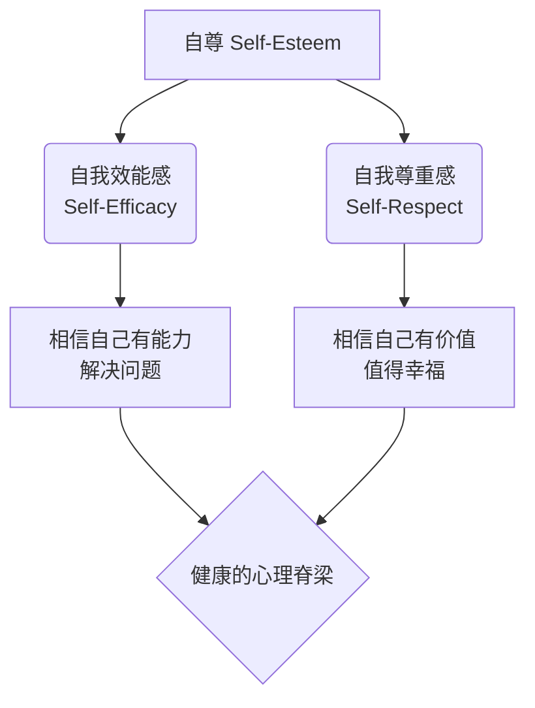
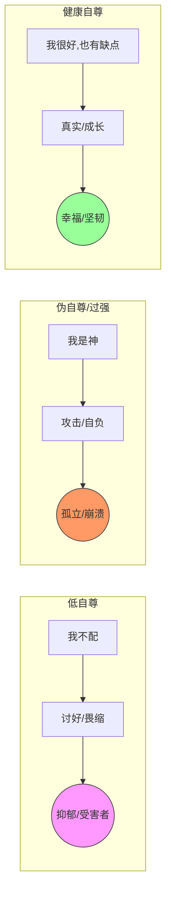

你好！很高兴能为你解答这个关于**“灵魂脊梁”**的问题。我是你的心理学老师。

今天我们要用**费曼学习法**（也就是用最简单的大白话）把“自尊”这个概念揉碎了讲清楚。

---

### 第一部分：什么是“自尊”？（那是你的心理免疫系统）

想象一下，你的身体有一个免疫系统，帮你抵抗病毒。
你的**精神世界**也有一个免疫系统，那就是**自尊（Self-Esteem）**。

**用大白话说：自尊就是你给自己打的分数，以及你对自己投的信任票。**

它由两大根柱子支撑（这也是心理学大师纳撒尼尔·布兰登提出的核心概念）：
1.  **自我效能感（自信）：** 相信自己能处理好生活中的挑战。（*心里话：我有能力！*）
2.  **自我尊重感（自爱）：** 相信自己值得快乐、值得被爱。（*心里话：我配得上！*）

#### 🧜‍♂️ 知识图谱：自尊的构成

---

### 第二部分：过强 vs 过低，结局大不同

很多人误以为“自尊”就是“面子”，其实这是两码事。我们来看看如果这根“脊梁”弯了（过低）或者硬得像玻璃（过强/虚假）会有什么后果。

#### 1. 自尊过低（卑微的讨好者）
**心态：** “我不行，我不好，我不配。”
*   **表现：** 极度敏感，怕被批评，不敢拒绝别人（讨好型人格），在关系中总是委曲求全。
*   **结局：**
    *   **内耗严重：** 每天晚上躺在床上后悔白天说错的一句话。
    *   **错失机会：** 哪怕有能力，也不敢争取升职加薪。
    *   **糟糕的关系：** 容易吸引那些控制欲强、甚至PUA（精神控制）你的人，因为你觉得自己配不上更好的。

#### 2. 自尊“过强”（其实是伪自尊/自负）
**心态：** “我是完美的，谁也不能说我错，说我错就是瞧不起我。”
*   **注意：** 这不是真正的强自尊，心理学上叫**“防御性高自尊”**或**自恋**。这就像一只**河豚**，气鼓鼓的看起来很大，其实里面全是气，一戳就破。
*   **表现：** 听不得半点反对意见，死不认错，喜欢贬低别人来抬高自己，把“面子”看得比天大。
*   **结局：**
    *   **众叛亲离：** 身边留不下真朋友，因为没人受得了这种傲慢。
    *   **极度脆弱：** 一旦遭遇大失败（如破产、失恋），精神世界会瞬间崩塌，可能导致抑郁甚至自毁。
    *   **认知停滞：** 因为觉得自己完美，所以永远学不到新东西。

#### 🧜‍♂️ 对比图：三种状态的结局

---

### 第三部分：正确的自尊观念应该是怎样的？

正确的自尊，不是觉得自己“比别人强”，而是**“对自己感到安适”**。

#### 💡 核心观念：无条件的自我接纳 + 有条件的自我评价

这听起来很矛盾？听我举个例子：

*   **场景：** 你搞砸了一个大项目。
*   **低自尊反应：** “我是个废物，我什么都做不好。”（攻击自己的人格）
*   **伪自尊反应：** “都怪队友太猪，环境不好，反正不是我的错。”（推卸责任保卫面子）
*   **✅ 健康自尊反应：** “**这件事**我搞砸了（承认行为错误），但我依然是一个**值得被爱、有价值的人**（保护核心价值）。我要复盘一下哪里做错了，下次改好。”

**正确的观念是：**
1.  **我不需要完美：** 接受自己的缺点，这不影响我的价值。
2.  **价值内求：** 我的价值不由别人的点赞、工资的高低决定，而由我自己决定。
3.  **失败≠我这个人失败：** 失败只是一个事件，不是我的身份标签。

---

### 第四部分：怎样去对待和修补自尊？

我们要像锻炼肌肉一样去锻炼自尊。

#### 1. 哪怕很小，也要“赢”一次（提升自我效能）
自尊不是喊口号喊出来的，是做出来的。
*   **实操：** 设定一个极小的目标。比如“每天只读5页书”或“每天做一个俯卧撑”。
*   **原理：** 当你承诺并做到了，你的潜意识就会记上一笔：“嘿，这哥们儿挺靠谱，说到做到。”这种**对自己信用的累积**，就是自信的来源。

#### 2. 像对待最好的朋友一样对待自己（提升自我尊重）
*   **实操：** 当你犯错想骂自己“猪脑子”的时候，停下来想一想：**如果这件事是你最好的朋友做的，你会怎么骂他？**
    *   你肯定不会骂他猪脑子，你会安慰他：“没事，下次注意就行了。”
    *   **请把这份温柔给自己。** 这就是心理学上的**“自我关怀（Self-Compassion）”**。

#### 3. 区分“事”与“人”
永远不要把“我的行为”和“我的价值”画等号。
*   行为可以修正，价值永远存在。

---

### 📚 拓展学习（由浅入深）

如果你想进一步深挖，可以关注以下关键词：

1.  **冒名顶替综合征 (Imposter Syndrome)**：明明很优秀，却总觉得自己是骗子，配不上现在的成就。这是高能力低自尊的典型。
2.  **成长型思维 (Growth Mindset)**：斯坦福教授德韦克的理论，认为能力是可以培养的，这是构建健康自尊的基石。
3.  **纳撒尼尔·布兰登 (Nathaniel Branden)**：被称为“自尊心理学之父”，推荐阅读《自尊的六大支柱》。

---

### 📝 课后测验：你真的理解了吗？

为了确认你掌握了“费曼”教给你的知识，请回答以下两道题：

**题目 1：**
小明在公司会议上提出了一个方案，被老板当众严厉批评了。
*   **反应A：** 小明满脸通红，当场拍桌子说老板不懂业务，甚至想辞职，觉得受到了奇耻大辱。
*   **反应B：** 小明低着头一言不发，心里想：“我就知道我不行，我真没用，我不适合干这份工作。”
*   **反应C：** 小明有点难过，但认真听取了批评中合理的部分。下班后他想：“老板虽然态度不好，但他指出的数据错误确实存在。这不代表我能力差，修正后这就是个好方案。”

**请问：A、B、C分别对应哪种自尊状态？**

**题目 2（判断题）：**
为了培养孩子的健康自尊，我们应该无时无刻地夸奖他“你是最棒的”、“你是完美的”、“你比谁都聪明”。
**这句话是对的还是错的？为什么？**

***

*(请你在心里思考一下答案，再往下看解析)*

---

### ✅ 答案解析

**题目 1 解析：**
*   **A 是 伪自尊/防御性高自尊（过强）。** 他的自我价值建立在“我是对的”之上，一被否定就启动防御机制（愤怒），像河豚一样。
*   **B 是 低自尊。** 他把“方案被拒”等同于“我整个人没用”，这是典型的自我攻击。
*   **C 是 健康自尊。** 他分得清“事”和“人”，能接纳不完美的表现，并专注于解决问题。

**题目 2 解析：**
*   **错！**
*   **原因：** 这培养的是**自恋**或**脆弱的自尊**。这种夸奖是建立在“比较”和“虚假完美”上的。一旦孩子遇到挫折（发现自己不是最棒的），他的自尊就会崩塌。
*   **正确做法：** 夸奖努力和过程（例如：“我看到你为了解决这道题钻研了很久，这种精神很棒”），而不是夸奖天赋和结果。这能培养**成长型思维**。