下面用一组 **Mermaid 图谱**把设计模式从“底层原则 → 23 种模式 → 架构模式 → 生活应用 → 模式选择”串成完整体系。

建议按以下顺序阅读：

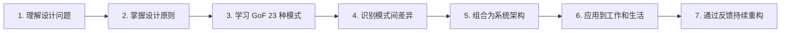

---

# 一、设计模式的总地图

```mermaid
flowchart TB
    Root["设计模式<br/>管理变化、依赖与复杂度"]

    Root --> Principles["设计原则"]
    Root --> GoF["GoF 23 种设计模式"]
    Root --> Architecture["架构模式"]
    Root --> Distributed["分布式与可靠性模式"]
    Root --> Domain["领域建模"]
    Root --> Life["现实生活应用"]

    Principles --> SOLID["SOLID"]
    Principles --> Simple["KISS / YAGNI / DRY"]
    Principles --> Separation["关注点分离"]
    Principles --> Composition["组合优于继承"]
    Principles --> Coupling["高内聚、低耦合"]

    GoF --> Creational["创建型<br/>对象如何产生"]
    GoF --> Structural["结构型<br/>对象如何组合"]
    GoF --> Behavioral["行为型<br/>对象如何协作"]

    Architecture --> Layered["分层架构"]
    Architecture --> MVC["MVC"]
    Architecture --> Hexagonal["六边形架构"]
    Architecture --> EventDriven["事件驱动"]
    Architecture --> CQRS["CQRS"]

    Distributed --> Retry["重试"]
    Distributed --> Timeout["超时"]
    Distributed --> Circuit["断路器"]
    Distributed --> Bulkhead["舱壁隔离"]
    Distributed --> Saga["Saga 补偿事务"]
    Distributed --> Idempotent["幂等"]

    Domain --> Entity["实体"]
    Domain --> ValueObject["值对象"]
    Domain --> Aggregate["聚合"]
    Domain --> Context["限界上下文"]

    Life --> Learning["学习系统"]
    Life --> Work["工作协作"]
    Life --> Health["健康管理"]
    Life --> Finance["财务管理"]
    Life --> Relationship["人际关系"]
```

---

# 二、设计模式解决的核心问题

绝大多数模式都在围绕三个问题工作：

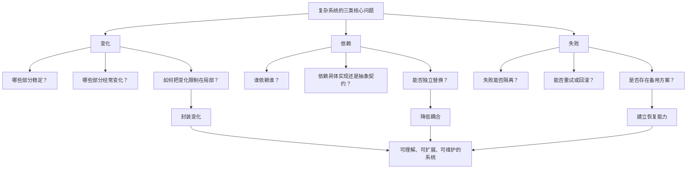

其统一公式可以表示为：

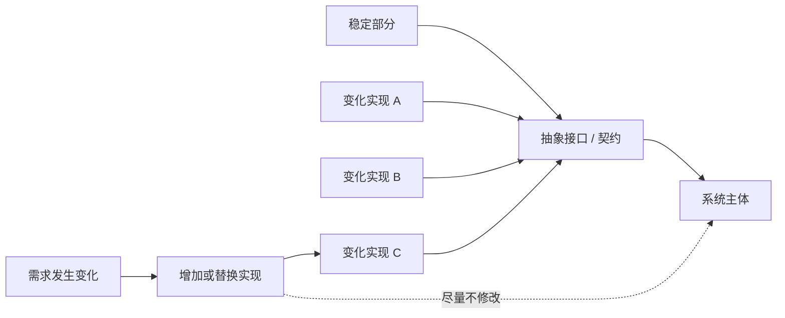

生活中的对应结构：

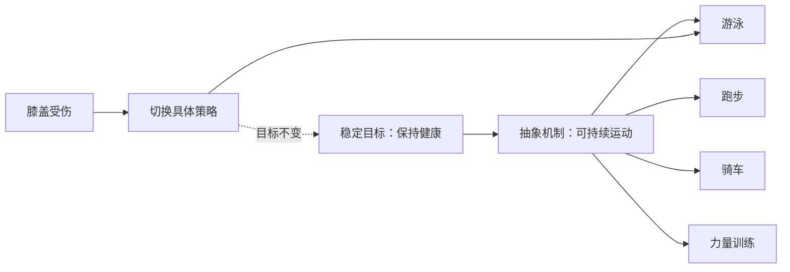

这里的核心是：

> 不要把“目标”与“某一种实现方式”永久绑定。

---

# 三、SOLID 原则可视化

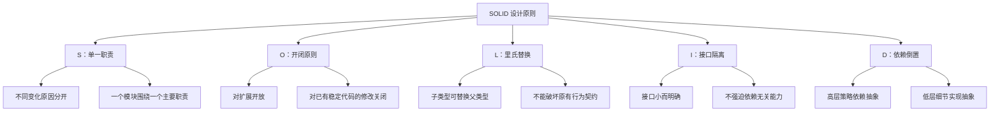

---

## 1. 单一职责原则

错误结构：

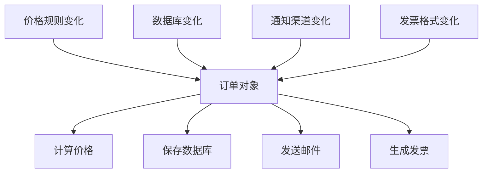

一个模块同时被四种原因修改，容易越来越臃肿。

拆分后：

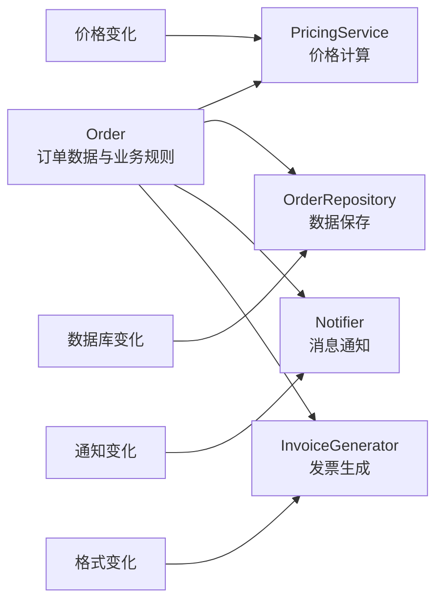

生活中的单一职责：

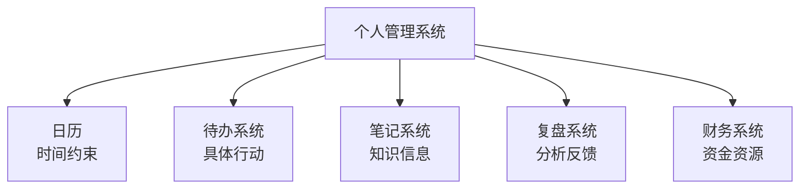

---

## 2. 开闭原则

不符合开闭原则：

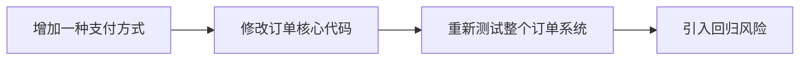

符合开闭原则：

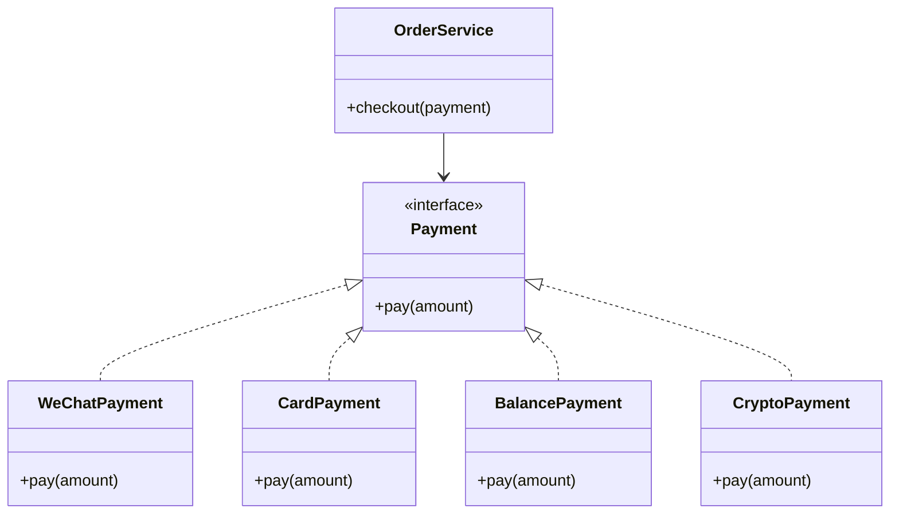

增加新支付方式时，只增加新实现，不必修改订单核心流程。

---

## 3. 依赖倒置原则

错误依赖：

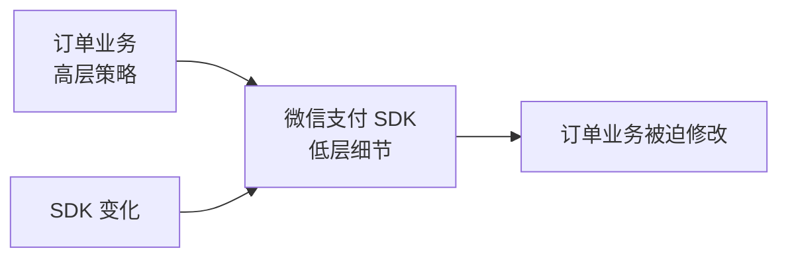

正确依赖：

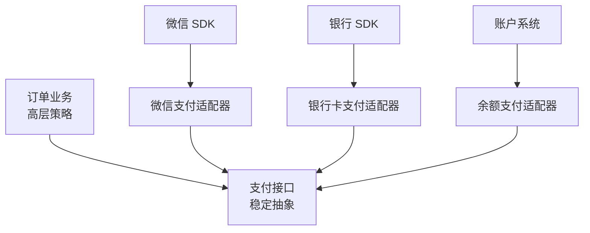

---

# 四、GoF 23 种设计模式总图

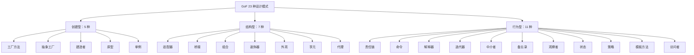

补充：**简单工厂**很常用，但不属于 GoF 正式列出的 23 种模式。

---

# 五、创建型模式图谱

创建型模式解决的是：

> 谁负责创建对象、创建哪种对象、以什么步骤创建。

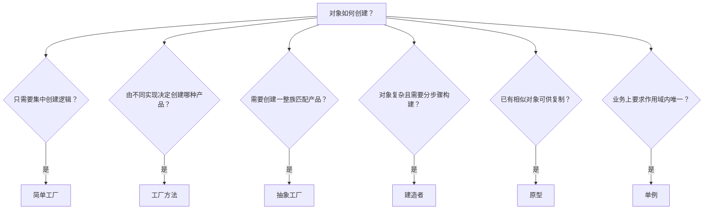

---

## 1. 工厂方法

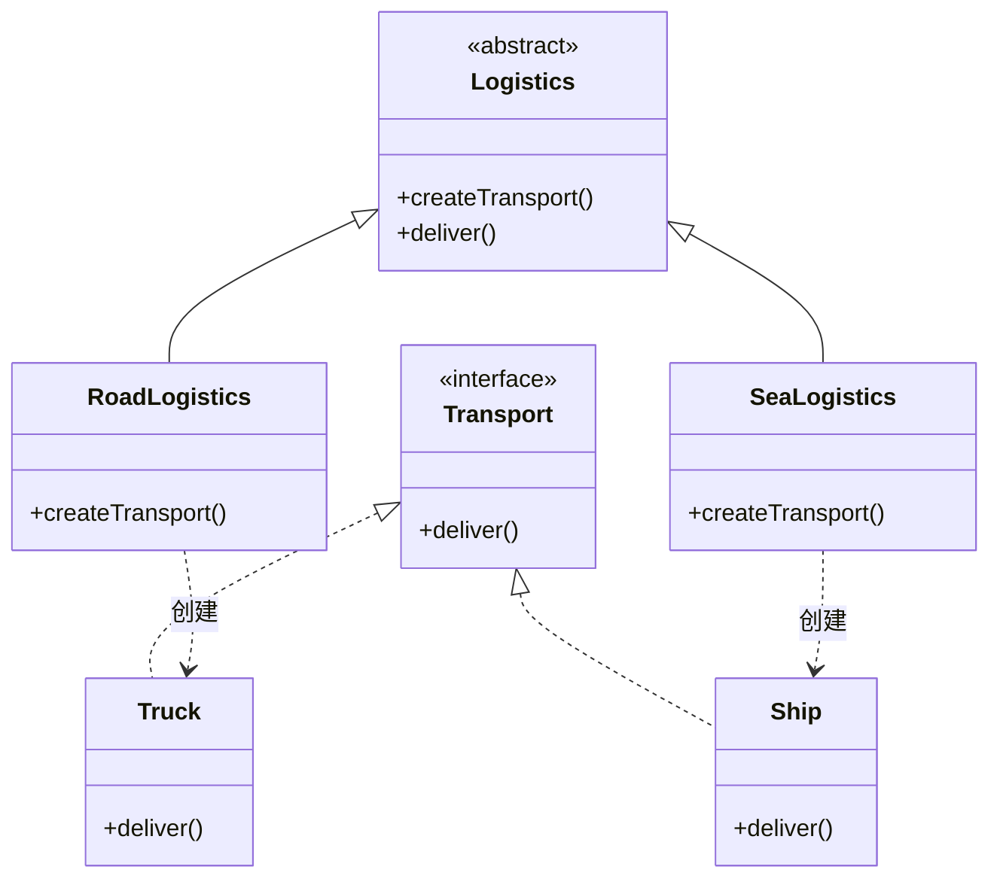

生活类比：

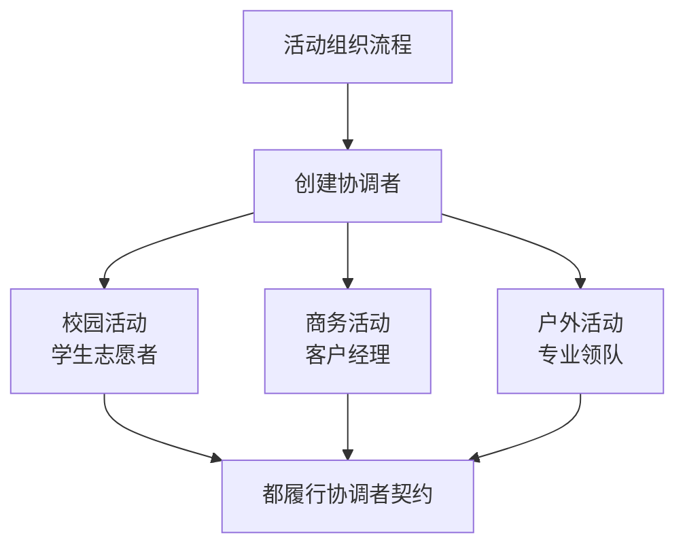

---

## 2. 抽象工厂

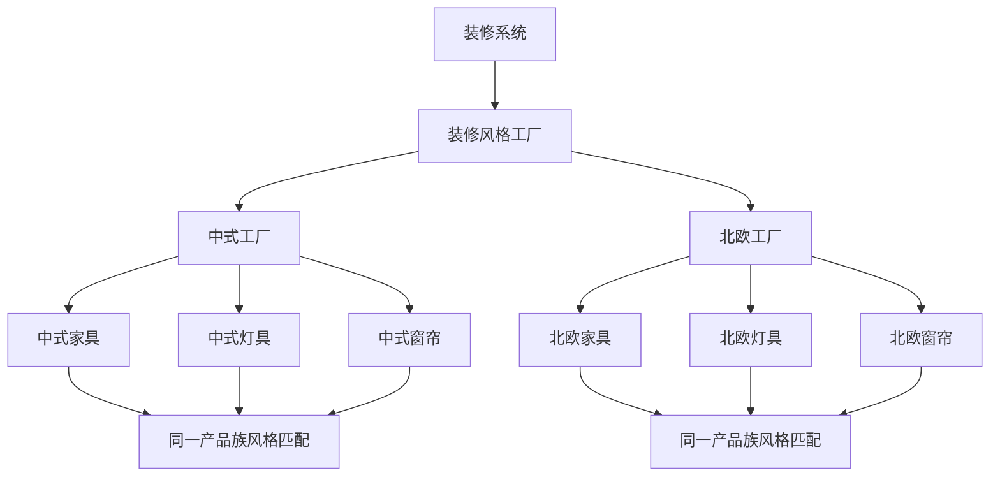

---

## 3. 建造者模式

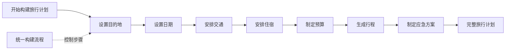

同一构建过程可生成不同结果：

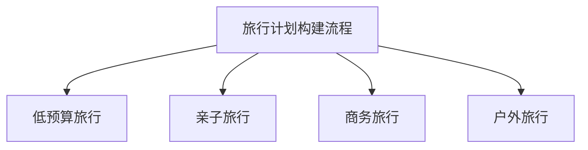

---

## 4. 原型模式

```mermaid
flowchart LR
    Existing["已有成功方案"] --> Clone["复制原型"]
    Clone --> VersionA["版本 A<br/>修改预算"]
    Clone --> VersionB["版本 B<br/>修改受众"]
    Clone --> VersionC["版本 C<br/>修改时间"]

    Clone --> Reset["重置不可复制状态"]
    Reset --> ID["唯一编号"]
    Reset --> Secrets["敏感信息"]
    Reset --> OldState["旧联系人与旧状态"]
```

---

## 5. 单例模式

```mermaid
flowchart TB
    UserA["模块 A"] --> Singleton["唯一配置中心"]
    UserB["模块 B"] --> Singleton
    UserC["模块 C"] --> Singleton

    Singleton --> Config["统一配置"]

    Singleton --> Risk["潜在风险"]
    Risk --> Global["形成全局变量"]
    Risk --> Hidden["产生隐式依赖"]
    Risk --> Test["难以测试"]
    Risk --> Concurrency["并发与生命周期问题"]
```

使用单例前应判断：

```mermaid
flowchart TD
    Start["是否考虑单例？"] --> Q1{"业务上真的要求唯一吗？"}
    Q1 -- "否" --> Avoid["不要使用单例"]
    Q1 -- "是" --> Q2{"唯一范围是什么？"}
    Q2 --> Process["进程级"]
    Q2 --> Request["请求级"]
    Q2 --> Session["会话级"]
    Q2 --> Cluster["集群级"]
    Process --> Manage["明确生命周期和并发规则"]
    Request --> Manage
    Session --> Manage
    Cluster --> DistributedLock["需要分布式协调<br/>普通单例不够"]
```

---

# 六、结构型模式图谱

结构型模式解决的是：

> 已有对象或模块如何组合，才能更容易使用和变化。

```mermaid
flowchart TB
    Q["当前遇到什么结构问题？"]

    Q --> A{"接口不兼容？"}
    A -- "是" --> Adapter["适配器"]

    Q --> B{"存在两个独立变化维度？"}
    B -- "是" --> Bridge["桥接"]

    Q --> C{"需要表达整体与部分？"}
    C -- "是" --> Composite["组合"]

    Q --> D{"需要动态增加功能？"}
    D -- "是" --> Decorator["装饰器"]

    Q --> E{"复杂子系统难以使用？"}
    E -- "是" --> Facade["外观"]

    Q --> F{"大量对象有公共状态？"}
    F -- "是" --> Flyweight["享元"]

    Q --> G{"需要控制真实对象的访问？"}
    G -- "是" --> Proxy["代理"]
```

---

## 1. 适配器模式

```mermaid
sequenceDiagram
    participant Client as 订单系统
    participant Adapter as 支付适配器
    participant Legacy as 旧支付服务

    Client->>Adapter: pay(100)
    Adapter->>Adapter: 转换金额与参数格式
    Adapter->>Legacy: makePayment("CNY", 100)
    Legacy-->>Adapter: 旧格式结果
    Adapter->>Adapter: 转换为统一结果
    Adapter-->>Client: PaymentResult
```

生活应用：

```mermaid
flowchart LR
    Technical["技术人员的专业语言"] --> Translator["翻译者 / 协调者"]
    Translator --> Business["客户能理解的业务语言"]
```

---

## 2. 桥接模式

不使用桥接时容易发生组合爆炸：

```mermaid
flowchart TB
    Root["消息类型 × 发送渠道"]

    Root --> NormalEmail["普通邮件"]
    Root --> NormalSMS["普通短信"]
    Root --> NormalPush["普通推送"]
    Root --> UrgentEmail["紧急邮件"]
    Root --> UrgentSMS["紧急短信"]
    Root --> UrgentPush["紧急推送"]
```

桥接后：

```mermaid
classDiagram
    class Message {
        <<abstract>>
        -sender
        +send(content)
    }

    class NormalMessage
    class UrgentMessage

    class Sender {
        <<interface>>
        +send(content)
    }

    class EmailSender
    class SmsSender
    class PushSender

    Message <|-- NormalMessage
    Message <|-- UrgentMessage

    Message o--> Sender

    Sender <|.. EmailSender
    Sender <|.. SmsSender
    Sender <|.. PushSender
```

形成两个可以独立扩展的维度：

```mermaid
flowchart LR
    MessageType["消息类型<br/>普通 / 紧急 / 营销"] --> Combine["自由组合"]
    Channel["发送渠道<br/>邮件 / 短信 / 推送"] --> Combine
```

---

## 3. 组合模式

```mermaid
flowchart TB
    Project["项目"]

    Project --> PhaseA["阶段 A"]
    Project --> PhaseB["阶段 B"]
    Project --> Task1["独立任务 1"]

    PhaseA --> Task2["任务 2"]
    PhaseA --> Task3["任务 3"]

    PhaseB --> SubProject["子项目"]
    SubProject --> Task4["任务 4"]
    SubProject --> Task5["任务 5"]
```

客户端可统一处理：

```mermaid
flowchart LR
    Operation["统一操作"] --> Single["单个任务"]
    Operation --> Group["任务组 / 项目"]

    Single --> Methods["计算进度、成本、完成状态"]
    Group --> Methods
```

---

## 4. 装饰器模式

```mermaid
flowchart LR
    Core["基础请求"] --> Log["日志装饰器"]
    Log --> Retry["重试装饰器"]
    Retry --> Cache["缓存装饰器"]
    Cache --> Auth["鉴权装饰器"]
    Auth --> Service["真实服务"]
```

生活类比：

```mermaid
flowchart LR
    Walk["基础活动：散步"] --> Podcast["+ 听播客"]
    Podcast --> Sun["+ 晒太阳"]
    Sun --> Dog["+ 遛狗"]
    Dog --> Talk["+ 和家人交流"]
```

装饰器可以叠加功能，但不能无限叠加，否则单个活动会失去核心目的。

---

## 5. 外观模式

```mermaid
flowchart LR
    User["用户"] --> Facade["下单外观<br/>placeOrder()"]

    Facade --> Inventory["库存检查"]
    Facade --> Discount["优惠计算"]
    Facade --> Payment["支付"]
    Facade --> Logistics["物流"]
    Facade --> Notification["通知"]
```

外部只需要理解一个简单入口，复杂协调留在外观内部。

---

## 6. 享元模式

```mermaid
flowchart TB
    Shared["共享内部状态<br/>字体、字形、公共配置"]

    Shared --> Obj1["对象 1<br/>外部状态：位置 A"]
    Shared --> Obj2["对象 2<br/>外部状态：位置 B"]
    Shared --> Obj3["对象 3<br/>外部状态：位置 C"]

    Benefit["避免重复保存昂贵资源"] --> Shared
```

生活中的共享机制：

```mermaid
flowchart LR
    Team["团队成员"] --> SharedAssets["共享资源库"]
    SharedAssets --> Templates["模板"]
    SharedAssets --> Devices["公共设备"]
    SharedAssets --> Materials["标准素材"]
    SharedAssets --> Processes["标准流程"]
```

---

## 7. 代理模式

```mermaid
flowchart LR
    Client["调用者"] --> Proxy["代理对象"]
    Proxy --> Control["访问控制"]
    Control --> Auth["鉴权"]
    Control --> Cache["缓存"]
    Control --> Lazy["延迟加载"]
    Control --> Log["日志记录"]
    Control --> Remote["远程通信"]
    Control --> Real["真实对象"]
```

代理与装饰器的差异：

```mermaid
flowchart TB
    Wrapper["都包装真实对象"]

    Wrapper --> Proxy["代理"]
    Wrapper --> Decorator["装饰器"]

    Proxy --> PGoal["重点：控制能否访问、何时访问"]
    Decorator --> DGoal["重点：增加额外功能"]

    Proxy --> ExampleP["权限代理、远程代理、虚拟代理"]
    Decorator --> ExampleD["日志、缓存、压缩、加密功能叠加"]
```

---

# 七、行为型模式图谱

行为型模式解决的是：

> 对象之间如何分工、通信、切换行为和传递请求。

```mermaid
flowchart TB
    Q["当前遇到什么协作问题？"]

    Q --> Q1{"请求要沿多个处理者传递？"}
    Q1 -- "是" --> Chain["责任链"]

    Q --> Q2{"请求需要记录、排队、撤销？"}
    Q2 -- "是" --> Command["命令"]

    Q --> Q3{"需要执行简单规则语言？"}
    Q3 -- "是" --> Interpreter["解释器"]

    Q --> Q4{"需要统一遍历集合？"}
    Q4 -- "是" --> Iterator["迭代器"]

    Q --> Q5{"多个参与者关系过于复杂？"}
    Q5 -- "是" --> Mediator["中介者"]

    Q --> Q6{"需要保存并恢复状态？"}
    Q6 -- "是" --> Memento["备忘录"]

    Q --> Q7{"一个变化要通知多个对象？"}
    Q7 -- "是" --> Observer["观察者"]

    Q --> Q8{"内部状态决定行为？"}
    Q8 -- "是" --> State["状态"]

    Q --> Q9{"同一目标有多种算法？"}
    Q9 -- "是" --> Strategy["策略"]

    Q --> Q10{"流程稳定但部分步骤变化？"}
    Q10 -- "是" --> Template["模板方法"]

    Q --> Q11{"对象结构稳定但经常增加操作？"}
    Q11 -- "是" --> Visitor["访问者"]
```

---

## 1. 责任链模式

```mermaid
flowchart LR
    Request["客户问题"] --> Robot["机器人客服"]
    Robot -->|无法处理| Human["一线客服"]
    Human -->|需要专业能力| Specialist["业务专员"]
    Specialist -->|技术故障| Tech["技术团队"]
    Tech --> Result["问题解决"]

    Robot -->|已处理| Result
    Human -->|已处理| Result
    Specialist -->|已处理| Result
```

应增加兜底机制：

```mermaid
flowchart TB
    Chain["责任链"] --> Handler["逐级处理"]
    Handler --> Guard["治理规则"]

    Guard --> Timeout["处理时限"]
    Guard --> Escalation["升级条件"]
    Guard --> Final["最终兜底人"]
    Guard --> Trace["全程可追踪"]
```

---

## 2. 命令模式

```mermaid
classDiagram
    class Invoker {
        +executeCommand()
        +undo()
    }

    class Command {
        <<interface>>
        +execute()
        +undo()
    }

    class TurnOnLightCommand {
        +execute()
        +undo()
    }

    class Light {
        +turnOn()
        +turnOff()
    }

    Invoker --> Command
    Command <|.. TurnOnLightCommand
    TurnOnLightCommand --> Light
```

生活中的“目标命令化”：

```mermaid
flowchart LR
    Vague["模糊目标<br/>学好英语"] --> Transform["命令化"]
    Transform --> Who["执行者：我"]
    Transform --> When["时间：今晚 20:00"]
    Transform --> Action["动作：听力练习"]
    Transform --> Duration["数量：20 分钟"]
    Transform --> Result["交付物：错误记录"]
    Transform --> Standard["完成标准：完成一组材料"]
```

---

## 3. 解释器模式

```mermaid
flowchart TB
    Rule["金额大于 1000 且用户等级为 VIP"]

    Rule --> And["AND"]
    And --> Greater["金额 > 1000"]
    And --> Equal["等级 = VIP"]

    Data["输入数据"] --> Greater
    Data --> Equal

    Greater --> Result["解释结果"]
    Equal --> Result
```

适合简单规则；规则复杂时应升级为规则引擎或解析器系统。

---

## 4. 迭代器模式

```mermaid
sequenceDiagram
    participant Client as 调用者
    participant Iterator as 迭代器
    participant Collection as 集合

    Client->>Collection: createIterator()
    Collection-->>Client: iterator

    loop 还有元素
        Client->>Iterator: hasNext()
        Iterator-->>Client: true
        Client->>Iterator: next()
        Iterator-->>Client: 下一个元素
    end
```

调用者无需知道集合内部是数组、链表、树还是远程分页数据。

---

## 5. 中介者模式

没有中介者：

```mermaid
flowchart TB
    A["部门 A"] <--> B["部门 B"]
    A <--> C["部门 C"]
    A <--> D["部门 D"]
    B <--> C
    B <--> D
    C <--> D
```

使用中介者：

```mermaid
flowchart TB
    M["项目协调者 / 中介者"]

    A["部门 A"] <--> M
    B["部门 B"] <--> M
    C["部门 C"] <--> M
    D["部门 D"] <--> M
```

风险：

```mermaid
flowchart LR
    Mediator["中介者承担协调"] --> More["不断加入规则"]
    More --> God["演变成上帝对象"]
    God --> Split["需要继续拆分规则与职责"]
```

---

## 6. 备忘录模式

```mermaid
flowchart LR
    State1["版本 1<br/>稳定状态"] --> Snapshot["保存快照"]
    Snapshot --> Change["执行高风险修改"]
    Change --> Check{"结果是否可接受？"}

    Check -- "是" --> State2["保留新版本"]
    Check -- "否" --> Restore["恢复快照"]
    Restore --> State1
```

这是工作和生活中非常重要的风险控制模式：

> 重要改变之前，先建立可回退点。

---

## 7. 观察者模式

```mermaid
flowchart LR
    Subject["项目状态"] --> Event["状态发生变化"]

    Event --> MemberA["通知项目成员"]
    Event --> Manager["通知负责人"]
    Event --> Finance["通知财务"]
    Event --> Customer["通知客户"]

    MemberA --> ActionA["更新个人任务"]
    Manager --> ActionB["重新协调资源"]
    Finance --> ActionC["更新预算"]
    Customer --> ActionD["了解新进度"]
```

观察者治理：

```mermaid
flowchart TB
    Observer["观察者系统"] --> Problems["潜在问题"]

    Problems --> Storm["通知风暴"]
    Problems --> Duplicate["重复订阅"]
    Problems --> Order["顺序不确定"]
    Problems --> Leak["无法退订"]
    Problems --> Trace["事件链难追踪"]

    Observer --> Solutions["治理措施"]
    Solutions --> Filter["事件过滤"]
    Solutions --> Unsubscribe["退订机制"]
    Solutions --> Idempotent["幂等处理"]
    Solutions --> Log["事件日志"]
    Solutions --> Priority["优先级规则"]
```

---

## 8. 状态模式

订单状态机：

```mermaid
stateDiagram-v2
    [*] --> 待支付

    待支付 --> 已支付: 完成支付
    待支付 --> 已取消: 取消订单

    已支付 --> 已发货: 商家发货
    已支付 --> 退款中: 申请退款

    退款中 --> 已退款: 退款成功
    退款中 --> 已支付: 拒绝退款

    已发货 --> 已完成: 确认收货
    已完成 --> [*]
    已取消 --> [*]
    已退款 --> [*]
```

生活中的状态模式：

```mermaid
stateDiagram-v2
    [*] --> 正常状态

    正常状态 --> 疲劳状态: 睡眠不足或负荷过高
    疲劳状态 --> 恢复状态: 降低训练强度
    恢复状态 --> 正常状态: 身体恢复

    正常状态 --> 受伤状态: 出现明确伤病
    疲劳状态 --> 受伤状态: 继续过度训练
    受伤状态 --> 恢复状态: 治疗与休息
```

每种状态对应不同规则，而不是强迫自己始终执行同一计划。

---

## 9. 策略模式

```mermaid
classDiagram
    class TravelContext {
        -strategy
        +goToDestination()
    }

    class TravelStrategy {
        <<interface>>
        +travel()
    }

    class Walking
    class Cycling
    class Bus
    class Driving

    TravelContext o--> TravelStrategy
    TravelStrategy <|.. Walking
    TravelStrategy <|.. Cycling
    TravelStrategy <|.. Bus
    TravelStrategy <|.. Driving
```

选择过程：

```mermaid
flowchart TB
    Goal["目标：到达目的地"] --> Conditions["分析条件"]

    Conditions --> Distance["距离"]
    Conditions --> Weather["天气"]
    Conditions --> Cost["预算"]
    Conditions --> Time["时间"]
    Conditions --> Health["身体状态"]

    Distance --> Select["选择策略"]
    Weather --> Select
    Cost --> Select
    Time --> Select
    Health --> Select

    Select --> Walk["步行"]
    Select --> Bike["骑车"]
    Select --> Bus["公交"]
    Select --> Drive["驾车"]
```

---

## 10. 模板方法

```mermaid
flowchart TB
    Template["统一学习流程"]

    Template --> Preview["1. 预习"]
    Preview --> Learn["2. 正式学习"]
    Learn --> Practice["3. 练习"]
    Practice --> Test["4. 测试"]
    Test --> Review["5. 复盘"]

    Learn -. "可变步骤" .-> Book["阅读书籍"]
    Learn -. "可变步骤" .-> Course["观看课程"]

    Practice -. "可变步骤" .-> Questions["做题"]
    Practice -. "可变步骤" .-> Project["完成项目"]
```

流程骨架稳定，局部步骤允许变化。

---

## 11. 访问者模式

```mermaid
flowchart TB
    Structure["稳定的数据结构"]

    Structure --> Engineer["工程师"]
    Structure --> Sales["销售"]
    Structure --> Manager["管理者"]

    Salary["薪资计算访问者"] --> Engineer
    Salary --> Sales
    Salary --> Manager

    Training["培训建议访问者"] --> Engineer
    Training --> Sales
    Training --> Manager

    Cost["成本统计访问者"] --> Engineer
    Cost --> Sales
    Cost --> Manager
```

访问者适用条件：

```mermaid
flowchart TD
    Start["是否使用访问者？"] --> Stable{"元素类型是否稳定？"}
    Stable -- "否" --> Avoid["通常不适合访问者"]
    Stable -- "是" --> Operations{"是否经常增加新操作？"}
    Operations -- "是" --> Use["适合访问者"]
    Operations -- "否" --> Simple["优先使用更简单的方案"]
```

---

# 八、容易混淆的模式对比

## 1. 策略、状态、模板方法

```mermaid
flowchart TB
    Common["三者都在分离可变行为"]

    Common --> Strategy["策略模式"]
    Common --> State["状态模式"]
    Common --> Template["模板方法"]

    Strategy --> S1["同一目标有多种完整算法"]
    Strategy --> S2["通常由外部主动选择"]
    Strategy --> S3["优先使用组合"]

    State --> T1["状态不同，行为不同"]
    State --> T2["由内部状态驱动切换"]
    State --> T3["强调状态迁移"]

    Template --> M1["总体流程稳定"]
    Template --> M2["只替换部分步骤"]
    Template --> M3["传统实现常依赖继承或钩子"]
```

---

## 2. 适配器、外观、代理、装饰器

```mermaid
flowchart TB
    Wrapper["都可能位于调用者与真实对象之间"]

    Wrapper --> Adapter["适配器<br/>接口转换"]
    Wrapper --> Facade["外观<br/>简化入口"]
    Wrapper --> Proxy["代理<br/>控制访问"]
    Wrapper --> Decorator["装饰器<br/>增强能力"]

    Adapter --> AE["旧接口转换成新接口"]
    Facade --> FE["多个复杂子系统统一成简单入口"]
    Proxy --> PE["权限、远程、缓存、延迟加载"]
    Decorator --> DE["日志、压缩、加密等能力叠加"]
```

它们可以组合出现：

```mermaid
flowchart LR
    Client["外部调用者"]
        --> Facade["外观<br/>简化入口"]
        --> Proxy["代理<br/>鉴权控制"]
        --> Adapter["适配器<br/>接口转换"]
        --> Decorator["装饰器<br/>日志与重试"]
        --> Service["真实服务"]
```

---

## 3. 工厂、建造者、原型

```mermaid
flowchart TB
    Create["创建对象"]

    Create --> Factory["工厂<br/>决定创建哪一种"]
    Create --> Builder["建造者<br/>决定如何分步骤构建"]
    Create --> Prototype["原型<br/>从现有实例复制"]
```

---

## 4. 观察者与中介者

```mermaid
flowchart LR
    Observer["观察者"] --> O1["一个主题"]
    O1 --> O2["向多个订阅者广播变化"]

    Mediator["中介者"] --> M1["多个参与者"]
    M1 --> M2["通过中心协调复杂交互"]
```

---

# 九、架构模式的统一视图

```mermaid
flowchart TB
    UI["用户界面 / 外部输入"]

    UI --> Application["应用层<br/>协调用例"]
    Application --> Domain["领域层<br/>核心业务规则"]

    Domain --> Ports["端口 / 抽象接口"]

    Ports --> DBAdapter["数据库适配器"]
    Ports --> PaymentAdapter["支付适配器"]
    Ports --> MessageAdapter["消息适配器"]
    Ports --> FileAdapter["文件适配器"]

    DBAdapter --> DB["数据库"]
    PaymentAdapter --> Payment["第三方支付"]
    MessageAdapter --> Message["短信 / 邮件系统"]
    FileAdapter --> File["文件存储"]
```

核心依赖方向：

```mermaid
flowchart LR
    Infrastructure["外部基础设施"] --> Interface["核心定义的抽象接口"]
    Application["应用协调层"] --> Domain["领域核心"]
    Domain --> Interface

    Change["数据库或第三方服务变化"] --> Infrastructure
    Change -. "不应直接冲击" .-> Domain
```

生活中的分层：

```mermaid
flowchart TB
    Values["价值观<br/>为什么做"] --> Strategy["长期策略<br/>选择什么方向"]
    Strategy --> Plan["阶段计划<br/>如何推进"]
    Plan --> Action["每日行动<br/>今天做什么"]
    Action --> Tools["具体工具<br/>软件、设备、平台"]

    Tools -. "工具不应反向支配" .-> Values
```

---

# 十、事件驱动架构

```mermaid
flowchart LR
    Payment["支付系统"] --> Event["发布事件：订单已支付"]

    Event --> Inventory["库存模块<br/>扣减库存"]
    Event --> Points["积分模块<br/>增加积分"]
    Event --> Logistics["物流模块<br/>创建物流单"]
    Event --> Notice["通知模块<br/>发送消息"]
    Event --> Analytics["分析模块<br/>记录指标"]
```

与直接调用对比：

```mermaid
flowchart TB
    Direct["直接调用"] --> D1["调用者知道所有下游"]
    Direct --> D2["耦合较高"]
    Direct --> D3["流程容易被下游故障阻塞"]

    Event["事件驱动"] --> E1["发布者不必知道所有订阅者"]
    Event --> E2["便于增加新消费者"]
    Event --> E3["需要处理最终一致性"]
    Event --> E4["需要幂等、追踪和失败补偿"]
```

---

# 十一、可靠性模式组合

一个可靠的外部请求通常不是只用“重试”，而是多种模式共同工作：

```mermaid
flowchart LR
    Request["请求"] --> RateLimit["限流"]
    RateLimit --> Timeout["超时控制"]
    Timeout --> Circuit["断路器"]
    Circuit --> Retry["有限重试"]
    Retry --> Service["远程服务"]

    Service -->|成功| Result["返回结果"]
    Service -->|持续失败| Fallback["降级 / 备用方案"]
```

---

## 1. 重试与指数退避

```mermaid
sequenceDiagram
    participant Client as 调用方
    participant Service as 远程服务

    Client->>Service: 第 1 次请求
    Service-->>Client: 临时失败

    Note over Client: 等待 1 秒

    Client->>Service: 第 2 次请求
    Service-->>Client: 临时失败

    Note over Client: 等待 2 秒并加入随机抖动

    Client->>Service: 第 3 次请求
    Service-->>Client: 成功
```

不能无限立即重试，否则会把下游彻底压垮。

---

## 2. 断路器

```mermaid
stateDiagram-v2
    [*] --> 关闭

    关闭 --> 开启: 连续失败超过阈值
    开启 --> 半开: 冷却时间结束
    半开 --> 关闭: 测试请求成功
    半开 --> 开启: 测试请求失败
```

生活类比：

```mermaid
flowchart LR
    Fail["合作方式连续失败"] --> Stop["暂时停止投入"]
    Stop --> Cool["冷静和修复期"]
    Cool --> SmallTest["进行小规模测试"]
    SmallTest --> Check{"测试是否成功？"}
    Check -- "是" --> Resume["逐步恢复合作"]
    Check -- "否" --> Stop
```

---

## 3. 舱壁隔离

```mermaid
flowchart TB
    Resources["全部资源"]

    Resources --> Daily["日常资金账户"]
    Resources --> Emergency["应急资金账户"]
    Resources --> Investment["投资账户"]
    Resources --> Project["专项账户"]

    Investment --> Failure["投资发生损失"]
    Failure -. "不直接拖垮" .-> Daily
    Failure -. "不直接耗尽" .-> Emergency
```

---

## 4. Saga 补偿事务

```mermaid
sequenceDiagram
    participant User as 用户
    participant Flight as 机票系统
    participant Hotel as 酒店系统
    participant Car as 接送系统

    User->>Flight: 预订机票
    Flight-->>User: 成功

    User->>Hotel: 预订酒店
    Hotel-->>User: 成功

    User->>Car: 预订接送
    Car-->>User: 失败

    User->>Hotel: 补偿：取消酒店
    Hotel-->>User: 取消成功

    User->>Flight: 补偿：取消机票
    Flight-->>User: 取消成功
```

---

# 十二、领域建模图谱

```mermaid
flowchart TB
    Domain["领域模型"]

    Domain --> Entity["实体 Entity"]
    Domain --> Value["值对象 Value Object"]
    Domain --> Aggregate["聚合 Aggregate"]
    Domain --> Service["领域服务"]
    Domain --> Context["限界上下文"]

    Entity --> E1["由身份标识"]
    Entity --> E2["属性变化后仍是同一对象"]

    Value --> V1["由属性值定义"]
    Value --> V2["通常设计为不可变"]

    Aggregate --> A1["一致性边界"]
    Aggregate --> A2["通过聚合根访问"]

    Service --> S1["不自然属于单个实体的领域行为"]

    Context --> C1["同一词语在不同语境中有不同模型"]
```

“客户”在不同上下文中的差异：

```mermaid
flowchart TB
    Customer["客户"]

    Customer --> Sales["销售上下文<br/>潜在购买者"]
    Customer --> Finance["财务上下文<br/>付款主体"]
    Customer --> Support["售后上下文<br/>服务对象"]
    Customer --> Logistics["物流上下文<br/>收货联系人"]

    Sales -. "不必强行统一为超级模型" .-> Finance
    Finance -. "通过明确边界协作" .-> Support
    Support -. "使用上下文转换" .-> Logistics
```

---

# 十三、反模式可视化

```mermaid
flowchart TB
    Anti["常见反模式"]

    Anti --> God["上帝对象"]
    Anti --> Spaghetti["意大利面条式结构"]
    Anti --> Hammer["金锤子"]
    Anti --> Over["过度设计"]
    Anti --> Copy["复制粘贴"]
    Anti --> Magic["隐式规则 / 魔法数字"]
    Anti --> Early["过早优化"]

    God --> G1["所有职责集中"]
    Spaghetti --> S1["依赖关系混乱"]
    Hammer --> H1["任何问题都套同一种模式"]
    Over --> O1["为不存在的需求设计"]
    Copy --> C1["多个副本逐渐不一致"]
    Magic --> M1["规则只存在于某人脑中"]
    Early --> E1["没有测量就开始优化"]
```

上帝对象在组织中的演变：

```mermaid
flowchart LR
    Start["所有事情交给一个能人"] --> Depend["所有人依赖该人"]
    Depend --> More["更多信息和权限集中"]
    More --> Bottleneck["形成瓶颈"]
    Bottleneck --> Leave["该人请假或离职"]
    Leave --> Collapse["组织流程瘫痪"]

    Bottleneck --> Fix["改进"]
    Fix --> Docs["建立文档"]
    Fix --> Delegate["分配职责"]
    Fix --> Interface["明确协作接口"]
    Fix --> Backup["培养替代者"]
```

---

# 十四、个人任务管理系统：模式组合演示

```mermaid
flowchart TB
    Input["各种任务来源"]

    Input --> Inbox["统一收件箱<br/>外观模式"]

    Inbox --> Clarify["任务澄清<br/>命令模式"]
    Clarify --> Structure["组织层级<br/>组合模式"]

    Structure --> Goal["目标"]
    Goal --> Project["项目"]
    Project --> Milestone["里程碑"]
    Milestone --> Task["具体任务"]

    Task --> State["任务状态<br/>状态模式"]
    State --> Pending["待处理"]
    State --> Scheduled["已安排"]
    State --> Doing["进行中"]
    State --> Waiting["等待中"]
    State --> Done["已完成"]

    Task --> Strategy["处理策略<br/>策略模式"]
    Strategy --> Do["立即执行"]
    Strategy --> Plan["安排时间"]
    Strategy --> Delegate["委托"]
    Strategy --> Delete["删除"]

    State --> Notify["截止与状态通知<br/>观察者模式"]
    Notify --> Review["每周复盘<br/>模板方法"]
    Review --> Snapshot["保留历史快照<br/>备忘录模式"]
```

任务处理决策：

```mermaid
flowchart TD
    Task["收到一个任务"] --> Clear{"任务是否清晰？"}

    Clear -- "否" --> Clarify["补充动作、结果和截止时间"]
    Clarify --> Important

    Clear -- "是" --> Important{"是否重要？"}

    Important -- "是" --> Urgent{"是否紧急？"}
    Important -- "否" --> Necessary{"是否必须做？"}

    Urgent -- "是" --> Now["立即执行"]
    Urgent -- "否" --> Schedule["安排专门时间"]

    Necessary -- "是" --> Delegate["尽量委托或批量处理"]
    Necessary -- "否" --> Delete["删除"]
```

---

# 十五、学习系统：模式组合演示

```mermaid
flowchart TB
    Goal["长期学习目标"] --> Map["能力地图"]
    Map --> Project["学习项目"]
    Project --> Unit["学习单元"]

    Unit --> Template["模板方法"]
    Template --> Preview["预习"]
    Preview --> Learn["学习"]
    Learn --> Practice["练习"]
    Practice --> Test["测试"]
    Test --> Review["复盘"]

    Learn --> Strategy["策略模式"]
    Strategy --> Concept["概念知识：阅读与讲解"]
    Strategy --> Memory["记忆内容：间隔重复"]
    Strategy --> Skill["技能内容：刻意练习"]
    Strategy --> Complex["综合能力：项目实践"]
    Strategy --> Output["表达能力：写作与教学"]

    Review --> Observer["观察者模式<br/>复习提醒"]
    Review --> Memento["备忘录模式<br/>阶段快照"]
    Review --> Improve["调整下一轮策略"]
    Improve --> Unit
```

学习反馈循环：

```mermaid
flowchart LR
    Input["输入知识"] --> Understand["理解"]
    Understand --> Practice["练习"]
    Practice --> Feedback["获得反馈"]
    Feedback --> Correct["纠正错误"]
    Correct --> Output["输出与应用"]
    Output --> Gap["发现知识缺口"]
    Gap --> Input
```

---

# 十六、健康管理：状态与策略组合

```mermaid
flowchart TB
    Monitor["监测身体状态"] --> State{"当前状态"}

    State --> Normal["正常"]
    State --> Fatigue["疲劳"]
    State --> Injured["受伤"]
    State --> Recovery["恢复期"]

    Normal --> NStrategy["正常训练策略"]
    NStrategy --> Strength["力量训练"]
    NStrategy --> Cardio["有氧训练"]
    NStrategy --> Mobility["灵活性训练"]

    Fatigue --> FStrategy["降低负荷策略"]
    FStrategy --> Light["低强度运动"]
    FStrategy --> Sleep["优先睡眠"]

    Injured --> Circuit["断路器：暂停高风险训练"]
    Circuit --> Medical["评估与治疗"]

    Recovery --> RStrategy["恢复策略"]
    RStrategy --> Gradual["逐步增加负荷"]
    RStrategy --> Observe["观察疼痛与疲劳"]

    Observe --> Monitor
```

---

# 十七、团队协作系统：模式组合演示

```mermaid
flowchart TB
    Request["外部需求"] --> Facade["统一项目接口人<br/>外观模式"]

    Facade --> Mediator["项目经理<br/>中介者模式"]

    Mediator --> Product["产品团队"]
    Mediator --> Tech["技术团队"]
    Mediator --> Design["设计团队"]
    Mediator --> Finance["财务团队"]

    Product --> Command["形成明确任务<br/>命令模式"]
    Tech --> Command
    Design --> Command
    Finance --> Command

    Command --> Chain["问题升级链<br/>责任链模式"]

    Chain --> Member["执行成员"]
    Member --> Lead["小组负责人"]
    Lead --> Manager["项目负责人"]
    Manager --> Executive["高层决策"]

    Command --> Event["任务状态事件<br/>观察者模式"]
    Event --> Dashboard["项目看板"]
    Event --> Stakeholders["相关利益方"]
```

明确的协作接口：

```mermaid
flowchart LR
    Request["协作请求"] --> Contract["协作契约"]

    Contract --> Owner["负责人是谁"]
    Contract --> Action["需要完成什么"]
    Contract --> Output["交付物是什么"]
    Contract --> Deadline["截止时间是什么"]
    Contract --> Standard["验收标准是什么"]
    Contract --> Escalation["失败后如何升级"]
```

---

# 十八、完整案例：家庭旅行规划

```mermaid
flowchart TB
    Trip["家庭旅行系统"]

    Trip --> Builder["建造者<br/>构建完整行程"]
    Trip --> Strategy["策略<br/>选择交通方式"]
    Trip --> Factory["抽象工厂<br/>选择旅行套餐"]
    Trip --> Composite["组合<br/>组织多日行程"]
    Trip --> Facade["外观<br/>统一协调人"]
    Trip --> Observer["观察者<br/>变更通知"]
    Trip --> State["状态<br/>订单生命周期"]
    Trip --> Command["命令<br/>分配预订任务"]
    Trip --> Chain["责任链<br/>问题升级"]
    Trip --> Memento["备忘录<br/>保存旧行程"]
    Trip --> Saga["Saga<br/>失败后补偿取消"]
    Trip --> Bulkhead["舱壁<br/>分散资金和证件风险"]
```

旅行计划主流程：

```mermaid
sequenceDiagram
    participant Family as 家庭成员
    participant Coordinator as 旅行协调者
    participant Transport as 交通平台
    participant Hotel as 酒店平台
    participant Activity as 活动平台
    participant Notify as 通知系统

    Family->>Coordinator: 提交时间、预算和偏好
    Coordinator->>Coordinator: 建造完整旅行方案
    Coordinator-->>Family: 提供候选方案

    Family->>Coordinator: 确认方案
    Coordinator->>Transport: 预订交通
    Transport-->>Coordinator: 交通预订成功

    Coordinator->>Hotel: 预订酒店
    Hotel-->>Coordinator: 酒店预订成功

    Coordinator->>Activity: 预订活动
    Activity-->>Coordinator: 活动预订成功

    Coordinator->>Notify: 发布行程已确认事件
    Notify-->>Family: 通知所有相关成员
```

失败补偿流程：

```mermaid
flowchart TD
    Transport["交通预订成功"] --> Hotel["酒店预订成功"]
    Hotel --> Activity["活动预订"]

    Activity --> Check{"活动是否成功？"}

    Check -- "是" --> Complete["旅行预订完成"]
    Check -- "否" --> CancelHotel["取消酒店"]
    CancelHotel --> CancelTransport["取消交通"]
    CancelTransport --> Refund["确认退款"]
    Refund --> Backup["启动备用方案"]
```

---

# 十九、模式选择总决策树

```mermaid
flowchart TD
    Start["出现一个设计问题"] --> Type{"主要是什么问题？"}

    Type -->|对象创建| Creation["创建型"]
    Type -->|对象组合| Structure["结构型"]
    Type -->|对象协作| Behavior["行为型"]
    Type -->|系统故障与恢复| Reliability["可靠性模式"]

    Creation --> C1{"创建哪种对象？"}
    C1 -->|集中判断| SimpleFactory["简单工厂"]
    C1 -->|由实现决定| FactoryMethod["工厂方法"]
    C1 -->|创建产品族| AbstractFactory["抽象工厂"]
    Creation --> C2{"构建过程复杂？"}
    C2 -->|是| Builder["建造者"]
    Creation --> C3{"已有相似实例？"}
    C3 -->|是| Prototype["原型"]
    Creation --> C4{"业务要求唯一？"}
    C4 -->|是| Singleton["单例"]

    Structure --> S1{"接口不兼容？"}
    S1 -->|是| Adapter["适配器"]
    Structure --> S2{"两个维度独立变化？"}
    S2 -->|是| Bridge["桥接"]
    Structure --> S3{"整体与部分？"}
    S3 -->|是| Composite["组合"]
    Structure --> S4{"动态增强功能？"}
    S4 -->|是| Decorator["装饰器"]
    Structure --> S5{"复杂入口需要简化？"}
    S5 -->|是| Facade["外观"]
    Structure --> S6{"大量公共状态？"}
    S6 -->|是| Flyweight["享元"]
    Structure --> S7{"需要控制访问？"}
    S7 -->|是| Proxy["代理"]

    Behavior --> B1{"请求逐级处理？"}
    B1 -->|是| Chain["责任链"]
    Behavior --> B2{"请求要记录、撤销或排队？"}
    B2 -->|是| Command["命令"]
    Behavior --> B3{"一变多通知？"}
    B3 -->|是| Observer["观察者"]
    Behavior --> B4{"状态决定行为？"}
    B4 -->|是| State["状态"]
    Behavior --> B5{"算法需要替换？"}
    B5 -->|是| Strategy["策略"]
    Behavior --> B6{"流程固定、步骤变化？"}
    B6 -->|是| Template["模板方法"]
    Behavior --> B7{"多方复杂协调？"}
    B7 -->|是| Mediator["中介者"]
    Behavior --> B8{"保存和恢复状态？"}
    B8 -->|是| Memento["备忘录"]
    Behavior --> B9{"统一遍历集合？"}
    B9 -->|是| Iterator["迭代器"]
    Behavior --> B10{"简单规则语言？"}
    B10 -->|是| Interpreter["解释器"]
    Behavior --> B11{"结构稳定、频繁增加操作？"}
    B11 -->|是| Visitor["访问者"]

    Reliability --> R1{"临时故障？"}
    R1 -->|是| Retry["有限重试"]
    Reliability --> R2{"等待可能无限持续？"}
    R2 -->|是| Timeout["超时"]
    Reliability --> R3{"下游持续失败？"}
    R3 -->|是| Circuit["断路器"]
    Reliability --> R4{"需要隔离损失？"}
    R4 -->|是| Bulkhead["舱壁隔离"]
    Reliability --> R5{"跨步骤失败需要补偿？"}
    R5 -->|是| Saga["Saga"]
    Reliability --> R6{"重复执行不能重复产生结果？"}
    R6 -->|是| Idempotent["幂等"]
```

---

# 二十、使用模式前的最终检查

```mermaid
flowchart TD
    Problem["发现设计问题"] --> Real{"问题是否真实存在？"}

    Real -- "否" --> YAGNI["YAGNI：暂时不要设计"]
    Real -- "是" --> Simple{"简单方案能否解决？"}

    Simple -- "是" --> KISS["KISS：使用简单方案"]
    Simple -- "否" --> Change["识别变化点"]

    Change --> Stable["找出稳定部分"]
    Change --> Variable["找出变化部分"]

    Stable --> Contract["建立最小稳定契约"]
    Variable --> Extension["建立必要扩展点"]

    Contract --> Cost{"模式收益是否大于成本？"}
    Extension --> Cost

    Cost -- "否" --> Direct["回到直接实现"]
    Cost -- "是" --> Pattern["引入对应模式"]

    Pattern --> Test["通过测试保护行为"]
    Test --> Feedback["观察真实反馈"]
    Feedback --> Refactor["持续重构"]
    Refactor --> Problem
```

---

# 二十一、一张图记住所有模式的本质

```mermaid
flowchart TB
    Root["设计模式的共同本质"]

    Root --> Create["创建间接化"]
    Root --> Interface["接口稳定化"]
    Root --> Compose["能力组合化"]
    Root --> Behavior["行为对象化"]
    Root --> Cooperation["协作解耦化"]
    Root --> Change["变化局部化"]
    Root --> Recovery["失败可恢复化"]

    Create --> CP["工厂、建造者、原型"]
    Interface --> IP["适配器、外观、代理"]
    Compose --> CMP["桥接、组合、装饰器"]
    Behavior --> BP["策略、状态、命令"]
    Cooperation --> COP["观察者、中介者、责任链"]
    Change --> CHP["模板方法、访问者、抽象工厂"]
    Recovery --> RP["备忘录、重试、断路器、Saga、舱壁"]

    CP --> Goal["可扩展、可替换、可恢复的系统"]
    IP --> Goal
    CMP --> Goal
    BP --> Goal
    COP --> Goal
    CHP --> Goal
    RP --> Goal
```

最终可以把整套设计模式压缩成一个循环：

```mermaid
flowchart LR
    Observe["观察问题"] --> Identify["识别变化"]
    Identify --> Separate["分离关注点"]
    Separate --> Abstract["建立最小抽象"]
    Abstract --> Compose["通过组合构建系统"]
    Compose --> Protect["隔离故障与副作用"]
    Protect --> Feedback["收集反馈"]
    Feedback --> Refactor["持续重构"]
    Refactor --> Observe
```

核心口诀：

```text
稳定目标，分离变化；
依赖抽象，隐藏细节；
优先组合，明确契约；
限制耦合，隔离失败；
保存快照，准备补偿；
从简单开始，按反馈重构。
```