# 第3章 图形和摄影元素

### 第 3 章 图形和摄影元素 章节框架 (Mermaid 思维导图)

$1

“所有元素中最 简单的是点,常用 图 形和摄 影元素 来 吸引注意力。略高 一级的 是线,用 来指引方向、产生 矢量。更高的是形 状,扮 演着组 织影像 元素、引入结构 的 作用。” ([pdf](zotero://open-pdf/library/items/99BEV7U3?page=65&annotation=YBI25LT9)) |  

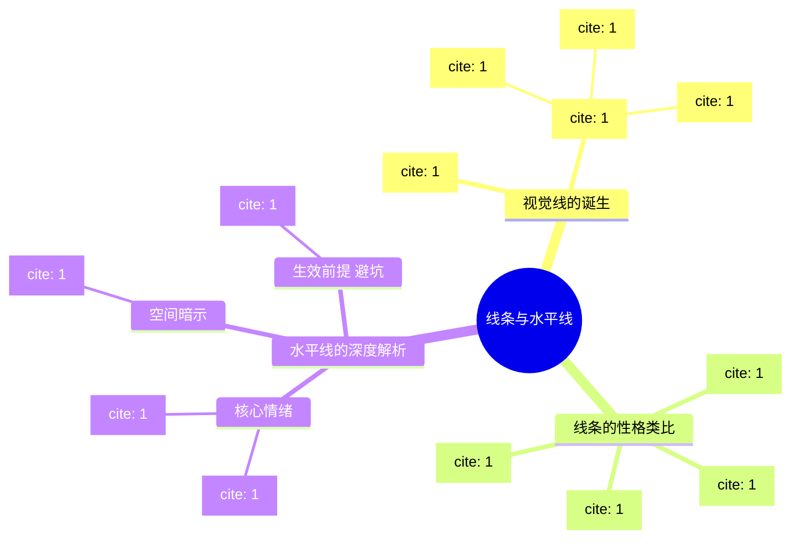

## 模块笔记：图形和摄影元素——单一点

![[image-396.png|791x612]] ![[image-397.png|1216x1223]]

**1. 核心概念定义：**

- **单一点**：画面中最基础的视觉元素。它在整个画面中只占极小的一部分，但由于与周围环境存在强烈的对比，成为了无法被忽视的绝对焦点。
- **通俗类比**：就像是漆黑夜空中的一颗启明星，或者是黑暗舞台上被唯一一束追光灯打中的孤零零的演员。虽然它非常渺小，但你的眼睛会被它牢牢吸住。
- **核心参数**：控制“点”的关键在于**对比**（明暗影调的对比、或色彩的对比）和干净的**平坦背景**。

**2. 底层逻辑与心理原理：**

- **视觉心理**：人的眼睛天生会在画面中寻找焦点。在一个相对平坦、干净的背景上，一个孤立的物体会自动抓住观众的视线。
- **位置与动感逻辑**：点放在哪里，决定了画面的心理暗示：
    - **放在正中央**：感觉绝对静止，但通常看久了会觉得枯燥乏味。
    - **稍微偏离中心**：带来适度的动感，视觉上最舒服且不走极端。
    - **靠近边缘**：打破平衡，显得相当不寻常，具有强烈的视觉张力。

代码段


**3. 场景与避坑指南：**

- **适用场景**：极简风光或建筑摄影。例如从远处拍摄水面中孤零零的小船，或者空旷天空中飞过的一只鸟儿。
- **避坑指南**：
    - **无意义的边缘放置**：把点放在极度偏离中心的角落会让人觉得奇怪，位置越异乎寻常，就越需要一个好的理由。例如，你可以为了平衡画面另一端的某个光斑，而把主体点放在相对的对角线边缘。
    - **背景太杂乱**：“点”能成立的前提是背景相对平坦。如果在拥挤杂乱的菜市场拍一个远处的人头，那不叫“单一点”，那叫“找不到焦点”。

**4. 视觉图库：**

- _(此处可粘贴一张图：深色水面上，一只白鹭被放置在画面的左上角。对角线的右下角有一些微小的太阳光斑，以此作为将白鹭放在极度偏离中心位置的“构图理由”。)_
- _(此处可粘贴一张图：一片茫茫白雪（平坦背景）中，中心微偏右的位置站着一个穿红衣服的人（色彩对比形成的单一点）。)_

**5. 刻意练习：**

- **本周计划**：找一片极度干净的背景（例如一面纯色的砖墙、一片平静的湖面或大草坪）。让你的朋友（或放一个颜色鲜艳的背包）作为画面中的“单一点”。
- **实操动作**：分别将这个“点”放在**正中央**、**三分线交点（微偏中心）**、以及**极其贴近画框边缘**的位置各拍一张。拍完后对比观察：哪张最死板？哪张最生动？感受边缘构图带来的那种“摇摇欲坠”的视觉张力。

## “多点” | 小结笔记

^xs2kqf

![[image-398.png|1282x1215]]

**1. 核心概念定义：** **多点构图**就是画面中存在两个或两个以上的视觉兴趣点。

- **通俗类比**：就像夜空中的星星。一颗星是孤立的；当出现两颗星时，你的眼睛会自然在它们之间“画”出一条线；当出现三颗星或更多时，你的大脑就会把它们连成一个“星座”（面）。
- **参数与要点**：点与点之间联系的强弱，取决于它们本身的大小，以及它们与背景的反差。

**2. 底层逻辑与心理暗示：**

- **视觉连线与方向感**：当画面有两个点时，观众的视线会不受控制地在两点之间来回跳跃，这就在画面中产生了一条“隐含的连接线”，它不仅带来了距离感，还产生了动态的方向感。
- **格式塔脑补效应**：当画面中有多个点时，观众会自动“脑补”它们之间的空间，感觉这些点共同圈出了一个隐形的区域或形状。

代码段


**3. 场景与避坑：**

- **适用场景**：拍摄群体活动（如广场上散开工作的人群），或静物摆拍（如散落的宝石、一盘珍珠、排列的样本碎片）。
- **避坑指南**：
    - **死板的几何排列**：在安排多个对象时，最忌讳极度刻意、死板的排列。如果摆放得太假、太人工化，反而会“侮辱了观众的智商”。
    - **学会借用“自然之力”**：摄影师 Frederick Sommer 曾提出，随手掷出几块鹅卵石所形成的自然散落状态，往往比我们苦思冥想摆出的几何形状更复杂、更有趣，因为“自然之力总是在不停地为我们工作着”。遇到必须整齐排列的物品（如方形样本），也可以刻意倾斜其中几个来打破沉闷。

**4. 视觉图库：**

- _(脑海画面 1：橙色珍珠)_ 在光滑的黑色鹅卵石背景上，几颗橙色珍珠被松散地摆放成一个“马蹄形”曲线，既有秩序又显得自然流动，留出了呼吸的空间。
- _(脑海画面 2：树脂样本)_ 一张原本整齐排列在网格里的树脂小方块图，但其中两三个方块被故意歪斜放置，瞬间激活了原本呆板的画面，让“多点”变得生动。

**5. 刻意练习本周计划：**

- **周末桌面挑战**：抓一把硬币或几颗糖果。第一张，像列队一样把它们整整齐齐摆成一个方阵拍下来；第二张，闭上眼睛把它们轻轻撒在桌面上，只微调几个重叠在一起的，再拍一张。
- **观察总结**：对比两张照片，感受你的视线在第二张照片中是如何被“自然的散落感”引导，并在脑海中自动将它们连成隐形多边形的。

## ：图形元素——线条与水平线

![[image-400.png|1190x1244]] ![[image-399.png|1331x741]]

**1. 核心概念定义：** 线条是构图中最基础的骨架，线条的图形质量比那些点要强得多。 **特征与成因：** 线条未必是一根实体的线（如绳子或栏杆）。对比在定义视觉线条时扮演了最重要的角色，光亮和阴影的对比、不同色彩区域之间的对比、不同纹理之间的对比、不同形状之间的对比等，都能在画面中“切”出一条线。

**2. 底层逻辑：** **心理暗示与类比：** 不同形态的线条自带不同的“性格”。比如水平线比斜线更为温和，之字线可能令人兴奋，粗壮的直线很大胆，细瘦的曲线很精致等。 特别地，**水平线**基本上表达了稳定、重量、平和、宁静。 _类比：_ 水平线就像是建筑的承重地基或一面无风的湖水，给人一种“塌不下来”的绝对安全感。同时，通过与地平线的关联，它们还能暗示远方和宽广。

**3. 场景与避坑：** **适用场景：** 想要传达辽阔感、极简主义或让观众情绪安静下来的画面（如大画幅的海景、空旷的草原）。 **避坑指南：** 不要迷信水平线的“宁静魔法”。要注意的是，这些表现力通常只在照片的内容没有实质信息时才会变得重要。 _类比解释：_ 如果你的画面是一只正在捕猎的猎豹（强烈的内容信息），哪怕背景有一条再平稳的地平线，观众也不会觉得宁静。只有在画面内容相对空灵时，水平线的性格才会凸显。

**4. 视觉图库：**

_(在此处粘贴一张仅靠光影明暗交界形成的水平线建筑摄影，体会对比产生线条的魅力)_

_(在此处粘贴一张内容极简、地平线居中的宁静海景图)_

**5. 刻意练习：** **本周计划：** 抛弃实体的“线”，去寻找大自然中的“对比线”。利用光亮与阴影的交界，或者两种不同颜色墙面的交界，拍出一条具有引导力的视觉线条。

## 模块笔记：图形和摄影元素——垂直线

**1. 核心概念定义：**

![[image-404.png|1087x1116]]

* **垂直线**：画框的第二基本元素，其方向代表了顺应重力或逃脱重力的影响。
* **通俗类比**：如果说水平线是让人安心躺下的“大地”，那么垂直线就是拔地而起“站立的人”或“生长的树”。它天生带有一种向上生长或向下坠落的势能。
* **核心参数**：控制垂直线的关键在于**精确对齐**以及**与画框（横/竖）的配合**。

**2. 底层逻辑与心理原理：**

* **物理与心理暗示**：
* **孤立的垂直线（无水平基底）**：通常更多地含有速度和运动的感觉，无论向上还是向下。
* **互补的垂直线（有水平面支撑）**：<font color="#d83931">垂直线和水平线在一起的时候是互补的，它们构成了一个均势，感觉上能量相互垂直，一个终止了另一个</font>。它们也能构造一个基本的平衡感觉，产生一种稳定、满意的感觉。
* **成组的垂直线（形成栅栏）**：几个垂直物可以联合成为一个栅栏，就像几个柱子、一排面对相机的人。某种程度上，它们能表达力量和势力。

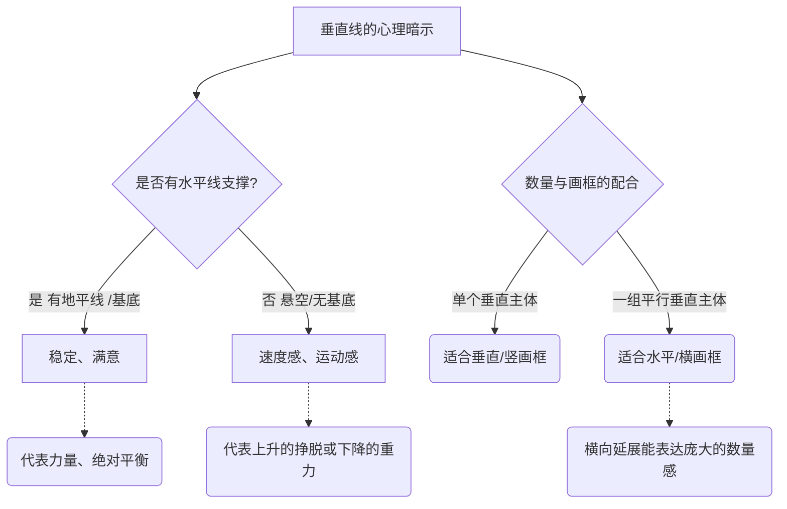

**3. 场景与避坑指南：**

* **适用场景**：
* **拍单人肖像或参天大树**：单个垂直形状的东西安排在垂直画框里比水平画框更自然。
* **拍排比的建筑柱子或人群**：一组垂直的东西就需要一个水平的结果，水平的画框实际上让这一组能包括更多，这在需要表达数量时就很重要了。
* **空间压缩（远摄）**：通过其透视缩短效果，一个超远摄镜头将一个逐渐缩小的远景转换成了一个垂直设计。
* **避坑指南**：
* **极其微小的倾斜**：从实践层面来说，和水平线一样的精确对齐非常重要。眼睛会立即将照片里的水平线、垂直线与画框边界比较，即使是最轻微的不对齐也会马上被注意到，让人觉得是拍摄失误。

**4. 视觉图库：**

* *(此处可粘贴一张图：使用竖构图（垂直画框）拍摄的一棵高耸入云的参天大树，树干笔直，与画框左右边缘完美平行，展现单一垂直物体的自然感。)*
* *(此处可粘贴一张图：使用横构图（水平画框）拍摄的缅甸单脚划船的渔民并排劳作的远摄照片，平行的垂直人物在横向画框中延展，表现出强烈的数量感和力量感。)*

**5. 刻意练习：**

* **本周计划**：去附近有规则柱子的长廊或树林。
* **实操动作**：
1. **对齐练习**：寻找一根独立的柱子，用取景器边缘作为标尺，练习屏住呼吸，拍出绝对垂直、没有任何倾斜倾倒感的照片。
2. **横竖框对比**：面对一整排树木或并排站立的人，分别用“竖构图”和“横构图”各拍一张。观察为什么横构图更能装下“一组垂直线”并传递出规模感与力量感。

## “斜线” | 小结笔记

 ![[image-403.png|1139x1111]]

**1. 核心概念定义：** **斜线构图**就是利用画面中倾斜的线条来构建视觉骨架，它是所有线条中最能给画面带来活力和动感的元素。

- **通俗类比**：如果水平线是“躺平休息”，垂直线是“立正站好”，那斜线就是“正在百米冲刺”或者“即将摔倒”。它自带一种不稳定的能量。
![[image-402.png|1162x1200]]
- **参数与要点**：斜线不需要像水平/垂直线那样严丝合缝地与画框对齐，它拥有极高的自由度。单条斜线就能产生方向感；当画面中出现两条或多条不同角度相交的斜线（相交角度最大达到 45 度时），画面的活力和视觉张力将达到顶峰。

**2. 底层逻辑与心理暗示：**

- **底层逻辑（光学透视）**：其实在人类建造的环境中，纯粹的斜线并不多，大多数斜线是“透视变形”带来的光学错觉。比如一条笔直的公路或一堵墙，当你用广角镜头靠近拍摄时，原本平行的直线在透视的压缩下会向远方汇聚，在画面里就变成了极具冲击力的斜线。
![[image-401.png|1275x730]]
- **心理暗示**：人类天生对重力非常敏感。斜线给人一种介于水平和垂直之间的“未确定的张力”，暗示着正在跌落或失去平衡的不稳定状态。这种不稳定性迫使观众的视线顺着斜线迅速滑动，从而在静止的照片中脑补出强烈的**速度感**和**运动感**。

代码段


**3. 场景与避坑：**

- **适用场景**：
    - **广角怼脸拍建筑（制造纵深）**：贴近墙根或长长的走廊，利用广角镜头把原本的平行线拉扯成向远方消失的强烈斜线，打造深邃的空间感。
    - **运动抓拍（物理加速）**：找一条现成的斜线（如桥上的栏杆），然后抓拍顺着这条斜线方向运动的行人或车辆，画面元素的运动会与斜线方向叠加，让速度感倍增。
    - **长焦俯拍（折返跳跃）**：站在高处用长焦镜头压缩一排错落的屋顶或帐篷，把它们变成“之”字形的折返斜线。这样视线就会像弹球一样在画面里来回碰撞，充满内在律动。
- **避坑指南**：斜线本身是一把“双刃剑”。虽然它能带来活力，但如果滥用（比如故意倾斜相机盲目制造斜线），会让画面失去平衡感，显得轻浮甚至让人头晕。在使用斜线时，最好结合画面的内容（如本身就在运动的物体或强烈的透视场景）顺势而为。

**4. 视觉图库：**

- _(脑海画面 1：广角下的罗马长城)_ 站在哈德良长城脚下仰拍，广角镜头将原本平行的城墙边缘扭曲成了向画面深处消失的强力对角线，让一段普通的墙壁看起来像险峻的悬崖绝壁。
- _(脑海画面 2：自带加速度的伦敦桥)_ 俯拍伦敦大桥，桥边缘的线条在画面中呈巨大的对角线。顺着斜线往下走的密集人群，与逆向上行的红色双层巴士形成反差，整个静态画面充满了呼之欲出的“倾斜”与运动感。
- _(脑海画面 3：之字形冲洗帐篷)_ 用长焦镜头从高处拍摄一排排橙红色的帐篷。原本平行的屋顶在长焦的压缩下，变成了一道道相交的“之”字形斜线，视线顺着线条反复折返，不仅有动感还极具几何趣味。

**5. 刻意练习本周计划：**

- **周末扫街挑战**：找一个带有栏杆的过街天桥或地铁站长扶梯。
- **拍摄动作**：
    - 第一张，站在正对面，将栏杆拍成水平线，等个人走过拍一张。
    - 第二张，换个机位，贴近栏杆的一端并开启手机的广角（0.5 x）模式，让栏杆在你的取景框里变成一条贯穿画面的巨大对角线。等一个人顺着栏杆往下走的瞬间，按下快门。
- **观察总结**：对比两张照片，感受第二张中的“斜线透视”是如何像滑滑梯一样，加速了人物的运动感并拉深了画面的空间距离的。

## 曲线

**1. 核心概念定义：**

![[image-405.png|1093x711]]

- **曲线**：曲线的独特之处，在于它包含了方向的持续变化。一条曲线，实际上可以看作是一系列持续变化角度的极短直线拼接而成的。
- **通俗类比**：如果水平线和垂直线是直来直去的“硬汉”，斜线是横冲直撞的“莽汉”，那曲线就是打太极的“高手”。它圆滑地避开了与画框横竖边缘的正面硬碰硬，在画面中自如游走。
- **物理参数/手段**：在摄影中，如果想用光学手段强行“凭空捏造”出实体曲线，唯一的办法就是使用**鱼眼镜头**（但这会把画面里所有的直线都无差别变弯）。

**2. 底层逻辑与心理原理：**

![[image-406.png|1190x1245]]

- **视觉心理**：由于方向在不断微调，曲线与直线在画面里会相互影响。斜线带给人的是一种特别的性格——活力和紧张的动感，而曲线的性格则是**平稳、温和、优美、文雅和流动**的。
- **引导与运动逻辑**：人类天生对曲线有亲近感。曲线具有直线所缺乏的天然“节奏感”，顺着曲线移动，眼睛会感到非常顺滑，甚至能体会到长曝光带来的“加速度”。

代码段

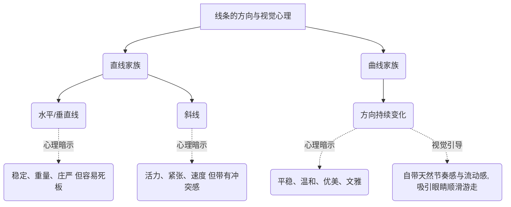

**3. 场景与避坑指南：**

- **适用场景**：
    - **表现运动与时间**：用慢门/长曝光拍摄夜晚车流的尾灯，把光变成一条加速流动的 S 型发光曲线。
    - **“暗示”出的曲线**：在自然界中直接找到完美的实体曲线很难，但我们可以通过“点、短线或边缘的排列”来暗示出一条曲线。大脑会自动把这些散落的元素连成完美的弧度。
- **避坑指南**：
    - **滥用鱼眼**：鱼眼镜头虽然能造出曲线，但会破坏画面中所有正常的透视。非特殊创作意图，不要仅仅为了“想要曲线”而去用鱼眼镜头。
    - **死磕“实体线”**：不要钻牛角尖非要找一条实实在在的绳子或道路。学会在杂乱的场景中，利用散落物体的“走势”来构建隐形曲线。

**4. 视觉图库：**

- _(此处可粘贴一张图：天空中一群错落有致飞翔的塘鹅。它们彼此之间没有线相连，但通过这种巧妙的“点的安排”，在画面中暗示出了一条充满动感与优美节奏的隐形曲线。)_
- _(此处可粘贴一张图：夜晚的盘山公路，利用长时间曝光，汽车尾灯化作了一条红色平滑的 S 型曲线，不仅展示了方向的持续变化，更带有一种顺滑的加速度感。)_

**5. 刻意练习：**

- **本周计划**：去公园或湖边，练习“无中生有”的**暗示曲线法**。
- **实操动作**：不拍道路、桥梁等实体曲线。寻找一群散落在广场上的鸽子、草地上的几块石头、或者湖面上的几只野鸭。通过移动你的脚步和镜头视角，在取景器里把这些孤立的“点”，排列成一条带有优美弧度的“隐含曲线”。拍完后观察：大脑是不是自动把它们连起来了？

## 2视线 (Lines of Sight)

**1. 核心概念定义：**

![[image-407.png|1042x695]]

- **视线**：这是我们在设计照片时能用到的、最有价值的“暗示线”之一。它是一条看不见的线，存在于画面中人物（或动物）的眼睛与他们所看的事物之间。
![[image-408.png|1190x1318]]
- **通俗类比**：你可以把画面中人物的眼睛想象成两把“隐形的激光笔”。虽然照片上画不出红色的激光束，但作为观众，我们的目光会被这股无形的光束自动牵引，顺着它指引的方向看过去。

**2. 底层逻辑与心理原理：**

- **生物本能与好奇心**：当照片里的人正在看着什么东西时，我们的眼睛会很自然地跟着望向这个方向。其底层逻辑非常简单：这是人类简单、正常的好奇心，促使我们去探究别人的眼睛究竟正在看什么。
- **视觉引导与动态**：在静态的照片中，“视线”自带强烈的方向感和动态张力。它就像一个隐形的箭头，强制规划了观众浏览照片的路线。

代码段


**3. 场景与避坑指南：**

- **适用场景**：
    - **突出次要主体**：当你想突出画面边缘的一个小物件时，安排一个人死死盯着它看。观众的视线会瞬间从人脸“弹射”到那个小物件上。
    - **制造悬念感（留白）**：让人看向画框外（比如望向窗外），能引发观众无限的遐想：“他到底在看什么？”从而增加照片的故事感。
- **避坑指南**：
    - **面壁思过式的构图（视线受阻）**：通常情况下，人物视线前方需要留出足够的空间（称为“视线空间”或“呼吸空间”）。如果人物看着右边，你却把他紧紧贴在画面的右边缘，会让人感觉视觉受阻、压抑、像在“面壁”（除非你刻意想表达压抑、紧张的情绪）。

**4. 视觉图库：**

- _(此处可粘贴一张图：画面左侧是一位母亲，她的视线温柔地看向画面右下角正在玩耍的孩子。这条隐形的视线将两个人物完美连接，构成了温馨的互动感。)_
- _(此处可粘贴一张图：在一个拥挤的街头，画面中所有人都在低头走路，唯独有一个人抬起头，惊恐地盯着画框正上方的天空（画面外）。作为观众，你会极度好奇天空中到底出现了什么。)_

**5. 刻意练习：**

- **本周计划**：与朋友在咖啡馆或公园小聚，练习“隐形引导线”。
- **实操动作**：

    1. **引导连接**：让朋友盯着桌子角落的一杯咖啡看，拍一张。观察照片，体会你的目光是如何从朋友的脸自动滑向那杯咖啡的。
    2. **空间对比（留白与面壁）**：让朋友看向画面左侧。拍两张对比图：第一张，把朋友放在画面右侧（视线前方留大片空白）；第二张，把朋友放在画面左侧（鼻子几乎贴着左边画框）。对比两张照片，感受“视线空间”对画面心理舒适度的巨大影响。

## 三角形

### 模块 1. 核心概念定义

![[image-409.png|1807x1088]]

- **概念**：三角形构图是指利用画面中的三个视觉点或线条，引导观众视线形成一个三角形的结构。
- **双重特性**：三角形在摄影中是一个非常神奇的形状，它同时具有“动态”和“稳定”两种截然不同的特性。
    - **动态感**：因为三角形天生带有斜线和角落，能让画面充满活力和方向感。
    - **稳定感**：如果三角形的某一条边线是水平的（比如底边平稳），画面就会显得非常稳固。

### 模块 2. 底层逻辑与光学原理

![[image-410.png|1910x1264]]

- **心理暗示（稳定）**：很多时候，三角形给人带来的内在稳定感，其实是来自于我们大脑对其“结构上的联想”。
    - _💡 深入浅出（类比）_：这就好比我们看到金字塔或者搭好的帐篷，只要底盘是平的，大脑就会自动联想到“稳如泰山”。
- **视觉补全（隐形边）**：在实际拍摄中，构建三角形常常只需要两条边线就足够了。第三条边可以是观众大脑自己“假设”（脑补）出来的，或者你可以直接借用相机的“画框边界”来充当这第三条边。
    - _💡 深入浅出（类比）_：就像画画时的“留白”，你画了一个“V”字，哪怕没封口，观众也会自动把它看成一个三角形。相机的取景框就是天然的物理边框，帮你省去了找第三条线的麻烦。

代码段

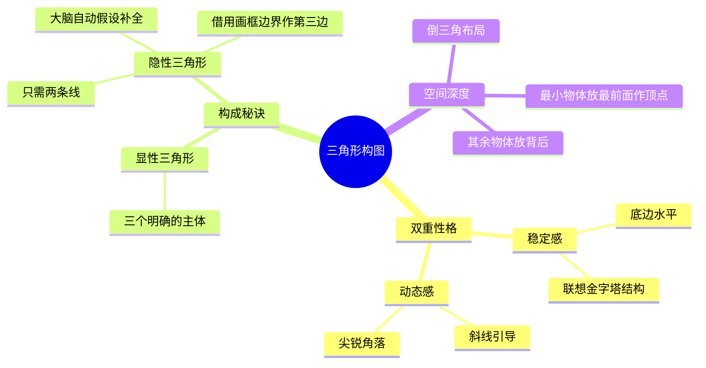

### 模块 3. 场景与避坑指南

- **适用场景 1：多人合影或建筑（求稳）**：当你想表现庄重、踏实的感觉时，尽量让三个主体形成底边水平的正三角形。
- **适用场景 2：制造画面纵深感（求立体）**：你可以把最小的物体放在最接近相机的地方，把它作为三角形的顶点位置，然后把其余的物体安排在它的背后。
    - _💡 深入浅出（类比）_：这就像电影里的“前实后虚”，前面一个小茶杯（顶点），背后远处坐着两个人（底边），画面瞬间从 2D变成了 3D。
- **避坑指南**：不要死板地在画面里硬凑三个物体来画“等边三角形”，这会让画面显得刻意做作。记住，只需要找到两条关联的线，利用好相机的边缘作为第三条边，构图会自然得多。

### 模块 4. 视觉图库

- 🖼️ **图库建议 1（静谧稳定）**：一张正面的建筑照（如金字塔）或三人全家福，底边呈完全水平状，体现由结构联想带来的内在稳定感。
- 🖼️ **图库建议 2（纵深与动态）**：一张视角独特的静物照，最靠近镜头的地方放了一颗最小的樱桃（作为最近的顶点），背后稍远处放着两块稍大的蛋糕（形成底边），构成一个有深度的倒三角形。
- 🖼️ **图库建议 3（借用画框）**：一张只拍到了两条交叉斜线（比如两条交汇的公路）的风景照，公路的尽头向画面外延伸，巧妙利用照片的底边构成了第三条线，形成一个隐形的三角形。

### 模块 5. 刻意练习

- **本周计划**：

    1. **“借边”练习**：找一个只有两条相交斜线的场景（比如墙角、路口），尝试不拍出第三个点，而是利用相机的上下左右边缘作为“第三条边”进行构图。
    2. **“纵深顶点”练习**：在餐桌前，故意把最小的一把勺子放在离镜头最近的地方充当三角形顶点，把盘子和杯子推到背后，观察这种布局带来的立体纵深感。
- 1. 三角关系”。
$1
    2. 通过一条隐藏的、弯曲的“S 曲线”来“引导眼睛”的视线，在它们之间流畅穿梭。

代码段

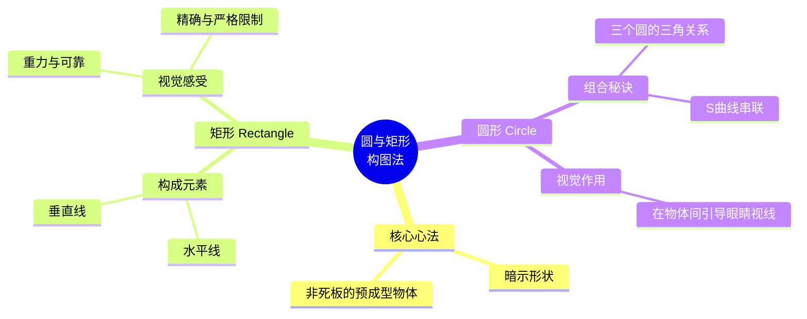

### 模块 3. 场景与避坑指南

- **适用场景 1：拍建筑或工业品（用矩形求稳）**。当你想表达严谨、秩序和力量感时，刻意寻找并对齐画面中的水平线和垂直线，利用矩形的限制感来传递“精确与可靠”。
- **适用场景 2：拍静物或多人物（用圆形引导）**。面对桌面上散落的多个菜盘或一群人，利用它们形成“三个圆”，并通过光影或道具摆出一条“S曲线”，能立刻让呆板的画面流动起来。
- **避坑指南**：新手最容易犯的错就是寻找太刻意的形状（预成型物体）。比如为了拍圆，非要把一个呼啦圈放在画面正中间。记住，最高级的构图是“暗示”，让观众的眼睛自己去发现。

### 模块 4. 视觉图库

- 🖼️ **图库建议 1（矩形的精确）**：一张正面的大门或书架特写，画面被严格的“水平线和垂直线”切割成数个小矩形，没有多余的斜线，传递出极度“严格、可靠”的庄严感。
- 🖼️ **图库建议 2（三圆与S曲线）**：一张精美的珍珠摆拍（或咖啡馆的三个茶杯），“三个圆”大小不一，构成稳定的“三角关系”；同时，桌面上的丝巾褶皱形成了一条“弯曲的S曲线”，刚好穿过这三个圆，引导眼睛的视线流畅移动。

### 模块 5. 刻意练习

- **本周计划**：
$1
    1. **“寻找压迫感”练习**：找一面有窗户的砖墙，强迫自己只用“水平线和垂直线”取景，体会矩形构图带来的“重力与严格的限制”感。
    2. **“餐桌连线”练习**：吃饭时，把三个盘子/碗摆成不规则的“三角关系”，然后用一根筷子或桌布的边缘在它们旁边暗示出一条“S 曲线”，观察你的视线是不是会自动在“三个圆”之间游走。

- 1. 三角关系”。
$1
    2. 通过一条隐藏的、弯曲的“S 曲线”来“引导眼睛”的视线，在它们之间流畅穿梭。

代码段


### 模块 3. 场景与避坑指南

- **适用场景 1：拍建筑或工业品（用矩形求稳）**。当你想表达严谨、秩序和力量感时，刻意寻找并对齐画面中的水平线和垂直线，利用矩形的限制感来传递“精确与可靠”。
- **适用场景 2：拍静物或多人物（用圆形引导）**。面对桌面上散落的多个菜盘或一群人，利用它们形成“三个圆”，并通过光影或道具摆出一条“S曲线”，能立刻让呆板的画面流动起来。
- **避坑指南**：新手最容易犯的错就是寻找太刻意的形状（预成型物体）。比如为了拍圆，非要把一个呼啦圈放在画面正中间。记住，最高级的构图是“暗示”，让观众的眼睛自己去发现。

### 模块 4. 视觉图库

- 🖼️ **图库建议 1（矩形的精确）**：一张正面的大门或书架特写，画面被严格的“水平线和垂直线”切割成数个小矩形，没有多余的斜线，传递出极度“严格、可靠”的庄严感。
- 🖼️ **图库建议 2（三圆与S曲线）**：一张精美的珍珠摆拍（或咖啡馆的三个茶杯），“三个圆”大小不一，构成稳定的“三角关系”；同时，桌面上的丝巾褶皱形成了一条“弯曲的S曲线”，刚好穿过这三个圆，引导眼睛的视线流畅移动。

### 模块 5. 刻意练习

- **本周计划**：
$1
    1. **“寻找压迫感”练习**：找一面有窗户的砖墙，强迫自己只用“水平线和垂直线”取景，体会矩形构图带来的“重力与严格的限制”感。
    2. **“餐桌连线”练习**：吃饭时，把三个盘子/碗摆成不规则的“三角关系”，然后用一根筷子或桌布的边缘在它们旁边暗示出一条“S 曲线”，观察你的视线是不是会自动在“三个圆”之间游走。

## 圆与矩形构图法

### 模块 1. 核心概念定义

![[image-411.png|1081x562]]

- **概念**：构图中的“圆与矩形”，最高级的用法是去“暗示一个形状而不是作为一个预成型的物体”。
    - _💡 深入浅出（类比）_：这就像是“连线游戏”。不要死板地在画面里直接拍一个完整的铁丝圆环或一个木头方框（预成型物体），而是利用画面里散落的元素（如几个人的头、几个杯子），让观众的大脑自动把它们连起来，脑补出（暗示）一个圆形或矩形。

### 模块 2. 底层逻辑与心理暗示

- **矩形的逻辑（理性与规矩）**：矩形是由两种最基础的线条构成的——“水平线和垂直线”。
    - **心理暗示**：正因为横平竖直，矩形天生与“重力、可靠、精确和严格的限制相关联”。
    - _💡 深入浅出（类比）_：看到横平竖直的矩形，就像看到一栋四平八稳的钢筋水泥大楼，给人一种不可撼动、规规矩矩、甚至有点严肃压抑的感觉。
- **圆形的逻辑（流动与引导）**：当画面中出现多个圆（比如三个圆）时，它们“以两种方式联在一起”：
![[image-412.png|730x1171]] $1
    1. 位置上形成“三角关系”。
    2. 通过一条隐藏的、弯曲的“S 曲线”来“引导眼睛”的视线，在它们之间流畅穿梭。

代码段


### 模块 3. 场景与避坑指南

- **适用场景 1：拍建筑或工业品（用矩形求稳）**。当你想表达严谨、秩序和力量感时，刻意寻找并对齐画面中的水平线和垂直线，利用矩形的限制感来传递“精确与可靠”。
- **适用场景 2：拍静物或多人物（用圆形引导）**。面对桌面上散落的多个菜盘或一群人，利用它们形成“三个圆”，并通过光影或道具摆出一条“S 曲线”，能立刻让呆板的画面流动起来。
- **避坑指南**：新手最容易犯的错就是寻找太刻意的形状（预成型物体）。比如为了拍圆，非要把一个呼啦圈放在画面正中间。记住，最高级的构图是“暗示”，让观众的眼睛自己去发现。

### 模块 4. 视觉图库

- 🖼️ **图库建议 1（矩形的精确）**：一张正面的大门或书架特写，画面被严格的“水平线和垂直线”切割成数个小矩形，没有多余的斜线，传递出极度“严格、可靠”的庄严感。
- 🖼️ **图库建议 2（三圆与 S 曲线）**：一张精美的珍珠摆拍（或咖啡馆的三个茶杯），“三个圆”大小不一，构成稳定的“三角关系”；同时，桌面上的丝巾褶皱形成了一条“弯曲的 S 曲线”，刚好穿过这三个圆，引导眼睛的视线流畅移动。

### 模块 5. 刻意练习

- **本周计划**：
$1
    1. **“寻找压迫感”练习**：找一面有窗户的砖墙，强迫自己只用“水平线和垂直线”取景，体会矩形构图带来的“重力与严格的限制”感。
    2. **“餐桌连线”练习**：吃饭时，把三个盘子/碗摆成不规则的“三角关系”，然后用一根筷子或桌布的边缘在它们旁边暗示出一条“S 曲线”，观察你的视线是不是会自动在“三个圆”之间游走。

## 向量

### 模块 1. 核心概念定义

- **概念**：在数学和物理学中，“向量”是指既有大小又有方向的量。在摄影构图中，向量是指画面里包含了“移动的图形元素”（或者元素的组合）。
- **核心作用**：它能打破照片的静止感，给静态的影像带来强烈的“动态属性”。
    ![[image-413.png|1082x1086]]
    - _💡 深入浅出（类比）_：不要被“向量”这个理科词汇吓到。在摄影里，向量就是画面中隐藏的“隐形指示牌”或“箭头”。它在无声地告诉观众的眼睛：“顺着我指的方向看过去”或者“这个东西正在往那边跑”。

### 模块 2. 底层逻辑与物理暗示

- **直线型向量（汇聚的斜线）**：如果画面中能找到两条或者更多正在汇聚的斜线，作为向量的效果会非常好。
    - _💡 深入浅出（类比）_：就像你站在笔直的高速公路中央往前看，马路两边的线向远方汇聚成一点。这两条线就是最强烈的向量，像吸尘器一样把你的视线强行“吸”向远方。
- **曲线型向量（曲线的张力）**：除了直线，曲线也同样具有强烈的移动感。有时候，曲线甚至能让观众在视觉上产生一种“速度和加速度的感觉”。
    - _💡 深入浅出（类比）_：一条 S 型的盘山公路或河流，就像是游乐园里的“过山车轨道”。当观众的视线顺着弯曲的线条滑动时，大脑会自动脑补出转弯时的离心力和加速感。

代码段

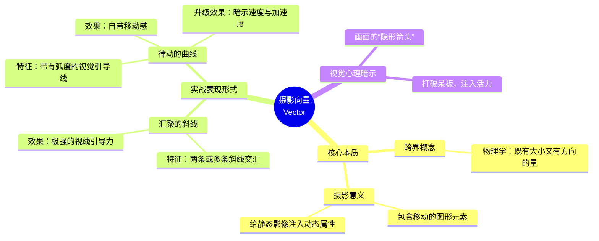

### 模块 3. 场景与避坑指南

- **适用场景 1：拍建筑或公路（找汇聚线）**。当你站在高楼底部向上拍，或者站在走廊、铁轨中央拍摄时，利用透视产生的“汇聚斜线”作为向量，能让画面充满向前的冲击力。
- **适用场景 2：拍运动轨迹或自然河流（找曲线）**。利用夜晚车流的红色尾灯拉出的长长曲线，或者蜿蜒的河流，不仅能表现物体的移动感，还能让画面产生加速的速度感。
- **避坑指南**：如果画面中安排了强烈的向量（隐形箭头），一定要注意它指向哪里。最忌讳的是强烈的向量直接指向了画框边缘甚至画面外，这会把观众的视线直接“甩”出照片，导致观众不再关注照片本身的内容。

### 模块 4. 视觉图库

- 🖼️ **图库建议 1（汇聚斜线向量）**：一张在地铁隧道或长长走廊里拍摄的照片，天花板和地板的线条形成两条强烈的斜线，向画面中央深处汇聚，产生极强的视觉吸力。
- 🖼️ **图库建议 2（曲线加速向量）**：一张用慢快门拍摄的盘山公路夜景，汽车尾灯在画面中画出了一条连续的“S 型曲线”，明亮的红色轨迹让静止的照片瞬间充满了速度感与加速度的错觉。

### 模块 5. 刻意练习

- **本周计划**：
$1
    1. **“寻找箭头”练习**：在上下班的路上，寻找具有“汇聚斜线”的场景（如天桥的栏杆、两排整齐的树木）。强迫自己把两条线放在画面中，拍一张充满“向前拉扯感”的照片。
    2. **“感受加速度”练习**：找一条弯曲的小路或者水流（甚至是一根弯曲的绳子），顺着它的弯曲方向进行构图，体会一下曲线是如何让你的眼睛在画面中产生滑动和移动感的。

这是一份为您定制的摄影笔记。我已将“画框动态与注意力引导”的核心理论，转化为通俗易懂的实战技巧，并严格按照您的模板和排版要求进行了视觉化处理。

## 📸 摄影笔记：画框动态与注意力引导 (Frame Dynamics & Guiding Attention)

![[image-414.png|1098x1236]]

### 模块 1. 核心概念定义

- **概念**：“画框动态”是指通过巧妙安排画面中的线条、形状和人物动作，在画框内部构建一条隐形的视觉路径，主动引导观众的眼睛在画面中按顺序移动。
    - _💡 深入浅出（类比）_：这就像是在照片里铺设了一条“视觉传送带”或安排了一位“隐形导游”。你不只是死板地把主体放在正中间，而是设计好路线，让观众的大脑不自觉地顺着你的安排：“先看这里，再顺着线看那里，最后看整个背景”。

### 模块 2. 底层逻辑与心理暗示

- **视觉聚拢（硬引导）**：利用画面中物体的物理边界构成会聚的线条，可以强行将视线引向某个焦点。即使主体非常微小，只要线条的角度经过精心选择（如扇形排列），就能确保它成为绝对的中心。
- **空间博弈（留白与游走）**：当“环境氛围”和“主体”同样重要时，控制主体的面积至关重要。将主体（例如食物）控制在大约占据画框三分之一的空间，能让构图结构引导眼睛在背景和主体之间来回移动，使两者都得到适当的注意。
- **行为暗示（软引导）**：画面中非线条的元素也能引导视线。比如一个张开的形状（如牡蛎张开的嘴），或者人物的面部朝向和弯腰动作，都能在潜意识里暗示视线的移动方向。

代码段

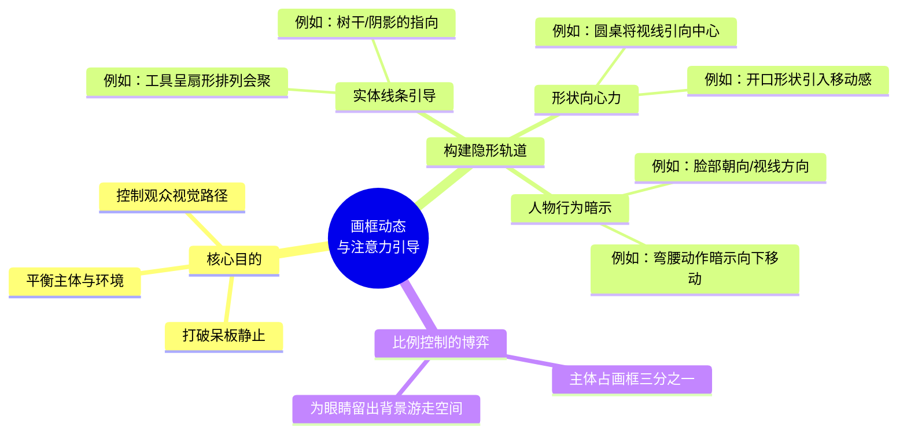

### 模块 3. 场景与避坑指南

- **适用场景 1：客观记录微小主体（用硬引导）**。当你需要展示一些精细的过程（如展示种植珍珠贝的仪器和过程），并且风格要求干净、客观时，把细小的核心元素放在画面中央，用周围的仪器线条呈扇形指向它，能让视觉极为集中。
- **适用场景 2：带环境氛围的主体拍摄（用软引导结合比例）**。当你的拍摄主体是食物，且处于一个极具当地风情的室外布景中，应该把食物放在垂直画框的下部，利用环境里的垂直线条（如树干）和曲线（如圆桌）把视线往下压向食物。
- **避坑指南**：如果你特意找了一个很有气氛的地方布景拍摄，千万不要为了突出主体而把镜头凑得太近（比如拍一盘菜的极度特写）。如果观众看不到足够的环境和气氛，特意找这么个地方拍摄就显得毫无必要了。

### 模块 4. 视觉图库

- 🖼️ **图库建议 1（会聚线与微小主体）**：一张干净整洁的俯拍图，上方几把金属仪器呈扇形排列，线条尖端全部精准地会聚向中心的一颗微小的“珍珠种子”。左下方是一个张开嘴的牡蛎，它的开口方向引导眼睛在看完种子后，自然地向左下方移动。
- 🖼️ **图库建议 2（三分之一构图与环境互动）**：一张垂直构图的泰国菜照片。底部的三分之一是一盘精致的食物。背景是一张圆桌和一棵棕榈树干，树干和斜阴影主导了“向下指向食物”的趋势；背景中还有一个弯腰放下篮子的小女孩，她的脸部朝向和动作完美地暗示了向下的移动，视线在背景和食物间流畅穿梭。

### 模块 5. 刻意练习

- **本周计划**：周末去一家极具特色的网红餐厅，进行“环境美食打卡”练习。
    - **控制比例**：忍住怼着食物拍特写的冲动。退后一点，采用垂直构图，让食物正好只占据画面底部的三分之一。
    - **寻找导轨**：观察周围环境，利用桌子的弧线、窗户的边缘，或者趁着同行朋友低头弯腰看菜单的那一瞬间按下快门。利用他们的面部朝向把观众的视线强行“压”回你盘子里的食物上。

## 焦点

### 模块 1. 核心概念定义

- **概念**：向哪里对焦在通常的拍摄中是一个非常自然、理所当然的过程：首先确定什么是主体，然后拿起相机对准它。
    ![[image-415.png|713x773]]
- **核心作用**：“对焦清晰”在摄影中是一个无可置疑的标尺。正因如此，画面中任何处于焦点内的元素，都会自动拥有极强的视觉力量，成为事实上的绝对关注点。
    - _💡 深入浅出（类比）_：焦点就像是舞台上的“高光追光灯”。不管舞台（照片画面）有多大多暗，只要追光灯打在谁身上，观众的眼睛就只能被强迫定格在那里。

### 模块 2. 底层逻辑与光学心理暗示

![[image-416.png|1190x1312]]

- **视线引导的隐形轨道**：焦点不仅仅是让物体变清晰，它还能在画面中创造一段“从模糊到清晰”的焦点范围。这种清晰度的渐变本身就包含了一种方向感，会引导观众的眼睛最终停留在最清晰的区域。
- **镜头焦距的心理博弈**：
    - **远摄镜头（长焦）**：人们在潜意识里已经习惯了长焦镜头带来的浅景深。观众天然地期待长焦照片中存在模糊到清晰的过渡，并期待清晰区域正是画面的主兴趣点。
    - **广角镜头**：广角镜头通常会产生景深极深的影像（处处清晰）。因此，对于广角视野来说，出现焦外模糊是观众“意料之外”的，能带来强烈的视觉惊喜。

代码段

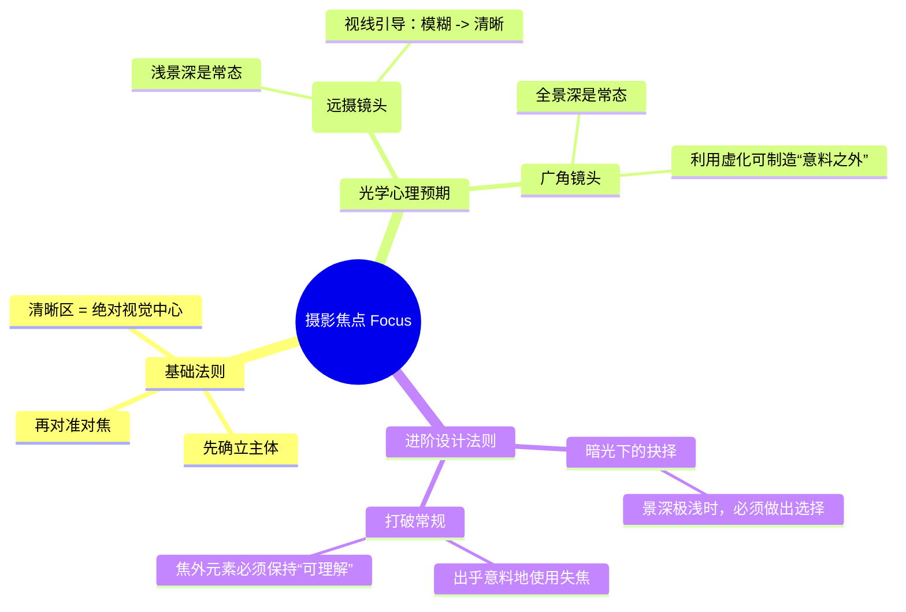

### 模块 3. 场景与避坑指南

- **适用场景 1：暗光环境下的“被迫选择”（做减法）**。如果光线很暗，可能只有画面的一小部分能留在焦点里。在这种极端条件下，你必须做出选择。限制焦点能发挥最大价值，将观众的注意力极度集中在你选中的那一小部分细节上。
- **适用场景 2：出乎意料的失误（打破常规）**。故意的失误——或者说出乎意料地使用焦点（比如该清晰的地方虚化了），往往能取得非常好的奇效，因为它打破了人们的常规视觉习惯。
- **避坑指南**：当你使用浅景深将注意力集中在很小的区域时，一定要确保焦外（模糊）的元素依然是“可理解的”。如果背景被虚化成了一团毫无意义的色块，观众就失去了理解环境的线索。

### 模块 4. 视觉图库

- 🖼️ **图库建议 1（长焦视线引导）**：一张在火山口用远摄镜头拍摄的野生动物特写（如一只叼着火烈鸟的鬣狗）。从前景开始是模糊的草地，焦点逐步清晰，引导观众的眼睛快速向上，最终到达对焦极其锐利的猎食者面部。
- 🖼️ **图库建议 2（极端选择对焦）**：一张特写照片，画面中只有抄写员笔尖下的几个美术字是清晰的。利用极浅的景深，将周围杂乱的工作间完全虚化成水洗般柔和的色彩，让极其微小的主体占据了全部的注意力。

### 模块 5. 刻意练习

- **本周计划**：
$1
    1. **“暗光抉择”练习**：在夜晚或光线极暗的室内，使用最大光圈拍摄。因为光线暗导致景深极浅，强迫自己只选择一个微小的细节（比如杯口的一滴水）进行精准对焦，体会这种“被迫选择”带来的强大视觉集中力。
    2. **“焦外辨识度”练习**：在街头用大光圈拍摄时，故意对焦在离镜头最近的栏杆或树叶上，让背后的人物虚化。但要控制虚化的程度，确保观众依然能“理解”出背后那是一对正在拥抱的情侣或一个骑车的路人。

## 📸运动

### 模块 1. 核心概念定义

![[image-417.png|997x616]]

- **概念**：在摄影中，“模糊”并不总是代表拍摄失败。运动模糊有很多种不同的类型，每种都有其独特的特性和视觉感受。
- **核心作用**：快门不仅能“冻结”时间，还能“拉长”时间。通过控制快门速度，我们能把物体移动的过程记录在同一张静态底片上，让原本静止的照片产生强烈的速度感与时间流逝感。

### 模块 2. 底层逻辑与光学心理暗示

想要用好模糊，必须搞懂是**什么在动**。根据成因，我们可以将运动模糊分为三大类：

1. **相机抖动（意外的破坏者）**：由于相机抖动造成的模糊通常会形成鬼影般的双重边缘。

    - _💡 深入浅出（类比）_：这就好比你在画画时冻得全身发抖，画纸连同画笔一起震动，画出来的所有东西都会出现重影，让人看了头晕。

2. **主体移动（时间的轨迹）**：主体在曝光期间移动则会产生影像拖尾。

    - _💡 深入浅出（类比）_：就像夜空中的流星。夜空（背景）是完全静止清晰的，但流星（主体）因为运动速度极快，在我们的视觉中留下了一条长长的尾巴。

3. **平移相机（相对静止的魔法）**：平移相机或在行驶的汽车上拍摄则会产生直线形的拖尾。

    - _💡 深入浅出（类比）_：这就像你坐在高铁上看着窗外与你同速并排疾驰的汽车。汽车在你眼里是相对静止（清晰）的，但背景里的树木和房屋全都拉丝变成了直线。

代码段

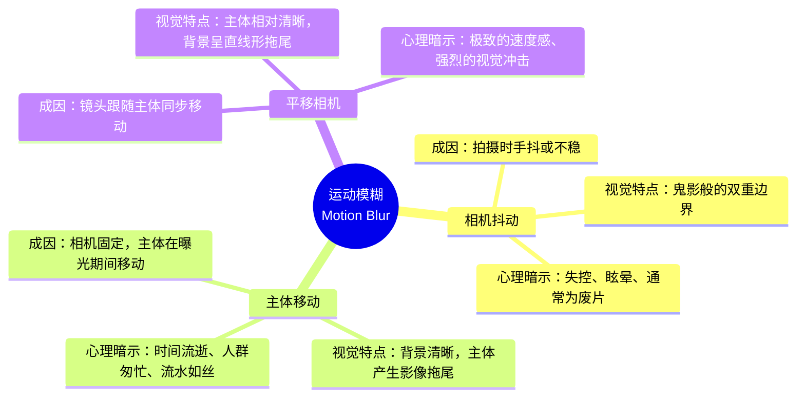

### 模块 3. 场景与避坑指南

- **适用场景 1：拍车流或瀑布（利用“主体移动”）**。把相机固定在三脚架上，使用慢快门（如 1 秒或更长）。静止的建筑和马路会极度清晰，而移动的汽车会变成流动的光轨，展现出城市的繁华与时间的流逝。
- **适用场景 2：拍赛车或奔跑的宠物（利用“平移相机”）**。使用约 1/30 秒的快门，当赛车经过时，身体和镜头跟随赛车一起平移转动并按下快门。这样能拍出主体清晰，而背景拉出极具速度感的直线型拖尾。
- **避坑指南**：新手在光线较暗的室内手持拍摄时，快门速度往往会自动变慢。这时候极易发生**相机抖动**，导致整张照片出现鬼影般的双边界，画面不仅没有美感，还会显得很脏乱。此时必须调大光圈、提高 ISO 或使用三脚架来固定相机。

### 模块 4. 视觉图库

- 🖼️ **图库建议 1（相机抖动的鬼影）**：一张在暗光下没有端稳相机拍出的街景，整栋大楼和路牌都出现了重影（双边界），画面让人感到眩晕和失败。
- 🖼️ **图库建议 2（主体移动的拖尾）**：一张用三脚架拍摄的地铁站。站台和等车的乘客极其锐利清晰，而刚好进站的列车变成了一道模糊的银色影像拖尾，动静结合。
- 🖼️ **图库建议 3（平移相机的拉丝）**：一张经典的“摇拍”赛车照片。赛车本身细节清晰锐利，但它背后的观众席和广告牌全部化作了强烈的、水平直线型的拖尾，速度感仿佛要冲出画面。

### 模块 5. 刻意练习

- **本周计划**：周末找一个安全的马路边或天桥上，进行“动静博弈”练习。

    1. **定机位练习**：将手机或相机固定在栏杆上，设置快门速度为 1/15 秒。拍摄过往的车辆，观察“背景清晰 + 车辆产生影像拖尾”的效果。
    2. **摇拍练习（进阶）**：保持快门 1/15 秒，当一辆自行车或汽车经过时，镜头紧紧锁定它并随之转动身体平移拍摄。检查照片，看看是否成功拍出了“直线型的背景拖尾”。

## 瞬间 (The Moment)

![[image-418.png|1190x1276]]

### 模块 1. 核心概念定义

- **概念**：摄影中的“瞬间”，最著名的代名词是“决定性瞬间”。正如 17 世纪的红衣主教雷斯曾经说的：“这世界上任何事物都有决定性瞬间。” 它是指画面中所有元素（光线、人物、背景）达到完美平衡的那一刻。
- **时间尺度**：不要被“瞬间”这个词误导，认为它只代表千分之一秒的抓拍。捕捉一个瞬间，如果这需要一个小时、两个小时、一个星期、两秒钟、或二十分之一秒，都是合理的。

### 模块 2. 底层逻辑与心理暗示

- **预判与等待（搭舞台法则）**：捕捉瞬间的底层逻辑不是“拼命追着主体跑”，而是“预判”。你需要先发现一个好的背景和光线，把构图安排好，然后等待合适的主体走入画面。
    - _💡 深入浅出（类比）_：这就像是在剧院里打灯光。新手摄影师是拿着手电筒满场追着演员跑（手忙脚乱且构图糟糕）；而大师是先在舞台上打好一束绝美的追光（预先构图），然后端着相机，静静等待演员刚好走到光圈里的那一刻按下快门。
- **心理暗示**：一个完美的“决定性瞬间”，会给观众带来强烈的“不可替代感”和“故事感”。观众在看照片时会在潜意识里惊叹：“哇，要是早一秒或者晚一秒，这个神奇的画面就不成立了！”

代码段

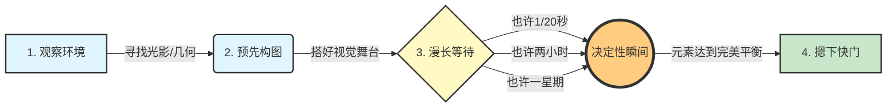

### 模块 3. 场景与避坑指南

- **适用场景 1：街头人文摄影（快速的瞬间）**。找一面有光影的红墙预先构图，等待一个打着红伞的人刚好走过墙角的三分之一处，完成呼应。
- **适用场景 2：风光风光摄影（漫长的瞬间）**。架好三脚架对准一座雪山，等待两个小时，只为了云层裂开，一束“耶稣光”刚好照亮雪山顶峰的那一两秒钟。
- **避坑指南**：拒绝“机关枪式连拍”。很多新手遇到运动场景就按住快门不松手，拍了几百张废片。连拍往往会让你产生依赖心理从而放弃思考，真正的瞬间是靠眼睛观察、大脑预判，最后用手指精准击发的。

### 模块 4. 视觉图库

- 🖼️ **图库建议 1（微秒级的瞬间）**：一张经典的街头黑白照片。一个人正跃过水坑，脚尖即将在水面上点起涟漪，人物的倒影与背景的海报形成了绝妙的呼应。多一秒落地，少一秒没张力。
- 🖼️ **图库建议 2（小时级的瞬间）**：一张壮丽的峡谷风光照。整个峡谷处于阴影中，唯独画面正中央的一块巨石被一束金色的夕阳精准照亮。这不仅是按快门的瞬间，更是长达数小时等待的结果。

### 模块 5. 刻意练习

- **本周计划**：周末进行一次“守株待兔”练习。
    - **规则**：找一个光影结构很棒的街角、天桥或咖啡馆窗边。举起相机或手机构好图，**站在原地 15 分钟绝对不移动机位**。
    - **目标**：在这 15 分钟内，像狙击手一样观察进入你画面的路人、车辆或动物，只在他们走到构图中最完美的那一个“决定性位置”时，才按下快门。体会“等待瞬间”而不是“追逐瞬间”的感觉。

## 模块一：光学（焦距的“空间魔法”）

**1. 核心概念定义：**

![[image-421.png|1077x1086]]

- **光学与焦距**：摄影不是简单地记录你看到的东西，而是通过镜头的“光学手段”重塑画面。不同焦距不仅改变你看到的范围（视角），更会像魔法一样改变画面中物体的大小关系和纵深感。
- **参数**：广角镜头（如 20 mm）和远摄镜头/长焦镜头（如 400 mm）。

**2. 底层逻辑光学原理：**

- **广角镜头的“拉伸术”**：广角不仅看得广，还会夸大近大远小的透视关系，让线条产生强烈的汇聚和拉伸效果（产生斜线）。
- **远摄镜头的“压缩术”**：远摄镜头会把远处的背景像被压扁的纸片一样“拉得近一些”，使画面趋于扁平化，强调水平和垂直线条，减弱纵深感。
- **心理暗示（类比理解）**：
    - _广角镜头就像“摇滚区前排”_：它把观众强行拉入场景中，甚至带来一种被画面包围、身临其境的主观参与感。
    - _远摄镜头就像“拿望远镜在阳台偷窥”_：它让观众远离主体，产生一种客观、冷静、保持距离的旁观者心态。

**3. 场景与避坑指南：**

![[image-422.png|1076x872]]

- **适用场景（广角）**：街头纪实摄影。通过极近的距离、被截断的边缘和人脸，营造强烈的现场冲突感。
- **适用场景（远摄）**：需要将两个相距很远的物体在视觉上“并列”在一起时（例如把远处的月亮拍得和近处的建筑一样大）。
- **避坑指南（广角空虚症）**：很多人站在悬崖或高楼顶上用广角拍大景，但如果“照片的前景没有内容的话，这只能获得更宽广的视场”，不仅没有立体感，还会显得大而空洞。

**4. 视觉图库（焦距特性对比）：**

代码段

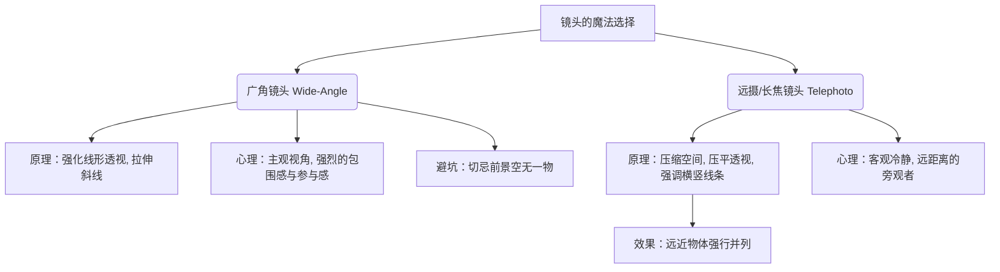

(脑海图库示例：左图是一张 20 mm 广角拍摄的建筑，底部的线条剧烈向天空汇聚，感觉建筑要砸向自己；右图是 400 mm 远摄镜头拍摄的同一建筑，大楼的透视被“压平”，看起来像一堵方正静止的墙。)

**5. 刻意练习本周计划：**

- 找一条有纵深感的走廊或街道。先用手机的“0.5 x 超广角”贴近地面的一个易拉罐拍一张。然后保持易拉罐在画面中大小不变，人往后退几十米，换用“5 x 长焦”再拍一张。对比两张图背景里的走廊是怎样从“深邃深渊”变成“一堵平墙”的。

## 画框动态与特殊镜头

![[image-425.png|1107x1050]]

**1. 核心概念定义：**

- **光学画框动态**：指通过改变镜头的物理结构（如焦距、镜片弧度、焦平面），强制改变画框内物体的大小关系、清晰度分布和几何形状。
- **参数/工具**：远摄（长焦）镜头、鱼眼镜头（Fisheye）、倾斜镜头（移轴/Tilt-shift）。

**2. 底层逻辑光学原理：**

- **远摄镜头的“折叠空间”（压缩与并列）**：当两个物体物理距离相距很远时，远摄镜头的压缩效应能在二维照片上将它们生生“拉得近一些”。
    - _类比_：就像你把一个拉开的手风琴用力压扁，原本隔得很远的前后褶皱，在视觉上紧紧贴在了一起。只要轻微移动视点或物体，就能在不对画面其他部分造成大改变的前提下，完成画框内的“并列”构图。
- **鱼眼镜头的“强行塞入”（空间扭曲）**：拥有 180 度或更广的超大视角。为了把这么广的画面塞进一个矩形（全幅鱼眼）或圆形画框里，它会把除中心点放射线以外的**所有直线强行弯曲**，产生极度夸张的变形。
- **倾斜镜头的“掰弯焦平面”**：普通相机对焦时，“清晰的范围”是与相机传感器平行的一堵无形的“平墙”。而倾斜镜头可以把合焦平面“掰斜”，让画面能在最大光圈下实现从近到远的清晰控制，但代价是会沿倾斜方向拉伸影像导致变形。
- **心理暗示（参与感剥夺）**：长焦镜头的使用通常意味着“从远处拍摄”，这会让观众产生一种远离主体的感觉，从而剥夺或减少了观察者的“现场参与感”，带来一种冷眼旁观的客观性。

**3. 场景与避坑指南：**

- **适用场景（长焦并列）**：当你需要把背景里巨大的地标（如远处的雪山）和前景的人物放在同一个画框里，并让它们看起来一样大、产生关联时，使用远摄镜头进行“并列”构图。
- **适用场景（倾斜镜头微距）**：在极近距离拍摄雨滴或静物时，常规镜头景深极浅，使用倾斜镜头可以倾斜焦平面，让一整排雨滴远近都清晰可见。
- **避坑指南（鱼眼滥用症）**：鱼眼镜头的极度变形很容易变成一种廉价的“视觉杂耍”。它的避坑法则是：**除非拍摄主体本身就缺乏明显的直线条（比如茂密的自然森林）**，否则很难用得不露痕迹、不让人反感。

**4. 视觉图库与逻辑导图：**

关于特殊镜头如何改变“画框动态”，请看以下逻辑关系图：

代码段

```
graph TD
    A[改变画框动态的光学魔法] --> B(远摄镜头 / 长焦)
    A --> C(鱼眼镜头)
    A --> D(倾斜镜头 / 移轴)
    
    B --> B1[空间压缩与并列]
    B1 --> B2[将相距极远的物体在画框中拉近]
    B1 --> B3[心理效应：远离主体, 减少观众参与感]
    
    C --> C1[视角极限扭曲]
    C1 --> C2[将180度视野强行弯曲塞入画框]
    C1 --> C3[避坑：仅适用于无直线的自然场景]
    
    D --> D1[焦平面重塑]
    D1 --> D2[打破平行对焦, 倾斜合焦平面]
    D1 --> D3[效果：大光圈下实现全景深, 但会拉伸变形]
```

(脑海图库示例：一张是用 400 mm 远摄镜头拍摄的公路，公路上远近的两辆车在压缩效应下看起来就像头尾相撞贴在一起，画面极度扁平；另一张是倾斜镜头拍摄的桌面水滴微距，在极浅的光圈下，从镜头前 10 厘米到半米外的水滴竟然奇迹般地处在同一条清晰的对角线上。)

**5. 刻意练习本周计划：**

- **长焦“折叠空间”体验**：周末找一条笔直的长街（有红绿灯和路牌）。站在街头，用手机的“3 倍或 5 倍长焦模式”对准街尾拍摄。你会神奇地发现，原本隔着几百米的三个红绿灯，在照片的画框里仿佛紧紧挨在一起，体会“远摄镜头将远距离物体拉近并列”的光学压缩魔法。

## 模块二：曝光（情绪与视线的开关）

**1. 核心概念定义：**

![[image-423.png|1190x626]]

- **曝光的终极目的**：曝光不仅仅是为了“规范化视觉”（即把画面拍得和肉眼看的一样亮），它更是摄影师用来隐藏或凸显信息的手段。
- **参数**：高反差/低反差（明暗对比度）、高调/低调（画面整体亮度）、眩光（Lens Flare）。

**2. 底层逻辑光学原理：**

![[image-424.png|1142x1211]]

- **视线趋光性**：人的眼睛就像飞蛾，天生会倾向于向画面中“正常”曝光或明亮的区域移动。
- **高光曝光法则（柯达克罗姆法则）**：故意让画面整体曝光不足（暗下来），只要保住最亮的高光不过曝，就能获得极其浓郁、饱满、鲜艳的色彩。
- **心理暗示（类比理解）**：
    - _暗角（边缘发黑）就像“剧场追光灯”_：它能强行把观众散落的注意力向画面内部中心集中。
    - _眩光（阳光直射镜头）就像“燥热的空气”_：不一定是废片，它可以作为一种图像实体，带来阳光刺目、炎热和强烈的现实感。

**3. 场景与避坑指南：**

- **适用场景（剪影/轮廓）**：当背景有绝美的日落或强光时，直接对准最亮处曝光。主体会变成纯黑的轮廓，极具戏剧性。
- **适用场景（控制视线）**：在一个既有阳光又有大片阴影的场景里，压暗曝光，让高反差引导观众只看阳光照亮的那一小块区域。
- **避坑指南（彩色高调的雷区）**：在黑白摄影中，高调（大面积亮白色）显得明亮生动。但如果在彩色摄影中滥用高调，观众不会觉得清新，反而常常会给出负面评价，觉得这是一张“洗白或者曝光错误”的烂片。

**4. 视觉图库（曝光的视觉引导）：**

(脑海图库示例：图一是一张对着日出高光曝光的风景照，地面完全变成了黑色的剪影轮廓，但天空的色彩因此变得像油画一样浓郁饱和；图二是一张刻意让太阳直射镜头产生了一圈圈金色“眩光”的河面照片，刺眼的光晕反而成了统一画面的绝妙设计。)

**5. 刻意练习本周计划：**

- 在一个阳光强烈的下午，找一个站在阴影里、背后有强烈阳光的人。用手机点按屏幕上的高光背景，向下拉低“小太阳”测光标（故意曝光不足）。观察原本普通的人脸是如何变成一尊神秘的黑色剪影，而背后的色彩又是如何瞬间变得浓郁的。
