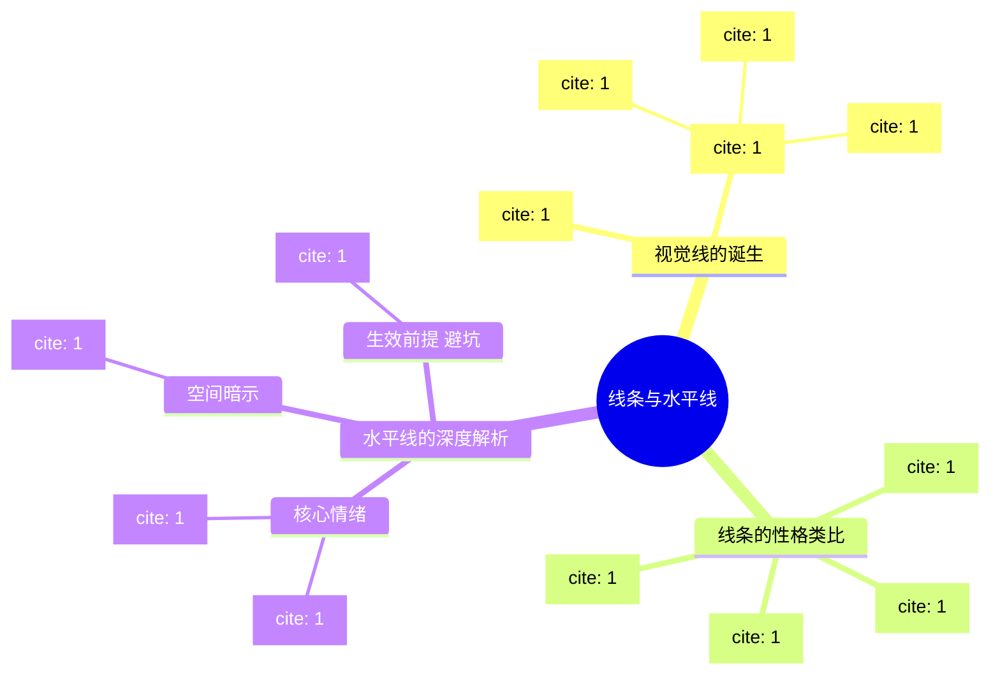
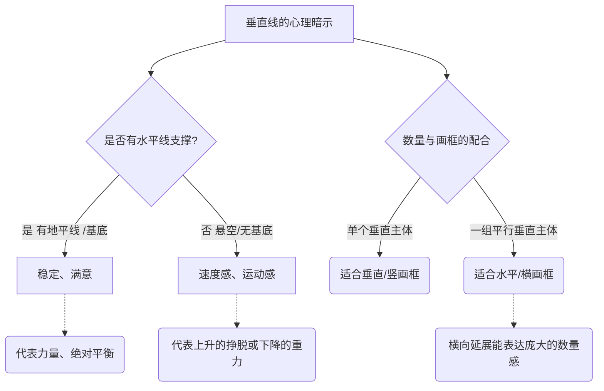
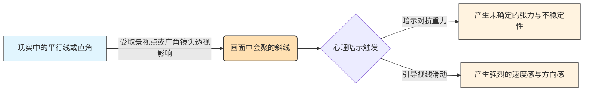
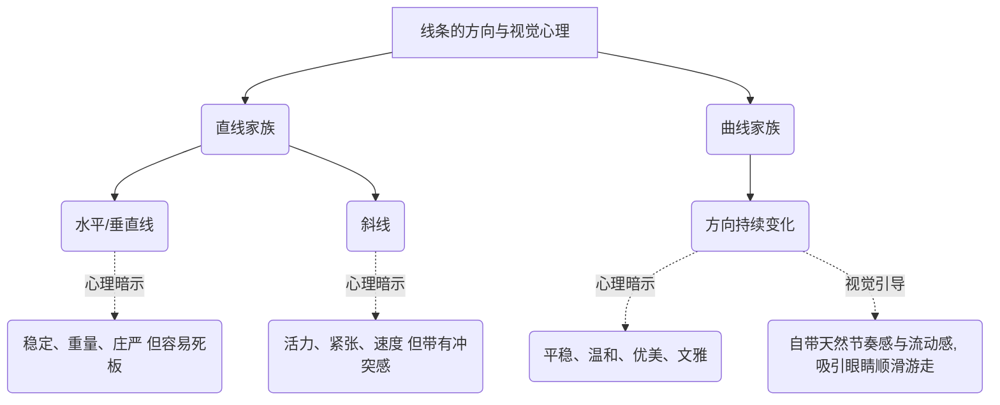
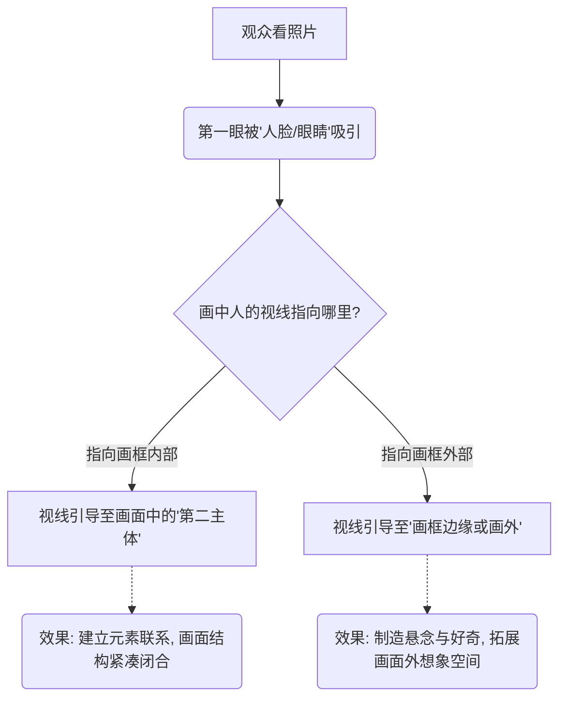
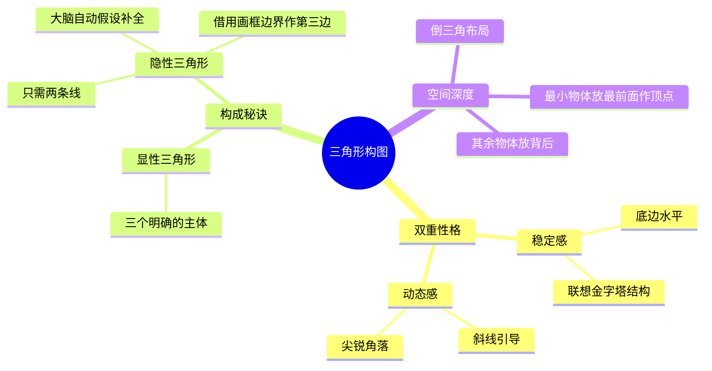
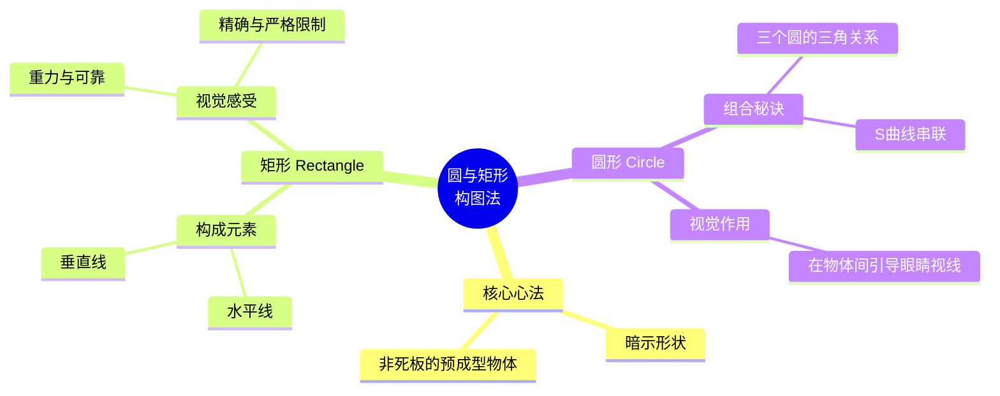

# 第3章 图形和摄影元素

### 第 3 章 图形和摄影元素 章节框架 (Mermaid 思维导图)

$1

“所有元素中最 简单的是点,常用 图 形和摄 影元素 来 吸引注意力。略高 一级的 是线,用 来指引方向、产生 矢量。更高的是形 状,扮 演着组 织影像 元素、引入结构 的 作用。” ([pdf](zotero://open-pdf/library/items/99BEV7U3?page=65&annotation=YBI25LT9)) |  

## 模块笔记：图形和摄影元素——单一点

![[image-396.png|791x612]] ![[image-397.png|1216x1223]]

**1. 核心概念定义：**

- **单一点**：画面中最基础的视觉元素。它在整个画面中只占极小的一部分，但由于与周围环境存在强烈的对比，成为了无法被忽视的绝对焦点。
- **通俗类比**：就像是漆黑夜空中的一颗启明星，或者是黑暗舞台上被唯一一束追光灯打中的孤零零的演员。虽然它非常渺小，但你的眼睛会被它牢牢吸住。
- **核心参数**：控制“点”的关键在于**对比**（明暗影调的对比、或色彩的对比）和干净的**平坦背景**。

**2. 底层逻辑与心理原理：**

- **视觉心理**：人的眼睛天生会在画面中寻找焦点。在一个相对平坦、干净的背景上，一个孤立的物体会自动抓住观众的视线。
- **位置与动感逻辑**：点放在哪里，决定了画面的心理暗示：
    - **放在正中央**：感觉绝对静止，但通常看久了会觉得枯燥乏味。
    - **稍微偏离中心**：带来适度的动感，视觉上最舒服且不走极端。
    - **靠近边缘**：打破平衡，显得相当不寻常，具有强烈的视觉张力。

代码段

**3. 场景与避坑指南：**

- **适用场景**：极简风光或建筑摄影。例如从远处拍摄水面中孤零零的小船，或者空旷天空中飞过的一只鸟儿。
- **避坑指南**：
    - **无意义的边缘放置**：把点放在极度偏离中心的角落会让人觉得奇怪，位置越异乎寻常，就越需要一个好的理由。例如，你可以为了平衡画面另一端的某个光斑，而把主体点放在相对的对角线边缘。
    - **背景太杂乱**：“点”能成立的前提是背景相对平坦。如果在拥挤杂乱的菜市场拍一个远处的人头，那不叫“单一点”，那叫“找不到焦点”。

**4. 视觉图库：**

- _(此处可粘贴一张图：深色水面上，一只白鹭被放置在画面的左上角。对角线的右下角有一些微小的太阳光斑，以此作为将白鹭放在极度偏离中心位置的“构图理由”。)_
- _(此处可粘贴一张图：一片茫茫白雪（平坦背景）中，中心微偏右的位置站着一个穿红衣服的人（色彩对比形成的单一点）。)_

**5. 刻意练习：**

- **本周计划**：找一片极度干净的背景（例如一面纯色的砖墙、一片平静的湖面或大草坪）。让你的朋友（或放一个颜色鲜艳的背包）作为画面中的“单一点”。
- **实操动作**：分别将这个“点”放在**正中央**、**三分线交点（微偏中心）**、以及**极其贴近画框边缘**的位置各拍一张。拍完后对比观察：哪张最死板？哪张最生动？感受边缘构图带来的那种“摇摇欲坠”的视觉张力。

## “多点” | 小结笔记

![[image-398.png|1282x1215]]

**1. 核心概念定义：** **多点构图**就是画面中存在两个或两个以上的视觉兴趣点。

- **通俗类比**：就像夜空中的星星。一颗星是孤立的；当出现两颗星时，你的眼睛会自然在它们之间“画”出一条线；当出现三颗星或更多时，你的大脑就会把它们连成一个“星座”（面）。
- **参数与要点**：点与点之间联系的强弱，取决于它们本身的大小，以及它们与背景的反差。

**2. 底层逻辑与心理暗示：**

- **视觉连线与方向感**：当画面有两个点时，观众的视线会不受控制地在两点之间来回跳跃，这就在画面中产生了一条“隐含的连接线”，它不仅带来了距离感，还产生了动态的方向感。
- **格式塔脑补效应**：当画面中有多个点时，观众会自动“脑补”它们之间的空间，感觉这些点共同圈出了一个隐形的区域或形状。

代码段

**3. 场景与避坑：**

- **适用场景**：拍摄群体活动（如广场上散开工作的人群），或静物摆拍（如散落的宝石、一盘珍珠、排列的样本碎片）。
- **避坑指南**：
    - **死板的几何排列**：在安排多个对象时，最忌讳极度刻意、死板的排列。如果摆放得太假、太人工化，反而会“侮辱了观众的智商”。
    - **学会借用“自然之力”**：摄影师 Frederick Sommer 曾提出，随手掷出几块鹅卵石所形成的自然散落状态，往往比我们苦思冥想摆出的几何形状更复杂、更有趣，因为“自然之力总是在不停地为我们工作着”。遇到必须整齐排列的物品（如方形样本），也可以刻意倾斜其中几个来打破沉闷。

**4. 视觉图库：**

- _(脑海画面 1：橙色珍珠)_ 在光滑的黑色鹅卵石背景上，几颗橙色珍珠被松散地摆放成一个“马蹄形”曲线，既有秩序又显得自然流动，留出了呼吸的空间。
- _(脑海画面 2：树脂样本)_ 一张原本整齐排列在网格里的树脂小方块图，但其中两三个方块被故意歪斜放置，瞬间激活了原本呆板的画面，让“多点”变得生动。

**5. 刻意练习本周计划：**

- **周末桌面挑战**：抓一把硬币或几颗糖果。第一张，像列队一样把它们整整齐齐摆成一个方阵拍下来；第二张，闭上眼睛把它们轻轻撒在桌面上，只微调几个重叠在一起的，再拍一张。
- **观察总结**：对比两张照片，感受你的视线在第二张照片中是如何被“自然的散落感”引导，并在脑海中自动将它们连成隐形多边形的。

## ：图形元素——线条与水平线

![[image-400.png|1190x1244]] ![[image-399.png|1331x741]]

**1. 核心概念定义：** 线条是构图中最基础的骨架，线条的图形质量比那些点要强得多。 **特征与成因：** 线条未必是一根实体的线（如绳子或栏杆）。对比在定义视觉线条时扮演了最重要的角色，光亮和阴影的对比、不同色彩区域之间的对比、不同纹理之间的对比、不同形状之间的对比等，都能在画面中“切”出一条线。

**2. 底层逻辑：** **心理暗示与类比：** 不同形态的线条自带不同的“性格”。比如水平线比斜线更为温和，之字线可能令人兴奋，粗壮的直线很大胆，细瘦的曲线很精致等。 特别地，**水平线**基本上表达了稳定、重量、平和、宁静。 _类比：_ 水平线就像是建筑的承重地基或一面无风的湖水，给人一种“塌不下来”的绝对安全感。同时，通过与地平线的关联，它们还能暗示远方和宽广。

**3. 场景与避坑：** **适用场景：** 想要传达辽阔感、极简主义或让观众情绪安静下来的画面（如大画幅的海景、空旷的草原）。 **避坑指南：** 不要迷信水平线的“宁静魔法”。要注意的是，这些表现力通常只在照片的内容没有实质信息时才会变得重要。 _类比解释：_ 如果你的画面是一只正在捕猎的猎豹（强烈的内容信息），哪怕背景有一条再平稳的地平线，观众也不会觉得宁静。只有在画面内容相对空灵时，水平线的性格才会凸显。

**4. 视觉图库：**

_(在此处粘贴一张仅靠光影明暗交界形成的水平线建筑摄影，体会对比产生线条的魅力)_

_(在此处粘贴一张内容极简、地平线居中的宁静海景图)_

**5. 刻意练习：** **本周计划：** 抛弃实体的“线”，去寻找大自然中的“对比线”。利用光亮与阴影的交界，或者两种不同颜色墙面的交界，拍出一条具有引导力的视觉线条。

## 模块笔记：图形和摄影元素——垂直线

**1. 核心概念定义：**

![[image-404.png|1087x1116]]

* **垂直线**：画框的第二基本元素，其方向代表了顺应重力或逃脱重力的影响。
* **通俗类比**：如果说水平线是让人安心躺下的“大地”，那么垂直线就是拔地而起“站立的人”或“生长的树”。它天生带有一种向上生长或向下坠落的势能。
* **核心参数**：控制垂直线的关键在于**精确对齐**以及**与画框（横/竖）的配合**。

**2. 底层逻辑与心理原理：**

* **物理与心理暗示**：
* **孤立的垂直线（无水平基底）**：通常更多地含有速度和运动的感觉，无论向上还是向下。
* **互补的垂直线（有水平面支撑）**：垂直线和水平线在一起的时候是互补的，它们构成了一个均势，感觉上能量相互垂直，一个终止了另一个。它们也能构造一个基本的平衡感觉，产生一种稳定、满意的感觉。
* **成组的垂直线（形成栅栏）**：几个垂直物可以联合成为一个栅栏，就像几个柱子、一排面对相机的人。某种程度上，它们能表达力量和势力。

**3. 场景与避坑指南：**

* **适用场景**：
* **拍单人肖像或参天大树**：单个垂直形状的东西安排在垂直画框里比水平画框更自然。
* **拍排比的建筑柱子或人群**：一组垂直的东西就需要一个水平的结果，水平的画框实际上让这一组能包括更多，这在需要表达数量时就很重要了。
* **空间压缩（远摄）**：通过其透视缩短效果，一个超远摄镜头将一个逐渐缩小的远景转换成了一个垂直设计。
* **避坑指南**：
* **极其微小的倾斜**：从实践层面来说，和水平线一样的精确对齐非常重要。眼睛会立即将照片里的水平线、垂直线与画框边界比较，即使是最轻微的不对齐也会马上被注意到，让人觉得是拍摄失误。

**4. 视觉图库：**

* *(此处可粘贴一张图：使用竖构图（垂直画框）拍摄的一棵高耸入云的参天大树，树干笔直，与画框左右边缘完美平行，展现单一垂直物体的自然感。)*
* *(此处可粘贴一张图：使用横构图（水平画框）拍摄的缅甸单脚划船的渔民并排劳作的远摄照片，平行的垂直人物在横向画框中延展，表现出强烈的数量感和力量感。)*

**5. 刻意练习：**

* **本周计划**：去附近有规则柱子的长廊或树林。
* **实操动作**：
1. **对齐练习**：寻找一根独立的柱子，用取景器边缘作为标尺，练习屏住呼吸，拍出绝对垂直、没有任何倾斜倾倒感的照片。
2. **横竖框对比**：面对一整排树木或并排站立的人，分别用“竖构图”和“横构图”各拍一张。观察为什么横构图更能装下“一组垂直线”并传递出规模感与力量感。

## “斜线” | 小结笔记

 ![[image-403.png|1139x1111]]

**1. 核心概念定义：** **斜线构图**就是利用画面中倾斜的线条来构建视觉骨架，它是所有线条中最能给画面带来活力和动感的元素。

- **通俗类比**：如果水平线是“躺平休息”，垂直线是“立正站好”，那斜线就是“正在百米冲刺”或者“即将摔倒”。它自带一种不稳定的能量。
![[image-402.png|1162x1200]]
- **参数与要点**：斜线不需要像水平/垂直线那样严丝合缝地与画框对齐，它拥有极高的自由度。单条斜线就能产生方向感；当画面中出现两条或多条不同角度相交的斜线（相交角度最大达到 45 度时），画面的活力和视觉张力将达到顶峰。

**2. 底层逻辑与心理暗示：**

- **底层逻辑（光学透视）**：其实在人类建造的环境中，纯粹的斜线并不多，大多数斜线是“透视变形”带来的光学错觉。比如一条笔直的公路或一堵墙，当你用广角镜头靠近拍摄时，原本平行的直线在透视的压缩下会向远方汇聚，在画面里就变成了极具冲击力的斜线。
![[image-401.png|1275x730]]
- **心理暗示**：人类天生对重力非常敏感。斜线给人一种介于水平和垂直之间的“未确定的张力”，暗示着正在跌落或失去平衡的不稳定状态。这种不稳定性迫使观众的视线顺着斜线迅速滑动，从而在静止的照片中脑补出强烈的**速度感**和**运动感**。

代码段

**3. 场景与避坑：**

- **适用场景**：
    - **广角怼脸拍建筑（制造纵深）**：贴近墙根或长长的走廊，利用广角镜头把原本的平行线拉扯成向远方消失的强烈斜线，打造深邃的空间感。
    - **运动抓拍（物理加速）**：找一条现成的斜线（如桥上的栏杆），然后抓拍顺着这条斜线方向运动的行人或车辆，画面元素的运动会与斜线方向叠加，让速度感倍增。
    - **长焦俯拍（折返跳跃）**：站在高处用长焦镜头压缩一排错落的屋顶或帐篷，把它们变成“之”字形的折返斜线。这样视线就会像弹球一样在画面里来回碰撞，充满内在律动。
- **避坑指南**：斜线本身是一把“双刃剑”。虽然它能带来活力，但如果滥用（比如故意倾斜相机盲目制造斜线），会让画面失去平衡感，显得轻浮甚至让人头晕。在使用斜线时，最好结合画面的内容（如本身就在运动的物体或强烈的透视场景）顺势而为。

**4. 视觉图库：**

- _(脑海画面 1：广角下的罗马长城)_ 站在哈德良长城脚下仰拍，广角镜头将原本平行的城墙边缘扭曲成了向画面深处消失的强力对角线，让一段普通的墙壁看起来像险峻的悬崖绝壁。
- _(脑海画面 2：自带加速度的伦敦桥)_ 俯拍伦敦大桥，桥边缘的线条在画面中呈巨大的对角线。顺着斜线往下走的密集人群，与逆向上行的红色双层巴士形成反差，整个静态画面充满了呼之欲出的“倾斜”与运动感。
- _(脑海画面 3：之字形冲洗帐篷)_ 用长焦镜头从高处拍摄一排排橙红色的帐篷。原本平行的屋顶在长焦的压缩下，变成了一道道相交的“之”字形斜线，视线顺着线条反复折返，不仅有动感还极具几何趣味。

**5. 刻意练习本周计划：**

- **周末扫街挑战**：找一个带有栏杆的过街天桥或地铁站长扶梯。
- **拍摄动作**：
    - 第一张，站在正对面，将栏杆拍成水平线，等个人走过拍一张。
    - 第二张，换个机位，贴近栏杆的一端并开启手机的广角（0.5 x）模式，让栏杆在你的取景框里变成一条贯穿画面的巨大对角线。等一个人顺着栏杆往下走的瞬间，按下快门。
- **观察总结**：对比两张照片，感受第二张中的“斜线透视”是如何像滑滑梯一样，加速了人物的运动感并拉深了画面的空间距离的。

## 曲线

**1. 核心概念定义：**

![[image-405.png|1093x711]]

- **曲线**：曲线的独特之处，在于它包含了方向的持续变化。一条曲线，实际上可以看作是一系列持续变化角度的极短直线拼接而成的。
- **通俗类比**：如果水平线和垂直线是直来直去的“硬汉”，斜线是横冲直撞的“莽汉”，那曲线就是打太极的“高手”。它圆滑地避开了与画框横竖边缘的正面硬碰硬，在画面中自如游走。
- **物理参数/手段**：在摄影中，如果想用光学手段强行“凭空捏造”出实体曲线，唯一的办法就是使用**鱼眼镜头**（但这会把画面里所有的直线都无差别变弯）。

**2. 底层逻辑与心理原理：**

![[image-406.png|1190x1245]]

- **视觉心理**：由于方向在不断微调，曲线与直线在画面里会相互影响。斜线带给人的是一种特别的性格——活力和紧张的动感，而曲线的性格则是**平稳、温和、优美、文雅和流动**的。
- **引导与运动逻辑**：人类天生对曲线有亲近感。曲线具有直线所缺乏的天然“节奏感”，顺着曲线移动，眼睛会感到非常顺滑，甚至能体会到长曝光带来的“加速度”。

代码段

**3. 场景与避坑指南：**

- **适用场景**：
    - **表现运动与时间**：用慢门/长曝光拍摄夜晚车流的尾灯，把光变成一条加速流动的 S 型发光曲线。
    - **“暗示”出的曲线**：在自然界中直接找到完美的实体曲线很难，但我们可以通过“点、短线或边缘的排列”来暗示出一条曲线。大脑会自动把这些散落的元素连成完美的弧度。
- **避坑指南**：
    - **滥用鱼眼**：鱼眼镜头虽然能造出曲线，但会破坏画面中所有正常的透视。非特殊创作意图，不要仅仅为了“想要曲线”而去用鱼眼镜头。
    - **死磕“实体线”**：不要钻牛角尖非要找一条实实在在的绳子或道路。学会在杂乱的场景中，利用散落物体的“走势”来构建隐形曲线。

**4. 视觉图库：**

- _(此处可粘贴一张图：天空中一群错落有致飞翔的塘鹅。它们彼此之间没有线相连，但通过这种巧妙的“点的安排”，在画面中暗示出了一条充满动感与优美节奏的隐形曲线。)_
- _(此处可粘贴一张图：夜晚的盘山公路，利用长时间曝光，汽车尾灯化作了一条红色平滑的 S 型曲线，不仅展示了方向的持续变化，更带有一种顺滑的加速度感。)_

**5. 刻意练习：**

- **本周计划**：去公园或湖边，练习“无中生有”的**暗示曲线法**。
- **实操动作**：不拍道路、桥梁等实体曲线。寻找一群散落在广场上的鸽子、草地上的几块石头、或者湖面上的几只野鸭。通过移动你的脚步和镜头视角，在取景器里把这些孤立的“点”，排列成一条带有优美弧度的“隐含曲线”。拍完后观察：大脑是不是自动把它们连起来了？

## 2视线 (Lines of Sight)

**1. 核心概念定义：**

![[image-407.png|1042x695]]

- **视线**：这是我们在设计照片时能用到的、最有价值的“暗示线”之一。它是一条看不见的线，存在于画面中人物（或动物）的眼睛与他们所看的事物之间。
![[image-408.png|1190x1318]]
- **通俗类比**：你可以把画面中人物的眼睛想象成两把“隐形的激光笔”。虽然照片上画不出红色的激光束，但作为观众，我们的目光会被这股无形的光束自动牵引，顺着它指引的方向看过去。

**2. 底层逻辑与心理原理：**

- **生物本能与好奇心**：当照片里的人正在看着什么东西时，我们的眼睛会很自然地跟着望向这个方向。其底层逻辑非常简单：这是人类简单、正常的好奇心，促使我们去探究别人的眼睛究竟正在看什么。
- **视觉引导与动态**：在静态的照片中，“视线”自带强烈的方向感和动态张力。它就像一个隐形的箭头，强制规划了观众浏览照片的路线。

代码段

**3. 场景与避坑指南：**

- **适用场景**：
    - **突出次要主体**：当你想突出画面边缘的一个小物件时，安排一个人死死盯着它看。观众的视线会瞬间从人脸“弹射”到那个小物件上。
    - **制造悬念感（留白）**：让人看向画框外（比如望向窗外），能引发观众无限的遐想：“他到底在看什么？”从而增加照片的故事感。
- **避坑指南**：
    - **面壁思过式的构图（视线受阻）**：通常情况下，人物视线前方需要留出足够的空间（称为“视线空间”或“呼吸空间”）。如果人物看着右边，你却把他紧紧贴在画面的右边缘，会让人感觉视觉受阻、压抑、像在“面壁”（除非你刻意想表达压抑、紧张的情绪）。

**4. 视觉图库：**

- _(此处可粘贴一张图：画面左侧是一位母亲，她的视线温柔地看向画面右下角正在玩耍的孩子。这条隐形的视线将两个人物完美连接，构成了温馨的互动感。)_
- _(此处可粘贴一张图：在一个拥挤的街头，画面中所有人都在低头走路，唯独有一个人抬起头，惊恐地盯着画框正上方的天空（画面外）。作为观众，你会极度好奇天空中到底出现了什么。)_

**5. 刻意练习：**

- **本周计划**：与朋友在咖啡馆或公园小聚，练习“隐形引导线”。
- **实操动作**：

    1. **引导连接**：让朋友盯着桌子角落的一杯咖啡看，拍一张。观察照片，体会你的目光是如何从朋友的脸自动滑向那杯咖啡的。
    2. **空间对比（留白与面壁）**：让朋友看向画面左侧。拍两张对比图：第一张，把朋友放在画面右侧（视线前方留大片空白）；第二张，把朋友放在画面左侧（鼻子几乎贴着左边画框）。对比两张照片，感受“视线空间”对画面心理舒适度的巨大影响。

## 三角形

### 模块 1. 核心概念定义

![[image-409.png|1807x1088]]

- **概念**：三角形构图是指利用画面中的三个视觉点或线条，引导观众视线形成一个三角形的结构。
- **双重特性**：三角形在摄影中是一个非常神奇的形状，它同时具有“动态”和“稳定”两种截然不同的特性。
    - **动态感**：因为三角形天生带有斜线和角落，能让画面充满活力和方向感。
    - **稳定感**：如果三角形的某一条边线是水平的（比如底边平稳），画面就会显得非常稳固。

### 模块 2. 底层逻辑与光学原理

![[image-410.png|1910x1264]]

- **心理暗示（稳定）**：很多时候，三角形给人带来的内在稳定感，其实是来自于我们大脑对其“结构上的联想”。
    - _💡 深入浅出（类比）_：这就好比我们看到金字塔或者搭好的帐篷，只要底盘是平的，大脑就会自动联想到“稳如泰山”。
- **视觉补全（隐形边）**：在实际拍摄中，构建三角形常常只需要两条边线就足够了。第三条边可以是观众大脑自己“假设”（脑补）出来的，或者你可以直接借用相机的“画框边界”来充当这第三条边。
    - _💡 深入浅出（类比）_：就像画画时的“留白”，你画了一个“V”字，哪怕没封口，观众也会自动把它看成一个三角形。相机的取景框就是天然的物理边框，帮你省去了找第三条线的麻烦。

代码段

### 模块 3. 场景与避坑指南

- **适用场景 1：多人合影或建筑（求稳）**：当你想表现庄重、踏实的感觉时，尽量让三个主体形成底边水平的正三角形。
- **适用场景 2：制造画面纵深感（求立体）**：你可以把最小的物体放在最接近相机的地方，把它作为三角形的顶点位置，然后把其余的物体安排在它的背后。
    - _💡 深入浅出（类比）_：这就像电影里的“前实后虚”，前面一个小茶杯（顶点），背后远处坐着两个人（底边），画面瞬间从 2D变成了 3D。
- **避坑指南**：不要死板地在画面里硬凑三个物体来画“等边三角形”，这会让画面显得刻意做作。记住，只需要找到两条关联的线，利用好相机的边缘作为第三条边，构图会自然得多。

### 模块 4. 视觉图库

- 🖼️ **图库建议 1（静谧稳定）**：一张正面的建筑照（如金字塔）或三人全家福，底边呈完全水平状，体现由结构联想带来的内在稳定感。
- 🖼️ **图库建议 2（纵深与动态）**：一张视角独特的静物照，最靠近镜头的地方放了一颗最小的樱桃（作为最近的顶点），背后稍远处放着两块稍大的蛋糕（形成底边），构成一个有深度的倒三角形。
- 🖼️ **图库建议 3（借用画框）**：一张只拍到了两条交叉斜线（比如两条交汇的公路）的风景照，公路的尽头向画面外延伸，巧妙利用照片的底边构成了第三条线，形成一个隐形的三角形。

### 模块 5. 刻意练习

- **本周计划**：

    1. **“借边”练习**：找一个只有两条相交斜线的场景（比如墙角、路口），尝试不拍出第三个点，而是利用相机的上下左右边缘作为“第三条边”进行构图。
    2. **“纵深顶点”练习**：在餐桌前，故意把最小的一把勺子放在离镜头最近的地方充当三角形顶点，把盘子和杯子推到背后，观察这种布局带来的立体纵深感。
- 1. 三角关系”。
$1
    2. 通过一条隐藏的、弯曲的“S 曲线”来“引导眼睛”的视线，在它们之间流畅穿梭。

代码段

### 模块 3. 场景与避坑指南

- **适用场景 1：拍建筑或工业品（用矩形求稳）**。当你想表达严谨、秩序和力量感时，刻意寻找并对齐画面中的水平线和垂直线，利用矩形的限制感来传递“精确与可靠”。
- **适用场景 2：拍静物或多人物（用圆形引导）**。面对桌面上散落的多个菜盘或一群人，利用它们形成“三个圆”，并通过光影或道具摆出一条“S曲线”，能立刻让呆板的画面流动起来。
- **避坑指南**：新手最容易犯的错就是寻找太刻意的形状（预成型物体）。比如为了拍圆，非要把一个呼啦圈放在画面正中间。记住，最高级的构图是“暗示”，让观众的眼睛自己去发现。

### 模块 4. 视觉图库

- 🖼️ **图库建议 1（矩形的精确）**：一张正面的大门或书架特写，画面被严格的“水平线和垂直线”切割成数个小矩形，没有多余的斜线，传递出极度“严格、可靠”的庄严感。
- 🖼️ **图库建议 2（三圆与S曲线）**：一张精美的珍珠摆拍（或咖啡馆的三个茶杯），“三个圆”大小不一，构成稳定的“三角关系”；同时，桌面上的丝巾褶皱形成了一条“弯曲的S曲线”，刚好穿过这三个圆，引导眼睛的视线流畅移动。

### 模块 5. 刻意练习

- **本周计划**：
$1
    1. **“寻找压迫感”练习**：找一面有窗户的砖墙，强迫自己只用“水平线和垂直线”取景，体会矩形构图带来的“重力与严格的限制”感。
    2. **“餐桌连线”练习**：吃饭时，把三个盘子/碗摆成不规则的“三角关系”，然后用一根筷子或桌布的边缘在它们旁边暗示出一条“S 曲线”，观察你的视线是不是会自动在“三个圆”之间游走。

- 1. 三角关系”。
$1
    2. 通过一条隐藏的、弯曲的“S 曲线”来“引导眼睛”的视线，在它们之间流畅穿梭。

代码段

### 模块 3. 场景与避坑指南

- **适用场景 1：拍建筑或工业品（用矩形求稳）**。当你想表达严谨、秩序和力量感时，刻意寻找并对齐画面中的水平线和垂直线，利用矩形的限制感来传递“精确与可靠”。
- **适用场景 2：拍静物或多人物（用圆形引导）**。面对桌面上散落的多个菜盘或一群人，利用它们形成“三个圆”，并通过光影或道具摆出一条“S曲线”，能立刻让呆板的画面流动起来。
- **避坑指南**：新手最容易犯的错就是寻找太刻意的形状（预成型物体）。比如为了拍圆，非要把一个呼啦圈放在画面正中间。记住，最高级的构图是“暗示”，让观众的眼睛自己去发现。

### 模块 4. 视觉图库

- 🖼️ **图库建议 1（矩形的精确）**：一张正面的大门或书架特写，画面被严格的“水平线和垂直线”切割成数个小矩形，没有多余的斜线，传递出极度“严格、可靠”的庄严感。
- 🖼️ **图库建议 2（三圆与S曲线）**：一张精美的珍珠摆拍（或咖啡馆的三个茶杯），“三个圆”大小不一，构成稳定的“三角关系”；同时，桌面上的丝巾褶皱形成了一条“弯曲的S曲线”，刚好穿过这三个圆，引导眼睛的视线流畅移动。

### 模块 5. 刻意练习

- **本周计划**：
$1
    1. **“寻找压迫感”练习**：找一面有窗户的砖墙，强迫自己只用“水平线和垂直线”取景，体会矩形构图带来的“重力与严格的限制”感。
    2. **“餐桌连线”练习**：吃饭时，把三个盘子/碗摆成不规则的“三角关系”，然后用一根筷子或桌布的边缘在它们旁边暗示出一条“S 曲线”，观察你的视线是不是会自动在“三个圆”之间游走。

# 圆与矩形构图法

### 模块 1. 核心概念定义

- **概念**：构图中的“圆与矩形”，最高级的用法是去“暗示一个形状而不是作为一个预成型的物体”。
    - _💡 深入浅出（类比）_：这就像是“连线游戏”。不要死板地在画面里直接拍一个完整的铁丝圆环或一个木头方框（预成型物体），而是利用画面里散落的元素（如几个人的头、几个杯子），让观众的大脑自动把它们连起来，脑补出（暗示）一个圆形或矩形。

### 模块 2. 底层逻辑与心理暗示

- **矩形的逻辑（理性与规矩）**：矩形是由两种最基础的线条构成的——“水平线和垂直线”。
    - **心理暗示**：正因为横平竖直，矩形天生与“重力、可靠、精确和严格的限制相关联”。
    - _💡 深入浅出（类比）_：看到横平竖直的矩形，就像看到一栋四平八稳的钢筋水泥大楼，给人一种不可撼动、规规矩矩、甚至有点严肃压抑的感觉。
- **圆形的逻辑（流动与引导）**：当画面中出现多个圆（比如三个圆）时，它们“以两种方式联在一起”：
$1
    1. 位置上形成“三角关系”。
    2. 通过一条隐藏的、弯曲的“S 曲线”来“引导眼睛”的视线，在它们之间流畅穿梭。

代码段

### 模块 3. 场景与避坑指南

- **适用场景 1：拍建筑或工业品（用矩形求稳）**。当你想表达严谨、秩序和力量感时，刻意寻找并对齐画面中的水平线和垂直线，利用矩形的限制感来传递“精确与可靠”。
- **适用场景 2：拍静物或多人物（用圆形引导）**。面对桌面上散落的多个菜盘或一群人，利用它们形成“三个圆”，并通过光影或道具摆出一条“S 曲线”，能立刻让呆板的画面流动起来。
- **避坑指南**：新手最容易犯的错就是寻找太刻意的形状（预成型物体）。比如为了拍圆，非要把一个呼啦圈放在画面正中间。记住，最高级的构图是“暗示”，让观众的眼睛自己去发现。

### 模块 4. 视觉图库

- 🖼️ **图库建议 1（矩形的精确）**：一张正面的大门或书架特写，画面被严格的“水平线和垂直线”切割成数个小矩形，没有多余的斜线，传递出极度“严格、可靠”的庄严感。
- 🖼️ **图库建议 2（三圆与 S 曲线）**：一张精美的珍珠摆拍（或咖啡馆的三个茶杯），“三个圆”大小不一，构成稳定的“三角关系”；同时，桌面上的丝巾褶皱形成了一条“弯曲的 S 曲线”，刚好穿过这三个圆，引导眼睛的视线流畅移动。

### 模块 5. 刻意练习

- **本周计划**：
$1
    1. **“寻找压迫感”练习**：找一面有窗户的砖墙，强迫自己只用“水平线和垂直线”取景，体会矩形构图带来的“重力与严格的限制”感。
    2. **“餐桌连线”练习**：吃饭时，把三个盘子/碗摆成不规则的“三角关系”，然后用一根筷子或桌布的边缘在它们旁边暗示出一条“S 曲线”，观察你的视线是不是会自动在“三个圆”之间游走。
