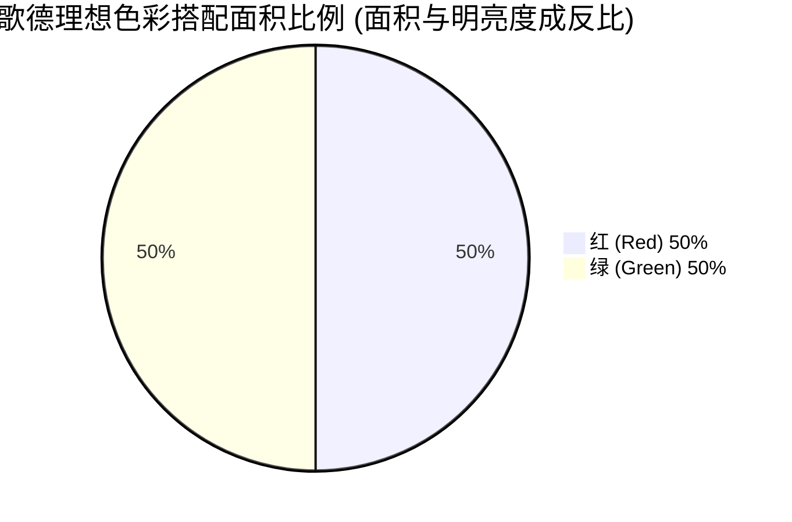
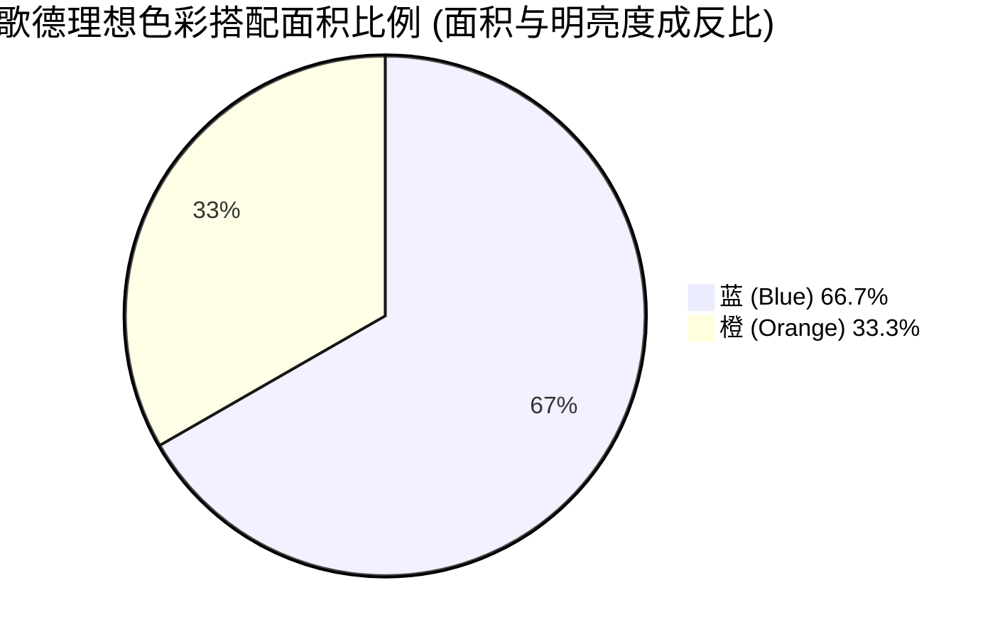
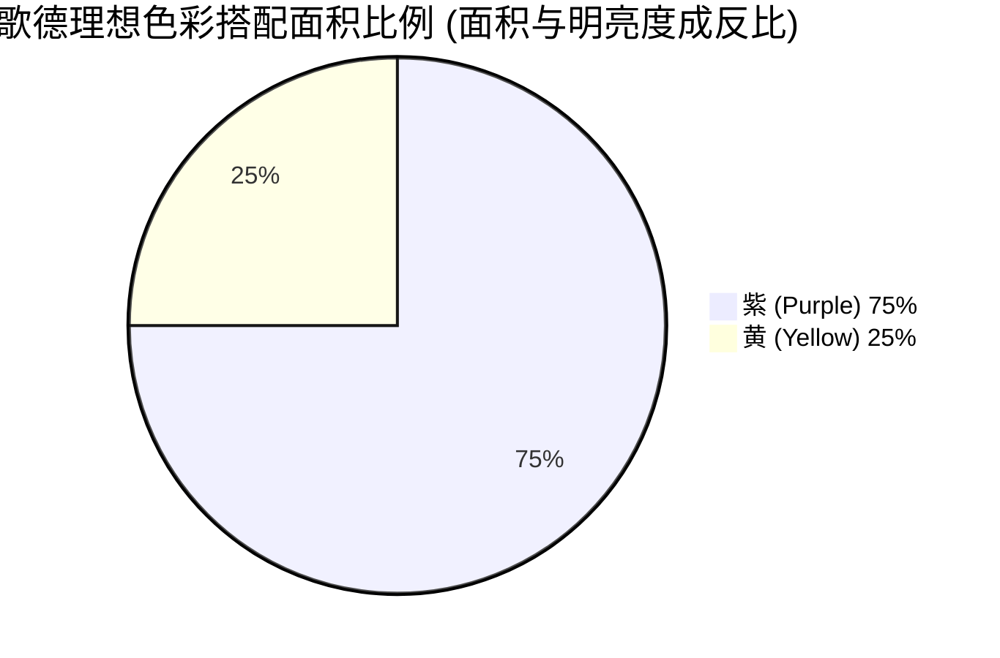
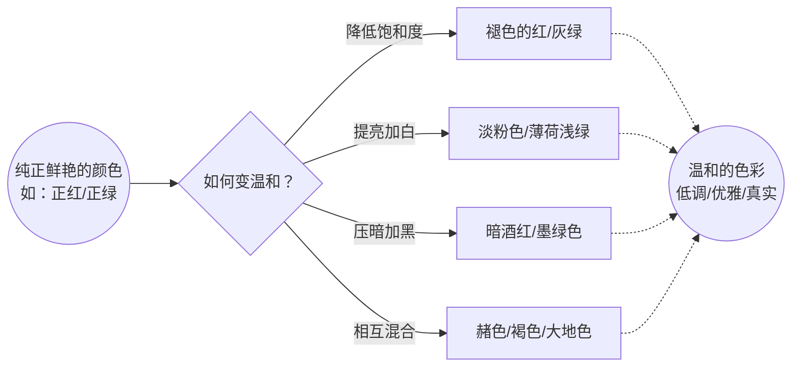

# 第4章 用光线与色彩构图

## 前言

“影构图的 另一个 要素是 影调和 」双色彩的 分布” ([pdf](zotero://open-pdf/library/items/99BEV7U3?page=109&annotation=5SXTVBTX)) |  

“线条与 形状的效果也与它们有 多明显直接相 关,而这最终也反映为影调和/或色彩 的关系。” ([pdf](zotero://open-pdf/library/items/99BEV7U3?page=109&annotation=DN3FPA4Y)) |  

“比 如直方 图、曲线调整、黑场、白 场等。用色 阶、曲线和色相 -饱和度-亮度滑块 来 调整影 像能很 明显地 揭示影 调和色 彩之间的紧密关系。” ([pdf](zotero://open-pdf/library/items/99BEV7U3?page=109&annotation=W8UACQGH)) |  

“,黑白摄 影继续保持旺 盛的 生命力 与健康发展,并未屈服于 彩色 摄影。” ([pdf](zotero://open-pdf/library/items/99BEV7U3?page=109&annotation=NL5NVHV8)) |  

> 🔤黑白摄影继续保持旺盛的生命力与健康发展，并未屈服于彩色摄影。🔤

## 模块一：明暗与基调（给照片定情绪）

![[image-426.png|1049x510]]

**1. 核心概念定义：**

*   **明暗与基调**：在绘画和摄影等视觉艺术中，明暗指的是画面的光影对比关系，基调指的是整体的明暗趋势[cite: 1]。它被定义为“最具有表现力、最重要的构图手段之一”[cite: 1]。它不仅控制了影像造型的强度（立体感），也决定了影像的结构和受关注的部分[cite: 1]。
*   **参数（双坐标轴定位法）**：如果我们暂时忽略色彩，影调的变化主要由两个坐标轴决定——**对比（反差）**和**亮度**[cite: 1]。

**2. 底层逻辑光学原理：**

*   **影像风格的铁三角**：影像的风格选择基于三个方面：场景的特征（如暗色的草木、浅色的皮肤、明亮的天空等）、照明方式以及后期的诠释[cite: 1]。
*   **心理暗示（情绪开关）**：第二个坐标也就是“整体的亮度”，在很大程度上决定了影像的情绪[cite: 1]。
    *   *类比*：低调（整体偏暗）就像电影里的悬疑片滤镜，充满戏剧性、深沉或压抑；高调（整体偏亮）就像青春偶像剧，感觉敞亮、通透。
![[image-427.png|1111x1111]]
**3. 场景与避坑指南：**
*   **适用场景（光影做减法）**：利用高反差（极亮与极暗并存）来隐藏杂乱的背景。让主体处于亮部，背景没入黑暗，视线自然就会被亮部死死抓住。
*   **避坑指南（彩色高调的雷区）**：基调的一个有趣特性是，其在黑与白以及色彩之间的表现是截然不同的[cite: 1]。在黑白摄影中，高调（大面积偏白）显得明亮生动；但在彩色摄影中如果强行拍高调，很容易被观众误认为是“洗白”或者严重的“曝光失误”[cite: 1]。

**4. 视觉图库：**

```mermaid
graph TD
    A[影调分布双坐标轴] --> B(坐标轴1: 对比/反差)
    A --> C(坐标轴2: 整体亮度/基调)
    
    B --> B1[高对比: 视觉冲击强, 立体感极高]
    B --> B2[低对比: 柔和, 适合表达雾气或平淡情绪]
    
    C --> C1[高调 High Key]
    C1 --> C1a[黑白中: 轻快, 明亮, 梦幻]
    C1 --> C1b[色彩中: 避坑! 易显得惨白或曝光过度]
    
    C --> C2[低调 Low Key]
    C2 --> C2a[效果: 压抑, 沉重, 充满故事性与悬疑感]
````

_(脑海图库示例：一张是低调的肖像照，背景全黑，只有一束光打在老人布满皱纹的半张脸上，情绪极强；另一张是黑白高调的风光照，白茫茫的雪地和浅灰色的天空融为一体，只有极浅的树枝线条，意境空灵。)_

**5. 刻意练习本周计划：**

- 晚上在全黑的房间里，只打开一盏台灯或用手机手电筒。让家人或朋友站在灯光侧面，利用这种极端的“高反差+低调”拍一张半张脸隐没在黑暗中的情绪肖像。

## 模块二：构图中的色彩（色彩的心理学魔法）

**1. 核心概念定义：**

![[image-428.png|1049x657]]

- **色彩三要素**：色相（颜色的名字，如红、黄、蓝）、饱和度（颜色的浓淡/纯度）、明亮度（颜色的明暗）。
- **原色差异**：画家的原色（反射光）是红、黄、蓝；而相机和屏幕的原色（透射光）是红、绿、蓝（RGB）。

**2. 底层逻辑光学原理：**

- **色彩的物理进退感**：不同的色彩自带“3D位移属性”。暖色调在视觉上会“前进、凸出”，而冷色调在视觉上会“后退、收缩”。
- **心理暗示（色彩的情感共鸣）**：
![[image-429.png|1095x1059]] ![[image-432.png]]
    - **红色**：充满活力、热血沸腾，具有侵略性和危险感，暗示激情或炎热。
    - **黄色**：所有颜色中最明亮的，显得精力充沛、锐利甚至好斗，自带发光感。
    - **蓝色**：退后、安静、冷酷。因为是大自然中天空和水的颜色，常暗示空虚或冷静旁观。
    - **绿色**：自然界最主要的颜色，暗示生长、希望（但负面关联是疾病或腐烂）。
    - **紫色**：难以捉摸、稀有，暗示富有、奢侈和神秘。
![[image-432.png|1075x1038]]
**3. 场景与避坑指南：**

- **适用场景（利用进退感拉开层次）**：当你觉得照片太平面的时，把暖色（如穿红衣服的人）放在冷色（如蓝色的大海或绿色的森林）背景前。红色会在视觉上往前跳，冷色会往后退，照片瞬间产生强烈的立体纵深感。
- **避坑指南（色彩大杂烩）**：不要在一张照片里塞满多种高饱和度、高亮度的不同色彩。这会让画面极度混乱，导致观众不知道该把视线停留在哪里。

**4. 视觉图库：**

代码段

```mermaid
mindmap
  root((色彩心理暗示))
    暖色调 / 前进色
      红色
        激情 / 危险 / 炎热
      黄色
        极亮 / 锐利 / 能量
      橙色
        温暖 / 节庆 / 辉煌
    冷色调 / 后退色
      蓝色
        安静 / 空虚 / 天空与水
      绿色
        生长 / 希望 / 自然本色
    特殊色
      紫色
        稀有 / 奢侈 / 神秘
```

_(脑海图库示例：一张是在幽暗冰蓝色的冰川（冷色后退背景）前，站着一个穿着鲜艳亮红色冲锋衣的探险者（暖色前进主体），强烈的色彩对比让人物极度凸显。)_

**5. 刻意练习本周计划：**

- 周末出门，寻找“红与绿”或“黄与蓝”的经典色彩对比场景。比如在郁郁葱葱的绿色树林里，拍一朵单独的红花；或者在湛蓝的天空下，拍一块黄色的指路牌。体会暖色是如何从冷色背景中“跳”出来的。

## 摄影笔记：色彩关系与色彩比例

**1. 核心概念定义**

- **色彩关系：** 简单来说就是色彩的“朋友圈”效应，视觉相邻色彩不同，它们的感受也不同。比如，靠近蓝色的红色看起来与靠近绿色的红色有着完全不一样的“性格”。
- **参数：** 决定画面色彩和谐的核心参数是 **色相的亮度值** 与 **色彩所占的面积比例**。

**2. 底层逻辑（光学原理与心理效应）**

![[image-434.png|1086x1083]]

- **相似色不打架（光学原理）：** 相邻的色彩很容易共处，因为它们之间没有冲突。比如从黄到红的“暖”色彩有很明显的相似性，从蓝到绿或者一组绿色的“冷”色彩也同样，把它们放一起视觉上会非常顺滑。
- **歌德的跷跷板法则（反比原理）：** 不同的色相被人们感受到的亮度值是不同的，其中黄色最亮，紫色最暗。根据传统色彩理论，**当色彩的面积与其相对明亮度成反比时，色彩间的和谐最为完美**。
    - _类比理解：_ 想象色彩搭配是在玩跷跷板。黄色因为天生“亮度极高”（像个重量级大胖子），而紫色“亮度极暗”（像个小瘦子）。为了让跷跷板平衡，大胖子（黄色）只能坐一小点面积，小瘦子（紫色）必须坐一大片面积。所以，黄色和紫色位于亮度标尺的两端，理想的组合比例是 1 : 3。同理，橙色的亮度是蓝色的两倍，所以他们的理想组合是 1 : 2；红色和绿色的亮度相同，所以按 1 : 1 组合。
- **心理暗示：** 相似色能带给观众安静、不突兀的舒适感。按比例搭配的互补色则能在强烈的对比中创造出不可思议的“完美和谐与稳定”。

**3. 场景与避坑**

![[image-433.png|1152x1039]]

- **适用场景：**
    - **大自然与治愈系风光（用相似色）：** 拍摄森林、大海或朝霞时，多利用画面中自然的“蓝-绿”或“黄-橙-红”渐变，传达无冲突的宁静感。
    - **高级感静物/人像构图（用歌德比例）：** 想要画面有强烈的戏剧感且不俗气，严格控制互补色的出场面积。比如大面积的深蓝色幽暗背景前，安排一个占据约三分之一画面的橙色灯光或穿着橙色衣服的主体（1:2 比例）。
- **避坑指南：**
    - **切忌“五五开”的瞎撞色：** 当遇到黄色和紫色的互补色场景时，千万不要让黄色和紫色在画面中各占一半（1:1）。因为黄色太亮，极具膨胀感，同等面积下会彻底“亮瞎”观众的眼睛，让画面极度失衡、显得烦躁刺眼。

**4. 视觉图库**

这里用直观的图表为您展示“歌德色彩理想面积比例”法则：

代码段



代码段



代码段



_(视觉联想：你可以想象一张由 75%的神秘深紫色夜空背景，搭配一轮占据 25%画面的明亮金黄满月所构成的照片，这种 1:3 的明暗比例带来了极致的视觉和谐)_

**5. 刻意练习**

- **本周计划：** 准备几张不同颜色的手工卡纸（蓝、紫、绿），以及几个常见水果（橙子、柠檬、红苹果）。

    1. **拍一组“无冲突”：** 将柠檬放在红橙色渐变的背景纸上，观察相似色带来的温和感。
    2. **拍一组“跷跷板平衡”：** 找一块大面积的深紫色背景卡纸（占取景框 3/4），在画面视觉中心放一小块鲜黄色柠檬（占取景框 1/4），拍一张极简静物照，体会高反差互补色在特定比例下产生的“神仙和谐感”。

### 温和的色彩（高级灰的美学）

**1. 核心概念定义**

- **温和的色彩**：也就是我们在日常审美中常说的“莫兰迪色”或“高级灰”。大自然中绝大多数的真实场景（如平淡的绿色、褐色、赭色、肉色、石板蓝和灰色）其实都属于温和色彩。
- **通俗类比**：如果“纯色”是一杯浓烈刺激的浓缩咖啡，“温和的色彩”就是加了牛奶的拿铁，或者是泡了第三泡的清茶——不抢眼，但经得起细细品味。

**2. 底层逻辑**

![[image-435.png|1079x492]]

- **技术原理**：从技术上讲，这些带有轻微色彩的“彩色灰、黑或白”，都是纯色在**降低饱和度、提亮、压暗或相互混合**之后产生的结果。
- **心理暗示**：强烈的纯色（如大红大黄）占据的视觉空间其实很小，因为太刺眼。温和的色彩则能提供一种更加安静、甚至更优雅的视觉愉悦感，让人感到放松、真实和克制。高调（明亮）和低调（暗沉）的彩色影像尤其依赖温和的色彩来定下基调。

**3. 场景与避坑**

![[image-436.png|1086x1099]]

- **适用场景**：
    - **高调/低调摄影**：例如在迷雾中的清晨（高调）或黄昏的阴影中（低调），使用温和色彩能极大地渲染环境氛围。
    - **衬托主体**：将温和色彩作为大面积背景，然后在关键位置放一个纯色主体（色彩重点），能让主体瞬间脱颖而出。
- **避坑指南**：
    ![[image-437.png|1089x1106]]
    - **避免盲目追求高饱和**：新手常犯的错误是在后期修图时把“饱和度”拉满（类似过去柯达克罗姆胶片的浓郁风格），这会让自然风景显得极其虚假、廉价，丧失了优雅感。

**4. 视觉图库（色彩演变思维导图）**

为了让你更直观地理解“纯色”是如何变成“温和色彩”的，请看下方的光学逻辑图：

代码段



_(视觉想象辅助：想象一张雨后的森林照片，满眼都是暗沉的灰绿色、褐色的树干和石板蓝的天空，这种平淡却真实的色彩，就是温和色彩的魅力所在。)_

**5. 刻意练习**

- **本周计划**：在一个阴天或多云的天气（此时光线柔和，没有强烈的反差），去附近的公园或老街道散步。**挑战**：拍摄一组（3-5 张）照片，画面中**绝对不允许**出现高饱和度的颜色（如鲜红的招牌、明黄色的汽车）。尝试只用泥土的褐色、树叶的暗绿和天空的灰色来构图，感受“高级灰”带来的安静力量。

希望这份笔记能帮你更好地理解和运用“温和的色彩”！如果需要解析书中其他的章节，随时告诉我。
