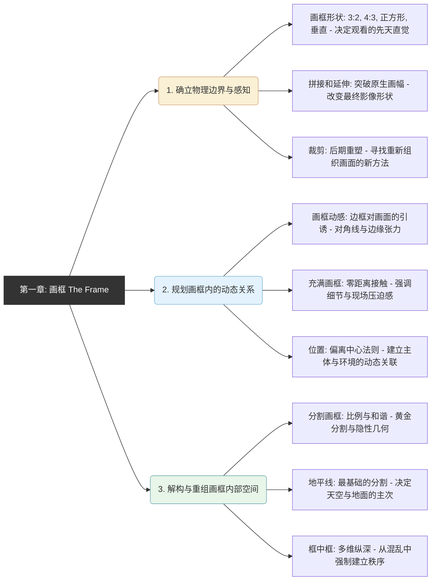

# 第一章框架

### 第一章“画框”底层逻辑架构图

代码段

### 深度理解：小节内容之间的逻辑关系

迈克尔·弗里曼在这一章的编排，实际上是遵循了摄影师举起相机时的**思维先后顺序**。我们可以将其划分为三个递进的逻辑层级：

#### 第一层：确立物理边界与先天感知

在你按下快门前或按下快门后，你首先面对的是“边框”这个物理存在。

- **画框形状**是摄影师最先需要适应的容器，矩形的图像边框对框内的影像会产生强烈的影响。取景器的形状（如 3:2 或正方形）会对所拍摄影像的形式产生巨大的影响，迫使你顺应或挑战其固有的观看习惯。
- **拼接和延伸**与**裁剪**则探讨了物理边界的“可变性”。拼接改变了最终影像的形状，带来了不可预见性与新鲜感。裁剪则是一种推迟设计决策的选择，是寻找重新组织画面的新方法的机会。

#### 第二层：规划画框内的动态张力关系

当你确立了边界后，接下来要处理的是**取景框边缘与被摄主体之间的“相互拉扯”**。

- **画框动感**讨论了简单的矩形画框如何诱导眼睛产生反应，以及画框边界对影像中线条产生的交互作用。
- **充满画框**探讨了极端的主体关系，将主体正好充满画框会产生令人满意的精确性，并给观众带来强烈的现场感。
- **位置**则探讨了非极端情况下的张力，将主体偏离中心放置可以建立主体与环境的联系，并制造出视觉上的动态张力。

#### 第三层：解构与重组画框内部空间

当主体落入画框后，最后一步是为二维平面内的复杂元素建立**秩序与和谐**。

- **分割画框**引入了黄金分割等数字比例，解释了如何通过隐形的几何学让画面产生和谐与共鸣。
- **地平线**是分割画框在自然界中最直接的应用，它通过上下空间的划分，决定了天空与地面在视觉上的重要程度。
- **框中框**是最高阶的组织手段，它不仅引导观众穿越平面产生纵深感，更是给混乱的环境强加控制和秩序的有效方法。

# 画框动感”

这部分的知识非常核心，它教会我们如何把取景器本身当作一个“充满引力”的工具，而不是一个死板的边框。

![[image-373.png|1635x685]]

### 模块笔记内容填写示范：2. 画框动感

#### 1. 核心概念定义

- **概念：** 画框动感是指取景器边界（及其四角）与画面内部元素（特别是线条、形状和颜色）之间产生的视觉交互作用与动态拉扯。
- **参数：** 主要通过控制**画框比例**（如常见的 3:2、宽幅全景等）以及**边框与画面内线条的角度关系**（如平行对齐、对角交叉）来实现。

#### 2. 底层逻辑

- **视觉生理原理（空白画框的引诱）：** 即使面对一个空白的矩形画框，眼睛也会产生本能的反应轨迹：视线通常先从中心开始，往左上方漂移，随后往下、往右，最终通过余光或跳跃视线到达清晰的边角。如果在相机取景器中观察，画框四周围绕的黑色背景会进一步强化眼睛对边角和边界的感知。
- **构图心理暗示：**
    - **对齐构图（做减法）：** 当画面中的直线与画框边缘完美平行对齐时，会消除边角的杂乱，赋予画面极强的稳定感和“几何感”。
    - **对角张力（做加法）：** 当画面内部的线条（特别是多条对角线）具有独立的运动方向，且与画框边界形成夹角并相互对照时，会产生强烈的视觉张力。
    - **抽象挤压：** 打破常规使用全景宽画幅（挤压上下部），可以排除主体本来的写实性，迫使眼睛将注意力集中在平面的结构与纹理安排上。

#### 3. 场景与避坑

- **适用场景：**
    - **拍摄现代主义建筑：** 尝试寻找与画框完全平行的建筑边缘线进行“对齐”，营造极简且严谨的秩序感。
    - **拍摄带有强透视的广角场景：** 刻意利用画面内部的多条对角线，让它们冲向画框边界，制造强烈的视觉冲击力和拉扯感。
    - **提炼建筑局部的纹理：** 摒弃展示建筑全貌的传统思维，使用极端长宽比的画框截取局部，创作出抽象的平面几何作品。
- **避坑指南：**
    - **避免在随意题材中生硬对齐：** 在追求轻松随意的快照（如街头摄影）时，如果刻意让线条与画框强行发生交互作用，反而会破坏影像的随性与自然，显得过度设计。

#### 4. 视觉图库

_(在此处建议粘贴原书中的以下示意图以加深肌肉记忆)_

- 粘贴一张**空白画框的视线漂移示意图**（带有箭头从中心飘向左上、再到右下的那张），直观感受画框本身自带的隐形磁场。
- 粘贴一张**对齐构图的办公大楼仰拍照**，体会楼顶线条如何与画框边界平行对齐，从而避免天空角落的杂乱并凸显几何感。
- 粘贴一张**带有对角张力的广角照片**，观察画面内部四散的对角线是如何与矩形边框“对抗”并产生动态张力的。

#### 5. 刻意练习

- **本周计划（边框交互感知练习）：**

    1. 周末去附近有大量现代建筑的 CBD 区域或广场。
    2. **练习“对齐”：** 找一栋边缘笔直的建筑，通过取景器反复微调相机角度，直到建筑的一条轮廓线与取景器的边缘完全平行。拍一张，感受其稳定的几何秩序感。
    3. **练习“张力”：** 站在原地换上广角镜头，刻意将相机倾斜或改变机位，让建筑的线条在画面中变成对角线，并让这些线条延伸向画框的四个角。拍一张，感受画框边缘是如何与斜线产生视觉拉扯和动感的。
# 画框形状
![[image-374.png|1529x1306]]

### 模块笔记内容填写示范：画框形状（Frame Shape）

#### 1. 核心概念定义

- **概念：** 取景器（和 LCD 屏幕）的形状对拍摄影像的形式有巨大的影响。尽管可以后期裁剪，但拍摄时会有一种强烈的直觉压力促使摄影师紧贴画框边界构图。
- **参数：** 主要靠长宽比（纵横比）控制，常见的有 **3:2**（传统 35 mm/数码单反标准）、**4:3/5:4**（偏胖、更自然）、**1:1**（正方形），以及拍摄时的水平与垂直方向切换。

#### 2. 底层逻辑

- **生理与物理原理：** 人类自然视觉是双眼和水平的，视野是一个边界模糊的水平椭圆，因此水平画框（如 3:2）是一个合理的近似，看起来最自然。同时，相机的物理设计也使得水平握持最容易。相反，人眼对上下扫描有自然的抵触，所以垂直画幅往往带有轻微的不自然与抵触感。
- **心理暗示与视觉引导：**
	- 全景：“风景,宽度是很重要的,但是高 度却不是那么 重要” ([pdf](zotero://open-pdf/library/items/99BEV7U3?page=13&annotation=6LXTLRF2)) |  
    - **3:2 画幅：** 提供稳定感，鼓励画面元素的水平安排。
    - **4:3/5:4 等“胖”画幅：** 由于没有一个方向是特别突出的，方向性较弱，给眼睛更多无拘无束游走的空间，拍摄时有更大的灵活性。
    - **方形（1:1）：** 绝对没有偏心，具有强烈的刻板感、形式感和精确的对称性，会强制把视线引向画面中心点。

#### 3. 场景与避坑

- **适用场景：**
    - **水平画框：** 最适合大多数的风景和常规视角。
    - **垂直画框：** 适合站立的人像、高大建筑、树木等自然垂直的主体。“而把垂直画 框的上 面部分留空一 这个 倾向的 一个原因是,和水 平画框的情况一样, 人们会假定画 面的底部是一个基础 :支撑其他 物体的水平面” ([pdf](zotero://open-pdf/library/items/99BEV7U3?page=15&annotation=29RA6SQJ)) |  
    - **方形画框：** 适合装饰图案、无定形的布局或向心/辐射状的完全对称主体。
- **避坑指南：**
    - **竖拍 3:2 的留白陷阱：** 用 3:2 比例竖拍（即 2:3）单个人物或主体时，由于画幅太长，经常会导致画面上部空间无法充分利用而显得多余且难以处理。
    - **垂直画面的“失重”：** 在垂直画框中，人眼天然需要画框底边作为水平的“支撑基础”。因此将单一主体放在正中央往往不舒服，自然倾向是将其安排在中心以下的地方。
    - **方形的单调感：** 正方形极其容易导向完美的对称与平衡，偶尔使用很有趣，但一直使用这种精确对齐会迅速让画面变得单调乏味。

#### 4. 视觉图库

_(在此处建议粘贴原书中的以下对比图以加深肌肉记忆)_

- 粘贴一张原书中“火车上睡觉的男子”的水平与垂直构图对比图，直观感受画框方向如何改变主体的平衡感与重力（水平画面偏向一方形成平衡，垂直画面主体位于略下方）。
- 粘贴一张原书中 **1:1 正方形的向心构图（如蕨类植物）或正方形的细分对角线示意图**，体会四条等长边线带来的几何秩序与中心压迫感。

#### 5. 刻意练习

- **本周计划（画幅视野切换练习）：** 周末去公园或街道找一个独立的静物或建筑局部。站在同一位置，分别用相机/手机的 **3:2**、**4:3** 和 **1:1（正方形）** 比例各拍一张。观察方形画幅是如何强迫你注意完美的几何对称，而长画幅是如何制造留白空间并产生水平引导力的。

# 裁剪

### 模块笔记内容填写示范（以“裁剪”为例）

**1. 核心概念定义：** 裁剪是在影像拍摄之后重新处理的一个方法。它是推迟设计决策的一种选择，更是寻找重新组织画面的新方法的机会。

**2. 底层逻辑：**

- **物理原理：** 和拼接相反，裁减会缩小影像尺寸，因此需要从更高的分辨率开始。

- **技术演进：** 在黑白摄影时代曾是高度发达的技巧，如今作为数码后期处理的重要一部分，裁剪在软件中变得非常简单容易，重新焕发了活力。

- **心理与视觉干预：** 裁剪打断了摄影处理过程，而大多数影像往往得益于连续的视野。

**3. 场景与避坑：**

- **适用场景：** 当照片拍摄时即使已经很好地构图，但仍需要进行某些技术调整（如镜头变形矫正）时；或者面对复杂场景（如风景），需要在后期重新决定地平线位置或排除边缘干扰元素时。

- **避坑指南：**

    - **切忌依赖：** 不能把裁剪当作包治百病的万灵药来弥补拍摄时的设计失误。

    - **拒绝拖延：** 不能将其当作在拍摄现场不做决策的借口。

    - **警惕后期万能论：** 有机会在拍摄后修改画框，会让人产生一种危险的错觉，以为在电脑上就能完成很多摄影意图。

**4. 视觉图库：**

_(在此处粘贴一张元素丰富的风光原图，并附上三张采用不同裁剪策略的对比图：一张压低地平线强调天空云层的宽幅图、一张提高地平线强调地面细节的图、以及一张垂直裁剪的局部特写图)_

**5. 刻意练习本周计划：**

本周在电脑或手机相册中找出一张自己以前拍摄的、元素较多且感觉构图平庸的广角照片。利用裁剪工具，分别尝试裁出一个“纯粹的局部特写”和一个“改变了地平线比例的横侧构图”，观察在不改变原图内容的情况下，仅仅通过改变画框边界是如何赋予照片全新意义的。
# 14 充满画框

![[image-375.png|1308x1177]]

### 模块笔记内容填写示范（充满画框 - 修正版）

**1. 核心概念定义：** 在所有摄影场景中，最基本的是相机前单一而明确的主体。充满画框即是让该主体向画框边界延伸，将其填满的构图方式。

**2. 底层逻辑（构图的三个核心考虑点）：**

- **考虑点一：图片的信息内容。** 主体在照片中越大，就越能看到它的细节。如果主体很不寻常或很有趣，这些细节就非常重要（适合充满画框）；如果主体很常见，情况则恰恰相反。
- **考虑点二：主体与其环境之间的关系。** 需要评估环境对画面的作用。环境可以用来交代比例或主体的活动，如果环境本身没有意义（例如影棚的无色背景），则更适合让主体充满画框。
- **考虑点三：主体与观众之间的主观联系。** 摄影师希望在两者之间建立何种联系。一幅大照片里充满画框的大主体通常总会充满力量和影响力。

**3. 场景与避坑：**

- **适用场景**：需要放大不寻常主体的细节时，或者意图制造强烈的视觉冲击力与力量感时。
- **避坑指南（潜在风险）**：
    - **边缘视觉不适**：将主体延伸到画框边界的潜在风险在于，眼睛将视觉焦点集中在画面边缘可能会感觉不舒服。
    - **缺乏视线移动空间**：观众的视线常常需要——或者至少受益于——主体周围有少量的空间，以便无拘无束地移动视线。
    - **画幅比例冲突**：大多数单主体的焦点并不能自然填满画框，主体的形状往往与画幅的矩形比例不相一致。

**4. 视觉图库：**

_(在此处粘贴一张细节极度丰富、充满力量感的特写照片，以及一张在主体周围刻意保留了“少量空间”以便视线舒适移动的对比图)_

**5. 刻意练习本周计划：**

本周寻找一个有趣且细节丰富的主体（如人物面部、宠物面部或手工艺品）。先拍摄一张绝对“填满画框”到达边界的照片，体会其“力量感”与“边缘压迫感”；然后稍微退后，在主体四周留出“少量的空间”再拍一张。对比观察，体会第二张是否让你的视线移动得更无拘无束。
