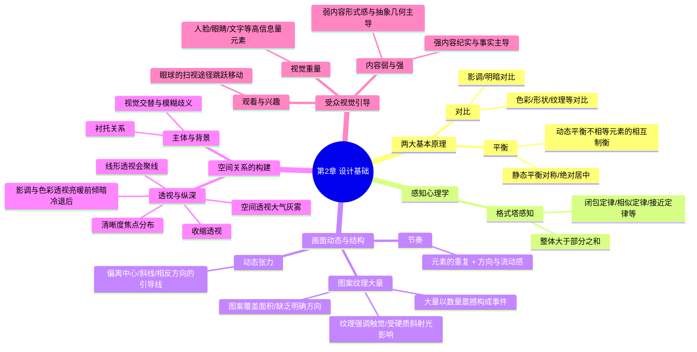

# 第二章“设计基础”

### 第二章：设计基础 (Mermaid 图形化)

### 核心结构解析（底层逻辑）

**1. 两大基本设计原理**

- **对比 (Contrast)**：这是构图的基石，不仅控制了影像造型的强度，也决定了影像的结构和受关注的部分。包豪斯的约翰尼斯·伊顿提出，对比（如大/小、亮/暗、连续/间歇）是构成图像的基础。
- **平衡 (Balance)**：眼睛总是设法寻找张力的平衡。静态平衡（对称）显得稳定但容易乏味，而动态平衡（如用远离中心的小物体平衡中心的大物体）能使影像更加生动活泼。

**2. 视觉感知心理学**

- **格式塔感知 (Gestalt Perception)**：认为整体大于其各组成部分之和，大脑会根据接近、相似、闭包等定律将零散的视觉信号组织成有意义的整体。

**3. 画面的动态与结构**

- **动态张力 (Dynamic Tension)**：利用斜线或引导眼睛走出画面的结构来保持视觉警觉，这是一种未确定的张力。
- **节奏 (Rhythm)**：重复的元素加上眼睛扫描的“方向与流动”，能产生动势和延续感。
- **图案、纹理与大量 (Pattern, Texture, Mass)**：图案覆盖面积且具有内在静止感；当数量增加到单个元素难以分辨时就成为纹理（与触觉相关，需斜射硬光展现）；而巨大的数量本身就能让人产生惊叹的视觉感染力。

**4. 空间关系的构建（二维转三维）**

- **主体与背景 (Subject and Background)**：通常主体在前，背景在后起衬托作用。但当两者反差极大且面积相等时，会产生视觉交替的模糊感，从而增添视觉张力。
- **透视与纵深 (Perspective and Depth)**：这是影响照片写实性的关键。除了线形透视（广角镜头会夸大线条会聚）和收缩透视外，还包括空间透视（利用大气灰雾）、影调透视（明亮物体显前）、色彩透视（暖色前倾、冷色退后）以及清晰度控制。

**5. 受众的视觉引导**

- **视觉重量 (Visual Weight)**：某些高信息量主体（如人脸关键部位、文字）具有天然吸引注意力的“重量”，能决定照片被观察的方式。
- **观看与兴趣 (Viewing and Interest)**：眼睛通过“扫视”在兴趣点间快速跳跃移动，不同的期望（无意识观看或带任务观看）会产生不同的视觉扫描途径。
- **内容，弱与强 (Content, Weak and Strong)**：强烈的事件内容（如新闻杀戮场景）往往让位于直接表达，而较弱或平淡的内容则给摄影师留下了通过抽象形式感进行创造的机会。

## 对比

### 模块笔记内容填写示范（以“对比”为例）

**1. 核心概念定义：** 对比控制了影像造型的强度，也决定了影像的结构和受关注的部分。在明暗、形状、颜色甚至于感觉之间的对比，是构成一幅图像的基础。它不仅限于光影，还包括大/小、长/短、光滑/粗糙、透明/不透明等多维度的反差。

**2. 底层逻辑：**

- **视觉原理：** 眼睛总是设法寻找张力的平衡，而两个相互对比的对立元素能相互加强，从而使画面结构更具张力与活力。
- **心理暗示：** 强烈的对比（如单一与大量、明与暗）能够唤醒个人的敏锐观察，迅速确立画面的视觉焦点，决定观众第一眼看向哪里并探索设计领域的手段。

**3. 场景与避坑：**

- **适用场景：**
    - **“多与少”对比：** 第一印象可以是一大堆东西里，有一件在某方面有些不同，因而脱颖而出；也可以是一大堆东西旁边有一件同样的东西，单独而孤立地出现。
    - **“明与暗”对比：** 用光线照亮黑暗背景前的主体，产生戏剧性造型和强烈的结构感。
- **避坑指南：**
    - **避免生搬硬套：** 对比是艺术训练与设计的基石，但切忌纯粹为了对比而对比。
    - **警惕失去平衡：** 对比会产生张力，如果未能妥善安排对比元素（如体积相差悬殊但位置安排失衡），画面会显得摇摇欲坠、失去和谐。

**4. 视觉图库：**

![[image-380.png|480]] ![[image-381.png|1085x1100]] ![[image-382.png|1104x1197]]

_(在此处粘贴两张具有强烈反差概念的对比图：一张是为了最大程度表现数量感、将晾晒鱼干完全充满画面的“很多”照片；另一张是使用广角镜头增加透视感、将水面上一条废弃小船与远岸分离的“单一”照片)_

**5. 刻意练习本周计划：**

本周进行“发现对比”专项练习：参考包豪斯的设计训练，用你的眼睛去感知日常环境。寻找并拍摄三组包含明显对比的照片：第一组拍“大/小”的体积对比，第二组拍“光滑/粗糙”的材质对比，第三组拍“多/少”的数量对比。观察在同一画框内，对立元素是如何相互强化并死死抓住你眼球的。

## 格式塔感知

![[image-383.png|1094x1046]]

### 1. 核心大白话：什么是“格式塔”？

- **大白话定义**：格式塔理论的核心就是“**整体大于局部之和**”。大脑在看照片时，不是一个零件一个零件去认的，而是“突然跳跃”一下，直接理解整个画面。
- **字面意思**：德语“Gestalt”的意思就是“被摆好或者放在一起”，这跟摄影构图简直是天生一对。
- **懒人大脑（最优化/精确性）**：这套理论强调，我们的大脑是个“懒汉”，喜欢清晰和简单的东西，它理解一张照片整体时，总是力求用“最小的努力”。
- **类比**：这就好比你吃一块蛋糕。你吃进去的是“蛋糕”这个完美的整体，大脑也是这么感受它的，而不是去感知面粉、鸡蛋、糖和黄油的混合物。

### 2. 格式塔的 7 大“偷懒”定律

大脑为了偷懒，在处理视觉元素时会自动把它们“组块”（组合在一起）。具体有 7 个定律：

- **1. 接近定律 (Proximity)**：离得近的，就是一伙的。
    - _类比_：街上三个人站得很近，大脑会自动默认他们是朋友。
- **2. 相似定律 (Similarity)**：长得像的，就是一伙的（无论是形式还是内容）。
    - _类比_：球场上虽然人到处乱跑，但你一眼就能通过球衣颜色把他们分成两队。
- **3. 闭包定律 (Closure)**：残缺的形状，大脑会自动脑补完整。
    - _类比_：画一个虚线组成的圆，你的大脑依然会把它看作是一个“圆”，而不是一堆虚线。经典的“卡尼莎三角形”就是利用这个骗过大脑的。
- **4. 简单定律 (Simplicity)**：大脑喜欢直白，讨厌复杂。它本能地偏爱简单的直线、曲线、形状以及对称和平衡。
- **5. 同命定律 (Common Fate)**：一起动的，就是一个整体。
    - _类比_：天空中的鸟群，或者朝着同一个方向走的一群士兵，在大脑里表现得就像是一个单一的物体。
- **6. 延续定律 (Continuation)**：视线是有惯性的。大脑倾向于在一条线或形状结束的地方，继续往外延伸。
- **7. 分离定律 (Figure-Ground)**：主体必须和背景剥离开来。如果人物和背景混在一起，大脑就会陷入“不确定性”，搞不清谁是主角谁是背景，看着就心烦。

### 3. 格式塔的 4 大原理（视觉魔术）

在把各种元素组合成一张有意义的照片时，大脑还会玩下面四个魔术：

- **1. 突现原理 (Emergence)**：看久了，隐藏的信息会突然“蹦”出来。
    - _类比_：就像看那种隐藏在杂乱黑白斑点里的斑点狗图片，一开始啥也看不清，盯着看一会儿，那条狗突然就显露出来了。
- **2. 具体原理 (Reification)**：大脑会用不够充足的信息，强行填补形状或区域（这也包括上面说的“闭包”现象）。
- **3. 多稳原理 (Multistability)**：当画面缺乏“深度线索”（看不出远近）时，物体看起来会很不自然。
    - _说明_：这在埃舍尔（画那种永远走不完的楼梯的画家）的艺术里很常见，但在真实的摄影里比较少见。
- **4. 恒定原理 (Invariance)**：不管物体被怎么翻转、缩放、改变大小，大脑依然能认出它是什么。

## 平衡

![[image-384.png|1076x470]]

这是一份为您提取并填写的“平衡”模块笔记示范：

**平衡小结笔记**

**1. 核心概念定义**： 平衡是构图的核心概念，是张力的结果，是对立的影响力相互匹配以提供均衡和协调的感觉。视觉的基本原理是眼睛总是会设法寻找某种张力的平衡。

- **分类**：平衡主要分为对称（静态）平衡和动态平衡两种不同的类型。

**2. 底层逻辑**：

- **物理原理**：寻找视觉“重心”的过程可以类比为一杆秤。处理不相等的重量和张力时，大的物体可以与小物体达成平衡，只要小图像元素摆放在靠近画框边缘、离支点足够远的地方。
- **心理暗示**：完美的静态平衡留给眼睛的工作很少，因此动态平衡通常比静态平衡更有趣味。在缺乏均衡的情况下，视觉会设法自己建立均衡，这个补偿不对称的过程制造了视觉张力。动态平衡能够使影像更加生动活泼。

**3. 场景与避坑**：

![[image-385.png|1135x537]]

- **适用场景**：建筑或从正面观察的生物（如人脸）等天然沿轴线对称的主体，适合使用左右对称构图。当画面中主体偏离中心时，可以通过在远离支点的位置引入另一个小元素（如汉字、色块）来建立动态平衡。
- **避坑指南**：艺术或者摄影的任务并非仅仅提供均衡，如果只追求宁静与满足，结果将会非常沉闷。避免完美的平衡可以创造出更为有趣的影像，并激起摄影师所想要的反应。此外，对称构图必须绝对精确，因为即使最微小的偏差也会立即显露出来并被看作是失误，很少有图片比几乎对称却并未完全做到的图片更显得草率。

**4. 视觉图库**：

![[image-386.png|1073x691]]

(在此处粘贴一张绝对精确对称的建筑正面照片作为静态平衡的例子，以及一张利用边缘小物体平衡中心大主体的动态平衡照片)

**5. 刻意练习本周计划**：

周末去街头拍摄，尝试故意将主要人物或物体放置在偏离中心的位置以打破常规平衡，并利用画面另一侧角落的背景元素（如路牌、汉字招牌或明亮的色块）来建立动态张力，体会眼睛在画面中寻找“视觉重心”的感受。

## 动 态张力

按照您的要求，我以《摄影师的视界：迈克尔·弗里曼摄影构图与设计》中经常强调的“动态张力（Dynamic Tension）”为核心，并重点补充了关于“张力”的底层解读。以下是结合通俗类比与严格引用的笔记输出：

**模块**：动态张力与视觉平衡

**笔记内容填写示范**

**1. 核心概念**

**定义**：

- **什么是“张力”**：在摄影构图中，平衡是张力的结果，是对立的影响力相互匹配以提供均衡和协调的感觉。视觉的基本原理是眼睛总是会设法寻找某种张力的平衡。例如，当画面中有一条斜线具有很强烈的指向某个方向的运动感时，眼睛就会感到需要一个相反的运动感觉。这种设法补偿影像中一个明显的不对称的过程制造了视觉张力。
- **什么是“动态张力”**：动态张力是使用了各种结构内在的能力，以保持眼睛的警觉并使之从画面中心向外围移动。这与正规构图的静态特性正相反。
- **通俗类比**：四平八稳的静态构图就像一根松弛的橡皮筋；而“张力”就像拉满的弓弦。当画面元素偏离中心，或者向不同方向发力时（动态张力），就像一场势均力敌的拔河比赛，元素之间在相互“拉扯”，让照片瞬间充满了一种“不安分”的冲突与刺激感。

**参数**：主要依靠向不同方向的斜线、相反的线条、物体偏心布局以及人物的视线方向等元素来控制。

**2. 底层逻辑（构图原理）** **构图原理**：物体偏心布局会产生张力，因为眼睛会尝试自行建立平衡。取得动态张力的理想组合是一组向不同方向的斜线、相反的线条，或者任何能引导眼睛走出画面的结构手段（最好是相反方向的）。此外，广角镜头经常被用来夸大画框边缘附近的几何变形，以此放大线条拉扯的动态感。 **心理暗示**：将动态张力引入照片能立竿见影地吸引注意力。它能给画面带来强烈的动势和活力，打破常规的沉闷，给观众带来高度的视觉警觉和兴奋感。

**3. 场景与避坑**

**适用场景**：

- 拍摄工作与人物（如整理棉花的妇女场景）：可以利用广角镜头夸大画框边缘附近的几何变形，让线条和人物手势将注意力同时往左右两边拉扯。
- 拍摄具有方向冲突的场景（如铸钟场场景）：利用画面里视线和正面物体表现出来的方向造成视线的分离，从而产生相互拉扯的张力。
- 拍摄向外发散的自然景观（如橡树巷庄园场景）：分开的线条和外趋向是动态张力的关键，可以使用广角镜头来夸张地表现大树分叉等带有强烈外趋向的阴影和线条。

**避坑指南**：

- 动态张力吸引注意力的效果看起来很容易也立竿见影，因此有必要谨慎些。它缺乏持久力，其效果通常很快就会被消耗殆尽，于是眼睛就会转移到下一张照片了，因此不可过度滥用。
- 在取得动态张力时，要避免使用比如封闭的圆形结构。因为动态张力需要的是引导眼睛走出画面，而封闭的圆形会把视线“困”在中央。

**4. 视觉图库**

![[image-387.png|510]]

**5. 刻意练习**

**本周计划**：周末带上广角镜头去广场或街头，尝试抓拍一张带有“拔河感”的照片。刻意让画面中出现两个朝向相反的视觉引导线（例如左边是一个向左张望的行人，右边是一排向右上方延伸的建筑斜线），观察视线是如何被向外围“拉扯”的。

## **模块：主体与背景**

![[image-388.png|775]]

**1. 核心概念定义：**

- 主体就是照片里我们主要观看的“主角”，而背景则是主体站立或者依靠的“舞台”环境。在常规的视觉体验中，主体在前面，背景在后面，背景的作用是填补画面的空余部分。
- **参数：** 主要靠取景范围、拍摄视角，以及画面中两种色调的反差与面积比例来控制。

**2. 底层逻辑：**

- **视觉格式塔原理：** 我们的大脑习惯于把看到的场景自动分为“主体”和填补空白的“背景”，这是格式塔理论的一个核心原理。_（类比：这就好比看京剧，演员是主体，后面用来挡住后台的幕布就是背景，没有幕布，戏台就空了一块。）_
- **心理暗示（交替感知）：** 在杰出的照片中，背景是为了补充主体。但如果画面现实细节很少、两种色调反差极大且占据面积尽量相等时，观众的大脑就会产生“交替感知”的错觉。这时，真实的背景如果比主体明亮，反而会显得向前突出，让观众一会觉得暗是主体，一会觉得亮是主体，从而给画面增添强烈的视觉张力和抽象感。

**3. 场景与避坑：**

- **适用场景：** 当你想拍摄具有抽象艺术感、视觉悬念的照片时，可以寻找缺乏现实细节的场景。尝试让明亮的背景和暗调的主体在画面中占据相等的面积，创造一种“主体与背景相互模糊、相互交错”的趣味画面。（类比：就像看中国书法或太极图，黑色的笔画和白色的留白同样重要，甚至能互相转换角色。）
- **避坑指南：** 如果你的目的是清晰地交代故事和现实景象，就一定要在画面中留下足够的“真实线索”（比如谁在谁之前）。否则，盲目制造高反差且面积相等的明暗色块，会让观众产生混淆，不知道你想表达的重点到底是什么。

**4. 视觉图库：** (在此处粘贴一张主体清晰且背景能很好交代环境的常规照片，以及一张高反差下主体与明亮背景面积相等、产生抽象错觉的剪影照片，例如夯土窗框与明亮庭院交织的画面)

**5. 刻意练习：**

- **本周计划：** 周末找一面受光强烈的白墙或明亮的窗户，让朋友站在前面拍一张剪影。尝试调整你的相机取景范围，让朋友的黑色剪影（暗部）和明亮的背景（亮部）在你的画面里刚好各占一半。观察拍出的照片，体会那种大脑“分不清谁是主体、谁是背景”的视觉跳跃感。

![[image-389.png|1155x1094]]

## 主体

## **节奏**

**1. 核心概念定义：**

- “节奏”就是场景中相似元素的重复出现，从而构成的一种有规律的视觉结构。
- （类比：摄影中的节奏就像音乐里的“节拍”。一排整齐的电线杆就像是流行乐里动次打次的固定鼓点；而高低错落的树木则像是爵士乐里的切分音变奏。）
- **参数：** 主要靠画面中相似元素（如形状、线条、甚至人物的动作）的重复出现以及它们之间的排列规律来控制。

**2. 底层逻辑**

- **视觉引导原理：** 节奏就是眼睛扫描照片的方式。强烈的节奏会像轨道一样，引导观众的眼睛跟着“光学节拍”在画面中来回移动，从而让观众花更多时间来欣赏你的照片。
- **格式塔心理学（延续定律）：** 画框的边界会限制我们能看到的节奏长度，但人类的大脑天生擅长“脑补”。只要画面里有节奏感，观众的大脑就会自动假设这种重复的节奏延伸到了画框之外，从而让照片产生一种向外无限延伸的张力。

**3. 场景与避坑**

- **适用场景：**
    - **静态建筑：** 连续的拱门、成排的立柱或栅栏。
    - **动态抓拍：** 包含重复动作的场景。比如拍摄几个农民在田里扬起稻谷，你可以耐心等待他们动作达到完全同步的那一瞬间按下快门，形成一种“动作节奏”。
- **避坑指南（节奏与停顿）：**
    - 如果画面里的节奏完全是预料之中的（比如一面毫无变化的砖墙），观众很快就会感到乏味。
    - _破局方法：_ 刻意制造“视觉停顿”。在重复的规律中寻找一个异常事物来打破它。比如在连续的宫殿外墙前，等一个扫地的人入画，这个异常的“标点符号”能瞬间打破沉闷，让画面充满动感并抓住眼球。

**4. 视觉图库** (在此处粘贴一张包含重复动作的抓拍，如三个农夫动作整齐划一扬起稻谷的照片；以及一张“打破规律”的照片，如一长排整齐的宫殿立柱前，刚好有一个穿红衣服的扫地僧路过，形成视觉停顿)

**5. 刻意练习**

- **本周计划：** 周末去找一个充满重复元素的场景（比如一整排共享单车、连续的斑马线或长廊的柱子）。先拍一张只有“纯节奏”的照片；然后站在原地耐心等待，直到有一只小猫或一个穿着鲜艳路人走进画面“打破”这个节奏时，再拍一张。对比两张照片，体会“死板的节拍”与“充满动感的变奏”之间的视觉差异。

## **图案、纹理与大量**

![[image-390.png|1106x1081]]

**1. 核心概念定义：**

- **图案（Pattern）：** 基于相似元素的重复，但它与方向无关，而是与“面积”有关。
- **纹理（Texture）：** 当图案里的元素数量不断增加，直到单个元素变得难以分辨时，图案就变成了纹理。纹理表现的是物体材质的结构。
- **大量（Mass）：** 巨大数量的同类物体聚集在一起，本身就构成了一种具有视觉冲击力的事件。
- _（类比：想象你正走近一片沙滩。在半空中看，那是金黄色的**图案**；当你抓起一把沙子凑近看，你能感受到沙粒粗糙的**纹理**；而当你站在沙滩上放眼望去，那数以亿计的沙子就是令人震撼的**大量**。）_
- **参数：** 主要靠取景范围（充满画框）、拍摄距离/镜头焦距（长焦压缩）以及光线的质感（软硬、方向）来控制。

**2. 底层逻辑**

- **视觉漫游与无限延伸：** 图案不会引导眼睛顺着特定方向走，而是吸引眼睛在图片表面四处漫游，自带一种静止感。当这种图案直接延伸到画框的边缘时，大脑会产生错觉，认为图案在画框之外还在无限延伸。
- **触觉通感：** 纹理虽然是视觉的，但它主要作用于人的“触觉”通道。看到粗糙的岩石或细腻的丝绸照片，你的大脑会自动唤起摸上去的质感。
- **数量的惊叹效应：** 在同一时间、同一地点看到密密麻麻的同类物体（如上百万人的集会或成千上万的鱼干），这种“巨大数量”本身就能让观众产生心理上的惊叹感。

**3. 场景与避坑**

- **适用场景：**
    - **拍纹理（找硬光）：** 纹理的显现极度依赖光线。要寻找侧逆光、斜射且未经柔化的“硬质光线”（如晴天的直射阳光）。因为斜射的硬光能让物体表面的凸起产生最强烈的阴影，从而将纹理最大化展现。
    - **拍大量（用长焦）：** 想表现密密麻麻的人群或物体时，使用远摄（长焦）镜头可以压缩透视，让群体看起来更密集；并且要在群体的边缘截断取景，让大脑相信画面外还有无穷无尽的物体。
- **避坑指南（打破规律）：**
    - 绝对规则的图案容易让人觉得乏味。
    - _破局方法：_ 刻意“打破图案”。图案没有方向性，很适合做背景；但如果图案是主体，就一定要在重复中加入一个视觉对比元素。比如在一大堆正常的珍珠中间，放一颗变色、变形的珍珠，这种秩序中的“无序”能瞬间成为视觉焦点。

**4. 视觉图库** (在此处粘贴一张用极低角度和长焦镜头拍摄的密集火烈鸟群（展现大量与压缩）；一张用斜射阳光拍摄的老树皮或熟铁格栅（展现强烈的触觉纹理）；以及一张铺满画面的正常珍珠中夹杂着一颗变色变形珍珠的照片（展示打破规律的图案）)

**5. 刻意练习**

- **本周计划：** 周末找一面带有粗糙质感的砖墙或树干。在正午阳光直射（平光）时拍一张，在傍晚阳光斜射（侧光）时再拍一张同样范围的，对比光线方向对“纹理”起伏感的影响。接着，找一片铺满落叶的草地，用长焦镜头只拍树叶，让叶子填满整个画框边缘（制造“图案/大量”的无限延伸感），然后在画面黄金分割点放上一片颜色迥异的树叶来“打破规律”并按下快门。

## 透视与纵深**

**1. 核心概念定义：**

- “透视”就是摄影师在二维平面的照片中，创造出“三维空间（远近深浅）”的幻觉手段。
- 强化的纵深感和透视感能极大增强观众“身临其境”的临场感，它能突出主体的特征，但同时会削弱画面的平面图形感。
- **参数：** 主要靠镜头焦距（广角/远摄镜头）、空气环境、以及画面中明暗、色彩和清晰度的分布来控制。

**2. 底层逻辑**

- _（类比：我们的大脑是一台“3D自动脑补机”。只要你在照片里埋下特定的“线索”，大脑就会自动骗自己看到了立体的深度。以下就是给大脑的 5 种线索：）_
![[image-391.png|716x668]]
- **光学/物理原理线索：**
    - **线形与收缩透视：** 想象沿着公路看路边大小相同的一排树，树向远方汇聚并逐渐变小，这就是收缩透视。广角镜头会放大这种近大远小的透视感，而远摄（长焦）镜头则会把空间“压扁”，使其趋于扁平化。
![[image-392.png|1124x990]]
    - **空间透视：** 空气中总有雾霾灰尘，越远的东西显得反差越低、越灰白。长焦镜头在拍摄时能比广角镜头穿透更厚的空气，因此更能展现这种空间透视效果。
- **心理暗示线索：**
    - **影调透视：** 我们的大脑默认明亮的物体显得靠前，黑暗的物体则退后。
    - **色彩透视：** 以色彩为基础的透视关系中，暖色（如红、橙）让人感觉在向前凸出，而冷色（蓝、绿）则让人感觉向后退缩。
    - **清晰度：** 焦点清晰的地方让人感觉近，模糊的焦外区域则暗示着距离深远。

**3. 场景与避坑**

- **适用场景：**
    - **拍大片现场感：** 用广角镜头贴近前景主体，利用强烈的线形会聚把观众的视线“吸”进画面里。
    - **拍水墨画般的层次感：** 在有雾或水汽的清晨，用长焦镜头拍摄层峦叠嶂的山峰，利用“空间透视”表现远近层次。
- **避坑指南（防错乱）：**
    - 不要把想突出的主体放在画面暗部或冷色区，却把无关的背景拍得又暖又亮。因为“亮且暖”的背景在视觉上会猛烈地向前突出，导致观众的大脑产生空间错乱，主次不分。
    - 如果你想表现平面的图案或纹理，就不要用广角镜头。因为广角强化的纵深感会破坏和弱化你想表达的图形结构。

**4. 视觉图库** (在此处粘贴一张用广角镜头超近距离仰拍的一排树或古城墙，展现强烈的线条汇聚和“近大远小”的收缩透视；以及一张用长焦镜头拍摄的清晨群山，近处的山深黑，远处的山明亮且笼罩在灰雾中，展现空间透视和影调透视)

**5. 刻意练习**

- **本周计划：** 周末去楼下找一排整齐的共享单车或一排路灯。
    - **第一步（广角强化）：** 蹲下来，把手机（或广角镜头）几乎贴在第一辆车上拍一张。观察线条如何猛烈地向画面深处扎进去。
    - **第二步（长焦扁平化）：** 往后退 30 米，换用相机的长焦端（或手机放大到 3 x/5 x 倍率）再拍同样的一排车。
    - 对比两张照片，感受广角的“吸入感”和长焦把物体像肉饼一样“压扁在一起”的神奇魔法。

## 模块笔记内容：视觉重量

![[image-393.png|1082x1042]]

**1. 核心概念定义** **视觉重量**并不是指物体在物理上有多重，而是指画面中的某个元素有多“抢眼”。在照片中，有些主体天生就比其他元素更吸引人们的注意力。

- **通俗类比：** 想象你的照片是一个跷跷板，观众的目光是放在上面的砝码。像“人脸”或“文字”这样的元素就是铁做的重砝码，瞬间就能把观众的目光“压”过去；而普通的背景就像是棉花，没什么重量。

**2. 底层逻辑** **心理与生理机制：** 我们在观看影像时，会唤醒大脑里累积的“存储知识”，眼睛会自动去寻找那些能提供最多信息、或者满足情感和欲望的东西。

- **人类面部（尤其是眼睛和嘴）：** 这是画面中视觉重量最大的元素之一。因为在进化中，我们需要通过观察别人的表情来做出决策，神经系统研究甚至发现我们的大脑里有专门识别脸型和手势的单元。
- **文字与符号：** 文字本身带有极大的信息价值，即使是观众看不懂的外语，也会因为它是语言符号而具有很高的视觉权重。
- **情感触发物：** 比如娇小可爱的动物、危险恐怖的场景、或者是带有性吸引力的元素，也会因为刺激了情感而变得很“重”。

**3. 场景与避坑** **适用场景（巧用引诱物）：** 在复杂的环境（如日本的鱼市场）中，你可以利用视觉重量大的元素作为“引诱物”来引导视线。例如，鱼的眼睛、招牌上的汉字文字、或者一块强烈的色彩，这些元素组合在一起，就能让观众的视线在这些“重”元素之间来回移动，形成观看节奏。

**避坑指南（裁掉干扰项）：** 拍摄街头纪实（如印度街头）时，最怕出现“意外的超重元素”。如果你拍摄的主体是一个正在干苦力的工人，但画面边缘刚好有个路人直勾勾地盯着你的镜头，这个路人的“脸和眼睛”会产生极大的视觉重量，直接抢走主体的风头。

- **处理方法：** 遇到这种情况，最直接的办法就是在后期果断把这个“瞪眼看的人的脸”裁剪掉，从而强行改变眼睛在画面里的自然移动方向，把视觉重量还给真正的主体。

**4. 视觉图库**

_(在此处粘贴一张包含汉字招牌和鱼类特写的日本鱼市场照片，展示文字和眼睛的吸引力)_

_(在此处粘贴一张印度街头的纪实照片对比图：原图边缘有路人盯镜头，裁切图去掉了路人)_

**5. 刻意练习**

**本周计划：** 找一张充满人群的街头照片或时尚海报。闭上眼睛，然后突然睁开看这张照片，记录下你的视线在最初的 3 秒钟内依次落在了哪三个地方。观察这三个地方是不是包含了“人脸（特别是眼睛）”、“文字标语”或者“强烈的情感元素”。下一次按快门前，先扫视取景器，确认画面里有没有不该出现的“超重元素”（比如抢镜的路人脸）在干扰你的主体。

## 模块笔记内容：观看与兴趣

![[image-394.png|378x756]]

**1. 核心概念定义** **观看与兴趣**的核心在于：人们从来不是“一眼看全”整张照片的，而是被画面中的“兴趣点”吸引，目光在各个点之间来回跳跃扫描。你拍摄和构图的方法，直接决定了观众会怎么看你的照片。

- **通俗类比：** 想象观众在看你的照片时，就像是在全黑的房间里拿着一把手电筒。他们无法瞬间看清全貌，手电筒的光束（目光）只能从一个有趣的物体迅速跳到另一个物体上。作为摄影师，你的构图就是用来引导这把“手电筒”该先照哪儿、后照哪儿的路线图。

**2. 底层逻辑** **生理机制（扫视）：** 我们的眼睛只有正中心（中央凹）才有极高的分辨率，这就逼着我们的眼球必须快速跳跃、扫描影像，然后大脑再把这些碎片在短时记忆里拼成一张完整的图。这种双眼的快速移动在心理学上叫作“扫视”。

**心理机制（两种观看模式）：**

- **无意识观看（吃瓜模式）：** 观众漫无目的地看，目光会被“新奇、复杂、有用信息”自动吸走。大脑的“出厂设置”也会强行抢夺注意力，比如一看到人脸或眼睛，目光就会自动黏上去。
- **带任务观看（寻宝模式）：** 观众带着预期去照片里找答案或信息（比如去照片里找线索）。
- **“30% 第一眼定律”：** 研究发现，观众看照片的第一眼注视往往就占了总观看时间的 30%。更可怕的是，大多数人宁愿反复重复这最初的浏览路线，也不愿意花时间去探索照片的其他角落。

**3. 场景与避坑** **适用场景（设计“刻意的次序”）：** 在元素极多、非常杂乱的场景中（如充满伤员和涂鸦的战地帐篷），你必须利用视觉重量（如脸、高亮文字、特殊图案）为观众设计一条“导游路线”。让观众的视线先落在最重要的点上，然后顺着你的引导，依次看完你想表达的第二、第三个点。

**避坑指南（避免视觉黑洞）：** 千万不要在画面边缘或者不重要的地方，留下信息量过大或过于抢眼的“刺客元素”（比如一张突兀的脸或一块鲜艳的招牌）。因为观众极易陷入“第一眼注视循环”——他们一旦被那个抢眼的无用元素抓住，就会在那里来回看，导致你精心安排的其他画面完全被无视。

**4. 视觉图库**

_(在此处粘贴一张包含复杂元素的照片，例如书中的“红十字医院帐篷”照片：画面左侧是受伤的士兵，右侧墙上是醒目的标语涂鸦和牛的壁画。)_

_(在此处配合一张示意图：用带数字的圆圈和箭头，标示出观众视线从“士兵的脸”->“标语文字”->“墙上壁画”的预设移动轨迹。)_

**5. 刻意练习**

**本周计划（视线捕捉测试）：** 挑一张你最近拍摄的、包含多个元素的复杂场景照片。找一个没看过这张照片的朋友，只给他看 **3 秒钟** 然后立刻遮住。问他：“你刚才第一眼看到了什么？然后视线又落在了哪里？”。对比他的真实“扫视路线”和你的“预设路线”是否一致。如果不一致，思考是哪个无用元素抢走了他那“30%的第一眼”。

## 模块笔记内容：内容，弱与强

![[image-395.png|1050x673]]

**1. 核心概念定义** **内容与形式的博弈：** 照片的“内容”指的是你拍了什么，它既包括具体的（物体、人物、场景），也包括抽象的（事件、动作、概念和情感）。一张照片永远在“内容（讲什么故事）”和“形式/几何构图（画面多好看）”之间拉扯。

- **通俗类比：** 想象照片是一杯饮料。“内容”是饮料的味道（甜的、苦的、辛辣的），“形式/构图”是装饮料的杯子（高脚杯、方形杯）。有时候饮料味道太刺激，你根本不在乎杯子好不好看；有时候白开水没味道，你就必须用一个极具设计感的杯子来吸引人。

**2. 底层逻辑** **强内容（吃瓜逻辑）：** 当内容极其强烈、震撼或具有极高的新闻事实价值时，内容本身就足以撑起整张照片。此时，复杂的摄影构图和几何设计反而会退居其次，甚至显得多余。

- **例子：** 摄影师乔治·罗杰在二战末期进入满是死亡与饥饿的贝尔森集中营时，发现自己如果面对如此恐怖的场景“依然只考虑怎样构图比较好”，这是一种极其反常且令人生厌的行为，必须被制止。

**弱内容（颜值逻辑）：** 当拍摄对象本身很难被认出，或者缺乏明确的故事性时，照片的成功就完全依赖于“形式”。摄影师需要利用图案、色彩和出人意料的视角，把平淡的内容变成“视觉上惊人的影像”。

**3. 场景与避坑**

**适用场景：**

- **内容为主（直白记录）：** 拍奇闻异事。比如书中提到的“戴着巨大金眼镜的佛像”，所有的兴趣点都在于这个离奇的事实本身，此时采用最简单直白的视角记录即可，不需要炫技。
- **形式为主（抽象重构）：** 拍工业废料或微观事物。比如书中从上往下俯拍土坩埚中融化的金锭，观众根本猜不出那是金锭，完全是被其“出人意料和讨人喜欢的图案和色彩”所吸引。

**避坑指南：** 在拍摄极具悲剧色彩、灾难性或严肃的新闻现场时，千万不要过度痴迷于“寻找完美的几何构图”。在绝对震撼的事实（强内容）面前，过度卖弄构图技巧会显得摄影师冷血且缺乏同理心。

**4. 视觉图库**

_(在此处粘贴一张“内容为主”的照片：例如一尊戴着巨大眼镜的柬埔寨佛像，构图极其平铺直叙，完全靠奇异的内容吸引人)_

_(在此处粘贴一张“形式为主”的照片：例如从正上方俯拍的融化金锭，色彩绚丽、图案抽象，完全看不出本体是什么，靠视觉冲击力取胜)_

**5. 刻意练习**

**本周计划（极端二选一练习）：**

周末带上相机，分别完成两次极端的拍摄：

1. **寻找“强内容”：** 去街头找一个极具戏剧性或趣味性的瞬间（比如一只狗正在骑滑板车），放弃所有花哨的构图，用最平实的视角把它拍清楚。
2. **拯救“弱内容”：** 找一个极其无聊的东西（比如路边的一个垃圾桶或一堆废弃钢筋），尝试用极端的视角（超低角度、局部特写）和光影线条，把它拍成一张富有几何美感的抽象画。
