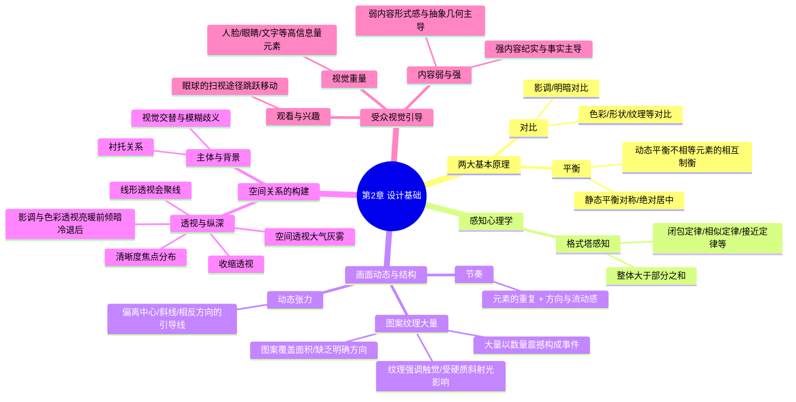

# 第二章“设计基础”

### 第二章：设计基础 (Mermaid 图形化)

### 核心结构解析（底层逻辑）

**1. 两大基本设计原理**

- **对比 (Contrast)**：这是构图的基石，不仅控制了影像造型的强度，也决定了影像的结构和受关注的部分。包豪斯的约翰尼斯·伊顿提出，对比（如大/小、亮/暗、连续/间歇）是构成图像的基础。
- **平衡 (Balance)**：眼睛总是设法寻找张力的平衡。静态平衡（对称）显得稳定但容易乏味，而动态平衡（如用远离中心的小物体平衡中心的大物体）能使影像更加生动活泼。

**2. 视觉感知心理学**

- **格式塔感知 (Gestalt Perception)**：认为整体大于其各组成部分之和，大脑会根据接近、相似、闭包等定律将零散的视觉信号组织成有意义的整体。

**3. 画面的动态与结构**

- **动态张力 (Dynamic Tension)**：利用斜线或引导眼睛走出画面的结构来保持视觉警觉，这是一种未确定的张力。
- **节奏 (Rhythm)**：重复的元素加上眼睛扫描的“方向与流动”，能产生动势和延续感。
- **图案、纹理与大量 (Pattern, Texture, Mass)**：图案覆盖面积且具有内在静止感；当数量增加到单个元素难以分辨时就成为纹理（与触觉相关，需斜射硬光展现）；而巨大的数量本身就能让人产生惊叹的视觉感染力。

**4. 空间关系的构建（二维转三维）**

- **主体与背景 (Subject and Background)**：通常主体在前，背景在后起衬托作用。但当两者反差极大且面积相等时，会产生视觉交替的模糊感，从而增添视觉张力。
- **透视与纵深 (Perspective and Depth)**：这是影响照片写实性的关键。除了线形透视（广角镜头会夸大线条会聚）和收缩透视外，还包括空间透视（利用大气灰雾）、影调透视（明亮物体显前）、色彩透视（暖色前倾、冷色退后）以及清晰度控制。

**5. 受众的视觉引导**

- **视觉重量 (Visual Weight)**：某些高信息量主体（如人脸关键部位、文字）具有天然吸引注意力的“重量”，能决定照片被观察的方式。
- **观看与兴趣 (Viewing and Interest)**：眼睛通过“扫视”在兴趣点间快速跳跃移动，不同的期望（无意识观看或带任务观看）会产生不同的视觉扫描途径。
- **内容，弱与强 (Content, Weak and Strong)**：强烈的事件内容（如新闻杀戮场景）往往让位于直接表达，而较弱或平淡的内容则给摄影师留下了通过抽象形式感进行创造的机会。

## 对比

### 模块笔记内容填写示范（以“对比”为例）

**1. 核心概念定义：** 对比控制了影像造型的强度，也决定了影像的结构和受关注的部分。在明暗、形状、颜色甚至于感觉之间的对比，是构成一幅图像的基础。它不仅限于光影，还包括大/小、长/短、光滑/粗糙、透明/不透明等多维度的反差。

**2. 底层逻辑：**

- **视觉原理：** 眼睛总是设法寻找张力的平衡，而两个相互对比的对立元素能相互加强，从而使画面结构更具张力与活力。
- **心理暗示：** 强烈的对比（如单一与大量、明与暗）能够唤醒个人的敏锐观察，迅速确立画面的视觉焦点，决定观众第一眼看向哪里并探索设计领域的手段。

**3. 场景与避坑：**

- **适用场景：**
    - **“多与少”对比：** 第一印象可以是一大堆东西里，有一件在某方面有些不同，因而脱颖而出；也可以是一大堆东西旁边有一件同样的东西，单独而孤立地出现。
    - **“明与暗”对比：** 用光线照亮黑暗背景前的主体，产生戏剧性造型和强烈的结构感。
- **避坑指南：**
    - **避免生搬硬套：** 对比是艺术训练与设计的基石，但切忌纯粹为了对比而对比。
    - **警惕失去平衡：** 对比会产生张力，如果未能妥善安排对比元素（如体积相差悬殊但位置安排失衡），画面会显得摇摇欲坠、失去和谐。

**4. 视觉图库：**

![[image-380.png|480]] ![[image-381.png|1085x1100]] ![[image-382.png|1104x1197]]

_(在此处粘贴两张具有强烈反差概念的对比图：一张是为了最大程度表现数量感、将晾晒鱼干完全充满画面的“很多”照片；另一张是使用广角镜头增加透视感、将水面上一条废弃小船与远岸分离的“单一”照片)_

**5. 刻意练习本周计划：**

本周进行“发现对比”专项练习：参考包豪斯的设计训练，用你的眼睛去感知日常环境。寻找并拍摄三组包含明显对比的照片：第一组拍“大/小”的体积对比，第二组拍“光滑/粗糙”的材质对比，第三组拍“多/少”的数量对比。观察在同一画框内，对立元素是如何相互强化并死死抓住你眼球的。
