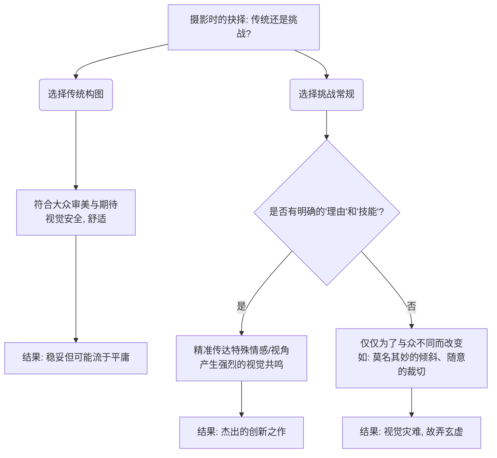
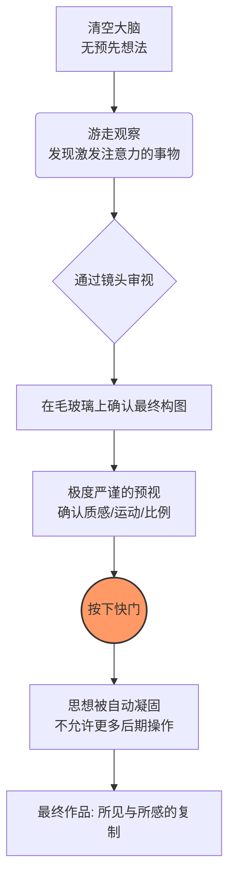
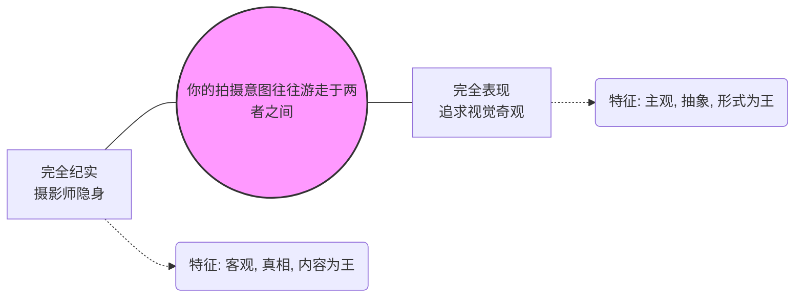

# 第五章 意图

“个简单的 例子,是尽可能地让大多数人满意,还 是要与众不同、出人意料?意图甚至不 需要那么明确,它可以是一种难以表达 的个人喜好。不管怎样,在你做构图的 决定之前,应该知道你想要什么。” ([pdf](zotero://open-pdf/library/items/99BEV7U3?page=129&annotation=BDSLLLV8)) |  

“摄 影更多地用于 大众 传媒,而不是 美术” ([pdf](zotero://open-pdf/library/items/99BEV7U3?page=129&annotation=69DETIE6)) |  

“克服完全无意识地拍 摄照 片的安逸感。” ([pdf](zotero://open-pdf/library/items/99BEV7U3?page=129&annotation=IHHFBPT6)) |  

“关 键是要随时记 得你出 来干 什么,什么样的结果可能让你满 意。” ([pdf](zotero://open-pdf/library/items/99BEV7U3?page=129&annotation=S5M42NVG)) |  

## 📸 摄影笔记：传统与挑战（摄影意图的抉择）

### 1. 核心概念定义：观众期待 vs. 个人表达

- **传统（待在期待内）：** 遵守大众熟悉的构图规则（如三分法、黄金分割、居中对称），拍出让人感到“舒服、好看、安全”的照片。
- **挑战（打破期待）：** 脱离常规的构图视角，给观众带来视觉上的“惊奇感”或“陌生感”。
- **核心抉择：** 作为摄影师，你最重要的决定之一，就是你打算在多大程度上满足观众的期待，或者在多大程度上打破它。

> 💡 **通俗类比：**
>
> **“传统构图”**就像是穿一套剪裁得体的**黑西装**，绝对安全、得体，所有人都觉得好看，但很难让人惊艳。
>
> **“挑战构图”**就像是穿一身**奇装异服**去走红毯。穿得好叫“先锋时尚”（有理由、有技巧的挑战），穿得不好就是“哗众取宠”（为了不同而不同的糟糕目标）。

### 2. 底层逻辑：为什么“为了不同而不同”是灾难？

![[image-438.png|1197x1202]]

- **传统构图的底层逻辑：** 传统方法之所以成为传统，是因为它们在视觉心理学上被证明是有效的，能让人轻易感知到画面的和谐与美感。
- **挑战构图的底层逻辑：** 打破常规是为了**更精准地传达某种特殊的情绪、气氛或故事**。
- **致命误区：** 摄影界有一种鼓励独创性的倾向，但最大的危险在于“仅仅为了与众不同而与众不同”。如果没有充分的理由和扎实的技能支撑，刻意追求与众不同只会导向一个糟糕的结果。

代码段



### 3. 场景与避坑：何时守规矩，何时破规矩？

![[image-439.png|1185x1089]]

- **适用场景（传统）：** 商业风光摄影、旅游纪念照、产品图。例如：在天气晴朗的早晨，用经典构图拍摄一张白雪皑皑的富士山，完美契合大众对“美”的期待。
- **适用场景（挑战）：** 纪实摄影、艺术表达、情绪传达。例如：为了展现苏丹甘蔗工人在大火熏黑的甘蔗林中令人窒息的劳作环境，使用极低视角的广角镜头，配合暗调和闪光灯，打破常规构图来传递压抑感。
- **避坑指南（新手重灾区）：**
    - **“荷兰角”滥用：** 很多新手为了追求“动感”，盲目将相机倾斜 45 度拍摄人像或建筑。如果没有明确的视觉引导理由，这只会让观众治好多年的颈椎病，并不会让照片变得高级。
    - **瞎切主体：** 故意把人物的半个头切掉放在画框边缘。如果是为了表现“压抑/边缘化”，这是好构图；如果只是觉得这样“很酷”，这就是废片。

### 4. 视觉图库 (脑海演练)

- 🖼️ **图一（传统·安全）：** _(想象一张风景明信片)_ 一张完美的“三分法”风光照。地平线笔直，夕阳在左上角的黄金交叉点，水面有完美的倒影。看着很舒服，但也仅此而已。
- 🖼️ **图二（挑战·创新）：** _(想象书中的努巴村落照片)_ 夕阳下的村落，摄影师反常地将最主要的人物完全挤压在画面的**最左上角**。这种极端偏离中心的构图之所以成立，是因为画面的右下方大面积精美的茅草屋顶图案需要被完整展现，以此建立强烈的视觉平衡。

### 5. 刻意练习

- **本周计划（同场景双拼练习）：**

    1. **打安全牌：** 去附近的一个公园或街道，找一个主体（如一张长椅、一个路标），用最标准的“三分法”或“居中对称”拍一张绝对平稳、好看的照片。
    2. **寻找理由的破坏：** 面对同一个主体，给自己设定一个情绪词（比如：孤独、压抑、或者滑稽）。然后打破传统构图（比如极端的边缘构图、大面积留白），用这种“不常规”的构图去体现你设定的情绪。
    3. **对比反思：** 把两张照片放在一起，问问自己：第二张的“与众不同”是否有说服力？

关于如何平衡摄影中的“常规”与“个性”，你目前在日常拍摄中，是更倾向于拍出让大家觉得好看的“安全牌”，还是经常尝试一些奇奇怪怪的视角？

## 📸 摄影笔记：反应或计划（以爱德华·韦斯顿为例）

### 1. 核心概念定义

![[image-440.png|1476x1127]]

- **反应 vs. 计划：** 摄影创作时，是应该带着预先画好的草图（计划）去寻找画面，还是清空大脑、依靠现场环境激发灵感（反应）？
- **韦斯顿的“反应论”：** 摄影大师爱德华·韦斯顿声称，他依赖的是现场的“反应”，而不是依照事先的计划去工作。他一开始并没有预先的想法，而是等待那些能激发他注意力的事物出现。

> 💡 **通俗类比：**
>
> 依靠“计划”拍照，就像是**建筑师盖楼**，先有图纸，再找砖瓦，按部就班；
>
> 依靠“反应”拍照，就像是**爵士乐手即兴独奏**，没有固定的曲谱，完全根据现场的氛围和乐感做出最本能、最敏锐的反应。

### 2. 底层逻辑

- **看似矛盾的极致严谨：** 韦斯顿虽然强调“反应”，但他实际上会花上数小时使用自然光进行曝光，并且对构图有着极其严格的要求。这说明“反应”绝不是随手乱拍，而是建立在极致的观察力之上。
- **“所见即所得”的预视能力：** 他的逻辑是：发现目标 ➔ 通过镜头重新审视 ➔ 在相机的毛玻璃上确认最终的表现形式。他在按下快门前，就已经在脑海中完全预知了放大后的照片在质感细节、运动和比例上的表现。
- **快门即终点（凝固思想）：** 快门释放的瞬间，摄影师的想法就被自动凝固了，此后不允许再有任何更多的操作（比如后期裁剪或修图）。最终的照片，仅仅是他通过相机所见与所感的简单复制。

代码段



### 3. 场景与避坑

- **适用场景：** 大画幅风光、静物特写、环境肖像。适合你有充足的时间去观察自然光线、死磕构图，将个人情感与眼前景物完全融合的时刻。
- **避坑指南：**
    - **误把“瞎拍”当“反应”：** 很多人以为不计划就是走到哪算哪、一通连拍。真正的“反应”是像狙击手一样，平时训练有素（对光影构图极度敏感），等待猎物出现时一击必中。
    - **患上“后期依赖症”：** 现在很多人拍照想着“先拍下来，回去再靠裁剪和修图拯救”。韦斯顿的哲学提醒我们，快门释放就意味着操作“最终”结束，不再允许更多修改。前期拍废了，后期也救不回来。

### 4. 视觉图库 (脑海演练)

- 🖼️ **图一（严谨的观察）：** _(想象一个摄影师在荒野中)_ 摄影师支着三脚架，躲在厚厚的遮光布里盯着相机的毛玻璃。他花了几个小时静静等待太阳移动，只为让一束自然光完美勾勒出岩石的质感。
- 🖼️ **图二（凝固的瞬间）：** _(想象一张极具质感的黑白青椒特写)_ 画面没有任何后期裁剪的痕迹，每一个高光、每一丝纹理的比例都恰到好处。这张照片就是摄影师按下快门那一刻，眼睛所见与内心所感的绝对复制。

### 5. 刻意练习

- **本周计划（“一刀不剪”的预视练习）：**

    1. 带上相机或手机（推荐使用定焦镜头），去附近的街道或植物园。
    2. **放弃计划：** 不要预设“我今天要拍一朵花”或“我要拍个建筑”。
    3. **感受反应：** 漫无目的地走，直到某个光影或质感突然打动你。
    4. **死磕取景框：** 在取景框里反复微调，确保四个边角干干净净，质感和比例完全符合你的预期。
    5. **按下快门的承诺：** 告诉自己“一旦按下快门，绝不后期裁剪，绝不二次构图”。拍下这张代表你“所见与所感”的照片。

## 📸 摄影笔记：纪实或表现（探索世界 vs. 探索自我）

### 1. 核心概念定义

![[image-441.png|1116x878]]

- **纪实（探索世界）：** 渴望外出发现人们、事物和地方“到底是什么样的”。核心目标是**记录真实**，在最初的定义中，它强调“摄影师自身的相对缺席”，追求客观真相。
- **表现（探索想象力）：** 有一种探究“自己通过相机能做些什么”的冲动。渴望创作独一无二的视觉影像，而**不在乎主体到底是什么**。“我拍照是想看看，有些东西拍下来是什么样。”

> 💡 **通俗类比：**
>
> **纪实摄影**就像是做一面**“透明的窗户”**：你希望观众透过这扇窗，清清楚楚地看到窗外的世界发生了什么。 **表现摄影**就像是做一面**“哈哈镜”或“万花筒”**：你不在乎原来那个东西长什么样，你在乎的是光线经过你的镜头折射后，能变幻出多么奇妙、抽象的新图案。

### 2. 底层逻辑：意图的光谱

![[image-442.png|1100x1105]]

- **没有绝对的纯粹：** 摄影的复杂之处在于，绝对纯粹的纪实或表现是不存在的。即使是纪实记录，摄影师的取景框也包含了个人的“解释”；而表现主义摄影，也必须依赖现实中的“内容”作为载体。
- **侵略性的“摄影眼”：** 无论偏向哪一端，摄影师的眼睛通常都带有“侵略性”。正如沃克·埃文斯（Walker Evans）所说，摄影就像是捕捉秘密：“仿佛在某个地方有一个精彩的秘密，而我可以获取它。只有我，在这个时刻，可以获取它。”

代码段



### 3. 场景与避坑

- **适用场景（纪实）：** 新闻纪实、街头人文、家庭老照片、废墟/历史遗迹归档（如记录一座即将被移交的百年庄园原本的样子）。这时候，形式要让位于内容。
- **适用场景（表现）：** 艺术摄影、微距抽象、极简主义建筑、长时间曝光的光轨。这时候，现实的线索被剔除，图形和色彩成为主角。
- **避坑指南：**
    - **不要“张冠李戴”：** 如果你的目的是纪实（比如新闻摄影），就不要过度使用夸张的滤镜、极端的倾斜或强烈的后期去“表现”自我，这会破坏真实性。
    - **不要用“表现”掩盖平庸：** 很多新手拍了一张毫无内容、构图混乱的废片，却强行解释为“这是我的主观艺术表现”。真正的表现摄影，在视觉形式上必须是极致且有说服力的。

### 4. 视觉图库 (脑海演练)

- 🖼️ **图一（纪实·探索世界）：** _(想象一张沃克·埃文斯拍摄的美国大萧条时期的农妇肖像)_ 没有任何花哨的打光和奇怪的角度，就是极其清晰、平实地记录下她脸上的皱纹、贫穷的衣着和骄傲的姿态。照片的价值在于“真实”。
- 🖼️ **图二（表现·探索相机能做什么）：** _(想象一张夜晚的城市流光)_ 摄影师根本不在乎拍的是哪条街、哪辆车。他故意转动相机并使用慢门，把车灯拉成了一圈圈绚丽的红色和黄色光轨。照片的价值在于“相机的视觉魔法”。

### 5. 刻意练习

- **本周计划（“一物两拍”意图分离练习）：**

    1. 在家里或小区找一个最寻常的物体（例如：一辆停着的旧自行车，或一个垃圾桶）。
    2. **扮演“纪实者”：** 退后一步，平视拍摄。交代清楚它是什么、它停在哪里、它周围的环境是什么。追求客观、清晰（记录世界）。
    3. **扮演“表现者”：** 走近它，或者趴下、躺下。寻找它身上生锈的纹理、局部的反光，或者用极端的景深只拍一个车把手。试图让观众第一眼认不出它是自行车，只觉得这幅画面的几何线条很有趣（探索相机能拍成什么样）。

在平时的拍摄中，你觉得自己是更偏向于“拿着相机去记录真实的生活”，还是更偏向于“用相机去创造一些肉眼看不到的奇妙画面”呢？

## 简单或复杂

### 1. 核心概念定义

- **概念：** 摄影构图中的“简单”与“复杂”是两种截然不同的创作意图。**简单=做减法**，追求“少即是多”，从混乱中建立秩序；**复杂=做加法**，在密集的结构中建立多层次的联系，提供丰富的视觉探索空间。

- **参数：** 视点选择、镜头焦距、后期裁剪比例，以及画面元素的几何关联度。

### 2. 底层逻辑

- **光学与构图原理：**

    - **极简法则：** 现实世界通常是杂乱无章的。减少杂乱最简单的物理手段就是“剔除无用的东西”——你可以通过**靠近、改变视点、使用长焦**或**后期裁剪**来实现。它进一步发展就是“抽象化”，即剥离现实线索，只保留点、线、面。

    - **复杂法则（完形心理学）：** 当画面中的兴趣点（如人物、招牌、光影）增加到一定程度时，只要通过某种内在结构（如对角线、色彩呼应）将它们排列得当，这些分散的元素就会融合成“一片”整体的图像，就像无数滴水汇成了一条河流。

- **心理暗示：**

    - **极简**给人以精确、现代、纯粹的秩序感，强迫观众聚焦于主体的本质特征。

    - **复杂**则像给观众出了一道“视觉解谜题”。它鼓励观众的眼睛在画面中多停留、多游走，满足人们探索细节的偷窥欲和成就感。

### 3. 场景与避坑

- **适用场景：**

    - **用“简单”：** 当你身处极其杂乱的日常环境时，通过局部特写提炼几何美感；或者拍摄具有现代感的人造结构、静物特写时。

    - **用“复杂”：** 拍摄街头人文纪实（如熙熙攘攘的市场、复杂的市井生活），需要生动交代人物与复杂环境的多重关系时。

- **避坑指南：**

    - **极简的坑（为简而简）：** 简单的构图极度依赖形式感。如果照片没有有趣的线条、光影或特殊的质感支撑，过度简化就会变成“无聊”和“空洞”，让人看一眼就想划走。

    - **复杂的坑（乱作一团）：** 在追求“复杂”时，如果没有找到内在的几何秩序或视线引导，复杂的成分不能相互关联，照片就会变成毫无重点的“视觉垃圾堆”。

### 4. 视觉图库

- _[ 🖼️ 极简风格示范：一张利用几何构造、将边缘精确对齐的胶片局部特写。画面剔除了所有环境线索，刻意模糊了主体，只凸显出折痕和线条，获得了极端的简化。 ]_

- _[ 🖼️ 复杂风格示范：一张印度斋普尔的街头人文照。高反差的阳光、浓烈的色彩、众多的人物和招牌在多个层面上相互关联，虽然元素密集繁复，但乱中有序，目光在画面中游走却不会迷失。 ]_

### 5. 刻意练习

- **本周计划：** 周末去一个视觉元素极其丰富的地点（如早市、杂货铺或凌乱的厨房）。

    - **Step 1（挑战复杂）：** 退后一步，用广角镜头拍一张包含多个元素的照片（摊主、顾客、成堆的商品、招牌）。尝试利用光影明暗或引导线，把这些杂乱的元素组织起来，力求“乱中有序”。

    - **Step 2（回归简单）：** 站在同一个地点，向前走两步或换用长焦镜头。通过改变视点和裁剪，只拍摄画面中的一个小局部（比如排列整齐的几只番茄，或一束打在塑料布上的光）。剔除所有无用信息，得到一张极简照片。

    - **复盘：** 对比两张照片，体会“做加法”带来的丰富感与“做减法”带来的纯粹感。


## “清晰或模糊

### 1. 核心概念定义

- **概念：** 构图意图中的“清晰”代表信息传达直接、强烈、一目了然；“模糊”则代表画面带有不确定性或悬念，需要观众放慢阅读速度去思考和探索。

- **参数：** 画面内容的交代程度、非传统构图（如只拍影子）、情绪的复杂性，以及画外空间的暗示。

### 2. 底层逻辑

- **完形心理学（观众参与）：** 艺术史学家贡布里希提出，影像阅读的关键在于“旁观者参与”。当照片的意义不那么明显时，观众的大脑会努力去补全缺失的信息，这极大地延长了观看体验。

- **类比（听笑话效应）：** 一张“模糊”的照片就像一个高级的冷笑话。如果别人把笑点直接解释给你听（清晰），你会觉得没意思；但如果你自己稍微动点脑筋想通了（模糊），你会获得一种智力上的成就感与满足感。

- **标题的辅助作用：** 标题是帮助观众解决模糊性的一种手段，它改变了影像、作者与观众之间的关系，但如果给的信息太少会让人沮丧，给得太多又会破坏悬念。

代码段

```
graph TD
    A[照片的表达方式] --> B(清晰直白)
    A --> C(模糊/悬念)
    
    B --> D[信息一目了然]
    D --> E[观众看完迅速离开]
    
    C --> F[产生疑问: 这是什么/发生了什么?]
    F --> G[观众调动想象力参与解谜]
    G --> H[解开悬念: 获得智力成就感]
    H --> I[视线长久停留, 产生深刻印象]
```

### 3. 场景与避坑

- **适用场景：**

    - **用“清晰”：** 报道摄影、新闻纪实，需要瞬间抓取并直接传达全部事件信息时（如男人在酒吧喝下第一口啤酒）。

    - **用“模糊”：** 想要创造故事感或神秘感时。例如拍摄人物指向画框外的动作，让观众猜测画外有什么；或者拍摄人物复杂的面部表情，让人猜测她的情绪。

- **避坑指南（交通事故）：** 追求“模糊”时不能故弄玄虚。贡布里希警告过，如果线索给得太少，导致观众完全猜不透而放弃观看，这就造成了“艺术家和旁观者之间道路上的交通事故”。

### 4. 视觉图库

- _[ 🖼️ 清晰风格示范：阿姆斯特丹酒吧里的男人。光线集中在啤酒上，瞬间抓取精准，影像表达快速且有效，没有任何需要进一步考虑的悬念。 ]_

- _[ 🖼️ 构图模糊示范：粉刷船体的工人。不直接拍摄工人本身，而是拍摄斜射阳光在船体上留下的巨大且略带变形的清晰影子，比直白的记录更有趣。 ]_

- _[ 🖼️ 内容模糊示范：亚当之峰的山顶。照片中数百人聚集在一起，目光全都指向画框外部。如果没有标题解释他们在“等待日出”，观众会产生强烈的疑问与好奇。 ]_

### 5. 刻意练习

- **本周计划：** 周末去公园或广场，寻找一个正在进行明确动作的人（比如跳广场舞的大妈或玩滑板的少年），进行“一明一暗”的拍摄对比。

    - **Step 1（直白记录）：** 正面拍摄一张动作清晰、主体完整、环境交代清楚的照片。

    - **Step 2（制造悬念）：** 尝试改变视角来制造“模糊”。比如只拍摄他们在墙上的倒影；或者只拍摄他们极具局部特征的脚部动作；又或者把焦点对准旁边正在围观惊讶的观众，让主体在焦外虚化。

    - **复盘：** 发给朋友看，观察他们在哪张照片上停留的时间更长、问的问题更多。

**互动思考：**

在日常拍摄中，你是不是也曾不自觉地拍下过某种具有“悬念”的照片？下次拍摄时，你准备尝试隐藏哪些显而易见的信息，来给观众出一个“视觉解谜题”呢？