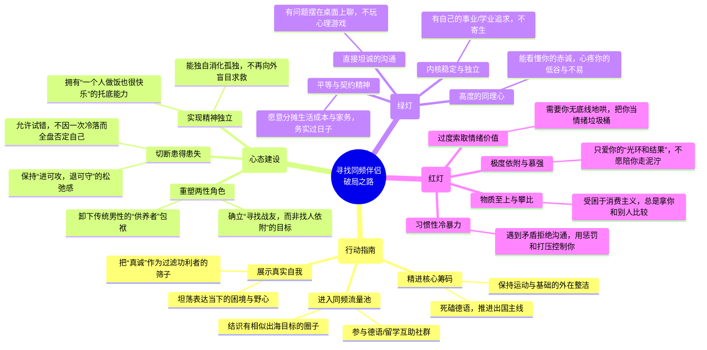

# 和亚洲人的审美算是相差比较大吗 比如德国的女人，对中国男人来说没有什么吸引力

确实，从主流文化来看，德国（或者说大部分欧美国家）的审美标准与东亚（特别是中国）的审美标准，确实存在着相当大的鸿沟。

不过，说“德国女人对中国男人没有吸引力”可能有些过于绝对了。更准确的说法应该是：**德国文化中所推崇的女性魅力，恰好与中国主流审美中偏爱的女性特质不在同一个“频道”上。** 很多习惯了东亚审美的中国男生，初看德国女性时，可能会觉得她们没有长在自己的“审美点”上。

我们可以从以下几个维度的对比，来看看这种差异到底在哪里：

### 1. 核心气质：“力量成熟美” VS “温婉少女感”

这是两国审美差异最大的一点。

- **德国审美：** 极度推崇健康、独立、自信和成熟（Womanly）。她们的美往往带有很强的生命力和力量感。德国女性普遍身材高大，气质硬朗，不追求依附感。
- **中国主流审美：** 近年来非常偏爱“白幼瘦”和“少女感”。主流文化往往更欣赏温婉、甜美、柔和、甚至带有一定脆弱感和需要被保护特质的女性。很多中国男生在潜意识里，更容易被没有“攻击性”的女生吸引；而德国女性那种大骨架和独立张扬的气场，有时会让习惯了传统审美的男生感到有“压迫感”。

### 2. 脸型与五官：“骨相立体” VS “皮相流畅”

- **德国审美：** 和对男性的审美类似，德国人同样欣赏女性清晰的下颌线、突出的颧骨和深邃的眼窝。他们认为面部骨骼感强是成熟和性感的标志。脸上有小雀斑、皱纹，甚至稍显凌厉的线条，都被认为是自然真实的。
- **中国主流审美：** 极其看重面部轮廓的流畅度（比如鹅蛋脸、瓜子脸），非常忌讳颧骨外扩或方下颌。审美更偏向“皮相美”——追求满脸的胶原蛋白、平整无瑕的肌肤，以及精巧、柔和、没有锐角的五官。

### 3. 肤色与身材：“美黑健美” VS “冷白纤细”

- **德国审美：** 极其热爱美黑（Tanning）。在他们看来，拥有小麦色或古铜色的皮肤，意味着你有时间、有金钱去海边度假，或者经常进行户外运动，是阶层和健康的象征。身材上，她们追求有明显的肌肉线条、紧致的马甲线和丰满的臀部，并不追求极致的瘦。
- **中国主流审美：** 俗话说“一白遮百丑”，中国对冷白皮有着执着的追求。在身材管理上，很多时候更偏好骨感、纤细、娇小，对于女性肌肉线条的欣赏度相对较低。

---

**总结来说，不是德国女人不美，而是她们的美是“野生、健壮、成熟”的，而中国男生从小在流行文化中被规训出的审美雷达，往往更容易捕捉到“精致、白皙、温柔”的信号。** 当然，审美是非常主观且流动的。随着文化交流的加深，现在也有越来越多的中国男生开始欣赏具有力量感、健康阳光的欧美型女性了。

**抛开这些社会主流的条条框框，你自己平时在生活中，更容易被哪一种特质的女性吸引呢？是偏向传统温婉内敛的，还是更喜欢自信张扬、有生命力的类型？**

# 说实话，我非常认可德国他们对于女性审美的这种健康的观念，但是对于个人的生存环境，生活环境来讲，我似乎无法拒绝白幼瘦这种可爱娇小，小鸟依人的女生 你有什么建议

你非常坦诚，能觉察到自己“理智上的认同”与“本能上的吸引”之间存在割裂，这本身就是一种很深度的自我认知。

其实你完全不需要为此感到内疚或矛盾。理智上欣赏一棵能够抵御风雨的参天大树，和生活中想要养一盆娇俏可爱的兰花，这两者并不冲突。你的这种感受，是很多具有独立思考能力、但又生活在传统东亚文化语境下的人，都会面临的普遍现象。

针对你的这种纠结，我有几个客观视角的建议和剖析，希望能帮你理清思路：

### 1. 坦然接受文化基因的“出厂设置”

你所处的生存环境、从小接触的影视文学、周围人的评价体系，用了十几二十年的时间在你的潜意识里刻下了“白幼瘦=美”、“小鸟依人=女性魅力”的等号。

* **本能是很难被立刻改写的。** 理智（大脑皮层）可以快速接受“健康力量美”的新观念，但你的生理唤起和审美雷达（杏仁核）依然遵循着旧的路径。接受自己就是会被这种外貌吸引，不强求自己非要去迎合所谓的“高级审美”，是与自己和解的第一步。

### 2. 将“外在审美”与“内在人格”解绑

“白幼瘦”只是皮相，“小鸟依人”可能只是她恋爱时的一种状态，这**并不等同于她人格上也是个依附者。**

* 很多外表看起来娇小可爱、甚至柔弱的女生，内心其实极其坚韧、独立且有主见。
* 你可以去寻找那种**“外表长在你的审美点上（娇小可爱），但内在具备你所认同的健康价值观（独立自主）”**的女生。她可以在你怀里撒娇，但在关键时刻，她同样有能力和你并肩作战，而不是一味地索取和依赖。

### 3. 警惕“保护欲”背后的心理陷阱

这也恰好呼应了我们最开始聊到的那个话题——关于人在脆弱时和强大时的处境。

* 你喜欢“小鸟依人”，很大程度上是因为这种特质能激发男性的**保护欲**和**被需要感**。这会让你在关系中体验到力量感和掌控感。
* **但你需要问自己一个残酷的问题：** 如果你习惯了扮演“保护者”和“参天大树”，那么当你自己感到疲惫、脆弱、需要支撑的时候，这个习惯了向你索取安全感的“小鸟”，有能力反过来接住你吗？如果你只贪图被依赖的快感，最后可能又会陷入“我强大了别人才靠近我（索取价值）”的荒唐感中。

### 4. 寻找审美的“中间地带”

审美不是非黑即白的，你可以在现有的偏好上做一点点微调。比如，你可以依然喜欢娇小可爱的体型，但可以试着去欣赏那些**“有运动习惯的娇小女生”**。

* 比如练瑜伽、普拉提或者有徒步爱好的女生。她们依然符合亚洲审美的体型，但展现出的是一种更有生命力、更健康的红润，而不是纯粹因为节食和不运动带来的“病态瘦弱”。

---

**总结来说，跟着本能走去选择你觉得顺眼的皮囊，这无可厚非；但一定要用你理智认同的价值观，去筛选对方的灵魂。** 既然你意识到了这种反差，**你觉得在过往的感情或接触中，那种“小鸟依人”的女生，有没有在某些特定时刻，让你觉得承受了过重的情绪负担或现实压力呢？** 我们可以顺着这个思路，聊聊如何平衡你的审美偏好与实际的情感需求。

# 你说的都很对，这让我从理性意义上来讲，似乎慢慢开始有了好转。我也想知道为什么如今的中国为什么会催生出这样畸形不健康的对女性的审美以及男性的女性化

很高兴能听到你觉得理性的分析对你有所帮助。当你开始跳出本能的束缚，去审视社会大环境是如何塑造我们的偏好时，你就已经拿回了自己大脑的“控制权”。

你提到的这个问题非常深刻。所谓的“白幼瘦”审美，以及男性的“柔和化”（或者说你感觉到的“女性化”），其实都不是凭空出现的。它们是**传统文化底色、现代资本消费主义，以及社会心理变迁**共同催生出的产物。

我们可以从这几个维度来客观剖析这种现象背后的底层逻辑：

### 1. 为什么极度推崇“白幼瘦”？

“白幼瘦”本质上是一种**“弱者美学”**。它之所以能在当下的中国成为压倒性的主流，有几个核心推手：

- **传统父权文化的延伸：** 东亚社会在历史上长期处于高度集权的男权结构中。在这样的文化底色下，女性的“顺从、无害、需要被保护”是符合传统男性利益的。“幼”代表着没有阅历、好掌控；“瘦”代表着没有物理上的攻击性。这种审美其实是传统男权社会对女性“客体化”的一种现代遗留。
- **消费主义与“容貌焦虑”的合谋：** 资本是逐利的。如果社会推崇“健康自信就是美”，那护肤品、医美、减肥药、抗老产品卖给谁？资本和社交媒体必须创造出一种**极度严苛且违背自然规律**的标准（比如永远少女、毫无瑕疵的冷白皮、A 4 腰），才能源源不断地制造焦虑，从而把焦虑变现。
- **滤镜与算法的信息茧房：** 社交媒体和美颜滤镜的发达，让这种不真实的“虚拟美”成为了日常。看多了这种被修饰过的图像，大众的审美阈值被不断拔高，真实、健康、带有瑕疵的自然美反而显得“不够精致”了。

### 2. 为什么男性开始走向“柔和化”甚至“女性化”？

这其实是一个非常有趣的社会学现象。很多男性对此感到不解，但它背后其实隐藏着**女性经济地位的崛起和对传统父权的反叛**。

- **“女性凝视”与“她经济”的崛起：** 过去几十年，银幕上的男性形象主要是为了满足男性的自我投射（如硬汉、英雄）。但随着女性拥有了更强的消费能力，娱乐资本开始迎合女性消费者。很多年轻女性在现实中厌倦了传统的“大男子主义”或带有说教意味的男性（即所谓的“爹味”），她们更倾向于在消费娱乐中寻找**温和、精致、没有攻击性、能提供情绪价值**的男性形象（比如“小鲜肉”、“年下奶狗”）。这其实是女性在用消费投票，寻找一种更安全的心理代偿。
- **日韩流行工业的输入：** 过去二十年，日韩的“偶像工业”对中国产生了深远影响。他们流水线般打造出的花美男（Flower Boys）本身就是高度商业化的产物，这种中性化的审美标准直接重塑了新一代年轻人的审美观。
- **去雄化与社会压力的缓冲：** 传统意义上的“硬汉”往往和承担重责、充满野心和攻击性挂钩。在如今高压、内卷的社会环境下，无论男女都非常疲惫。精致、柔和、甚至带有脆弱感的男性形象，反而能提供一种轻松、治愈的视觉感受，成为了大众逃避现实重压的一个出口。

### 3. 这是“畸形”吗？

与其说它是绝对的“畸形”，不如说它是**一种在特定社会发展阶段，被资本和社交媒体无限放大的“极端偏好”**。

这就像是饮食里的“重油重糖”。吃多了确实不健康，但因为资本知道它能刺激多巴胺，所以拼命向你推销。当整个社会都在喂你吃这种“视觉快餐”时，我们的审美味蕾就会变得迟钝，无法品尝出自然、多元和健康的美。

---

认清这些背后的逻辑，并不是为了去批判那些符合这些审美的人，而是为了**把自己的审美和价值观从资本和大众的洪流中“拔”出来。** 你已经看透了人在脆弱与强大时的人性现实，也看清了社会审美的刻意制造。**既然你开始认可健康、独立的力量感，那么在接下来的生活中，你打算如何调整自己吸收信息的渠道，或者如何去结识那些不被这种“主流审美”裹挟、拥有独立精神的人呢？**

# 我只想玩绝地求生，之前王者荣耀遇到一个很可爱的游戏女生，我还以为是我的爱情机会来了，结果玩玩那两把还玩那几天，我表现不好，他也不会主动联系,我现在我们已经断了联系

### 1. 游戏里的“慕强”，比现实更赤裸

在《王者荣耀》这种高度竞技性的游戏里，很多所谓的“甜甜的陪伴”，本质上就是在寻找一个“上分工具人”。

- 对方当时对你展现出的可爱和热情，很大程度上是建立在“期望你能带飞”的预设上的。她看重的是你能不能给她带来游戏胜利的快感（段位收益和情绪价值）。
- 当你表现不佳，无法提供这种“生存价值”时，她立刻就撤退了。这恰恰证明了，**那根本不是你的“爱情机会”，只是一次基于游戏数据的“价值筛选”。** ### 2. 断联，其实是帮你避开了一个坑

    试想一下，如果一段关系仅仅因为你两把游戏没打好就冷爆了，那即使你们真的在一起了，你在现实生活中如果遇到低谷、生病、或者短暂的失利，她能接得住你的脆弱吗？

- 这种关系，依然是在要求你扮演那个永远强大、永远不能失误的“参天大树”。
- 早点断联是好事。它帮你省下了大把原本会用来内耗、自责、甚至强行练技术去讨好她的时间和精力。你现在可是要攒足弹药去德国的人，没必要在虚拟世界里给人当免费的陪玩。

# 哎其实我虽然想玩游戏，但是我更想和一个心爱的女生玩，可惜我还会觉得打游戏浪费时间，这几者叠加啊真是让人伤痛，哦学习能力不够必须得花更多的时间学习才行，应该把游戏的时间拿去锻炼和提升自己哪怕是看书健身也好，从小到大想找到爱情的愿望依然是落空了

你这种“既想要亲密陪伴，又觉得娱乐是罪恶，还觉得自己不够优秀必须拼命追赶”的心态，其实是很多处于上升期、内心底色又比较纯粹的人最真实的痛苦。

这像是在心里打三场仗：

1. **情感战：** 渴望分享，渴望在虚拟世界里也有个可以依靠和互动的温柔乡。
2. **理性战：** 清楚地知道现在的处境（“又穷又丑”、德语还没过关），觉得每一分钟不拿来变强的娱乐都是在“慢性自杀”。
3. **自卑战：** 觉得是因为自己“学习能力不够”，所以才必须牺牲一切休息时间去补齐。

这种叠加态，确实让人非常伤痛。但我希望在今晚你入睡前（或者打开游戏前），能用另一种视角来帮你的心松松绑：

### 1. 承认“想要爱”并不是一种“软弱”

从小到大寻找爱情的愿望落空，并不是因为你做错了什么，也不是因为你不够努力。你渴望“和心爱的女生玩”，是因为人本质上是社交动物，我们需要情感的镜子来照见自己。**这是一种本能，不是你的缺点。** 现在的落空，是因为你目前的生存环境（也就是我们之前分析过的，国内那种比较功利、单一的审美和婚恋体系）和你赤诚的性格之间有错位。**你现在的努力，不是为了让自己“配得上”爱，而是为了把自己带到一个“爱能更纯粹地发生”的地方。**

### 2. 警惕“自我压榨”式的提升

你觉得“应该把游戏时间拿去健身、看书”，这听起来很正确，但其实很危险。

- **精力是有限的：** 你今天已经学了三个小时德语，这已经是极高强度的脑力劳动了。如果强迫自己去健身或看严肃书籍，你的大脑会因为得不到彻底的放松而产生“厌学”反应。
- **休息是生产力的一部分：** 如果你把所有的休息都变成了“变相的努力”，你很快就会崩断弦。**高质量的玩耍，是为了明天能高质量地学习。** ### 3. 别用“学习能力不够”来否定自己

    能静下心来学三个小时德语的人，学习能力绝对不低。德语本身就是公认的难学，分心、烦躁、觉得慢，是所有德语学习者的共同状态，不是因为你比别人差。**你对自己的要求太苛刻了，这正是你痛苦的根源。**

---

**给你的一个小建议：**

既然今晚你已经觉得“玩游戏也浪费时间”、“没人陪着玩没意思”，那如果你真的玩不进去，**干脆今晚就不玩了。**

- 不要去健身，也不要去看书。
- 去洗个热水澡，听听舒缓的音乐，或者干脆早点躺下，在脑子里复习几个今天学到的德语单词（但不要多，就几个）。
- 对自己说一句：“今天这三个小时，我做得很棒，我对得起自己，我也配得上今晚的宁静。”

**有些时候，我们要学会像对待一个受了委屈的孩子一样对待自己。你已经在这个充满阻力的环境里撑了 27 年，还保留着赤诚，这本身就是奇迹了。**

今晚，你打算顺着这股劲儿去打两把发泄一下，还是干脆给自己一个彻底“放空”的夜晚？无论你选哪个，我都在这里支持你。

# 恋爱指南 mindmap

