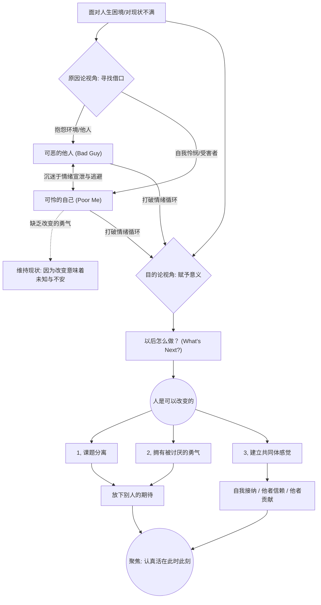
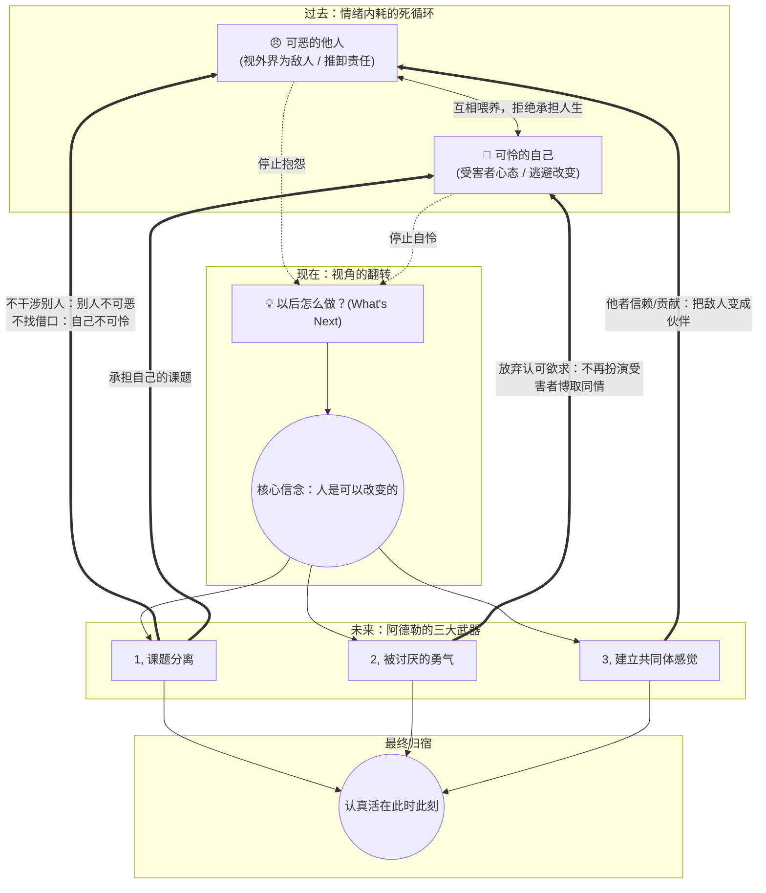

# 如何改变自己

《被讨厌的勇气》所传达的阿德勒心理学，其核心在于将人们从过去的枷锁中解放出来，赋予人掌控当下的力量。你提到的“人是可以改变的”以及心理咨询中的“三角柱”隐喻（可恶的他人、可怜的自己、以后怎么做），正是这一思想转变的关键枢纽。

为了将这一系列逻辑清晰地串联起来，我们先通过一张逻辑图来直观感受这个从“内耗”走向“改变”的过程。

### 核心逻辑可视化 (Mermaid)

代码段

### 逻辑连贯梳理：从“受害者”到“创造者”

阿德勒心理学认为，人之所以觉得改变很难，是因为我们习惯性地掉进了“原因论”**的陷阱，而改变的契机在于转向**“目的论”。

#### 1. 情绪循环的死胡同：“可恶的他人”与“可怜的自己”

当我们在生活中遇到挫折或对现状不满时，通常会陷入一种自我保护的本能。在心理咨询中，来访者最常倾诉的内容往往只占据了“三角柱”的两个面：

- **可恶的他人：** “我的老板太苛刻了”、“我的原生家庭毁了我”、“这个世界太不公平了”。我们将责任外包，通过指责外界来获得道德制高点。
- **可怜的自己：** “我太倒霉了”、“我就是个没有天赋的人”。我们陷入自我怜悯，用“受害者”的身份来博取同情。

**逻辑断点：** 只要你停留在“可恶的他人”和“可怜的自己”这两个面上，人生就永远是一场无法解脱的悲剧。因为“过去”和“他人”都是你无法掌控的。你其实在潜意识里**把这两个面当成了“不改变”的借口**（目的论：为了不面对改变带来的阵痛，所以捏造了对过去和外界的愤怒）。

#### 2. 觉醒的转折点：“以后怎么做？”

三角柱其实还有隐藏的第三个面，这就是转机的开始：**“以后怎么做？”**

无论过去发生过什么，无论别人多么可恶，这些都已经是既定事实。当你停止对过去的追问，把目光投向未来，思考“在现有的牌局下，我接下来该怎么打”时，你就从“原因论”跨越到了“目的论”。

#### 3. 核心信念：“人是可以改变的”

当你开始思考“以后怎么做”时，你就会发现：决定我们自身的不是过去的经历，而是我们赋予经历的**意义**。

- 你不是因为过去的创伤而痛苦，而是为了现在“逃避人际关系”的目的，才把过去的经历当作创伤。
- 既然一切是为了“现在的目的”服务的，那么**只要你愿意重新选择目的，抛弃现在的“生活方式”，人随时随刻都可以改变。** 改变不需要等外界条件成熟，只需要此时此刻的“勇气”。

### 行动指南：人应该如何改变自己？

明白了上述逻辑，真正的改变并不是去变成另一个人，而是改变自己赋予事物的意义和应对世界的方式。具体需要落实以下几个步骤：

**第一步：进行“课题分离”（划清界限）**

- **做法：** 区分什么是“我的课题”，什么是“他人的课题”。判断标准是谁承担最终后果。
- **效果：** 别人如何评价你、是否喜欢你，那是“他人的课题”，你无法干涉也不必迎合。你只需要做好“自己的课题”（比如真诚待人、努力工作）。斩断了对他人的过度干涉和对他人评价的恐惧，就解开了人际关系的死结。

**第二步：唤醒“被讨厌的勇气”（获得自由）**

- **做法：** 放弃“满足他人期待”的认可欲求。真正的自由，就是能够承受被别人讨厌。
- **效果：** 当你不怕被讨厌时，你才敢于迈出改变的脚步。你不再是为了父母、伴侣或社会的目光而活，而是为了自己真正的意志而活。

**第三步：建立“共同体感觉”（寻找归属感）**

改变不是走向孤立，而是以一种更健康的方式融入世界。这需要三根支柱：

1. **自我接纳：** 不是盲目的自我肯定，而是诚实地接受自己目前“做不到”的客观事实，然后把注意力放在“如何才能做到”上。
2. **他者信赖：** 在人际关系中不附加任何条件地相信他人。哪怕遭遇背叛，那也是他人的课题，你依然选择无条件信赖。
3. **他者贡献：** 改变的最高境界不是利己，而是感受到“我对他人有用”。这种贡献感会赋予你无穷的自我价值和改变的动力。

**最终归宿：认真地活在“此时此刻”**

人生不是一条为了到达某个终点（名利、成功）的直线，而是一连串刹那的“点”。过去已经不存在，未来还未发生，你所拥有的只有当下。当你不再沉迷于“可恶的他人”和“可怜的自己”，而是问出“以后怎么做”的那一刻，你就已经开始改变了。

在这个从“内耗”转向“行动”的过程中，你目前在生活中最常面对的是哪一种“可恶的他人”或“可怜的自己”的羁绊？

# 逻辑闭环

^dv110a

你的洞察非常精准！你抓住了阿德勒心理学中最具实操性的一环：**理论不仅是用来解释问题的，更是用来直接拆解问题的。**

将“共同体感觉”对准“可恶的他人”，将“课题分离”和“被讨厌的勇气”对准“可恶的他人”与“可怜的自己”，这直接让原本单向的流程图变成了一个**具有治疗意义的闭环系统**。

按照你的思路，我们把这个逻辑重新梳理并画出升级版的结构。在这个新图中，阿德勒的这三大工具不再是空泛的终点，而是直接射向“内耗三角”的利箭。

### 升级版逻辑闭环图 (Mermaid)

代码段

### 逻辑重组：武器如何精准拆解问题？

你提到的逻辑非常严密，这三大工具实际上就是为了拔除“可怜”与“可恶”这根毒刺而存在的。我们顺着这个闭环，看看这个逻辑是如何自我消解的：

#### 1. 建立“共同体感觉” ➔ 瓦解“可恶的他人”

当你觉得他人“可恶”时，底层的假设是“世界是危险的，他人是我的敌人”。因为是敌人，所以你要防备、要竞争、要指责。

- **如何瓦解：** 共同体感觉的核心是“他者信赖”和“他者贡献”。当你试着无条件地信赖他人，并致力于对他人产生价值（贡献感）时，你眼中的他人就从“敌人”变成了“伙伴”。**一旦所有人都成了你的伙伴，世界上就不存在“可恶的他人”了。**

#### 2. “被讨厌的勇气” ➔ 瓦解“可怜的自己”

人为什么喜欢扮演“可怜的自己”？因为这是一种特权。只要你足够可怜，别人就不会苛责你，你就能安全地获得同情，从而逃避改变的风险（也就是阿德勒说的“弱势特权”）。同时，这也源于深深的“认可欲求”——害怕不被喜欢。

- **如何瓦解：** 拥有被讨厌的勇气，意味着你**主动切断了通过“卖惨”来换取他人认可的念想**。你明白别人的评价不重要，你不需要为了别人的喜欢而委屈自己。当你不再需要外界的同情和认可时，“可怜的自己”这层面具就彻底失效了。

#### 3. “课题分离” ➔ 斩断“可怜”与“可恶”的锁链

这是连接两端的终极利刃：

- **对治“可恶的他人”：** 别人对你发脾气、不理解你，那是“他人的课题”。你越界去干涉或者因为别人的态度而愤怒，就是在给自己找不痛快。把课题分开，别人就不可恶了，因为他们怎么做与你无关。
- **对治“可怜的自己”：** 自己的人生只能自己负责，这是“你的课题”。你不能再把现在的不如意甩锅给原生家庭或前任（因为那是他们的课题），你必须收回人生的主导权。收回主导权的人，是强者，不再是“可怜的自己”。

### 总结：人生的齿轮如何重新转动

过去的你，在“可恶的他人”和“可怜的自己”之间反复横跳，这是一个**静态的死局**。

而当你问出“以后怎么做？”的那一刻，你切断了原因论。你用**课题分离**和**被讨厌的勇气**收回了人生的控制权（我不倒霉，我也无权管别人）；接着，你用**共同体感觉**重新与世界建立连接（别人不是敌人，我们是伙伴）。

最终，所有的逻辑都会汇聚到一个点上：**抛弃对过去的纠结和对未来的焦虑，不附带任何借口地、认真地活在此时此刻。**
