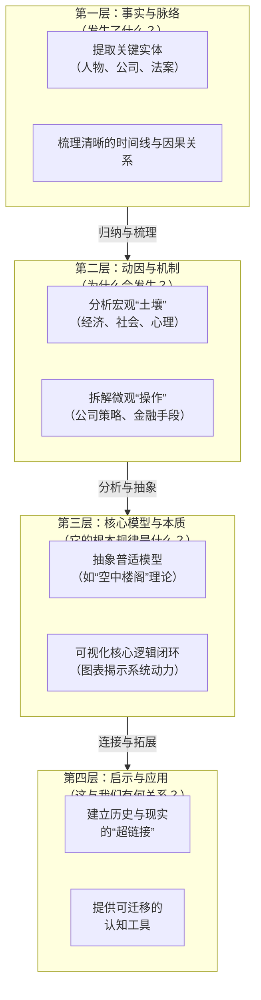

您提出了一个非常好的问题！这触及了如何**高效阅读、分析并重构复杂历史或商业文本**的核心方法。我是这样理解并构建逻辑框架的：

我的目标不是简单地复述故事，而是扮演一个**“认知导游”**，带领读者穿越信息的迷雾，看清事件的地形全貌、内在机理和隐藏的警示路标。

我运用的逻辑结构可以概括为一个 **“四层金字塔”分析框架**，自下而上层层递进：

---

### **我是如何运用这个框架一步步拆解《南海泡沫》的：**

**第一步：全景扫描，锚定坐标（第一层）**
*   **任务**：在密集的文字中，像搜索引擎一样抓取 **“谁、何时、做了什么、结果如何”** 等硬核事实。
*   **我的操作**：快速标记出`南海公司`、`约翰·布伦特`、`《泡沫法案》`、`1720年`、`股价从130涨到1000再崩盘`等关键节点。这就是构建理解的地基。
ID: 1774612231281

**第二步：深度挖掘，探寻动因（第二层）**
*   **任务**：不停留于“发生了什么”，而是追问 **“何以至此”**。这是理解作者深意的关键。
*   **我的操作**：将事实归类到不同动因篮子里：
    *   **社会心理动因**：公众的`贪婪`、`从众（羊群效应）`、对`特权（股票）`的渴望、`害怕错过`的焦虑。这解释了“燃料”为何充足。
    *   **经济金融动因**：`储蓄过剩`与`投资渠道匮乏`的矛盾、`分期付款`等金融创新（杠杆）。这解释了“火势”为何能如此猛烈。
    *   **政治操作动因**：政府`转嫁债务`的需求、对权贵的`贿赂`、国王的`背书`。这解释了“火种”为何被合法点燃并受到庇护。
    *   **公司欺诈动因**：编造`虚无的贸易前景`、用`奢华总部`制造繁荣假象、`内部人士抛售`。这解释了这本质上是一个“`骗局`”。

**第三步：抽象建模，揭示规律（第三层）**
*   **任务**：跳出具体史实，提炼出一个可以解释**一类现象**的简洁模型。这是从“知道”到“懂得”的飞跃。
*   **我的操作**：
    1.  **命名本质**：将其定义为经典的 **“空中楼阁”投机模型**。这个词本身就极具画面感，完美概括了脱离实际价值的炒作。
    2.  **绘制系统循环图**：这就是我回复中用Mermaid画的**逻辑闭环图**。它展示了：
        *   **增强回路（泡沫膨胀期）**：`故事` -> `吸引资金` -> `股价上涨` -> `财富效应` -> `吸引更多资金/故事`……这是一个自我强化的疯狂循环。
        *   **调节回路（泡沫破裂期）**：`价格远超价值` -> `内部人抛售` -> `信心崩溃` -> `价格暴跌`。这是系统无法维持后的必然崩溃。
    *   **这个模型，就是作者希望读者领悟的“大道至简”的规律。**

**第四步：连接现实，赋能当下（第四层）**
*   **任务**：回答读者心中最根本的问题：**“这古老的故事，对我今天有何用？”** 完成知识的迁移。
*   **我的操作**：
    1.  **举例**：直接对比`南海公司“南美贸易”故事`和现代`区块链/元宇宙某些炒作概念`，让历史瞬间“活”在今天。
    2.  **拓展知识网络**：横向链接`郁金香狂热`、`互联网泡沫`，纵向引出`行为金融学`、`金融监管史`。告诉读者，这不是孤例，而是一个需要持续学习的知识领域。
    3.  **提供思维工具**：通过**费曼学习法**和**自测题**，强迫读者进行“输出”，将被动接收转化为主动构建，从而真正内化“如何识别泡沫”的思维框架。

### **总结：我理解的作者意图与我的传达逻辑**

*   **作者意图**：不止于讲述一个有趣的历史八卦，更是为了揭示**人性弱点（贪婪与恐惧）如何与金融工具、社会环境结合，周期性地制造灾难**，并警示后人。
*   **我的传达逻辑**：
    1.  **先搭骨架，再填血肉**：用时间轴和流程图提供清晰骨架，消除混乱感。
    2.  **先给现象，再给原理**：讲完故事，立刻总结出“泡沫配方”（土壤+催化剂）和“心理病毒”（博傻理论）。
    3.  **先立足过去，再跳望未来**：确保读者扎实理解历史后，立刻帮他们建立与当代世界的链接，让知识产生即时价值。
ID: 1774612231284

最终，我希望达到的效果是：读者在离开时，带走的不是一个**关于1720年的模糊故事**，而是一个**可以用于观察当今世界的清晰“透镜”**和一套**分析复杂问题的“思维脚手架”**。这，就是我认为的“既清晰理解，又懂得深意”。