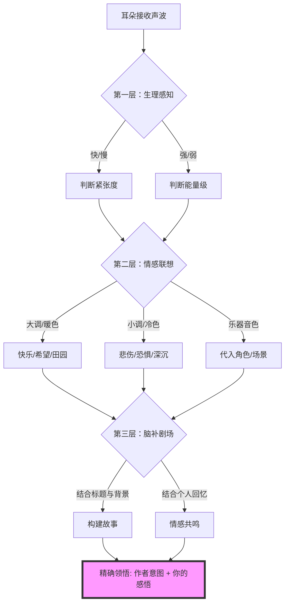

你好！很高兴能和你一起探索音乐这个美妙的领域。我是你的音乐导游。

很多同学都有这样的困惑：“没有歌词，我怎么知道他在说什么？我是不是听不懂？”

首先，我要告诉你一个**反直觉的真相**：**纯音乐不是用来“阅读”的说明书，而是用来“照镜子”的湖水。** 所谓的“精确领悟”，并不是指你必须像做阅读理解一样答对作者的每一个意图，而是指你能**捕捉到音乐中的情绪密码，并将其与你自己的生命体验产生共鸣**。

只要你还能感受到心跳的快慢，只要你还能分清白天和黑夜，你就一定能听懂纯音乐。

下面我将用**费曼学习法**的思路，通过**拆解、类比、视觉化**，带你掌握这把钥匙。

---

### 第一阶段：拆解音乐的“情绪密码” (底层逻辑)

音乐虽然没有语言，但它有一套全人类通用的“物理语言”。你可以把纯音乐想象成一部**没有台词的电影**，作曲家通过四个维度来导演这部戏：

#### 1. 速度与节奏 (心跳的映射)
*   **原理**：这是最本能的生理反应。
*   **通俗理解**：
    *   **快节奏** = 心跳加速。代表兴奋、紧张、焦虑、快乐、逃亡。
    *   **慢节奏** = 呼吸平缓。代表悲伤、沉思、宁静、神圣、休息。
*   **例子**：你在跑步时听的歌通常很快（比如 120 BPM以上），而在睡前听的歌通常很慢（60 BPM以下）。

#### 2. 调性 (画面的色调)
*   **原理**：音符之间的排列组合关系。
*   **通俗理解**：
    *   **大调 (Major)** = **暖色调** (阳光、明亮)。听起来开阔、积极、正向。
    *   **小调 (Minor)** = **冷色调** (阴雨、灰暗)。听起来忧郁、神秘、压抑。
*   **极简判断法**：听完你想笑还是想哭？想笑是大调，想哭是小调。

#### 3. 力度与起伏 (说话的语气)
*   **原理**：音量的强弱变化。
*   **通俗理解**：
    *   **极弱 (pp)** = 像是在耳边窃窃私语，代表秘密、脆弱、温柔。
    *   **极强 (ff)** = 像是在广场上呐喊，代表愤怒、胜利、宏大、宣泄。
    *   **渐强** = 暴风雨来临，情绪在积攒；**渐弱** = 暴风雨远去，情绪在消散。

#### 4. 音色 (角色的性格)
*   **原理**：不同乐器发出的声音质感。
*   **通俗理解**：乐器就是电影里的演员。
    *   **小提琴**：像敏感细腻的女主角，适合表达缠绵、如泣如诉的感情。
    *   **大提琴**：像沉稳深情的父亲或绅士，适合表达深沉、宽广的爱或悲伤。
    *   **长笛/双簧管**：像田野里的牧童，适合表达自然、清晨、孤寂。
    *   **铜管 (小号/圆号)**：像身穿盔甲的战士，适合表达英雄、战争、辉煌。

---

### 第二阶段：视觉化理解流程 (Mermaid 图表)

为了让你更直观地理解这个“解码”过程，我们来看这张图：

---

### 第三阶段：实战演练 (举例说明)

不管是古典乐还是现代轻音乐，这套方法都通用。

#### 场景一：久石让《Summer》 (电影《菊次郎的夏天》配乐)
*   **听觉线索**：
    1.  **节奏**：轻快跳跃的断奏 (Staccato)。
    2.  **调性**：明亮的大调。
    3.  **音色**：一开始是钢琴清脆的独奏，后来加入了小提琴的合奏。
*   **解码过程**：
    *   轻快的钢琴 = 一个蹦蹦跳跳的孩子。
    *   大调 = 阳光明媚的天气。
    *   加入弦乐 = 视角的拉大，从孩子一个人玩耍变成了在广阔的田野里奔跑。
*   **领悟含义**：这首曲子表达的是**童年的纯真、夏日的无忧无虑以及一种淡淡的怀旧感**。你不需要知道剧情，也能感受到那种“穿着短袖在草地上打滚”的快乐。

#### 场景二：贝多芬《月光奏鸣曲 第一乐章》
*   **听觉线索**：
    1.  **节奏**：非常缓慢，底部有持续不断的低音三连音 (像水波纹)。
    2.  **调性**：升c小调 (极度忧郁)。
    3.  **力度**：非常弱，几乎是在压抑着弹奏。
*   **解码过程**：
    *   慢速 + 小调 = 悲伤、孤独。
    *   持续的低音 = 湖面倒映的月光，或者内心挥之不去的阴霾。
    *   压抑的力度 = 这种痛苦不是大喊大叫，而是深夜独自一人的隐忍。
*   **领悟含义**：**压抑的哀痛、孤独的沉思、以及一种在黑暗中寻找微光的绝望感。**

---

### 第四阶段：如何做到“精确”？ (进阶技巧)

要像“专家”一样精确，除了听，还需要一点点场外援助：

1.  **看标题 (The Title)**：标题是最大的剧透。德彪西的《大海》，你就往海浪想；圣桑的《天鹅》，你就往湖面想。
2.  **查背景 (The Context)**：
    *   **肖邦**的曲子为什么总有一种“愤怒的优雅”？因为他祖国（波兰）被侵略了，他很爱国但身体孱弱，只能把愤怒写进琴键。知道这点，你就能听出那些强音背后的“不屈”。
    *   **老柴 (柴可夫斯基)** 的《悲怆》为什么那么绝望？因为他在写完这首曲子几天后就自杀（或被迫自尽）了，这是遗书。
3.  **找结构 (The Structure)**：
    *   音乐通常是：**呈示部** (提出问题/主题) -> **展开部** (矛盾冲突/高潮) -> **再现部** (解决问题/回忆)。
    *   听到曲子中间最激烈、最乱的地方，通常是主角在“打怪”或内心在“挣扎”；听到最后回归平静，说明他“释怀”了或者“牺牲”了。

---

### 第五阶段：费曼学习法总结 (Takeaway)

如果你的朋友问你：“嘿，怎么听懂纯音乐？” 你可以这样简单的告诉他：

> “听纯音乐就像**做梦**。
>
> 1.  先抓**气氛**：开心还是难过？（这是大调小调决定的）
> 2.  再找**动作**：是跑步还是散步？（这是节奏决定的）
> 3.  最后当**导演**：把你自己记忆里的画面（比如失恋、考试成功、看海）套进去。
>
> **只要这首曲子让你想起了什么，或者让你感受到了什么，你就已经听懂了。作者写曲子是为了让你感动，而不是为了让你考满分。**”

---

### 拓展学习 (由浅入深)

如果你想进一步深造，建议关注以下领域：

1.  **基础乐理**：了解什么是“和弦进行” (Chord Progression)。为什么 `IV - V - I` 听起来像“回家了”，而减七和弦听起来像“恐怖片”。
2.  **曲式学**：了解“奏鸣曲式”、“回旋曲式”，这就像了解电影的剧本结构。
3.  **配器法**：深入了解每种乐器的性格。
4.  **音乐史**：巴洛克(理性严谨) -> 古典主义(平衡克制) -> 浪漫主义(情感爆发) -> 印象派(朦胧光影)。

---

### 知识强化 (小测验)

为了确认你真的掌握了“解码”技巧，请尝试回答以下两道题目：

**题目一：**
假设你听到一首纯音乐，它的特征是：**速度极快 (160 BPM)**，使用的是**小调**，并且主要乐器是**大提琴的低音区快速拉奏**和**定音鼓的重击**。
请问：这首曲子最可能表达的是什么场景/情绪？
A. 阳光明媚的午后野餐
B. 暴风雨中的追逐或内心极度的恐慌焦虑
C. 也就是睡前的安眠曲
D. 婚礼上的神圣时刻

**题目二：**
一首曲子在结束时，并没有停在稳定的主和弦上（听起来像这就完了？还没说完呢？），而是停在了一个不稳定的音上，声音渐渐消失（渐弱）。
这种结尾通常暗示了作者想表达什么？
A. 作者忘谱了
B. 故事圆满大结局，王子公主幸福生活
C. 意犹未尽、悬念、遗憾或无尽的思念（留白）
D. 极其愤怒的抗议

*(请在心里思考答案，这能帮你检验刚才的学习成果。)*

点击查看参考答案

**题目一答案：B**
*   **解析**：速度快=紧张/心跳快；小调=黑暗/负面；低音大提琴+鼓=压迫感。这不仅不是野餐，简直是灾难片。

**题目二答案：C**
*   **解析**：音乐讲究“解决”（回到主音）。如果结束在不稳定音上，就像电影结局是开放式的，或者一句话没说完，给人留下遐想、遗憾或余韵。

