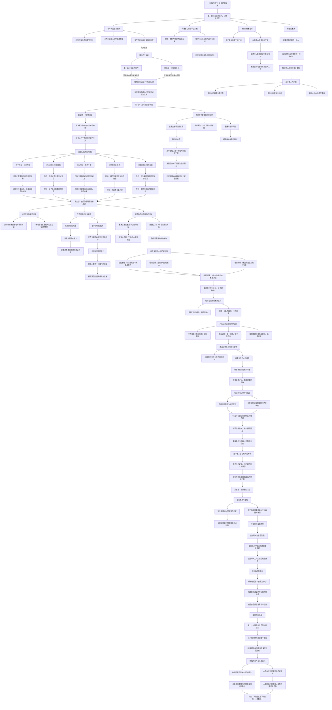

# 未命名 7

```mermaid
flowchart TD
    %% 全书根节点
    ROOT["《幸福的勇气》全景逻辑拆解"]

    %% ================= 第 一 部 =================
    P1["第一部：可恶的他人，可怜的自己"]
    ROOT --> P1

    P1_1["青年的困惑与挫折"]
    P1 --> P1_1
    P1_1 --> P1_1_1["回到现实当教师备受挫折"]
    P1_1 --> P1_1_2["认为阿德勒心理学是理想主义"]
    P1_1 --> P1_1_3["学生不听话导致其陷入迷茫"]

    P1_2["阿德勒心理学不是宗教"]
    P1 --> P1_2
    P1_2 --> P1_2_1["宗教：依赖神明提供现成答案"]
    P1_2 --> P1_2_2["哲学：永无止境的追问与探讨"]
    P1_2_2 --> P1_2_3["阿德勒是科学与哲学的结合"]

    P1_3["教育的根本目的"]
    P1 --> P1_3
    P1_3 --> P1_3_1["绝不是居高临下的干涉"]
    P1_3 --> P1_3_2["本质是心理咨询与交友"]
    P1_3_2 --> P1_3_3["最终目标是帮助学生实现'自立'"]
    P1_3_3 --> P1_3_4["教育者不可替代来访者的人生"]

    P1_4["尊重的本质"]
    P1 --> P1_4
    P1_4 --> P1_4_1["'实事求是地看待一个人'"]
    P1_4_1 --> P1_4_2["认识到他人存在本身的不可替代性"]
    P1_4_2 --> P1_4_3["教导他人建立自我价值感"]

    P1_5["关心他人的兴趣"]
    P1_4_3 --> P1_5
    P1_5 --> P1_5_1["用他人的眼睛去看世界"]
    P1_5 --> P1_5_2["用他人的耳朵去倾听"]
    P1_5 --> P1_5_3["用他人的心去感受情绪"]

    P1_6["魔法的三棱柱"]
    P1_1_3 -->|"陷入逃避"| P1_6
    P1_6 --> P1_6_1["第一面：'可恶的他人'"]
    P1_6 --> P1_6_2["第二面：'可怜的自己'"]
    P1_6_1 & P1_6_2 -->|"沉溺其中无法解决问题"| P1_6_3["隐藏的第三面：'以后怎么做'"]
    P1_6_3 --> P1_6_4["阿德勒体系核心：只关注以后怎么做"]
    P1_6_4 --> P2

    %% ================= 第 二 部 =================
    P2["第二部：为何要否定'赏罚'"]
    
    P2_1["教室是一个民主国家"]
    P2 --> P2_1
    P2_1 --> P2_1_1["坚决反对独裁者式的威权教师"]
    P2_1_1 --> P2_1_2["建立人人平等的师生契约关系"]

    P2_2["否定赏罚教育的深刻理由"]
    P2 --> P2_2
    P2_2 --> P2_2_1["批评会破坏信赖关系"]
    P2_2 --> P2_2_2["批评无法让人认识到错误本质"]
    P2_2 --> P2_2_3["表扬与批评同质"]
    P2_2_3 --> P2_2_4["都是纵向关系的操控"]

    P2_3["问题行为的五大阶段"]
    P2_1_2 --> P2_3
    
    P2_3 --> P2_3_1["第一阶段：寻求称赞"]
    P2_3_1 --> P2_3_1_1["目的：获得特权地位表现优秀"]
    P2_3_1_1 --> P2_3_1_2["应对：不要表扬，关注意图表达感谢"]
    
    P2_3 --> P2_3_2["第二阶段：引起注意"]
    P2_3_2 --> P2_3_2_1["目的：即使被骂也要引人注目"]
    P2_3_2_1 --> P2_3_2_2["应对：给予真正的尊重和包容"]

    P2_3 --> P2_3_3["第三阶段：权力斗争"]
    P2_3_3 --> P2_3_3_1["目的：挑衅权威试图战胜对方"]
    P2_3_3_1 --> P2_3_3_2["应对：立即退出权力球场，绝不冲突"]

    P2_3 --> P2_3_4["第四阶段：复仇"]
    P2_3_4 --> P2_3_4_1["目的：得不到爱而主动选择被恨"]
    P2_3_4_1 --> P2_3_4_2["应对：求助专业第三方"]

    P2_3 --> P2_3_5["第五阶段：证明无能"]
    P2_3_5 --> P2_3_5_1["目的：避免期待落空彻底放弃自我"]
    P2_3_5_1 --> P2_3_5_2["应对：提供不经意的微小支持"]

    P2_4["暴力的本质"]
    P2_2_1 --> P2_4
    P2_4 --> P2_4_1["成本最低、最不费智力的交流手段"]
    P2_4_1 --> P2_4_2["本质是放弃了语言沟通的耐心"]
    P2_4_2 --> P2_4_3["批评和暴力在精神压迫上完全同质"]
    
    P2_3_1_2 & P2_3_2_2 & P2_3_3_2 & P2_3_4_2 & P2_3_5_2 --> P3

    %% ================= 第 三 部 =================
    P3["第三部：由竞争原理到协作原理"]

    P3_1["对阿德勒的常见误解"]
    P3 --> P3_1
    P3_1 --> P3_1_1["并非带来强者通吃的功利学说"]
    P3_1 --> P3_1_2["弱者也有支配他人的权力（弱势特权）"]

    P3_2["生活原理的根本转变"]
    P3 --> P3_2
    P3_2 --> P3_2_1["竞争原理的危害"]
    P3_2_1 --> P3_2_1_1["世界充满潜在敌人"]
    P3_2_1_1 --> P3_2_1_2["即使是胜者也会时刻感到不安"]
    
    P3_2 --> P3_2_2["协作原理的优势"]
    P3_2_2 --> P3_2_2_1["世界充满可以相互扶持的同伴"]

    P3_3["共同体感觉的深化"]
    P3_2_2_1 --> P3_3
    P3_3 --> P3_3_1["把他人看作不可替代的战友"]
    P3_3_1 --> P3_3_2["找到真正的归属感和安全感"]

    P3_4["表扬的危害与鼓励的意义"]
    P3 --> P3_4
    P3_4 --> P3_4_1["表扬是上位者对下位者的俯视"]
    P3_4_1 --> P3_4_2["导致人终其一生为他人期待而活"]
    P3_4 --> P3_4_3["鼓励是人与人平视的横向关系"]
    P3_4_3 --> P3_4_4["鼓励是表达纯粹的感谢"]

    P3_5["自我认同与人的绝对价值"]
    P3_4_4 --> P3_5
    P3_5 --> P3_5_1["自我接纳：认清能改变与不能改变的"]
    P3_5 --> P3_5_2["他者信赖：无条件地相信他人"]
    P3_5 --> P3_5_3["他者贡献：体会到自己对他人有用"]
    P3_5_1 & P3_5_2 & P3_5_3 --> P3_5_4["认知觉醒：人的价值由'存在本身'决定"]
    P3_5_4 --> P4

    %% ================= 第 四 部 =================
    P4["第四部：交出什么，便会得到什么"]

    P4_1["信用与信赖的本质区别"]
    P4 --> P4_1
    P4_1 --> P4_1_1["信用：附加条件，基于利益"]
    P4_1 --> P4_1_2["信赖：无条件相信，不求回报"]

    P4_2["人生三大课题的羁绊进阶"]
    P4_1_2 --> P4_2
    P4_2 --> P4_2_1["工作课题：基于信用，容易割断"]
    P4_2 --> P4_2_2["交友课题：基于信赖，需主动迈出"]
    P4_2 --> P4_2_3["爱的课题：最高级联系，毫无保留"]

    P4_3["建立信赖关系的核心步骤"]
    P4_2_2 --> P4_3
    P4_3 --> P4_3_1["彻底放下先入为主的道德评判"]
    P4_3 --> P4_3_2["尊重对方的人生课题"]
    P4_3_2 --> P4_3_3["做到课题分离绝不干涉"]
    P4_3_3 --> P4_3_4["在旁安静守候，需要时提供支持"]

    P4_4["信任的内心障碍与克服"]
    P4_3_4 --> P4_4
    P4_4 --> P4_4_1["不敢信赖是因为害怕受伤"]
    P4_4 --> P4_4_2["自卑情结导致想要保持绝对掌控"]
    P4_4_1 & P4_4_2 --> P4_4_3["'交出什么便会得到什么'的世界观"]
    P4_4_3 --> P4_4_4["你不信赖他人，他人便不回应"]
    P4_4_4 --> P4_4_5["勇敢先给出信赖，世界才会回应"]

    P4_5["赋予他人自己解决的勇气"]
    P4_4_5 --> P4_5
    P4_5 --> P4_5_1["即使出于好意，也不剥夺他人的课题"]
    P4_5_1 --> P4_5_2["相信对方具备自我成长的坚韧力量"]
    P4_5_2 --> P5

    %% ================= 第 五 部 =================
    P5["第五部：选择爱的人生"]

    P5_1["爱的本质与重构"]
    P5 --> P5_1
    P5_1 --> P5_1_1["坠入情网根本不是真正的爱"]
    P5_1_1 --> P5_1_2["盲目迷恋源于物欲和绝对占有欲"]
    P5_1 --> P5_1_3["真正的爱是需要两人主动构建的课题"]

    P5_2["主体性的深刻转变"]
    P5_1_3 --> P5_2
    P5_2 --> P5_2_1["出生时人生主语是'我'"]
    P5_2_1 --> P5_2_2["爱的关系中主语奇迹般变成'我们'"]
    P5_2_2 --> P5_2_3["超越个人主义的社会结合升华"]

    P5_3["自立的终极定义"]
    P5_2_3 --> P5_3
    P5_3 --> P5_3_1["精神上摆脱'以自我为中心'"]
    P5_3_1 --> P5_3_2["彻底告别孩童的特权感与依赖感"]
    P5_3_2 --> P5_3_3["接受自己只是世界的一部分"]

    P5_4["爱的无限拓展"]
    P5_3_3 --> P5_4
    P5_4 --> P5_4_1["爱一个人是走向世界整体的起点"]
    P5_4_1 --> P5_4_2["从小共同体扩展到整个宇宙"]
    P5_4_2 --> P5_4_3["在'我们'的关系中体会深深的贡献感"]

    P5_5["幸福的勇气与人生意义"]
    P5_4_3 --> P5_5
    P5_5 --> P5_5_1["核心不再只是'被讨厌的勇气'"]
    P5_5_1 --> P5_5_2["而是更为艰难伟大的'去爱他人的勇气'"]
    P5_5 --> P5_5_3["人生本没有普遍性的绝对意义"]
    P5_5_3 --> P5_5_4["人生的意义是由自己在每个瞬间赋予的"]
    P5_5_2 & P5_5_4 --> END["终点：不如活在当下的刹那，不断起舞！"]
```
