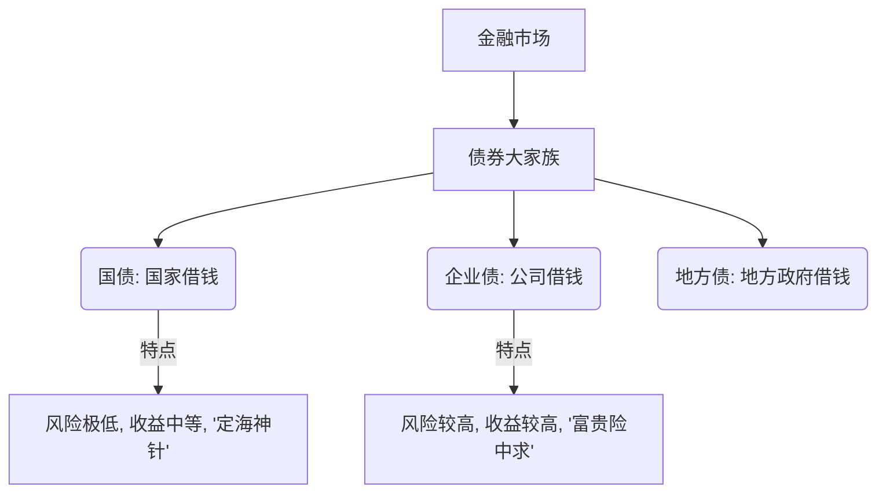
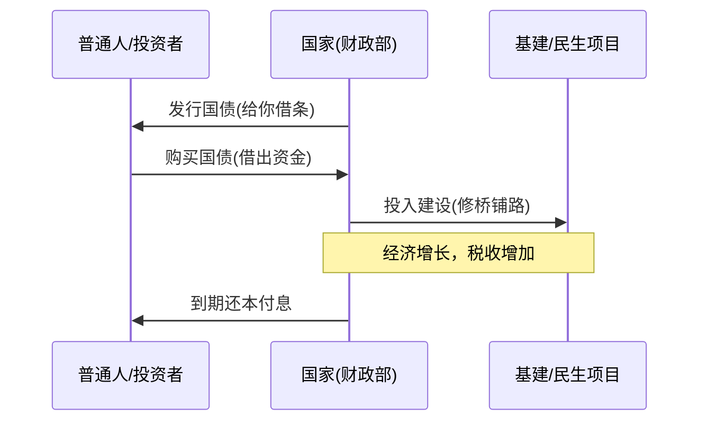

---
aliases:
  - 债券
---

你好！我是你的知识向导。今天我们把金融教科书扔一边，用最**通俗、最生动**的方式，把“国债”和“债券”这两个看似高大上的词彻底揉碎了讲给你听。

准备好了吗？我们将用**费曼学习法**（用大白话解释复杂概念）来开启这堂课！🎓

---

### 第一部分：到底什么是债券？什么是国债？

#### 1. 核心概念：这其实就是一张“超级借条”

**债券 (Bond)**
想象一下，老王想开个养鸡场，但没钱。他找你借了1万块，写了张纸条：“借我1万，明年还你，外加500块利息。”
这张**纸条**，在金融市场上就叫**债券**。

*   **借款人**：可以是公司（企业债）、银行（金融债），也可以是国家。
*   **出借人**：就是买了债券的你（债权人）。

**国债 (Government Bond)**
如果向你借钱的不是老王，而是**国家**（比如中国财政部），这张借条就叫**国债**。
因为国家有征税权，还印钞票，理论上它赖账的可能性几乎为零。所以，国债又被称为**“金边债券”**（意思是最安全、最尊贵）。

#### 2. 它们的关系图解

---

### 第二部分：国债是怎么形成的？（国家为什么要借钱？）

你可以把国家想象成一个**“超级大家长”**。

1.  **需求产生**：大家长要修高铁、造航母、发社保、搞抗震救灾。
2.  **钱不够用**：每年的税收（工资）还没收上来，或者今年花销特别大，钱不够了怎么办？
3.  **发起众筹**：大家长说：“来来来，大家先把闲钱借给我用用，我按期给你们利息，保证比存银行划算！”
4.  **形成国债**：于是，国债发行了。投资机构、银行、普通老百姓纷纷掏钱购买。

**资金流动示意图：**

---

### 第三部分：普通人的“操作空间”在哪里？

这是最关键的！普通人玩国债，主要有两种玩法，我们称之为**“躺平派”**和**“冲浪派”**。

#### 1. 躺平派：持有到期（吃利息）
这是最适合大多数人的玩法，尤其是想要**稳稳的幸福**的人。

*   **操作**：你去银行（网银或柜台）买了储蓄式国债。
*   **收益**：通常比银行定期存款利率高一点点，而且绝对安全。
*   **场景**：
    > **举例**：王阿姨手里有20万养老钱，不敢炒股怕亏，存活期利息又太低。她抢购了3年期国债，年利率假设是2.3%。这3年里，她什么都不用做，每年稳稳拿利息，到期拿回本金。

#### 2. 冲浪派：二级市场交易（赚差价）
这就要点技术含量了。国债不仅可以持有，还可以像股票一样在市场上**买卖**（记账式国债）。

*   **核心逻辑**：**债券价格和市场利率呈反比！**（这是重点，敲黑板！）
    *   *比喻*：想象债券是一个固定产奶的奶牛。如果市场上新来的奶牛（新发行的债券/银行利率）产奶变多了，你手里这头老奶牛就不值钱了（价格下跌）；反之，如果外面利息低了，你手里这头产奶稳定的老奶牛就变得抢手（价格上涨）。
*   **操作**：在证券账户（炒股软件）里买卖现券或国债ETF。
*   **场景**：
    > **举例**：小李是个金融白领。他预测未来经济下行，国家会“降息”来刺激经济。于是他提前买入国债（或国债ETF）。
    > 半年后，央行果然降息了。新发的债券利息很低，大家发现小李手里的旧债券利息高，纷纷抢着买。小李手里的国债价格大涨，他卖出赚了一笔差价（资本利得），这往往比单纯吃利息赚得多！

---

### 第四部分：拓展知识（由浅入深）

当你掌握了基础，可以看看这些进阶概念：

1.  **逆回购 (Reverse Repo)**：
    *   **是什么**：你需要钱，我有钱。你把手里的国债抵押给我，我借钱给你一天，你付我一天利息。
    *   **普通人怎么用**：月底或季末，市场缺钱，逆回购利率会飙升（有时年化高达5%-10%）。你在股票软件上点“卖出”逆回购（如R-001），实际上是把钱借出去赚高息，零风险，第二天钱自动回来。

2.  **收益率曲线 (Yield Curve)**：
    *   通常买的时间越长（10年期），利息应该越高。如果反过来（短期利息比长期高），这叫“倒挂”，通常预示着经济衰退要来了。

3.  **信用评级**：
    *   国债是AAA级。有些企业债是垃圾级（Junk Bonds），利息给得超高，但很可能还要不回本金。

---

### 第五部分：费曼学习法总结

请尝试用自己的话复述一遍：
> “国债就是国家找大家众筹借钱，打了个极度靠谱的借条。
> 我们普通人要么买了持有吃利息（比存银行强）；
> 要么像炒股一样低买高卖，赌未来的利息变化（利息跌，债价涨）。”

---

### 第六部分：加强练习（防坑测试）

为了确认你真的懂了，请回答以下两道题（心里想好答案后再看解析）：

**题目 1：**
如果你预测明年银行存款利率会从2%**降低**到1%，那么现在的国债价格大概率会：
A. 上涨
B. 下跌
C. 不变

点击查看答案与解析

**答案：A. 上涨**
**解析**：还记得那个跷跷板（反比关系）吗？市场利率降低，大家觉得现在的债券利息好高啊，太香了，都去抢，价格自然就被买上去了。

**题目 2：**
小张买了“储蓄式国债”，小王在股票软件里买了“记账式国债”。急需用钱时，谁变现更灵活？
A. 小张
B. 小王

点击查看答案与解析

**答案：B. 小王**
**解析**：
*   **储蓄式国债**（小张）：类似定期存款，提前支取要扣利息，还要去银行办手续，比较麻烦。
*   **记账式国债**（小王）：在交易时间随时可以卖出，资金T+0或T+1到账，流动性极强。

希望这堂课能帮你彻底搞懂国债！如果还有哪里不清楚，随时举手提问！🙋‍♂️