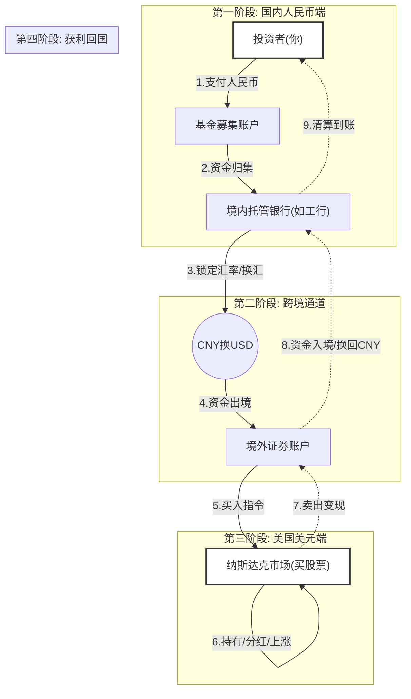

**合格境内机构投资者**，即**QDII**，是“**Q**ualified **D**omestic **I**nstitutional **I**nvestor”的首字缩写。它是在一国境内设立，经该国有关部门批准从事境外[证券市场](https://zh.wikipedia.org/wiki/%E8%AD%89%E5%88%B8%E5%B8%82%E5%A0%B4 "证券市场")的[股票](https://zh.wikipedia.org/wiki/%E8%82%A1%E7%A5%A8 "股票")、[债券](https://zh.wikipedia.org/wiki/%E5%80%BA%E5%88%B8 "债券")等有价证券业务的证券投资[基金](https://zh.wikipedia.org/wiki/%E5%9F%BA%E9%87%91 "基金")。和[QFII](https://zh.wikipedia.org/wiki/QFII "QFII")一样，它也是在[货币](https://zh.wikipedia.org/wiki/%E8%B4%A7%E5%B8%81 "货币")没有实现完全可自由兑换、[资本](https://zh.wikipedia.org/wiki/%E8%B5%84%E6%9C%AC "资本")项目尚未开放的情况下，有限度地允许境内投资者投资境外证券市场的一项过渡性的制度安排。

## 中国的QDII
## 分类选择
你好。继续我们的分析之旅。

你已经将问题从“大方向选择”推进到了“具体工具筛选”，这是非常好的逻辑递进。面对QDII基金的五大类（股票、混合、债券、大宗商品、黄金），我们需要再次动用**奥卡姆剃刀原理**（如无必要，勿增实体），剔除那些引入额外风险或逻辑混乱的选项。

记住公式：**QDII总收益 = 资产本身涨跌幅 + 汇率变动幅**。

为了应对“人民币贬值”（即赚取汇率收益），我们必须确保“资产本身涨跌幅”这一项即使不暴涨，也绝不能成为拖累。

针对1万元本金，以下是逐一的**逻辑排查与裁决**：

### 第一轮：逻辑剔除（直接排除项）

**1. 大宗商品类 QDII（如油气、有色金属）—— 排除**
*   **逻辑漏洞**：大宗商品（尤其是原油）的波动率极高，且与地缘政治高度挂钩，与“汇率”的相关性不稳定。
*   **致命伤**：大多数商品QDII是通过购买**期货合约**运作的。期货有“移仓换月”成本（Contango），长期持有会自动磨损净值。
*   **结论**：这是投机工具，不是保值工具。为了赚2%的汇率差，去承担30%的原油波动风险，属于本末倒置。

**2. 混合型 QDII —— 排除**
*   **逻辑漏洞**：这类基金将股票和债券混合，试图做到“进可攻退可守”。但在实际操作中，这往往意味着“不仅受股市下跌影响，还受债市波动干扰”。
*   **不可控性**：你很难弄清楚基金经理当下的仓位配置。作为一个理性的投资者，你应该追求资产属性的纯粹性，而不是把控制权完全交给黑箱。

**3. 黄金类 QDII —— 弱推荐（有更好替代）**
*   **逻辑分析**：虽然黄金是对冲贬值的好工具，但你不需要通过QDII去买。
*   **替代方案**：国内的黄金ETF（如518880等）直接追踪上海金交所现货，而国内金价本身就是“国际金价×汇率”计算出来的。买国内黄金ETF已经自动包含了汇率对冲功能。
*   **结论**：买QDII黄金不仅有更高的管理费，还有T+N的赎回效率问题，属于多此一举。

---

### 第二轮：决赛圈（核心选项对比）

剩下的只有两类：**债券型** 和 **股票型**。这取决于你对“风险”的定义。

#### 选项 A：债券型 QDII（美元债/亚洲美元债）
*   **资产本质**：本质上是借钱给美国政府或企业，通过收取利息和资本利得获利。
*   **逻辑适配度**：**最高**。
    *   **理由 1（收益叠加）**：目前美债收益率虽然受降息预期影响有所波动，但仍处于相对高位。你持有的是“票息（利息）+ 汇率”的双重收益。
    *   **理由 2（波动控制）**：债券的波动远小于股票。如果你只是想对冲人民币贬值，你不希望看到因为美股崩盘导致你的钱亏损。债券提供了最纯粹的“美元替代”属性。
    *   **利好预期**：如果美联储未来降息，债券价格通常会上涨，你可能获得资本利得。
*   **适用人群**：你的初衷是“担心贬值”，说明你的**防御心理**较强。这是最匹配防御心理的工具。

#### 选项 B：股票型 QDII（特指追踪美股指数，如纳指/标普）
*   **资产本质**：购买美国最优秀企业的股权。
*   **逻辑适配度**：**中高（进攻型）**。
    *   **理由**：拉长到5年-10年维度，美股指数的增长率通常能跑赢通胀和货币贬值。
    *   **风险**：短期内，美股处于历史高位。如果美股回调10%，即便人民币贬值2%，你整体依然亏损8%。
*   **适用人群**：如果你不仅仅想保值，还想利用这1万元进行长期的资本增值，并且能忍受短期20%以上的亏损。

---

### 导师的最终裁决

基于你的初始诉求是**“面对人民币贬值”**，这隐含了**避险**的第一性原理。

**最合适的选择是：债券型 QDII（主要投向美国国债或高等级信用债的基金）。**

**深度解析原因：**
1.  **确定性最高**：它是最接近“持有生息美元”的形态。
2.  **低波动**：对于1万元资金，心理体验很重要。债券基金净值波动相对平缓，不会让你因为剧烈波动而做出非理性的杀跌操作。
3.  **资金效率**：它不需要你去换汇，直接用人民币买入，基金公司帮你换汇投资，到期赎回人民币。你完美吃到了汇率贬值的红利，同时还赚取了美元资产的利息。

**行动指南**：
去你的交易软件（支付宝/银行App/券商），搜索“QDII 美元债”或“全球债券”，重点关注**纯债基金**，查看其持仓是否以美国国债或投资级公司债为主。

**警示**：不要购买“高收益债”（High Yield Bond，即垃圾债），那会引入不必要的违约风险。请寻找名称中带有“美元债”、“全球债”、“投资级”字样的产品。

## 整个运行过程
非常抱歉，刚才的代码可能存在兼容性问题。作为老师，我必须立刻纠正这个错误，并以此为契机，为你梳理一个**严丝合缝、完全闭环**的 QDII 资金流转全景图。

我们将这个闭环分为三个阶段：**“出海阶段” -> “增值阶段” -> “回国阶段”**。

---

### 🏛️ 第一阶段：出海（资金如何变身）
**关键词：集资、托管、换汇**

1.  **购买（申购）**：
    *   你（投资者）在支付宝/银行 APP 上点击“买入”，支付了 **10,000 元人民币**。
    *   这时候，你的钱并没有直接飞到美国。它首先进入了基金公司的**“国内募集账户”**。
2.  **确权与托管**：
    *   基金公司确认给了你 **X 份** 基金份额。
    *   **关键点**：基金公司管账不管钱。你的钱会被划转到**“托管银行”**（比如工商银行、建设银行的托管部）。
3.  **换汇（FX）**：
    *   托管银行根据基金经理的指令，使用基金公司申请到的**外汇额度**，将你的人民币按当天的**实时汇率**（假设 1 USD = 7.2 CNY）兑换成 **约 1388 美元**。
4.  **跨境划转**：
    *   这 1388 美元被汇往该基金在**境外券商**（比如摩根士丹利）开立的证券账户。

### 📈 第二阶段：增值（美元如何生钱）
**关键词：交易、股息、汇率双击**

这是资金在海外“打工”的过程，盈利主要来自三方面：

1.  **资本利得（低买高卖）**：
    *   基金经理下指令，用你的 1388 美元买了纳斯达克的成分股（比如苹果、英伟达）。
    *   假设一年后，美股牛市，这些股票涨了 **10%**。你的资产变成了 **1526 美元**。
2.  **股息红利（分红）**：
    *   苹果公司给股东分红了。这笔美元现金会直接进入基金的境外证券账户。
    *   通常 QDII 基金会将这笔钱**“红利再投资”**，继续买入股票，通过复利滚雪球。
3.  **汇率收益（被动增值）**：
    *   **这是 QDII 的隐藏关卡！** 假设这一年里，美元升值了，人民币贬值了（汇率从 7.2 变成了 7.5）。虽然你在美国的美元资产只涨了 10%，但换回人民币时会更值钱。

### 🏠 第三阶段：回国（利润如何落袋）
**关键词：估值、赎回、结汇**

1.  **净值体现（每天都在发生）**：
    *   你每天看到的基金“净值”在涨，其实就是基金会计每天把美国的股票市值 + 现金，按当天的汇率折算成人民币，除以总份额算出来的。
    *   *公式：(美元资产 × 当日汇率) ÷ 总份额 = 基金净值*
2.  **赎回（变现）**：
    *   你决定卖出。你在 APP 点击“赎回”。
3.  **反向操作**：
    *   基金经理在美股市场卖出对应价值的股票 -> 变成美元现金。
    *   美元现金汇回国内托管银行。
    *   托管银行将美元按**最新汇率**（7.5）结汇成人民币。
4.  **到账**：
    *   扣除一点点管理费和托管费后，人民币划回你的银行卡。

---

### 📊 完整逻辑闭环图解

---

### 🧮 算笔账：一个真实的盈利模型举例

为了让你彻底明白这个逻辑闭环，我们来算一笔具体的账。

**假设条件：**
*   你投入：**72,000 元 人民币**
*   T 1（买入时）汇率：**1 美元 = 7.2 元 人民币**
*   本金折算美元：**10,000 美元**（忽略手续费）

**一年后发生了三件事：**
1.  **美股涨了**：纳斯达克指数涨了 **10%**。
2.  **美元更值钱了**：人民币贬值，汇率变成了 **1 美元 = 8.0 元 人民币**。
3.  **你要赎回了**。

**利润计算逻辑：**

1.  **美股增值**：
    $10,000 \times (1 + 10\%) = \mathbf{11,000 \text{ 美元}}$
    *(这是你在美国账户里的钱)*

2.  **换汇回国（双重红利）**：
    $11,000 \text{ 美元} \times 8.0 \text{ (新汇率)} = \mathbf{88,000 \text{ 元人民币}}$

3.  **最终收益率**：
    $(88,000 - 72,000) \div 72,000 = \mathbf{22.2\%}$

**💡 老师的结论**：
你看！美股只涨了 10%，但你赚了 22.2%。这就是 QDII 基金逻辑闭环中独特的**“戴维斯双击”**（资产上涨+汇率上涨）。反之，如果美股涨了，但美元大跌，你的收益就会被吃掉。

---

### 🧠 费曼学习法：拓展与测试

讲解完这个闭环，有几个容易被忽视的“暗扣”需要拓展一下：

**拓展知识：**
1.  **管理费哪里去了？**
    在这个闭环里，基金公司（负责投资决策）和托管行（负责管钱和换汇）都要吃饭。这些费用是**按天**从基金资产里扣除的。所以你看到的基金净值，已经是扣除完“工资”后的净收入了。
2.  **T+N 的资金占用成本**：
    从你赎回（步骤 7）到钱到账（步骤 9），QDII 通常需要 8-10 天。这 10 天里，你的钱既不在股市里（已经卖了），也不在你卡里（还在路上），这叫“资金在这个闭环的运输途中”，是没有收益的。

**加强测试题（请思考后回答）：**

**题目一（关于逻辑漏洞）：**
如果广发基金公司的外汇额度用完了，暂停了申购（不准买了），但是小王此时在 APP 里点击了“赎回”操作。请问，小王的赎回会受影响吗？基金公司需要外汇额度才能把钱还给小王吗？

**题目二（关于极端情况）：**
假设某天纳斯达克因为暴跌熔断暂停交易了。此时国内的投资者还能在当天准确地赎回基金吗？这个“闭环”会在哪个环节卡住？

---

#### 💡 答案解析

**题目一答案：**
**赎回不受影响，不需要“新”额度，但能腾出额度。**
*   **解析**：额度限制通常是限制“人民币换美元出去”。当小王赎回时，资金流向是“美元换人民币回来”。这不仅不需要申请新额度，反而会把原先占用的额度**腾出来**。所以，当大量人赎回时，基金公司手里的可用额度反而会恢复，之后可能就会重新开放申购。

**题目二答案：**
**不能准确赎回，闭环会在“国外环节-卖出指令”卡住。**
*   **解析**：如果美股市场暂停交易（闭市或熔断），基金经理无法在那个黄色的方框 `F` 里卖出股票。无法卖出股票，就变不成美元现金 `E`，也就无法换汇 `G`。此时，基金公司通常会发布公告，宣布**“暂停赎回”**或**“延期确认”**，直到美股恢复交易。

这次的逻辑闭环图和解释清晰了吗？