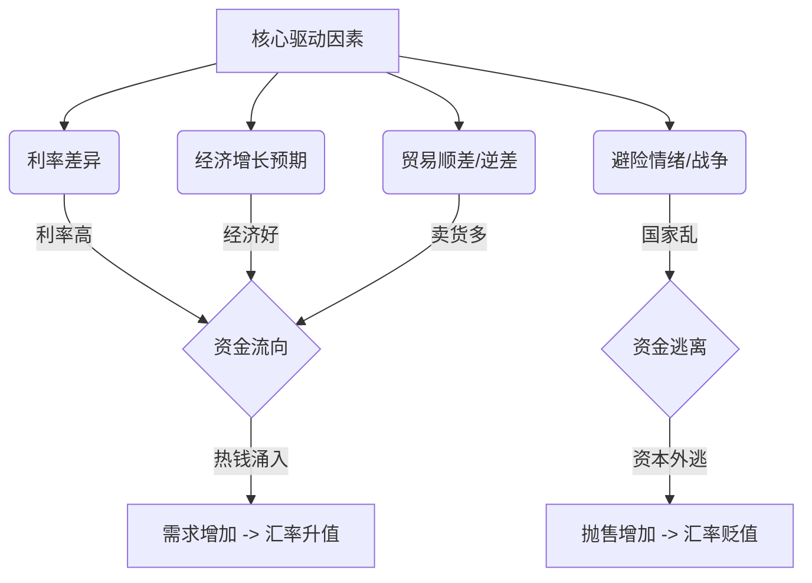
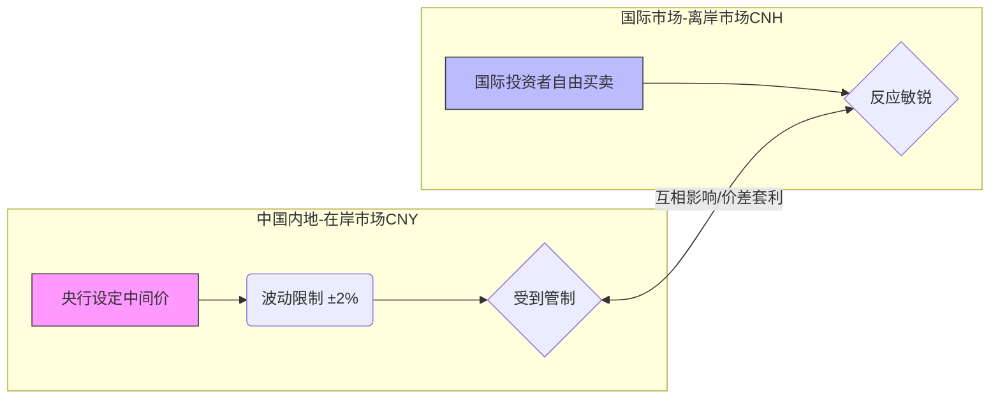

你好！我是你的博学老师。今天我们要解开“汇率”这个看起来高深莫测，实则和我们生活息息相关的谜题。

想象一下，**货币其实就是一种特殊的商品**，就像市场上的土豆一样。如果大家都想要美元，美元就贵；如果大家都想甩卖日元，日元就便宜。

我们将分三个部分来层层剥茧：**全球通用逻辑**、**中国独特逻辑**、以及**人民币的具体变换逻辑**。

---

### 第一部分：全球汇率变化的通用逻辑（看不见的手）

在全球自由市场上，汇率的波动主要是一场**“拔河比赛”**。拔河的双方是**供给**和**需求**。

这就好比你去菜市场买菜：
*   **买的人多了（需求大）** $\rightarrow$ 涨价（升值）。
*   **卖的人多了（供给大）** $\rightarrow$ 降价（贬值）。

那是什么在背后指挥大家买或者卖呢？主要有这几个**“大庄家”**：

1.  **利息（钱的租金）：** 这是最立竿见影的。如果美国的银行利息是5%，日本的利息是0%，你的钱会去哪？肯定去美国吃利息！于是大家卖日元，买美元。**美元升值，日元贬值**。
2.  **经济强弱（钱的信用）：** 一个国家经济好，大家都愿意去投资（建厂、买股票），就需要那个国家的钱。**经济强 $\approx$ 汇率强**。
3.  **通货膨胀（钱的缩水）：** 如果一个国家印钱太多，钱不值钱了，购买力下降，汇率自然就跌了。
4.  **国际贸易（钱的用途）：** 如果中国卖给美国的货多，美国人就得把美元换成人民币来付账。**出口强 $\rightarrow$ 对本国货币需求大 $\rightarrow$ 升值**。

#### 📊 逻辑图解：全球汇率驱动模型

---

### 第二部分：中国是否有自己的独特逻辑？（看得见的手 + 看不见的手）

**答案是肯定的。**

大多数西方主要货币（如美元、欧元、日元）是**完全自由浮动**的，政府基本不管，纯靠市场互搏。

而中国实行的是：**以市场供求为基础、参考一篮子货币进行调节、有管理的浮动汇率制度。**

听起来很拗口？别急，我用一个比喻来解释：

*   **美国模式（自由浮动）：** 像是**野马**，跑到哪算哪，完全看它心情（市场）。
*   **中国模式（有管理浮动）：** 像是**风筝**。
    *   风（市场供求）决定它往哪飞。
    *   但是手里有一根线（央行/外管局），如果飞得太偏、太急，线会拉一拉，不让它失控。

#### 中国汇率的“三大特色”：

1.  **参考一篮子货币（CFETS指数）：** 我们不只盯着美元。如果美元大涨，人民币对美元跌了一点，但对欧元、日元、英镑都涨了，那央行觉得：“这波不亏，总体还是很稳的。”这叫**保持对一篮子货币基本稳定**。
2.  **中间价机制 + 波动区间：** 每天早上，中国外汇交易中心会公布一个“中间价”。当天的交易只能在这个价格上下 **2%** 的范围内浮动。这就限制了“暴涨暴跌”。
3.  **在岸（CNY）与离岸（CNH）双轨制：** 这是最独特的！
    *   **在岸人民币 (CNY)：** 在中国内地交易，受管制的，像在家里乖乖听话的孩子。
    *   **离岸人民币 (CNH)：** 在香港、新加坡等地交易，比较自由，像在外面闯荡的孩子，更能反映国际市场的真实情绪。
    *   *互动：* 当两个价格差太多时，就像两桶水连通器一样，会互相影响，或者央行会出手干预缩小价差。

#### 📊 逻辑图解：中国独特的双轨机制

---

### 第三部分：人民币与其他外币的变换逻辑（实战场景）

我们把镜头拉近，看看人民币具体是怎么变动的。

#### 场景一：美联储加息（外部吸血）
*   **背景：** 美国为了抗通胀，疯狂加息。
*   **逻辑：** 全球资本看到美元利息高，纷纷卖出人民币（和其他货币），换成美元去存银行或买美债。
*   **结果：** 市场上人民币多了（被抛售），美元少了（被抢购）。**人民币兑美元贬值**。
    *   *这就像美国开了个强力吸尘器，把全球的钱都吸过去了。*

#### 场景二：中国出口爆棚（内部造血）
*   **背景：** 中国的新能源汽车、手机卖爆全球。
*   **逻辑：** 外国人要买中国货，必须用人民币结算，或者中国企业收到美元后要回国换成人民币发工资。
*   **结果：** 市场上对人民币的需求大增。**人民币升值**。

#### 场景三：逆周期因子（那根风筝线）
*   **背景：** 市场恐慌，人民币非理性暴跌（有人恶意做空）。
*   **逻辑：** 央行看不下去了，启动“逆周期因子”或者在香港发行央行票据（收回离岸人民币流动性）。意思是：“你们别瞎炒，这价格不合理。”
*   **结果：** 做空成本变高，**汇率企稳**。

---

### 💡 费曼学习法总结（输出理解）

如果让你给邻居王大妈讲懂汇率逻辑，你可以这么说：

> “大妈，汇率其实就是**钱的价格**。
>
> 1.  **全世界的逻辑**就像买菜，大家都抢着买美元，美元就贵；大家都抢着买人民币，人民币就贵。谁家利息高、谁家日子过得好，大家的钱就往谁家跑。
> 2.  **咱们中国的逻辑**有点特别，不像美国那样完全不管。咱们国家像是个**放风筝的人**，虽然也让汇率随风（市场）飘，但手里拽着线，不让它乱飞。
> 3.  **怎么变动呢？** 比如美国那边存钱利息高了，咱们这儿的钱可能就想跑过去赚利息，人民币就可能跌一点；但如果我们卖给外国的东西多了，外国人得买咱们的人民币来付账，人民币就又涨回来了。是一个互相拉扯的过程。”

---

### 🧠 拓展知识（由浅入深）

1.  **不可能三角 (Impossible Trinity)：** 一个国家不可能同时实现以下三点：
    *   **资本自由流动**（钱随便进出）
    *   **汇率稳定**（固定汇率）
    *   **独立的货币政策**（自己定利息，不受别国干扰）
    *   *中国选择了：独立的货币政策 + 汇率基本稳定，因此必须在“资本自由流动”上做限制（外汇管制）。*

2.  **巨无霸指数 (Big Mac Index)：** 这是判断汇率是否合理的有趣指标。如果中国的巨无霸卖20元，美国的卖5美元，那合理的汇率应该是 20/5 = 4。如果现在汇率是7，说明人民币可能被低估了（或者美元被高估了）。

3.  **外汇储备：** 这是央行的“弹药库”。当汇率波动太大时，央行可以拿出国库里的美元去市场上买回人民币，以此支撑人民币价格。

---

### ✅ 课后测验（加强理解）

为了确认你真的掌握了，请尝试回答以下两道题目：

**题目一：**
如果美联储明天突然宣布大幅降息（利息变低），理论上，人民币对美元的汇率更倾向于**升值**还是**贬值**？为什么？

**题目二：**
在离岸市场（CNH），国际炒家正在疯狂抛售人民币，导致离岸人民币大幅贬值。此时，中国央行如果在香港发行“央行票据”（相当于收回市场上的人民币现金），会对离岸汇率产生什么影响？

*(请在心里想好答案，再看下方的解析)*

 
 
 

---

#### 📝 答案解析

**题目一解析：**
*   **倾向于升值。**
*   **理由：** 美元利息变低，资本存美元的收益下降，资金会流出美国寻找更高收益的地方（可能流向中国）。市场上美元供给多了，人民币需求相对变多（或者说抛压变小），所以美元贬值，人民币相对升值。

**题目二解析：**
*   **汇率会反弹（升值/止跌）。**
*   **理由：** 央行发行票据收回了市场上流动的离岸人民币。池子里的水（人民币供给）少了，物以稀为贵，人民币的借贷成本（做空成本）就会急剧升高，炒家不得不买回人民币平仓，从而推高汇率。这是典型的“抽水”操作。