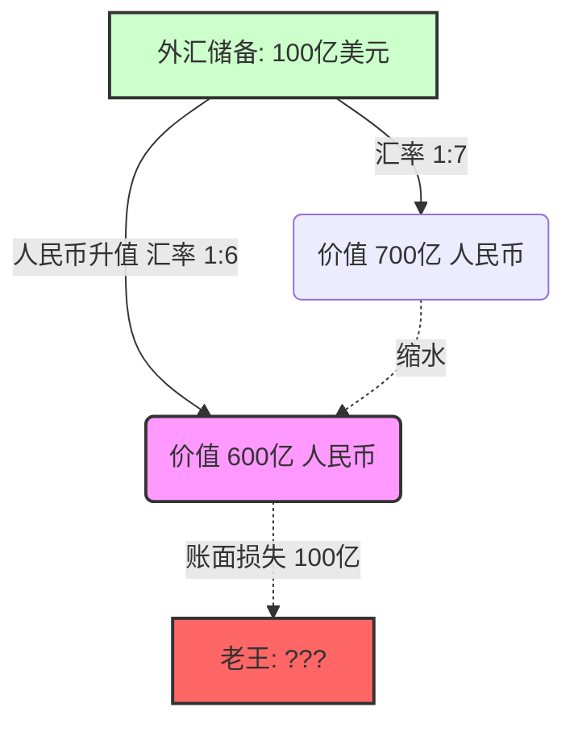
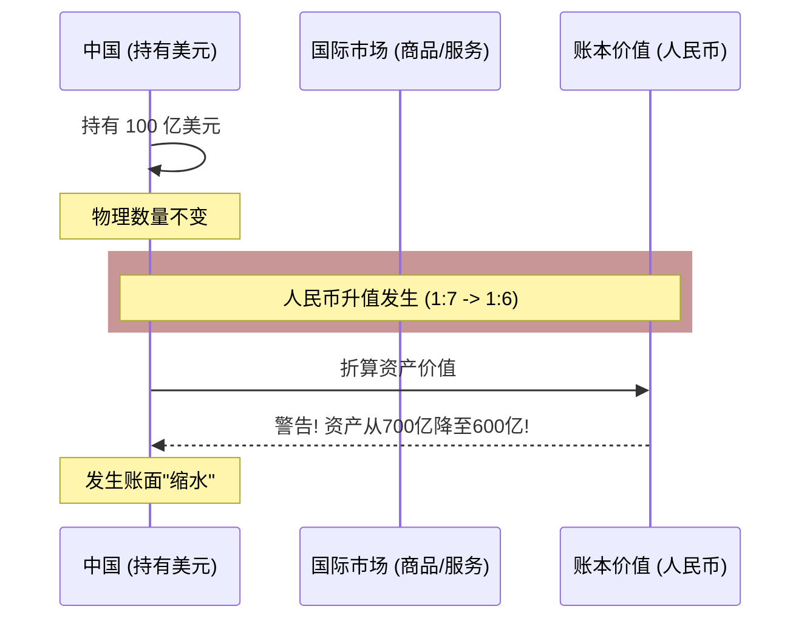

很多人会想：*“我手里的美元还是那么多美元，怎么人民币一升值，我的钱就‘变少’了呢？”*

别急，我是你的经济学老师，让我们用**费曼学习法**，通过一个简单的“存钱罐”例子，把这个账算清楚。

---

### 第一部分：核心概念——“记账单位”的魔法

首先，我们要明确一个概念：**中国的官方外汇储备，虽然手里拿的是美元（或其他外币），但在国内央行的账本上，最终往往是折算成人民币来衡量价值的（或者在很多人的心理账户里是这样换算的）。**
ID: 1774612230721

外汇储备缩水，通常指的并不是美元的数量变少了，而是这些美元**“换回人民币的价值”变少了**。

#### 举个生动的栗子：老王的美元存钱罐 🐷

假设你是老王（代表中国央行），你在美国卖鞋子赚了辛苦钱，手里攒了 **100亿美元**。
ID: 1774612230724

*   **场景一：过去（汇率 1:7）**
    *   那时候，1美元能换7元人民币。
    *   老王看了看手里的100亿美元，心里盘算：“嗯，这笔钱相当于 **700亿人民币** 的财富。”（这是他在国内的购买力）。

*   **场景二：现在（人民币升值，汇率 1:6）**
    *   人民币升值了，1美元只能换6元人民币了。
    *   老王手里依然紧紧攥着那 **100亿美元**（美元一张没少）。
    *   但是，当老王再次折算身家时，他发现：“坏了！这笔钱现在只值 **600亿人民币** 了！”

**结果：** 仅仅是因为汇率变动，老王什么都没做，账面财富凭空“蒸发”了 **100亿人民币**。这就是所谓的**外汇储备缩水**。

---

### 第二部分：深入理解——为什么这是个“坏消息”？

你可能会问：“反正我们主要用美元去国外买东西，美元没少不就行了吗？”
ID: 1774612230728

事情没那么简单。这种缩水会带来实际的负面影响：

1.  **国民财富的隐形流失：**
    外汇储备是国家用实实在在的商品（衬衫、鞋子、家电）换回来的。
    *   当年我们卖出商品时，付出的劳动和资源价值700亿人民币。
    *   现在这些美元存回来，只能买回国内价值600亿人民币的东西了。
    *   **这意味着：** 我们辛辛苦苦攒的劳动成果，被“汇率”这个泡沫吃掉了一部分。

2.  **央行资产负债表的失衡：**
    央行发行人民币（负债）去购买美元（资产）。
    *   如果你发了700亿人民币的债，买回来价值700亿的美元，账是平的。
    *   如果美元贬值（人民币升值），你手里的资产变成了600亿，但你欠的债（发行的人民币）还是700亿。
    *   这会导致央行出现**账面亏损**。

3.  **债权人吃亏逻辑：**
    中国是美国的债权人（买了美国国债）。如果美元贬值（人民币升值），相当于借钱的人（美国）还是还你那么多美元，但这些美元变得“不值钱”了。这实际上是**美国通过货币贬值赖掉了一部分债务**。

---

### 第三部分：图解总结

我们可以把人民币升值看作是一个“过滤器”，当外汇通过这个过滤器回到国内时，被截留了一部分价值。
ID: 1774612230731

---

### 第四部分：拓展学习（央行怎么应对？）

既然升值会让外汇储备缩水，国家会怎么做呢？这里有几个高级概念：
ID: 1774612230735

1.  **外汇储备多元化（不要把鸡蛋放在一个篮子里）：**
    不要只存美元。如果美元贬值，我们手里还有欧元、日元、黄金。如果欧元刚好升值，就可以对冲掉美元缩水的损失。
2.  **藏汇于民：**
    国家不要自己拿着那么多外汇，鼓励企业和老百姓自己持有外汇。这样汇率波动的风险就分散到了千万个市场主体身上，而不是央行一家承担。
3.  **“一带一路”与对外投资：**
    趁着美元还值钱，或者趁着人民币购买力强，赶紧把美元花出去！去国外买矿山、买技术、修铁路（将货币资产转化为实物资产），这样就不怕货币贬值了。

---

### 第五部分：费曼式小测验（加强巩固）

来两道题，看看你是不是真的懂了“缩水”的逻辑。
ID: 1774612230738

**题目一（计算题）：**
中国央行持有 **1万亿美元** 国债。
2020年，汇率是 **1美元 = 7人民币**。
2023年，汇率变成了 **1美元 = 6.5人民币**。
请问：以**人民币**计价，中国的外汇储备缩水了多少？

**题目二（逻辑判断）：**
当人民币升值导致外汇储备“缩水”时，以下哪种说法是**正确**的？
A. 中国央行金库里的美元纸币数量物理减少了。
B. 中国用这些美元去美国买石油，购买力也大幅下降了（假设油价没变）。
C. 中国如果把这些美元换回人民币在国内使用，能换到的钱变少了。
D. 美国人欠中国的钱变得更多了。

***

*(请思考后再看答案)*

点击查看答案与解析

**题目一答案：**
**缩水了 5000亿 人民币。**
*   2020年价值：10000亿 × 7 = 70000亿人民币
*   2023年价值：10000亿 × 6.5 = 65000亿人民币
*   差额：70000 - 65000 = 5000亿人民币。

**题目二答案：**
**正确答案：C**
*   **解析：**
    *   A错：美元数量没变，是估值变了。
    *   B错：如果直接在美国花美元，只要美国物价不涨，购买力是不变的（1美元还是买1美元的油）。缩水是相对于**人民币**而言的。
    *   C对：这就是“缩水”的定义，换回本币的价值降低。
    *   D错：美国人欠的美元数量没变，但因为美元相对贬值，美国人其实还得更轻松了（赖账成功）。

