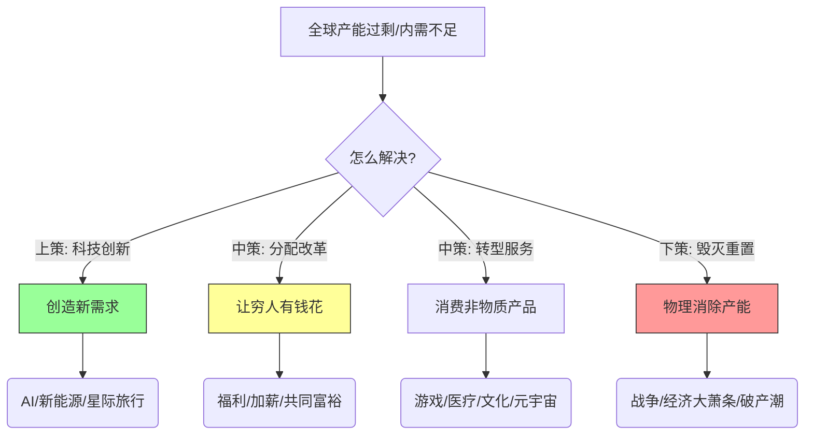

> [!question]
> 
这是一个非常深刻的问题，直击了资本主义经济体系的**“终极BUG”**。你所描述的这种情况，在经济学里被称为**“生产过剩危机”**或者**“长期停滞”**。

确实，地球只有这么大，人口只有这么多，如果把全世界看作一个封闭的“地球村”，当所有人都买得起手机、汽车、冰箱，且产能还源源不断时，系统就会卡死。

面对**“全球性内需不足/供给过剩”**，人类历史和经济学给出了四种解法（有的很美好，有的很残酷）。

---

### 1. 费曼学习法：地球村面包店的故事 🍞

想象全世界是一个村子，只有一家面包店（全球制造业）。

*   **现状**：面包店机器太先进，一天能烤 1万个面包，但村民一天只能吃掉 5000 个。
*   **危机**：面包卖不掉 $\rightarrow$ 面包店亏损 $\rightarrow$ 裁员 $\rightarrow$ 被裁的村民没钱买面包 $\rightarrow$ 面包更卖不掉。（这就是大萧条螺旋）。

怎么破局？

#### 解法一：科技爆炸（创造新欲望）—— 最美好的路 ✨
既然面包吃腻了，那就**发明“蛋糕”**！
*   **逻辑**：人的**基本需求**（衣食住行）是有限的，但**欲望**是无限的。
*   **操作**：通过科技革命，创造出一种大家以前**“不知道自己需要，但看到就想要”**的东西。
*   **历史举例**：
    *   马车饱和了 $\rightarrow$ 发明汽车。
    *   功能机饱和了 $\rightarrow$ 发明智能手机。
    *   手机饱和了 $\rightarrow$ 现在大家都在赌**AI、VR、或者长生不老药**。
*   **本质**：**供给创造需求**（萨伊定律的进阶版）。只要有新玩意儿，你就会把旧的扔掉，重新消费。

#### 解法二：贫富调节（给穷人发钱）—— 最温和的路 🤝
*   **逻辑**：全球看起来“需求不足”，其实往往是**“有需求的人没钱，有钱的人没需求”**。
    *   亿万富翁只有一张嘴，他一天吃不了 1万个面包。
    *   穷人想吃面包，但口袋里没钱。
*   **操作**：通过税收、福利、提高工资，把富人花不完的钱，转移给穷人。
*   **效果**：穷人拿到钱会立马去消费，内需瞬间就被“释放”出来了。这就是为什么很多国家提倡“共同富裕”或“基本收入（UBI）”的原因。

#### 解法三：虚实转换（从物质到服务）—— 最聪明的路 💆‍♂️
*   **逻辑**：肚子有限，但**脑子和体验**是无限的。
*   **操作**：当物质商品（车、房、家电）卖不动了，就开始卖**“时间”**和**“体验”**。
    *   比如：旅游、游戏、心理咨询、养老服务、教育、美容。
*   **特点**：服务业的“产能”很难过剩，因为它是消耗时间的。你买一个游戏皮肤、看一场直播，并没有消耗地球的铁矿石，但你产生了消费。
*   **未来**：元宇宙（Metaverse）其实就是为了解决这个问题——在虚拟世界里创造无限的内需。

#### 解法四：毁灭与战争（推倒重来）—— 最黑暗的路 💣
*   **逻辑**：如果面包实在卖不掉，又发明不出蛋糕，富人也不肯分钱... 那就**把面包店炸了**，甚至把邻居的家炸了。
*   **操作**：这就是**战争**。
*   **残酷的经济账**：二战结束后，欧洲一片废墟。这时候“内需”简直大得惊人——因为什么都缺！要盖房、修路、造车。于是全球经济迎来了几十年的黄金增长期。
*   **本质**：这叫**“强制去产能”**。这当然是我们最不想看到的结局，但历史上一再发生。

---

### 2. 图解：全球过剩的“泄洪口” 🌊

---

### 3. 深入思考：为什么我们现在感觉这么“卷”？🌀

你提到的问题，正是当下世界焦虑的根源。

目前的情况是：
1.  **旧的技术红利吃完了**（智能手机普及了，互联网红利没了）。
2.  **新的技术（AI/可控核聚变）还没完全爆发**，接不上力。
3.  **贫富差距巨大**，导致全球总购买力跟不上总产能。

所以，现在全球进入了一个**“存量博弈”**阶段。既然蛋糕不大了，那就只能**抢别人的蛋糕**。
*   国家之间打贸易战、关税战。
*   企业之间搞价格战（内卷）。
*   个人之间搞学历战。

---

### 4. 拓展：如果地球真的不够用了怎么办？🚀

这就引出了马斯克（Elon Musk）等人的终极逻辑：**跨行星物种**。

*   当“地球内需”彻底锁死，唯一的出路就是把“市场”定义扩大到**太阳系**。
*   去火星盖房子、修路，这又能带来几百年的巨额内需。
*   虽然听起来像科幻，但从超长期的经济学角度看，**探索宇宙是解决人类内需不足的最终物理手段**。

---

### 5. 随堂小测验：你是经济医生 🩺

来测试一下你对这个宏观难题的理解：

#### 题目 1：
20世纪20年代，美国产能极度过剩，导致了大萧条。后来在30年代末40年代初，美国经济突然奇迹般复苏，失业率归零，工厂满负荷运转。主要原因是？
*   A. 每个人都买了第二辆车。
*   B. 罗斯福新政发了很多钱。
*   C. 二战爆发，巨大的军火订单和战后重建需求消灭了过剩产能。

#### 题目 2：
在这个“全球内需不足”的时代，为什么**奢侈品行业**（像爱马仕、LV）反而经常涨价且销量不错，而**普通家电**（像电视、冰箱）却在疯狂打价格战？
*   A. 因为穷人比富人多。
*   B. 因为普通商品产能过剩且同质化严重，而富人手中的财富比例在增加，且奢侈品卖的是“稀缺感”而非“实用性”。

---

### ⬇️ 答案解析

#### 题目 1 解析：
*   **答案：C**（虽然B也起到了作用，但C是决定性的）。
*   **解析**：这是一个残酷的事实。大萧条最终是被战争需求给“吃掉”的。战争制造了无穷无尽的“破坏性需求”。这也警示我们，当经济问题无法通过和平手段（改革、创新）解决时，战争风险就会上升。

#### 题目 2 解析：
*   **答案：B**。
*   **解析**：这反映了分配问题（K型复苏）。全球财富越来越集中在少数人手里，所以服务于富人的“高端消费”依然火热。而服务于大众的“普通制造”，因为大众口袋里钱不多且早就买齐了，只能陷入惨烈的价格战。这也印证了前面说的“解法二：贫富调节”的重要性。

希望这个视角能帮你理解为什么现在全世界都在喊“创新”，同时也都在担心“冲突”。这是经济周期运行到极致的必然分岔路口。🌍⚖️