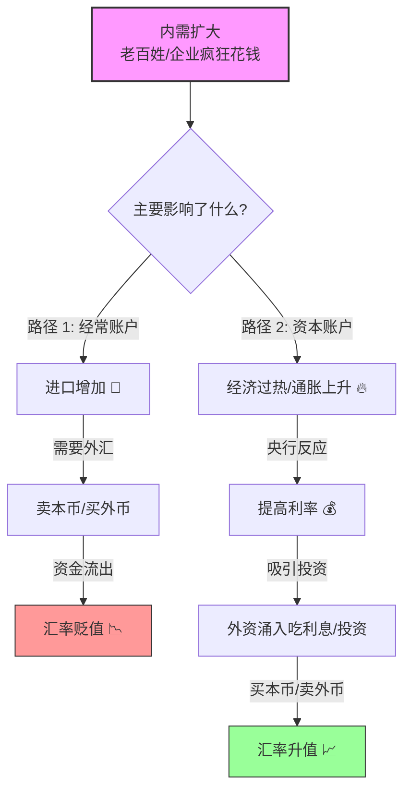
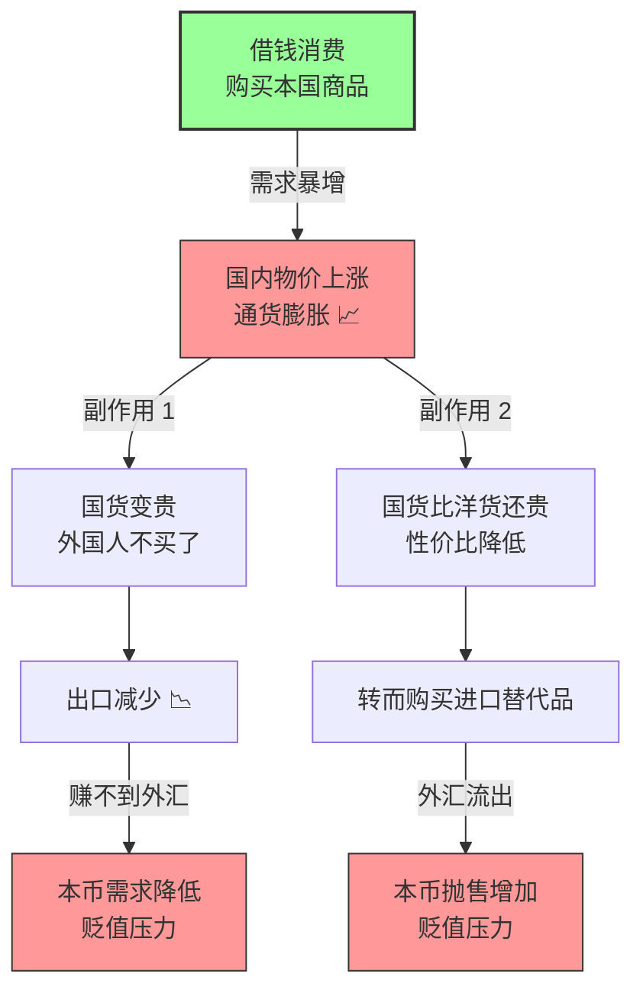

---
aliases:
  - 内需对汇率的影响和关系
---
> [!question]
> 内需对汇率的影响和关系
> 
> 关于**内需（Domestic Demand）**与**汇率**的关系，很多同学容易晕，因为教科书里有时候说内需扩大会导致货币**贬值**，有时候又说会导致**升值**。

你好！很高兴你提出了这个非常有深度的问题。

上一节课我们讲了生产效率如何影响汇率（巴拉萨-萨缪尔森效应），今天我们换个角度，从**“花钱”**（内需）的角度来看看汇率是怎么变的。

关于**内需（Domestic Demand）**与**汇率**的关系，很多同学容易晕，因为教科书里有时候说内需扩大会导致货币**贬值**，有时候又说会导致**升值**。

**这是怎么回事？难道经济学不讲逻辑吗？** 🤯

其实，这是因为内需通过**两条完全不同的“管道”**在影响汇率，它们像是一场**拔河比赛**。我将用费曼学习法，把这两个管道拆解得清清楚楚。

---

### 1. 费曼学习法：拔河的双方

想象这还是那个**“国家大院”**，内需旺盛意味着这个大院里的人**突然想疯狂花钱**。

#### 🥊 管道一：贸易管道（倾向于让货币贬值 📉）
*   **逻辑：** 大家都想买买买。国内的东西买不够，就去买国外的（进口增加）。
*   **通俗解释：** 你要买美国的iPhone、澳洲的龙虾，你就得把手里的**人民币换成美元、澳元**去支付。
*   **结果：** 市场上**卖**人民币的人多了（为了换外汇），**买**外币的人多了。根据供需关系，人民币多了就不值钱了。
*   **结论：** **单纯的进口买买买 -> 贸易逆差 -> 汇率贬值。**

#### 🥊 管道二：金融/利率管道（倾向于让货币升值 📈）
*   **逻辑：** 大家都想花钱，经济太火热了，物价开始涨（通胀）。央行（管钱的家长）为了降温，会**提高利息**（加息）。
*   **通俗解释：** 美国和欧洲的投资者一看：“哇，存在中国的钱利息变高了，而且中国经济这么火，投资机会多！”
*   **结果：** 外资像蜜蜂一样涌入（资本流入）。他们必须**卖掉美元，买入人民币**才能在中国投资或存钱。
*   **结论：** **经济火热 -> 央行加息 -> 吸引外资 -> 汇率升值。**

---

### 2. 谁会赢？（关键判断）

这就看哪种力量更大了：

1.  **短期看资本：** 在现代金融体系下，资金流动的速度比货船快得多。如果内需强劲导致央行**加息预期**强烈，通常**升值**的力量会赢。（热钱涌入）。
2.  **长期看贸易：** 如果内需只是单纯的消费（比如借钱消费），导致长期贸易逆差，国家竞争力下降，那么长期看货币会**贬值**。

---

### 3. 图解逻辑：Mermaid 流程图

这张图能帮你理清这场“拔河比赛”：

---

### 4. 举例说明：现实世界的剧本

#### 剧本 A：美国 2022-2023 年（升值剧本）
*   **背景：** 疫情后美国发钱，**内需爆炸**，大家疯狂消费。
*   **后果：** 通货膨胀太高了！美联储（央行）为了压制内需，疯狂**加息**（从0%加到5%以上）。
*   **汇率反应：** 全球资金为了赚这 5% 的利息，疯狂把钱换成美元。
*   **结果：** 虽然美国进口也多了（贸易逆差），但资本流入太猛，**美元指数暴涨**，美元大幅升值。
    *   *这属于：金融管道 胜出 🏆*

#### 剧本 B：某些资源型国家（贬值剧本）
*   **背景：** 假设某小国突然发现金矿，大家觉得自己有钱了，**内需暴涨**，疯狂买豪车、名牌包（全靠进口）。
*   **后果：** 国内没有像样的工业，加息也没人来投资（环境差）。
*   **汇率反应：** 钱都花出去买进口货了，外汇储备被掏空。
*   **结果：** 市场上全是抛售该国货币的人，**货币崩盘贬值**。
    *   *这属于：贸易管道 胜出 🏆*

---

### 5. 拓展学习：蒙代尔-弗莱明模型

如果你想更专业地装X（划掉）分析，可以深入了解以下概念：

1.  **蒙代尔-弗莱明模型 (Mundell-Fleming Model)：**
    *   这是宏观经济学的经典。它告诉我们：在**资本自由流动**的情况下，财政扩张（政府多花钱拉动内需）通常会导致**利率上升**，进而导致**汇率升值**。

2.  **J曲线效应 (J-Curve Effect)：**
    *   虽然汇率贬值有利于出口，但不会立刻见效。刚开始因为原本签好的合同价格不变，贬值反而会让贸易逆差短期恶化，图形像个“J”。

3.  **输入型通胀：**
    *   如果内需导致汇率贬值，进口的东西这就变贵了，这会进一步加剧国内的通货膨胀。

---

### 6. 课后测验：确认理解 💪

来，做两道题，看看你是不是真的懂了这场“拔河”。

#### 题目 1：
假设 A 国政府突然决定实施大规模的财政刺激计划（修桥补路、发消费券），导致国内需求激增。同时，A 国是一个**资本完全自由流动**的国家，且央行为了防止通胀决定配合**加息**。
**请问：短期内，A 国的货币最有可能升值还是贬值？为什么？**

点击查看答案解析

**答案：** 升值。
**解析：** 虽然内需增加会导致进口增加（贬值压力），但“财政刺激+央行加息”的组合拳会极大地推高国内利率。在资本自由流动的情况下，国际热钱会因为高利率而蜂拥而入（资本账户盈余），这种力量通常在短期内远远盖过贸易逆差的影响，推高汇率。

#### 题目 2：
如果 B 国内需增加，但是 B 国的**生产能力很弱**（国内造不出好东西），且 B 国实行**严格的资本管制**（外资很难进来投资吃利息）。
**请问：这种情况下，B 国内需扩大概率会导致汇率升值还是贬值？**

点击查看答案解析

**答案：** 贬值。
**解析：** 
1. 内需增加+生产能力弱 = 必须大量依赖进口 = 贸易逆差扩大（贬值压力）。
2. 资本管制 = 外资进不来 = 无法通过“利率管道”带来资金流入来对冲贬值压力。
3. 只有流出（买进口货），没有流入（投资），货币必然贬值。

---

### 总结一句话
内需对汇率的影响，取决于**“买进口货流出的钱”**和**“被高利息吸引进来的钱”**谁更多！

这下是不是清晰多了？还有其他关于汇率的疑惑吗？

---

# 既然你说借钱消费会导致货币贬值，那如果消费的产品是购买本国生产的东西是不是就不会贬值这个贬值只是用于贷款都去购买了外国商品进口商品才会贬值

你的直觉非常敏锐！👍 这是一个非常棒的思考延伸。

答案是：**你说对了一半。**

借钱购买**本国商品**，确实避免了“直接卖出本币换外汇”带来的立刻贬值压力。**但是**，这并不意味着货币就一定稳如泰山，甚至长期看可能依然面临贬值压力。

这背后的逻辑不再是简单的“买卖外汇”，而是转向了**供需关系**和**通货膨胀**。

让我们继续用**费曼学习法**，把这个过程像剥洋葱一样剥开。

---

### 1. 为什么你的直觉是对的？（第一层逻辑）

**场景：** 大家都借贷买**国产**的华为手机、比亚迪汽车，不买苹果和特斯拉。

*   **直接后果：** 我们不需要把手里的人民币换成美元去支付给美国厂商。
*   **对外汇的影响：** 外汇市场上没有出现大量的“抛售人民币”的操作。
*   **结论：** 相比于买进口货，买国货确实**大大减轻了**货币贬值的直接压力。

---

### 2. 为什么事情没那么简单？（第二层逻辑：挤出效应与通胀）

如果内需太旺盛（大家都借钱买买买），虽然买的是国货，但会引发两个副作用，这两个副作用会**间接**导致汇率压力。

#### 💣 副作用一：国内东西变贵了（通货膨胀）
*   **逻辑：** 工厂产能是有限的。如果国内抢购太疯狂，供不应求，国产商品就会**涨价**。
*   **连锁反应：**
    1.  **国内涨价：** 同样一个手机，本来卖5000，现在卖6000。
    2.  **出口受损：** 外国人一看，“哟，中国制造变贵了？那我不买了，我去买越南的。” -> **出口减少** -> 赚回来的外汇减少。
    3.  **进口诱惑：** 本国人一看，“哟，国货涨价这么厉害，算下来比进口货还贵了，那我还是买进口的吧。” -> **进口增加**。
*   **结果：** 出口少（外汇流入少），进口多（外汇流出多），最终还是会导致**货币贬值**。

#### 💣 副作用二：挤占出口资源
*   **逻辑：** 就像一个果园，产出的苹果就这么多。
*   **现象：** 本来这些苹果80%是要卖给隔壁村（出口）换钱的。现在自家人胃口大开，借钱把苹果都吃光了。
*   **结果：** 没有苹果可以卖给隔壁村了。没人给我们外汇了。对外贸易顺差缩小，**支撑汇率的基础变弱**。

---

### 3. 图解逻辑：Mermaid 流程图

我们看看“借钱买国货”是如何通过**涨价**这条路影响汇率的：

---

### 4. 关键的“反转”：央行的态度 🏦

既然内需过热会导致通胀，这就回到了我们上一节课讲的**“利率管道”**。

*   **如果**：大家借钱买国货 -> 导致通胀 -> **央行坐视不管**。
    *   **结局**：物价飞涨，根据购买力平价（PPP），货币**贬值**。

*   **如果**：大家借钱买国货 -> 导致通胀 -> **央行出手加息**（为了压制通胀）。
    *   **结局**：高利率吸引外资流入 -> 货币**升值**。

**所以，买国货会不会贬值，短期看央行加不加息，长期看通胀控制得好不好。**

---

### 5. 举例说明：土耳其 vs 中国

为了更形象，我们对比两个真实的例子。

#### 🌰 案例 A：土耳其（反面教材）
*   **操作：** 土耳其总统埃尔多安鼓励大家借钱消费、投资基建（主要是国内活动）。
*   **现象：** 国内需求爆炸，但生产力没跟上，东西不够卖。
*   **后果：** 通货膨胀率飙升到 80%！
*   **神操作：** 此时央行不仅不加息，反而降息。
*   **汇率：** 里拉（土耳其货币）暴跌。因为虽然买的是本国货，但钱变得像纸一样不值钱。

#### 🌰 案例 B：中国（正面教材）
*   **操作：** 中国在特定时期也鼓励内需（比如家电下乡、新能源车补贴）。
*   **区别：** 中国拥有**极强的制造业产能**（世界工厂）。
*   **现象：** 咱们买得越多，工厂造得越快，规模效应下成本反而**更低**了（比如现在的国产电动车，越买越便宜）。
*   **后果：** 并没有引发严重的通货膨胀，反而把物美价廉的商品卖到了全世界。
*   **汇率：** 保持相对稳定甚至升值。

---

### 6. 总结拓展

**核心结论：**
1.  **相比买进口，买国货确实更护盘。** 它切断了直接的外汇流出。
2.  **由于供需关系，买国货如果太猛，会导致通胀。** 通胀是货币贬值的隐形推手。
3.  **产能是关键。** 如果你的国家工业强大（如中国），怎么买都不涨价，那汇率就稳；如果你的国家生产力烂，一买就断货涨价，那汇率必崩。

**拓展知识：**
*   **经常账户与资本账户的再平衡：** 如果国内储蓄下降（因为都借钱花掉了），在投资不变的情况下，经常账户（贸易）往往会恶化。这是著名的国民收入恒等式推导出来的：$(X - M) = (S - I) + (T - G)$。
    *   *简单人话：如果不存钱全花掉，最后国家往往会欠外债或者贸易逆差。*

---

### 7. 课后测验：确认理解 💪

#### 题目 1：
假设 C 国是一个农业国，工业基础薄弱，所有家电都要靠手工打造，产量很低。
政府突然向每个国民发放了 100 万消费贷，规定**只能购买本国生产的家电**。
**请问：接下来 C 国的货币汇率大概率会发生什么变化？（假设央行不加息）**

点击查看答案解析

**答案：** 贬值。
**解析：** 
1. 钱多了，货很少（工业薄弱） -> 导致本国电器价格飞涨（恶性通胀）。
2. 通胀意味着货币对内购买力大幅下降。
3. 虽然没有直接买进口，但因为国内东西太贵，C 国的出口会彻底归零（太贵卖不出去），同时黑市上人们会想尽办法把这种缩水的货币换成外币保值。
4. 最终导致汇率贬值。

#### 题目 2：
你提到借贷消费国货可能导致“挤出出口”。那如果此时全球经济正好都不景气，国外本来就不买我们的东西（出口需求本身就很弱），这时候我们借钱在国内猛烈消费国货，对汇率的负面影响大吗？

点击查看答案解析

**答案：** 负面影响较小，甚至可能有正面影响。
**解析：** 
1. 既然本来就没人买（产能过剩），国内消费正好把这些多余的产能消化掉，不会导致涨价（通胀低）。
2. 企业赚到了钱，经济复苏，反而可能吸引看好该国经济复苏的资本流入。
3. 这就是凯恩斯主义的精髓：在经济萧条时，刺激内需是救命良药，副作用最小。

---
这次有没有把“借钱买国货”的逻辑链条彻底打通？😄
