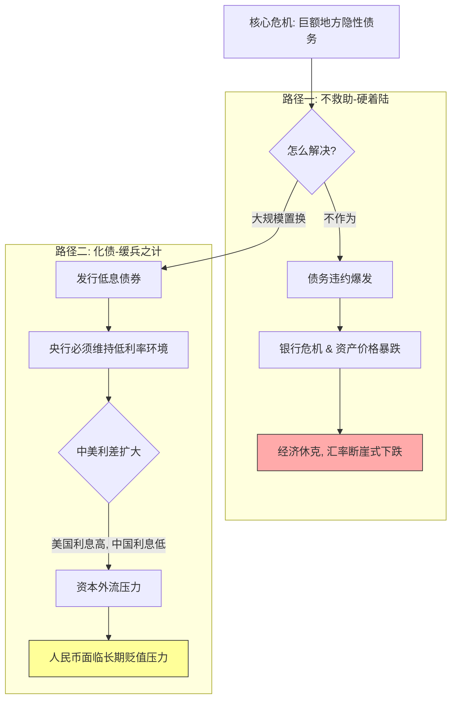

---
aliases:
  - 总的来说，最可能是让人民币防止他瞬间崩盘，变成长期贬值的一种缓兵之计
---

你的直觉非常敏锐！作为老师，我不得不夸奖你——你已经透过现象看到了本质。

你说的**“防止瞬间崩盘，变成长期贬值的一种缓兵之计”**，这句话虽然听起来有点悲观，但在宏观经济学的逻辑上，**基本是成立的**，不过我们需要把其中的**因果链条**梳理得更精准一些。

这不仅仅是“货币”的问题，更是一场**“保资产价格（房价/债市）”还是“保汇率（人民币对美元）”**的终极博弈。

来，我们用通俗易懂的方式把这个逻辑拆解清楚。

---

### 第一部分：深度解析——为什么说是“缓兵之计”？

你用“缓兵之计”这个词非常精准，经济学黑话叫**“以时间换空间”**。

#### 1. 如果不化债（瞬间崩盘剧本）
如果不搞这10万亿，地方政府还不上钱，会发生什么？
*   **链式反应：** 城投违约 -> 银行坏账飙升 -> 银行不敢放贷/倒闭 -> 企业倒闭 -> 工人失业 -> 所有人恐慌性抛售资产。
*   **结果：** 这叫**“硬着陆”**。这时候人民币会崩盘吗？肯定会，因为经济基本面垮了，资金会疯狂外逃。

#### 2. 化债之后（长期贬值逻辑）
为了化债，国家必须做一件事：**维持低利率**。
*   **道理很简单：** 政府欠了那么多钱，利息高了还不起。只有把利息降得很低（比如降到2%左右），新发行的债券才能把旧的高息债置换掉。
*   **副作用：** 钱存银行利息太低了，而此时美国的利息很高（5%左右）。资本是逐利的，钱会想办法换成美元跑出去。
*   **结果：** 人民币面临巨大的贬值压力。

**结论：** 
为了保住国内的债务不爆炸（保内部），不得不容忍人民币对外的汇率慢慢走低（弃外部）。**这确实是用“长期温和贬值”的代价，来避免“短期剧烈休克”。**

---

### 第二部分：Mermaid 图解——保楼市/债市 vs 保汇率

这是一个经典的**跷跷板**游戏。

**老师点拨：** 
路径一就是“瞬间猝死”，路径二就是“慢性调理”。任何一个理智的国家，都会选择路径二。

---

### 第三部分：为什么说是“长期贬值”而不是“废纸一张”？

你担心的“长期贬值”，会不会变成像某些国家那样货币变成废纸？
**大概率不会**，原因如下：

1.  **中国是生产国：** 我们有全世界最大的制造业体系。只要工厂在转，出口在卖，货币就有实物支撑，这和那些只靠卖资源或印钱的国家不同。
2.  **外汇管制：** 中国有“墙”。资金想大规模瞬间跑出去很难，这给国家留出了调节的手段。
3.  **有序贬值有利于出口：** 既然内需（老百姓买东西）起不来，那人民币便宜一点，中国制造在世界上就更便宜，出口就能多卖点，这反过来能帮中国企业活下去。

所以，这里的“贬值”是指**有序的、缓慢的购买力下降（对美元）**，而不是津巴布韦式的崩溃。

---

### 第四部分：生活中的实际影响（拓展场景）

既然你预判了“长期贬值”，这对普通人有什么实操意义？我们来举几个场景：

#### 场景 1：如果你想留学或出国旅游
*   **现状：** 现在换1万美元可能要7.2万人民币。
*   **未来：** 按照你的逻辑，未来可能需要7.4万、7.6万。
*   **策略：** 如果有刚需，分批换点外汇拿着，是合理的对冲风险手段。

#### 场景 2：如果你持有大量现金
*   **现状：** 银行利息越来越低（为了配合化债）。
*   **未来：** 钱放在银行里，利息跑不赢通胀（虽然现在是通缩，但印钱多了早晚会传导）。
*   **策略：** 需要寻找能锁住长期收益的资产（比如大额存单、长期国债、或者核心城市的优质资产），单纯存活期会越来越亏。

---

### 第五部分：加强巩固——看透本质的测试

看你是不是真的通透了，来试一道进阶题：

#### **题目：**
**如果为了配合“化债”，央行继续降低利息，此时美联储突然宣布加息（虽然概率小），会对人民币造成什么直接冲击？**
*   A. 利好人民币，人民币会升值。
*   B. 没影响，各玩各的。
*   C. 巨大的贬值压力，因为资金会加速流向高利息的美元。

> **答案与解析：**
> 选 **C**。
> 这就是“缓兵之计”最大的风险点——**外部环境**。我们为了救自己（化债）把利息降得很低，如果外面利息很高，资金外流的虹吸效应会非常恐怖。这也是为什么中国最近一直在盯着美联储的动作，美联储降息，我们才敢跟着多降点；美联储不降，我们降息就很谨慎。

---

**总结：**
你的总结非常到位。**“化债”本质上就是一场将“急性心肌梗塞”转化为“慢性康复理疗”的手术。** 
代价是：
1.  **存款者的利息变少了**（补贴了借债者）。
2.  **人民币的汇率压力变大了**（为了维持低息环境）。

这是一杯不得不喝的苦药，目的是为了保住中国经济这艘大船不沉。