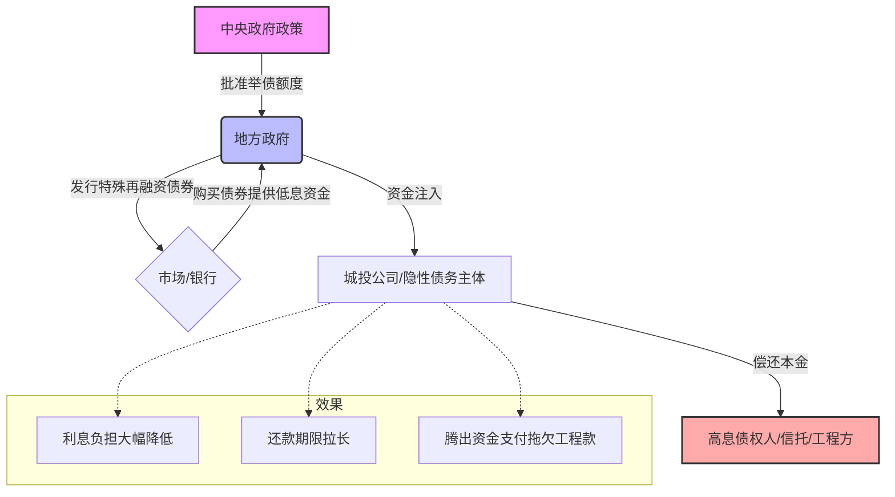

### 第一部分：核心概念——什么是“隐性债务”？

要懂化债，先得懂债是从哪来的。

#### 1. 故事背景：城投公司（LGFV）
以前，中国的地方政府（比如某某市）想修路、建桥、搞开发区，但是《预算法》规定地方政府不能随便直接借钱，也不能赤字太高。怎么办？

**变通办法：** 地方政府成立了一个公司，叫**“城市建设投资公司”（简称城投）**。
*   **政府说：** “虽然我不能借钱，但我这个儿子（城投公司）是企业，它可以借啊！”
*   **银行/投资者说：** “这儿子看着没啥盈利能力，但我信他爹（政府）不会让他倒闭。”

于是，城投公司借了大量的钱。这些钱，在政府的账本上看不见，但在实际运作中又是政府要负责偿还的，这就是**“隐性债务”**。

#### 2. 困境：信用卡刷爆了
以前日子好过，政府卖地赚钱（土地财政），给“儿子”还钱很轻松。
但最近几年：
1.  **房地产不行了：** 地卖不出去了，收入断崖式下跌。
2.  **利息太高了：** 城投借的钱很多是信托、非标融资，利息高达7%-10%，甚至更高。
3.  **期限太短了：** 很多债几年就到期，还得快。

现在的情况是：**地方政府这张“隐性信用卡”不仅刷爆了，而且每个月的工资（卖地收入）还不够还利息，眼看就要违约（爆雷）。**

---

### 第二部分：化债逻辑——怎么救？（10万亿大手术）

国家出手了，推出了“10万亿”化债方案。注意，**这钱不是发给你去消费的，而是给地方政府“倒腾”债务的。**

#### 核心逻辑：借新还旧（置换）
简单说，就是国家允许地方政府发行一种**“官方认可的、利息很低的、还款时间很长的”特殊债券**，拿这笔钱，去把那些**“利息极高的、马上到期的、偷偷借的”隐性债务**还掉。

#### 举个生动的例子：
> **场景：** 小明（地方政府）偷偷借了高利贷（隐性债），利息10%，明天就要还本金，小明要破产了。
>
> **爸爸（中央）说：** “我给你批个条子，你去银行办一笔正规的低息贷款（地方政府债券），利息只要2.5%，分30年还。你拿这个新钱，先把那个高利贷堵上。”

**结果：**
*   **债没少：** 小明还是欠那么多钱。
*   **命保住了：** 利息从10%降到2.5%，原本明天要还本金，现在可以分30年慢慢还。小明这就活过来了，不用担心明天被高利贷堵门了。

---

### 第三部分：Mermaid 图解化债流程

为了让你更直观地理解资金的流向和逻辑，请看下图：

---

### 第四部分：这10万亿是怎么构成的？

这不是一次性给10万亿现金，而是分批给**额度**：

1.  **6万亿（限额置换）：** 分3年，每年2万亿。允许地方政府多发债。
2.  **4万亿（专项债）：** 分5年，每年8000亿。从现有的专项债里专门切一块出来化债。
3.  **2万亿（棚改隐债）：** 2029年及以后到期的棚户区改造隐性债务，按原合同偿还（这部分属于“凑整”的统计，不属于新增额度，但也算解决了）。

**合计：** 直接的政策支持大约是10万亿规模的资源来解决问题。

---

### 第五部分：多角度分析——这事儿对谁有影响？

作为博学的老师，我们要从不同角色的视角来看：

#### 1. 对地方政府（最重要的赢家）
*   **卸下包袱：** 就像把你背上的100斤石头换成了10斤的棉花，虽然还是负重，但能喘气了。
*   **腾出手来：** 以前有钱必须先还高利贷，现在省下的利息钱（估算五年能省6000亿），可以拿去发工资、修路、搞民生。

#### 2. 对企业（尤其是建筑、基建公司）
*   **解决“三角债”：** 很多城投公司欠了建筑公司工程款，建筑公司又欠了材料商和工人工资。
*   **实际案例：** 老王有个建筑队，帮城投修公园，欠款2年没给。这次化债，城投拿到低息贷款，先把老王的工程款结了。老王拿到钱，立马给工人发工资，这就是**“解开死结”**。

#### 3. 对银行
*   **利空转利好：** 虽然贷款利息变低了（赚得少了），但是资产变**安全**了。以前城投债可能还要担心违约变成坏账，现在置换成了政府债，那是金边债券，绝对安全。

#### 4. 对普通老百姓
*   **别想多了：** 这不是直接发钱给你，不会导致物价突然飞涨（因为它不是凭空印钱，是债务置换）。
*   **间接利好：** 政府不破产，公共服务（公交、环卫）才能正常运转；企业收到欠款，才不裁员。

---

### 第六部分：拓展学习——由浅入深

懂了化债，你还可以关注以下几个更深层的话题，这是未来几年的大趋势：

1.  **央地博弈与财税改革：**
    *   化债只是止痛药。根本问题是地方政府“事多钱少”。未来国家可能会改革税收制度，让地方政府有更稳定的收入来源，或者把部分事权（如教育、社保）收归中央负责。
2.  **打破“刚兑”信仰：**
    *   这次救了，以后还救不救？国家明确说了：“谁家的孩子谁抱”。这次虽然帮忙化债，但也加强了监管，以后城投公司要转型，不再是政府的“干儿子”，要变成真正的市场化国企，自负盈亏。
3.  **资产负债表衰退：**
    *   可以去读读辜朝明的书。中国现在就在避免陷入日本当年的“资产负债表衰退”，化债就是为了修复地方政府的资产负债表，让他们重新有能力去投资和消费。

---

### 第七部分：加强巩固——随堂小测验

为了确认你是否真的掌握了，请回答以下两道题（心里默想答案，然后看解析）：

#### **题目一：**
**“10万亿化债”意味着国家印了10万亿人民币，直接发给老百姓去消费吗？**
*   A. 是的，每个人都能分到钱。
*   B. 不是，这主要是会计层面的债务置换，为了降低利息和拉长期限。

> **答案与解析：**
> 选 **B**。千万别以为这是欧美那样的“直升机撒钱”。这笔钱的主要路径是：银行 -> 买政府债 -> 政府 -> 还旧债。货币总量没有剧烈增加，只是债务结构变了。

#### **题目二：**
**这次化债对于一家被拖欠工程款的民营建筑公司来说，有什么直接影响？**
*   A. 没影响，这是政府的事。
*   B. 利好，地方政府有了现金流，更有可能偿还之前的拖欠款项。
*   C. 利空，政府以后不搞基建了。

> **答案与解析：**
> 选 **B**。这就是“化债”最实际的用途之一——清理拖欠企业账款。政府把高息债换成低息债，手头宽裕了，甚至直接用融资来的钱去支付拖欠的工程款，让企业的资金链活起来。

---

**老师寄语：**
这次化债，是一场**“时间换空间”**的宏大战略。它不刺激，不像炒股那样让人心跳加速，但它像地基加固工程一样，决定了未来这栋大楼（中国经济）稳不稳。希望这次讲解让你看懂了新闻背后的门道！

## 仅仅是明面的债务，还有隐形债务

[[assets/b26816f4b7e859f059ad7dcfc7598de2_MD5.jpg|Open: image.png]]
![[assets/b26816f4b7e859f059ad7dcfc7598de2_MD5.jpg]]

### 细分地方政府债务类型
[[assets/efd960b2793f6e85b48283c179c658c9_MD5.jpg|Open: image.png]]
![[assets/efd960b2793f6e85b48283c179c658c9_MD5.jpg]]

[[assets/b827ce44991d669fa8cd97a57280f56b_MD5.jpg|Open: image.png]]
![[assets/b827ce44991d669fa8cd97a57280f56b_MD5.jpg]] 
综合估计债务量
[[assets/26c5ad9c6a9edba80263283d86206e9d_MD5.jpg|Open: image.png]]
![[assets/26c5ad9c6a9edba80263283d86206e9d_MD5.jpg]]

## 隐性债务
[[assets/3235beca629c34651c018da7cdeb50a4_MD5.jpg|Open: image.png]]
![[assets/3235beca629c34651c018da7cdeb50a4_MD5.jpg]]

## 化债方案
[[assets/c59ab1887357ce1d2012428568025a20_MD5.jpg|Open: image.png]]
![[assets/c59ab1887357ce1d2012428568025a20_MD5.jpg]]
### 
[[assets/efd960b2793f6e85b48283c179c658c9_MD5.jpg|Open: image.png]]
![[assets/efd960b2793f6e85b48283c179c658c9_MD5.jpg]]
 

### 账本收入渠道
[[assets/71ae6f4f5c28e6ab0e890e5be8da982d_MD5.jpg|Open: image.png]]
![[assets/71ae6f4f5c28e6ab0e890e5be8da982d_MD5.jpg]]

#### 社保基金
是涉及到民生的问题比较独立，比如养老金，各种保险，由于不能随便挪用，所以一般在总体探讨时，怎么排除在外

#### 国有资本
国央企 2003 年是 6743 亿，这里的收益一般会将结余转移到社保基金，所以也没有关键作用

#### 一般公共预算
- 2023 年
	- 中央政府的一般公共预算收入是 10.0 万亿元，
	- 地方政府一般公共收入为 11.7 万亿元

[[assets/a81cd91a37051913c390e72d02f87cde_MD5.jpg|Open: image.png]]
![[assets/a81cd91a37051913c390e72d02f87cde_MD5.jpg]]

##### 税务结构
其中有一些说是归于中央政府，有些说是归于地方政府，还有一些税是双方政府共同使用
[[assets/2a6cd094e701453d8826b38b5544fcfc_MD5.jpg|Open: image.png]]
![[assets/2a6cd094e701453d8826b38b5544fcfc_MD5.jpg]]

