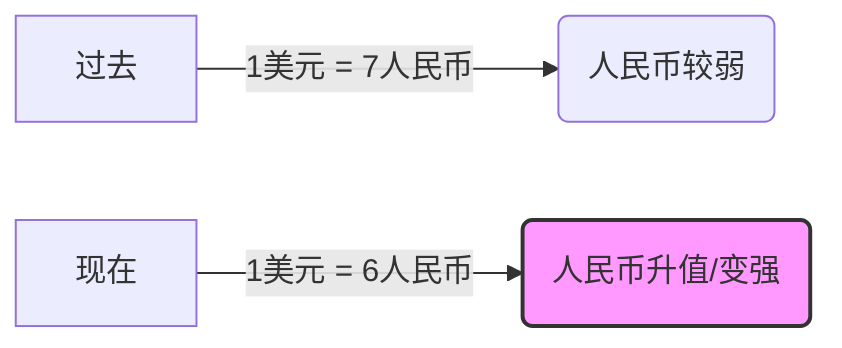
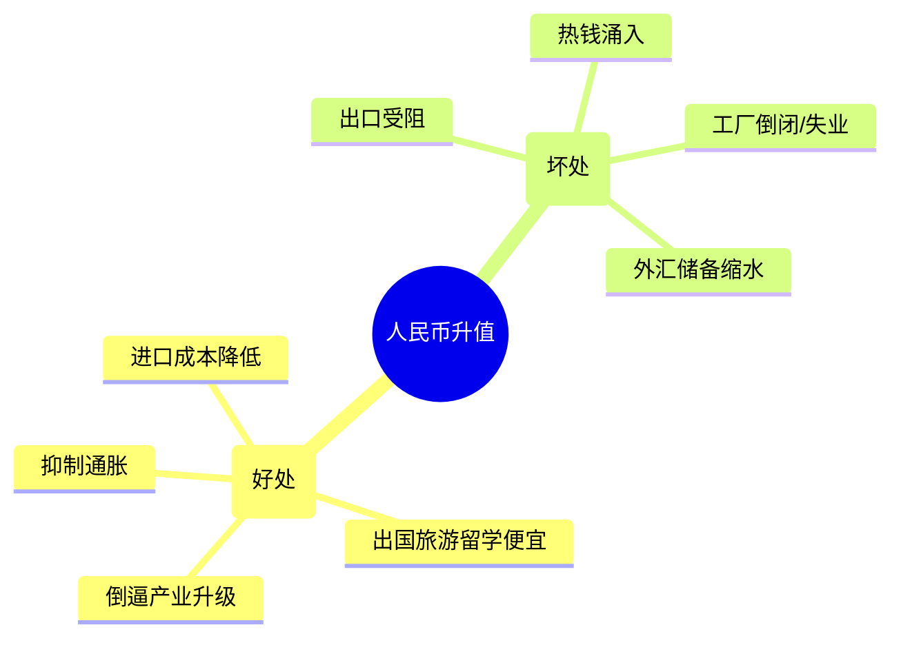

你好！我是你的经济学老师。今天我们要探讨的话题非常“值钱”，那就是——**人民币升值**。

想象一下，你口袋里的钱突然“变壮”了，原本只能买一个苹果，现在能买一个半了（当然是指买外国苹果）。听起来很棒对吧？但经济学告诉我们，凡事都有两面性。

让我们用**费曼学习法**的思路，通过生动的例子和图表，把这件事彻底搞懂。

---

### 第一部分：什么是人民币升值？

简单来说，就是**人民币更值钱了**，或者说**美元（外币）贬值了**。
ID: 1774612230354

*   **以前：** 你需要花 **7块钱** 人民币去换 **1美元**。
*   **现在：** 你只需要花 **6块钱** 人民币就能换 **1美元**。

这就是人民币升值。你的钱“含金量”变高了。

---

### 第二部分：人民币升值的好处与坏处（双刃剑）

这把剑舞起来，有人欢喜有人愁。
ID: 1774612230357

#### 1. 好处（利好谁？）

*   **老百姓的出国梦：** 出国留学、旅游、海淘变得更便宜了。
    *   *举例：* 小明要去美国读硕士，学费5万美元。汇率是7时，家里要准备35万人民币；汇率升到6时，只需要30万。**省下5万块！**
*   **进口企业狂喜：** 购买国外的原材料（如石油、天然气、铁矿石、芯片）成本大幅下降。这有助于抑制**输入型通货膨胀**。
    *   *举例：* 航空公司需要大量进口燃油，人民币升值意味着它们最大的成本项直接打折，利润飙升。
*   **国家面子与地位：** 强势货币是强国的象征，有利于**人民币国际化**，让别国更愿意存人民币。
*   **倒逼产业升级：** 既然做廉价产品不赚钱了（因为出口变贵），企业就被迫去搞高科技、高附加值的产品。
ID: 1774612230360

#### 2. 坏处（伤害谁？）

*   **出口企业哭晕在厕所：** 这是最直接的打击。因为外国人买中国货变贵了，订单就会减少。
    *   *举例：* 老王是卖袜子的，一双袜子卖1美元。
        *   汇率7时，他拿回1美元换成7元人民币，成本6元，赚1元。
        *   汇率6时，他拿回1美元只能换6元人民币，成本还是6元，**白干了！** 如果涨价，美国客户就去买越南的袜子了。
*   **就业压力增大：** 中国有很多劳动密集型出口工厂（如纺织、玩具）。工厂倒闭，工人就会失业。
*   **热钱涌入与资产泡沫：** 国际炒家看到人民币在涨，就会把大量美元换成人民币来“躺赚”汇率差，这些钱可能会炒高房价和股市，形成泡沫。
* [[人民币终止为什么会导致外汇储备缩水]]
ID: 1774612230363

---

### 第三部分：动机大揭秘（为什么升？为什么被要求升？）

这就好比一场拔河比赛，绳子两端都有力量在拉扯。
ID: 1774612230366

#### 1. 本国的动机（中国为什么有时候“允许”或“甚至希望”升值？）

*   **控制通货膨胀：** 如果国际上石油、粮食大涨价，适当让人民币升值，可以抵消这些涨价的影响，让国内物价稳定。
*   **调整经济结构：** 国家不希望永远做“世界工厂”里做苦力的（卖8亿件衬衫换一架飞机）。通过升值，淘汰落后产能，逼着企业搞创新，向“中国智造”转型。
*   **减少贸易摩擦：** 顺差太大（赚别人钱太多）容易遭嫉妒，适当升值可以缓解这种紧张关系。
ID: 1774612230369

#### 2. 他国的动机（为什么美国等国家总喊着要人民币升值？）

这主要是出于**自身利益**的考量，典型的如美国：
ID: 1774612230372

*   **减少贸易逆差：** 美国人买太多中国便宜货了，钱都流向了中国。如果逼人民币升值，中国货变贵，美国人就会少买点，或者改买美国本土货。
*   **保护本国制造业：** 也就是所谓的“制造业回流”。如果中国生产成本不再低廉，美国工厂可能就会重新开张，增加美国人的就业机会。
*   **政治甩锅：** 当本国经济不好时，政客通常会怪罪“汇率操纵”，把矛盾转移到国外，这是一种常见的政治手段。

---

### 第四部分：费曼式总结（一句话理解）

**人民币升值，就是你的钱在国际上更“硬”了。**
ID: 1774612230375

*   **对你个人：** 是好事，海淘、出国爽歪歪。
*   **对工厂老板：** 是坏事，东西卖不出去，利润变薄。
*   **对国家：** 是成长的阵痛，虽然出口难了，但能逼着我们从“卖苦力”转向“卖技术”。

---

### 第五部分：拓展学习（由浅入深）

如果你想成为真正的金融达人，可以继续研究以下概念：

1.  **购买力平价理论 (PPP)：** 决定汇率长期的根本因素是什么？（虽然现在汇率是6:1，但在中国买个汉堡和美国买个汉堡真的等价吗？）
2.  **蒙代尔-弗莱明模型 (Mundell-Fleming Model)：** 在开放经济下，财政政策和货币政策如何影响汇率？
3.  **外汇储备 (Foreign Exchange Reserves)：** 人民币升值会导致中国庞大的美元外汇储备“缩水”吗？（答案是：以本币计算会，以购买力计算不一定）。
4.  **J曲线效应 (J-Curve Effect)：** 货币升值后，贸易顺差是马上减少，还是会先增加后减少？

---

### 第六部分：课后小测验（加强理解）

请尝试回答以下两道题目，检验你是否真的掌握了知识：
ID: 1774612230380

**题目一（场景应用）：**
老张是一家大型**造纸厂**的老板，他的纸浆主要依靠从加拿大**进口**；同时，他的邻居老李是一家**玩具厂**老板，玩具主要**出口**到欧洲。
**问题：** 如果人民币突然大幅**升值**，这天晚上，老张和老李谁会开香槟庆祝，谁会愁得睡不着觉？为什么？

**题目二（逻辑分析）：**
美国政府强烈要求人民币升值，其宣称的主要目的是什么？
A. 帮助中国人民提高生活水平
B. 让中国商品在美国更便宜
C. 减少美国对中国的贸易逆差，保护美国制造业
D. 增加中国的外汇储备

***

*(请在心里思考出答案后再看下方的解析)*

点击查看答案与解析

**题目一解析：**
*   **老张（造纸厂）开香槟庆祝。** 因为人民币升值，他进口加拿大纸浆的成本大大降低了，利润空间变大。
*   **老李（玩具厂）愁得睡不着。** 因为人民币升值，他的玩具在欧洲卖得更贵了，欧洲客户可能会减少订单，且他换回的人民币变少了。

**题目二解析：**
*   **正确答案：C**
*   A是客套话；B是反的，升值会让中国商品变贵；D是中国自己的事。美国的真实动机是想通过让中国货变贵，来减少进口，保护自己国家的产业和就业。

