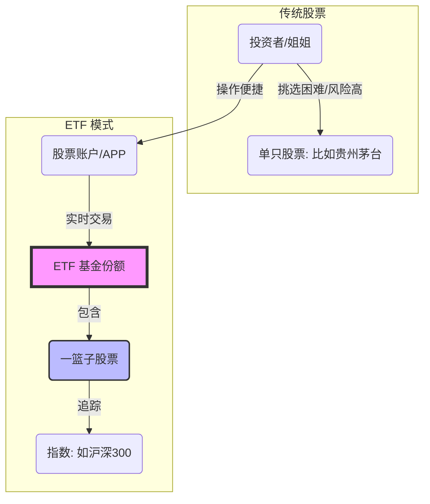

你好！很高兴为你和你的姐姐解答这个问题。

想象一下，你姐姐现在拿着钱站在超市门口，想要买水果（股票），但她面临着几个难题：不知道哪个苹果甜（选股难）、没时间一个个挑（研究难）、怕买到烂水果（风险大）。

这时候，**ETF** 就是超市里那种**“精选水果大礼包”**，而且这个礼包还能像单买苹果一样，随时在收银台退换交易。

下面我将用费曼学习法，通过生动的比喻、图表和案例，带你们彻底搞懂什么是 ETF，以及为什么说“买基金不如买大盘”。

---

### 第一部分：什么是 ETF？（超市大礼包）

**ETF** 的全称是 **Exchange Traded Fund**，中文叫**“交易型开放式指数基金”**。

这名字太绕了，我们拆开来看：

1.  **Fund（基金/大礼包）：**
    *   你不用自己去买茅台、腾讯、比亚迪这几百只股票。ETF 帮你打包好了，里面包含了一堆股票。
    *   **比喻：** 这是一个装满各种水果的**篮子**。

2.  **Exchange Traded（交易所交易/像股票一样买卖）：**
    *   普通的基金（场外基金），你今天买，明天才确认，想卖还得等几天钱才到账，很慢。
    *   ETF 不一样，它虽然是基金，但你可以像买卖股票一样，在股票软件里输入代码，按当下的价格**实时买卖**。
    *   **比喻：** 普通基金像是在网上下单买水果，等快递配送；ETF 像是你在超市现场，看中就拿走，想退立马退。

3.  **Index（指数/跟着大盘走）：**
    *   ETF 大多是**被动**跟踪指数的。比如“沪深300 ETF”，就是完全照抄“沪深300指数”的作业。指数里有什么股，它就买什么股，比例都一样。
    *   **比喻：** 这是一个**“全自动配货篮子”**。超市（市场）里卖得最好的前300种水果，它自动按比例装进篮子，不需要人为去猜哪个好吃。

#### 📊 图解：ETF 运作机制

---

### 第二部分：为什么说“买基金不如买大盘”？

你提到姐姐听说“买基金不如买大盘”，这句话里的**“基金”**通常指**“主动型基金”**（基金经理自己选股），而**“大盘”**指的就是**“指数 ETF”**。

为什么这么说？我们可以从三个角度来理解：

#### 1. 巴菲特的十年赌局（在这个市场上，很难有人打败大盘）
*   **主动基金的痛点：** 基金经理也是人，会犯错，会情绪化，或者风格会漂移。今年他是冠军，明年可能倒数第一。
*   **大盘的优势：** 指数（大盘）具有**“新陈代谢”**功能。业绩不好的公司会被踢出指数，好的公司会被加进来。大盘永远由市场上最强的公司组成。
*   **案例：** 股神巴菲特曾和一个顶尖的基金经理打赌：十年内，你们这些收费昂贵的对冲基金，跑不过标普500指数（美国的大盘）。结果十年后，巴菲特赢了，大盘完胜主动管理。

#### 2. 省下的就是赚到的（费率低）
*   **主动基金：** 基金经理要调研、要开会、要发工资，所以管理费通常是 **1.5%** 左右。
*   **ETF（大盘）：** 电脑自动照着指数买，不需要太多人工，管理费通常只有 **0.5%** 甚至 **0.15%**。
*   **比喻：** 主动基金是请五星级大厨给你做饭（贵，且不一定合口味）；ETF 是肯德基标准套餐（便宜，品质稳定，不会难吃）。

#### 3. 不怕“踩雷”（分散风险）
*   如果你姐姐买了一只股票，那家公司造假倒闭了，钱可能归零。
*   如果买了大盘 ETF，因为里面有几百只股票，这一家倒闭了，对整体影响微乎其微。

---

### 第三部分：常用场景举例（姐姐该怎么买？）

假设姐姐有 10 万元闲钱，想投资，但不想太操心：

**场景 A：姐姐想投资国运，相信中国经济会好（核心宽基）**
*   **推荐：** **沪深300 ETF**。
*   **逻辑：** 这里面是中国股市规模最大、流动性最好的300家龙头公司（茅台、腾讯、平安、美的等）。买了它，就是买了中国经济的基本盘。

**场景 B：姐姐觉得以后大家都要搞高科技（行业 ETF）**
*   **推荐：** **半导体 ETF** 或 **新能源车 ETF**。
*   **逻辑：** 不需要研究哪家芯片公司技术强，直接买下整个赛道。只要行业火，ETF 就会涨。

**场景 C：姐姐想把钱投到美国科技巨头（跨境 ETF）**
*   **推荐：** **纳斯达克100 ETF**。
*   **逻辑：** 不用开美股账户，用人民币就能直接买苹果、微软、谷歌、英伟达的集合体。

---

### 第四部分：拓展学习（由浅入深）

当你姐姐掌握了基础的 ETF 后，可以了解以下进阶知识：

1.  **ETF 联接基金（场外版）：**
    *   如果你姐姐不开股票账户（没有券商APP），只在支付宝或银行买，那买到的通常是“ETF 联接基金”。它本质是把钱收集起来去买场内的 ETF，方便场外用户。

2.  **Smart Beta ETF（策略型）：**
    *   普通的 ETF 是按市值买（谁公司大买谁）。Smart Beta 是按策略买，比如“红利 ETF”（谁分红多买谁），适合喜欢稳定收息的人。

3.  **ETF 的套利机制（高级玩家）：**
    *   当 ETF 在股市的价格 > 实际上那一篮子股票的价格（溢价）时，可以在一级市场买股票换成 ETF 在二级市场卖出赚钱。这保证了 ETF 价格不会偏离价值太远。

---

### 第五部分：费曼学习法——理解力测试

为了确认你和姐姐是否真的理解了，请尝试回答以下两道题目：

**题目 1：**
> 姐姐今天急需用钱，她手里有一只“易方达蓝筹精选（普通主动基金）”和一只“沪深300 ETF”。现在是周三下午 2:00。
> 请问：哪一个卖出后，能立刻确认价格，并且资金到账最快？为什么？

**题目 2：**
> 如果姐姐是一个典型的“韭菜”，喜欢追涨杀跌，听说最近“人工智能”很火，想去炒作，但又怕买到假概念公司亏光。
> 你会建议她买具体的某只 AI 股票，还是买“人工智能 ETF”？为什么？请用“水果篮子”的逻辑解释。

👉 点击查看参考答案

**答案 1：**
**沪深300 ETF。**
因为 ETF 像股票一样在交易所实时交易。周三下午 2:00 卖出，价格就是那一瞬间的市价，资金通常在收盘后可用（银证转账可能次日可取）。而普通主动基金卖出，要按周三收盘后的净值计算（此时还不知道是多少），且资金到账通常需要 T+3 甚至更久。

**答案 2：**
**建议买“人工智能 ETF”。**
解释：买具体的股票就像是在这一堆还没熟透的水果里瞎猜哪一个是甜的，万一挑到一个烂苹果（业绩造假或蹭热度的公司），就全赔了。
买 ETF 就像买了一个“人工智能精选果盘”，虽然里面可能混杂了一两个酸的，但大部分都是经过市场筛选的好果子，整体口感（收益）能跟上这个行业的平均水平，不会踩大雷。

