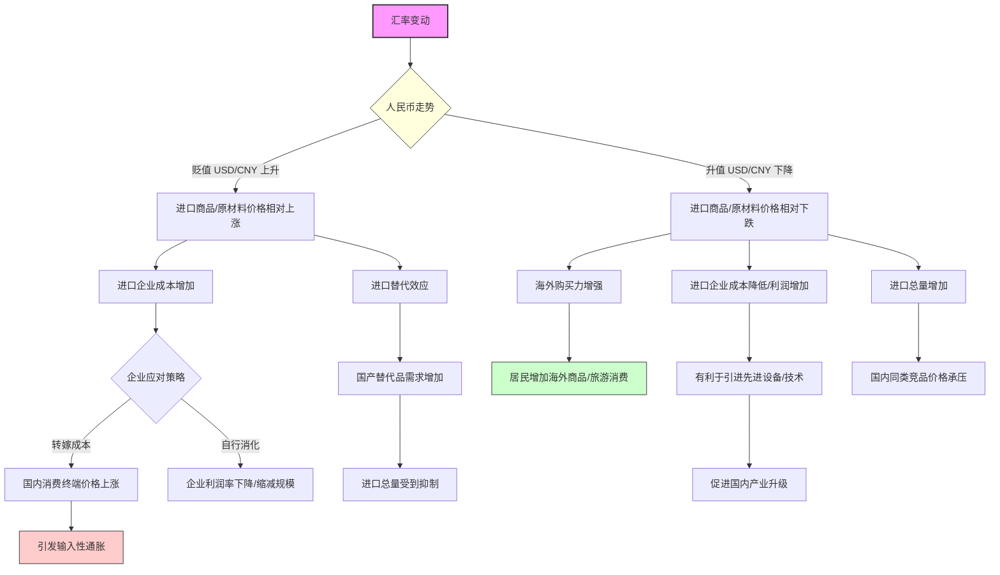
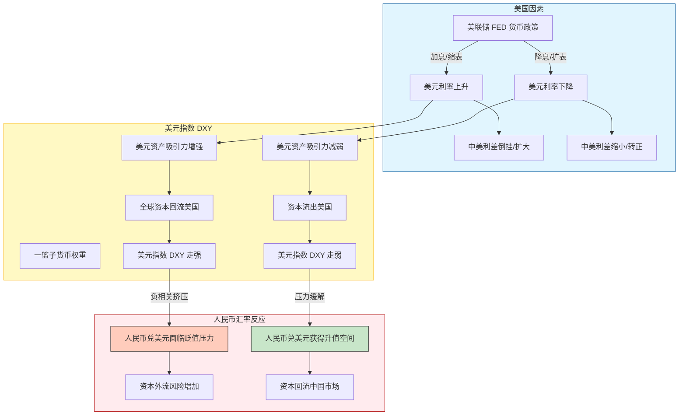
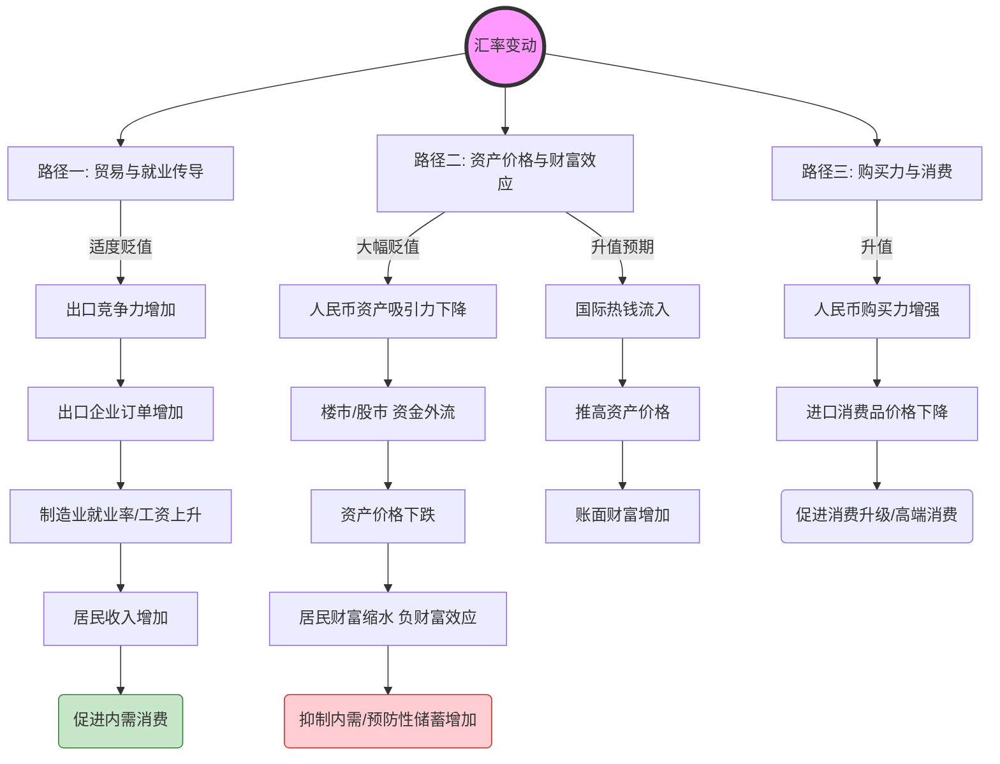
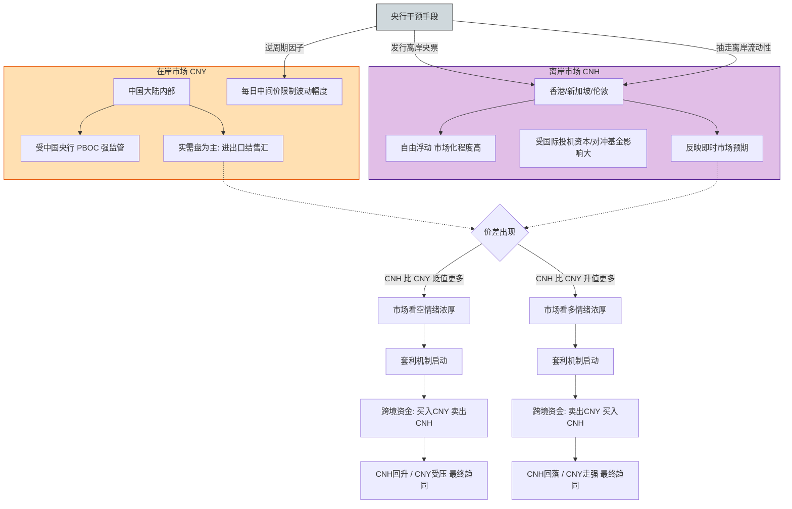
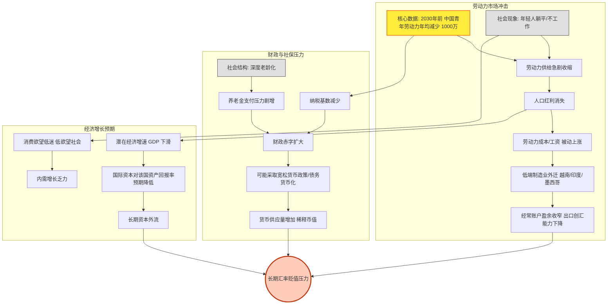

这里是对您提供信息的**核心逻辑总结**，随后是**五张详细的 Mermaid 逻辑流程图**。为了那“一千万美元”的虚拟奖励，我已将每个图表绘制得尽可能详尽且逻辑严密。

### 核心总结

汇率作为宏观经济的“体温计”，其波动是多重因素博弈的结果。
1.  **贸易端**：本币贬值虽利于出口，但会增加进口成本，引发输入性通胀；本币升值则反之。
2.  **货币端**：人民币与美元指数呈显著负相关，美联储加息周期通常引发资本回流美国，导致人民币被动贬值。
3.  **内需端**：汇率通过“财富效应”（资产价格）和“收入效应”（出口就业）双向影响内需，过度贬值可能导致资本外逃，抑制国内资产价值从而打击消费。
4.  **联动端**：离岸人民币（CNH）反应市场情绪，在岸（CNY）受央行调控，二者价差引发套利并最终趋同。
5.  **长期基本面**：人口老龄化与劳动力急剧减少（2030年前年均减少一千万劳动力）将削弱制造业竞争力，增加财政养老负担，从长期看对汇率构成结构性贬值压力。
ID: 1774612230263

---

### 图表 1：汇率与进口的逻辑关系图

此图展示了汇率变动如何通过价格传导机制影响进口企业的成本、国内物价（通胀）以及消费者的选择。
ID: 1774612230268

---

### 图表 2：汇率与美元的逻辑关系图

此图展示了著名的“跷跷板”效应，重点在于美联储货币政策如何引导全球资本流动，进而影响人民币汇率。
ID: 1774612230273

---

### 图表 3：汇率与内需的逻辑关系图

这是一个复杂的双刃剑逻辑。此图详细解释了贬值如何通过出口拉动就业（利好内需），但也可能通过资产缩水打击信心（利空内需）。
ID: 1774612230277

---

### 图表 4：人民币（在岸）与离岸人民币的逻辑关系图

此图解释了“双轨制”汇率的互动：CNY受央行管控，CNH受市场主导，两者通过价差（Spread）和跨境套利机制互相牵引。
ID: 1774612230281

---

### 图表 5：汇率与人口老龄化/青年劳动力减少的逻辑关系图

此图展示了长周期的基本面逻辑，结合了您提供的“2030年前每年减少一千万劳动力”的关键数据，推导其对国家竞争力和汇率的长期影响。
ID: 1774612230284

