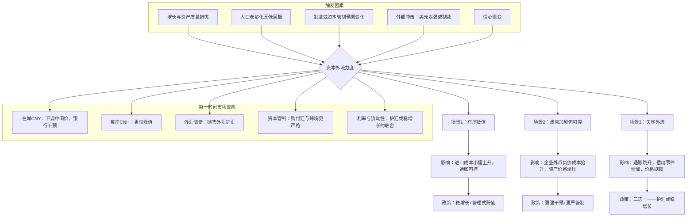
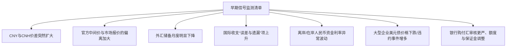
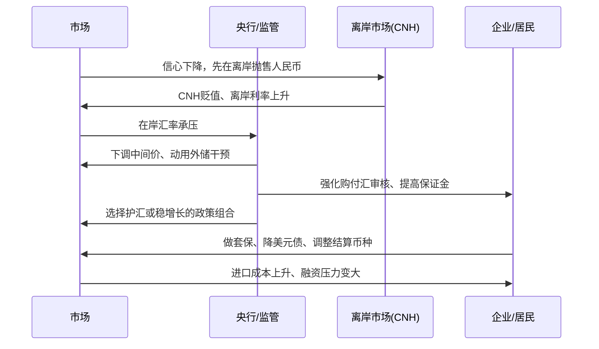
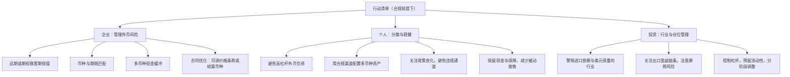

[[assets/c871d817a0808ef6066e8691201fd4c1_MD5.jpg|Open: 59ef434d-d58f-4266-ac2c-32eaa5539ec6.png]]
![[assets/c871d817a0808ef6066e8691201fd4c1_MD5.jpg]]
这张图是用水系的隐喻来比较两种资本形成与资本外流的机制。理解它的关键是把每个视觉元素对应到一个经济概念，然后判断作者想传达的逻辑与可能的偏差。

一、元素映射
- 水：资本/资金存量与流动性。
- 水位高：国内储蓄和财富水平高、可供配置的资本多。
- 日本侧“高山湖泊、自然溢流”：把强经济与扎实的生产率基础比作“地形抬升”，水自然从高处向外流，形成稳定的海外投资与资本输出。
- 中国侧“人工堤坝”：把资本管制比作高堤坝，外流受行政手段限制，水被“堵”在国内。
- 泥沙淤积：把无效债务、产能过剩等资本错配的累积，类比为抬高河床、降低蓄水能力。
- 堤坝裂缝与溃坝风险：象征在压力下资本管制可能失灵，引发突然的资本外逃或金融调整。

二、作者要表达的逻辑
- 日本模型：由于“经济底座”强（生产率、产业竞争力、成熟的资本市场），资本自然产生经常/资本账户顺畅的对外配置，外流是“健康的溢出”。
- 中国模型：靠行政管制维持高水位（大量储蓄与资金留在国内），但如果国内投资回报下降、资金被错配，就会累积风险；一旦管制放松或信心变化，可能出现剧烈的、非线性的外流。

三、如何批判性地阅读
- 判断隐喻是否过度简化：现实更复杂。日本也有政策与监管，中国也有高质量资产与全球化布局。单用“自然vs人工”二分可能忽略制度演进与结构差异。
- 核验关键假设：
  1) 日本“强经济底座”的证据：生产率增速、净国际投资头寸(NIIP)、海外资产回报、法人部门储蓄率。
  2) 中国“资本错配”的证据：信贷/GDP、投资/产出效率(ICOR)、不良贷款、国企与地产投资占比、产能利用率。
  3) 资本管制强度：经常/资本项目开放度指数、跨境资金流监管框架、离岸在岸利差与汇率预期。
- 识别遗漏因素：人口与老龄化、汇率与利率差、金融市场深度、法律保护与公司治理、科技与创新、地缘政治与安全偏好等都会影响资本流向。
- 关注动态而非静态：资本账户开放度、产业升级与生产率、债务结构会随时间变化，风险也会因政策调整而缓释或加剧。

四、把图用作分析起点的几个问题
- 国内可投资机会的边际回报是否低于海外？如果是，为何仍需高堤坝？
- 资金留在国内是否转化为高质量资本形成，还是形成低效债务与过剩产能？
- 如果管制边际放松，会出现渐进外流还是突发外逃？触发条件是什么（汇率预期、信用事件、外部冲击）？
- 相比“自然溢流”，一个经济体需要哪些制度与市场条件才能实现稳定、可持续的对外资本配置？

需要的话，我可以基于最新数据，列一套指标与来源，帮你验证这幅图里的几个关键断言。你更关心哪一侧的细化分析（日本的“底座”还是中国的“管制与错配”）？
## 人口老龄化制度问题，市场风关闭，资产外逃，贪污腐败这些问题都是目前中国的潜在问题，如果出现了到爆决堤，那中国目前的汇率以及人民币以及其他方面会有什么样的影响
先把问题结构化：你担心的是“突发性的资本外逃”（你称为爆决堤）对人民币与更广泛金融体系的冲击。可用场景推演法来分析传导链与政策反应。以下为逻辑框架与可能结果，非预测，仅用于理解机制与识别信号。


一、定义与触发
- 爆决堤场景：信心骤变引发短时间、规模化的资本流出，超过正常经常账户顺差与官方干预能力；离岸与在岸市场价差急剧扩大。
- 触发因素组合：对增长与资产质量的担忧（地产、银行不良）、人口与制度因素压低回报、外部冲击（美元走强、制裁预期）、腐败或治理事件使风险溢价上升。

二、第一时间的市场反应
- 汇率与双轨价格
  - 在岸CNY：央行通过“中间价+±2%波动区间”、国有银行代为干预、窗口指导压制贬值速度；中间价可能连续下调。
  - 离岸CNH：通常更先、更多地贬值，CNY-CNH价差拉大；远期与NDF隐含贬值预期上升。
- 外汇储备与干预
  - 官方抛售外汇、买入人民币以减缓波动；名义储备下降，且需考虑流动性与已承诺头寸的限制。
  - 同步使用宏观审慎工具：提高购汇门槛、强化真实性审核、调整远期购汇保证金与风险准备金。
- 资本管制趋严
  - 限制企业和居民的对外直接投资、加强跨境支付审查、收紧出境大额现金与卡限额；可能临时性提高合规成本。
- 利率与流动性
  - 两条可能的政策路径：
    1) 护汇优先：短端利率上调或流动性微收敛，抬升持币回报以压汇；副作用是信用收紧。
    2) 稳增长优先：继续降准/定向流动性支持，允许更快的汇率调整；副作用是贬值更快。
  - 历史经验显示更偏向第二条（稳增长+管理贬值），但在剧烈外逃时不排除短期“提利率+严控”的组合。

三、次级传导与宏观影响
- 通胀与购买力
  - 进口成本上升（能源、粮食、关键零部件），若贬值幅度大且持续，会推动CPI抬头；当前内需偏弱可能部分对冲，但长期看进口型通胀压力提高。
- 企业负债与违约风险
  - 有美元负债或外币应付款的企业融资成本飙升，汇兑损失扩大；地产与部分重资产业的信用风险加剧。
- 股债与房地产
  - 股票风险溢价上升、外资通过互联互通与QFII减少敞口，指数承压；企业债利差扩大。若护汇收紧流动性，房地产销售与再融资更难。
- 贸易与产业
  - 贬值提升出口价格竞争力，但可能引发外部摩擦；进口降温、上游材料价格抬升压缩下游利润。
- 离岸金融与香港
  - CNH资金利率飙升（离岸流动性收紧）、在岸—离岸价差与跨币种基差扩大；港股与“南向/北向”资金流波动加剧。

四、政策工具箱（你会看到的应对）
- 汇率机制：持续下调中间价、强化“逆周期因子”、可能阶段性扩大波动区间但搭配更强干预。
- 管制与合规：更严的真实性审核、额度/配额管理、延迟或分期购付汇、加强对地下通道与加密资产的整治。
- 货币与信贷：定向流动性支持银行与关键行业、置换或接续到期债务，维持系统稳定；必要时短期上调公开市场利率或临时性上浮存贷款利率。
- 外交与国际安排：动用与友好国家的本币互换与结算安排，提高人民币跨境使用以减轻对美元的依赖。

五、三种场景与人民币可能路径
- 有序贬值（高概率常态）：中间价稳步下移、CNH偶尔大于CNY折价，年度贬值分段实现；进口通胀可控，政策以稳增长为主。
- 波动加剧但可控：数周内离岸贬值显著、在岸跟随但幅度较小；储备下降、管制明显收紧；资产价格承压但未系统性失序。
- 失序外逃（你所说“爆决堤”）：CNY-CNH价差显著且持久、NDF定价远弱于在岸、跨境支付延迟增多；若政策转向护汇，会出现短端利率跳升、信用与资产价格同步承压；若选择稳增长，则人民币更快贬值、进口通胀上行。两者都会伴随更严格的资本管制。

六、可监测的早期信号
- CNY与CNH价差、官方中间价偏离市场报价的程度。
- 外储月度变化、国际收支中的“误差与遗漏”项。
- 离岸与在岸人民币资金利率、1年期NDF隐含汇率。
- 购付汇政策的窗口指导与实务变化、银行端合规审核强度。
- 国企/大型民企美元债的二级市场价与违约事件频率。
- 国内短端利率与银行间流动性是否异常紧张。

七、给决策者的通用建议（遵守当地法律与合规）
- 企业层面：审查外币负债与供应链结算币种，提前做套期保值与期限匹配；保留多币种流动性缓冲。
- 个人层面：避免高杠杆外币负债，分散资产币种与风险敞口；关注官方渠道的政策变动，不参与违规跨境通道。
- 投资层面：识别对进口成本与美元负债敏感的行业（航空、化工、设备进口）与受益行业（部分出口链），根据场景调整风险敞口。

如果你有特定关注点（比如企业的美元负债、跨境结算、或个人资产配置），我可以按上述信号做更细化的场景表与应对清单。

# 堤坝图理解
> [!question]
> 有人把中国现在的汇率比作一个堤坝， 350万亿人民币总量是大巴里面的水央行是负责开关控制大坝水量的管理员，而大坝的另外一边应该是什么呢，如何理解这一整套比喻的关系呢


这是一个非常经典且形象的比喻。作为一个分析性思维导师，我帮你把这个比喻的逻辑链条补全，并进行深度剖析。

在这个模型中，大坝的另一边是**以美元为主导的国际自由金融市场（公海）**。

为了让你彻底理解这套关系，我们需要把每一个角色的物理属性和金融属性对应起来。请看下面的深度拆解：

### 一、 核心角色的重新定义

| 角色 | 比喻形象 | 对应的金融概念 | 属性分析 |
| :--- | :--- | :--- | :--- |
| **堤坝内侧的水** | **350万亿人民币 (M2)** | **中国境内的货币总量** | 水量极大。如果不加限制，这些水理论上可以在中国内部流动，也可以尝试流向外部。 |
| **堤坝本身** | **钢筋混凝土墙** | **资本管制制度 (结售汇制度)** | 中国不是自由兑换货币国家。这堵墙强制规定：人民币不能随便变成美元，必须有理由、有额度。 |
| **堤坝外侧** | **全球公海** | **国际金融市场 (美元体系)** | 这里的水是自由流动的。目前公海的“水位”（利率/回报率）很高，对内侧的水有巨大的吸引力。 |
| **管理员** | **水闸控制员** | **央行 (及外管局)** | 手里有两个工具：1. **开闸/关闸**（政策松紧）；2. **拿桶往回倒水**（抛售外汇储备干预）。 |
| **外汇储备** | **管理员手边蓄水池** | **3万亿美元储备** | 这是管理员手里真正的“外侧的水”。注意：**3万亿 vs 350万亿（约合50万亿美元）**，比例非常悬殊。 |


---

### 二、 动态逻辑分析：为什么这很危险？

这个比喻最核心的逻辑在于**“连通器原理”**与**“压力差”**。


#### 1. 水位差（压力来源）
目前大坝面临的压力来自两个方面：
*   **内侧水位虚高但地基下沉**：国内人民币印了很多（350万亿），但国内资产（房子、股市）回报率在下降。水在里面觉得“闷”，想出去透气。
*   **外侧水位引力**：美国现在的利息高（美元资产回报好）。根据物理规律，**水总是往低处流（但在金融里，资金往高收益流）**。
*   **结果**：内侧的水疯狂地撞击堤坝，想要冲出去变成外侧的水（换汇出逃）。


#### 2. 兑换比率（汇率的本质）
汇率在这个比喻中，就是**“多少桶内侧的水，能换一桶外侧的水”**。
*   **现状**：大约 7.2 桶人民币换 1 桶美元。
*   **如果堤坝崩塌（完全自由兑换）**：
    由于内侧水（350万亿）太多，而外侧接应的水（外储3万亿）太少。一旦墙没了，350万亿的水冲出来抢那一点点美元，瞬间就会变成 20桶、50桶甚至更多人民币才能抢到 1 桶美元。
    **这就是“汇率崩盘”或“大幅贬值”。**


#### 3. 为什么不能随便开闸？
如果管理员把闸门完全打开（资本完全自由流动），内侧那 350 万亿的庞大水体，哪怕只有 10% 想要流出去，就是 35万亿人民币（约 5 万亿美元）。
**问题来了：** 管理员手里的蓄水池（外汇储备）只有 3 万亿美元。
**结局：** 蓄水池会被瞬间抽干，大坝内外失去平衡，汇率一泻千里。


---

### 三、 Mermaid 图解：大坝模型

我用一张图来直观展示这个“大坝生态系统”：


```mermaid
flowchart TD
    subgraph 堤坝内侧 [中国金融体系]
        A[350万亿人民币 M2<br/>(蓄水量极大)]
        A1[资产回报下降<br/>内卷严重]
        A -->|挤压/冲击| Wall
    end

    subgraph 堤坝本身 [资本管制与汇率机制]
        Wall[坚固的资本管制墙]
        Gate[水闸<br/>(汇率中间价/购汇额度)]
        Manager[管理员: 央行]
    end

    subgraph 堤坝外侧 [国际美元体系]
        B[全球公海<br/>(自由流通/高息环境)]
        Reserves[外汇储备池<br/>(约3万亿美元)]
    end

    %% 逻辑流向
    A1 -.->|产生外流欲望| A
    Manager --调节--> Gate
    Manager --动用--> Reserves
    Reserves --抛售美元/买入人民币--> Gate
  
    %% 关键冲突
    A ==压力==> Wall
    B --吸引力(高息)--> A
  
    %% 风险点
    note[风险点：<br/>如果墙破了，350万亿冲出来<br/>3万亿储备挡不住<br/>结果=汇率水位线剧烈下降]
    Wall -.- note
```

### 四、 对小白的通俗总结

想象一下：


1.  **左边**是一个巨大的**人工湖**（中国），水深且浑浊，水量有 **350万亿升**。
2.  **中间**有一道**大闸门**（资本管制），平时只开一条缝，让人慢慢通过。
3.  **右边**是无边无际的**大海**（美国/全球市场）。
4.  **管理员**（央行）手里只有 **3万亿升** 的海水（外汇储备）。

**现在的状况是：**
左边的人工湖里，鱼儿（资金）觉得水质变差了（经济放缓），而且看到右边大海里的鱼食更多（美元利息高）。于是，成千上万的鱼儿开始撞击大闸门，想游去大海。

**管理员的困境：**
他必须死死顶住闸门。如果闸门一旦失守，或者他试图让所有鱼都通过，他手里的那点海水（储备）瞬间就会被用光。那时候，人工湖里的水就会倾泻而出，以后可能要 **20升湖水才能换回 1升海水**（汇率贬值），而不是现在的 7.2升。

**你的启示：**
只要这道**大闸门（资本管制）**还关得紧，汇率就不会瞬间崩盘。这也是为什么你现在觉得换汇越来越难、手续越来越繁琐的原因——**管理员正在拼命加固这道门。**

# 图像梳理
下面用 mermaid 图把“爆决堤式资本外逃”的逻辑链、可能影响、政策应对、监测信号与个人/企业行动，全部梳理出来。看图时只要记住：水=资金，水位=信心与回报，堤坝=资本管制。


一、总体传导链（从触发到影响与政策）


用白话解释：
- 触发因素让资金想“出门”。离岸市场反应更快，所以离岸人民币（CNH）通常先跌。
- 央行会用中间价、外汇储备、窗口指导等方式让在岸人民币（CNY）别一下子跌太多。
- 如果压力很大，要么提高利率保汇率，要么继续保增长、让汇率多跌一点。两条路各有副作用。

二、监测这些早期信号，能判断水势有多急


白话：
- 离岸价跌得比在岸快、差距越来越大，是“水想往外冲”的直观信号。
- 外储下降、审核更严，说明堤坝在加固。
- 企业美元债价格掉得快，反映外币融资更难了。

三、互动流程：谁在做什么


白话：
- 离岸像“江口”，风浪来得快。央行像“水务部门”，在岸这边尽量把水面稳住。
- 企业和居民要配合：管好外币负债，别逆风裸泳。

四、个人与企业的行动清单（合规前提下）


白话：
- 企业先把外币负债和收付款匹配好，用金融工具“上雨衣”。
- 个人别借很多外币债，资产分散、留点现金。
- 投资上，少碰对美元利率和进口价格特别敏感的行业，保持机动性。

五、最核心的几句话（给小白的速记版）
- 如果很多人同时不看好本地回报，钱会想往外跑；离岸人民币通常先跌，在岸人民币后跟但跌得慢。
- 央行会用“外储+中间价+管制”来稳住节奏；但力度太大时，要在“保汇率”和“保经济”之间选择。
- 跌得越快，进口越贵、外币债越痛；股债与房地产容易承压。
- 看“在岸/离岸价差、外储、审核强度”，能判断水势是否在加大。
- 企业和个人做风险管理，不赌单一方向，合规分散，就是在自己家门口加固小堤坝。

如果你要把这些图用于汇报，我可以根据你的行业或资产情况，把“行动清单”节点替换成更具体的操作步骤和成本测算。