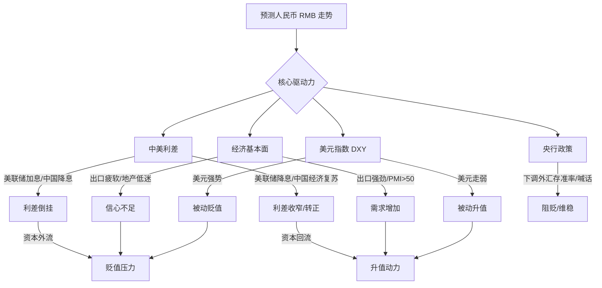

你好！很高兴能为你解答这个问题。预测汇率走势就像是预测天气的变化，虽然充满了不确定性，但只要掌握了“气象云图”和“风向标”，我们就能大大提高预测的准确度。

我们采用**费曼学习法**的思路，把复杂的金融模型拆解成生活中的常识。想象一下，**人民币（RMB）就像是全球大超市里的一件热门商品，它的价格（汇率）完全取决于有多少人想买它（需求），以及有多少人想卖它（供给）。**

下面我将从四个核心维度，配合生动的比喻和图表，教你如何建立自己的分析框架。

---

### 第一维度：两国利差（钱往哪里流？）
**核心逻辑：** 资金像水，总是往利息高的地方流。

*   **通俗解释：** 假设你在两家银行存钱，A银行（中国）给你2%的利息，B银行（美国）给你5%的利息。作为理性的投资者，你会倾向于把钱换成美元存入B银行。这时候，大家都在卖人民币买美元，人民币就会**贬值**。反之亦然。
*   **关键数据：** **中美10年期国债收益率利差**。
    *   *公式：* 中国国债收益率 - 美国国债收益率。
    *   *判断：* 如果差值为负且扩大（倒挂），人民币贬值压力大；如果差值变正或收窄，人民币升值动力强。

### 第二维度：经济基本面（身体好不好？）
**核心逻辑：** 汇率是国家经济实力的股票。

*   **通俗解释：** 如果一家公司（中国）生意火爆，产品大卖，大家都会抢着买它的股票，股价（汇率）就会涨。
*   **关键数据：**
    1.  **PMI（采购经理指数）：** 这是一个“先行指标”，如果PMI > 50，说明工厂在加班加点，经济扩张，利好升值。
    2.  **贸易顺差（进出口数据）：** 中国卖给世界的东西（出口）多，外国人就得买人民币来支付，需求增加，利好升值。
    3.  **GDP增速：** 长期看，经济增长快，货币就坚挺。

### 第三维度：美元指数（对手强不强？）
**核心逻辑：** 跷跷板效应。

*   **通俗解释：** 汇率是相对的。有时候人民币本身没变坏，但对手（美元）突然变得太强了（比如吃了大力丸），坐在跷跷板另一头的人民币就会被翘起来（被动贬值）。
*   **关键数据：** **美元指数 (DXY)**。
    *   通常美元指数涨，非美货币（包括人民币）跌。

### 第四维度：央行态度（裁判怎么吹？）
**核心逻辑：** “逆周期因子”与政策干预。

*   **通俗解释：** 当汇率波动太大，甚至出现恶意做空时，央行（就像裁判或家长）会出来喊话或出手干预，不让汇率单边疯跑。
*   **关注信息：**
    *   **人民币中间价**：央行每天早上公布的指导价，可以看出央行的意图。
    *   **外汇存款准备金率**：央行下调这个率，就是往市场里放美元，让美元变多变便宜，从而支撑人民币汇率。

---

### 📊 逻辑可视化 (Mermaid)

为了让你更直观地理解这些因素是如何共同作用的，请看下面的流程图：

---

### 💡 举例说明（实战场景）

**场景：2023年的“强美元”时期**

1.  **背景信息：** 美国通胀很高，美联储疯狂加息（利息到了5.5%），而中国为了刺激经济，保持低利率（2.5%左右）。
2.  **数据表现：** 中美利差严重倒挂（-300个基点）。
3.  **市场反应：** 国际资本为了赚那3%的差价，纷纷卖出人民币换美元。
4.  **结果：** 人民币兑美元汇率从 6.7 一路贬值到 7.3。
5.  **你的判断：** 当你看到美联储还在说“我要加息”时，你就应该预测人民币短期内**看跌（贬值）**。

**场景：假设未来某天**

1.  **信息：** 新闻报道“中国出口数据大超预期”，同时“美联储暗示明年开始大幅降息”。
2.  **你的判断：** 美国的利息要降了（钱不往美国跑了），中国的生意好了（大家需要人民币买货）。
3.  **结论：** **看涨（升值）**。

---

### 📚 信息来源推荐

要获取准确的参考价值，不要只看抖音或微博的营销号，要看源头数据：

1.  **权威数据源（最为准确）：**
    *   **中国人民银行 (PBOC) 官网**：看货币政策报告，中间价公告。
    *   **国家外汇管理局 (SAFE)**：看跨境资金流动数据。
    *   **美联储 (FED) 议息会议**：决定美元利息走向的关键。

2.  **实用工具/网站（方便查看）：**
    *   **金十数据 / 华尔街见闻**：提供实时的财经日历（比如今晚8:30公布美国CPI），非常及时。
    *   **TradingView / 文华财经**：查看K线图，特别是 USDCNH（离岸人民币）和 US10Y（美国10年期国债收益率）。

---

### 🚀 知识拓展（由浅入深）

当你掌握了基础后，可以进一步研究以下概念：

1.  **CNY vs CNH 的区别：**
    *   *CNY (在岸人民币)：* 在国内交易，受央行管制较多，反映政策意图。
    *   *CNH (离岸人民币)：* 在香港等地交易，更自由，更能反映国际市场的真实情绪。**预测趋势时，通常先看CNH的动向。**
2.  **CFETS人民币汇率指数：**
    *   不要只盯着兑美元。如果人民币兑美元跌了，但兑欧元、日元都涨了，说明人民币其实很强，只是美元太强了。CFETS指数就是衡量人民币对一篮子货币的综合强弱。
3.  **不可能三角 (Impossible Trinity)：**
    *   一个国家不可能同时实现：**资本自由流动**、**汇率稳定**、**独立的货币政策**。中国选择了后两者，所以对资本流动有一定管制。

---

### 📝 课后测验（费曼技巧验证）

为了确认你是否真的掌握了，请尝试回答以下两个问题：

**题目 1：**
如果明天美国公布的非农就业数据非常强劲（意味着美国经济过热，美联储可能不仅不降息，还要维持高利率更久），请问短期内，人民币兑美元的汇率大概率会呈现什么趋势？为什么？

**题目 2：**
假如中国央行宣布“下调外汇存款准备金率 2 个百分点”。这是一个向市场释放美元流动性的动作。请问央行的目的是希望人民币升值还是贬值？

---
*(你可以先思考一下，如果你准备好了，我可以为你揭晓答案并进行解析)*