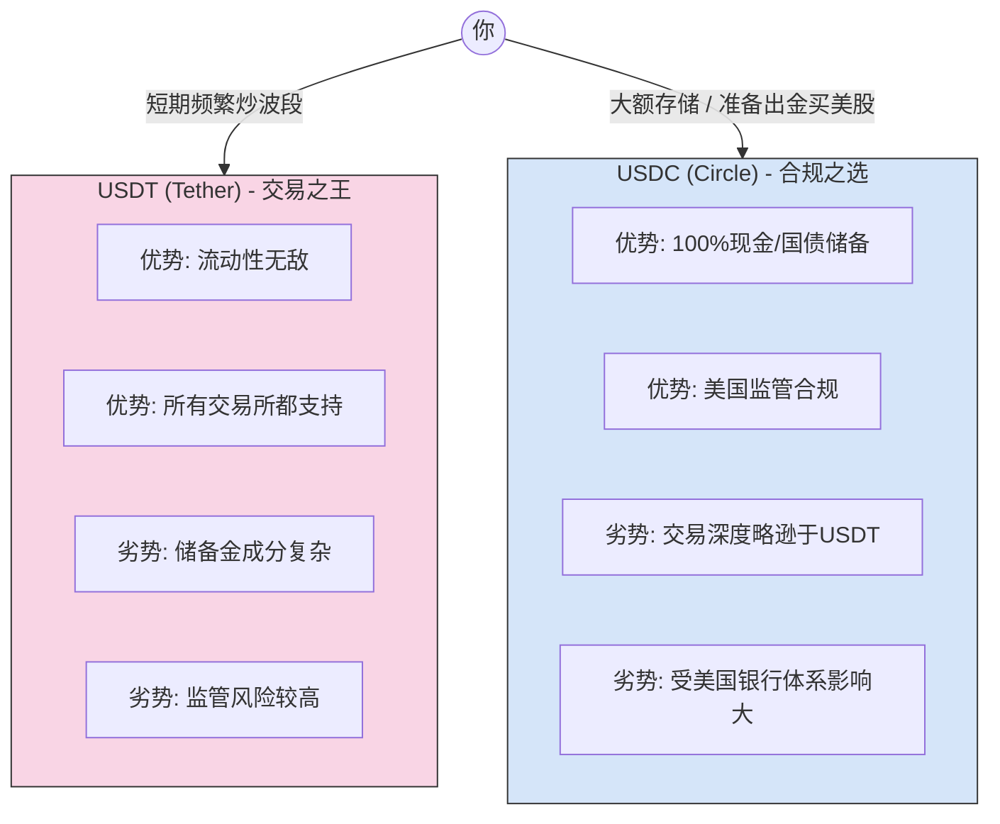

---
aliases:
  - 稳定币
  - USDT
  - USDC
---

2025.7月香港作为试点

## 是什么?
- 虚拟数字货币, 比如比特币的价格很主观, 作为区块链, 在全世界流通, 去中心化, 去掉银行政府, 个人和企业也能发行,  不过目前所有稳定币都是对美元的, 一个稳定币 === 一美元现金
- 时间: 转账也更快, 几秒钟
- USDT,USDC两个美元稳定币占据90%以上份额, 分别发布于下面两家公司![[Pasted image 20250729012738.png]]

![[Pasted image 20250729012653.png]]
- 对普通人的意义
	- 对跨境电商和跨境支付意义?
		- 所有大巨头都要求发行自己的稳定币, 方便快速, 省钱赚钱, 以前在在银行把利息都给银行吃了, 由于稳定币存在监管机构，里面的利息每天都在产生，凭空多出来的利息就是多出来的利润，而被兑换出来的稳定币在市场上正常流通，两者之间互不影响，多出了一份利息![[Pasted image 20250729015022.png]]
			- 比如京东发布了自己的京东币，价值十亿美金，收益是4.3，那么他一年就可以赚到4300万美金
		- 企业之间也可以发行自己的稳定币, 可以有汇率,比如一个阿里币 = 2个京东币, 但是会被中国制度限制发挥。
	- 对普通人有什么收益?
		- 以前使用信用卡支付，商品可能会有5%的服务费到了银行,信用卡,服务费，比如一百块的支付五块给服务费，实际的商品价格只有95块，但是有了稳定币之后，商家可以只收95元，普通人可以少支付五块钱
		- 洗钱， 地下钱庄，外汇新方式，个人跨进转账, telegram, 微信群等, 你可以交人民币汇入到对方的人民币账户，对方将等额的稳定币导入到你的账户
		- 总而言之, 个人对于稳定币之前没有什么危机和风险, 什么都不能做
	-  对银行来说
		- 普通人通过稳定币转账，省去了其中的各种手续费和服务费，如果借贷速度更快利息更低

- 国家的意义
	- 中国
		- ![[Pasted image 20250729012846.png]]
		- 为什么放开了虚拟货币的限制?
			- 北京让香港作为虚拟货币试点, 是否会有危害国家的风险![[Pasted image 20250729013505.png]]
		- 中国不敢放开外汇管制, 因为极可能导致大量挤兑, 导致资金外流
			- 开发稳定币可以让人名币走向世界作为载体, 又不用放开外汇管制, 导致资金外流
			- 但是中国不会给大家大的权力, 一切都会被管制, 维护国家和银行的利益, 永远不可能流通, 不会像美元一样全球化, 没有这个胆量和政治国情, 而且中国很难像美国一样做到公平监管，因为在目前的制度之中，有大量的贪官，以及很多虚假消息，根据以往几十年的种种事实，大家都不会信任这个政府作为监管机构，而且稳定币的每一笔交易都在网上无法删除，也会导致很多官员的一些不明财产有信息泄露的风险.
			- 同时由于政策上的层层备案和监管，也会导致这个稳定币运行和效率上得到极大的限制，无法真正发挥稳定币定义上的优势.
			- 之所以说中国不敢开放稳定币，就是因为一旦开放了跨境稳定币之后比如京东香港的稳定币，那么大量的富人就会购买这个稳定币导致资本外逃，如果不开放稳定币，那么所有的试点和努力都白费。
		- 未雨绸缪, 防止SWIF系统被美国切断, 导致人名币大幅度贬值.
		- 替代现金, 但是无法跨境支付
		- 优化国内支付体系
		- 增强货币监管能力
		- 打击洗钱和逃税漏税
	- 美国为什么发行
		- 捍卫美元地位, 全球都在想办法提高自己国家货币在世界上的地位，威胁到了美元霸权，如果在交易之中出现货币制裁，可以直接通过稳定币来汇款，不受各个国家之间的各种复杂情况影响
		- 让美元在全世界生态流行, 秦始皇统一车轨
		- 美国政府推广监管私人企业, 作为第三发监管
		- 2025年美元稳定币地位![[Pasted image 20250729014507.png]]
		- 
	- 对全球来说
		- 稳定币的交易量超过了两家巨头之总和达到二十七万亿，稳定币再也不能让人坐视不管
		- 如果全球国家都发行自己国家的, 等于没发稳定币, 因为人名币由于制度问题不流通, 人们只相信美元
	

# USDT 和 USDC 区别
你好！这位好学的同学，这个问题问到了点子上。

虽然 USDT 和 USDC 在你的账户里显示的价值都是 **1美元**，但它们的**“体质”**和**“性格”**完全不同。

如果不搞清楚它们的区别，就像是分不清**“江湖大哥”**和**“合规精英”**，在关键时刻可能会吃亏。

我是你的金融向导，下面用最通俗的方式为你拆解这两大稳定币巨头。

---

### 第一部分：核心区别对比图

我们可以把它们想象成两家发行“代金券”的公司。

| 特性       | **USDT (Tether)**       | **USDC (USD Coin)**             |
| :------- | :---------------------- | :------------------------------ |
| **形象比喻** | **江湖老大哥**               | **华尔街精英**                       |
| **发行方**  | Tether (注册在BVI，运营在香港)   | Circle (美国公司，背后有Coinbase/贝莱德支持) |
| **监管程度** | 相对宽松，长期处在灰色地带           | **极高**，受美国金融犯罪执法局(FinCEN)监管     |
| **资产储备** | 现金 + 企业债券 + 担保贷款 (大杂烩)  | **100% 现金 + 美国短期国债** (最硬的通货)    |
| **透明度**  | 历史上曾被诟病，现在每季出报告         | 每月出具由顶级会计所审计的报告                 |
| **主要用途** | 交易所**炒币** (交易对最多，流动性最强) | 机构转账、DeFi理财、**出金换法币**           |
| **最大风险** | 监管打击、储备金不够透明            | 合作的托管银行倒闭 (曾因硅谷银行倒闭短暂脱锚)        |

#### 📊 结构化对比 (Mermaid)

---

### 第二部分：费曼学习法——生动比喻

为了让你彻底理解，我们来打个比方：

#### 1. USDT 就像是“私人钱庄发行的银票”
*   **场景：** 这家钱庄开了很久，生意遍布全球黑白两道。大家都在用它的银票，因为**好用、方便、哪里都认**。
*   **隐患：** 但是，你问钱庄老板：“你的银票每一张都能换回真金白银吗？”老板说：“放心吧兄弟！”但他可能把一部分钱借给了隔壁老王做生意。如果隔壁老王亏了，或者警察来查封钱庄，你的银票可能就会有风险。
*   **结论：** 它是**“通用的”**，适合在赌场（交易所）里快速换筹码。

#### 2. USDC 就像是“正规银行开具的支票”
*   **场景：** 这家机构穿着西装革履，坐在写字楼里。它每发一张支票，都会在金库里确确实实锁进1美元现金，或者买成最安全的美国国债。每个月还有专门的会计师来数钱查账，并在网上公示。
*   **优势：** 美国政府看着它，它不敢乱动金库里的钱。
*   **结论：** 它是**“安全的”**，适合把钱存下来，或者准备变回法币带回家。

---

### 第三部分：实用场景举例

根据你的需求（买美股），这两种币的使用场景大不相同：

#### 场景 A：你在币安/欧易上频繁炒比特币合约
*   **选择：** **USDT**
*   **原因：** 几乎所有的加密货币都有 `XXX/USDT` 的交易对。如果你用 USDC，可能发现很多小币种买不了，或者买卖的差价（滑点）很大。

#### 场景 B：你赚了钱，想把这笔钱换成美元去盈透证券买纳斯达克
*   **选择：** **USDC**
*   **原因：**
    1.  **安全性：** 大额资金停留，USDC的储备更透明，暴雷风险理论上比USDT小。
    2.  **出金友好：** 正规的法币交易所（如 Coinbase, Kraken）对 USDC 更友好。很多银行和机构看到是 Circle (USDC发行方) 相关的资金，合规审查相对容易过；而看到 Tether (USDT)，可能会因为反洗钱风控而多问几句。

---

### 第四部分：拓展知识（由浅入深）

1.  **脱锚风险 (De-peg)：**
    *   **知识点：** 稳定币不一定永远等于1美元。
    *   **USDT历史：** 曾经跌到过0.9几，因为大家担心它并没有100%的储备金。
    *   **USDC历史：** 2023年硅谷银行（SVB）倒闭时，因为Circle有一部分钱存在那家银行里，USDC一度跌到0.88。但因为有美国政府兜底银行存款，很快涨回了1。
    *   **教训：** 没有绝对的安全，**最安全的是换成法币（USD）**。

2.  **黑名单机制：**
    *   **注意：** 因为 USDC 是受监管的，Circle 公司有权**冻结**链上的 USDC 地址。如果你的地址涉及黑客攻击或洗钱，你的 USDC 可能直接变砖。USDT 也有此功能，但 USDC 执行得更严格。

---

### 第五部分：课后测验（加强理解）

为了确保你选对“子弹”，请回答以下两道题：

**题目 1：**
小红准备将 50,000 美元的加密资产提现到美国的银行卡，为了尽量通过银行的合规审查，并且资金在链上存储期间更安心，她应该优先将其转换为哪种稳定币？
A. USDT
B. USDC

**题目 2：**
小明发现了一个新出的山寨币（Meme coin），波动很大，他想利用交易所里最好的深度快速买入卖出赚差价，他应该持有哪种稳定币作为“筹码”？
A. USDT
B. USDC

---

👉 点击查看答案解析

**答案 1：**
**B. USDC**
解析：USDC 由美国合规公司发行，储备金主要是现金和国债，透明度高，且是Coinbase等合规出金通道的首选，更符合“出金、安全”的需求。

**答案 2：**
**A. USDT**
解析：USDT 是目前加密市场交易量最大、流通最广的稳定币。大多数山寨币的首选交易对都是 USDT，深度好，买卖更容易成交，适合频繁交易。

