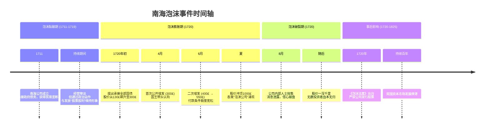
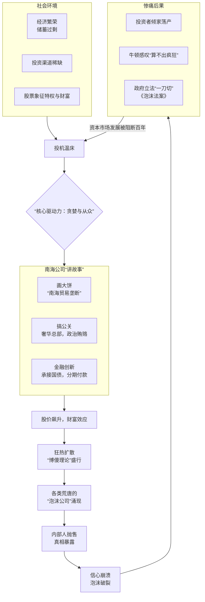
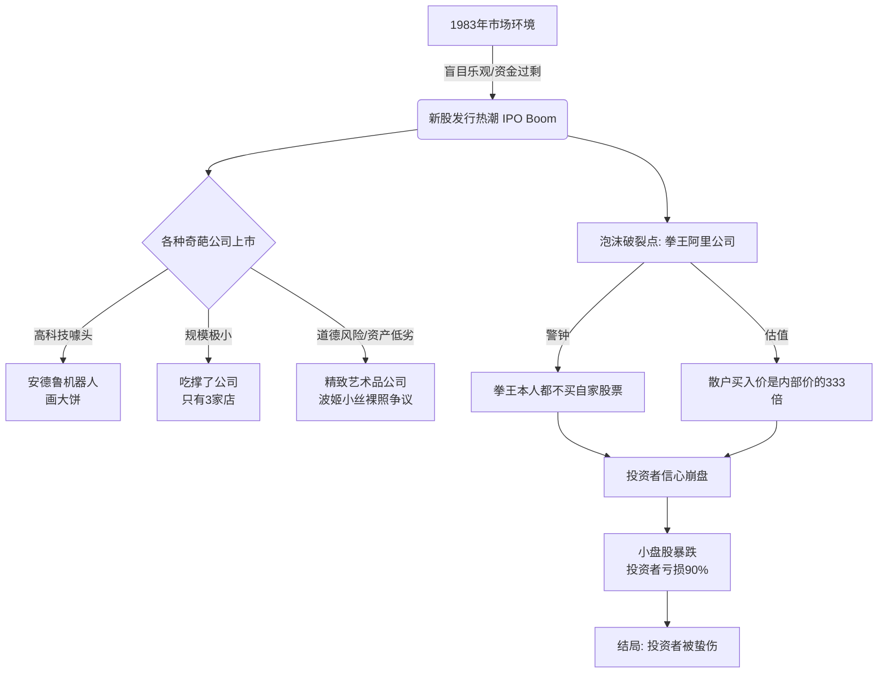
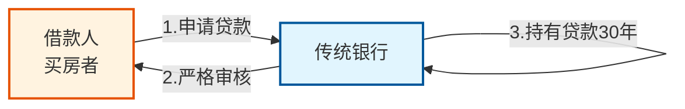
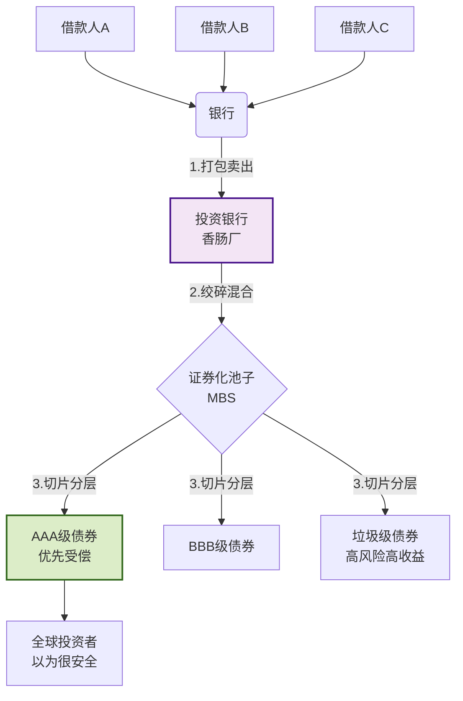
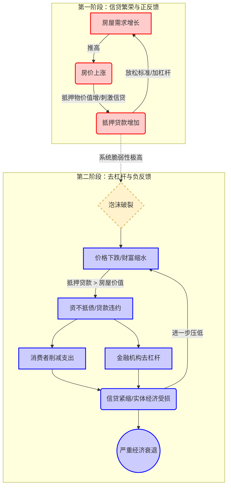
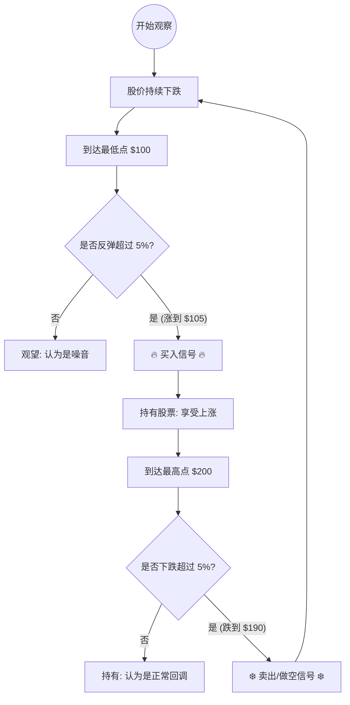

## *五十周年版前言*[[漫步华尔街（原书第13版）.pdf#page=7&selection=0,0,6,1|华尔街 133333, p.7]]


*倘若投资者买入并持有以大型指数为基础的指数基金，而不是勉为其难地买卖个股或主动管理型基金，那么他们的财务境遇便会好得多。*[[漫步华尔街（原书第13版）.pdf#page=7&selection=12,15,14,14|华尔街 13, p.7]]
*书中强调定期储蓄并投资指数基金非常重要，将之视为积累财富的唯一可靠途径。*[[漫步华尔街（原书第13版）.pdf#page=10&selection=27,28,28,23|漫步华尔街（原书第13版）, p.10]]

*本书不仅教给你股票市场的运行机制，**还教给你在做出最佳投资决策时如何克服无力之感**。*[[漫步华尔街（原书第13版）.pdf#page=10&selection=33,16,34,15|漫步华尔街（原书第13版）, p.10]]

*本书一直为全球诸多大学和商学院所用，有助于普及一些永不过时的投资组合建议，比如成本最低化、定期储蓄、多样化投资、重新调整组合内资产类别权重、税收管理*[[漫步华尔街（原书第13版）.pdf#page=11&selection=9,13,11,4|漫步华尔街（原书第13版）, p.11]]
*本书是一部简明扼要的个人投资指南，涵盖了自保险至个人所得税的所有内容。书中会告诉你如何购买人寿保险，如何避免被银行和经纪人敲竹杠，甚至还会告诉你如何进行黄金、钻石和加密货币投资。但是，本书谈论的主要还是普通股投资。*[[漫步华尔街（原书第13版）.pdf#page=13&selection=42,0,44,23|漫步华尔街（原书第13版）, p.13]]
*本书专门为金融门外汉撰写，为其提供切实可行、经过检验的投资建议。阅读本书，你不必具备金融知识*[[漫步华尔街（原书第13版）.pdf#page=14&selection=12,21,13,26|漫步华尔街（原书第13版）, p.14]]


### ❌ 有效市场假说
*由两个基本原则构成。该假说首先认为，公开信息会无延迟地反映到股票价格之中。利好（或利空）任何金融工具未来价格的信息，总会反映在该资产今日的价格之中。*[[漫步华尔街（原书第13版）.pdf#page=8&selection=0,6,1,39|华尔街 133333, p.8]]

*有效市场假说并不意味着股价总是“正确”的，也不意味着所有市场参与者总是理性的。*[[漫步华尔街（原书第13版）.pdf#page=8&selection=39,0,43,20|漫步华尔街（原书第13版）, p.8]]

*有效市场假说意味着我们永远不可能确切地知道股价已然过高还是过低。*[[漫步华尔街（原书第13版）.pdf#page=8&selection=54,1,55,10|漫步华尔街（原书第13版）, p.8]]


```ad-example
*如果一家现在以每股20美元价格交易的制药公司获准生产一种新药，而这种新药将在明天赋予该公司以每股40美元的估值，那么，其股价将立即升至每股40美元，而不是缓慢地涨到这一位置。因为任何人以低于40美元的价格买入都将立即获得收益，所以我们可以预期市场参与者会无延迟地将股价推高至40美元。*[[华尔街 133333.pdf#page=8&selection=1,39,15,3|华尔街 133333, p.8]]


```

### ⚔️ 深度比对：股票 vs 指数基金

这是一个详细的对比表格，帮助你全方位理解：

| 维度       | **股票 (个股)**              | **指数基金 (一篮子股票)**                                                                                                                                                                                                  |
| -------- | ------------------------ | ----------------------------------------------------------------------------------------------------------------------------------------------------------------------------------------------------------------- |
| **形象比喻** | **钓鱼**（盯着一条鱼钓）           | **撒网**（不管大鱼小鱼一网打尽）<br><br>*指数基金作为一个整体，通过持有整个股市中的所有股票，也将获得市场收益。不过话说回来，这必然产生一个结果：所有其他投资者若主动管理其投资组合，也将获得市场总收益，因为他们可以获得的股票将是整个市场投资组合的一部分。*[[漫步华尔街（原书第13版）.pdf#page=9&selection=30,27,33,10\|华尔街 133333, p.9]]<br><br> |
| **决策者**  | 你自己（你是老板）                | 规则（按照指数编制规则自动买入）                                                                                                                                                                                                  |
| **核心目标** | **跑赢市场**，追求超额收益（想赚大钱）    | **获取平均收益**，跟上国家经济发展（求稳）<br><br>*每年大约三分之二被专业管理的股票投资组合的表现劣于一只简单的指数基金。*[[漫步华尔街（原书第13版）.pdf#page=9&selection=45,27,46,21\|漫步华尔街（原书第13版）, p.9]]<br><br>                                                                |
| **风险程度** | **极高**。公司可能暴雷、造假、退市。     | **中等**。即使某家公司倒闭，会被剔除出指数，影响不大。                                                                                                                                                                                     |
| **精力消耗** | **高**。需要读财报、看K线、盯盘。      | **低**。甚至可以设置自动定投，然后去睡觉。                                                                                                                                                                                           |
| **费用成本** | 主要是交易佣金、印花税。             | 管理费、托管费（通常很低）。                                                                                                                                                                                                    |
| **适合人群** | 专业投资者、有大量时间研究的人、风险偏好高的人。 | 上班族、小白、没时间盯盘的人、养老金储备。                                                                                                                                                                                             |
| **运气成分** | 七分实力，三分运气（容易受情绪影响）。      | 相信国运，长期必涨（靠时间复利）。                                                                                                                                                                                                 |
# *第一部分股票及其价值*[[漫步华尔街（原书第13版）.pdf#page=12&selection=0,0,10,1|漫步华尔街（原书第13版）, p.12]]

## *第1章坚实基础与空中楼阁*[[漫步华尔街（原书第13版）.pdf#page=13&selection=0,0,12,1|漫步华尔街（原书第13版）, p.13]]

❌*面对华尔街专业人士，个人投资者几乎没有什么战而胜之的机会。*[[漫步华尔街（原书第13版）.pdf#page=13&selection=26,18,27,5|漫步华尔街（原书第13版）, p.13]]

✅*事实胜于雄辩。你可以做得和专家一样好*[[漫步华尔街（原书第13版）.pdf#page=13&selection=29,40,30,16|漫步华尔街（原书第13版）, p.13]]

### *何为随机漫步*[[漫步华尔街（原书第13版）.pdf#page=13&selection=51,0,56,1|漫步华尔街（原书第13版）, p.13]]
*这一术语应用到股市，是==指股票价格的短期波动无法预测==。投资咨询服务、公司盈利预测、图表形态分析全无用处。*[[漫步华尔街（原书第13版）.pdf#page=13&selection=60,23,62,2|漫步华尔街（原书第13版）, p.13]]


### 1.2 *如今，投资已成为一种生活方式*(💡为了对抗通膨)[[漫步华尔街（原书第13版）.pdf#page=14&selection=18,0,30,1|漫步华尔街（原书第13版）, p.14]]

*我将投资视为一种购买资产的方式，其目的是获得可以合理预期的收入（股利、利息或租金），或者在较长时期里获得资产增值。*[[漫步华尔街（原书第13版）.pdf#page=14&selection=41,1,42,18|漫步华尔街（原书第13版）, p.14]]

*若给本书加上一个副标题“稳步致富”，恐怕就很贴切。请记住，仅仅为了保值，你的投资就得产生与==通货膨胀==率持平的回报率。*[[漫步华尔街（原书第13版）.pdf#page=14&selection=46,26,51,40|漫步华尔街（原书第13版）, p.14]]

*我早晨阅读的报纸已上涨59倍，下午吃的好时巧克力棒涨了近20倍，而它的大小还不如1962年我读研究生的时候。*[[漫步华尔街（原书第13版）.pdf#page=14&selection=97,11,104,10|漫步华尔街（原书第13版）, p.14]]

*我们也得着手制定策略，以维持我们的实际购买力*[[漫步华尔街（原书第13版）.pdf#page=14&selection=109,24,110,14|漫步华尔街（原书第13版）, p.14]]

![[漫步华尔街（原书第13版）.pdf#page=15&rect=70,532,544,775|漫步华尔街（原书第13版）, p.15]]

### *1.3 投资理论*[[漫步华尔街（原书第13版）.pdf#page=15&selection=26,0,31,1|漫步华尔街（原书第13版）, p.15]] （💡回归平均值）
*投资就是一种成功与否取决于==预测未来==之能力的活动。*[[漫步华尔街（原书第13版）.pdf#page=15&selection=34,8,34,32|漫步华尔街（原书第13版）, p.15]]

*投资界的专业人士一直使用以下两种方法中的一种来给资产估值：坚实基础理论（firm-foundation theory）与空中楼阁理论（castle-in-the-air theory）。*[[漫步华尔街（原书第13版）.pdf#page=15&selection=34,36,40,2|漫步华尔街（原书第13版）, p.15]]

### *1.4 坚实基础理论*[[漫步华尔街（原书第13版）.pdf#page=15&selection=53,0,60,1|漫步华尔街（原书第13版）, p.15]]（💡内在价值）

*每一个投资工具，无论它是一只普通股还是一处房地产，都有一个被称为内在价值（intrinsic value）的牢固之锚，==通过细致分析这个投资工具的现状和前景，可以确定它的内在价值==。当市场价格下跌至低于（上涨至高于）这一作为坚实基础的内在价值时，买入（卖出）的机会便出现了，因为按照该理论的说法，这种价格波动最终总会得以修正。*[[漫步华尔街（原书第13版）.pdf#page=15&selection=62,9,67,36|漫步华尔街（原书第13版）, p.15]]

*坚实基础理论有赖于对未来增长率和增长持续期进行棘手的预测，这正是问题的关键所在。因此，内在价值这一坚实基础可能并没有该理论声称的那么可靠。*[[漫步华尔街（原书第13版）.pdf#page=16&selection=46,33,48,18|漫步华尔街（原书第13版）, p.16]]

**杰出代表人物**：*本杰明·格雷厄姆（Benjamin Graham）和戴维·多德 （David Todd）合著的《证券分析》（ Security Analysis ）一书极富影响力，华尔街整整一代证券分析师都奉行这一理论。奉行该理论的分析师学到的是，所谓健全的投资管理，就是证券价格暂时低于其内在价值时便买入，证券价格暂时高于其内在价值时便卖出，就这么简单。沃伦·巴菲特 （Warren Buffett）可能是使用格雷厄姆和多德分析方法最为成功的信徒。*[[漫步华尔街（原书第13版）.pdf#page=16&selection=49,19,69,25|漫步华尔街（原书第13版）, p.16]]

*凯恩斯认为，坚实基础理论的工作量太大，该理论的价值也令人怀疑。*[[漫步华尔街（原书第13版）.pdf#page=16&selection=99,0,99,31|漫步华尔街（原书第13版）, p.16]]


### *1.5 空中楼阁理论*[[漫步华尔街（原书第13版）.pdf#page=16&selection=77,0,84,1|漫步华尔街（原书第13版）, p.16]]（💡大众心理）
*约翰·梅纳德·凯恩斯（John Maynard Keynes）极为清晰地阐述了这一理论。在他看来，专业投资者==不愿将精力用于估计内在价值，而宁愿分析投资大众将来可能会如何行动==，分析他们在乐观时期会如何将自己的希望建成空中楼阁。成功的投资者力求估计出什么样的投资形势最易于被大众建成空中楼阁， 然后在大众之前先行买入，从而占得市场先机。*[[漫步华尔街（原书第13版）.pdf#page=16&selection=88,14,98,21|漫步华尔街（原书第13版）, p.16]]

类比：*最优策略，并非选择参赛者个人所认为的最靓面孔， 或者其他参赛者可能喜欢的面孔，而是预测全体参赛者普遍认为其他人可能形成什么样的观点， 或者沿着这一序列做出更进一步的预测。这就是英国的选美比赛。*[[漫步华尔街（原书第13版）.pdf#page=17&selection=2,19,4,29|漫步华尔街（原书第13版）, p.17]]

*凯恩斯为了描述股票市场的玩法，用了一种他的英国同胞一看便能明白的说法：参与股票买卖， 好比参加报纸举办的选美比赛。参赛者必须从100张照片中挑选6张最漂亮的面孔，谁的挑选最接近作为一个整体的所有参赛者的选择，谁将获得比赛的奖赏。*[[漫步华尔街（原书第13版）.pdf#page=16&selection=130,0,136,27|漫步华尔街（原书第13版）, p.16]]

*新的买家同样预期将来的买家愿意支付更高的价钱。*[[漫步华尔街（原书第13版）.pdf#page=17&selection=7,3,7,26|漫步华尔街（原书第13版）, p.17]]

*傻瓜以高于你为投资所支付的价格，购买你手上的投资品。只要其他人可能愿意支付更高的价格，再高的价格也不算高。发生这样的情况别无他因， ==正是大众心理在起作用。聪明的投资者需要做的，只是未听见发令枪便起跑==*[[漫步华尔街（原书第13版）.pdf#page=17&selection=8,19,11,2|漫步华尔街（原书第13版）, p.17]]

*2002年，==心理学家==丹尼尔·卡尼曼（Daniel Kahneman）因在行为金融学领域做出影响深远的贡献，获得了诺贝尔经济学奖。*[[漫步华尔街（原书第13版）.pdf#page=17&selection=35,7,42,19|漫步华尔街（原书第13版）, p.17]]

## *第2章大众疯狂*[[漫步华尔街（原书第13版）.pdf#page=18&selection=0,0,7,1|漫步华尔街（原书第13版）, p.18]]（💡市场泡沫现象）

*臆想，以为自己也能建成空中楼阁，从而在短时间内大发横财。这种想法在历史上曾风靡了一些国家*[[漫步华尔街（原书第13版）.pdf#page=18&selection=46,4,47,6|漫步华尔街（原书第13版）, p.18]]

#### EX: *2.1 郁金香球茎热*[[漫步华尔街（原书第13版）.pdf#page=18&selection=70,0,77,1|漫步华尔街（原书第13版）, p.18]]（期权概念/EX：郁金香泡沫）

*许多郁金香花朵感染了一种叫作花叶病的非致命病毒，正是这种病毒引发了疯狂的郁金香球茎投机热潮。*[[漫步华尔街（原书第13版）.pdf#page=18&selection=89,36,90,40|漫步华尔街（原书第13版）, p.18]]

*大约自1634年至1637年初，也就是在郁金香球茎热的最后几年，人们开始以物易物，拿土地、珠宝、家具之类的个人财产换取郁金香球茎*[[漫步华尔街（原书第13版）.pdf#page=18&selection=114,4,119,22|漫步华尔街（原书第13版）, p.18]]

*1637年1月，郁金香球茎价格以20倍的速度上涨，而在2月，价格下降的速度却更快。显然，正如一切投机狂潮中都会发生的那样，价格最终升得过高，以致有人认定应该谨慎行事，于是卖出自己的球茎。很快，其他人也跟着卖出球茎。像雪球滚下山坡一样，球茎贬值的速度越来越快，刹那间，恐慌攫取了所有人的心。*[[漫步华尔街（原书第13版）.pdf#page=19&selection=80,11,91,25|漫步华尔街（原书第13版）, p.19]]

#### *2.2 南海泡沫*[[漫步华尔街（原书第13版）.pdf#page=19&selection=101,0,105,1|漫步华尔街（原书第13版）, p.19]]（空壳做局）

*假设你的经纪人给你打电话，推荐你投资一家新公司，这家公司既无销售额又无盈利，只是有着远大前程。“经营什么业务？”你问道。“抱歉，”经纪人解释说，“无人知道是什么业务，但我能保证你赚大钱。*[[漫步华尔街（原书第13版）.pdf#page=19&selection=107,0,120,1|漫步华尔街（原书第13版）, p.19]]

女性权利的开发条件：*女士，股票是当时英国女士能够以自己的名义拥有的数种财产形式之一。为了恢复大众对政府有能力履行偿债义务的信任，南海公司于1711年宣告成立，这也满足了大众对投资工具的热切需求。*[[漫步华尔街（原书第13版）.pdf#page=20&selection=7,4,11,5|漫步华尔街（原书第13版）, p.20]]

*贩运非洲奴隶的船只（贩卖奴隶是南美洲贸易中最有利可图的生意之一）。但事实表明，即便这样的生意也没带来利润，因为船上的奴隶死亡率非常高。*[[漫步华尔街（原书第13版）.pdf#page=20&selection=27,19,29,2|漫步华尔街（原书第13版）, p.20]]

*南海公司的董事深谙在公众面前树立形象的艺术。他们在伦敦租下一座令人赞叹的豪宅， 在董事会会议室里摆上30个黑色的西班牙加套座椅，山毛榉材质的骨架和镀金铆钉使座椅看上去端庄气派*[[漫步华尔街（原书第13版）.pdf#page=20&selection=30,3,34,4|漫步华尔街（原书第13版）, p.20]]


> 泡沫开始


*1720年，南海公司那帮贪得无厌的董事决定充分利用自己的声誉，主动提出为金额达3100万英镑的全部政府债务提供融资。*[[漫步华尔街（原书第13版）.pdf#page=20&selection=96,0,100,12|漫步华尔街（原书第13版）, p.20]]

*1720年4月12日，即法案立法通过五天后，南海公司以每股300英镑的价格发行新股。新股认购可以采用分期付款的方式——首付60英镑，余下的分八次付清，非常轻松。即使国王本人也无法抗拒诱惑，认购了总价达10万英镑的股票。其他投资者蜂拥而至抢购股票，甚至有人为此大打出手。为了缓解大众对股票的渴求，南海公司董事会宣布增发新股，这次发行价是每股400英镑。但是，大众饥饿难耐，贪得无厌。不出一个月，股价涨到550英镑。6月15日，又一次增发新股的方案被提出来，这次付款方式更加轻松——首付10%，并且一年之内不用另行支付。股价直抵800 英镑。上议院半数议员和下议院过半数议员签署通过该方案。最后，股价飙升至1000英镑，投机热潮达到巅峰。*[[漫步华尔街（原书第13版）.pdf#page=21&selection=0,0,36,7|漫步华尔街（原书第13版）, p.21]]

*日子一天天过去，新的融资计划不断被提出*[[漫步华尔街（原书第13版）.pdf#page=21&selection=43,0,43,19|漫步华尔街（原书第13版）, p.21]]

*某种欺诈成分，譬如用锯屑制造板材。近100个不同的融资项目推向市场，一个比一个铺张浪费， 一个比一个具有欺骗性，但每一个又都给人可获得巨大收益的希望。很快，这些新发项目便赢得了“泡沫”之名*[[漫步华尔街（原书第13版）.pdf#page=21&selection=44,41,53,2|漫步华尔街（原书第13版）, p.21]]


> 泡沫破灭

*在1720年8月被刺出一个不可修复的小孔*[[漫步华尔街（原书第13版）.pdf#page=21&selection=100,33,105,9|漫步华尔街（原书第13版）, p.21]]

*南海公司的董事和高管亲手刺出的*[[漫步华尔街（原书第13版）.pdf#page=21&selection=105,27,106,1|漫步华尔街（原书第13版）, p.21]]

*他们意识到市场上的股价与公司的实际前景之间已无任何关联，便在当年夏天将手中的股票抛售一空。*[[漫步华尔街（原书第13版）.pdf#page=21&selection=106,2,107,5|漫步华尔街（原书第13版）, p.21]]

好的，同学们，今天我们来上一堂生动的金融历史课，主题是 **“南海泡沫”** 。这不仅仅是一个300年前的股市骗局，它更是理解人类投机心理和金融市场规律的绝佳标本。让我们像侦探一样，剥开历史的迷雾，看看这个惊天泡沫是如何被吹起，又是如何瞬间破灭的。

---
#### 一、核心逻辑梳理：一个经典的“空中楼阁”模型

南海泡沫的本质，是**利用公众的贪婪、无知和从众心理，将一个虚无缥缈的“故事”（空中楼阁）炒到天价，最终因价值支撑的缺失而崩塌**。

我们可以用两张图表来清晰把握整个过程：

**1. 时间轴与关键事件**



##### **2. 逻辑闭环与核心驱动**



---

 二、深入解读：泡沫的“配方”与“催化剂”

**1. 泡沫的“配方”（必要条件）**
*   **宽松的货币/资金环境**：长期和平繁荣，民间储蓄多，但像样的投资标的少（如当年的499个股东）。钱在寻找出路。
*   **一个迷人的“故事”**：南海贸易、金银矿藏、与西班牙的和平……这些遥远而模糊的概念，比枯燥的财务报表更容易激发想象。
*   **“这次不一样”的信仰**：人们认为新技术（如当年的股份公司）、新地区（南美洲）会颠覆旧有的价值规律。

**2. 泡沫的“催化剂”（加速剂）**
*   **信用杠杆**：分期付款（首付10%）极大地降低了投机门槛，让更多“傻瓜”能参与游戏。
*   **财富示范效应**：看到邻居、贵族甚至国王都赚钱了，恐惧错过（FOMO）的情绪迅速蔓延。
*   **政治与名流的背书**：国王、情妇、议员的参与，给骗局披上了合法与高端的外衣。
*   **媒体与舆论**（当时是扑克牌、谣言）：既煽动狂热，也在后期加速了恐慌的传播。

**举例说明**：
这就像今天有人推出一个项目，声称要“用区块链技术开发火星房地产”，虽然没有任何实际计划，但通过名人站台、媒体炒作，并允许你用很少的首付认购“火星地块权益证”。随后价格被炒高，早期参与者暴富的故事引来更多人，最后演变成各种“月球度假村”、“小行星采矿”项目都来融资。直到发起人偷偷套现离场，真相大白，市场崩盘。

---

 三、拓展学习：由浅入深的知识网络

理解南海泡沫后，你可以沿着这条线索，构建更完整的金融认知框架：

1.  **同类历史事件**：
    *   **荷兰郁金香狂热**：人类史上第一次有记载的金融泡沫，一种花卉被炒到天价。
    *   **密西西比泡沫**：与南海泡沫同时期，发生在法国的“孪生泡沫”，由约翰·劳主导。
    *   **1929年美国大萧条**、**2000年互联网泡沫**、**2008年次贷危机**：现代版的“南海泡沫”，核心驱动力同样是过度投机、杠杆和叙事。

2.  **行为金融学**：
    *   **羊群效应**：投资者盲目跟随大众行动，而非独立判断。
    *   **过度自信**：人们总是认为“自己不会是最后一个接盘的人”。
    *   **叙事经济学**：一个好的“故事”如何驱动经济决策和市场波动。

3.  **现代金融监管的起源**：
    *   《泡沫法案》虽然矫枉过正，但它标志着政府开始意识到需要对金融市场进行干预。
    *   现代的信息披露制度、证券法、反欺诈条款等，都可以看作是对“南海泡沫”这类事件的回应。

---

四、费曼学习法：请你来当老师

请你尝试用自己的话，向一位从没听说过“南海泡沫”的朋友解释清楚：

1.  **它发生的基本背景是什么？**（提示：钱多、没处花、股票时髦）
2.  **南海公司是做什么的？它真的赚钱吗？**（提示：名义vs实际）
3.  **股价是怎么被炒上去的？**（提示：故事、名人、杠杆）
4.  **泡沫最后为什么一定会破？**（提示：没有根基的高楼）
5.  **这个故事对我们今天的投资有什么启示？**

---

五、知识自测（两道题）

**第一题（理解核心）**：
假设你穿越回1720年的伦敦，你的朋友兴奋地告诉你，他投资了一家“用黄瓜提取阳光来供暖”的公司，并劝你也加入。根据南海泡沫的教训，你会如何说服他这是一个危险的骗局？请至少列出三个理由。

**第二题（联系现实）**：
在今天的金融市场或科技创业中，你能否观察到一个与“南海泡沫”有相似逻辑（例如：宏大叙事、估值与基本面脱节、大众狂热）的现象或案例？请简要描述其相似之处。

#### *2.3 华尔街溃败*[[漫步华尔街（原书第13版）.pdf#page=22&selection=13,0,19,1|漫步华尔街（原书第13版）, p.22]]（华尔街股市泡沫）

*1928年，投机股市变成了一项全民消遣。从1928年3月初到1929年9月初，股市达到的涨幅竟与 1923～1928年初整个期间相等。大型工业公司的股价有时每天会上涨10%或15%。*[[漫步华尔街（原书第13版）.pdf#page=22&selection=69,0,87,1|漫步华尔街（原书第13版）, p.22]]

![[漫步华尔街（原书第13版）.pdf#page=22&rect=75,245,531,436|漫步华尔街（原书第13版）, p.22]]
*股市中有数百个操盘手正带着微笑，很乐意为大众建造空中楼阁助上一臂之力*[[漫步华尔街（原书第13版）.pdf#page=23&selection=0,5,0,39&color=yellow|漫步华尔街（原书第13版）, p.23]]

*有庄家曾操纵美国无线电公司的股价，在短短4天之内便将其拉升61%。*[[漫步华尔街（原书第13版）.pdf#page=23&selection=1,41,6,1&color=yellow|漫步华尔街（原书第13版）, p.23]]

- 抛饵：
	- 虚构交易额：*哈斯卡以每股40美元的价格卖出200股给西德尼，西德尼再以40.125美元的价格卖回给哈斯卡。接下来重复同样的过程，对敲的股数变成400股，对敲价变成40.25美元和40.5美元。再接下来对敲股数是1000股，对敲价是 40.625美元和40.75美元。所有这些交易都记录在遍布全国的自动报价机的纸带上，交投活跃的假象就传递给了成千上万涌入全国各地证券营业部的盯纸带者。*[[漫步华尔街（原书第13版）.pdf#page=23&selection=31,31,53,27|漫步华尔街（原书第13版）, p.23]]
	- 虚构好消息：*杜撰投资小贴士的写手和股市评论员会在庄主的指使之下，谈论上市公司可能会迎来哪些振奋人心的发展。庄主还会尽力确保公司管理层对外公布的信息越来越利好。*[[漫步华尔街（原书第13版）.pdf#page=23&selection=57,3,58,34|漫步华尔街（原书第13版）, p.23]]
- 收网：
	- *大众一入场，混战便开始，这正是“拔掉浴缸塞子，悄然放水”的时候。一边是大众买入股票，另一边是庄家卖出股票。*[[漫步华尔街（原书第13版）.pdf#page=23&selection=65,0,70,10|漫步华尔街（原书第13版）, p.23]]*联手做庄的一干人等将丰厚的利润收入囊中，留下大众手握一把骤然缩水的股票徒唤奈何。*[[漫步华尔街（原书第13版）.pdf#page=23&selection=71,9,72,7|漫步华尔街（原书第13版）, p.23]]

![[漫步华尔街（原书第13版）.pdf#page=25&rect=63,584,529,780|漫步华尔街（原书第13版）, p.25]]
*今天的经济学家也常将20世纪30年代经济萧条之所以严重的责任归咎于美联储的货币政策，认为这一政策使得货币供应量急剧下降了。*[[漫步华尔街（原书第13版）.pdf#page=25&selection=49,8,54,25|漫步华尔街（原书第13版）, p.25]]

#### *2.4 小结*[[漫步华尔街（原书第13版）.pdf#page=25&selection=105,0,108,1|漫步华尔街（原书第13版）, p.25]]

*在市场上不断输钱的人，正是那些未能抵制郁金香球茎热一类事件而被冲昏头脑的人。这一教训如此显而易见，却又常常为人所忽视。*[[漫步华尔街（原书第13版）.pdf#page=25&selection=118,29,120,4|漫步华尔街（原书第13版）, p.25]]

## *第3章 20世纪60～90年代的投机泡沫*[[漫步华尔街（原书第13版）.pdf#page=26&selection=0,0,16,1|漫步华尔街（原书第13版）, p.26]]（💡历史上那些人们在股市疯狂的案例）
*前文所述例子加上其他大量例子，已说服越来越多的人将资金交给专业投资组合经理去打理，这些专业人士管理着大型养老基金、退休基金、共同基金和投资顾问公司。大众可能发疯发狂，但专业机构绝不会如此。那好，就让我们看看专业机构如何心智健全。*[[漫步华尔街（原书第13版）.pdf#page=26&selection=31,19,34,8|漫步华尔街（原书第13版）, p.26]]

#### *3.1 机*20世纪90年代，在纽约证券交易所，机构交易量已占到所有交易量的90%以上。*[[漫步华尔街（原书第13版）.pdf#page=26&selection=44,0,49,3|漫步华尔街（原书第13版）, p.26]]

*它们预计会有更傻的傻瓜以更高的价格从它们手中接过股票。这些投机运动与现今股市颇为相关*[[漫步华尔街（原书第13版）.pdf#page=26&selection=59,13,60,13|漫步华尔街（原书第13版）, p.26]]

构心智健全*[[漫步华尔街（原书第13版）.pdf#page=26&selection=36,0,42,1|漫步华尔街（原书第13版）, p.26]]

#### *3.2 20世纪60年代的狂飙突进*[[漫步华尔街（原书第13版）.pdf#page=26&selection=62,0,72,1|漫步华尔街（原书第13版）, p.26]]

##### *3.2.1 新“新时代”：增长型股票热及新股发行热*[[漫步华尔街（原书第13版）.pdf#page=26&selection=74,0,94,1|漫步华尔街（原书第13版）, p.26]]

*如IBM和德州仪器，市盈率都在80倍以上（一年以后，它们的市盈率分别变成20多倍和30多倍）*[[漫步华尔街（原书第13版）.pdf#page=26&selection=102,26,111,3|漫步华尔街（原书第13版）, p.26]]

*凡是记得1929～1932年股市崩盘往事的人，都不愿去买入、持有这些高价成长股。但在市场上，那些雄心勃勃、不守常规的年轻人却有着巨大的影响力*[[漫步华尔街（原书第13版）.pdf#page=26&selection=116,5,121,29|漫步华尔街（原书第13版）, p.26]]

*“投机者以为无论自己买入什么股票，价格都会在一夜之间翻倍。可怕的是，这种事居然真的发生了。*[[漫步华尔街（原书第13版）.pdf#page=26&selection=122,5,126,1|漫步华尔街（原书第13版）, p.26]]

*在1959～1962年，新股发行量比历史上任何时期都要多。新股发行热在某种程度上可与南海泡沫时期相匹敌，遗憾的是已揭露的欺诈性做法也不亚于南海泡沫时期。*[[漫步华尔街（原书第13版）.pdf#page=26&selection=133,27,139,15|漫步华尔街（原书第13版）, p.26]]

*今天的市场上，“电子”和“硅片”这几个字就值15倍市盈率。*[[漫步华尔街（原书第13版）.pdf#page=27&selection=16,0,26,5|漫步华尔街（原书第13版）, p.27]]

![[漫步华尔街（原书第13版）.pdf#page=27&rect=72,440,528,604|漫步华尔街（原书第13版）, p.27]]

*难道不能对发行人（及其承销商）因其虚假、误导性陈述进行处罚吗？*[[漫步华尔街（原书第13版）.pdf#page=27&selection=77,15,78,4&color=yellow|漫步华尔街（原书第13版）, p.27]]

*只要公司准备好（并向投资者提供）符合要求的招股说明书，证券交易委员会就无力阻止投资者自尝苦果。例如，这一时期很多招股说明书的封面上都用粗体字印有如下类型的警示。风险提示：本公司无任何资产，无任何盈利，在可预见的将来亦不能支付股利。本公司股票具有高度风险性。*[[漫步华尔街（原书第13版）.pdf#page=27&selection=79,5,83,6&color=yellow|漫步华尔街（原书第13版）, p.27]]

*正如香烟盒上的警告阻止不了很多人吸烟一样，“投资可能危及你的财富”之类的风险提示也无法阻止投机者大把掏钱去认购新股。*[[漫步华尔街（原书第13版）.pdf#page=27&selection=84,3,89,18&color=yellow|漫步华尔街（原书第13版）, p.27]]

##### *3.2.2 集团企业浪潮：协同效应产生巨大能量*[[漫步华尔街（原书第13版）.pdf#page=27&selection=101,0,119,1&color=yellow|漫步华尔街（原书第13版）, p.27]]

*如果人们对某种产品存在需求，市场就会创造出这种产品。所有投资者都渴望的产品，就是每股盈利的预期增长。*[[漫步华尔街（原书第13版）.pdf#page=27&selection=121,13,122,21|漫步华尔街（原书第13版）, p.27]]

*协同效应的特质就是让2加2等于5。因此，盈利能力同为200万美元的两家独立公司，合并后便可能产生500万美元的合并盈利。这种神奇且必定带来盈利增长的新发明叫作集团企业 （conglomerate）。*[[漫步华尔街（原书第13版）.pdf#page=28&selection=8,0,22,2|漫步华尔街（原书第13版）, p.28]]

![[漫步华尔街（原书第13版）.pdf#page=29&rect=73,539,521,775|漫步华尔街（原书第13版）, p.29]]

*这种把戏之所以奏效，其诀窍在于这家电子公司能够以其市盈率倍数较高的股票，去换取另一家公司市盈率倍数较低的股票。*[[漫步华尔街（原书第13版）.pdf#page=29&selection=25,0,26,13|漫步华尔街（原书第13版）, p.29]]

*只要收购公司的数目保持指数增长，就不会有人受到伤害。虽然这个过程不可能长期持续下去*[[漫步华尔街（原书第13版）.pdf#page=29&selection=40,0,41,12|漫步华尔街（原书第13版）, p.29]]

*我们似乎很难相信，华尔街的专业投资者会上集团企业骗局的当，他们却还承认被骗了数年之久。或许作为空中楼阁理论的支持者，他们相信其他人也会上这种骗局的当。*[[漫步华尔街（原书第13版）.pdf#page=29&selection=42,7,43,40|漫步华尔街（原书第13版）, p.29]]

> EX:


*1963～1968年，自动喷洒器公司的销售额增长了14倍多，之所以有这样的现象级业绩记录，只是因为公司进行了并购运作。1967年中，在短短 25天的时间里公司完成了4次并购。*[[漫步华尔街（原书第13版）.pdf#page=29&selection=52,2,66,4|漫步华尔街（原书第13版）, p.29]]

*使公司1967年的市盈率达到50多倍，股价由1963年的8美元左右，涨到1967年的73.625美元*[[漫步华尔街（原书第13版）.pdf#page=29&selection=72,0,84,2|漫步华尔街（原书第13版）, p.29]]

![[漫步华尔街（原书第13版）.pdf#page=30&rect=77,375,528,524|漫步华尔街（原书第13版）, p.30]]

*1968年1月19日*[[漫步华尔街（原书第13版）.pdf#page=30&selection=51,0,56,1&color=yellow|漫步华尔街（原书第13版）, p.30]]

*集团企业的祖师爷利顿工业公司（Litton Industries）对外宣布，本年第二季度盈利将显著低于预报。*[[漫步华尔街（原书第13版）.pdf#page=30&selection=56,27,59,22&color=yellow|漫步华尔街（原书第13版）, p.30]]

*人们报以怀疑和震惊。抛售狂潮随之而来，集团企业板块股票急挫近40%之后，才无力地小幅反弹。*[[漫步华尔街（原书第13版）.pdf#page=30&selection=63,4,66,6&color=yellow|漫步华尔街（原书第13版）, p.30]]

---

> 经验教训

*在集团企业风潮这一投机阶段过后，暴露了两个令人不安的因素。*[[漫步华尔街（原书第13版）.pdf#page=30&selection=73,0,73,29&color=yellow|漫步华尔街（原书第13版）, p.30]]

*他们知道2加2当然不等于5，甚至有些投资者还怀疑2加2能否等于4。*[[漫步华尔街（原书第13版）.pdf#page=30&selection=74,35,87,1&color=yellow|漫步华尔街（原书第13版）, p.30]]

*次，政府和会计界对日益加快的并购步伐和可能存在的会计舞弊行为表示了担忧。*[[漫步华尔街（原书第13版）.pdf#page=30&selection=87,2,88,18&color=yellow|漫步华尔街（原书第13版）, p.30]]

*如此一来，盈利增长的炼金术便几乎不可能施展，因为要使骗人的阴谋得逞，收购方公司的市盈率必须高于被收购方公司的市盈率。*[[漫步华尔街（原书第13版）.pdf#page=30&selection=89,34,91,8&color=yellow|漫步华尔街（原书第13版）, p.30]]

*在21世纪最初十几年间，“去集团化”（deconglomeration）开始流行起来。将子公司剥离出去，使之成为独立的公司，一般情况下，股价都获得了上涨的嘉奖。两个不同公司的合并市值，通常会高于最初的集团企业市值。*[[漫步华尔街（原书第13版）.pdf#page=30&selection=92,14,102,26&color=yellow|漫步华尔街（原书第13版）, p.30]]

#### *3.3 20世纪70年代的“漂亮50”*[[漫步华尔街（原书第13版）.pdf#page=31&selection=0,0,10,3&color=yellow|漫步华尔街（原书第13版）, p.31]]

*20世纪70年代，华尔街专业人士立誓要回归“明智合理的投资原则”。于是，概念股不时兴了，蓝筹股成了时尚。*[[漫步华尔街（原书第13版）.pdf#page=31&selection=12,0,20,7&color=yellow|漫步华尔街（原书第13版）, p.31]]

*有IBM、施乐、雅芳、柯达、麦当劳、宝丽莱、迪士尼，等等，它们被统称为“漂亮50”（nifty fifty）。这种股票都是“大盘股”*[[漫步华尔街（原书第13版）.pdf#page=31&selection=26,15,39,1&color=yellow|漫步华尔街（原书第13版）, p.31]]

*因此，买入时的价格暂时过高，又有什么关系？事实已证明这些股票都是成长股，现在支付的过高价格迟早会被证明是合理的。*[[漫步华尔街（原书第13版）.pdf#page=31&selection=42,12,43,26&color=yellow|漫步华尔街（原书第13版）, p.31]]

*任何规模可观的公司都不可能保持足够的增长速度来支撑80倍或90倍的市盈率*[[漫步华尔街（原书第13版）.pdf#page=31&selection=65,6,69,5&color=yellow|漫步华尔街（原书第13版）, p.31]]

![[漫步华尔街（原书第13版）.pdf#page=31&rect=69,286,531,491&color=yellow|漫步华尔街（原书第13版）, p.31]]
#### *3.4 20世纪80年代的喧嚣扰攘*[[漫步华尔街（原书第13版）.pdf#page=31&selection=90,0,100,1&color=yellow|漫步华尔街（原书第13版）, p.31]]

##### *3.4.1 新股发行热再度甚嚣尘上*[[漫步华尔街（原书第13版）.pdf#page=31&selection=102,0,114,1&color=yellow|漫步华尔街（原书第13版）, p.31]]

*1983年上半年的高科技新股发行热几乎是20世纪60年代新股发行热的完美翻版，只是新股名称稍稍有些改变，包括生物技术和微电子这两个新兴领域。*[[漫步华尔街（原书第13版）.pdf#page=31&selection=116,0,122,24&color=yellow|漫步华尔街（原书第13版）, p.31]]

同学你好！我是你的老师。这段文字出自经典的投资学著作（很有可能是《漫步华尔街》）。这部分内容确实写得非常讽刺和幽默，但也因为充满了当时的美国文化梗和金融术语，导致读起来有点云里雾里。

别担心，我们用**费曼学习法**，把这段“喧嚣的历史”拆解开来，就像剥洋葱一样，看看到底发生了什么。

---

🎓 核心概念：什么是“新股发行热”（IPO Boom）？

想象一下，你走进一个菜市场，平时大家只买新鲜蔬菜（优质公司）。突然有一天，大家像疯了一样，连烂菜叶、别人的旧鞋子、甚至空气都抢着买，而且价格炒得比黄金还贵。

这就是**1983年的新股发行热**。

这段话主要讲了三个阶段的故事：**疯狂的开始 -> 荒诞的高潮 -> 泡沫的破裂**。

---

📖 逐段拆解与“翻译”

1. 疯狂的开始：1983年比60年代更疯狂
> **原文：** “1983年全年新股发行融资额超过了此前十年间所有新股发行的累计总额。”

*   **老师解读：** 20世纪60年代有过一次“概念股”泡沫，到了1983年，历史重演了。这次主要炒作“**高科技**”（生物技术、微电子）。
*   **疯狂程度：** 这一年上市圈的钱，比过去10年加起来还多！这就好比平时一天卖10个馒头，今天突然卖了1000个，肯定有问题。

2. 荒诞的高潮：什么垃圾都能上市
作者列举了几个奇葩公司，来证明当时市场有多**不理智**：

*   **🤖 安德鲁机器人 (Androbot)：**
    *   **概念：** 搞“私人机器人”，听起来极其科幻。
    *   **真相：** 实际上技术根本不成熟，纯粹卖概念（画大饼）。
*   **🍕 吃撑了公司 (Stuff Your Face, Inc.)：**
    *   **概念：** 听名字很霸气。
    *   **真相：** 全公司一共只有**3家**连锁餐馆！这就好比你家楼下的沙县小吃，开了3家分店就要去纳斯达克上市圈钱，是不是很离谱？
*   **🖼️ 精致艺术品收购公司 (Fine Art Acquisitions)：**
    *   **概念：** 搞艺术的，听着高大上。
    *   **真相与波姬·小丝的梗：** 这段最难懂。公司说自己有“审美”，其实主要资产是一组好莱坞女星波姬·小丝（Brooke Shields）还没发育时的**裸体照片**。
    *   **讽刺点：** 这种靠贩卖未成年明星隐私、甚至引起法律纠纷（她妈妈起诉了）的公司，居然被包装成“优质艺术公司”上市了！这说明当时的投资者为了赚钱，连最基本的商业道德和商业逻辑都不要了。

3. 泡沫的破裂：拳王阿里的一记重拳
> **原文：** “很可能是穆罕默德·阿里国际游乐中心公司……弄破了这场新股发行泡沫。”

这里发生了一个标志性事件，让傻乎乎的投资者突然清醒了：

*   **🥊 穆罕默德·阿里游乐中心：** 一家挂着拳王阿里名字的公司要上市。
*   **诱饵：** 价格极低，**1美分**就能买一个“套餐”（股票+认购权证）。听起来像白捡一样。
*   **陷阱：** 虽然卖给散户是1美分，但公司内部人员（老板们）的成本比这还低得多！散户买入价是内部人的**333倍**。
*   **惊醒时刻（关键点）：** 投资者发现，连**阿里本人（拳王）** 都没有买这家挂着自己名字公司的股票！
    *   **潜台词：** 连代言人都不看好，都不敢买，我买不是找死吗？
*   **结局：** 投资者瞬间清醒，开始抛售。阿里名言是“像蜜蜂一样蛰人”，结果这次蛰伤的是买了股票的投资者（亏损90%）。

---

📊 图解历史：1983年泡沫循环

我们用mermaid图表来梳理一下这个过程：



---

💡 举例：生活中的场景

为了让你更明白这种“喧嚣”，我们拿现在的例子对比：

**场景：2017年的ICO（发币）狂潮 或者 2021年的NFT热潮**

1.  **背景：** 大家都说区块链是未来（像1983年的高科技）。
2.  **乱象：**
    *   有人随便画个猴子图片（NFT）就能卖几百万（像“精致艺术品公司”）。
    *   有人写个只有几行代码的网页，说自己是下一个支付宝，就要融资几个亿（像“吃撑了公司”）。
3.  **破裂：**
    *   突然有一天，某个大网红发了个币，结果粉丝发现这个网红自己早就把币卖光了，或者根本没持有（像拳王阿里不买自家股票）。
    *   大家瞬间意识到：“天哪，我们买的都是空气！”
    *   结果：价格归零，韭菜被割。

---

🚀 拓展学习：深层金融知识

读懂了这个故事，你可以进一步学习以下金融概念：

1.  **首次公开募股 (IPO) 的异象：**
    *   IPO通常伴随着信息不对称。公司为了圈钱，会把招股说明书写得花好稻好。牛市期间，垃圾公司最容易浑水摸鱼上市。
2.  **内部人持股 (Insider Holding)：**
    *   判断一家公司好坏，一个重要指标是**看老板和高管自己买不买**。如果像文中的阿里一样，挂名的人都不买，那是巨大的红色警报（Red Flag）。
3.  **小盘股 (Small-Cap) 的风险：**
    *   文中提到的小盘股跌得最惨。小公司波动大，在大盘下跌时流动性枯竭，往往跌幅惊人（如文中说的90%）。
4.  **垃圾股 (Penny Stock)：**
    *   文中提到的“1美分”股票。便宜没好货，低价股往往伴随着巨大的欺诈风险。

---

⚔️ 课后测验：加强理解

为了确认你是否真的懂了，请尝试回答这两个问题（心里想好答案再看解析）：

**题目 1：**
文章提到“吃撑了公司”（只有三家餐馆）和“精致艺术品收购公司”（拥有争议照片）成功上市，作者列举这些例子的主要目的是什么？
A. 赞扬1983年美国经济繁荣，小企业也能通过努力成功上市。
B. 说明当时的投资者非常有眼光，善于挖掘独特的商业模式。
C. 讽刺当时的市场处于极度非理性的狂热状态，毫无质量标准可言，垃圾也能包装成黄金。
D. 介绍20世纪80年代新兴的餐饮和艺术商业模式。

**题目 2：**
是什么关键信号让投资者在“穆罕默德·阿里国际游乐中心”的IPO中嗅到了危险，从而刺破了泡沫？
A. 拳王阿里在拳击比赛中输了。
B. 公司的股票发行价格太贵，高达100美元一股。
C. 投资者发现拳王阿里本人竟然一股都没有认购这只以他名字命名的股票。
D. 公司的一美分“复合股权凭证”设计得太复杂，没人看得懂。

---

✅ 答案解析

**题目 1 答案：C**
*   **解析：** 作者是在讽刺。这几家公司明显缺乏核心竞争力或存在道德/商业硬伤，但在当时却能被热捧，说明是“喧嚣扰攘”的泡沫。

**题目 2 答案：C**
*   **解析：** 文中明确提到“当人们发现连拳王本人都抵制诱惑，一股也不认购以自己名字命名的公司的股票时，投资者便开始审视自己的处境了”。这是泡沫破裂的导火索。

现在，你对这段“看不懂”的章节是不是豁然开朗了？这就是一个关于**贪婪、炒作和最终回归现实**的经典华尔街故事。

##### *3.4.2 极致泡沫之ZZZZ Best 公司*[[漫步华尔街（原书第13版）.pdf#page=32&selection=76,0,86,1&color=yellow|漫步华尔街（原书第13版）, p.32]]

*ZZZZ Best公司的传奇好比霍雷肖·阿尔杰（Horatio Alger）笔下一个令人难以置信的故事*[[漫步华尔街（原书第13版）.pdf#page=32&selection=88,0,93,14&color=yellow|漫步华尔街（原书第13版）, p.32]]

*明克的创业家生涯始于他9岁那年。家里没钱为他请保姆，他便经常到妈妈经营的地毯清洗店里干活*[[漫步华尔街（原书第13版）.pdf#page=32&selection=105,12,108,23&color=yellow|漫步华尔街（原书第13版）, p.32]]

*打工，攒下了6000美元。到15岁时，他买了一些蒸汽清洁设备，在自家的车库里办起了自己的地毯清洁公司*[[漫步华尔街（原书第13版）.pdf#page=32&selection=113,19,119,1&color=yellow|漫步华尔街（原书第13版）, p.32]]

*18岁时，明克成了百万富翁。*[[漫步华尔街（原书第13版）.pdf#page=32&selection=123,40,126,11&color=yellow|漫步华尔街（原书第13版）, p.32]]

*他向慈善机构慷慨捐款，在抵制毒品的电视公益广告中亮相，广告的口号是：“我行为干净，你呢？”到这个时候，ZZZZ Best公司已有雇员1300人*[[漫步华尔街（原书第13版）.pdf#page=32&selection=135,24,145,1&color=yellow|漫步华尔街（原书第13版）, p.32]]

*当明克告诉华尔街自己的公司经营得比IBM还好、注定要成为“地毯清洁行业的通用汽车”时，投资者都洗耳恭听。有位证券分析师这样对我说：“这家公司肯定错不了！*[[漫步华尔街（原书第13版）.pdf#page=33&selection=8,5,18,1&color=yellow|漫步华尔街（原书第13版）, p.33]]

*1987年，明克的泡沫突然破裂，让人震惊不已。*[[漫步华尔街（原书第13版）.pdf#page=33&selection=19,0,20,19&color=yellow|漫步华尔街（原书第13版）, p.33]]

*公司盈利的强劲增长主要是通过假合同、虚造的信用卡收入以及其他欺骗手段制造出来的。整个操作过程就是一个巨大的“庞氏骗局”：左手从一批投资者手中骗取资金，右手又将资金转付给另一批投资者*[[漫步华尔街（原书第13版）.pdf#page=33&selection=32,11,38,31&color=yellow|漫步华尔街（原书第13版）, p.33]]

*明克还被指控将公司账上的数百万美元资金挪作私用。明克以及ZZZZ Best公司所有的投资者都遇到了连续不断的麻烦。*[[漫步华尔街（原书第13版）.pdf#page=33&selection=39,2,42,13&color=yellow|漫步华尔街（原书第13版）, p.33]]

*明克的公司申请破产保护之后的故事发生在1989年。这年，明克23岁，被判犯有57桩欺诈罪，入狱服刑25年，归还其盗用的公司财产2600万美元。*[[漫步华尔街（原书第13版）.pdf#page=33&selection=43,0,54,4&color=yellow|漫步华尔街（原书第13版）, p.33]]

*但是，故事并未就此结束。*[[漫步华尔街（原书第13版）.pdf#page=33&selection=65,0,65,12&color=yellow|漫步华尔街（原书第13版）, p.33]]

#### *3.5 历史的教训*[[漫步华尔街（原书第13版）.pdf#page=33&selection=125,0,131,1&color=yellow|漫步华尔街（原书第13版）, p.33]]

*过去的投资者利用IPO建造了很多空中楼阁*[[漫步华尔街（原书第13版）.pdf#page=33&selection=143,5,145,9&color=yellow|漫步华尔街（原书第13版）, p.33]]

*他们力图把握时机，随着公司的发展达到高峰时，或当投资者热情高涨地追逐某个热点时，抛售自己持有的本公司股票。在这样的情况下，对投资者来说，追赶潮流的冲动，哪怕是追逐高增长行业的股票，只会带来无利可图的忙忙碌碌。*[[漫步华尔街（原书第13版）.pdf#page=33&selection=146,4,148,24&color=yellow|漫步华尔街（原书第13版）, p.33]]

##### *日本房地产泡沫和股市泡沫*[[漫步华尔街（原书第13版）.pdf#page=33&selection=150,0,161,1&color=yellow|漫步华尔街（原书第13版）, p.33]]

*1955～1990年，日本的房地产价格上涨了75倍以上。据估计，截至1990年，日本所有房地产的总值接近20万亿美元——相当于 20%以上的全球财富*[[漫步华尔街（原书第13版）.pdf#page=33&selection=166,29,182,7&color=yellow|漫步华尔街（原书第13版）, p.33]]

*1955～1990年，股价飙升了100倍。1989 年12月，日本股市攀上顶峰，总市值达到4万亿美元，几乎相当于美国所有股票价值的1.5倍*[[漫步华尔街（原书第13版）.pdf#page=33&selection=195,0,209,1&color=yellow|漫步华尔街（原书第13版）, p.33]]

*对于日本土地的超高价格水平，他们则从两个方面进行“解释”：一来日本人口密度大，二来各种监管规定和税收法规限制了可居住土地的使用。*[[漫步华尔街（原书第13版）.pdf#page=34&selection=44,15,49,36&color=yellow|漫步华尔街（原书第13版）, p.34]]

---

> 通膨开始


*1990年，艾萨克·牛顿还是驾临日本了。*[[漫步华尔街（原书第13版）.pdf#page=34&selection=64,0,67,10&color=yellow|漫步华尔街（原书第13版）, p.34]]

*日本银行开始限制信贷规模，并上调利率，以期遏制房地产价格的进一步上涨，并使股票市场实现平稳降温。*[[漫步华尔街（原书第13版）.pdf#page=34&selection=69,39,71,3&color=yellow|漫步华尔街（原书第13版）, p.34]]

*20世纪80年代的最后一个交易日，日本股市指数（日经指数）达到近 40000点的高度。1992年8月中旬，该指数已跌至14309点，跌幅约达63%。*[[漫步华尔街（原书第13版）.pdf#page=34&selection=78,0,92,1&color=yellow|漫步华尔街（原书第13版）, p.34]]

## *第4章 21世纪早期二十余年的超级泡沫*[[漫步华尔街（原书第13版）.pdf#page=35&selection=0,0,17,1&color=yellow|漫步华尔街（原书第13版）, p.35]]

*当互联网泡沫在21世纪初晴天霹雳般破裂之时，约8万亿美元的市值蒸发一空*[[漫步华尔街（原书第13版）.pdf#page=35&selection=43,12,48,4|漫步华尔街（原书第13版）, p.35]]

*当美国房地产泡沫破裂之时，整个世界经济几乎随之崩溃，此后便是旷日持久的全球经济衰退。21世纪20年代初，我们在模因股和加密货币价格上经历了巨大泡沫。*[[漫步华尔街（原书第13版）.pdf#page=35&selection=49,7,54,26|漫步华尔街（原书第13版）, p.35]]

#### *4.1 互联网泡沫*[[漫步华尔街（原书第13版）.pdf#page=35&selection=57,0,63,1|漫步华尔街（原书第13版）, p.35]]

*多数泡沫的发生，要么与某种新技术相关联（如电子热），要么牵涉某种新的商业机会（如有利可图的贸易新机遇的出现导致了南海泡沫的形成）。对于互联网泡沫的形成，这两种原因兼而有之：一方面互联网代表了一种新技术；另一方面互联网提供了新的商业机会，使我们有望变革信息的获取途径以及商品和服务的购买方式。这种技术和商业前景，引发了有史以来规模最大的财富创造，也造成了规模最大的财富毁灭。*[[漫步华尔街（原书第13版）.pdf#page=35&selection=65,0,69,18|漫步华尔街（原书第13版）, p.35]]

*将泡沫描述成“正反馈环”（positive feedback loops）。当一批股票（此处就是与互联网热相关的一批股票）的价格开始上涨时，泡沫便开始出现了。*[[漫步华尔街（原书第13版）.pdf#page=35&selection=72,14,79,40|漫步华尔街（原书第13版）, p.35]]

*整个循环机制如同“庞氏骗局”，在这种骗局中，必须找到越来越多轻信的投资者，让他们从先前已买入股票的投资者手中买入股票。最终，“博傻”骗局再也找不到更傻的傻瓜参与。*[[漫步华尔街（原书第13版）.pdf#page=35&selection=87,29,97,15|漫步华尔街（原书第13版）, p.35]]

*基本上可以代表高科技新经济公司的纳斯达克指数，从1998年后期到2000年3月上涨了2倍有余。该指数中有盈利的成分股的市盈率飙升到了100多倍。*[[漫步华尔街（原书第13版）.pdf#page=35&selection=125,3,136,4|漫步华尔街（原书第13版）, p.35]]

![[漫步华尔街（原书第13版）.pdf#page=36&rect=72,493,524,777|漫步华尔街（原书第13版）, p.36]]

#### *4.1.1 高科技股泡沫规模宏大*[[漫步华尔街（原书第13版）.pdf#page=36&selection=13,0,24,1|漫步华尔街（原书第13版）, p.36]]

*思科的市盈率已高达三位数，市值已接近6000亿美元*[[漫步华尔街（原书第13版）.pdf#page=36&selection=39,13,41,3|漫步华尔街（原书第13版）, p.36]]

*又倘若同期美国经济继续以每年6%的增长率发展，那么思科的市值届时将会超过整个国家的经济规模。股市的估值与任何对未来增长的合理预期已经完全脱节了。*[[漫步华尔街（原书第13版）.pdf#page=36&selection=51,5,55,2|漫步华尔街（原书第13版）, p.36]]

*高科技股泡沫破裂时，即便是蓝筹股思科，也跌去90%以上的市值。*[[漫步华尔街（原书第13版）.pdf#page=36&selection=55,2,57,6|漫步华尔街（原书第13版）, p.36]]

*很多公司，即使与互联网不怎么沾边或毫无瓜葛，也纷纷变更名称，加上与互联网有关的标志，诸如dot.com、dotnet或Internet之类。变更名称的公司，即便核心业务与网络根本就毫无关系，其股价在更名后10天内的涨幅，也比同类公司高出125%。*[[漫步华尔街（原书第13版）.pdf#page=36&selection=69,22,82,1|漫步华尔街（原书第13版）, p.36]]

![[漫步华尔街（原书第13版）.pdf#page=37&rect=67,537,533,781|漫步华尔街（原书第13版）, p.37]]

1. 通俗类比：钱包与彩票

为了理解这个逻辑，我们先抛开股票，举个生活中的例子。

想象一下：

- **3Com公司**是一个**旧钱包**。
- **Palm公司**是一张**中奖彩票**（奖金100元）。
- 这张彩票（Palm）目前放在钱包（3Com）里。
- 而且，钱包里除了彩票，还有**50元的现金**（3Com原本的路由器业务，还是挺值钱的）。

**正常的逻辑是：** 钱包的总价值=彩票价值(100元)+现金(50元)=150元钱包的总价值 = 彩票价值 (100元) + 现金 (50元) = 150元钱包的总价值=彩票价值(100元)+现金(50元)=150元

**但当时市场发生的事情是：** 人们疯狂地想买那张彩票（Palm），把彩票的价格炒到了天上。

- 大家愿意花 **100元** 去买那张彩票。
- 但是，大家却只愿意花 **80元** 去买装有彩票和现金的钱包。

**这就出现了悖论：** 如果你花80元买下钱包，你立刻就拥有了钱包里的100元彩票和50元现金。 这就等于： 钱包本身的价格(80元)=彩票(100元)+现金(X元)钱包本身的价格(80元) = 彩票(100元) + 现金(X元)钱包本身的价格(80元)=彩票(100元)+现金(X元) X=80−100=−20元X = 80 - 100 = -20元X=80−100=−20元

**结论：** 市场认为，钱包里的那50元现金，不仅一文不值，甚至还是负债，价值是 **-20元**。

这就是文中那句“_3Com公司其他所有资产的价值为-250亿美元_”的意思。
#### *4.1.2 又一场新股发行热*[[漫步华尔街（原书第13版）.pdf#page=37&selection=59,0,68,1|漫步华尔街（原书第13版）, p.37]]

*2000年第一季度，916家风险投资公司向1009家初创互联网公司投入157亿美元的资金。*[[漫步华尔街（原书第13版）.pdf#page=37&selection=70,0,77,7|漫步华尔街（原书第13版）, p.37]]

*们来看看以下几个处于初创阶段的互联网公司的例子：*[[漫步华尔街（原书第13版）.pdf#page=37&selection=82,3,82,27|漫步华尔街（原书第13版）, p.37]]

*有一家叫ezboard.com的网络公司，生产一种被称为卫生纸的互联网纸张，帮助网民在虚拟社区里“擦大便”。这些项目和公司谈不上有什么商业模式，有的只是商业失败的模式*[[漫步华尔街（原书第13版）.pdf#page=38&selection=11,2,19,1|漫步华尔街（原书第13版）, p.38]]

#### *4.1.3 环球网络公司*[[漫步华尔街（原书第13版）.pdf#page=38&selection=21,0,26,1|漫步华尔街（原书第13版）, p.38]]
*这场互联网IPO热潮，我记得最清楚的事发生在1998年11月的一个早晨*[[漫步华尔街（原书第13版）.pdf#page=38&selection=28,2,34,6|漫步华尔街（原书第13版）, p.38]]

*该公司是一个在线留言板系统，希望通过销售网页横幅广告获得大量营业收入。以前，谁要是想IPO，得有实实在在的收入和盈利，但环球网络公司一样也没有。*[[漫步华尔街（原书第13版）.pdf#page=38&selection=52,5,55,27|漫步华尔街（原书第13版）, p.38]]

*却以每股9美元的价钱，帮它实现了 IPO。股票一上市，每股价格立即飞涨到97美元，这在当时是有史以来股票上市首个交易日获利最丰厚的，公司的市值接近10亿美元*[[漫步华尔街（原书第13版）.pdf#page=38&selection=58,1,68,3|漫步华尔街（原书第13版）, p.38]]

#### *4.1.4 证券分析师大放厥词*[[漫步华尔街（原书第13版）.pdf#page=38&selection=91,0,100,1|漫步华尔街（原书第13版）, p.38]]（用专家来骗钱）
*证券分析师正是这场互联网热潮的大众拉拉队长。*[[漫步华尔街（原书第13版）.pdf#page=38&selection=145,0,145,22|漫步华尔街（原书第13版）, p.38]]

*他们对个股的公开评论使股价迅速蹿升。他们用棒球场上强力得分的术语来描述其推荐给大众的股票：有望翻两番的股票是“全垒打”（four bagger）*[[漫步华尔街（原书第13版）.pdf#page=38&selection=157,0,164,1|漫步华尔街（原书第13版）, p.38]]

*但在互联网泡沫时期，股票买入与卖出的评级比例接近100:1。泡沫破裂的时候， 这些名人分析师都面临了死亡恐吓和法律诉讼，其所在公司也遭到了证券交易委员会的调查和罚款。*[[漫步华尔街（原书第13版）.pdf#page=38&selection=187,2,191,2|漫步华尔街（原书第13版）, p.38]]

*《财富》杂志对这一切做了概括，在一期封面上刊登了玛丽·米克尔的照片，配以标题——“我们还能再信任华尔街吗？”*[[漫步华尔街（原书第13版）.pdf#page=38&selection=197,17,203,1|漫步华尔街（原书第13版）, p.38]]

#### *4.1.5 创建新的估值标准*[[漫步华尔街（原书第13版）.pdf#page=39&selection=0,0,9,1|漫步华尔街（原书第13版）, p.39]]
*与互联网有关的公司股价越来越高，为了对此做出合理解释，证券分析师开始使用各种可用于股票估值的“新标准”。毕竟，新经济股票是完全不同的新生事物，当然不应恪守如市盈率之类老派过时的标准对其进行估值，那些标准是用来评估旧经济公司的。*[[漫步华尔街（原书第13版）.pdf#page=39&selection=11,0,17,28|漫步华尔街（原书第13版）, p.39]]

*Homestore.com公司股价2001年从最高点暴跌了99%。*[[漫步华尔街（原书第13版）.pdf#page=39&selection=82,0,87,1|漫步华尔街（原书第13版）, p.39]]

*长途光纤电缆太多、计算机太多、电信公司太多。在这场泡沫中，大约1万亿美元的资金扔进了电信投资中，其中大部分都蒸发掉了。*[[漫步华尔街（原书第13版）.pdf#page=39&selection=99,2,104,10|漫步华尔街（原书第13版）, p.39]]

#### *4.1.6 媒体推波助澜*[[漫步华尔街（原书第13版）.pdf#page=39&selection=106,0,113,1|漫步华尔街（原书第13版）, p.39]]

*各类媒体的参与把互联网泡沫越吹越大，从而使美国变成了一个全民炒股的国家。*[[漫步华尔街（原书第13版）.pdf#page=39&selection=115,0,115,36|漫步华尔街（原书第13版）, p.39]]

*读者对消极的持怀疑论调的股市分析不感兴趣，却对许诺轻易致富的出版物趋之若鹜。投资类杂志用专题描述的，都是如“网络股股价未来数月可能翻番”之类的故事。*[[漫步华尔街（原书第13版）.pdf#page=39&selection=117,27,123,6|漫步华尔街（原书第13版）, p.39]]

*股市的话题比性话题更为热门。*[[漫步华尔街（原书第13版）.pdf#page=40&selection=39,41,40,13|漫步华尔街（原书第13版）, p.40]]

#### *4.1.7 欺诈蛇行潜入，扼杀股市*[[漫步华尔街（原书第13版）.pdf#page=40&selection=50,0,62,1|漫步华尔街（原书第13版）, p.40]]

*安然被视为新经济股票的完美代表，不但可以统治能源市场，而且可以在宽带通信、广泛的电子交易、贸易三个领域居于支配地位。*[[漫步华尔街（原书第13版）.pdf#page=40&selection=70,10,71,26|漫步华尔街（原书第13版）, p.40]]

*他们为交易室购置了最好的设备，给雇员分配角色*[[漫步华尔街（原书第13版）.pdf#page=40&selection=106,6,106,28|漫步华尔街（原书第13版）, p.40]]

*。这一切都是精心策划的，同时又是心照不宣的伪装。2006年，肯·雷和杰夫·斯基林被判犯有共谋罪和欺诈罪。*[[漫步华尔街（原书第13版）.pdf#page=40&selection=107,25,114,15|漫步华尔街（原书第13版）, p.40]]

*安然事件只是其中之一。各种电信公司以过高的价格交换光缆的承载量，从而夸大了各自的收入。世通公司（WorldCom）承认虚增利润和现金流量70亿美元，操作手法是将本应从盈利中扣除的经常性费用计为不进入利润表的资本。在数不胜数的案例中，公司首席执行官（CEOs/chief executive officers）的所作所为，更像是首席贪污官（chief embezzlement officers）；有些财务总监（CFO/chief financial officers）被称为公司欺诈总监*[[漫步华尔街（原书第13版）.pdf#page=40&selection=128,23,143,3|漫步华尔街（原书第13版）, p.40]]

#### *4.1.8 我们本应对危险有所提防*[[漫步华尔街（原书第13版）.pdf#page=40&selection=157,0,169,1|漫步华尔街（原书第13版）, p.40]]

*投资的<span style="background:#ff4d4f">关键</span>*[[漫步华尔街（原书第13版）.pdf#page=41&selection=12,32,12,37|漫步华尔街（原书第13版）, p.41]]

*不在于某个行业会给社会带来多大影响，甚至也不在于该行业本身会有多大增长，而在于该行业是否能够创造利润并持续赢利。历史告诉我们，所有过度繁荣的市场终将屈服于引力定律。据我个人经验， 在市场上一贯输钱的人，正是那些未能抵制郁金香球茎热一类事件而被冲昏头脑的人。*[[漫步华尔街（原书第13版）.pdf#page=41&selection=12,37,15,38|漫步华尔街（原书第13版）, p.41]]

*投资者只要购买并持有涵盖范围广泛的股票组合，即指数基金，就能获得相当丰厚的长期回报。*[[漫步华尔街（原书第13版）.pdf#page=41&selection=16,22,17,22|漫步华尔街（原书第13版）, p.41]]

### *4.2 21世纪初美国*4.2.1 银行业的新制度*[[漫步华尔街（原书第13版）.pdf#page=41&selection=95,0,103,1|漫步华尔街（原书第13版）, p.41]]

#### 住房市场泡沫及其破裂*[[漫步华尔街（原书第13版）.pdf#page=41&selection=21,0,36,1|漫步华尔街（原书第13版）, p.41]]

你好！我是你的知识向导。你读不懂这段话非常正常，因为它其实是在用极其浓缩的专业术语，讲述**2008年全球金融危机前夕的那个疯狂世界**。

如果不把这些术语翻译成“人话”，这段文字就像天书一样。别担心，我们用一个**“水果摊”和“香肠厂”**的故事，把这段复杂的金融史拆解开来。

---

第一部分：旧世界——小心翼翼的水果摊主
**（原文：“发放并持有贷款” originate and hold）**

想象一下，在20世纪，银行就像一个**社区水果摊主**。

*   **场景**：你要借钱（买水果），摊主（银行）把钱借给你。
*   **关键点**：这个摊主必须一直等着你慢慢还钱，直到还清。如果不还，损失全是摊主自己的。
*   **结果**：摊主会非常**小心眼**。他会查你的工资单，去你家看看你有没有能力还钱。如果你的信誉不好，或者首付不够，他绝对不借。
*   **心态**：“这笔烂账如果砸手里，我就完了。”



---

第二部分：新世界——疯狂的香肠流水线
**（原文：“发放并分销贷款” originate and distribute / 证券化）**

21世纪初，游戏规则变了。银行不再是水果摊主，变成了**水果批发商**，而投资银行（华尔街）变成了**香肠加工厂**。

1. 甩手掌柜（发放并分销）
现在的银行（批发商）借钱给你后，**只持有几天**，转手就把欠条卖给了华尔街的投资银行。
*   **心态变化**：银行不再在乎你能不能还上钱了。因为烂苹果已经卖给别人了！所以，不需要首付，不需要证明，谁想借都行（这就是后来“次贷危机”的源头）。

2. 金融炼金术（证券化与分层）
投资银行把买来的成千上万个贷款（好苹果和烂苹果混在一起），扔进绞肉机，做成了**“香肠”**（这就是**MBS，抵押贷款支持证券**）。

然后，他们把这根巨大的香肠切成不同的**薄片（组别 Tranches）**：
*   **头等舱（AAA级）**：最先吃到肉的。如果有借款人还钱，先给这部分人。风险看起来很低。
*   **经济舱（垃圾级）**：最后吃肉的。如果有人赖账，先亏这部分人的钱。

**神奇的事情发生了**：评级机构（给香肠贴标签的人）即使知道原料里混了烂苹果，还是给“头等舱”的香肠贴上了**“顶级安全（AAA）”**的标签。这就把垃圾变成了黄金，这就是文中说的“炼金术”。



---

第三部分：赌场外围——信用违约掉期 (CDS)
**（原文：二级衍生品 / 掉期市场）**

这部分最疯狂。因为大家买了太多“香肠”（债券），有人开始担心：万一这些香肠真的有毒怎么办？

于是出现了一种保险，叫**CDS（信用违约掉期）**。
*   **原理**：你买一张CDS保单。如果香肠（债券）违约了，保险公司（如AIG）赔你钱。
*   **赌博本质**：最离谱的是，**你根本不需要拥有那根香肠，也可以买它的保险！**
    *   *举例*：这就好比我看邻居家的房子不顺眼，我去买了一份“邻居家失火险”。虽然房子不是我的，但如果邻居家烧了，我就能发财。
*   **后果**：市场上实际只有价值1亿的债券，但大家却买了10亿的“违约保险”。这导致风险被放大了无数倍。
*   **雷区**：卖保险的公司（如AIG）以为房价永远涨，根本没准备那么多赔偿金。一旦出事，就是毁灭性的。

---

费曼学习法：通俗总结

想象一下，你回到2005年：

1.  **不管风险的银行**：只要是个活人，银行就敢借钱给他买房，因为银行转手就把欠条卖了（甩锅）。
2.  **神奇的包装**：华尔街把这些乱七八糟的欠条打包，切成片，告诉全世界这是“最安全的投资”，卖给挪威的养老金、日本的银行。
3.  **疯狂的对赌**：旁边还有一群人（对冲基金）在下注，赌这些欠条会不会变成废纸。下注的金额比欠条本身的价值还要高几十倍。
4.  **结局**：当买房的人哪怕有一小部分还不起钱，整个链条瞬间断裂。保险公司赔不起，华尔街手里全是烂账，全球金融海啸爆发。

---

拓展学习：由浅入深

为了彻底搞懂这段话背后的逻辑，建议你按顺序了解以下概念：

1.  **次级贷款 (Subprime Lending)**：专门借给信用不好的人的贷款，是原料。
2.  **资产证券化 (Securitization)**：把贷款变成债券的过程。
3.  **道德风险 (Moral Hazard)**：指“花别人的钱不心疼”，也就是银行既然能把贷款卖掉，就不再关心贷款质量的心理。
4.  **电影推荐《大空头》(The Big Short)**：这部电影完美地演绎了你这段文字的所有内容，非常精彩且直观，强烈推荐观看！

---

知识掌握大挑战

为了确认你是否真的理解了这段复杂的文字，请尝试回答以下两道题目：

**题目 1：**
在“发放并分销”（旧系统变为新系统）的模式下，为什么银行对于审核借款人的信誉变得不再那么小心了？
A. 因为银行发明了更先进的AI审核技术。
B. 因为银行持有贷款的时间很短，风险很快就转移给了下家（投资银行/投资者）。
C. 因为法律规定银行必须借钱给穷人。

**题目 2：**
文中提到的“信用违约掉期（CDS）”为什么会让金融系统的风险变得极大？
A. 因为它只能由拥有债券的人购买，市场太小。
B. 因为它是一种保险，如果大家都买，保险公司赚得太多。
C. 因为任何人都可以买这种保险（哪怕不持有债券），导致投机赌注的规模远远超过了实际资产的价值，且卖保险的一方可能赔不起。

*(请在心里想好答案，然后向下滑动查看解析)*

.
.
.
.
.
.
.
.

**答案解析：**

**题目 1 答案：B**
*   **解析**：这就是“甩锅”效应。在旧体系中，烂账烂在自己手里；在新体系中，烂账被打包卖给了别人，所以发贷款的人不再关心质量（这就是文中提到的“没有动力去核实借款人的信誉”）。

**题目 2 答案：C**
*   **解析**：这就是文中提到的“相互联系紧密得多，风险也大得多”。CDS允许纯粹的投机（赌博），就像全世界都买邻居家的房子着火险，一旦火灾发生，保险公司（AIG）根本赔不起这天价的保单，导致系统崩溃。

#### *4.2.2 信贷标准更加宽松*[[漫步华尔街（原书第13版）.pdf#page=42&selection=14,0,23,1|漫步华尔街（原书第13版）, p.42]]

**核心观点：**
伴随**信贷繁荣**和**高杠杆**的资产泡沫破裂，会对实体经济造成毁灭性打击。

**循环机制：**
*   **正反馈（繁荣）：** 房价上涨与信贷扩张相互促进，通过放松标准和提高杠杆，导致系统极其脆弱。
*   **负反馈（衰退）：** 泡沫破裂后，房价下跌导致资不抵债，引发违约。消费者削减支出，金融机构被迫去杠杆，导致信贷紧缩，最终将经济拖入严重衰退。

---

2. 修正后的 Mermaid 流程图

我已经修复了语法错误（使用了正确的 `class` 语句来应用样式）。



#### *4.2.3 住房市场泡沫*[[漫步华尔街（原书第13版）.pdf#page=42&selection=59,0,66,1|📖]]
*房价看上去在持续不断地上涨，因此购买房产看上去也就毫无风险可言。而且，有些购房者做出购买的决定，其目的并非得到居住之所，而是为了以更高的价格快速出手，卖给（倒给）将来的某个购买者。*[[漫步华尔街（原书第13版）.pdf#page=42&selection=70,16,72,22|📖]]

*21世纪初，这场房市泡沫破裂后造成极大危害*[[漫步华尔街（原书第13版）.pdf#page=42&selection=92,26,95,4|📖]]

*很多房屋拥有者发现，自己的抵押贷款远远超过了房屋价值。越来越多的人出现了还款违约*[[漫步华尔街（原书第13版）.pdf#page=42&selection=95,23,96,21|📖]]

*有些消费者以前可用房屋作为抵押获得第二笔贷款或一笔房屋净值贷款，现在却再也不能通过这样的方式为自己的消费融资了。*[[漫步华尔街（原书第13版）.pdf#page=42&selection=109,1,110,17|📖]]

*一些引人注目的大型破产事件随之发生，一些规模最大的金融机构不得不倒在政府的怀里，接受政府的救助。信贷机构又改变了政策，不再向小型企业，也不再向消费者提供贷款。随后在美国出现了痛苦且漫长的经济衰退，衰退的强度仅次于20世纪30年代的大萧条时期。*[[漫步华尔街（原书第13版）.pdf#page=43&selection=1,23,8,9|📖]]

#### *4.3 泡沫与经济活动*[[漫步华尔街（原书第13版）.pdf#page=43&selection=10,0,17,1|📖]]
*资产价格泡沫的破裂所造成的附带影响并不只局限于投机者。如果泡沫与信贷繁荣相关，与消费者和金融机构普遍使用杠杆相关，那么泡沫的危害性尤为巨大。*[[漫步华尔街（原书第13版）.pdf#page=43&selection=20,17,22,3|📖]]

*证券分析》一书的作者本杰明·格雷厄姆的智慧令我佩服*[[漫步华尔街（原书第13版）.pdf#page=43&selection=54,1,56,11|📖]]

*归根结底，股票市场不是投票机，而是称重机。估值标准并未改变*[[漫步华尔街（原书第13版）.pdf#page=43&selection=56,19,57,20|📖]]

*在华尔街，即便是最优秀、最聪明的人，也不能始终如一地将正确的估值与错误的估值区分开来*[[漫步华尔街（原书第13版）.pdf#page=43&selection=65,14,66,14|📖]]

#### *4.4 模因股的迷你泡沫*[[漫步华尔街（原书第13版）.pdf#page=43&selection=78,0,87,1|📖]]（网红股）
*模因股狂热的中心平台之一*[[漫步华尔街（原书第13版）.pdf#page=44&selection=2,17,2,29|📖]]

*它拥有数百万粉丝。其他平台，诸如脸书和 YouTube（油管），也引来大批网上股票交易者*[[漫步华尔街（原书第13版）.pdf#page=44&selection=7,3,10,17|📖]]

*人们对游戏驿站的兴趣由34岁的影视演员理查德·吉尔（Richard Gill）挑起*[[漫步华尔街（原书第13版）.pdf#page=44&selection=15,3,21,3|📖]]

*吹捧游戏驿站，说该股将出现“大反转”行情，此外，还说至少有一些理由可以期待未来该股会出现大量买入的情形。一些对冲基金此前已巨量建仓做空游戏驿站。所谓做空，就是卖出目前未持有的股票，以期后续以更低的价格买回平仓获利。这些对冲基金极不看好游戏驿站，以致卖空该股的数量超过了该公司所有发行在外的股票数量。“咆哮的猫咪Kitty”判断得很正确，这些卖空的股票最终必须由对冲基金购入而平掉卖空仓位。通过动员一大批狂热的买家，可以将股价推高。*[[漫步华尔街（原书第13版）.pdf#page=44&selection=31,2,44,40|📖]]

*比如有一条推特说“我就是把一生的积蓄5万美元都投在游戏驿站上，一把YOLO了”，*[[漫步华尔街（原书第13版）.pdf#page=44&selection=63,10,72,1|📖]]

*一位在Robinhood软件上买卖游戏驿站的交易者，眼看着期权交易损失到了73万美元， 便自杀身亡。*[[漫步华尔街（原书第13版）.pdf#page=44&selection=111,4,116,6|📖]]

*游戏驿站股票的实际表现堪称疯狂至极。2021年1月，这只股票以每股17美元开始交易。到1月末，股价达到每股近400美元，之后便是2月直线暴跌至40美元以下。*[[漫步华尔街（原书第13版）.pdf#page=44&selection=76,28,92,5|📖]]

*尤其是早早入场者，获利丰厚，但多数都亏损而返。相对于从对冲基金“金库”里拿走的1美元，可能有20美元只是从一个倒霉的交易者转手给了另一个倒霉的交易者。*[[漫步华尔街（原书第13版）.pdf#page=44&selection=95,3,104,27|📖]]

#### *4.5 加密货币泡沫*[[漫步华尔街（原书第13版）.pdf#page=44&selection=152,0,159,1|📖]]
*大众对比特币及其他数字货币的兴趣，在世界范围内激发了规模甚大的交易活动，并使市场价格产生前所未有的剧烈波动。*[[漫步华尔街（原书第13版）.pdf#page=44&selection=163,25,164,41|📖]]

##### *4.5.1 比特币与区块链*[[漫步华尔街（原书第13版）.pdf#page=45&selection=5,0,13,1|📖]]
*比特币价格发生过剧烈震荡，由每枚几美分涨到2017年底的近2万美元。一年之后，比特币卖价不到4000美元。2021年4月，比特币交易价远远超过6万美元。两个月之后，它的售价低于3万美元。数月之内，比特币价格波动50%。*[[漫步华尔街（原书第13版）.pdf#page=45&selection=25,7,43,1|📖]]

##### *4.5.2 比特币是否为真实货币*[[漫步华尔街（原书第13版）.pdf#page=45&selection=107,0,118,1|📖]]*
霍华德·马克斯 （Howard Marks）和沃伦·巴菲特，表示加密货币并非真实货币*[[漫步华尔街（原书第13版）.pdf#page=45&selection=120,34,127,16|📖]]

*比特币的价值具有极高的波动性，正是这一点使得比特币无法满足第二条和第三条关于货币的常见定义。*[[漫步华尔街（原书第13版）.pdf#page=46&selection=23,0,24,4|📖]]


比特币的优势
*比特币在世界范围内为人所接受并用于很多类型的交易。虽然比特币的认证过程非常烦琐，但比特币可能有潜力降低某些国际商业交易的交易成本*[[漫步华尔街（原书第13版）.pdf#page=46&selection=20,12,21,34|📖]]

*特币可给予持有者更多保障，使其相信比特币在产权脆弱的国家会更难以被某个权威部门没收充公。*[[漫步华尔街（原书第13版）.pdf#page=46&selection=21,39,22,41|📖]]
##### *4.5.3 比特币现象应否称作泡沫*[[漫步华尔街（原书第13版）.pdf#page=46&selection=60,0,72,1|📖]]
*投机性泡沫的一个指标，是泡沫生成对象的价格会上涨到何种程度。在很短时期内，一枚比特币的价格曾从几美分上涨至2017年初的近2万美元，之后便快速下跌。2021年，比特币的价格，低者可低至2.88万美元，高者可近6.9万美元。这些代币价格波动性一直极大，单单在一个24小时的时段内，涨跌幅度就高达三分之一。*[[漫步华尔街（原书第13版）.pdf#page=46&selection=110,0,125,16|📖]]

##### *4.5.4 什么因素能使比特币泡沫萎缩*[[漫步华尔街（原书第13版）.pdf#page=47&selection=9,0,22,1|📖]]
*单单创造一枚数字代币，其所需电力就相当于一般美国家庭两年的耗电量。*[[漫步华尔街（原书第13版）.pdf#page=47&selection=26,7,26,40|📖]]

*比特币发烧友常常加以辩解，振振有词地强调，代币市场总规模的上限为2100万枚代币。*[[漫步华尔街（原书第13版）.pdf#page=47&selection=28,0,30,5|📖]]

*市场上所有加密货币的总规模是没有限制的。*[[漫步华尔街（原书第13版）.pdf#page=47&selection=40,7,40,27|📖]]

*持有大量比特币者被称为“鲸鱼”，他们出售哪怕很少一部分所持比特币，便能让比特币价格一落千丈。*[[漫步华尔街（原书第13版）.pdf#page=47&selection=45,18,50,26|📖]]

- 政府的反对抵制
	- *使用比特币以便进行非法交易，会给比特币带来特别的危险。*[[漫步华尔街（原书第13版）.pdf#page=47&selection=51,0,51,27|📖]]
	- *政府也不会愿意放弃对本国法定货币的控制。*[[漫步华尔街（原书第13版）.pdf#page=47&selection=52,35,53,13|📖]]
	- *相较于私营企业从事复杂且涉及广泛的数字货币活动，政府自身将更有可能安排未来被广泛接受的数字货币。*[[漫步华尔街（原书第13版）.pdf#page=47&selection=54,8,55,14|📖]]

##### *4.5.5 其他数字迷你泡沫*[[漫步华尔街（原书第13版）.pdf#page=47&selection=57,0,66,1|📖]]
*21世纪20年代继续大量涌现。我最爱谈及的三个迷你泡沫是特殊目的收购公司 （SPAC）、一种被称为狗狗币（Dogecoin）的数字货币、非同质化代币（NFT）。*[[漫步华尔街（原书第13版）.pdf#page=47&selection=68,5,79,2|📖]]

*第二个我最爱说的迷你泡沫是狗狗币*[[漫步华尔街（原书第13版）.pdf#page=47&selection=107,0,107,16|📖]]

*创造者预期，他们的货币会很搞笑，但很快便会被人忘记。但是，这个玩笑式的虚拟货币被红迪网的用户群偶然听闻，很快便跃升至明星地位。2021年1月1日，狗狗币交易价为0.5美分。到5月份，狗狗币价格迅速飙升至75 美分，此后由于加密货币的热心玩家埃隆·马斯克（Elon Musk）在电视《周六夜现场》综艺节目中对之大加嘲笑而价格暴跌。*[[漫步华尔街（原书第13版）.pdf#page=47&selection=113,12,133,13|📖]]
*我们已回顾数个世纪金融投资历史，其中记录了大众之疯狂如何让资产价格飙升*[[漫步华尔街（原书第13版）.pdf#page=48&selection=49,0,49,35|📖]]

*斯蒂芬妮将自己放的屁装入瓶罐之中售卖给粉丝*[[漫步华尔街（原书第13版）.pdf#page=48&selection=38,5,38,26&color=red|📖]]

#### *4.6 教训*[[漫步华尔街（原书第13版）.pdf#page=48&selection=44,0,47,1|📖]]

*一贯输钱的人，正是那些未能抵制郁金香球茎热一类事件而被冲昏头脑的人。*[[漫步华尔街（原书第13版）.pdf#page=48&selection=51,18,52,10|📖]]

*赚钱并不难。我们在后面的内容中会看到，投资者只要购买并持有涵盖范围广泛的股票组合，就能获得相当丰厚的长期回报。*[[漫步华尔街（原书第13版）.pdf#page=48&selection=52,17,53,30|📖]]

*千万不可将用于退休生活的储蓄投入一些看来有望改变世界的流行技术之中。*[[漫步华尔街（原书第13版）.pdf#page=48&selection=58,12,59,4|📖]]

# *第二部分专业人士如何参与城里这种最大的游戏*[[漫步华尔街（原书第13版）.pdf#page=49&selection=0,0,18,1|📖]]

## *第5章技术分析与基本面分析*[[漫步华尔街（原书第13版）.pdf#page=50&selection=0,0,13,1|📖]]

*华尔街年景不错的时候，刚接受工作培训的哈佛商学院毕业生通常每年就能拿到20万美元的薪水。*[[漫步华尔街（原书第13版）.pdf#page=50&selection=33,12,36,7|📖]]


*集中阐述专业的投资组合经理会使用怎样的投资分析方法，还将阐述学术界如何分析这些经理所获得的投资成果，以及如何得出结论认为这些专业人士的价值并没有你支付给他们的报酬那样高。*[[漫步华尔街（原书第13版）.pdf#page=50&selection=59,6,61,7|📖]]

### *5.1 技术分析与基本面分析的本质区别*[[漫步华尔街（原书第13版）.pdf#page=50&selection=68,0,84,1|📖]]

*技术分析是预测股票买卖时机所使用的方法，信奉股票定价空中楼阁理论的人会使用这种方法。*[[漫步华尔街（原书第13版）.pdf#page=50&selection=94,32,95,32|📖]]

*基本面分析则是应用坚实基础理论的信条来挑选个股。*[[漫步华尔街（原书第13版）.pdf#page=50&selection=95,32,96,14|📖]]

---

*就本质而言，技术分析就是绘制并解读股票图表。因此，将这种分析法付诸实践的人便被称为图表分析师（chartists）或技术分析师（technicians）。*[[漫步华尔街（原书第13版）.pdf#page=50&selection=97,0,102,2|📖]]

*很多图表分析师认为，股票市场只有10%可以从逻辑的角度思考，剩下的90%应从心理方面去分析。*[[漫步华尔街（原书第13版）.pdf#page=50&selection=103,35,108,10|📖]]

*图表分析师希望可以通过研究其他参与者的当前行为获得一些信息，从而了解全体参与者将来可能的行动方向。*[[漫步华尔街（原书第13版）.pdf#page=50&selection=110,39,112,4|📖]]

---

*基本面分析师（fundamentalists）则走一条相反的道路，认为股票市场90%可以从逻辑的角度进行解释，只有10%可以从心理层面加以分析。他们对股价过去走势的具体图形不甚关心，总是力图确定股票的价值。这里所说的价值与一家公司的资产、其盈利和股利的预期增长率、市场利率水平以及风险有关。*[[漫步华尔街（原书第13版）.pdf#page=51&selection=0,0,9,8|📖]]

### *5.2 图表能告诉我们什么*[[漫步华尔街（原书第13版）.pdf#page=51&selection=16,0,25,2|📖]]
*技术分析的第一原则是：与一家公司盈利、股利和未来业绩有关的所有信息，均已自动反映在公司股票的以往价格之中。*[[漫步华尔街（原书第13版）.pdf#page=51&selection=27,0,28,11|📖]]

*真正的图表分析师，只要有图表可供其研究，甚至都懒得去了解公司经营什么业务或处于什么行业。*[[漫步华尔街（原书第13版）.pdf#page=51&selection=31,0,32,2|📖]]

*也在信息公开之前的几天、几周甚至几个月的交易中，已经在股价上反映出来了。正因为如此，很多图表分析师甚至都懒得看报，也不愿意查看金融网站。*[[漫步华尔街（原书第13版）.pdf#page=51&selection=42,32,44,16|📖]]

### *5.3 图表分析法的基本依据*[[漫步华尔街（原书第13版）.pdf#page=53&selection=59,0,70,1|📖]]
*第一，*[[漫步华尔街（原书第13版）.pdf#page=54&selection=0,0,0,3|📖]]

*大众心理中的从众本能使趋势得以自我延续*[[漫步华尔街（原书第13版）.pdf#page=54&selection=0,11,0,30|📖]]

*股价每一次上涨，都会激起投资者参与的欲望， 并使投资者期待着股价进一步攀升*[[漫步华尔街（原书第13版）.pdf#page=54&selection=2,21,3,15|📖]]

*第二*[[漫步华尔街（原书第13版）.pdf#page=54&selection=4,0,4,2|📖]]

*公司的基本面信息，可能存在着不平等的获取途径*[[漫步华尔街（原书第13版）.pdf#page=54&selection=4,7,4,29|📖]]

*内部人会最先了解这一信息，他们采取行动买入股票*[[漫步华尔街（原书第13版）.pdf#page=54&selection=5,17,5,40|📖]]

*然后，专业人士弄清楚这一消息，大型机构便重仓买进股票，纳入自己的投资组合*[[漫步华尔街（原书第13版）.pdf#page=54&selection=6,41,7,35|📖]]

*后，像你我这样可怜的懒虫也会得到信息进而买入股票，从而推动股价继续攀高*[[漫步华尔街（原书第13版）.pdf#page=54&selection=7,37,8,30|📖]]

*第三*[[漫步华尔街（原书第13版）.pdf#page=54&selection=10,0,10,2|📖]]

*有一些证据表明，当公布的盈利超过（或少于） 华尔街所做的预测时（也就是出现正面或负面的“意外盈利”时）*[[漫步华尔街（原书第13版）.pdf#page=54&selection=10,21,15,2|📖]]

*有关盈利的信息，常常只会逐渐地做出调整，从而导致当前股价势头会保持一段时间。*[[漫步华尔街（原书第13版）.pdf#page=54&selection=16,28,17,24|📖]]

阻力区
*当股价涨回大众购买时支付的价格时，他们会急不可耐地要抛空手中的股票， 如此一来，在这只股票上的交易便是不赔不赚。结果，当初的成交价50美元便成了一个“阻力区”*[[漫步华尔街（原书第13版）.pdf#page=54&selection=27,8,33,1|📖]]


*支撑位*[[漫步华尔街（原书第13版）.pdf#page=54&selection=41,0,41,3|📖]]
*有些投资者在市场围绕某一相对较低的价位波动时，未能买入股票，如果看到股价后来上涨，这些投资者会觉得自己已错失良机。*[[漫步华尔街（原书第13版）.pdf#page=54&selection=45,24,47,9|📖]]

*当股价又跌回当初的低价位时，这些投资者很可能就会迫不及待地抓住这个买入机会。根据图表理论，能连续抵制股价下调的支撑区（support area）会变得越来越结实。所以，如果某只股票的价格下跌到某一支撑区，然后又开始上涨，短线交易者会急忙买入，以为这只股票正在发出多头信号。当某只股票的价格终于突破阻力区的时候，另一个多头信号也就出现了。用图表分析师的行话来说，先前的阻力区现在变成了支撑区，股价获得进一步上涨的空间， 应该不会有任何麻烦了。*[[漫步华尔街（原书第13版）.pdf#page=54&selection=47,9,54,11|📖]]

### *5.4 为何图表分析法可能并不管用*[[漫步华尔街（原书第13版）.pdf#page=54&selection=56,0,70,1|📖]]
*首先，图表分析师只是在股价趋势已确立之后才买进股票，在既有股价趋势已被打破之后才卖出股票。市场的剧烈反转可能会突然发生，因此，图表分析师经常会错失良机。某一上升趋势的信号发出之时，上升趋势可能已经形成了。*[[漫步华尔街（原书第13版）.pdf#page=54&selection=72,20,74,38|📖]]

*随着使用的人越来越多，其价值必定越来越小。倘若每个人都在看到信号之后同时采取行动，任何买入或卖出的信号都将毫无价值。*[[漫步华尔街（原书第13版）.pdf#page=54&selection=75,40,77,14|📖]]

*举例说明一下。假设Universal Polymers公司的股价是20美元左右，正巧此时公司的首席化学研究员山姆发现了一种新的生产工艺，这种新工艺有望使公司的盈利和股价翻一番。山姆确信发现新工艺的消息传出去之后，Universal Polymers公司的股价会达到40美元。因为买入股票的价格只要低于40美元就能迅速获利，所以他和亲戚朋友很可能会持续买入股票，直到股价达到40美元。这个过程也许不消几分钟便告结束。市场很可能就存在一种非常有效的机制。如果有人知道明天股价会上涨到40美元，那么今天股价就会涨到40美元。*[[漫步华尔街（原书第13版）.pdf#page=54&selection=79,34,101,3|📖]]

### *5.5 从图表分析师到技术分析师*[[漫步华尔街（原书第13版）.pdf#page=54&selection=103,0,116,1|📖]]

*计算机问世以前，把市场运行轨迹制成图表的繁重工作是靠手工完成的*[[漫步华尔街（原书第13版）.pdf#page=55&selection=0,0,0,31|📖]]

*个人可以通过互联网站点轻而易举地获得不同时期的各种图表。*[[漫步华尔街（原书第13版）.pdf#page=55&selection=11,24,12,10|📖]]

### *5.6 基本面分析技法*[[漫步华尔街（原书第13版）.pdf#page=55&selection=14,0,22,1|📖]]

*技术分析师只对过去的股价感兴趣，而基本面分析师关注的主要是某只股票究竟价值几何*[[漫步华尔街（原书第13版）.pdf#page=55&selection=50,33,51,30|📖]]

*基本面分析师力图不受群体的乐观情绪和悲观情绪的不良影响，并且认为某只股票的当前市价与其价值不能等而视之，应严格区分开来*[[漫步华尔街（原书第13版）.pdf#page=55&selection=51,36,53,11|📖]]

*分析师必须估计出公司的销售水平、运营成本、所得税率、会计折旧，以及公司经营和发展所需资本的来源和成本。*[[漫步华尔街（原书第13版）.pdf#page=55&selection=56,2,57,11|📖]]

*，所以分析师的研究起点应该是该公司所处行业的前景。的确，证券分析师通常专门研究某些特定的行业。基本面分析师希望，通过对行业状况进行全面细致的研究，可以形成关于某些影响因素的有价值的见解，且这些影响因素目前尚未在股价中得到反映。*[[漫步华尔街（原书第13版）.pdf#page=55&selection=74,24,77,11|📖]]

*有四个基本决定因素可以帮助基本面分析师估计任何股票的价值。*[[漫步华尔街（原书第13版）.pdf#page=55&selection=78,0,78,29|📖]]

#### *5.6.1 决定因素1：预期增长率*[[漫步华尔街（原书第13版）.pdf#page=55&selection=80,0,92,1|📖]]
*复合增长（compound growth）对于投资理财决策的重大意义*[[漫步华尔街（原书第13版）.pdf#page=55&selection=94,8,96,14|📖]]

复合增长的过程是让10加10等于21，而不是等于20。假设你今年和明年将100美元投资出去，投资会产生10%的年均收益率。那么，两年结束时，你会赚多少钱？如果你回答赚了21%，那么你应该得到嘉奖。


*复合增长的过程是让10加10等于21，而不是等于20。假设你今年和明年将100美元投资出去，投资会产生10%的年均收益率。那么，两年结束时，你会赚多少钱？赚了21%，*[[漫步华尔街（原书第13版）.pdf#page=55&selection=118,0,133,1|📖]]

*代数知识很简单。到第1年年底时，你投入的100美元会增长至110美元。第2年，你在年初拥有的这110美元，仍然可获得10%的年收益率，所以第2年年底时，你会拥有121美元。如此一来，两年期间的总收益率便是21%。之所以如此，是因为你最初投资所获得的收益本身也会获得收益。如果连续投资3年，那么你就会拥有133.1美元。*[[漫步华尔街（原书第13版）.pdf#page=56&selection=1,5,26,3|📖]]

*有一个有用的法则，叫“72法则”，可以使你便捷地知道要让钱翻一番需要多长时间。将你获得的利率除72这个数字，便可以得到让你的钱翻一倍的年数。例如，假使利率是15%，你可以在5年差一点的时间里，使自己的钱增长一倍（72÷15=4.8年）。*[[漫步华尔街（原书第13版）.pdf#page=56&selection=27,0,41,3|📖]]

![[漫步华尔街（原书第13版）.pdf#page=56&rect=69,480,526,607|📖]]

*相信增长率可以长期保持较高水平是非常荒谬的*[[漫步华尔街（原书第13版）.pdf#page=56&selection=72,0,72,21|📖]]

*规则1 ：一只股票的股利增长率和盈利增长率越高，理性投资者应愿意为其支付越高的价格。*[[漫步华尔街（原书第13版）.pdf#page=56&selection=91,0,95,38|📖]]

*一只股价为100美元、每股盈利为10美元的股票与一只股价为40美元、每股盈利为4美元的股票具有相同的市盈率。正是市盈率而非股价道出了市场如何对股票进行估值。*[[漫步华尔街（原书第13版）.pdf#page=56&selection=107,22,117,13|📖]]

#### *5.6.2 决定因素2：预期股利支付*[[漫步华尔街（原书第13版）.pdf#page=57&selection=29,0,43,1|📖]]

*与股利增长率相比，将你收到的股利金额作为决定股价的一个重要因素*[[漫步华尔街（原书第13版）.pdf#page=57&selection=45,0,45,31|📖]]

*股利发放的金额越高，股票便越有价值*[[漫步华尔街（原书第13版）.pdf#page=57&selection=46,10,46,27|📖]]

*多处于强劲增长阶段的公司，常常不支付任何股利。*[[漫步华尔街（原书第13版）.pdf#page=57&selection=52,21,53,2|📖]]

*对于预期增长率相同的两只股票来说，持有股利支付率高的股票，较持有股利支付率低的股票，会使你的财务状况更好。*[[漫步华尔街（原书第13版）.pdf#page=57&selection=53,23,54,34|📖]]

*规则2 ：在其他条件相同的情况下，一家公司发放的现金股利占其盈利的比例越高，理性投资者应愿意为其股票支付越高的价格。*[[漫步华尔街（原书第13版）.pdf#page=57&selection=56,0,61,15|📖]]

#### *5.6.3 决定因素3：风险程度*[[漫步华尔街（原书第13版）.pdf#page=57&selection=63,0,74,1|📖]]

*风险在股票市场中会发挥重要作用，这是股市如此富有魅力的原因所在。*[[漫步华尔街（原书第13版）.pdf#page=57&selection=76,0,76,32|📖]]

*多数投资者偏爱风险较低的股票，所以这些股票较风险高、品质差的同行业股票，可以要求得到更高的市盈率。*[[漫步华尔街（原书第13版）.pdf#page=57&selection=82,9,83,17|📖]]

*则3 ：在其他条件相同的情况下，一家公司的股票风险越低，理性投资者（以及厌恶风险的投资者）应愿意为其支付越高的价格。*[[漫步华尔街（原书第13版）.pdf#page=58&selection=32,1,37,16|📖]]

#### *5.6.4 决定因素4：市场利率水平*[[漫步华尔街（原书第13版）.pdf#page=58&selection=47,0,60,1|📖]]（EX：债券碾压股市的方式）
*试想在20世纪80年代初这样的时期，优质公司债券的收益率飙升到了接近15%的水平*[[漫步华尔街（原书第13版）.pdf#page=58&selection=63,28,70,3|📖]]

*我们可以换一种说法，也就是说，为了将投资者从收益率高的债券上吸引过来，股票必须像商场地下室的打折商品一样提供低廉的价格*[[漫步华尔街（原书第13版）.pdf#page=58&selection=79,14,80,37|📖]]

*规则4 ：在其他条件相同的情况下，市场利率越低，理性投资者应愿意为股票支付越高的价格。*[[漫步华尔街（原书第13版）.pdf#page=58&selection=90,0,94,39|📖]]

### *5.7 三条重要警示*[[漫步华尔街（原书第13版）.pdf#page=58&selection=96,0,103,1|📖]]

*公司的增长率越高，增长持续期越长，其股票的坚实基础价值（及市盈率）便越高；公司的股利发放得越多，其股票的坚实基础价值（及市盈率）便越高；公司股票的风险越低，其坚实基础价值（及市盈率）便越高；一般利率水平越低，公司股票的坚实基础价值（及市盈率）便越高。*[[漫步华尔街（原书第13版）.pdf#page=58&selection=105,12,108,11|📖]]

*在考虑使用这些规则之前，我们必须将以下三条警示牢记在心。*[[漫步华尔街（原书第13版）.pdf#page=58&selection=110,14,110,42|📖]]

#### *5.7.1 警示1：对将来的预期目前无法加以证明*[[漫步华尔街（原书第13版）.pdf#page=58&selection=112,0,130,1|📖]]

*。2008年，美国经济因严重衰退和全球性的信贷危机而饱受折磨*[[漫步华尔街（原书第13版）.pdf#page=58&selection=133,18,136,4|📖]]
*2000年初的互联网泡沫期间，投资者却深信，迎接高速增长和无限繁荣的新时代已是铁板钉钉的事情。*[[漫步华尔街（原书第13版）.pdf#page=59&selection=1,0,3,5|📖]]


*无论你使用什么准则预测未来，预测总是部分建立在无法确定的前提之上。*[[漫步华尔街（原书第13版）.pdf#page=59&selection=4,9,4,42|📖]]

#### *5.7.2 警示2：运用不确定的信息进行估值不可能得到精确值*[[漫步华尔街（原书第13版）.pdf#page=59&selection=16,0,41,1|📖]]
*如果使用不确定的参数，那你显然不可能得到精确的数值。然而，为了获得渴望得到的结果，投资者和分析师始终在这样做。*[[漫步华尔街（原书第13版）.pdf#page=59&selection=43,0,44,13|📖]]

*是因为人们预测的超常增长期限越长，未来的股利流便会越大。由此可以看出，一只股票的现值完全可以随计算者的意愿而改变，以计算者的意志为转移。倘若11年也不能达到期望的效果，那么12年或13年很可能就够了*[[漫步华尔街（原书第13版）.pdf#page=59&selection=82,12,90,7|📖]]

#### *5.7.3 警示3：市场此一时看重增长，并不意味着彼一时必然也看重增长*[[漫步华尔街（原书第13版）.pdf#page=59&selection=99,0,129,1|📖]]

### *5.8 为何基本面分析可能不管用*[[漫步华尔街（原书第13版）.pdf#page=59&selection=162,0,175,1|📖]]*尽管基本面分析看起来非常合理*[[漫步华尔街（原书第13版）.pdf#page=59&selection=177,0,177,14|📖]]

*但这种分析方法有三个潜在缺陷：第一，分析师获得的信息和所做的分析可能不正确；第二，分析师对“内在价值”的估计值可能不正确；第三，股票价格可能不会向内在价值的估计值收敛。*[[漫步华尔街（原书第13版）.pdf#page=59&selection=177,23,183,22|📖]]

*分析师可能也没有能力将正确的信息转化为对未来盈利的准确估计。*[[漫步华尔街（原书第13版）.pdf#page=60&selection=1,3,1,33|📖]]

*第二个问题在于，即便信息正确，即便信息对未来增长的意义也得到了恰当的评估，分析师也可能做出错误的内在价值估计*[[漫步华尔街（原书第13版）.pdf#page=60&selection=3,0,4,12|📖]]

*最后一个问题是，即便信息正确，即便估计的内在价值也正确，你买入的股票仍然可能下跌。*[[漫步华尔街（原书第13版）.pdf#page=60&selection=8,0,8,41|📖]]

*即使分析师当初估计对了增长率，他的客户也可能要赔钱，因为市场对增长型股票的价值重新做出了自己的估计。市场或许会采取让所有股票市盈率下调的方式来矫正自身的“错误”，而不是抬高生物降解瓶公司的股价。*[[漫步华尔街（原书第13版）.pdf#page=60&selection=28,2,35,3|📖]]

### *5.9 综合使用基本面分析和技术分析*[[漫步华尔街（原书第13版）.pdf#page=60&selection=46,0,61,1|📖]]*最合理明智的综合使用分析方法的做法之一，可以简单地归纳为以下三条规则。*[[漫步华尔街（原书第13版）.pdf#page=60&selection=63,33,64,26|📖]]

*规则是建立在前面阐述的股票估值原则之上的。*[[漫步华尔街（原书第13版）.pdf#page=60&selection=65,0,65,21|📖]]

#### *5.9.1 规则1：只买入盈利增长预期能连续五年以上超过平均水平的公司*[[漫步华尔街（原书第13版）.pdf#page=60&selection=67,0,97,1|📖]]
*上市公司持续不断的增长，不仅会提高其盈利和股利，也可能使市场愿意为这样的盈利付出较高的市盈率。因此，买入盈利开始快速增长的公司股票，投资者便有机会赢得潜在的双重好处——盈利和市盈率都可能提高。*[[漫步华尔街（原书第13版）.pdf#page=60&selection=101,23,105,12|📖]]

#### *5.9.2 规则2：千万不能为一只股票付出超过其坚实基础价值的价格*[[漫步华尔街（原书第13版）.pdf#page=60&selection=107,0,133,1|📖]]

*你永远无法判断出一只股票的内在价值的精确值*[[漫步华尔街（原书第13版）.pdf#page=60&selection=135,20,135,41|📖]]

*一般来说，把市场整体的市盈率作为一个衡量标准会有助于你做出判断。*[[漫步华尔街（原书第13版）.pdf#page=60&selection=136,35,137,25|📖]]

*其市盈率若与这一标准**持平或并未高出很多**，那么常常是很值得持有的。*[[漫步华尔街（原书第13版）.pdf#page=60&selection=137,31,138,21|📖]]

*如果市场已经认识到股票的增长性，并将其市盈率哄抬到远高于一般股票的高度，那么购买这样的“增长型股票”就会有特殊风险。*[[漫步华尔街（原书第13版）.pdf#page=60&selection=170,16,175,8|📖]]

<span style="background:#ff4d4f">*鉴于此，我们可以提出一个投资策略</span>，就是买入尚未被市场认同的、市盈率并未高出市场平均水平的增长型股票。*[[漫步华尔街（原书第13版）.pdf#page=61&selection=2,0,3,8|📖]]

👨*彼得·林奇（Peter Lynch）曾是麦哲伦基金非常成功的经理*[[漫步华尔街（原书第13版）.pdf#page=61&selection=6,0,10,15|📖]]
- 对于每只可能要买入的股票，林奇会计算其市盈率与增长率之比，他只将这一比值相对较小的股票纳入自己管理的投资组合*[[漫步华尔街（原书第13版）.pdf#page=61&selection=11,33,13,3|📖]]
- *这并非购买低市盈率股票的投资策略，因为在林奇看来，一只增长率为50%、市盈率为 25倍的股票（市盈率与增长率之比为1:2），比一只增长率为20%、市盈率为20倍的股票（市盈率与增长率之比为1:1）要好得多。谁像林奇一度做到的那样，能够正确地预测增长率，使用了这一策略，谁就会赢得优异的回报。*[[漫步华尔街（原书第13版）.pdf#page=61&selection=13,4,28,14|📖]]

```ad-summary
*寻觅低市盈率的增长型股票。如果增长性变成现实，常常会带来双重好处——盈利和市盈率均会上升，从而使投资者获得不菲的投资收益。同时，要小心提防市盈率很高的股票，因其未来增长性已被贴现。如果增长性未变成现实，这会带来双重的重大损失——盈利和市盈率均会下降。*[[漫步华尔街（原书第13版）.pdf#page=61&selection=30,0,36,11|📖]]
```

#### *5.9.3 规则3：寻找投资者可在其预期增长故事之上建立空中楼阁的股票*[[漫步华尔街（原书第13版）.pdf#page=61&selection=38,0,65,1|📖]]
*我已强调过心理因素在股票定价中的重要性。*[[漫步华尔街（原书第13版）.pdf#page=61&selection=67,0,67,20|📖]]

*在做股市决策时，会受到贪婪、赌性、希冀和恐惧的驱使。这正是成功投资者需兼备高智力和敏锐的心思的原因。*[[漫步华尔街（原书第13版）.pdf#page=61&selection=68,33,69,41|📖]]

*规则3说的是，你要扪心自问，你手里的股票，其故事是否能引起大众的喜爱。*[[漫步华尔街（原书第13版）.pdf#page=61&selection=84,3,86,32|📖]]

*自己手里股票的“故事”是否可能引起大众的喜爱，尤其是能否博得机构投资者或追随模因的个人交易者的欢心。*[[漫步华尔街（原书第13版）.pdf#page=61&selection=93,33,99,4|📖]]

### *第6章技术分析与随机漫步理论*[[漫步华尔街（原书第13版）.pdf#page=62&selection=0,0,14,1|📖]]
*他们将投资策略建立在空中楼阁的梦想之上，并期待分析工具会告诉自己哪座空中楼阁正在建造之中，及如何“进入底层”占得先手之利。但问题是：技术分析管用吗？*[[漫步华尔街（原书第13版）.pdf#page=62&selection=49,1,55,20|📖]]

#### *6.1 鞋上有破洞，预测有朦胧*[[漫步华尔街（原书第13版）.pdf#page=62&selection=57,0,68,1|📖]]

*大学教授会被学生问道：“如果您果真那么厉害，为什么不富有呢？”*[[漫步华尔街（原书第13版）.pdf#page=62&selection=70,3,74,9|📖]]

*走近技术分析师，仔细一瞅，常会看到他们的鞋子上有破洞，衬衫的领口也磨损了。我从不认识什么成功的技术分析师*[[漫步华尔街（原书第13版）.pdf#page=62&selection=78,0,79,10|📖]]

*“如果大盘既不上涨，也不下跌，那将保持不变。”即便是天气预报，也能做得比这更好。*[[漫步华尔街（原书第13版）.pdf#page=62&selection=98,0,101,17|📖]]

#### *6.2 股市存在趋势吗*[[漫步华尔街（原书第13版）.pdf#page=63&selection=0,0,8,1|📖]]
*了解一只股票价格过去的运行情况，能够帮助预测这只股票的价格未来很可能会如何运行。*[[漫步华尔街（原书第13版）.pdf#page=63&selection=10,8,11,6|📖]]

*技术分析师试图依据过去的股价来预测未来的股价*[[漫步华尔街（原书第13版）.pdf#page=63&selection=18,2,19,7|📖]]

*技术分析师认为股票市场存在趋势。据称，一直在上涨的股票将继续上涨，而开始下跌的股票将继续下跌。因此，投资者应买入开始上涨的股票，继续持有手中的强势股；若股票开始下跌，则应卖出。*[[漫步华尔街（原书第13版）.pdf#page=63&selection=21,0,23,4|📖]]

反驳分析师正确性：
*有学者利用一直追溯至20世纪初的股价数据，对这些技术分析的操作规则进行了彻底检验。*[[漫步华尔街（原书第13版）.pdf#page=63&selection=24,0,26,29|📖]]

*过去的股价变动并不能作为预测未来股价变动的可靠依据。*[[漫步华尔街（原书第13版）.pdf#page=63&selection=27,5,27,31|📖]]

*尽管股市中会存在某种短期趋势（对此，第11章将更为充分地加以描述），但投资者只要在交易时必须支付交易费用和税金，都不可能因利用短期趋势而获利。*[[漫步华尔街（原书第13版）.pdf#page=63&selection=29,38,33,24|📖]]

#### *6.3 究竟何为随机漫步*[[漫步华尔街（原书第13版）.pdf#page=63&selection=51,0,60,1|📖]]
*在很多人眼里，“随机漫步”简直是一派胡言。*[[漫步华尔街（原书第13版）.pdf#page=63&selection=62,0,66,8|📖]]

![[漫步华尔街（原书第13版）.pdf#page=64&rect=82,511,527,775|📖]]

*我的学生通过完全随机的过程绘制了股价走势图。只要使用的硬币质地均匀，每抛掷一次得到正面朝上的机会就是50%，也就意味着股价上涨，同时，得到反面朝上的机会也是50%，即股价下跌。就算他们连续抛出10次正面朝上，接下来抛出正面朝上的机会也还是50%。数学家将一个随机过程（像我们模拟股价走势图这样的过程）产生的一连串数字称为一次“随机漫步”。*[[漫步华尔街（原书第13版）.pdf#page=64&selection=27,0,42,1|📖]]

*对于消息面，股价并非总是反应不足，有时还会反应过度，因而价格可能会出现突如其来的令人错愕的反转。*[[漫步华尔街（原书第13版）.pdf#page=64&selection=61,41,63,5|📖]]

*科学家想要检验某一新药的有效性时，通常会进行一项实验。在实验中，他们让两组病人都服用药丸——一组的药丸里含有所要检验的新药，另一组的药丸是没用的对照剂（糖丸）。然后，将两组病人服药之后的效果进行比较，只有当服用新药的一组病人的病情好于服用对照剂的另一组病人时，这种新药才被认为有效。很明显，若两组病人在同一时段病情都有好转，那么即使病人康复了，也不应对这种新药的有效性给予肯定。

<span style="background:#ff4d4f">在检验股市的“实验”中，与技术策略相比较的“对照剂”就是买入持有这一策略。</span>技术策略确实经常为其使用者赚到钱，但买入持有策略也一样。简简单单的将一个股市大型指数所有成分股纳入投资组合的买入持有策略，在过去100年间为投资者提供了大约10%的年均收益率。只有当技术策略与市场相比能够提供更好的收益率时，技术策略才可以被视为有效。然而，时至今日，没有任何一种技术策略能够始终如一地通过这一检验。*[[漫步华尔街（原书第13版）.pdf#page=65&selection=20,0,43,21|📖]]

#### *6.4 一些更为精细复杂的技术分析方法*[[漫步华尔街（原书第13版）.pdf#page=65&selection=45,0,60,1|📖]]
##### *6.4.1 “过滤”系统*[[漫步华尔街（原书第13版）.pdf#page=65&selection=71,0,76,1|📖]]
*如果一只股票的价格跌到某个低点之后又上涨一定幅度，比如说5%（或者你想说出的任何其他上涨幅度），那么据说这只股票的价格便处于上升趋势。*[[漫步华尔街（原书第13版）.pdf#page=65&selection=82,3,85,35|📖]]

*如果一只股票的价格从某个高点下跌5%，则据说它已进入下降趋势。*[[漫步华尔街（原书第13版）.pdf#page=65&selection=85,38,88,13|📖]]

*如果客户持有的股票的价格跌去买入价的5%，经纪人会建议客户发出“止损指令”卖出股票以“限制潜在损失*[[漫步华尔街（原书第13版）.pdf#page=65&selection=106,4,116,1|📖]]
- 它把那些**微小的价格波动（比如涨跌幅小于5%）**视为“噪音”或“涟漪”，**过滤掉**，不予理会。
- 它只关注**显著的价格变动（比如涨跌幅超过5%）**，认为这才是真正的“趋势”确立的信号。


#### 场景模拟：

1. **寻找底部：** “大葱”股价一路狂跌，最后跌到了 **100元**，不动了。
2. **触发买入：** 突然，股价反弹到了 **110元**（上涨了10%）。
    - **过滤系统说：** “哈！反弹超过10%了，这不是假动作，这是牛市来了！**全仓买入！**”
3. **持有阶段：** 股价确实争气，一路涨到了 **200元**。
4. **触发卖出：** 突然，股价从200元跌到了 **180元**（下跌了10%）。
    - **过滤系统说：** “哎呀！从高点跌了10%了，这不是正常回调，这是熊市来了！**赶紧卖出！**”
##### *6.4.2 道氏理论*[[漫步华尔街（原书第13版）.pdf#page=65&selection=145,0,150,1|📖]]

*道氏理论（Dow theory）的精义，可说是在阻力与支撑之间展开的一场激烈的拔河赛。*[[漫步华尔街（原书第13版）.pdf#page=65&selection=152,0,154,28|📖]]

*当行情上涨越过上一个高点时，应买入股票； 当行情下滑跌穿前一个低谷时，应卖出股票*[[漫步华尔街（原书第13版）.pdf#page=65&selection=169,22,170,19|📖]]

*遵循道氏理论去操作实际上还会稍逊一筹，因为投资者在按照这种策略买卖股票时，必然要额外支付很多佣金成本。*[[漫步华尔街（原书第13版）.pdf#page=66&selection=3,15,4,24|📖]]

##### *6.4.3 相对强弱系统*[[漫步华尔街（原书第13版）.pdf#page=66&selection=6,0,12,1|📖]]
*投资者应买入并持有表现优于大盘的股票*[[漫步华尔街（原书第13版）.pdf#page=66&selection=14,12,14,30|📖]]

*还应避免买入与市场相比表现差劲的股票*[[漫步华尔街（原书第13版）.pdf#page=66&selection=15,9,15,27|📖]]

*在考虑交易费用和税金之后，这种技术策略对投资者并无什么益处*[[漫步华尔街（原书第13版）.pdf#page=66&selection=20,14,21,7|📖]]

##### *6.4.4 量价系统*[[漫步华尔街（原书第13版）.pdf#page=66&selection=23,0,28,1|📖]]
*一只股票（或大盘）若放量上涨或价升量增，则表明市场上还有多余的买方兴趣未得到满足，从而将维持上涨之势；相反，股票若放量下跌，则表明有抛售压力，空头信号便随之出现。*[[漫步华尔街（原书第13版）.pdf#page=66&selection=30,7,32,4|📖]]

*投资者若要遵循这样的技术策略，得到的结果很可能也是令人失望的。*[[漫步华尔街（原书第13版）.pdf#page=66&selection=33,3,33,34|📖]]

*投资者也被迫频繁地进行买进卖出的交易，从而使交易成本和税金大大超过买入持有策略。*[[漫步华尔街（原书第13版）.pdf#page=66&selection=35,7,36,5|📖]]

##### *6.4.5 识读技术形态*[[漫步华尔街（原书第13版）.pdf#page=66&selection=38,0,44,1|📖]]
*“头肩顶形态向下击穿颈线位”是一个可靠的空头预兆吗？*[[漫步华尔街（原书第13版）.pdf#page=66&selection=48,19,53,12|📖]]

*同时特别注意头肩顶、三重顶和三重底、通道、楔形、菱形等形态*[[漫步华尔街（原书第13版）.pdf#page=66&selection=61,6,61,35|📖]]

*卖出带有卖出信号的股票，那么，在支付交易成本之后，你的投资业绩不会比买入持有策略来得更好。即便交易佣金为零，也会产生来自买卖的交易成本，如果有所获利，还得定期缴纳收入税。而采用买入持有策略，收入税是延迟缴纳的。*[[漫步华尔街（原书第13版）.pdf#page=66&selection=69,29,72,8|📖]]

##### *6.4.6 人类天生难以接受随机性*[[漫步华尔街（原书第13版）.pdf#page=66&selection=74,0,86,1|📖]]
*有时事情确实会接二连三地发生，或连续成功或连续失败，出现这些情形时，人们就会寻找解释和模式。尽管这些情形的确会在如抛掷硬币之类的随机事件中经常出现，但人们还是拒绝相信这些情形是随机发生的。*[[漫步华尔街（原书第13版）.pdf#page=67&selection=22,11,24,22|📖]]

#### *6.5 其他几个帮你<span style="background:#ff4d4f">赔钱</span>的技术理论*[[漫步华尔街（原书第13版）.pdf#page=67&selection=26,0,40,1|📖]]
##### *6.5.1 裙摆指标*[[漫步华尔街（原书第13版）.pdf#page=67&selection=46,0,51,1|📖]]
*有些技术分析师不满足于只研究股价的变动，于是拓展调查研究的范围，将其他领域的变动也纳入自己的分析视野。*[[漫步华尔街（原书第13版）.pdf#page=67&selection=53,0,54,9|📖]]

*。根据该理论，如果你考察一下任何一年女士连衣裙的裙摆高度，你便会知道这一年的股价走向。女士穿着娇膝裸露的连衣裙时，股市便是向上攀升的牛市；连衣裙过膝时，股市便低迷不振。*[[漫步华尔街（原书第13版）.pdf#page=67&selection=63,2,65,20|📖]]

*不要过于乐观地指望它能帮你找到合适的股市进出时机。女士现在已不再受裙摆长短这种时尚潮流不断变化的残酷束缚了*[[漫步华尔街（原书第13版）.pdf#page=67&selection=120,21,121,32|📖]]

##### *6.5.2 超级碗指标*[[漫步华尔街（原书第13版）.pdf#page=67&selection=132,0,138,2|📖]]
*指根据哪支球队赢得超级碗来预测股市的未来表现*[[漫步华尔街（原书第13版）.pdf#page=68&selection=2,3,2,25|📖]]

##### *6.5.3 道指狗*[[漫步华尔街（原书第13版）.pdf#page=68&selection=24,0,28,1|📖]]
*这个有趣的策略利用一个与一般人所持观点相反的信念进行操作，认为失宠的股票最终往往会扭转方向，重获青睐。*[[漫步华尔街（原书第13版）.pdf#page=68&selection=30,0,31,9|📖]]

##### *6.5.4 1月效应*[[漫步华尔街（原书第13版）.pdf#page=68&selection=70,0,73,1|📖]]

*对于股市收益率来说，1月是一个非同寻常的月份。在1月份头两周，股市收益率往往特别高，市值较小的股票尤其如此。*[[漫步华尔街（原书第13版）.pdf#page=68&selection=75,8,80,19|📖]]

#### *6.7 对投资者的启示*[[漫步华尔街（原书第13版）.pdf#page=70&selection=27,0,35,1|📖]]
*股价过去的走势，不可能以任何有意义的方式，预测未来的股价。*[[漫步华尔街（原书第13版）.pdf#page=70&selection=37,0,37,29|📖]]

*只是简单地采用买入持有策略，将至少不逊色于使用任何技术策略。*[[漫步华尔街（原书第13版）.pdf#page=70&selection=97,30,98,18|📖]]

## *第7章基本面分析究竟有多出色及有效市场理论*[[漫步华尔街（原书第13版）.pdf#page=71&selection=0,0,21,1|📖]]
*他们才华横溢、知识渊博，简直令人难以置信，以致投资组合经理也依赖他们推荐股票，华尔街上的公司也越来越多地利用他们培育投行业务客户。他们是研究股票的明星。然而，有人窃窃私语，刻薄地说他们是投行界的男盗女娼。*[[漫步华尔街（原书第13版）.pdf#page=71&selection=45,18,47,39|📖]]


### *7.1 来自华尔街和学术界的观点*[[漫步华尔街（原书第13版）.pdf#page=71&selection=49,0,62,1|📖]]
*些学者甚至断言，被蒙住眼睛的猴子朝股票列表投掷飞镖选股，其成功性也能与专业投资组合经理不相上下。*[[漫步华尔街（原书第13版）.pdf#page=71&selection=71,24,72,31|📖]]

*他们认为基金经理及其分析师在选股方面，并不能比业余至极的投资者做得更为出色。*[[漫步华尔街（原书第13版）.pdf#page=71&selection=72,31,73,28|📖]]

### *7.2 证券分析师果真是天眼通吗*[[漫步华尔街（原书第13版）.pdf#page=71&selection=81,0,93,1|📖]]


