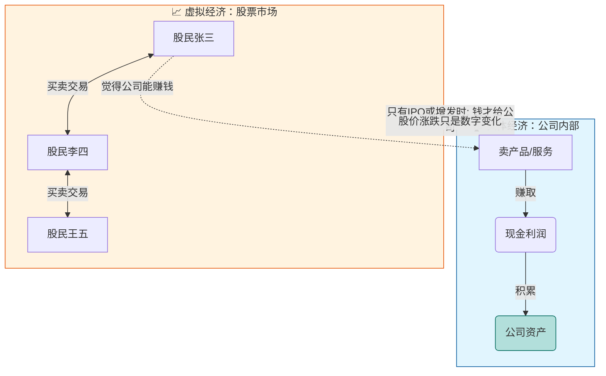
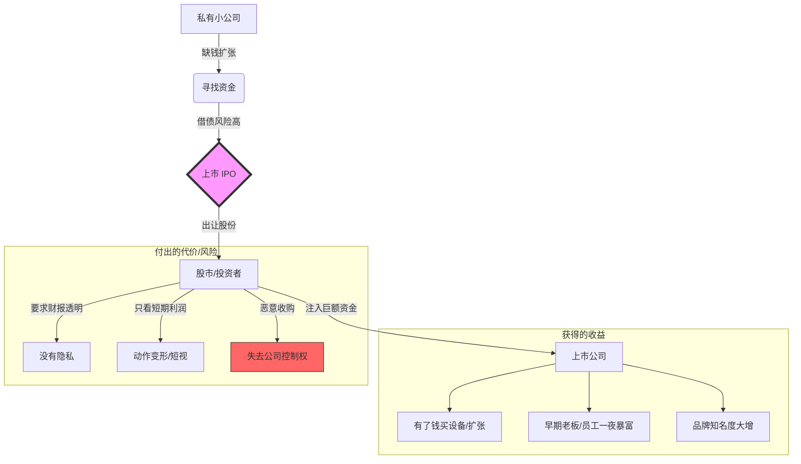
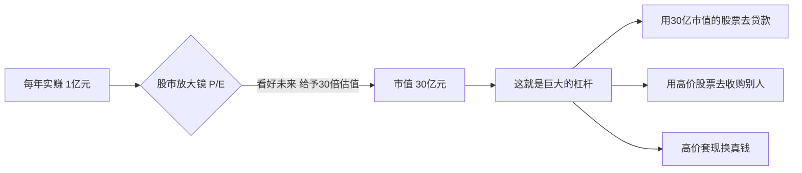
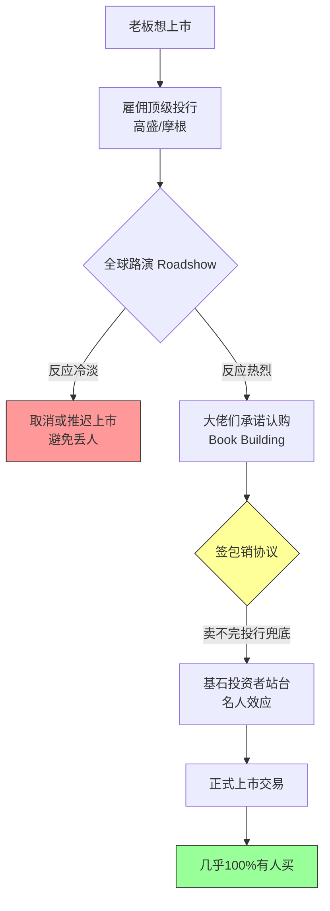

# 上市公司和股票市场的关系是什么？

>在电影电视剧里面我们常常听到股价一旦暴跌，公司就会破产，难道股市和公司是完完全全绑定在一起的吗，公司明明资产都在账户上并且都只靠市场上的销售产品赚钱，我现在只以为股票市场只是一个表现形式，如果股票市场暴涨，公司他的收入和资产会同步增长吗

你的直觉非常敏锐！👏👏👏

**你现在的理解其实比电视剧编剧更接近真相。**

简而言之：**股市确实只是一个“表现形式”（报价板）。**
*   如果你今天买了一股苹果公司的股票，你的钱是给了**“上一个卖股票的人”**，而不是给了**苹果公司**。苹果公司账上一分钱都没多。
*   同理，股价跌了，公司的厂房不会塌，银行账户里的现金也不会变少。

那为什么电视剧里总演“股价大跌，董事长破产跳楼”呢？这就涉及到了**“表面脱钩，背后暗连”**的机制。

让我们用**“房主与中介”**的例子来彻底讲透。

---

### 1. 🏠 形象比喻：房子（公司） vs 房价（股价）

假设你开了一家面包店（上市公司），这就好比你拥有一套**房子**。

*   **公司的运营**：你每天卖面包赚的钱，是你实打实的收入。这取决于面包好不好吃，客人多不多。
*   **股票市场**：店门口有一群房产中介（股民），他们每天对着你的店吆喝报价。
    *   今天心情好，喊：“这店值1000万！”
    *   明天恐慌了，喊：“这店只值100万！”

**问：** 如果中介喊价从1000万跌到100万，你会没法做面包了吗？你的面粉会突然消失吗？
**答：** **完全不会。** 你该烤面包还是烤面包，该赚客人的钱还是赚客人的钱。只要你的面包卖得出去，外面的报价对你**日常经营**几乎没影响。

👉 **结论：股价暴涨，公司收入不会同步增长；股价暴跌，公司资产也不会原地蒸发。**

---

### 2. 📺 既然如此，电视剧里为什么会“破产”？

既然经营不受影响，那电视剧里的老板为什么绝望？

通常是因为老板玩了一招危险的游戏，叫**“股权质押”**（借高利贷）。

**剧情是这样的：**
1.  **老板缺钱**：老板想买跑车或者扩大生意，但他手里没现金，只有一堆自家公司的股票（比如价值10个亿）。
2.  **抵押借款**：他把股票押给银行，借了5个亿现金。
    *   银行说：“如果股价跌了，你要补钱进来，不然我就强行卖你的股票。”
3.  **股价暴跌**：突然市场不好，股价腰斩。
4.  **爆仓危机**：银行为了止损，不问老板同不同意，直接把抵押的股票抛售（这叫**强平**）。
5.  **恶性循环**：银行抛售 -> 股价更低 -> 其他债主也来逼债 -> 老板失去了公司的控制权（被踢出局），或者因为还不上个人的债而破产。

**真相：** 是**老板个人**因为借钱玩脱了而破产，或者公司因为**信誉崩塌**借不到钱而倒闭，而不是因为“股价跌导致公司账户没钱”。

---

### 3. 🤝 股市对公司真的没用吗？（当然有用）

虽然平时股价涨跌不影响公司做生意，但在关键时刻有大用：

1.  **“印钞票”的能力（再融资）**：
    *   如果股价很高（比如100元），公司想建个新厂需要1亿。它只需要新印发 **100万股** 卖给市场就能拿到钱。
    *   如果股价很低（比如1元），它得印 **1亿股** 才行，这会把原来的股东稀释得很惨，大家都不同意。
    *   **所以：股价高 = 公司“融资”更容易，以后扩张更轻松。**

2.  **“面子”与军心**：
    *   股价涨，员工手里的期权值钱，干活更有劲。
    *   股价涨，银行觉得你实力强，愿意低利息借钱给你。

---

### 4. 📊 图解：公司与股市的真实关系

*   **注意中间的断层**：张三卖给李四（右边的循环），钱是在股民之间转，跟左边的公司没关系！只有在**IPO（首次上市）**或者**增发**的那一瞬间，股市的钱才会流进公司。

---

### 5. 🗣️ 费曼学习法引导输出

试着把这个逻辑讲给被电视剧误导的朋友听：

> **请尝试复述：**
> “电视剧里都是骗人的！股价跌了，公司的钱还在，机器还在。老板跳楼通常是因为他拿股票去**抵押借钱**了，股价一跌，银行逼债，他个人还不上才破产的。只要不欠债，股价跌到0.1元，公司照样可以卖产品赚钱！”

---

### 6. 📝 强化测试

**题目一：**
苹果公司今天的股价从 180涨到了 200美元。请问苹果公司的银行账户里今天多了多少钱？
A. 每股多了20美元
B. 一分钱都没多
C. 多了市值的10%

点击查看答案

**答案：B**
解析：这是二级市场交易，是股民A赚了股民B的钱。除非苹果公司今天正好向市场卖出新股票（增发），否则公司账上一分钱不到账。

**题目二：**
如果股价暴跌不直接影响公司账户，那为什么CEO们还是很在乎股价？（多选）
A. 因为股价低了，CEO自己持有的股票缩水了（个人财富减少）。
B. 股价太低，公司想再发股票借钱（融资）就很难了。
C. 股价太低，可能会被别的公司低价收购（野蛮人敲门），CEO会被炒鱿鱼。

点击查看答案

**答案：A, B, C 都是对的**
解析：虽然不影响当下的现金流，但影响未来的融资能力、管理层的财富以及公司的控制权安全。所以他们必须在乎。

# 公司为什么上市？股市的魅力

这就好比：**既然大海里有大白鲨、有巨浪，可能会把船打翻，为什么渔夫们还是要造更大的船出海，而不是老老实实呆在河沟里抓鱼？**

让我们用**费曼学习法**（用最简单的语言解释复杂的概念），把这个充满“诱惑”与“陷阱”的华尔街游戏拆解开来。

---

### 第一部分：核心比喻——“蛋糕”与“烤箱”

想象一下，你开了一家生意非常好的**手工面包店**（这就是一家未上市的私有公司）。

1.  **现状**：你每天能卖100个面包，赚的钱够养家糊口。你是老大，想几点开门就几点开门，没人能管你。
2.  **瓶颈**：你想把面包卖到全世界，你需要买巨大的工业烤箱、建大工厂、请几千个工人。这需要**10个亿**。
3.  **困境**：
    *   **靠攒钱**：你卖面包得卖几百年才能攒够。
    *   **找银行借**：银行怕你还不起，而且利息很高，每个月都要还钱，压力巨大。

这时候，**“股市”**（华尔街）这个魔法师出现了。他对你说：
> “把你面包店的所有权切成**1亿份**（这就叫股票），卖给我**30%** 的份额。我给你**10个亿**现金。这钱**不用还**，还没有利息。但是，以后赚的钱要分大家一点，而且你要听大家的话。”

**这就是为什么公司拼命想上市的根本原因：为了拿到那笔“不用还的巨款”来换取爆炸式的增长。**

---

### 第二部分：多角度解析——为什么明知山有虎，偏向虎山行？

#### 1. 融资的“核武器”：低成本扩张
上市（IPO）是企业获取资金最高效的方式。
*   **如果不上市**：你想通过收购对手来扩张，你得掏真金白银。
*   **如果上市了**：你可以直接**印股票**去买别人的公司！股票就是上市公司的“货币”。

#### 2. 原始股东的“套现离场” (Cash Out)
这是最现实的原因。
*   **场景**：你创业时，有些天使投资人给了你50万。他们等了10年，不是为了拿那点分红，而是为了在上市那一刻，把手里的股票卖掉，变成**5000万**甚至**5个亿**。
*   **压力**：背后的资本（风投VC/私募PE）是有时间期限的，他们会逼着公司上市，因为只有上市，他们的股票才能在市场上自由买卖，变成现金（这叫“退出机制”）。

#### 3. 品牌的“金字招牌”
上市本身就是一种实力的证明。
*   **信任度**：作为消费者或合作伙伴，你更愿意信任一家财务公开、受监管的“上市公司”，还是一个不知名的小作坊？上市能带来巨大的品牌光环。

#### 4. 吸引人才的“金手铐”
*   **画大饼**：公司没钱发高薪怎么办？给期权（股票）！告诉员工：“现在工资低点，等我们要上市了，这股票就值几百万！”
*   无数程序员在公司上市那一夜实现了财务自由。

---

### 第三部分：图解流程——从“控制”到“财富”的交易

为了让你更直观地理解这个过程，我们来看一下这个流程图：

---

### 第四部分：你担心的那些“危险”是真的吗？

你提到的“被抽空”、“被操控”、“陷入危机”，在历史上确实发生过，这叫做**“资本的反噬”**。

**1. 史蒂夫·乔布斯被赶出苹果**
*   **故事**：乔布斯创立了苹果，上市后，他手里的股份被稀释了。董事会（代表资本方）觉得乔布斯脾气臭、乱花钱，投票把他赶出了自己创立的公司。
*   **道理**：上市意味着**“公司不再完全属于你”**。如果你业绩不好，资本会换掉你。

**2. 华尔街的“吸血鬼”：做空机构**
*   **故事**：如果你的公司财务造假或者经营不善，华尔街的饿狼（做空机构）会盯着你，发布报告揭露你，把股价打压到地板上，甚至让你退市破产。
*   **道理**：上市就像在**玻璃房里洗澡**，你的一切都被无数双眼睛盯着，容不得半点沙子。

**3. 短视的诅咒**
*   **现象**：为了让股价好看，CEO可能不敢做长远的研发（因为费钱），只能拼命做漂亮的财务报表来讨好华尔街。这确实可能导致公司长远失去竞争力。

---

### 第五部分：举个生动的例子

**例子：阿里巴巴的上市之路**

*   **为什么要上？** 当年马云要和eBay竞争，要建物流，要搞云计算，这都是**烧钱**的无底洞。没有软银、雅虎的注资，没有后来的上市融资，阿里巴巴早就因为没钱发工资死在半路上了。
*   **代价是什么？** 马云个人的股份被稀释得很低。
*   **如何防御？** 为了防止像乔布斯那样被赶走，阿里设计了“合伙人制度”，确保哪怕马云股份很少，也依然拥有公司的控制权。

**总结**：公司上市就像**签订契约**。你出卖灵魂（部分控制权和隐私），魔鬼给你力量（无穷的资金）。只要你驾驭得好，你就是神；驾驭不好，就被魔鬼吃掉。但大多数有野心的公司，都自信能驾驭这股力量。

---

### 第六部分：拓展学习（由浅入深）

如果你想进一步了解这个残酷又迷人的游戏，可以关注以下概念：

1.  **同股不同权 (Dual-class stock structure)**：
    *   *解释*：为什么京东刘强东只有很少的股票，却能绝对控制公司？这是一种防御资本操控的手段。
2.  **SPAC (特殊目的收购公司)**：
    *   *解释*：一种走后门上市的玩法，比传统IPO更快，更疯狂。
3.  **退市 (Delisting) / 私有化**：
    *   *解释*：戴尔电脑曾经上市，后来老板觉得受够了华尔街的指指点点，又花钱把股票全买回来，变回了私有公司。这叫“私有化”。

---

### 第七部分：费曼式理解测试（加强环节）

为了确认你真的理解了，请尝试回答以下两道题目：

**题目 1：**
如果一家公司不仅不缺钱，现金流非常充裕，老板也不想受人监管，但他背后的风险投资人（VC）却拼命催促他上市。这是为什么？
A. 风投人觉得上市能让公司产品更好用。
B. 风投人想把手里的股份卖给股民，变现离场。
C. 风投人想让老板出名。

**题目 2：**
上市后，创始人最担心“资本操控”导致自己失去对公司的控制权（像乔布斯当年那样）。以下哪种情况最能体现这种风险？
A. 股价上涨，员工纷纷买车买房。
B. 竞争对手恶意收购了市场上51%的股票，然后重组董事会开除创始人。
C. 证监会要求公司每个季度公开财务报表。

👉 点击查看答案

**答案解析：**

1.  **选 B**。
    *   **解析**：资本是逐利的，且有时间成本。对于风投来说，公司产品好不好是次要的，重要的是他们当初投的钱能不能翻倍拿回来（Exit）。IPO是主要的变现渠道。

2.  **选 B**。
    *   **解析**：这就是典型的“恶意收购”（Hostile Takeover）。只要那是上市公司，理论上只要有钱买下足够多的筹码（股票），就能成为公司的新主人。这也是上市最大的危险之一。

# 不上市的理由，上市的构成理由与潜藏的危机

> 可以理解里面最核心的部分就是杠杆，但是为什么有的公司有避免并且不愿意上市，上市为什么又会给公司提供那么大的杠杆效应，就算公司发行了股份，如果没人买，那么它的杠杆儿是否就不存在

你的直觉非常敏锐！你抓住了**“杠杆”**这个关键词。

没错，股市对于企业来说，最大的作用就是加了一个巨大的**“财富放大器”（杠杆）**。

针对你的三个疑问，我们继续用拆解的方式来深入剖析。

---

### 第一部分：为什么有的公司坚决“不上市”？（拒绝杠杆）

既然杠杆这么好，为什么像**华为、老干妈、立白洗衣液**这些巨头坚决不上市？

因为“杠杆”是把双刃剑。不上市通常是为了保住以下三样东西：

1.  **绝对的“独裁”控制权**
    *   **场景**：任正非（华为创始人）想拿几百个亿去研发一个可能10年后才赚钱的6G技术。
    *   **如果上市了**：华尔街的股东会跳脚：“疯了吗？今年利润这么低，股价跌了怎么办？不许投！给我发分红！”
    *   **不上市**：老板说了算。不需要看股东脸色，不需要每季度发报表解释为什么花了这么多钱。**“长期主义”在股市里往往很难生存。**

2.  **商业机密的保护**
    *   **规则**：上市必须“透明”。你赚了多少、成本多少、大客户是谁、战略是什么，必须公开告诉全世界（包括你的竞争对手）。
    *   **不上市**：闷声发大财。老干妈卖了多少瓶，配方成本是多少，没人知道。

3.  **不缺钱**
    *   这是最凡尔赛的原因。像老干妈这种公司，一手交钱一手交货，现金流好得不得了，根本不需要向公众借钱。

> **总结**：不上市的公司，是用“慢发展”换取了“自由”和“安全”。

---

### 第二部分：上市的“杠杆效应”到底是从哪里来的？

你问得很关键：*为什么一上市，杠杆就那么大？*

这不仅仅是因为融到了钱，而是因为**“市盈率”（P/E Ratio）** 这个魔法倍数。

#### 1. 股票是通向未来的“时光机”
在私有公司，你今年赚1块钱，这1块钱就是实打实的1块钱。
但在股市，大家买的是**“预期”**。

*   **例子**：假设你有一家科技公司，今年赚了1个亿。
*   **股市逻辑**：股民认为你明年会赚2亿，后年赚5亿。所以，他们愿意按照你**现在利润的50倍**来给你估值。
*   **结果**：你明明只赚了1个亿（利润），但在股市里，你的公司值**50个亿**（市值）。

#### 2. 股票变成了“超强货币”
一旦你的公司值50个亿，你的股票就成了**印钞机**。

*   **收购对手**：你想买一家值10亿的竞争对手。你不需要掏现金，你只需要**印**价值10亿的股票给对方。
    *   *妙处*：因为你的市盈率高，你其实是用极少的成本（稀释一点点股份）就吞并了巨大的资产。这就是**“以小博大”的杠杆**。

#### 图解：市盈率放大器

---

### 第三部分：如果没有人买，杠杆就不存在了吗？

**答案是肯定的：是的！**

这也是股市最残酷的地方。这个概念叫做**“流动性”（Liquidity）**。

#### 1. 有价无市 = 废纸
如果在上市那天（或者上市后），根本没有人愿意掏钱买你的股票，或者买的人很少：
*   **破发**：发行价定10块，没人买，直接跌到5块。你的市值瞬间腰斩，杠杆断裂。
*   **流动性枯竭**：这就好比你有一套号称价值1亿的豪宅，但是挂牌三年都没人买。那它在急用钱的时候，价值就是**0**。

#### 2. 僵尸股（Zombie Stocks）
港股和美股有很多这种公司。虽然它们上市了，但每天的交易量只有几千块钱。
*   **后果**：
    *   想融资？没人买你的增发股票。
    *   想套现？老板一卖股票，股价就崩盘。
    *   **结论**：这种上市是失败的，不仅没享受到杠杆，还每年要交几百万的审计费维持上市地位。

---

### 第四部分：深度案例 —— 为什么特斯拉能活下来？

**特斯拉（Tesla）** 是解释“股市杠杆”最好的例子。

*   **曾经**：特斯拉亏损了很多年，如果是传统私有生意，早就破产了。
*   **股市杠杆救命**：但是华尔街相信它是“未来”，给了它极高的**估值（超高杠杆）**。
*   **操作**：马斯克利用这超高的股价，多次在股市里**增发股票**（向股民要钱）。
    *   因为股价高，他卖一点点股票就能融到几十亿美元。
    *   他用这些钱去建超级工厂、搞研发。
    *   最后，他真的把车造出来了，利润跟上了，把当初吹的牛实现了。

**这就是利用股市杠杆“无中生有”，把未来透支到现在使用的经典案例。**

---

### 第五部分：费曼式理解测试（加强环节）

为了确认你是否掌握了“杠杆”和“流动性”的关系，请回答：

**题目 1：**
A公司每年净利润100万，B公司每年亏损500万。但在股市上，B公司的市值却是A公司的100倍。根据“杠杆”原理，这最可能是因为？
A. B公司的老板更帅。
B. 股市出Bug了。
C. 市场认为A公司是夕阳产业（没前途），而B公司是未来的霸主（高增长预期），所以给了B极高的市盈率倍数。

**题目 2：**
某公司成功上市了，发行了1亿股。但是每天市场上只有几百个人交易，买卖很难成交。这就意味着：
A. 它的杠杆效应失效了，因为它缺乏“流动性”，股票无法高效变成资金。
B. 它很安全，因为没人能做空它。
C. 公司倒闭了。

👉 点击查看答案

**答案解析：**

1.  **选 C**。
    *   **解析**：股市的杠杆源于“预期”。亏损不可怕，可怕的是没未来。京东、亚马逊、特斯拉都曾长期亏损但市值巨大，因为大家相信它们未来会垄断市场。这就是**市盈率（预期）带来的杠杆**。

2.  **选 A**。
    *   **解析**：没有流动性的股票，就像印了头像的废纸。**只有能随时变现的资产，才具备金融杠杆属性。** 这种状态通常被称为“仙股”或“僵尸股”。

# 公司的决策，是否要上市？

这个问题问到了点子上！这其实是商业世界里最精彩的一场**“心理博弈”**。

老板当然不能对着空气盲目自信。为了确保上市那天有人买单，而不是尴尬地冷场，他们会雇佣一群世界上最精明的人来操盘。

这就像你要举办一场万人演唱会，你不会等到开场那天才去门口卖票。你会在半年前就开始找赞助商、搞预售、请媒体宣传。

在股市里，这个过程叫做**IPO承销（Underwriting）**。让我们看看老板是如何把“不确定”变成“确定”的。

---

### 第一部分：核心人物——“承销商”（The Underwriters）

老板想上市，首先要找**投资银行**（比如高盛、摩根士丹利、中金公司）。在这个环节，投行扮演了**“包工头”**和**“推销员”**的角色。

投行对老板说：“你专心搞业务，卖股票这事交给我。我手头有几千个有钱的大客户，我保证把你的股票卖出去。但是，我要收**7%** 的手续费。”

这笔巨额手续费，买的就是**“确定性”**。

---

### 第二部分：关键流程——“路演”与“询价” (Roadshow & Book Building)

在正式上市敲钟之前的几个月，老板和投行的人会坐着私人飞机满世界跑，这叫**“路演”（Roadshow）**。

1.  **见大佬（机构投资者）**：
    他们不是去见普通的散户（小韭菜），而是去见**基金经理、保险公司、主权财富基金**这些手握几百亿资金的“鲸鱼”。

2.  **兜售故事**：
    老板会做PPT演讲：“我有技术，我有市场，买我的股票虽然现在贵，但明年能翻倍！”

3.  **摸底（询价）**：
    这是最关键的一步！投行会问这些大佬：“如果定在这个价格，你会买多少？”
    *   **大佬A**：“没兴趣，太贵。”
    *   **大佬B**：“如果便宜10%，我买5000万美元。”
    *   **大佬C**：“太棒了！我要买1个亿！”

**结论**：在上市那一天到来**之前**，投行的小本本上其实已经记满了订单。**股票其实在上市前就已经“预售”给这些大机构了。** 

如果路演一圈下来，大家都没兴趣怎么办？**那就不上市了（撤回IPO申请）**。所以你能看到的上市公司，都是在路演阶段已经确信有人买单的。

---

### 第三部分：终极保险——“包销协议” (Firm Commitment)

这是老板最底气的来源。

为了防止意外，公司通常会和投行签一个**“包销协议”**。
*   **协议内容**：投行承诺，如果股票卖不出去，**投行自己掏腰包把剩下的全买下来！**
*   **例子**：公司要卖1亿股。路演只卖掉了8000万股。剩下的2000万股，高盛（投行）必须自己花钱买下来，烂在自己手里。

因为投行不想亏钱，所以他们会拼命帮你定价、拼命帮你推销。**投行的信誉和钱包，就是公司上市不冷场的担保。**

---

### 第四部分：基石投资者 (Cornerstone Investors)

为了让市场更有信心，老板还会拉几个**“带头大哥”**来站台，这些人叫**基石投资者**。

*   **操作**：比如小米上市时，李嘉诚、马云这些大佬承诺：“不管怎么样，我先买几千万，而且锁定半年不卖。”
*   **效应**：散户一看，“哇，马云都买了，那肯定没问题啊！”于是大家蜂拥而上。
*   **作用**：这就好比饭店门口排队的“托儿”，或者是明星代言，用来消除普通投资者的恐惧。

---

### 第五部分：图解 IPO 安全网

让我们看看这个严密的“防冷场”系统：

---

### 第六部分：有没有“翻车”的时候？

当然有，如果你也是高手，你可能会想到：

1.  **流血上市**：
    路演时大家嫌贵，老板急着用钱，只能**大降价**。本来想卖100块，最后含泪卖50块。虽然有人买了，但公司“流血”了。

2.  **破发（跌破发行价）**：
    虽然机构在上市前买了，但上市第一天如果散户不接盘，机构就会恐慌抛售。
    *   *例子*：Facebook上市第一天差点跌破发行价，全靠承销商（投行）在后面拼命花钱护盘才勉强撑住面子。

3.  **直接上市 (Direct Listing)**：
    像Spotify这种公司，足够自信（且为了省给投行的手续费），不找投行包销，直接把股票挂上去卖。这就真的有风险，如果没人买就真没人买。但通常只有超级明星公司敢这么玩。

---

### 第七部分：费曼式理解测试（加强环节）

**题目 1：**
为什么你在新闻里很少听到“某公司昨天上市，结果一股都没卖出去”这种事？
A. 因为运气好。
B. 因为如果路演时没人买，投行会建议公司取消上市，根本不会走到“敲钟”这一步。
C. 因为证监会强制要求每个人必须买一点。

**题目 2：**
所谓的“包销协议”对投行（承销商）意味着什么？
A. 投行只是个中介，卖不出去跟他们没关系。
B. 投行承担了巨大的风险，如果定价太高卖不掉，投行就得自己花钱买下这些股票。
C. 投行可以随意更改股票价格。

👉 点击查看答案

**答案解析：**

1.  **选 B**。
    *   **解析**：这就叫**“幸存者偏差”**。你看到的都是成功的，失败的早在路演阶段就胎死腹中了（比如WeWork当年的第一次IPO尝试就惨败撤回）。

2.  **选 B**。
    *   **解析**：这就是投行为什么要收那么高昂手续费的原因。他们是用自己的资金在为公司做担保。如果砸在手里，投行那一年的奖金就全泡汤了。

