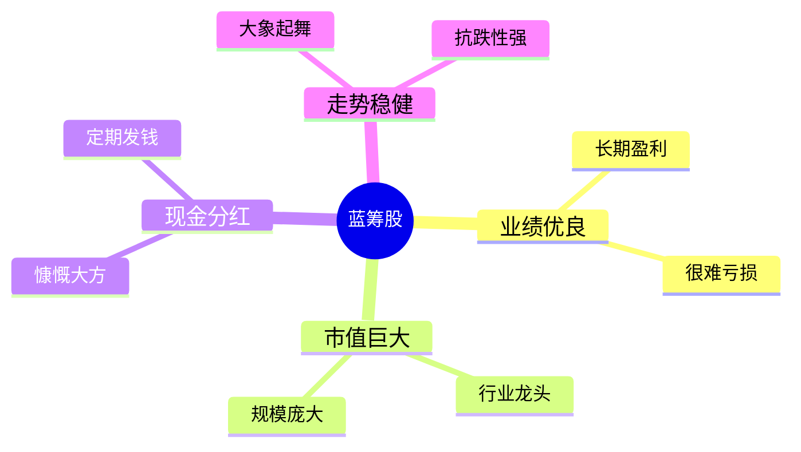

---
aliases:
  - 成份股
  - 白马股
---

你好！我是你的老师。今天我们来聊聊股市里也是最“稳重”、最“大牌”的一类角色——**蓝筹股（Blue Chip Stocks）**。

想象一下，我们不是在谈论复杂的金融图表，而是在谈论一种**身份象征**。

---

### 🎓 第一部分：什么是“蓝筹”？（费曼式引导）

#### 1. 名字的由来：赌场的筹码
“蓝筹”这个词其实最早来自**扑克牌桌**。在西方的赌场里，筹码通常有三种颜色：白色、红色、蓝色。
*   白色最便宜。
*   红色中等。
*   **蓝色最贵**（最值钱）。

所以，华尔街的人就借用了这个概念：**把股市里那些最值钱、最赚钱、地位最高的公司，称为“蓝筹股”。**

#### 2. 超级形象的比喻：班里的“老班长”
如果把股市看作一个**班级**，里面有几千个学生（上市公司）：
*   **差生/留级生**：经常考试不及格（亏损），随时可能被劝退（退市），这就是“垃圾股”。
*   **体育特长生**：有时候跑得飞快（股价暴涨），但有时候也会摔大跟头（暴跌），成绩不稳定，这就是“题材股”或“妖股”。
*   **蓝筹股是谁？**
    *   他是**老班长**。
    *   **成绩好**：每次考试都在前几名，从来不掉链子（业绩常年稳定增长）。
    *   **家里有钱**：家底厚实，甚至富可敌国（市值巨大）。
    *   **人缘好/大方**：经常请全班同学喝饮料（**高分红**，给股东发现金）。
    *   **历史悠久**：从一年级就在当班长，大家都信得过他（行业龙头，抗风险能力强）。

---

### 📊 第二部分：图解蓝筹股的核心特质

为了让你一眼看懂，我画了一张蓝筹股的“人设图”：

**简单总结就是：大、稳、赚、分。**

---

### 🌰 第三部分：生活中的实战举例

蓝筹股通常都是你**看得见、摸得着、离不开**的公司。

#### 场景一：你每天都在用的
*   **可口可乐 (Coca-Cola)**：
    *   不管经济好不好，大家都要喝可乐。它卖了一百多年，赚了全世界的钱，每年都给股东分红。它就是美股的超级蓝筹。
*   **苹果 (Apple)**：
    *   手里现金多得吓人，手机卖遍全球，这就是科技界的蓝筹。

#### 场景二：国内的巨无霸（A股市场）
*   **贵州茅台**：
    *   被称为“A股股王”。只要请客吃饭喝酒的文化还在，它就很赚钱，股价虽然贵，但非常稳。
*   **工商银行**：
    *   号称“宇宙行”。你把钱存银行，银行拿去赚钱。它的特点是分红特别高，甚至比你存定期的利息还高，股价波动很小，非常适合不想折腾的人。

**🤔 什么时候你会买蓝筹股？**
*   **想给养老金找个去处**：不想每天提心吊胆看盘，只想每年拿稳定的分红。
*   **市场大跌时**：大家都在恐慌卖出，但蓝筹股因为底子厚，通常是“避风港”，跌得比别人少，反弹时又是中流砥柱。

---

### 🚀 第四部分：知识拓展（由浅入深）

既然懂了蓝筹股，我们再多学一点点，把知识串起来：

1.  **红筹股 (Red Chip)**：
    *   这是特指在**香港上市**，但是背景是**中国大陆政府**或者主要业务在大陆的公司。比如“中国移动”在香港上市时，就被称为红筹股。（因为红色代表中国）。
2.  **白马股 (White Horse)**：
    *   和蓝筹股很像，但更强调**“业绩明朗”**。所有的信息都很透明，大家都知道它好。蓝筹股一般都是白马股，但白马股不一定是巨无霸蓝筹（可能规模稍小一点，但在高速成长期）。
3.  **成份股**：
    *   蓝筹股通常会被选入最重要的指数里。比如美国的**道琼斯指数**（30家最好的公司），中国的**上证50指数**（上海最好的50家公司）。

**⚠️ 注意事项（缺点）：**
*   **大象难跳舞**：蓝筹股因为太大了，很难像小公司那样一年翻好几倍。它求的是“稳”，不是“暴富”。

---

### 🧠 第五部分：课后加强练习（测测你真懂了吗？）

请回答以下两道题目，我会给出解析。

#### 题目 1：选秀大会
假设你有100万，想要投资股票。你的目标是：**“我不想每天盯着盘面看，心脏受不了刺激，我希望每年能拿到比银行利息高一点的钱，作为生活费。”**
请问你会选择以下哪家公司？

*   A. **“未来星际飞船无限公司”**：刚刚成立3年，还没盈利，老板说如果研发成功，股价能翻100倍，失败了就破产。
*   B. **“长江电力”**：拥有好几座大型水电站（包括三峡），每天水流过就在印钞票，业绩极其稳定，每年雷打不动给股东分红。
*   C. **“神秘代码科技”**：最近股价每天上下波动20%，大家都说它是下一个风口。

#### 题目 2：危机时刻
金融危机来了，股市大崩盘，大部分股票跌了50%。通常情况下，蓝筹股的表现会是怎样的？

*   A. 因为公司大，跑得慢，所以跌得最惨，直接退市。
*   B. 相对抗跌，可能只跌了20%-30%，并且在危机过后，往往最先恢复元气。
*   C. 没有任何影响，还能逆势涨停。

---

### ✅ 答案与解析

**题目 1 答案：B**
*   **解析**：
    *   A是典型的**初创/风险股**，高风险高回报，不适合求稳。
    *   B是典型的**蓝筹股**。水电站是国家基础设施，护城河极深，现金流充沛，分红稳定。符合“老班长”的特质。
    *   C是**题材股/妖股**，适合赌博心态，不适合当生活费来源。

**题目 2 答案：B**
*   **解析**：
    *   蓝筹股不是神，大盘崩了它也会跌（所以C错）。
    *   但是因为它有真实的利润和资产支撑，投资者知道它不会倒闭，所以虽然会跌，但比起那些没有业绩支撑的空气股，它跌得少，且恢复得快（抗跌性）。A选项说它会直接退市是不符合蓝筹股特征的。

今天关于“蓝筹股”的课程就到这里，是不是感觉像认识了一位“有钱又稳重的朋友”？希望这对你的投资认知有帮助！